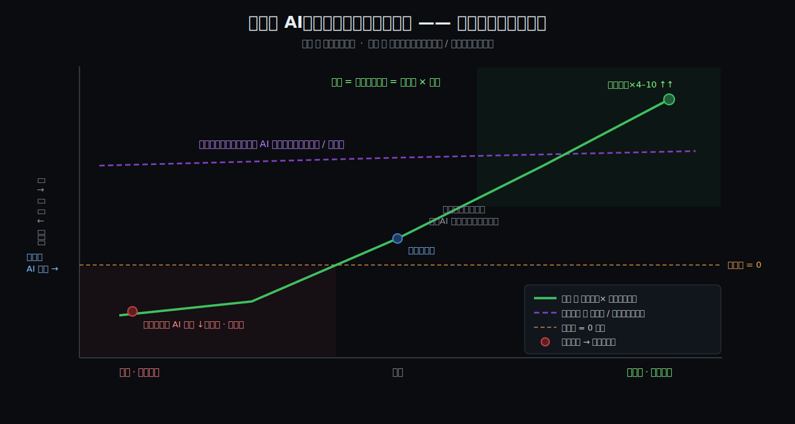
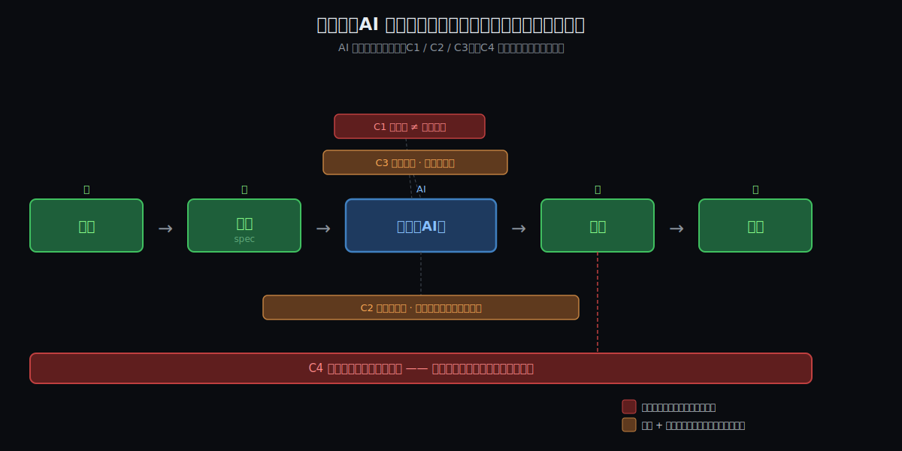

# AI 时代到底要不要学底层机制？ | atlas 综合文档

> 一句话结论：**AI 是放大器，不是均衡器；它放大的是判断力，而判断力 = 底层认知（技术 + 需求）长出的那张"尺子"。要不要学底层，不是成本问题，是"你的人能不能用得动 AI"的前提问题。**

## 导读地图

这篇长文从一个真实困惑出发，用第一性原理一步步推到底。

**灵魂问题**：
> 同样一套顶级 AI 工具，为什么初级用了还一堆坑、架构师用了效率飞起？这"AI 不平等对待程序员"的底层原理是什么——是更懂底层、更会写 prompt、还是更能识破幻觉？

**这一路怎么走的**：

- ✅ **它是什么**（What）：AI 是放大器不是均衡器，产出 = 判断力 × 增益
- ✅ **为什么**（Why）：锁死它的 4 把结构性约束（C1–C4）
- ✅ **怎么驾驭**（How）：判断力咬住 4 把锁的三件事 + 那张"尺子"
- ✅ **现实佐证**：权威 + 实证，含一条诚实反证（METR）
- ❌ Deep / Comparison：分水岭选了收束，跳过
- ✅ **怎么落地**（Synthesis）：给主管的招人 / 培养 / 实操方法论

**全长约 658 行。** 想要结论，直接跳到最后一篇《怎么落地》；想看推理，从头读。


## 约束清单速查（C1–C4）

> 这是全文的脊梁，后面每一篇都回来引它。

#### C1 — 生成了 ≠ 就是对的
AI 优化"看起来对"，不是"真的对"。**纯硬**。
口诀：它自信，不代表它对。

#### C2 — 上下文有限，越复杂越看不见全局
窗口装不下复杂系统，长上下文注意力衰减、丢三落四。**硬核 + 软边**。
口诀：它做局部最优，缺一张全局地图。

#### C3 — AI 自信"讨好"，盲信会复利放大
不懂也硬给一个看着对的；复杂链条上每步盲信 → 误差复利。**硬核 + 软边**。
口诀：别无条件信，逐步把关。

#### C4 — 必须有人验证 + 兜底
验证 ≠ 生成（地板）；担责 ≠ 能力（人来扛）。**纯硬**。
口诀：最后签字的，得是能负责的人。


# 阶段 1：AI 是放大器，不是均衡器 —— 先把现象的轮廓画清楚

> 这一节只做一件事：把"我们到底在解释什么"的**形状**立住。先不碰机制（为什么会这样、靠什么零件，是后面的事），只让你能指着图说"喏，就是这个形状"。

## 背景：两种世界观在打架

当下主流叙事是：**程序员要被 AI 取代了**。Claude Code / Codex 这类 coding agent 表现亮眼，于是很多人不假思索地推到极端——"AI 能自主替代所有程序员"。这套叙事的内核里，AI 是一台 **均衡器 / 替代器**：它把"会不会编程"这件事拉平，人人都能让 AI 把活干了，差距被抹掉。

但有人（你，重度使用者 + 部门主管）手里攥着**反例数据**：

- 你自己重度用 AI，效率涨了 **4–10 倍**，一个人把后端 → 前端 → QA → 部署全 cover 了；
- 可你在公司推全员 AI 时，撞见两个"反常"现象：
  - **① 程序员水平越低，越抵触 AI；**
  - **② 初级程序员用了 AI，效率反而下降。**

如果 AI 真是"均衡器 / 替代器"，这两个现象不该出现——水平低的人本该受益最大才对。**现象和叙事对不上。对不上，就说明叙事里 AI 的"形状"画错了。** 这一节就是把正确的形状画出来。

## 一句话定义

> **AI 是按比例放大你判断力的乘法器；不是均衡器，更不是替代器。**

拆开看：

- **不是替代器**：它不替你做判断，它**放大**你的判断（好的坏的一起放大）。
- **不是均衡器**：它不把人拉到同一条线；
- **是乘法器**：`净产出 = 你的判断力 × AI增益`。是**乘法**，不是加法——这一个字的差别，是整篇的脊梁。

## 跨领域类比：一台功放

把 AI 想成一台**音响功放**：

- 你唱得准 → 它放大成震撼全场的好声音；
- 你跑调 → 它放大成**震耳欲聋的跑调**。

功放不会帮你修音准，它只忠实地把你的"**信号 + 噪声**"一起按增益放大。**信噪比是你定的**，功放只负责放大。一句话："垃圾进，放大的垃圾出"（garbage in, amplified garbage out）。

> 辅助直觉（杠杆）：AI 是力臂，你的判断力是支点。支点扎实 → 四两拨千斤；支点是浮沙 → 力臂越长，翻得越惨，甚至**反向**用力。

## 一张全景图：发散锥



从图上能直接读出 5 件事：

1. **横轴是使用者判断力**（左＝初级，右＝架构师），同一束 AI 输入进去；
2. **现实是那条绿色实线（放大器）**：判断力越高，产出越往上冲（你的 ×4–10 在最右上角）；
3. **判断力低的那头，实线扎到了 0 线以下**——这正是你的现象②：初级用了 AI **净产出为负**（生成飞快，但验证 / 返工 / 事故吃光了收益，还倒贴）；
4. **那条紫色虚线（均衡器）是流行叙事的幻想**：以为 AI 会把所有人拉到同一条高线。现实里根本没有这条线；
5. 两条线张开的那个**夹角**，就是"**AI 不平等对待程序员**"——它不是 bug，是乘法器的数学必然。

## 为什么"乘法"必然发散（一行算式）

- **加法（均衡器）**：`out = 判断力 + C`。给谁都 +C，相对差距被压平 → 看起来"把人拉平"。
- **乘法（放大器）**：`out = 判断力 × 增益`。差距按倍率**放大**；更要命的是——**判断力若是负的（净制造麻烦），× 增益放大的是亏损**。

所以现象 ① ② 不是意外：低（甚至负）的 base，乘上一个大增益 = **更快地把事情搞砸**。水平低的人本能"抵触"，是身体比脑子先闻到了"风险正在被放大"。

## 关键词速查（后面反复用）

| 术语 | 一句话 |
|------|--------|
| **放大器 / 乘法器** | `产出 = 判断力 × 增益`；放大比例、扩大差距 |
| **均衡器** | 流行幻想里的 AI：人人 +C、差距抹平（与现象矛盾，错） |
| **替代器** | 更激进的幻想：AI 自主取代人、判断力可省（错） |
| **增益（gain）** | AI 这一轮带来的倍率；4–10× 是你实测的上界 |
| **判断力（乘数）** | 被放大的那个 base —— 它**由什么零件构成**，是后面要钉死的核心 |
| **信噪比** | 你喂给 AI 的意图 / 规约里，有效信号 vs 噪声之比 |
| **幻觉（噪声）** | AI 自信地输出的错误；低信噪比下被一起放大 |
| **验证回路** | 人检验—修正 AI 产出的那个环；放大器朝正还是负，取决于它转得快不快 |

## 它卡在"人机协作回路"的哪一节

```
   你 ────────────────► AI ──────────► 你
 意图 → 规约(spec) → prompt → [生成] → 产出 → 验证 → 修正 ─┐
   ▲                                                       │
   └───────────────────── 回灌 ──────────────────────────────┘
                          ▲
               放大器嵌在「生成」这一环，
               但增益是正是负，由人控制的
               「规约」和「验证」两环掐着。
```

注意：**AI 只占"生成"一环**；它前面的"意图 / 规约"、后面的"验证 / 修正"全在**人**手里。放大器的增益方向（正 / 负），是被这几个"人环"掐住的。你那 ×4–10，挣的不是"生成"那一下，而是你**把规约写准 + 把验证转快**的本事被放大了。

## 判断力（乘数）的成分表（初拆）

被放大的"判断力"不是一坨，至少拆成**三根轴**——前两根你拆的，第三根你刚补的：

- **① 业务判断力**：消化需求的能力——不只听客户要什么，还能理解需求的**动因**、共情痛点、找到**底层的需求出发点**，做出更准的"**该建什么**"的判断。
- **② 编排判断力（tasking）**：把一坨难活拆成 agent 啃得动的小块的能力——你说得好，这是"**将难的事情变容易的能力**"。能拆，才写得出 AI 能正确理解的 prompt；拆不动，prompt 必然糊。
- **③ 技术判断力**：技术深度——理解的技术原理越多，判断越强。**是"理解原理"，不是"背八股文"**：能背 GC 分代假设拿不到这根轴，能判断"这段代码会不会在高并发下 OOM"才拿得到。

关键是：**三根轴正好把协作回路从头铺到尾，AI 只夹在中间那一下**——

| 轴 | 卡在回路的哪一段 | 作用 | 它失守时 |
|----|----------------|------|---------|
| **① 业务判断** | **前段**：意图 → 规约(spec) | 决定"信号"对不对 | 规约错 → AI 把**错的东西**造得完美无瑕 |
| **② 编排判断** | **中段**：规约 → 拆成 agent 任务 | 决定喂进去的块"啃不啃得动" | 拆不动 → prompt 糊 → AI 自由发挥 |
| **③ 技术判断** | **后段**：验证 → 修正 | 决定"噪声"滤不滤得掉 | 验不动 → 幻觉 / 隐患被一起放大上线 |

> **AI 自动化的，恰恰只是中间"生成"那一下**——它前面（业务 + 编排）、后面（技术）全是人。所以**初级翻负**就顺理成章：他们**三段都弱**——讲不清要什么、拆不成能啃的块、验不出对不对；唯一交出去的"生成"本来就不是瓶颈。等于把不堵的那段修宽了，三个真堵点原封不动。

### "造得完美无瑕"的死法图鉴（技术判断端）

你说"AI 把错的东西造得完美无瑕，初级根本识别不出来"——太真实了。下面这些的共同点：**编译通过、读着像教科书、单测能过、demo 跑得欢，底下却埋着雷**。AI 不会主动报警（这不是语法错，是判断错），它**自信地交付**——这正是你说的"幻觉"；识破它，靠的就是技术深度：

| # | AI 造出来的"完美" | 底下的雷 | 一眼看穿要靠（底层） |
|---|------------------|---------|-------------------|
| 1 | 教科书般的双重检查锁单例（DCL），少了个 `volatile` | 指令重排 → 别的线程拿到**半构造对象**；千分之一概率偶发，测不出来 | JMM / happens-before |
| 2 | 漂亮的 `ThreadLocal` 缓存，线程池里用，没 `remove()` | 线程复用 → 引用永不释放 → 一周后 prod **OOM** | GC 可达性 / 堆分析 |
| 3 | 干净的 `WHERE DATE(created_at)=...` | 列上套函数 → **索引失效、全表扫**；一千行没事，一亿行熔断 | 索引 sargability / 执行计划 |
| 4 | 标准的 `@Transactional` 方法，被**同类里另一个方法调用** | Spring 代理被绕过 → **事务静默不生效**，该回滚时没回滚 | 动态代理 / AOP 机制 |
| 5 | "更健壮"的失败重试 | 没幂等 → 网络抖一下 → **重复扣款** | 分布式语义（at-least-once） |
| 6 | 完全照 ticket 实现的导出功能 | ticket 本身把需求理解错了 → 代码完美，**造的是没人要的东西** | 业务判断（前段，不在此端） |

第 1~5 个全靠**技术判断（后段）**接住，第 6 个得靠**业务判断（前段）**——一个雷埋在出口，一个雷埋在入口，**中间的 AI 一律"造得完美无瑕"**。初级两端都嫩，于是雷全部带电上线。

> 🔪 关于那把刀刃（"底层知识本身 vs 底层养出的判断"）：**你自己已经替它砍了一刀**——你强调"不是背诵、不是八股文"。进乘数的是**底层养出的"判断"**，底层知识是**最好的健身房**，被放大的是练出来的那块肌肉，不是器械清单。这一刀先记下，Deep 阶段再钉死。

### 架构师那张"图"里装了什么（编排判断的内核）

你描述了自己做需求时的内部过程：**那张图一旦完整，你就敢说"可落地了"；不完整，就继续拆、继续分析。** 这张图里装的，远不止功能分解：

- **非功能需求**：鉴权、性能、安全……
- **技术选型**：拿什么去实现每一块；
- **风险预判**：哪些点会出 bug、哪些需求是难的；
- **一个信心闸**：图完整 ＝ "可落地"的 go 信号，图残缺 ＝ "继续分析"的 stop 信号。

一句话：**架构师的图，本质是一次"把失败提前算出来"的心智仿真。** 这恰恰是 AI 结构性端不住的东西——它是**全局**的（AI 只盯 token 局部的下一步）、**系统特异**的（你那些雷藏在你这套代码 / 团队 / 基建的历史里，不在 AI 的上下文里）、而且是**负向知识**（"哪里会炸"是预测失败，跟 AI"生成看起来对的东西"正好相反）。更关键的是那个**信心闸**：AI 没有 stop 信号，它**永远自信地往下生成**，从不说"这我还没想透，先别写"。

> 为什么这是"结构性"而非"偶然"——留到下一节，用一份硬清单逐条钉。

## 呼应灵魂问题

你的灵魂问题是："为什么同样的 AI，产出随人发散；是不是因为我更懂底层？"

这一节立住了**形状**（放大器 ≠ 均衡器 ≠ 替代器；`产出 = 判断力 × 增益`；负 base 会翻车），也就**证明了"会发散"是数学必然**——你看到的不是错觉。

但它**故意还没回答**最关键的那半句：**那个被放大的"判断力（乘数）"，到底由什么零件构成？**

你已经给了三个候选——① 懂底层、② 会写 prompt、③ 识破幻觉；你还加了一个强倾向：**底层知识（Linux 内核 / 网络 / GC / Spring 源码 / DB 调优）+ 设计模式 = 卓越开发者的必经之路**。这些都是"乘数的成分表"假设。

> ⚠️ 这里我替你保留一把**刀刃**，留到后面钉：被放大的，**究竟是"底层知识"本身，还是"底层知识长出来的那种判断力 / 品味 / 验证直觉"**？这俩听着一样，但对你做主管的培养决策，差别是天上地下——前者 ＝"多背内核源码"，后者 ＝"练某种判断肌肉，而底层只是练它最好的健身房"。

成分表怎么拆、每种成分凭什么进乘数、底层到底是"成分"还是"产地"——是后面几节（约束 → 机制 → 反事实）要一个个钉的。

> 📌 **用户阶段性结论（What 收束）**：AI 不替代程序员，而是程序员的**放大器**——它放大程序员**已有**的能力；但前提是你**驾驭**得了它（否则放大的是窟窿）。驾驭 AI 需同时握住三样，正好对应三根轴：① **深厚技术功底**（懂原理、识破幻觉 → 验证端）② **高效沟通与思考**（吃透需求 → 需求端）③ **无歧义的任务拆解**（把难题拆成清晰 prompt → 编排端）。三样齐 ＝ 杠杆；缺一样 ＝ 风险放大器。
>
> 精确化（Claude 补）：与其说"AI 不替代程序员"，不如说**它替代的是"生成"那一环（本就不是瓶颈），动不了"判断"那两端**。
>
> ⚠️ 这是"**形状**"层面的结论——看出来了，但还没**证**。"AI 凭什么结构性地替不了这三样"，下一节用硬清单逐条证。

---

> 上面画清了形状——AI 是放大器。但"放大器"只是现象。下一篇回到原点：到底是哪几条**绕不过去的约束**，把 AI 锁死成"只能放大、不能替代"？从这里起，你会从看热闹切换到**较真**——一条条审，每条都附"什么情况下它会被突破"，专防把"暂时"吹成"永远"。

---

# 阶段 2：为什么 AI 注定是"放大器"——四把锁，把它锁在"生成"那一格

> 上一节立住了**形状**（放大器 ≠ 均衡器）。这一节回答**凭什么**：把"AI 结构性替不了判断"这句话，拆成几条**能一条条查、能一条条反驳**的硬约束。
> 每条都附"**什么情况下它会被突破**"——突破条件越苛刻，它越是**结构性**；越轻松，它越只是**暂时**。这一栏专门防我（和任何人）把"暂时"吹成"永远"。

## 先看那个被很多人信以为真的世界：AI 真能替代程序员

要让"AI 自主替代所有程序员"成真，下面这些**必须同时**为真：

1. AI 生成出来的，**就是对的**——你不用验；
2. 它**装得下你整个复杂系统**，不会丢三落四；
3. 它**不懂会说不懂**，不会自信地瞎编；
4. 出了事，**它来兜底担责**。

现实是：这几件事**一件都不成立**。下面 4 条约束，就是它们不成立的**精确原因**。

## 四条不可再分的硬约束（C1–C4）

> 这 4 条是一条**因果链**：前三条是 AI 的毛病（会错 / 看不见全局 / 自信瞎编），第四条是被前三条**逼出来的必然**（所以人必须验证 + 兜底）。

#### C1 — 生成了 ≠ 就是对的
**大白话**：AI 把代码"生成出来"了，不代表它"对"。它优化的是"看起来对"，不是"真的对"。
**为什么不可再分**：这是训练目标决定的，不是"还不够强"——它被训练成"让你**觉得**对"。所以会**自信地**产出看着对的错。
**突破条件**：除非能直接拿"客观正确"当训练目标去优化；但多数软件没有可大规模标注的"标准答案"（有的话就不需要人判断了）。→ **纯硬**

#### C2 — 上下文有限，项目越复杂越看不见全局
**大白话**：AI 的"视野"（上下文窗口）是有限的。项目一复杂，它就**看不到全局**，容易**丢三落四**——改了 A，忘了还有个 B 依赖 A；补了这块，漏了那块。
**为什么不可再分**：窗口装不下你整个复杂系统；而且就算硬塞进去，长上下文里它的注意力也会**衰减**（越往后越"读到后面忘前面"）。它做的永远是**局部最优**，手里缺一张**全局地图**。
**突破条件**：窗口会变大、能缓解一部分（**软边**）；但"系统越复杂、全局一致性越难维持"是结构性的，加上有些上下文（团队默契、历史决策、为什么当年这么设计）**根本没写下来**（**硬核**）。→ **硬核 + 软边**

#### C3 — AI 自信"讨好"，会替你编一个看着对的答案
**大白话**：AI 很自信。**它不懂的，为了"讨好"你，也会硬给一个看上去很对的答案**，而不是老实说"我不确定"。更要命的是：项目一复杂，如果你**每一步都无条件信它**，这些小错会**一级一级累加、放大**，最后滚成一个收不住的烂摊子。
**为什么不可再分**：① 它没有可靠的"我不知道"信号（讨好倾向 + 置信度校准差）；② 错误在多步骤链条上会**复利式累积**——这是数学，不是态度问题。
**突破条件**：讨好 / 校准会随训练改善（**软边**）；但"复杂链条上盲信 → 误差复利"是结构性的，只要你放弃逐步把关就会发生（**硬核**）。→ **硬核 + 软边**

> 🔴 **真实反例（初级最常犯，C3 的活体标本）**：初级程序员**自己不消化需求**，把客户的**原始需求文档直接甩给 AI** 让它自己理解。
> 这一下正中 C3：原始需求本就模糊（你没替它消化）+ AI 不会停下来追问、只会**自信地猜着造**，再叠加 C2（文档里没有真实意图、没有领域手感、没有全局）。
> 结果：**代码越堆越乱、拖慢整体进度、bug 比古法手写还多。** —— 这就是 What 那张发散锥里"**判断力为负 × 增益 = 放大亏损**"的现场：你没消化的那份模糊，被 AI **高速复制 + 放大**了。
> 反过来，就是高手的动作：**先自己把原始需求消化成无歧义的规约，再喂给 AI**。这一步（业务 + 编排判断）恰恰是 AI 替不了、初级也还没练出来的。

> 注：最初单列的"需求天生有歧义"，本质也是"AI 不懂你真正要什么、却照样自信地编"——已并入这把锁。

#### C4 — 必须有人验证、有人兜底（合并：验证是地板 + 责任只能人担）
**大白话**：正因为上面三条，AI 的产出**必须有人来验**，而且最后**必须有人来兜底担责**。这一步，绕不过去。
**两个面**：
- **验证是地板**：AI 把"写"砍到接近 0，但"检查它对不对"的成本没降；产量一大，验证总量反而更高。
- **兜底是底线**：线上炸了，担责的是**人**，不是模型；最终签字的，必须是能负责的人。
**为什么不可再分**：验证 ≠ 生成（这是 epistemic 的，检查本身不可省）；担责 ≠ 能力（这是 legal / 组织的，跟模型多强无关）。
**突破条件**：除非验证能被**可信地**自动化（递归到"谁验证那个验证者"）+ 社会把责任主体改成 AI（法律伦理变迁）——两者都不是"模型再强一点"能做到的。→ **纯硬**

> **4 把锁：2 把纯硬（C1 / C4）+ 2 把"硬核 + 软边"（C2 / C3）。**
> 软的部分（窗口会变大、校准会改善）会随模型缓解；但每把锁都有一个**纹丝不动的硬核**。没有一条是"再练两年整把破掉"的纯软货——**这就是"结构性"三个字的证据。**



> 图里一眼看懂：AI 只占中间"生成"一格（蓝），这格有三个毛病（C1 会错 / C2 看不见全局 / C3 自信瞎编）；**C4 是那道必须有人把守的墙**（红），把守它的，是人（绿）。

## 核心 insight（一句话记住）

> **AI 把"生成"的成本砍到接近 0，但它会错、看不见全局、还自信讨好你——所以"人来验证 + 兜底"不是可选项，是地板。价值从"会不会写"，整体搬到了"判断得准不准、敢不敢负责"。它没消灭工作，它把工作从手指搬到了脑子。**

回击流行叙事：

- "AI 替代程序员"要成立，得这 4 把锁**同时打开**；而它们的硬核**跟模型多强无关**（卡的是训练目标 / 信息论 / 法律责任，不是算力参数）。
- 所以"全员被替代"不是"快了 / 慢了"的问题——结构性那几个硬核，**再大的模型也开不了**。

## 这个 insight 钉住了哪些约束

- "AI 会错、还嘴硬" ← **C1 + C3**
- "看不见全局" ← **C2**
- "所以必须人来验 + 兜底" ← **C4**（被 C1/C2/C3 逼出来的必然）

## 呼应灵魂问题

你最初问："是不是我更懂底层，所以更能驾驭 AI？"

这 4 把锁，正好标出"**更懂底层**"在哪几把锁上**直接变现**：

- **C1（会错）+ C4（验证）**：识破"完美无瑕的错"、判断架构 / 性能站不站得住——**全靠技术深度**。底层越懂，这道墙你把守得越严。
- **C2（看不见全局）**：你脑子里那张"全局地图"（哪个模块依赖谁、为什么当年这么设计）——正是底层 + 经验长出来的，AI 缺的就是它。
- **C3（自信瞎编 + 盲信放大）**：你**不无条件信它、知道每一步在哪掐着验**——这是**编排判断**，而你之所以掐得准，又是因为底层够硬（你知道哪步最容易出错）。

所以：**不是"懂底层"本身在驾驭 AI，是"懂底层养出的判断力 + 全局地图 + 不盲信的纪律"，正好卡在这 4 把锁上。** 三根轴（技术 / 业务 / 编排）到这里第一次精确咬合到了具体约束。下一节（机制）把每把锁拆开，看判断力到底**怎么**咬合上去。

---

> 四把锁说清了 AI"为什么"替不了判断。但光知道"替不了"不够——下一篇是**实操**：你的判断力到底**怎么**一颗一颗咬住这四把锁？这一篇全部来自一次真实的问答，记的是一个架构师真实的工作流。

---

# 阶段 3：判断力到底"怎么"咬上那 4 把锁

> 这一篇是和用户**问答**建起来的——内容全部来自他真实的工作流（动手前 → 动手中 → 落地）。这里把它收成完整骨架：三件事 → 概览图 → 细节 → 约束回扣。
> 约束编号沿用 Why。

## §0 三件事记住：判断力靠这三招咬住 4 把锁

> 一句话承上：4 把锁是 AI 的"病"，这一节是人对付它的"三招"。每一招都从约束逼出来。

### §0.1 建参照系（高维知识图谱）— 因为 C1 + C2
因为 AI 会自信地错（C1）、又看不见全局（C2）→ 要能判断对错、要能补全局 → **所以你必须先在脑中建一张"底层 + 需求"的高维参照系（尺子）**。这是地基：没有它，后面两招都使不出来。而这张图谱，**只有底层认知才长得出来**（八股给不了）。

### §0.2 分层编排 — 因为 C2 + C3
因为复杂度让 AI 看不见全局（C2）、盲信又会复利放大错误（C3）→ 要降复杂度 + 保每块可验证 → **所以分层切分**（基础设施 / 业务逻辑绝不混，先 infra 后业务），并用底层 **steer** 每一步的技术方案。

### §0.3 对账兜底 — 因为 C1 + C4
因为 AI 会自信地错（C1）、而验证和担责绕不过（C4）→ 要把幻觉 / 劣解挡在上线前 → **所以拿参照系给每个产出"对账"**，一眼识破，并做最后的技术兜底决策。

### §0 结论：三件事对照表

| 件 | 是什么 | 为什么存在 |
|----|--------|-----------|
| **① 建参照系** | 底层认知长出的高维知识图谱 | 没尺子就量不出对错（C1）/ 补不了全局（C2） |
| **② 分层编排** | 分层切分 + 现场 steer | 降复杂度（C2）+ 保可验、防复利（C3） |
| **③ 对账兜底** | 一眼识破 + 技术决策 | 挡幻觉 / 劣解（C1）+ 人来验证担责（C4） |

**嵌套关系**：**①建参照系是地基**；②和③都是"**拿这张图谱去用**"——一个用在动手中（steer），一个用在落地后（验证）。所以真正的核心只有一个：**那张底层认知长出的尺子**。

## §1 一张概览图：参照系用三次


从图上读 5 件事：

1. 顶上那个紫块（**底层认知：技术 + 需求**，＝你的尺子）是核心——**它不是八股背出来的**；
2. 下面是工作流：① 理解需求底层逻辑 → ② 架构师思维（分层 + 掌舵） → AI 生成 → ③ 对账验证 + 兜底；
3. **三根虚线**——同一张尺子，分别用在 ①消化、②steer、③验证 **三处**；
4. AI 只占中间"生成"一格（蓝），前后都是人（绿）——和 Why 的"四把锁"图同构；
5. 底部那句话是理论底座：**驾驭 AI = 用信息消除它的不确定性**（见 §5）。

## §2 动手前：把需求"消化"成 AI 能正确执行的东西（AI 还没上场）

> 关键观察：这一整段 **AI 一行代码都还没写**——全是人在前面消化 + 预演。坐实了 Why 的"AI 只占生成那一格"。

### §2.1 摸透需求的"底层逻辑"，建图谱（业务 + 技术判断 → 咬 C3，为 C1/C4 埋线）
- 仔细读、梳理商业逻辑、**记录问题**；约各需求方开会消歧，直到没有歧义。
- **不止"需求说了什么"，而是摸透需求的底层逻辑**——这依赖对**技术底层实现机制的深刻理解**（非八股）。优秀架构师的共同点正是：**懂底层，才看得穿需求的真实逻辑与可行性**。
- **关键动作**：必要时**从技术角度引导客户做出更优方案**——不只"翻译"需求，还**改进**需求。这是 AI 永远做不到的（它没有技术判断去对客户 push back）。

### §2.2 同步预演（技术判断 + 全局地图 → 咬 C2）
- 一边定需求，一边过：实现难度、技术难点、外部依赖、非功能性需求（性能 / 安全 / 鉴权）。
- 🔑 这就是 What 那张"架构师之图"——把难点和失败**提前算出来**。

### §2.3 设计验证，尤其 E2E（技术判断 → 咬 C1 / C4）
- 先想测试用例，**特别是 E2E**；QA 怎么组织、什么环境、怎么介入。
- 🔑 **一条金线**：需求梳理清楚后，**UT 可以信任 AI 代劳**；但 **E2E 用例自己设计**。这是"**什么能委托、什么必须自己扛**"的精确边界——机械的可托付，判断负载重的自己扛。

### §2.4 预演上线与兜底（编排 + 技术判断 → 咬 C2 / C4）
- 子需求顺序、怎么上线、协调哪些部门、怎么验证上线、**失败怎么兜底**。
- 🔑 "兜底"在**动手前**就想好了——C4 的兜底不是事后救火，是**预先设计**。

> **小结**：用户说的"消化"，本质是**在 AI 上场前，把 C2/C3/C4 的"人那一侧"全部先咬死**。等 AI 接手，它面对的是一个**已被判断力收拾干净的战场**。高手的 AI 效率高，不是"会用 AI"，是**在 AI 上场前就把胜负手下完了**。

## §3 动手中：分层切分 + 用底层"掌控"来 steer（编排 + 技术判断 → 咬 C2 / C3）

> 工具偏好（记一笔）：用户近期最爱 CC 的 workflow 方式，认为**多 agent 是未来**——本质是把"分层切分"从脑子里搬进工具，让不同 agent 各管一层。

### §3.1 切分：分层，绝不混
- 复杂需求**按逻辑分层**：至少拆成**基础设施层 / 业务逻辑层**，**绝不混**；**先 infra 后业务**。
- 🔑 为什么有效：分层让每块**小到能一口气验完**（C3：先把地基验对再往上盖，防复利）；也让 AI 每次只面对**一层的复杂度**，绕开它看不见全局的毛病（C2）。这是"将难变易"的具体刀法。

### §3.2 架构师思维 / Steer（掌舵）：用底层"绝对掌控"现场拍方案
> **steer ＝ 掌舵 / 导向，不是"驱动"。** AI 出力（它驱动），**你掌舵**（你拍方案往哪个方向走，再让它去实现）。力是它的，方向是你的——这又是"放大器"的另一种说法。
- **最重要的始终是自己对技术 + 业务逻辑的绝对掌控。** 门清 SpringBoot 机制 → CC 出方案时能**一眼默契、或一眼看出问题**。
- **实例**：dev 环境要**绕过所有用户的密码验证**定位每个角色的问题。该在 **Spring Security 的 filter** 做，还是 **DispatcherServlet 的 interceptor** 做？
  - 🔑 要拍板得懂请求管线**顺序**：Spring Security 是一条 servlet **Filter** 链，跑在 **DispatcherServlet 之前**，认证就在这层发生；HandlerInterceptor 在 DispatcherServlet **内部**、认证**之后**才跑。所以"绕过密码认证"天然落在 **filter 层**——interceptor 那层认证早结束了，太晚。
  - **八股文背得出"filter 是什么"，但拍不了这个板**；拍板要的是"管线顺序"这种**真懂**。这就是底层判断在**动手中 steer**：当场决定方案该长什么样，再让 AI 实现。

## §4 落地：拿参照系一眼识破幻觉 / 劣解（技术判断 → 咬 C1 / C4）

机制链：底层理解 → 脑中高维参照系 → AI 产出逐一对照 → 偏差 / 幻觉**当场显形** → 验证（C1）与兜底（C4）才站得住。

### §4.1 尺子量到的两根刻度（真实案例）

**刻度 1 — 抓住"逻辑上不可能"的假成功（C1 + C3 + C2 合谋）**
- 一个大重构，用户**全程 Claude Code（opus4.8）、没开过 IDE**，但**心里始终清楚 CC 实现了哪些、哪些还没**（＝那张尺子）。
- 某次 CC 报"E2E 全过，含 [某功能] 已验证"——可那功能**根本没建**。用户**一反问，CC 主动认错**。
- 🔑 **抓住它的信号在逻辑层，不在代码层**："没建的东西怎么验证？"——状态级矛盾，比逐行 review 高一层，**不用打开 IDE**。
- 🔑 用户还**诊断病因**：上下文快满 → 急于求成、过度猜测＝ **C2 + C3 合谋**。能诊断 AI 为什么犯错，是把底层用在了 **AI 这台机器本身**上（编排判断）。
- ⚠️ **opus4.8 也这样**——证明 Why：这是结构性硬核，不是"模型不够强"。

**刻度 2 — 抓住"能用但不对"的解法，做技术兜底（C4）**
- 查询慢，CC 改**业务执行次序**绕过去——**能用**，但用户一眼知道**该加 DB 索引**，做了技术兜底决策。
- 🔑 量的不是"对不对"，是"**是不是对的做法**"。**AI 优化"让它过"，你优化"做对"**——这道分水岭就是 C4。

> 两根刻度＝尺子量两类东西：**① 幻觉 / 逻辑不可能（C1+C3）② 能用但非最优 / 正确做法（C4）**。初级两种都量不出——所以同一个 opus4.8，在你手里和在他手里是两台机器。

## §5 信息论视角：驾驭 AI ＝ 用信息消除不确定性（理论底座）

> 用户点出的底座：根据**信息论**，要消除不确定性，必须**投入信息去抵消噪音**。

- AI 的产出天然带不确定性（C1 会错、C3 会编）。你"驾驭"它，本质就是不断**投入信息**把它的不确定性压下去——精确的规约、分层的约束、对账的反馈，**全是信息**。
- 🔑 但关键一跃：**"什么是信息、什么是噪音"，本身要靠认知去分辨——尤其是技术的底层认知。** 同一段 AI 产出，初级分不清哪是信号哪是噪音（所以他投不进有效信息，只能"看着像就信"）；你分得清（所以你每次都精准投入那一点点能**塌缩不确定性**的信息）。
- 所以这条链收口到同一个地方：**底层认知 = 分辨"信息 / 噪音"的前提 = 有效驾驭 AI 的总源头。** 它和那张"尺子"是一回事——尺子量的就是"这是信息还是噪音"。

## §6 约束回扣（机制 → Cn）

| 机制 | 咬住的 Cn | 怎么化解 |
|------|----------|---------|
| **建参照系** | C1, C2 | 底层认知建尺子 → 可判对错、补全局 |
| **分层编排** | C2, C3 | 分层降复杂度、infra 先、逐步验防复利 |
| **对账兜底** | C1, C4 | 参照系一眼识破 + 技术兜底决策 |
| **信息论底座** | C1, C3 | 投入有效信息塌缩不确定性；底层认知分辨信息 / 噪音 |

每一招都被某条 Cn 单向逼出来——没有一招是"为了用而用"。

## §7 呼应灵魂问题

你的灵魂问题："**是不是更懂底层，所以更能驾驭 AI？**"

How 给出**精确机制**——**是，但要害不在"底层知识本身"，在"底层认知长出的那张高维参照系（尺子）"**：

- 它被用在**三处**：消化需求（动手前）/ steer 方案（动手中）/ 对账验证（落地）；
- 从信息论看，它是你**分辨信息 / 噪音、从而投入有效信息消除 AI 不确定性**的前提；
- 八股文给不了这张尺子——**只有真懂机制，尺子才长得出来**。

这一层闭环了"**怎么驾驭**"的机制（约 70%）。剩下的：这种能力**从哪来、怎么长出来的**（留给 Origin）、能不能**复制 / 培养成团队方法论**（留给 Synthesis，正对你做主管的痛点）。

---

> 机制讲完了，全是从第一性原理 + 实战推出来的。但"自己推的"容易自嗨——下一篇换个视角：**外面的顶刊、大牛、数据，认不认这套？** 包括一条我特意挖出来的、最硬的**反证**。

---

# 阶段 4：现实对照——权威与实证，给我们的结论做交叉验证

> 说明：用户判断"AI 这波**史无前例**"，故**不套历史类比**。改为去查**当下的权威声音 + 实证研究**，看我们前三阶段从第一性原理 + 用户实战推出的结论，是不是"空穴来风"。
> 规矩：只引**可查证**来源、附 URL；且**不只挑附和的**——把挖到的**最强反证**也端上来。只有这样，"不是空穴来风"才真的立得住。

## §0 我们要验的结论（回顾）

1. **AI 是放大器，不是均衡器**（产出 = 判断力 × 增益）；
2. **底层认知长出的"判断力/尺子"是那个乘数**（更懂底层 → 更能驾驭 AI）；
3. **验证 / 兜底是瓶颈**（C4、C6）；**AI 会自信地错**（C1、C3）。

下面五条佐证 + 一条反证，逐条对照。

## §1 佐证一：「AI 放大已有的专长」——几乎是我们论点的逐字版

**Simon Willison**（Django 共同创始人、Datasette 作者，25+ 年从业）：

- 他直接写道：**"LLMs amplify existing expertise"**（LLM 放大你已有的专长），并坦言自己之所以用得好，源于 **"25+ years of professional coding experience"**。
- 又说：**"Using LLMs to write code is difficult and unintuitive."**（用 LLM 写代码是困难且反直觉的）——不是谁都能轻松驾驭。

→ 对照我们的 **①放大器 + ②底层是乘数**。注意"放大已有专长"和"信噪比由你定"是一回事。
来源：[How I use LLMs to help me write code — Simon Willison](https://simonw.substack.com/p/how-i-use-llms-to-help-me-write-code)

## §2 佐证二：收益**只落在资深身上**（实证 / 顶刊）

发表在 **《Science》** 的研究《Who is using AI to code? Global diffusion and impact of generative AI》据报道发现：genAI 带来的生产力提升，**只在资深开发者身上统计显著**；**早期职业（初级）开发者没有统计显著的收益**。

→ 对照我们的 **①放大器 ≠ 均衡器**：差距不是被抹平，而是被放大；初级不受益（甚至翻负）。
来源：[Science, doi:10.1126/science.adz9311](https://www.science.org/doi/10.1126/science.adz9311)

## §3 佐证三：最后 30% 与"审查瓶颈"——验证是地板

**Addy Osmani**（Google 工程负责人）"The 70% Problem"：

- **70%**："AI can rapidly produce maybe 70% of the code... the scaffolding, the obvious patterns."
- **最后 30%**："edge cases... integration with production systems... making sure that your security, your API keys... that can be just as time consuming as it ever was."
- AI 产出 **"deceptively convincing"**（骗人地像对的），实则 **"held together with duct tape behind the scenes"**（背后拿胶带粘的）。
- **"code review is becoming the new bottleneck."**（代码审查正在变成新瓶颈。）

→ 对照 **C4 验证是地板 / C6**；以及 **C1 自信地错**——"deceptively convincing" 就是你说的"**完美无瑕的错**"。
来源：[AI's 70% problem — Addy Osmani (Zed blog)](https://zed.dev/blog/ai-70-problem-addy-osmani) · [原文 substack](https://addyo.substack.com/p/the-70-problem-hard-truths-about) · [The New Stack: AI 制造资深工程师的审查瓶颈](https://thenewstack.io/is-ai-creating-a-new-code-review-bottleneck-for-senior-engineers/)

## §4 佐证四：人不能不盯——监督无法外包

**Simon Willison**：

- **"The one thing you absolutely cannot outsource to the machine is testing that the code actually works."**（唯一绝对不能外包给机器的，就是验证代码真的能跑。）
- **"If you haven't seen it run, it's not a working system."**（没亲眼见它跑起来，它就不算能用的系统。）
- 他的心智模型：LLM 是一个 **"over-confident pair programming assistant"**（过度自信的结对助手）。

→ 对照 **C4 必须有人验证 + 兜底**（你那"对账"）；以及 **C1/C3 自信地错**（over-confident）。
来源：[How I use LLMs to help me write code — Simon Willison](https://simonw.substack.com/p/how-i-use-llms-to-help-me-write-code)

## §5 佐证五：底层 / fundamentals **更重要了**（共识合唱）

多个**独立**来源指向同一句话——"**fundamentals matter more than ever**"：

- "embracing fundamental practices provides the necessary structure, discipline, and **critical judgment to guide AI effectively**, manage its risks..."
- "True creativity comes from a **deep understanding of the system's structure**... fundamentals matter more than ever."

→ 直接对照你的**灵魂问题**："更懂底层 → 更能驾驭 AI"。这不是你我私见，是一波独立声音的共识。
来源：[The Enduring Craft — Fred Pope](https://www.fredpope.com/blog/development/enduring-craft-software-fundamentals-ai) · [Why Fundamentals Matter More Than Ever — Kayvan Kaseb](https://medium.com/kayvan-kaseb/why-fundamentals-matter-more-than-ever-for-software-engineers-in-the-age-of-creativity-and-ai-205719c75865) · [QCon SF 2025：AI 时代的软件工程基本功](https://qconsf.com/training/nov2025/fundamentals-software-engineering-age-ai)

## §6 诚实的反证：METR——资深开发者用 AI 反而**慢了 19%**

这是我挖到**最强的反证**，必须端上来（只挑附和的就是自欺）：

**METR 随机对照实验（2025）**：

- 16 名资深开源开发者，在自己**贡献多年、平均 22k+ stars、1M+ 行**的成熟仓库上做 246 个真实 issue；
- **"developers take 19% longer to complete issues"**——用 AI 反而**慢了 19%**；
- 更扎心的**认知差**：他们事前预期 AI 提速 **+24%**，事后**仍以为提速了 +20%**——而实测是 **−19%**；
- 用的还是当时前沿的 **Cursor Pro + Claude 3.5/3.7 Sonnet**。

来源：[METR, Measuring the Impact of Early-2025 AI on Experienced OS Developer Productivity](https://metr.org/blog/2025-07-10-early-2025-ai-experienced-os-dev-study/) · [arXiv 2507.09089](https://arxiv.org/abs/2507.09089)

### §6.1 它推翻我们了吗？没有——它把"倍率"那条**精确化**了

- METR 测的是**资深开发者最熟的主场**：他们本就是这套 **1M+ 行**代码的最优解，代码量巨大——**正好撞上 C2（上下文装不下、看不见全局）的硬核**。AI 在你的主场帮不上，反而加了一层验证摩擦（**C6**）。
- 这跟你的 **4–10× 不矛盾**：你的高倍率多发生在**跨域、铺量、非你已精通的主场**（一人 cover 后端→前端→QA→部署）；在你已经"门清"的复杂主场，AI 的边际收益会缩、甚至转负。**倍率视场景而定，可正可负**——这正是"乘法器"而非"恒定加速"的题中之义。
- 而那个**认知差**（以为快、其实慢）恰恰是我们**最深论点的铁证**：**你连"AI 到底帮没帮上"都得靠判断力/度量才看得清**。分不清的人，会**一边变慢、一边自我感觉良好**——这就是没有"尺子"的人的典型状态。

> 一句话：最强反证没动摇"**放大器 ≠ 均衡器 + 判断是乘数**"的内核，只把"4–10×"修正成"**视场景而定、可正可负**"。一个诚实承认"有时会更慢"的结论，比无脑的"AI 必快"**更可信**。

## §7 小结：不是空穴来风

我们从第一性原理 + 你的实战推出的结论，和**独立的权威声音 + 实证数据**，在同一处收敛：

| 我们的结论 | 外部佐证 |
|-----------|---------|
| 放大器 ≠ 均衡器 | Science（收益只对资深）· Willison（"amplify existing expertise"） |
| 验证 / 审查是瓶颈，监督不能外包（C4/C6） | Osmani（"review is the new bottleneck"、最后 30%）· Willison（"cannot outsource testing"） |
| AI 自信地错（C1/C3） | Willison（"over-confident"）· Osmani（"deceptively convincing"） |
| 更懂底层 / fundamentals 更重要（灵魂问题） | "fundamentals matter more than ever" 合唱 |
| 倍率视场景、可正可负（诚实修正） | METR（资深主场 −19% + 认知差） |

**结论站得住，而且因为带上了反证，站得更稳。**

## 资料引用列表（均可点开查证）

1. Simon Willison, *How I use LLMs to help me write code* — https://simonw.substack.com/p/how-i-use-llms-to-help-me-write-code
2. *Who is using AI to code? Global diffusion and impact of generative AI*, **Science** — https://www.science.org/doi/10.1126/science.adz9311
3. Addy Osmani, *The 70% Problem* — https://zed.dev/blog/ai-70-problem-addy-osmani · https://addyo.substack.com/p/the-70-problem-hard-truths-about
4. The New Stack, *Is AI Creating a New Code Review Bottleneck for Senior Engineers?* — https://thenewstack.io/is-ai-creating-a-new-code-review-bottleneck-for-senior-engineers/
5. METR, *Measuring the Impact of Early-2025 AI on Experienced OS Developer Productivity* (2025-07-10) — https://metr.org/blog/2025-07-10-early-2025-ai-experienced-os-dev-study/ · arXiv https://arxiv.org/abs/2507.09089
6. Fred Pope, *The Enduring Craft* — https://www.fredpope.com/blog/development/enduring-craft-software-fundamentals-ai
7. Kayvan Kaseb, *Why Fundamentals Matter More Than Ever* — https://medium.com/kayvan-kaseb/why-fundamentals-matter-more-than-ever-for-software-engineers-in-the-age-of-creativity-and-ai-205719c75865

---

> 佐证齐了，结论站得住。最后一篇收口：把这一路炼成**能拿去用的东西**——怎么招人、怎么培养、怎么落地。从这里，视角从"想清楚"切换到"干起来"。

---

# 阶段 7：AI 时代的"驾驭力"——一份管理实操方法论（收束）

> 这是整条线的收束。把 What→Why→How→现实对照 一路的洞察，提炼成**你做主管能直接拿去用**的东西：招人、培养、实操铁律。
> 论点是你自己定的，我做的是把它结构化、挂到那 4 把锁上、补上招/培养的可操作动作，并诚实标出边界。

## §0 一句话论点

> **要驾驭 AI、让它真正提效，前提是重视"底层思维能力"的培养。**

说穿了：**AI 是放大器，不是均衡器；它放大的是判断力，而判断力 = 底层认知（技术 + 需求）长出的那张"尺子"。**
没尺子的人，AI 在他手里是**风险放大器**（越用越乱、bug 比手写还多）；有尺子的人，AI 才是**杠杆**（4–10×）。
所以"要不要重视底层"根本不是成本问题，是**"你的人能不能用得动 AI"的前提问题**。

## §1 招法 → 治哪把锁 → 代价（核心表）

> 锁的编号沿用全程：**C1 生成≠就是对的 / C2 上下文有限看不见全局 / C3 自信讨好+盲信放大 / C4 必须有人验证+兜底**。

| 招法（高手在做的） | 治哪把锁 | 代价 / 为什么速成不了 |
|------------------|---------|---------------------|
| 先建全局（业务+技术）理解，再交 AI 落地 | C2 + C3 | 要长年底层积累才建得起"全局地图" |
| 自己消化需求、反推"为什么有这需求"，不照搬 | C3 | 要业务洞察 + 技术判断双修；照搬最省事但翻车 |
| 拿"尺子"对账，一眼识破幻觉 / 劣解 | C1 + C4 | 尺子 = 底层认知，背八股长不出来 |
| 分层切分（infra / 业务绝不混，先 infra 后业务） | C2 + C3 | 要先知道答案的形状才拆得动 |
| 掌舵技术方案（filter vs interceptor 这类拍板） | C2 + C3 | 要真懂机制（管线顺序），八股拍不了板 |
| UT 托付 AI、E2E 自己设计 | C4 | 要能分清"机械的"vs"判断重的" |
| 上线兜底**预先**设计 | C4 | 要预判失败（负向知识，只能经验养） |
| 诊断 AI 为什么犯错（如上下文满 → 急于求成） | C2 + C3 | 要懂 AI 这台机器本身的脾气 |

**读法**：每一招都不是"会用 AI 的技巧"，而是"**底层认知的某个侧面在干活**"。所以培养的靶子不是"AI 工具培训"，是底层认知本身。

## §2 招人：面试该看哪些信号

不要考八股（"什么是 X"），要考**判断**：

- **识破力**：丢一段"看着对、其实有坑"的 AI 产出（如少 `volatile` 的 DCL、`@Transactional` 自调用、函数废索引），看他能不能**一眼指出**并说清**为什么**。→ 测 C1/C4。
- **需求穿透力**：给一个模糊需求，看他**会不会追问"为什么"**、能不能反推动因，而不是急着开写。→ 测 C3。
- **拆解力**：给一个复杂任务，看他**怎么分层、先做什么**。→ 测 C2/编排。
- **真懂 vs 八股**：问"**为什么这么设计 / 这里会怎么炸 / 这两个方案你选哪个、为什么**"，而不是定义题。
- **危险信号**：完全依赖 AI、说不清"为什么"、改 bug 靠**不停换 prompt** 而不是定位根因。

## §3 培养：哪些能加速、哪些只能长期养

| | 内容 | 怎么办 |
|---|------|-------|
| **速成不了（核心）** | 底层认知：内核 / JVM GC / DB 调优 / 框架机制的**机制级理解** + 需求洞察 | 真项目 + 真读源码 + 真踩坑；啃硬骨头（性能调优、疑难排障）**别全交给 AI** |
| **能加速（术）** | AI 工具用法、编排技巧（切任务 / 管上下文）、prompt 习惯 | 有了"道"（底层认知）后，这些一周就上手 |

- **别送"prompt 培训班"**——那是治标。prompt 写得糊，是脑子里没地图的症状。
- **有效动作**：带着 AI 做真项目 + 强制 code review + 每次复盘"**AI 这次为什么错 / 我怎么看出来的**"——把隐性的"尺子"显性化、可传授。
- **反模式**（你自己的案例）：让初级"全程 AI、不开 IDE"。他没尺子，只会越堆越乱。

## §4 实操铁律（贴墙上）

1. **先建全局（业务 + 技术）深刻理解，再交 AI 落地。** ← 提效最明显的那一条
2. **分层切分**：infra 先于业务，绝不混。
3. **UT 可托付 AI，E2E 自己设计。**
4. **每一步对账，不盲信**；项目越复杂越要逐步把关（防误差复利）。
5. **上线兜底预先设计，技术决策人来拍板。**

## §5 一条诚实边界（别把 AI 当万能）

- **提效视场景、可正可负**：在你**已经门清的复杂主场**，AI 可能反而拖慢（METR 实测：资深开发者 −19%）；收益最大的是**跨域 / 铺量 / 非你已精通**的场景。
- **警惕"认知差"**：人会**以为快、其实慢**（METR：自评 +20%，实测 −19%）。所以**要度量，别凭感觉**拍 AI 的 ROI。
- **底层认知是长期投资**，不是一个季度 KPI 能催出来的。承认这点，才不会病急乱投医去买"银弹"。

## §6 同构系统：这套"工具 × 操作者"在别处也成立

这套"**强大工具 = 放大器，需要一个有底层判断力的操作者**"的模式，不只在编程里：

- **自动驾驶**：再强也要安全员 / 接管能力——工具越强，"**会接管的人**"越值钱。
- **医疗 AI 影像**：AI 读片再快，最终诊断要资深医生兜底；它放大的是好医生的**产能**，不是取代**判断**。
- **计算器 / Excel**：没淘汰会计师和数学家，**放大了懂原理的人**——不懂的人算错了也发现不了。

→ 共同律：**工具把"生成 / 计算"砍到 0，价值就涌向"判断 / 兜底"那一端；而判断力来自对下层的理解。** 这条律，AI 只是最新一例。

## §7 可迁移小框架：遇到任何新工具，三步判断"该学下层还是交出去"

以后再来一波新工具、再有人问"还要不要学下层"，别吵，套这三步：

1. **这工具把什么成本砍到了 0？** → 找它的"生成那一格"（它替代的是哪段机械劳动）。
2. **判断和兜底落在谁身上？** → 找那些"结构性硬核"（像 C1–C4：它会错、看不见全局、必须人验证担责）。
3. **那么该学的下层 = 喂那张"尺子"的下层。** → 能让你**分辨信息 / 噪音、识破工具的错、补它看不见的全局**的，就值得深学；纯机械、工具已稳定代劳的，可以交出去。

> 一句话记住：**学"长判断力"的下层，交"纯机械"的下层。**

## §8 呼应灵魂问题（最终回答）

你最初的问题：**"AI 时代到底要不要学底层机制？是不是更懂底层更能驾驭 AI？"**

**要——但要的不是"底层知识条目"，是"底层认知长出的判断力"。**

它是 AI 这台放大器的**乘数**：决定你的信噪比，撑起你那张**消化需求 / 掌舵方案 / 对账验证**的尺子。

- 这个结论**从第一性原理推得出**（放大器 ≠ 均衡器，4 把结构性锁）；
- 被你的 **4–10× 和两个翻车案例**验证；
- 被**顶刊 / 大牛 / 数据**佐证（Science、Willison、Osmani）；
- 连最强反证（METR）也只动摇了"倍率"、没碰内核。

**对你做主管的最终建议**：别犹豫——**把资源投在"养底层认知"上**。这是 AI 时代里**唯一不会贬值**、且能让 AI 在你团队里从"风险放大器"翻转成"效率杠杆"的那笔投资。AI 越强，这笔投资的回报越大，不是越小。

---

## 延伸阅读

如果想继续往下钻：

- `/atlas Linux 内核内存管理`：你说的"内核机制理解"里最值钱的一块
- `/atlas JVM GC`：另一块"看着对、其实会炸"的高发区
- `/atlas 数据库索引与执行计划`：那个"改业务次序 vs 加索引"案例的底层

## 还能继续追问

1. 你团队里，谁离那张"尺子"最近、谁最缺？缺的那块是技术侧还是需求侧？
2. "底层认知"这种长期投资，怎么在季度 KPI 的压力下保住预算？
3. 多 agent 普及后，"编排判断"会不会比"技术判断"更稀缺？

