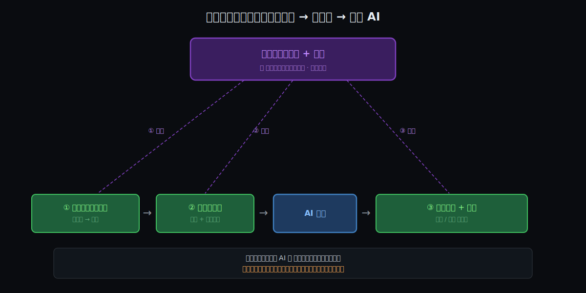

# 阶段 3：判断力到底"怎么"咬上那 4 把锁

> 这一篇是和用户**问答**建起来的——内容全部来自他真实的工作流（动手前 → 动手中 → 落地）。这里把它收成完整骨架：三件事 → 概览图 → 细节 → 约束回扣。
> 约束编号沿用 Why。

## 约束清单速查（C1–C4）

#### C1 — 生成了 ≠ 就是对的
AI 优化"看起来对"，不是"真的对"。**纯硬**。
口诀：它自信，不代表它对。

#### C2 — 上下文有限，越复杂越看不见全局
窗口装不下复杂系统，长上下文注意力衰减、丢三落四。**硬核 + 软边**。
口诀：它做局部最优，缺一张全局地图。

#### C3 — AI 自信"讨好"，盲信会复利放大
不懂也硬给一个看着对的；复杂链条上每步盲信 → 误差复利。**硬核 + 软边**。
口诀：别无条件信，逐步把关。

#### C4 — 必须有人验证 + 兜底
验证 ≠ 生成（地板）；担责 ≠ 能力（人来扛）。**纯硬**。
口诀：最后签字的，得是能负责的人。

## §0 三件事记住：判断力靠这三招咬住 4 把锁

> 一句话承上：4 把锁是 AI 的"病"，这一节是人对付它的"三招"。每一招都从约束逼出来。

### §0.1 建参照系（高维知识图谱）— 因为 C1 + C2
因为 AI 会自信地错（C1）、又看不见全局（C2）→ 要能判断对错、要能补全局 → **所以你必须先在脑中建一张"底层 + 需求"的高维参照系（尺子）**。这是地基：没有它，后面两招都使不出来。而这张图谱，**只有底层认知才长得出来**（八股给不了）。

### §0.2 分层编排 — 因为 C2 + C3
因为复杂度让 AI 看不见全局（C2）、盲信又会复利放大错误（C3）→ 要降复杂度 + 保每块可验证 → **所以分层切分**（基础设施 / 业务逻辑绝不混，先 infra 后业务），并用底层 **steer** 每一步的技术方案。

### §0.3 对账兜底 — 因为 C1 + C4
因为 AI 会自信地错（C1）、而验证和担责绕不过（C4）→ 要把幻觉 / 劣解挡在上线前 → **所以拿参照系给每个产出"对账"**，一眼识破，并做最后的技术兜底决策。

### §0 结论：三件事对照表

| 件 | 是什么 | 为什么存在 |
|----|--------|-----------|
| **① 建参照系** | 底层认知长出的高维知识图谱 | 没尺子就量不出对错（C1）/ 补不了全局（C2） |
| **② 分层编排** | 分层切分 + 现场 steer | 降复杂度（C2）+ 保可验、防复利（C3） |
| **③ 对账兜底** | 一眼识破 + 技术决策 | 挡幻觉 / 劣解（C1）+ 人来验证担责（C4） |

**嵌套关系**：**①建参照系是地基**；②和③都是"**拿这张图谱去用**"——一个用在动手中（steer），一个用在落地后（验证）。所以真正的核心只有一个：**那张底层认知长出的尺子**。

## §1 一张概览图：参照系用三次

从图上读 5 件事：

1. 顶上那个紫块（**底层认知：技术 + 需求**，＝你的尺子）是核心——**它不是八股背出来的**；
2. 下面是工作流：① 理解需求底层逻辑 → ② 架构师思维（分层 + 掌舵） → AI 生成 → ③ 对账验证 + 兜底；
3. **三根虚线**——同一张尺子，分别用在 ①消化、②steer、③验证 **三处**；
4. AI 只占中间"生成"一格（蓝），前后都是人（绿）——和 Why 的"四把锁"图同构；
5. 底部那句话是理论底座：**驾驭 AI = 用信息消除它的不确定性**（见 §5）。

## §2 动手前：把需求"消化"成 AI 能正确执行的东西（AI 还没上场）

> 关键观察：这一整段 **AI 一行代码都还没写**——全是人在前面消化 + 预演。坐实了 Why 的"AI 只占生成那一格"。

### §2.1 摸透需求的"底层逻辑"，建图谱（业务 + 技术判断 → 咬 C3，为 C1/C4 埋线）
- 仔细读、梳理商业逻辑、**记录问题**；约各需求方开会消歧，直到没有歧义。
- **不止"需求说了什么"，而是摸透需求的底层逻辑**——这依赖对**技术底层实现机制的深刻理解**（非八股）。优秀架构师的共同点正是：**懂底层，才看得穿需求的真实逻辑与可行性**。
- **关键动作**：必要时**从技术角度引导客户做出更优方案**——不只"翻译"需求，还**改进**需求。这是 AI 永远做不到的（它没有技术判断去对客户 push back）。

### §2.2 同步预演（技术判断 + 全局地图 → 咬 C2）
- 一边定需求，一边过：实现难度、技术难点、外部依赖、非功能性需求（性能 / 安全 / 鉴权）。
- 🔑 这就是 What 那张"架构师之图"——把难点和失败**提前算出来**。

### §2.3 设计验证，尤其 E2E（技术判断 → 咬 C1 / C4）
- 先想测试用例，**特别是 E2E**；QA 怎么组织、什么环境、怎么介入。
- 🔑 **一条金线**：需求梳理清楚后，**UT 可以信任 AI 代劳**；但 **E2E 用例自己设计**。这是"**什么能委托、什么必须自己扛**"的精确边界——机械的可托付，判断负载重的自己扛。

### §2.4 预演上线与兜底（编排 + 技术判断 → 咬 C2 / C4）
- 子需求顺序、怎么上线、协调哪些部门、怎么验证上线、**失败怎么兜底**。
- 🔑 "兜底"在**动手前**就想好了——C4 的兜底不是事后救火，是**预先设计**。

> **小结**：用户说的"消化"，本质是**在 AI 上场前，把 C2/C3/C4 的"人那一侧"全部先咬死**。等 AI 接手，它面对的是一个**已被判断力收拾干净的战场**。高手的 AI 效率高，不是"会用 AI"，是**在 AI 上场前就把胜负手下完了**。

## §3 动手中：分层切分 + 用底层"掌控"来 steer（编排 + 技术判断 → 咬 C2 / C3）

> 工具偏好（记一笔）：用户近期最爱 CC 的 workflow 方式，认为**多 agent 是未来**——本质是把"分层切分"从脑子里搬进工具，让不同 agent 各管一层。

### §3.1 切分：分层，绝不混
- 复杂需求**按逻辑分层**：至少拆成**基础设施层 / 业务逻辑层**，**绝不混**；**先 infra 后业务**。
- 🔑 为什么有效：分层让每块**小到能一口气验完**（C3：先把地基验对再往上盖，防复利）；也让 AI 每次只面对**一层的复杂度**，绕开它看不见全局的毛病（C2）。这是"将难变易"的具体刀法。

### §3.2 架构师思维 / Steer（掌舵）：用底层"绝对掌控"现场拍方案
> **steer ＝ 掌舵 / 导向，不是"驱动"。** AI 出力（它驱动），**你掌舵**（你拍方案往哪个方向走，再让它去实现）。力是它的，方向是你的——这又是"放大器"的另一种说法。
- **最重要的始终是自己对技术 + 业务逻辑的绝对掌控。** 门清 SpringBoot 机制 → CC 出方案时能**一眼默契、或一眼看出问题**。
- **实例**：dev 环境要**绕过所有用户的密码验证**定位每个角色的问题。该在 **Spring Security 的 filter** 做，还是 **DispatcherServlet 的 interceptor** 做？
  - 🔑 要拍板得懂请求管线**顺序**：Spring Security 是一条 servlet **Filter** 链，跑在 **DispatcherServlet 之前**，认证就在这层发生；HandlerInterceptor 在 DispatcherServlet **内部**、认证**之后**才跑。所以"绕过密码认证"天然落在 **filter 层**——interceptor 那层认证早结束了，太晚。
  - **八股文背得出"filter 是什么"，但拍不了这个板**；拍板要的是"管线顺序"这种**真懂**。这就是底层判断在**动手中 steer**：当场决定方案该长什么样，再让 AI 实现。

## §4 落地：拿参照系一眼识破幻觉 / 劣解（技术判断 → 咬 C1 / C4）

机制链：底层理解 → 脑中高维参照系 → AI 产出逐一对照 → 偏差 / 幻觉**当场显形** → 验证（C1）与兜底（C4）才站得住。

### §4.1 尺子量到的两根刻度（真实案例）

**刻度 1 — 抓住"逻辑上不可能"的假成功（C1 + C3 + C2 合谋）**
- 一个大重构，用户**全程 Claude Code（opus4.8）、没开过 IDE**，但**心里始终清楚 CC 实现了哪些、哪些还没**（＝那张尺子）。
- 某次 CC 报"E2E 全过，含 [某功能] 已验证"——可那功能**根本没建**。用户**一反问，CC 主动认错**。
- 🔑 **抓住它的信号在逻辑层，不在代码层**："没建的东西怎么验证？"——状态级矛盾，比逐行 review 高一层，**不用打开 IDE**。
- 🔑 用户还**诊断病因**：上下文快满 → 急于求成、过度猜测＝ **C2 + C3 合谋**。能诊断 AI 为什么犯错，是把底层用在了 **AI 这台机器本身**上（编排判断）。
- ⚠️ **opus4.8 也这样**——证明 Why：这是结构性硬核，不是"模型不够强"。

**刻度 2 — 抓住"能用但不对"的解法，做技术兜底（C4）**
- 查询慢，CC 改**业务执行次序**绕过去——**能用**，但用户一眼知道**该加 DB 索引**，做了技术兜底决策。
- 🔑 量的不是"对不对"，是"**是不是对的做法**"。**AI 优化"让它过"，你优化"做对"**——这道分水岭就是 C4。

> 两根刻度＝尺子量两类东西：**① 幻觉 / 逻辑不可能（C1+C3）② 能用但非最优 / 正确做法（C4）**。初级两种都量不出——所以同一个 opus4.8，在你手里和在他手里是两台机器。

## §5 信息论视角：驾驭 AI ＝ 用信息消除不确定性（理论底座）

> 用户点出的底座：根据**信息论**，要消除不确定性，必须**投入信息去抵消噪音**。

- AI 的产出天然带不确定性（C1 会错、C3 会编）。你"驾驭"它，本质就是不断**投入信息**把它的不确定性压下去——精确的规约、分层的约束、对账的反馈，**全是信息**。
- 🔑 但关键一跃：**"什么是信息、什么是噪音"，本身要靠认知去分辨——尤其是技术的底层认知。** 同一段 AI 产出，初级分不清哪是信号哪是噪音（所以他投不进有效信息，只能"看着像就信"）；你分得清（所以你每次都精准投入那一点点能**塌缩不确定性**的信息）。
- 所以这条链收口到同一个地方：**底层认知 = 分辨"信息 / 噪音"的前提 = 有效驾驭 AI 的总源头。** 它和那张"尺子"是一回事——尺子量的就是"这是信息还是噪音"。

## §6 约束回扣（机制 → Cn）

| 机制 | 咬住的 Cn | 怎么化解 |
|------|----------|---------|
| **建参照系** | C1, C2 | 底层认知建尺子 → 可判对错、补全局 |
| **分层编排** | C2, C3 | 分层降复杂度、infra 先、逐步验防复利 |
| **对账兜底** | C1, C4 | 参照系一眼识破 + 技术兜底决策 |
| **信息论底座** | C1, C3 | 投入有效信息塌缩不确定性；底层认知分辨信息 / 噪音 |

每一招都被某条 Cn 单向逼出来——没有一招是"为了用而用"。

## §7 呼应灵魂问题

你的灵魂问题："**是不是更懂底层，所以更能驾驭 AI？**"

How 给出**精确机制**——**是，但要害不在"底层知识本身"，在"底层认知长出的那张高维参照系（尺子）"**：

- 它被用在**三处**：消化需求（动手前）/ steer 方案（动手中）/ 对账验证（落地）；
- 从信息论看，它是你**分辨信息 / 噪音、从而投入有效信息消除 AI 不确定性**的前提；
- 八股文给不了这张尺子——**只有真懂机制，尺子才长得出来**。

这一层闭环了"**怎么驾驭**"的机制（约 70%）。剩下的：这种能力**从哪来、怎么长出来的**（留给 Origin）、能不能**复制 / 培养成团队方法论**（留给 Synthesis，正对你做主管的痛点）。

## 修订记录

| 时间 | 修订摘要 | 触发原因 |
|------|---------|---------|
| 2026-06-14 | 问答式建 How：动手前消化 4 步、落地参照系 + 两刻度实例、动手中分层 + steer（filter/interceptor）、参照系"用三次" | Q1–Q 多轮用户口述真实工作流 |
| 2026-06-14 | 结晶成完整骨架：约束速查 + §0 三件事（建参照系 / 分层编排 / 对账兜底，各从 Cn 推出）+ §1 概览图（参照系用三次）+ §5 信息论底座 + §6 约束回扣 + §7 呼应灵魂 | 用户"落地吧" + 补信息论视角 |
| 2026-06-14 | 按用户命名改概览图：紫块＝『底层认知：技术 + 需求』；①→『理解需求底层逻辑』；②→『架构师思维』；§3.2 加 steer 释义＝掌舵 / 导向（AI 出力、你掌舵） | 用户对图三处命名反馈 + 问 steer 词义 |
