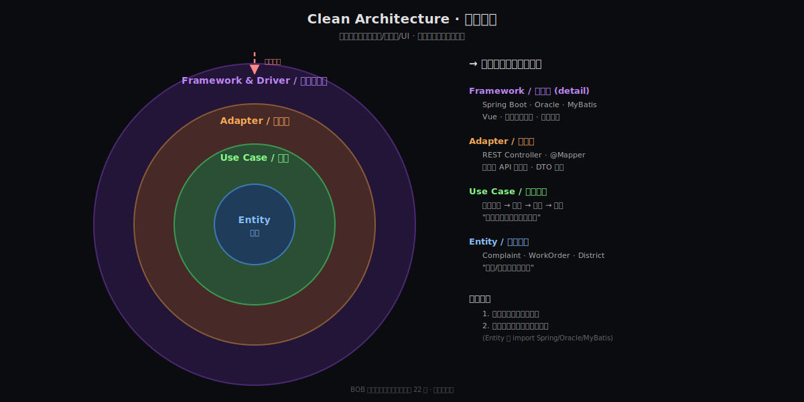
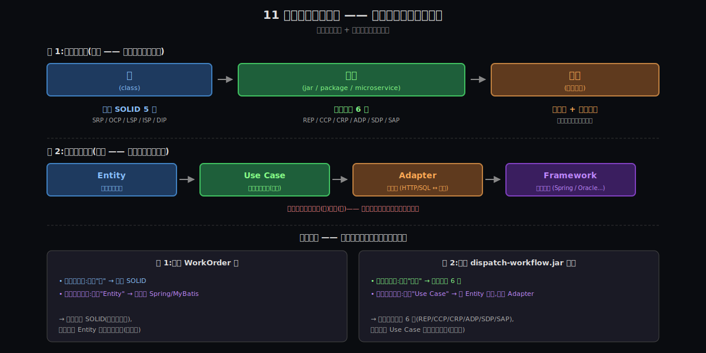

# 阶段 1:《架构整洁之道》是什么

> **What 阶段的本分** —— 这是骨架认知。读完后,你能用一句话跟同事说清楚这本书在讲什么、长什么样,11 条原则各管什么事。**不深入机制、不讲历史、不展开源码** —— 那些是后面 Why / How / Origin / Deep 阶段的事。

---

## §1 一句话定义

> **业务核心独立于框架、数据库、UI —— 它们都是可替换的配件,依赖方向永远从外朝内。**

(28 字)

为什么这一句话就够 —— 它一次性给出三个关键命题:

1. **"业务核心"是主角** —— 你的"投诉 / 工单 / 派单流程"才是系统的灵魂,不是 Spring,不是 Oracle
2. **框架 / 数据库 / UI 是配件** —— BOB 大叔英文用 `detail`,意思是把它们**当成配件、不是主角**:就像汽车的**轮胎 / 音响 / 内饰**可以换品牌换型号,但**动力系统(发动机 / 变速箱 / 底盘)**这个核心毫不受影响
3. **依赖方向永远从外朝内** —— 整本书最硬的硬规矩,违反它的项目最终都会变成你眼前这种屎山

读完这一节剩下所有内容,都是在解释**这一句话的每一个字到底意味着什么**。

---

> 💡 **身份测试 —— 一把日常都能用的尺子**:
>
> **"如果换掉它,系统还是'同一个东西'吗?"**
>
> - 把电商系统的"订单业务规则"换了 —— 系统**不是**这个电商了 → **核心**(应该独立,不依赖任何技术)
> - 把电商系统从 Spring(Java)换成 FastAPI(Python)甚至换成 Go —— 业务规则还在,系统**还是**这个电商 → **配件**
>
> 把这把尺子套到任何一段代码上,问一句:**"换了它,这还是同一个产品吗?"**,回答 **NO = 核心**,**YES = 配件**。
>
> (这跟 BOB 大叔在原书第 5 章的核心论点 "Business rules ARE the system" 是同一句话的两种说法。)

---

> 🎯 **真实案例 —— 信创(国产化)把"框架是配件"变成法律级硬约束**:
>
> 当下中国软件行业的国产化转型(Oracle → 达梦 / 人大金仓;Spring Boot → 东方通 / 金蝶 Apusic;全套中间件换装),正在让所有有一定年纪的项目**集体被迫做一次"身份测试"**。
>
> | | 按 Clean Architecture 建的项目 | 业务核心被框架渗透的项目 |
> |---|---|---|
> | **Entity**(业务核心规则) | 0 改动 | 改:Spring/MyBatis 注解长在领域类上,换 Spring 等于改 Entity |
> | **Use Case**(应用流程) | 0 改动 | 改:流程方法直接调 Mapper,换 MyBatis 等于改流程 |
> | **Adapter**(适配层) | **全部重写**(工作量有边界、可估算) | 改:边界塌掉,改一处牵动十处 |
> | **Framework** | 全部换装(底盘切换) | 改:Oracle 方言 SQL 散落业务代码,满世界翻 |
> | **总代价** | ~10-20% 代码 | ~80-90% 代码 + 不可控风险 |
>
> **差距是 5-10 倍工作量**。这就是 BOB 大叔反复警告"框架是配件"的**工程经济价值** —— 不是哲学,是**真金白银的迁移代价**。
>
> 而 BOB 大叔自己 2017 年写书时,根本没想到中国会有"信创政策"这种**国家级硬约束**,直接把"也许有一天你想换框架"变成"必须换,而且是法律要求"。

---

## §2 跨领域类比 —— 把这套架构当成一个电商订单系统

(挑电商订单,因为"创建订单 / 查询 / 更新 / 取消"是几乎所有程序员第一天就熟的概念,而且**能直接示范**"业务规则不依赖任何具体技术"这个最关键的命题。)

电商订单系统里,从内到外也是四层:

| 层 | 是什么 | 关键属性 |
|---|---|---|
| **订单业务规则**(最里 = Entity) | "订单包含哪些字段"、"订单状态机(待支付/已支付/已发货/已完成/已取消)"、"订单总金额 = 商品单价 × 数量 - 优惠券"、"已发货的订单不能直接取消" | **不依赖任何技术** —— Java / .NET / Python 都能表达,MySQL / Oracle / MongoDB 都能存,前端用 React 还是 Vue 完全无关 |
| **订单流程**(Use Case) | "用户下单 → 校验库存 → 创建订单 → 调用支付 → 发货 → 完成" | 这些步骤跨电商平台**几乎相同**(淘宝 / 京东 / 拼多多核心流程一致),只在表单字段 / UI 样式 / 风控细节上略有差异 |
| **接口适配层**(Adapter) | REST Controller、订单 DTO、订单 Repository 的具体实现、Kafka 消息适配器 | **每家公司不同**(用 Spring 的、用 FastAPI 的、用 Express 的);但表达的内容一样 |
| **框架与基础设施**(Framework) | Spring Boot / .NET Core / Django / Express / MySQL / Oracle / Redis / Kafka | **每家公司、每个时代完全不同** —— 但订单业务规则不依赖于这些 |

**核心观察:依赖方向永远从外朝内** ——

- Spring 的 `OrderController` **依赖于**"订单流程"(它要按流程组织 API 路由)
- 但"订单流程"**完全不依赖于** Spring(理论上你换成 Python + FastAPI,流程一样跑)
- 同理,订单流程依赖于"订单业务规则"(它必须知道状态机才能驱动);但业务规则**不依赖于**流程 —— 即使没人写"用户下单"这个用例,"订单的状态机"也独立成立

---

**一个程序员都能立刻感知的对照** —— 想象你写一个 `Order` 类,有 `创建 / 取消 / 标记发货` 这三个动作。两种写法:

❌ **绑死框架的写法**(你屎山里的常见样子):

```java
@Service
public class OrderService {
    @Autowired JdbcTemplate jdbc;
    public void cancel(Long id) {
        jdbc.update(
            "UPDATE t_order SET status='CANCELLED' WHERE id=? AND status!='SHIPPED'",
            id
        );
        // 业务规则跟 SQL 拼成一坨,跟 Spring + Oracle 绑死。
        // 想换 PostgreSQL?方言要改。
        // 想跑单元测试?必须起一个数据库。
    }
}
```

✅ **业务规则独立的写法**:

```java
public class Order {                  // 普通 POJO,无任何注解
    private OrderStatus status;

    public void cancel() {
        if (this.status == OrderStatus.SHIPPED) {
            throw new IllegalStateException("已发货订单不能取消");
        }
        this.status = OrderStatus.CANCELLED;
    }
}
// 持久化交给外层 Repository 实现去管;
// Order 类本身能在没有数据库的情况下跑单元测试,
// 能从 Java 移植到 Kotlin / Python / Go,业务规则不变。
```

第二种写法的 `Order`,**就是 Entity 层应该长的样子**。这就是"业务核心独立于一切技术细节"。

---

**对照你的环境监测系统**(此时此刻):

| 同心圆四层 | 在你的项目里对应 |
|---|---|
| **Entity**(订单业务规则) | 投诉是什么、工单是什么、"派单需在 N 小时内响应"、"已派单的工单不能直接关闭" 这些核心业务规则 —— 跟用什么数据库 / 什么 UI 都没关系 |
| **Use Case**(订单流程) | "市民投诉 → 平台接到 → 派单到区级 → 区级处理 → 反馈给小程序" 这个流程 —— 你说项目初期有的"通用流程模板"就在这一层 |
| **Adapter**(接口适配层) | Spring 的 REST Controller、MyBatis 的 Mapper、Vue 的页面、小程序的 API 适配器 —— 它们是**翻译官**,把外部世界的输入(HTTP 请求 / SQL 行 / 用户点击)翻译成 Use Case 能懂的领域语言 |
| **Framework**(框架与基础设施) | Spring Boot、Oracle、MyBatis、Vue、微信开放平台、大屏展示 —— **全是配件** |

—— BOB 大叔说**"框架是配件"**(英文原话 "framework is a detail"),在你的项目里翻译成大白话:

> **Spring Boot 不是你项目的本体,它只是你目前选择的"承载容器"而已。**

理论上 Spring 关门了你也能用别的框架重写一份,业务规则照常跑。(理论上。**实际上你的屎山现在做不到** —— 这正是这本书要诊断的病。)

---

## §3 一张全景图 —— 著名的"同心圆"



**从图上能直接读出来的 5 件事**:

1. **四层从内到外**:Entity(实体) → Use Case(用例) → Adapter(适配器) → Framework & Driver(框架与驱动)
2. **越内层越稳定** —— Entity 是企业级业务规则,几十年不变;Framework 是流行技术,5 年换一茬
3. **依赖箭头永远朝内**(虚线红箭头) —— 外层知道内层的存在,内层**完全不知道**外层
4. **每一层只跟相邻层打交道** —— 跨层调用要绕,这是 boundary(边界)的存在意义
5. **图右侧是你的环境监测系统的对照** —— Spring/Oracle/MyBatis 在最外层,通用流程模板在 Use Case 层,投诉/工单这些核心概念在 Entity 中心

(这张图在原书第 22 章。BOB 大叔自己说:**"所有架构图最终都会归结到这一张同心圆。"**)

---

## §4 关键词速查表(8 条会反复出现的术语)

下面 8 个词在后续所有阶段都会反复出现。先建立"听到能反应"的肌肉记忆:

| 术语 | 一句话 |
|---|---|
| **Entity / 实体** | 企业级核心业务规则的载体 —— 跨多个 Use Case 复用、跨应用复用,生命周期最长 |
| **Use Case / 用例** | 应用级业务规则,描述"系统要做某件具体事时的步骤"。对应你的"派单流程"、"投诉受理流程" |
| **Adapter / 适配器** | 翻译官 —— 把外部世界(HTTP / SQL / UI 事件)的格式转成 Use Case 能懂的领域对象,反向亦然 |
| **Framework & Driver / 框架与驱动** | 最外层的具体技术 —— Spring Boot / Oracle / Vue / 操作系统 / 第三方 SDK,**都是配件** |
| **Boundary / 边界** | 层与层之间的"接口契约"。跨边界要走预先约好的形状,不能直接穿透 |
| **Plugin / 插件架构** | 整本书最重要的隐喻 —— 把所有配件都当成可热插拔的插件挂在业务核心上 |
| **依赖反转(DIP)** | 让高层模块**不依赖**低层模块 —— 双方都依赖于一个**抽象**(通常是接口),抽象由**高层**来定义 |
| **配件 / detail** | 一切"具体技术选型" —— 数据库、Web 框架、UI 框架、第三方服务都是配件。BOB 大叔英文用 `detail`,中文用"配件"翻译,本意是**非主角的、可替换的部分** |

---

## §4.5 一张图先看清:11 条原则各管什么、什么时候用

(下面 §5 SOLID 和 §6 组件 6 条会展开细节。**先看这张地图,再扎进细节** —— 你才知道每条原则在哪个尺度上用。)



**一句话总结**:

> **SOLID 5 条** 在每一层的每个**类**上适用 →
> **组件 6 条** 在每一层的每个**组件**上适用 →
> **同心圆 + 依赖规则** 在整个**系统**层面适用 →
>
> **三者跟"同心圆四层(Entity/Use Case/Adapter/Framework)"是正交的两个独立维度** —— 不是同一回事,不要混。

(更详细的"SRP 具体对应组件级哪一条"对照表,在 §6.0「11 条原则的尺度对照」。)

---

## §5 SOLID 五原则速览

(SOLID 是面向对象设计的 5 条基础原则,Robert C. Martin 2000 年首次系统提出。整本《架构整洁之道》大量使用,组件原则也建立在它们之上。每条按"全称 + 中文 + 一句核心命题 + 一个直觉反例"展开。)

### **S** — Single Responsibility Principle / 单一职责原则

> **一个模块应该只对一个**类型的"变化来源"(actor)负责。**

不是"一个模块只做一件事",这是常见误解。BOB 大叔在书里反复强调:

- **"职责"** = "**变化的理由**"
- **"变化的理由"** = "**提需求的那群人**(actor)"

**反例(直接钉在你的屎山)**:

你那个 5000 行的 `XXXManager` 同时被三方频繁改:

- **产品方**:要新加一个"投诉自动分类"字段
- **运维方**:要改某个连接池配置
- **统计方**:要在派单时偷偷写一行埋点日志

这就是 SRP 灾难 —— 三个 actor 同时改同一个类,合并冲突 + 互相破坏 + 测试爆炸都是必然。**正确的做法**:把这个类拆成 3 个,每个只对一个 actor 负责。

---

### **O** — Open-Closed Principle / 开闭原则

> **对扩展开放,对修改关闭。**

加新功能不靠改老代码,靠**加新代码**实现。

**反例(钉你的屎山)**:

A 区代码整片 copy 到 B 区然后改 —— 这就是**因为没找到扩展点、只能靠"修改"**。如果当初有 OCP 思维,**B 区的差异应该是一个"插入点"**:写一个"区域定制化"接口,A 区有自己的实现,B 区写一个新实现挂上去 —— A 区的代码**一行都不该被改**。

(这个原则是你后面学 plugin 架构的精神祖父,后面 How / Deep 阶段会反复重温。)

---

### **L** — Liskov Substitution Principle / 里氏替换原则

> **子类(或实现)必须能透明替换父类(或接口),不破坏行为。**

(Barbara Liskov 1987 年的论文。是 OOP 继承的"健康守门员"。BOB 大叔后来把它**升华**了 —— 不只是"子类替换父类",广义上是**任何"可替换"场景的契约**:接口的多个实现之间、microservice 的 v1/v2 之间、不同数据库驱动之间都适用。)

LSP 比表面看起来难懂,因为它**不只是**"方法签名一样",而是要求子类(或实现)的**行为契约**必须包含父类(或接口)的**行为契约**。这个契约有 4 个维度:

| 契约维度 | 父类的承诺 | 子类不能破坏的方式 |
|---|---|---|
| **前置条件**(precondition) | "传 ≥ 0 的数我都接受" | 子类**不能加严**:不能要求"必须 ≥ 10" |
| **后置条件**(postcondition) | "我保证返回 Optional,不抛异常" | 子类**不能弱化**:不能改成"找不到时抛异常" |
| **不变量**(invariant) | "我的内部状态永远满足 X" | 子类不能让 X 偶尔不满足 |
| **历史约束**(history constraint) | "调用某方法后,某些字段不该被改" | 子类不能让"额外字段被偷偷改" |

---

**最贴你处境的例子(直接连接你的国产化迁移)**:

```java
// 接口:放在业务层,Use Case 依赖它,不知道具体实现
public interface WorkOrderRepository {
    Optional<WorkOrder> findById(Long id);   // 契约:不存在时返回 empty,不抛异常
    void save(WorkOrder order);
    List<WorkOrder> findByStatus(Status s);  // 契约:无匹配时返回空 List,不返回 null
}

// Oracle 实现(遵守契约)
public class OracleWorkOrderRepository implements WorkOrderRepository {
    public Optional<WorkOrder> findById(Long id) {
        try {
            WorkOrder o = jdbc.queryForObject("...", id);
            return Optional.ofNullable(o);                  // 符合契约 ✓
        } catch (EmptyResultDataAccessException e) {
            return Optional.empty();                        // Spring 抛这个时吞掉,return empty
        }
    }
}

// 达梦实现 —— LSP 违反!
public class DamengWorkOrderRepository implements WorkOrderRepository {
    public Optional<WorkOrder> findById(Long id) {
        // 达梦驱动在某些 corner case 抛 SQLException,而不是返回 null/empty
        // 这违反了"不存在时返回 empty,不抛异常"的后置条件契约 ✗
        WorkOrder o = jdbc.queryForObject("...", id);   // 抛 SQLException 逃逸出去
        return Optional.ofNullable(o);
    }
}
```

调用方(Use Case)代码:

```java
// 这段业务代码不知道下面是 Oracle 还是达梦
public void processWorkOrder(Long id) {
    WorkOrder o = repo.findById(id).orElseThrow(() -> new NotFoundException(id));
    // ...
}
```

- **Oracle 时**:`findById(不存在的 id)` → returns empty → `orElseThrow` 抛 NotFoundException → 业务正常
- **达梦时**:`findById(不存在的 id)` → **直接抛 SQLException** → 调用方没准备处理 → **业务崩**

—— **LSP 失败最可怕的地方**:**编译通过、单元测试通过(因为单测用 Oracle 实现)、上线后被达梦实现的微妙差异杀死**。换数据库供应商时,**LSP 违反是最难发现的隐蔽 bug**。

---

**LSP 直接连接你的国产化迁移**:

如果你的 Repository 接口 + 所有实现**严格遵守 LSP** —— 即所有实现遵守相同的"行为契约"(空值处理、异常类型、事务边界、时区处理等) —— 那么 Oracle → 达梦只需**重写实现**,业务代码一行不动。

如果不遵守 LSP —— 实现间的微妙差异散落各处 —— 那么换数据库时,**业务代码也要跟着改**(因为它们暗中依赖了"Oracle 实现的特定行为")。这就是你"举步维艰"的一个具体来源。

(经典玩具例子:`Rectangle` / `Square` —— Square 看似是 Rectangle 子类但 `setWidth / setHeight` 行为不同。**那个例子好懂但脱离实战;真实世界的 LSP 大多发生在你刚看到的接口实现替换、driver 切换、microservice 版本升级**。)

---

### **I** — Interface Segregation Principle / 接口隔离原则

> **客户端不应该被迫依赖它不使用的方法。**

不要做"上帝接口"(God Interface) —— 把 30 个方法塞一个 interface 里。每个调用者只用其中 2~3 个,但被迫**依赖**整个 interface 的稳定性。任何一个方法签名变化,所有调用者都被牵动。

**反例**:某个 `IUserService` 接口塞了 40 个方法(查、改、统计、导入、导出、消息推送 ……)。给前端用的只调 5 个查询方法,却必须等整个接口编译通过才能用。改一个统计方法的签名,前端编译挂掉 —— 这就是 ISP 失败。

---

> 💡 **SRP vs ISP —— 它们的区别**(常见混淆):
>
> 直觉上感觉这两条都在说"一个东西做太多事",**但关注角度不同**:
>
> | 角度 | SRP(单一职责) | ISP(接口隔离) |
> |---|---|---|
> | **看的对象** | 一个**类**(实现) | 一个**接口**(契约) |
> | **谁的视角** | "变化的来源(actor)" —— 谁要求改这个类 | "调用者依赖什么" —— 谁在用这个接口 |
> | **判断标准** | 一个 actor 一个类 | 调用者用什么就给什么(只暴露调用者需要的方法) |
> | **失败长啥样** | 一个类被多个 actor 改,合并冲突、互相破坏 | 调用者被迫依赖不用的方法,接口改一处所有调用者牵动 |
> | **主战场** | 类**实现**的内部凝聚 | 接口**对外**的契约暴露 |
>
> **它们可以独立成立**(这是 BOB 自己强调的):
>
> - 一个类**可以**违反 SRP(被 3 个 actor 改)**但**接口拆得很细 → ISP 没违反
> - 一个类**可以**遵守 SRP(只有 1 个 actor)**但**接口塞 30 个方法 → 违反 ISP
>
> 重叠区是"**God class + God interface 一起**"。BOB 大叔自己也说过 "ISP 在某种意义上是 SRP 的另一面" —— 但两条原则的**主战场不同**(类的实现 vs 接口的对外契约)。

---

### **D** — Dependency Inversion Principle / 依赖反转原则

> **高层模块不应依赖低层模块,二者都应依赖于抽象;抽象不应依赖于细节,细节应依赖于抽象。**

**先澄清:"高层"和"底层"具体指什么?**

- **高层模块** = 离业务策略更近的(policy-defining)→ 在 Clean Architecture 里就是 **Entity + Use Case**
- **底层模块** = 离机制实现更近的(mechanism-providing)→ 在 Clean Architecture 里就是 **Adapter + Framework**(以及更广义的:数据库、Web 框架、UI、第三方 SDK 等所有"配件")

所以**直觉理解**:**高层 = 业务模块,底层 = 框架 / 数据库 / UI 等配件**。完全对。

(严格说,"高/底层"是相对的 —— 一个模块相对它依赖的具体模块是"高层",相对依赖它的更抽象模块就是"底层"。但在 Clean Architecture 同心圆体系里,简化映射就是"**内层 = 高层,外层 = 底层**"。)

整本《架构整洁之道》的**根脉**。同心圆的"依赖箭头永远朝内",底层就是 DIP 在起作用。

**直觉表述**:让"业务规则"(高层)反过来定义它需要从"数据库 / 框架"(低层)拿什么 —— 写成接口,放在高层模块里;低层模块**实现**这个接口。这样依赖箭头就**反转**了 —— 不再是业务依赖数据库,而是数据库实现业务定义的接口。

**反例(钉你的屎山)**:

你的派单 Service 直接 `import` 了 MyBatis 的 Mapper,Mapper 又直接拼 SQL 查 Oracle —— 派单业务规则**直接依赖**数据库实现。如果 Oracle 换成 PostgreSQL,你的派单业务规则代码全要改。

**正确的做法**:派单 Service 定义一个 `WorkOrderRepository` 接口(只描述业务需要的查询/写入语义),MyBatis 那一套**实现**这个接口;派单 Service **完全不知道** Oracle 的存在。

---

> ⚠️ **DIP 最容易被误解的关键点 —— 抽象的定义权**:
>
> **接口必须由高层定义、放在高层模块里**。"加了接口" **≠** "做了 DIP" —— 还要看这个接口**谁定义、放哪里**。
>
> | 形式 | 接口由谁定义 | 是真 DIP 吗? |
> |---|---|---|
> | 业务 Service `import org.springframework.data.repository.JpaRepository<T, ID>` 然后直接用 | 框架(底层) | ❌ 业务依赖**框架定义的**抽象,换框架 = 改业务 |
> | 业务模块自己定义 `WorkOrderRepository` interface,放在业务 jar 里;MyBatis 在 framework jar 实现它 | 业务(高层) | ✓ 真 DIP |
>
> **对你的国产化迁移直接相关**:你的屎山如果"加了接口但接口都是 Spring / MyBatis 定义的",那 Oracle → 达梦时**接口本身也要换** —— 业务代码还得跟着改。真 DIP 是"**接口在业务 jar 里、实现在 framework jar 里**",换 framework 时业务**一行不动**。

---

## §6 组件 6 条原则速览(聚合 3 + 耦合 3)

(SOLID 是"类内部"的设计原则;组件 6 条是把同样思想**升一层**到"组件之间"。一个组件 = 一个 jar / 一个 npm package / 一个 microservice / 一个独立可发布单元。)

### 11 条原则的尺度对照 —— 它们之间到底是什么关系?

(很容易问的一个问题:**SOLID 5 条和组件 6 条,是公理 vs 推论吗?**)

**精确回答**:不完全是公理-推论关系,**更像同一组思想在两个尺度上的体现 + 一条组件级独有原则**。

| SOLID(类层面) | 对应的组件级原则 | 共同思想 |
|---|---|---|
| **SRP** 单一职责 | **CCP** 共同闭包 | "按变化的来源聚拢" —— 只是聚拢的单位不同(SRP 聚拢类内方法,CCP 聚拢组件内类) |
| **OCP** 开闭 | **ADP + SDP** | "扩展不改既有":需要无环依赖 + 依赖方向稳定,扩展才能不污染稳定层 |
| **LSP** 里氏替换 | (在所有"可替换"场景隐含,无单独编号) | 行为契约的可替换性 |
| **ISP** 接口隔离 | **CRP** 共同复用 | "不要被迫依赖你不用的" —— 类层面是不被迫依赖方法,组件层面是不被迫依赖类 |
| **DIP** 依赖反转 | **SAP + SDP** | "稳定的应该是抽象的、被具体依赖" |
| (无对应) | **REP** 复用-发布等价 | 这条是组件级**特有**(SOLID 里没有"发布粒度"这个概念) |

**两个方向的因果**:

- 类层面遵守 SOLID 是组件层面遵守 6 原则的**必要条件**(微观不及格,宏观难做到)
- 反向也成立:组件级 SDP/SAP 的硬要求,会**逼着**类级遵守 DIP(否则稳定组件无法干净地依赖具体)
- **唯一不能从 SOLID 推出的是 REP** —— 它涉及"发布粒度"这个 SOLID 看不到的尺度

所以"公理 vs 推论"的直觉**部分对**(SOLID 是更基础的微观保证),但更准确的关系是 **"两个尺度的同构 + 一条组件级独有原则"**。

---

> ⚠️ **重要澄清:组件 ≠ Use Case 层**
>
> 容易混淆的一点:**组件 6 原则跟同心圆四层(Entity / Use Case / Adapter / Framework)是正交的(垂直的两件事)**,不是同一回事。
>
> | 轴 | 关注什么 | 单位 / 层级 | 适用规则 |
> |---|---|---|---|
> | **打包粒度轴**(物理) | "代码怎么打包发布" | 类 → 组件(jar / package / microservice)→ 系统 | 类 = SOLID;组件 = 组件 6 条 |
> | **架构关注点轴**(逻辑) | "代码在管哪类业务关注点" | Entity / Use Case / Adapter / Framework | 同心圆 + 依赖箭头永远朝内 |
>
> 具体说:
>
> - 一个 **Entity 组件**(只装 Entity 类的 jar)要遵守组件 6 条
> - 一个 **Use Case 组件**(只装 Use Case 类的 jar)**也**要遵守组件 6 条
> - 一个 **Adapter 组件**(只装 MyBatis Repository 实现的 jar)**还是**要遵守组件 6 条
> - 而每个组件内部的每个**类**,无论它属于同心圆哪一层,**都**要遵守 SOLID
>
> 一句话总结:
>
> > **SOLID 在每一层的每个类上都适用;组件 6 条在每一层的每个组件上都适用。两者跟"同心圆四层"是正交关系,不是同一个东西。**

---

### 聚合 3 条 —— 决定"一个组件应该包含哪些类"

#### **REP** — Reuse-Release Equivalence Principle / 复用-发布等价原则

> **复用粒度 = 发布粒度。**

一个组件能被别人**复用**,前提是它能被**独立发布**(打包、版本化、追踪兼容性)。如果一坨代码不能独立发布,它就不能被真正复用。

**反例**:你说 A 区代码 copy 到 B 区 —— 这就是**没有 REP**。"通用流程模板"应该是一个**独立发布的组件**(如 `workflow-core-1.2.3.jar`),A 区 / B 区 / C 区都依赖它。但你们没把它独立发布,所以"复用"只能靠 copy。

---

#### **CCP** — Common Closure Principle / 共同闭包原则

> **一起变化的类应该放在同一个组件里;不一起变化的类应该分开。**

CCP 是 SRP 升一层到组件级。判断标准:**变化的来源相同**(同一群人、在同一个原因下改它们) → 放一起。

**直觉表述**:打开一个组件,如果你发现"加一个新字段要改 5 个组件",就是 CCP 失败 —— 5 个组件里都有跟这个字段相关的代码,本应放一起。

---

#### **CRP** — Common Reuse Principle / 共同复用原则

> **不在一起被复用的类,不要放在一个组件里。**

CRP 是 ISP(接口隔离)升一层。**反向表述**:依赖一个组件,等于依赖它的**全部**类 —— 即使你只用了一个。所以不要塞太多"用户用不到的"类进去,会污染所有依赖者。

---

#### 三条聚合原则的张力

REP / CCP / CRP **互相拉扯**,不可能都满足:

- REP 推动你**做大**:复用单位要够大,才有发布价值
- CCP 推动你**按变化分组**:一起变化的塞一起
- CRP 推动你**做小**:不在一起被复用的剔出去

BOB 大叔说:**"项目不同阶段在三角形里的位置不同。"** 新项目偏 CCP(快速迭代);成熟项目偏 CRP(稳定复用);谁都没法永远在中心 —— 这是工程现实。

---

### 耦合 3 条 —— 决定"组件之间应该如何依赖"

#### **ADP** — Acyclic Dependencies Principle / 无环依赖原则

> **组件依赖图必须是 DAG —— 不能出现环。**

如果组件 A 依赖 B,B 依赖 C,C 又依赖 A —— 你就不能独立发布任何一个,改一个就全部要重测。**这是组件级的死结**。

**反例**:屎山项目里常见的"我改了 `commons-utils`,结果发现 `commons-utils` 反过来 `import` 了 `user-service` 的某个类" —— 环。

---

#### **SDP** — Stable Dependencies Principle / 稳定依赖原则

> **依赖方向永远指向更稳定的组件。**

不稳定的组件可以依赖稳定的;**反过来不行**。如果一个稳定组件依赖了不稳定组件,前者就被后者污染、不再稳定。

**直觉表述**:同心圆的"依赖箭头朝内",在组件级就是 SDP —— 内层(Entity)是最稳定的,所以所有外层都可以依赖它;但 Entity 不能依赖任何外层。

---

#### **SAP** — Stable Abstractions Principle / 稳定抽象原则

> **稳定的组件应该是抽象的;不稳定的组件应该是具体的。**

SDP 说"稳定的不能依赖不稳定的"。但稳定 ≠ 不能扩展 —— 那不是死了么?**SAP 的解决方案**:让稳定组件**全是抽象**(接口、抽象类),不稳定组件提供**具体实现**。这样稳定组件**通过抽象**来"依赖"具体细节(实际是细节实现稳定组件定义的接口),依赖方向反转,SDP 守住,扩展性也守住。

—— **SAP + SDP + DIP 三件事其实是同一件事在不同层级的体现**:让"稳定且抽象的核心"被"不稳定且具体的细节"依赖,而不是反过来。

---

## §7 它在系统/技术栈里的位置

Clean Architecture **不是孤立创新**。它站在一个有 30 年历史的"业务核心独立于技术细节"思想脉络里。看看它的"邻居":

| 流派 | 谁提出 | 何时 | 核心隐喻 | 跟 Clean Architecture 的关系 |
|---|---|---|---|---|
| **Hexagonal Architecture / 六边形架构** | Alistair Cockburn | 2005 | "应用作为六边形,Port 接收输入、Adapter 转换" | **几乎同构** —— Port = boundary,Adapter 概念几乎一致 |
| **Onion Architecture / 洋葱架构** | Jeffrey Palermo | 2008 | 同心圆,业务核心在中心,基础设施在外层 | **完全同构** —— 只是换了个画法,精神一致 |
| **DDD / 领域驱动设计** | Eric Evans | 2003 | 领域模型为核心,基础设施可替换 | **互补而非重叠** —— DDD 教你怎么**建模业务核心**(战略 + 战术);Clean 教你怎么**摆放代码** |
| **经典三层(Controller/Service/DAO)** | (业界惯例) | 90s 末~ | 上下三层,UI → 业务 → 数据 | **常被以为是 Clean 的简化版,实际方向相反** —— 经典三层里 Service 直接依赖 DAO,DAO 依赖具体数据库;Clean 里依赖方向反过来 |

**关键洞察**:

> Clean Architecture / Hexagonal / Onion 三者是**同一个思想的三种叙事**,差异主要在画图方式和侧重词。BOB 大叔在书里第 22 章自己也承认 —— 他说"我把它叫做 Clean Architecture,但你也可以叫它 Onion 或 Hexagonal,内核是一样的"。

(这就是为什么后面 Comparison 阶段如果你有兴趣,可以拉这三个来一对比 —— 你会发现它们就像三个画家画同一个模特。)

---

## §8 呼应灵魂问题 —— 把你的屎山映射到同心圆上

你的灵魂问题是"完整理解《架构整洁之道》的设计哲学与可落地方法"。What 阶段不能完整回答,但**它给了你一把打开后续阶段的钥匙** —— 同心圆 + 11 条原则的词汇表。

让我用这把钥匙先做一次**诊断**,看看你那座屎山在 Clean Architecture 框架下长什么样:

```
┌──────────────────────────────────────────────────────────────────────────┐
│ 你的环境监测系统 —— 用 Clean Architecture 透视镜看                          │
├──────────────────────────────────────────────────────────────────────────┤
│                                                                            │
│ ◆ Entity 层(应该独立、应该稳定)                                            │
│   ├── 你应该有的:Complaint / WorkOrder / District / ProcessingResult     │
│   │              —— 不依赖任何技术                                          │
│   └── 你实际可能的:这些 Entity 现在多半都跟 Spring/MyBatis 长在一起,        │
│                   根本不能独立测试                                          │
│                                                                            │
│ ◆ Use Case 层(应该是业务流程的载体)                                        │
│   ├── 你应该有的:DispatchWorkOrderUseCase / ReceiveComplaintUseCase /     │
│   │              CloseWorkOrderUseCase —— 描述"系统做某事时的步骤"           │
│   └── 你实际可能的:这些流程被打散在 Service/Helper/Util/Listener 里,        │
│                   变化时哪都得改                                            │
│                                                                            │
│ ◆ Adapter 层(应该只做翻译)                                                 │
│   ├── 你应该有的:WebController(HTTP→DomainObject)                       │
│   │              MyBatisRepoImpl(实现 Use Case 定义的 Repository 接口)    │
│   └── 你实际可能的:Controller 里直接写业务逻辑,Mapper 里也写业务逻辑,        │
│                   分层全失败                                                │
│                                                                            │
│ ◆ Framework 层(应该是配件,可换皮)                                       │
│   ├── 你实际有的:Spring Boot / MyBatis / Oracle / Vue / 微信 / 大屏        │
│   └── 你的现状:这些**渗透到了所有层**,业务规则离不开它们 —— 这就是病          │
│                                                                            │
└──────────────────────────────────────────────────────────────────────────┘
```

**诊断结论**:

> 你的项目当前状态是 —— **"四层全部塌缩成一坨"**。Entity / Use Case / Adapter / Framework 之间的边界**不存在**或**反向**(框架在指挥业务,而不是业务在使用框架)。

这就是为什么你"加一个功能、修改一个 bug 都十分窝火":

- **没有清晰的边界** → 你不知道改一处会不会触发其他地方
- **没有独立的业务核心** → 你不能脱离 Spring + Oracle 跑测试
- **没有发布单元** → A 区到 B 区只能靠 copy

**接下来 Why 这一节会做的事**:从这些"窝火的具体瞬间"出发,反推出一份**约束清单(C1, C2, ...)** —— 软件架构这件事到底在跟什么做斗争。这份清单会成为后续所有阶段的脊梁:每一条原则、每一个组件,都是为了应对清单上的某条约束才存在的。

---

## 修订记录

| 时间 | 修订摘要 | 触发原因 |
|---|---|---|
| 2026-05-05 初稿 | 写入一句话定义 / 医院类比 / 同心圆图 / 关键词速查表 / SOLID 5 原则 / 组件 6 原则 / 思想史地图 / 对照用户环境监测系统的诊断 | What 阶段首次生成;用户偏好 B 级别(下次能用)+ SOLID/组件 6 原则缩写全展开 |
| 2026-05-05 patch-1 | §2 把医院类比换成电商订单系统(含 `OrderService` 绑死 vs `Order` 独立两种 Java 写法对照);"降格" → "把它们当成配件、不是主角"(§1 + §4 同步替换) | 用户反馈:① "降格"太书面 ② 医院类比对程序员不如电商订单贴 |
| 2026-05-05 patch-2 | "detail" 全文替换为"配件"(§4 词条改为 "配件 / detail" 双语对照,保留连接到原书);§1 第 2 项的"今晚用什么显示器"换成汽车的轮胎/音响/内饰 vs 动力系统(发动机/变速箱/底盘);§8 ASCII 框线同步补 2 空格对齐 | 用户反馈:① "detail" 用语不通俗 ② "显示器"比喻奇怪,改用汽车结构 |
| 2026-05-05 patch-3 | §1 末尾新增"身份测试"小节("换了它系统还是同一个东西吗?")—— 把用户对反问的回答升华成一把可日常使用的尺子;同时与 BOB 大叔原书第 5 章 "Business rules ARE the system" 关联起来 | 用户回答 What 阶段反问("框架是配件 vs 必须用 Spring 不矛盾,因为框架可以替换、业务核心一变就不是同一个东西了")—— 用户独立推出了"身份测试"的核心思路,值得入档 |
| 2026-05-05 patch-4 | §1 身份测试后新增"信创(国产化)"真实案例 box —— 4 行对照表展示按 Clean Architecture 建 vs 业务核心被框架渗透,在 Oracle→达梦 / Spring Boot→东方通 全栈换装时的代价对比(差距 5-10 倍工作量) | 用户主动给出绝佳现实案例:他本人正在经历公司国产化转型("举步维艰"),这个例子比任何理论举例都更有说服力,直接落到 §1 作为该原则的实证 |
| 2026-05-05 patch-5 | §5 LSP 整段重写:① 加上 BOB 升华版 LSP(不只继承,所有"可替换"场景);② 引入 4 维度行为契约表(precondition / postcondition / invariant / history);③ 用 `WorkOrderRepository`(Oracle vs 达梦实现)Java 代码做主例,直接连接用户的国产化迁移痛点;④ Rectangle/Square 降级为"经典玩具例子"附记 | 用户反馈:LSP 比较难懂,Rectangle/Square 例子脱离实战;请求换例子 + 详细说一下 |
| 2026-05-05 patch-6 | §6 开头新增"11 条原则的尺度对照"小节 —— 6 行对照表展示 SOLID ↔ 组件 6 原则的对应关系(SRP↔CCP, ISP↔CRP, DIP↔SAP+SDP, OCP↔ADP+SDP),并说明 LSP 是隐含在所有"可替换"场景的、REP 是组件级独有(SOLID 没有"发布粒度"概念);双向因果说明(SOLID 是必要条件,但 REP 不能从 SOLID 推出) | 用户问:SOLID 是公理、组件 6 条是推论吗?需要 §6 开头给一个精确的尺度对照回答 |
| 2026-05-05 patch-7 | §6.0 尺度对照之后追加"重要澄清:组件 ≠ Use Case 层"box —— 用对照表展示"打包粒度轴"(类→组件→系统,适用 SOLID/组件 6)和"架构关注点轴"(Entity/Use Case/Adapter/Framework,适用同心圆 + 依赖规则)是正交的两个轴;具体例子(Entity 组件、Use Case 组件、Adapter 组件都要各自守组件 6 条);一句话总结"SOLID/组件 6 在每一层都适用,两者跟同心圆四层是正交关系,不是同一回事" | 用户问"6 个原则是组件层面 Use Case 层面的规则?"—— 把"组件"和"Use Case 层"误等同;这是非常常见的混淆,值得文档里专门钉一下 |
| 2026-05-05 patch-8 | 新增 §4.5「一张图先看清」小节(夹在 §4 关键词速查表和 §5 SOLID 之间)—— 配 SVG 图 `pics/01-scale-map.svg`(暗色科技风、5 类语义色),展示打包粒度轴(类/组件/系统 → SOLID/组件 6/同心圆)+ 架构关注点轴(Entity/Use Case/Adapter/Framework)+ 两个具体例子(WorkOrder 类、dispatch-workflow.jar 组件)展示两轴正交关系;一句话总结"两个独立维度" | 用户提议:把"什么时候用 SOLID、什么时候用组件 6"的概览图放在 §5 SOLID 之前,作为预览;并明确建议用 SVG 而非 ASCII |
| 2026-05-05 patch-9 | §5 D(DIP)开头新增"高层 vs 底层"澄清(高层 = Entity+Use Case,底层 = Adapter+Framework,即业务模块 vs 配件);末尾新增"⚠️ 抽象的定义权"box —— 用对照表展示"业务 import JpaRepository(框架定义) ❌"vs"业务模块自己定义 WorkOrderRepository ✓"是否真 DIP,直接连接国产化迁移痛点 | 用户问:DIP 的"高层模块"和"底层模块"具体指什么?是否高层 = 业务、底层 = 框架配件?需要明确肯定 + 补一个最容易误解的"抽象定义权"细节 |
| 2026-05-05 patch-10 | §5 ISP 之后、D 之前新增"💡 SRP vs ISP 它们的区别"box —— 5 行对照表展示两条原则的"看的对象 / 谁的视角 / 判断标准 / 失败长啥样 / 主战场"差异,并说明它们可以独立成立(违反一条不一定违反另一条),重叠区是 God class + God interface 一起 | 用户问:SRP 和 ISP 似乎有重叠,都是关于"一个公用类/接口做太多事",对吗?需要在文档里明确两者的角度差异 |
