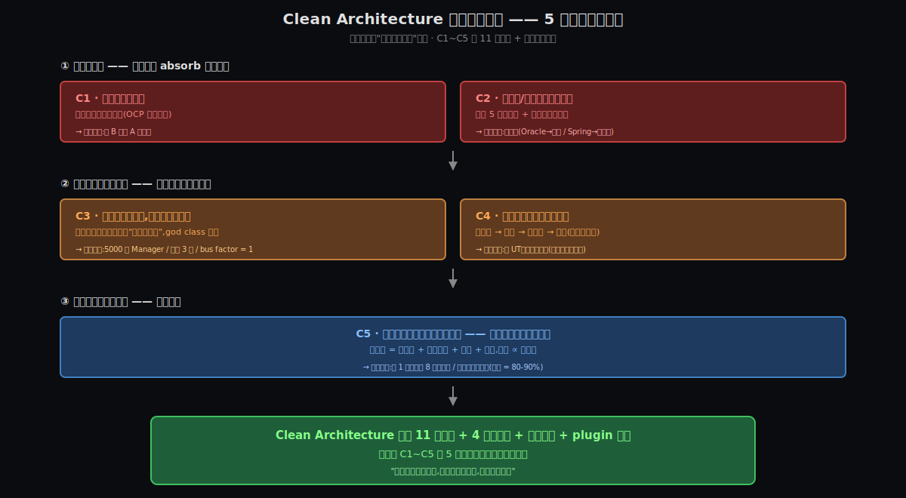

# 阶段 2:《架构整洁之道》为什么必须存在

> **Why 阶段的本分** —— 这一节立起本套件的脊梁:**5 条不可再分的约束(C1~C5)**。后面所有讨论(How / Origin / Deep / Comparison / Synthesis)都会**反复回到这份清单**:每讲一个机制、每引入一个原则,都要回答**"它在解决清单上的哪几条"**。**没引用约束的机制 = 开发者偏好,不是架构必然**。

---

## 约束清单速查(C1~C5)

#### C1 — 新需求持续到来,加新需求常被迫改老代码 → 引入回归
新需求是软件演化的客观规律(**Lehman 定律**, 1980)。改老代码就有引入回归的风险(**OCP 失败陷阱**)。
**口诀**:加 B 需求 → A 又挂了

#### C2 — 技术栈/供应商的不可控演化
框架自己 5 年换一茬;且可能被强制替换(信创、并购、Vendor 倒闭)。架构必须能在它们换装时**让业务存活**。
**口诀**:Spring 的命运不是你定的

#### C3 — 系统复杂度增长时,"超级方法/超级类"必然涌现(除非架构主动对抗)
加新功能成本最低的路径就是"塞进已有的类"。这种**路径依赖**日积月累,**god class 必然涌现** —— 哪怕没人故意。
**口诀**:5000 行的 XXXManager 不是有人故意写的

#### C4 — 测试反馈速度决定生产力
慢测试 → 不写 → 不敢重构 → 代码僵化死亡(**测试塌方正反馈循环**)。
**口诀**:无 UT、上线即调试 = 进入"不敢改"循环

#### C5 — 改一处的代价跟波及面成正比
经济约束:**总成本 = 改动量 + 风险评估 + 测试 + 沟通**,各项跟波及面正相关。**统领所有原则的元约束**。
**口诀**:让"局部改动"真的局部

---

## §0 从 What 走到 Why:三件事记住

What 阶段我们建立了"**什么是 Clean Architecture**" —— 同心圆四层、依赖朝内、11 条原则、plugin 架构。但**没有回答 BOB 大叔为什么要发明这套东西**。

这一节就回答这件事。我们不去描述"理想的架构长什么样"(那是 What),也不去说"具体怎么实现"(那是 How)。我们去挖**任何软件项目都在跟什么打架** —— 不是 Spring 项目独有的痛、也不是中国信创独有的痛,而是**所有软件,从 1968 年 Software Crisis 至今 60 年,都在跟同一组物理约束做斗争**。

Clean Architecture 是这场斗争里的一种**工程响应** —— 不是天才的灵光一现,是对硬约束的**精确反应**。

### 三件事记住

**事 ①:5 条约束都是物理事实 / 工程定律 / 经济现实,不是 BOB 大叔的个人偏好**

| 约束 | 来源 |
|---|---|
| **C1** | **Lehman 定律**(1980,Manny Lehman):软件系统必须持续演化,否则就死 |
| **C2** | 经济 + 政策事实:供应商市场结构 + 国家级政策约束(信创就是最强证据) |
| **C3** | **路径依赖**效应 + **Miller's Law**(1956,人脑短期记忆 7±2 块) |
| **C4** | 经验循环:测试塌方反馈环路(Michael Feathers 整本《修改代码的艺术》的论点起点) |
| **C5** | 软件工程经济学:Boehm COCOMO 模型 + Brooks《人月神话》+ 信息论(联合熵增长) |

—— **不是 BOB 大叔说的,是事实**。BOB 只是把这些事实精炼成了 11 条原则。

这一点很关键 —— 当未来你听到"Clean Architecture 过时了 / 是 OOP 的产物 / 不适用 X 场景",问一句:**"那这 5 条约束你打算怎么办?"**。如果没有更好的答案,Clean Architecture 仍然是最优解。

**事 ②:5 条约束之间互为因果,构成"变化压力管理"框架**

```
变化的来源(C1 + C2)            ← 你必须 absorb 的压力源
        ↓
承受变化的能力(C3 + C4)         ← 决定代码会不会僵化
        ↓
单次变化的代价(C5)              ← 经济基础(总成本 ∝ 波及面)
        ↓
   Clean Architecture 是工程响应
```

5 条不是孤立的事实,是一个**完整的因果链**:

- **C1 + C2 是输入**(变化压力 —— 业务变 + 技术变)
- **C3 + C4 是滤波器**(决定压力会不会摧毁系统)
- **C5 是经济约束**(决定每次变化的成本上限)

任何架构理论,都是在回答**"输入这么大压力 + 承受能力这么有限 + 单次代价这么贵,代码该怎么组织才能活下去"**。Clean Architecture 是一种回答,DDD 是另一种,Hexagonal 又是另一种 —— **它们都在回答同一组问题**。

**事 ③:Clean Architecture 全部 11 条原则 + 4 层同心圆 + 依赖朝内 + plugin —— 都是对 C1~C5 的工程响应**

这是 §5 会详细映射的内容,这里先 preview 一下:

| 约束 | 主要对策 |
|---|---|
| **C1**(新需求 + OCP 失败陷阱) | OCP + plugin 架构(寻找扩展点,加新代码而非改老代码) |
| **C2**(供应商不可控演化) | DIP + 业务核心独立 + 同心圆依赖朝内 |
| **C3**(超级类必然涌现) | SRP + CCP + 同心圆边界(给 god class 涌现踩刹车) |
| **C4**(测试反馈速度) | DIP + 业务核心可独立测试(不起 Spring/Oracle 也能跑) |
| **C5**(波及面 ∝ 代价) | **统领所有 11 条原则** —— 控制不同尺度的波及面 |

读到这里你应该已经能感觉到:**Clean Architecture 不是孤立创新,是 60 年软件工程经验对 5 条物理约束的精炼回应**。

---

## §1 一张极简概览图



**从图上能直接读出来的 5 件事**:

1. **5 条约束分 3 层**:变化来源(C1+C2)→ 承受能力(C3+C4)→ 单次代价(C5)
2. **每条约束都已经接住你的具体痛点**(每个 box 下面的斜体注释)
3. **箭头表示因果**:上层压力穿透下层,直到落到 C5 这个经济上限
4. **底部 Clean Architecture 是工程响应** —— 11 条原则 + 4 层同心圆 + 依赖朝内 + plugin 都是对这 5 条的回答
5. **"没引用约束的原则,就是开发者偏好,不是架构必然"** —— 这是后续所有阶段的纪律

---

## §2 没有 Clean Architecture 的世界

如果你用一句话给一个非程序员朋友描述"软件没有架构会怎样",可以这么说:**"代码会变成你眼前这座屎山"**。但这句话太抽象,我们具体描述 4 个场景。

### §2.1 场景 A:加新需求要改老代码 → 上线 bug 雪崩

**现实样本(你的项目)**:
- 产品方提出"投诉自动分类"新需求
- 你打开代码,**没有任何"插入点"**可以单独添加这个功能
- 你被迫修改 `XXXManager` 类的 `processComplaint` 方法,加入新分支
- 测试通过了 7 个,有 1 个失败 —— 你查了 3 天,发现是另一个流程在偷偷读你修改的字段
- 上线后,B 区客户报了一个跟"投诉分类"完全无关的 bug —— 因为你改的代码触发了**另一个分支的回归**

—— 你说**"加 B 需求 A 又挂了"**,就是这个场景。这是 **C1 失败**。

### §2.2 场景 B:技术栈/供应商被强制更换 → 业务代码全部牵动

**现实样本(你的项目)**:
- 公司下达国产化指令:Oracle → 达梦,Spring Boot → 东方通
- 你打开代码,发现 `@Entity / @Service / @Autowired` 长在领域类上 —— **Spring 渗透到业务核心**
- Oracle 方言 SQL(`ROWNUM` / `NVL` / `CONNECT BY`)散落在 200+ 个 DAO 里
- MyBatis Mapper 直接被 Service 类 `import`,**业务流程跟 MyBatis 绑死**

—— 国产化"举步维艰",**改全部代码 ~80-90%**,差距是 Clean Architecture 项目的 5-10 倍。这是 **C2 失败**。

### §2.3 场景 C:超级类涌现 → 新人 3 周才能上手

**现实样本(你的项目)**:
- `XXXManager` 类 5000 行,谁都不敢动
- 新人入职第 1 周:打开 IDE,看到 `XXXManager` 不知从哪开始读
- 新人入职第 2 周:终于读完一遍,但忘了第 1 周看的部分
- 新人入职第 3 周:终于能跟着改一个小 bug 了
- 而 5000 行的"超级类"**不是有人故意设计成这样的** —— 是 5 年里"反正再加几行"的累积

—— "老人离开,新人窝火",**bus factor = 1 已死**。这是 **C3 失败**。

### §2.4 场景 D:无 UT、上线即调试 → 进入"不敢改"循环

**现实样本(你的项目)**:
- 没有单元测试(你说过)
- 改完代码,直接上线
- 上线发现 bug,在生产环境调试
- 修完 bug 不补测试 —— 因为补测试要起 Spring + Oracle + Redis + Kafka,本地 30 秒一轮
- 下次改代码,**因为没测试,心理上不敢改**
- 不敢改,代码就僵化;僵化,业务方更急;更急,你更乱改;更乱改,bug 更多

—— **这是个负反馈深渊**。你已经掉进去了。这是 **C4 失败**。

---

**4 个场景合起来 = 你眼前的屎山**。每个场景都对应清单里的一条约束。

注意:**你的屎山不是因为团队水平差**(你描述的是一个有过良好初期架构、被业务速度 + 领导口味 + 老人离职碾压的项目)。它是因为 5 条约束**没人主动对抗**。

Lehman 定律继续发动需求压力,Miller 定律继续逼超级类涌现,测试塌方循环继续发酵,波及面继续放大 —— 这是**默认状态**。**没有架构主动对抗的项目,默认就会变成屎山**。

---

## §3 不可再分约束清单(C1~C5 详细展开)

每条约束按"约束本身 / 不可再分性 / 来源 / Clean Architecture 对策 / 对照你的屎山"五段式展开。

---

### §3.1 C1 — 新需求持续到来,加新需求常被迫改老代码 → 引入回归

**约束本身**:

> 新需求会**不断到来**(这是软件存在的目的),而且改老代码就**有引入回归**的风险。这一对约束的合体形成 **"OCP 失败陷阱"** —— 加新需求时,如果没找到扩展点,就只能改老代码 → 引入回归。

**为什么不可再分**:

- "需求会变" → Lehman 定律,无法消除(系统不变化就死了)
- "改老代码引入回归" → 任何系统都有不完美的测试覆盖,改老代码必然有未知风险
- 两者合并 → 你**必须**让"加新需求"路径上有扩展点,否则就要付回归代价

**来源**:Lehman's Law of Software Evolution(1980)+ OCP(BOB 大叔 1988 总结自 Bertrand Meyer 1987)

**Clean Architecture 对策**:

- **OCP**(开闭原则):对扩展开放,对修改关闭
- **plugin 架构**:把"差异点"做成可热插拔的插件
- **同心圆边界**:扩展点放在 Adapter 层(适配器层),Entity / Use Case 不动

**对照你的屎山**:A 区代码 copy 到 B 区 → 没找到"扩展点",只能 copy + 修改。如果当初有 OCP 思维,**B 区差异应该是一个 plugin**:写一个"区域定制化"接口,A 区有自己实现,B 区写新实现挂上去 —— A 区代码**一行都不该被改**。

---

### §3.2 C2 — 技术栈/供应商的不可控演化

**约束本身**:

> Spring / Oracle / 任何第三方 SDK 都不是你能控制的:它们可能被并购、停服、被强制替换(信创就是法律级证据)。架构必须能在它们换装时**让业务存活**。

**为什么不可再分**:

- "供应商不可控" → 经济 + 政策事实,无法消除
- "技术栈演化速率 > 业务规则演化速率" → 业务核心(投诉/工单的本质)几十年不变,Spring 5 年换一茬
- 两者合并 → 你**必须**让业务核心不依赖于 framework,否则换 framework 等于改业务

**来源**:Lehman 演化模型 + 经济现实(供应商市场)+ 政策约束(信创)

**Clean Architecture 对策**:

- **DIP**(依赖反转):接口由高层(业务)定义,framework 实现接口
- **业务核心独立于框架**:Entity 类是 POJO,无任何框架注解
- **同心圆依赖朝内**:framework 在最外层,所有人依赖业务核心,业务核心不知道 framework 存在

**对照你的国产化**:你正在经历的这个迁移,如果当初按 Clean Architecture 建,**只改最外两层(Adapter + Framework)**,业务一行不动 → ~10-20% 代码改;现在的"举步维艰" → ~80-90% 代码改。**差距 5-10 倍是这条约束失败的成本**。

---

### §3.3 C3 — 系统复杂度增长时,"超级方法/超级类"必然涌现(除非架构主动对抗)

**约束本身**:

> 加新功能成本最低的路径就是 **"塞进已有的类"** —— 测试现成、调用方现成、不用想新边界。这种**路径依赖**日积月累,**god class 必然涌现** —— 哪怕没人故意。

**为什么不可再分**:

- "加新功能时倾向于塞进已有类" → 物理事实(认知带宽 + 路径阻力最小化)
- 这种倾向**不会自动停止** → **没有外力对抗,熵增是默认状态**
- 两者合并 → 你**必须**有架构作为外部强制,否则 god class 必然涌现

**来源**:Miller's Law(1956)+ 软件熵增定律 + 路径依赖经济学

**Clean Architecture 对策**:

- **SRP**(单一职责):每个类只对一个 actor 负责
- **CCP**(共同闭包原则):一起变化的类放一起
- **同心圆边界**:每层只关心自己的关注点
- **可测试性**(隐性对策):写测试逼着你拆类,不拆就难写测试

**对照你的屎山**:5000 行的 `XXXManager` 没人故意,是 5 年里"再加几行"的累积。新人 3 周才上手,因为认知带宽超载。bus factor = 1,因为隐性知识只在原作者脑子里 —— **三个症状都是同一条约束的失败**。

---

### §3.4 C4 — 测试反馈速度决定生产力

**约束本身**:

> 测试越慢 → 越不写 → 不敢重构 → 代码僵化死亡(**测试塌方正反馈循环**)。一旦掉进去就难爬出来,因为爬出来要先补测试,而补测试在屎山项目里成本巨大(要起一堆基础设施)。

**为什么不可再分**:

- "慢测试不爱写" → 心理事实(短期成本 vs 长期收益的折现率不对称)
- "不写测试就不敢改" → 风险管理事实(没安全网就保守)
- "不敢改就僵化" → 业务事实(僵化的代码不能 absorb 新需求)
- 三者合并 → 一个**自我强化的负螺旋**

**来源**:Michael Feathers《Working Effectively with Legacy Code》(2004)整本书的论点起点 + 软件工程经济学(Boehm)

**Clean Architecture 对策**:

- **DIP**:让业务核心可被 mock 隔离,不起 Spring/Oracle 也能跑测试
- **业务核心独立于框架**:Entity 类的测试是纯 Java,毫秒级
- **boundary 接口**:跨边界的依赖都通过接口,可以 stub

**对照你的屎山**:你说 **"无 UT、上线即调试"** —— 你已经站在这个深渊**最深处**。爬出来的路径(增量补测试 + 隔离 framework + 找到 seams)是 Michael Feathers 那本书的主题,Clean Architecture 提供 destination,Feathers 提供 path。

---

### §3.5 C5 — 改一处的代价跟波及面成正比

**约束本身**:

> 经济约束:**一次改动总成本 = 改动量 + 风险评估 + 测试 + 沟通**,各项跟波及面正相关。**统领所有 11 条原则的元约束** —— 因为 SRP / OCP / LSP / ISP / DIP / REP / CCP / CRP / ADP / SDP / SAP **每一条最终都在控制"波及面"**。

**为什么不可再分**:

- "改一处要改动" → 改动成本本身,无法消除
- "改动有风险,要评估" → 风险评估时间 ∝ 影响面大小
- "改完要测试" → 测试时间 ∝ 影响面大小
- "改动要通知别人" → 沟通成本 ∝ 涉及的团队/模块数量
- 四项合一 → **总成本 ∝ 波及面**,这是经济铁律

**来源**:Boehm COCOMO 模型 + Brooks《人月神话》+ 信息论(联合熵增长)

**Clean Architecture 对策**:

> **所有 11 条原则的最终目标都是控制波及面**:
>
> | 原则 | 控制什么尺度的波及 |
> |---|---|
> | **SRP** — Single Responsibility Principle / 单一职责原则 | 类内部的波及(改一个 actor 的逻辑不波及其他 actor) |
> | **OCP** — Open-Closed Principle / 开闭原则 | 扩展时的波及(加新代码不动老代码) |
> | **LSP** — Liskov Substitution Principle / 里氏替换原则 | 替换时的波及(换实现不动调用方) |
> | **ISP** — Interface Segregation Principle / 接口隔离原则 | 接口的波及(接口拆细,改方法不波及不用它的调用方) |
> | **DIP** — Dependency Inversion Principle / 依赖反转原则 | 依赖方向的波及(高层不被低层污染) |
> | **REP** — Reuse-Release Equivalence Principle / 复用-发布等价原则 | 发布的波及(独立发布单元,版本独立演化) |
> | **CCP** — Common Closure Principle / 共同闭包原则 | 变化的波及(一起变化的放一起 → 改动不跨组件) |
> | **CRP** — Common Reuse Principle / 共同复用原则 | 依赖的波及(只依赖你需要的) |
> | **ADP** — Acyclic Dependencies Principle / 无环依赖原则 | 循环依赖的波及(无环 → 局部改动真的局部) |
> | **SDP** — Stable Dependencies Principle / 稳定依赖原则 | 依赖方向的波及(稳定方向) |
> | **SAP** — Stable Abstractions Principle / 稳定抽象原则 | 扩展点的波及(稳定的应该是抽象的) |

**对照你的屎山**:**所有你的痛点最终都是 C5 的失败** —— 改一字段触发 8 测试失败、加 B 需求 A 挂了、国产化举步维艰、改 X 要打开 8 个文件 —— **全是波及面失控**。

---

### §3.6 5 条约束的级联关系 —— 屎山的时间演化

5 条约束**有两种看法,都对**:

**看法 A:层级看(物理维度)** —— 已在 §0 事 ② 讲过

```
变化来源(C1 + C2) → 承受能力(C3 + C4) → 单次代价(C5,统领)
```

这是 **BOB 大叔写书的视角** —— 从物理事实推理工程响应。

**看法 B:级联看(时间维度)** —— 屎山是怎么"长成"的:

```
C1: 项目运行,新需求持续到来,架构不合理 → 加新需求触发回归
        ↓
C3: 改老代码不便,堆砌逻辑到现有类 → 超级类 / 超级方法涌现
        ↓
C4: 没 UT,回归测试靠手工 / 上线发现 → 改一处时间成本爆炸
        ↓
C2: 几年后技术栈强制更换(信创等)→ 全部业务被 framework 绑死,迁移地狱
        ↓
综合崩溃: 团队一片哀鸿
```

这是 **工程师亲历屎山的视角** —— 从 entry point 到综合崩溃的时间序。

---

**两种看法 reflect different things**:

| 视角 | 解释什么 | 谁的视角 | 实战意义 |
|---|---|---|---|
| **A 层级看(物理)** | 5 条约束的物理模型(为什么是 Lehman / Miller / 经济铁律) | BOB 大叔 / 架构师 | **回答 "为什么 Clean Architecture 是合理的"** |
| **B 级联看(时间)** | 5 条约束在真实项目里按时间序如何展开 | 工程师 / 屎山亲历者 | **回答 "屎山要救援该从哪下手"** |

---

**视角 B 的关键洞察 —— 屎山 evolution 的 entry point 是 C1**:

> 如果你想**救一个屎山项目**,**把刹车踩在 C1 是最早期、最便宜的**。等到 C2(技术栈强制更换)才动,那已经是末期 —— 全部代码都已经被 C3、C4 摧毁过一轮,救援代价指数级增大。
>
> **具体踩刹车的工程动作**:在加每一个新需求时,**强制问一次** —— "**这是改老代码,还是加新代码**(OCP)?如果是改老代码,**有没有可能改成加新代码**?"。这一个问题如果坚持问 6 个月,屎山演化就会显著放缓。

—— 这正是 **OCP 作为 C1 对策**的工程化形式。What 阶段我们说 OCP 是"对扩展开放对修改关闭",听起来抽象;接到这条 cascade 后,**OCP 变成了"屎山演化第一道刹车"**,具体到每次写代码的瞬间。

---

## §4 核心 insight

把 5 条约束抽象成一句话,就是 Clean Architecture 全套的灵魂:

> **"软件架构是对'变化压力'的工程响应 —— 让局部改动真的局部,即使在持续演化的系统里。"**

或者用更紧凑的形式:

> **"用'依赖方向'换'波及面控制'。"**

这是 Clean Architecture 整套思想的**一句话浓缩**。所有具体原则、4 层同心圆、依赖朝内、plugin 架构,都是这句话的展开。

**为什么"依赖方向"是关键交换物**:

- 依赖方向决定了"谁知道谁的存在" —— 这是波及面的边界
- 朝错了方向,波及面就跨过该有的边界(底层一变,高层全炸)
- 朝对了方向,波及面就被局限在该有的范围(底层变,高层不知,因为高层定义抽象)
- **DIP / SDP / SAP 三件事的灵魂都是这件事**:让"稳定且抽象的核心"被"不稳定且具体的细节"依赖,而不是反过来

把这句话记下来,后面 How / Origin / Deep 阶段每讲一个机制,都能拿这句话去拷问"它在以什么方式控制波及面"。

---

## §5 这个 insight 怎么解决了 5 条约束(约束 ↔ 对策映射)

| 约束 | 主要对策 | 工程化体现 |
|---|---|---|
| **C1**(新需求持续到来 + OCP 失败陷阱) | OCP + plugin 架构 | 把差异做成可插拔的 plugin,加新需求 = 加新代码 |
| **C2**(技术栈/供应商不可控演化) | DIP + 业务核心独立 + 同心圆依赖朝内 | 接口在业务 jar 里,framework 实现接口 |
| **C3**(超级类必然涌现) | SRP + CCP + 同心圆边界 | 每个类一个 actor,一起变化的放一起 |
| **C4**(测试反馈速度决定生产力) | DIP + 业务核心可独立测试 | Entity 是 POJO,纯 Java 毫秒级测试 |
| **C5**(改一处代价 ∝ 波及面)| **统领** —— 所有 11 条原则 | 每一条都在控制不同尺度的波及面 |

**注意 C5 是元约束** —— 它不是"被某条原则解决",而是**所有原则共同服务的目标**。其他 4 条约束(C1~C4)是 C5 的具体表现形式(在不同场景下波及面失控的样子)。

---

## §6 呼应灵魂问题

你的灵魂问题是 **"完整理解《架构整洁之道》的设计哲学与可落地方法"**。

Why 阶段把这个问题闭环了 **大约 35%**:

**已闭环的部分**:

- ✅ **设计哲学的根因** —— Clean Architecture 不是 BOB 灵光一现,是对 5 条物理约束(C1~C5)的工程响应
- ✅ **哲学的内核** —— "用依赖方向换波及面控制"
- ✅ **11 条原则的合法性** —— 每条都对应 C1~C5 中的一条或多条;**没引用约束的原则就是开发者偏好,不是架构必然**

**未闭环的部分**(留给后续阶段):

- ⏳ **How 阶段**:每条原则的**精确机制**(SRP 怎么操作、DIP 怎么实现、plugin 怎么挂)
- ⏳ **Origin 阶段**:Clean Architecture 的**历史脉络**(BOB 怎么走到这套思想 / Hexagonal 怎么影响 / DDD 怎么互补)
- ⏳ **Deep 阶段**:精选 2~3 个机制(可能是 DIP / Plugin / boundary)做**反事实剖析**(去掉它会怎样?)
- ⏳ **Comparison 阶段**(可选):跟 DDD / Hexagonal / Onion 横向对照
- ⏳ **Synthesis 阶段**:把所有学到的东西沉淀成"**下次新项目从一开始就建对**"的可执行方法论(这是你 B 级别目标的最终交付)

—— 现在你拿到了**脊梁(C1~C5)**,后面所有内容都会回到这份清单。每一次"为什么 BOB 大叔说要这样",都能精确回答 **"因为它在解决 Cn"**。

---

## 修订记录

| 时间 | 修订摘要 | 触发原因 |
|---|---|---|
| 2026-05-05 初稿 | 写入 5 条约束(C1-C5)+ 4 个"没有 Clean Architecture 的世界"场景(每个钉用户屎山具体痛点)+ 核心 insight + 约束 → 对策映射 + 呼应灵魂问题(闭环 ~35%);每条约束按"约束本身/不可再分性/来源/Clean Architecture 对策/对照用户屎山"五段式展开;配 SVG 概览图(`pics/02-overview.svg`)展示"变化来源 → 承受能力 → 单次代价 → 工程响应"的因果链 | Why 阶段首次生成;用户偏好 A 窄而精(4-6 条);用户主动 redirect C1(从"变化速率不对称"改为"新需求 + OCP 失败陷阱")和 C3(从"Miller's Law"改为"超级方法/超级类涌现");用户 confirm C4("无 UT 上线即调试"为标题口诀);C2 / C5 直接通过候选讨论 |
| 2026-05-05 patch-1 | 新增 §3.6「5 条约束的级联关系 —— 屎山的时间演化」—— 用户回答反问"只保留一条会留哪条"时给出 C1 的级联推理(C1 → C3 → C4 → C2 → 综合崩溃),整理成"视角 A 层级看(物理) vs 视角 B 级联看(时间)"两种合法 framing;关键洞察"屎山救援 entry point 在 C1,踩刹车要踩在 OCP 上",把 OCP 从抽象原则升华到"屎山演化第一道刹车"具体动作 | 用户对反问的回答 too good to lose:他的级联链是工程师亲历屎山的视角,跟 BOB 大叔的物理模型互补;直接进文档作为 C5 元约束之外的"屎山 evolution timeline" |
| 2026-05-05 patch-2 | §3.5 C5 末尾"所有 11 条原则的最终目标都是控制波及面"对照表,每条缩写后追加英文全称 + 中文翻译(如 `SRP — Single Responsibility Principle / 单一职责原则`),11 条全部展开 | 用户反馈:这个表里 11 条都是缩写,要求展开成单词 + 加中文翻译以方便记忆 |
