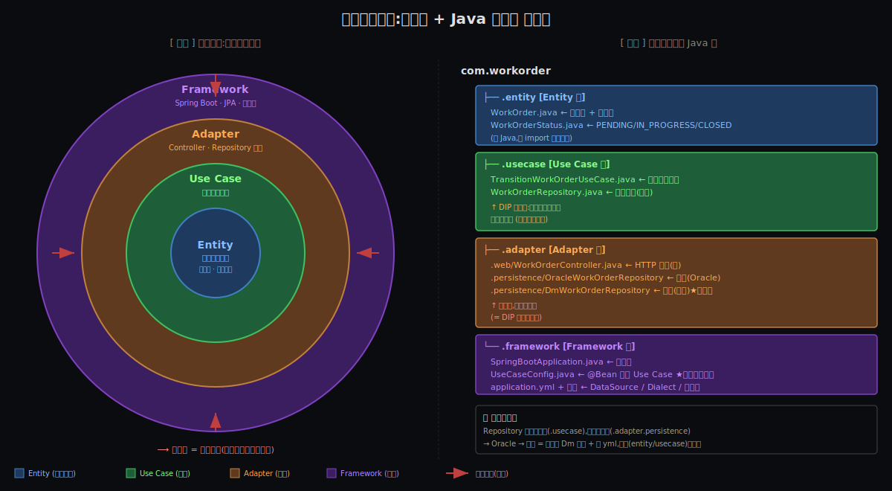

# 阶段 3:整洁架构 大致怎么工作

> 把 Why 阶段建立的 5 条约束(C1~C5)精确化成 **3 个核心结构**(同心圆四层 / 依赖规则 / DIP 反转),落到 Java 包。
> 骨架级 — 只到"组件 + 物理边界"就停。具体选择题(Use Case 必须返 DTO 还是 Entity?)留给 Deep。

---

## 约束清单速查(C1~C5)

#### C1 — OCP 失败陷阱
新需求持续到来,加新需求常被迫改老代码 → 引入回归。
**口诀**:必须留扩展点

#### C2 — 技术栈/供应商不可控
技术栈和供应商的演化不在你控制中(政策、市场、信创)。
**口诀**:业务核心不依赖 framework

#### C3 — 复杂度涌现
系统复杂度增长时,"超级方法/超级类"必然涌现(除非架构对抗)。
**口诀**:必须主动对抗熵增

#### C4 — 测试反馈速度
测试反馈速度决定生产力("无 UT → 上线即调试" 自我强化负螺旋)。
**口诀**:核心必须快速可测

#### C5 — 改动代价 ∝ 波及面 (元约束)
改一处的代价跟波及面成正比。
**口诀**:控制波及面 = 控制总成本

---

## §0 从 Why 走到 How:三件事记住

Why 阶段建立了 5 条约束,但**约束本身没告诉你"代码该长什么样"**。从 Why 走到 How,要把 5 条约束精确化成 **3 个具体可落地的结构**。

### §0.1 同心圆四层结构

**因为 [C3](#c3--复杂度涌现) + [C5](#c5--改动代价--波及面-元约束)**(复杂度涌现 + 改动 ∝ 波及面)
   ↓
**要解决**:复杂度增长时,得有一个"先天的隔板",防止任何一处的修改无限蔓延
   ↓
**所以引入 同心圆四层**(Entity / Use Case / Adapter / Framework):每层只能用更内圈的东西。改一层最多波及它和它外圈;改 Entity 是地震,改 Framework 是地皮 — **改动代价跟"哪一层"绑死**。

| 层 | 装的是 | 例子(工单系统) |
|---|---|---|
| **Entity**(最内) | 企业业务规则,跨用例都不变的东西 | `WorkOrder` 自身的状态机:已关闭单不能再扭 |
| **Use Case** | 应用业务规则,本应用特有的工作流 | "派单人才能扭转 + 时间窗校验 + 通知关联人" |
| **Adapter** | 翻译层 | `WorkOrderController`(HTTP→入参)/ `OracleWorkOrderRepository`(SQL←Entity) |
| **Framework**(最外) | Spring Boot / JPA / Tomcat / 东方通 | `application.yml`、`SpringBootApplication` 启动器 |

### §0.2 依赖规则

**因为 [C2](#c2--技术栈供应商不可控) + [C5](#c5--改动代价--波及面-元约束)**(技术栈不可控 + 改动 ∝ 波及面)
   ↓！
**要解决**:外层(框架/数据库/UI)注定会变,变化的代价不能传染到内层
   ↓
**所以引入 依赖规则**:同心圆任意一层的 `import` / 引用,**只能指向更内的层**,绝不能反向。

#### §0.2.0 「依赖」到底是什么意思?(物理本质)

谈"依赖"之前,要把这个词钉死。最朴素也最准确的定义:

> **A 依赖 B = A 的 `.java` 文件里有 `import B` 语句;B 不存在,A 编译不过。**

这是**物理事实**,不是抽象比喻。所以"依赖向内"不是设计美学偏好,而是**编译顺序的物理约束**:

```
Entity      ← 不 import 任何外层 → 第 1 个能编译
   ↑
Use Case    ← 只 import Entity   → 第 2 个能编译
   ↑
Adapter     ← import Entity + Use Case + 框架标准接口 → 第 3 个能编译
   ↑
Framework   ← import 所有内层 → 第 4 个(最后一个)能编译
```

这是个 **DAG 拓扑序**。一旦出现 cycle —— 比如 `.usecase` 和 `.adapter` 互相 import —— **多模块 Maven 项目会编译失败**。

##### 反例:循环依赖怎么形成 + 怎么断开

**真循环的物理形态**(朴素方案常见):

```java
// .usecase/TransitionWorkOrderUseCase.java
import com.workorder.adapter.persistence.OracleWorkOrderRepository;  // ❌ 直接 import 实现类

// .adapter.web/WorkOrderController.java
import com.workorder.usecase.TransitionWorkOrderUseCase;  // ← 这条本身没问题
```

⚠️ 现在 `.usecase` ↔ `.adapter` **双向 import** —— Maven 多模块直接编译失败。

**整洁架构怎么断开**(通过 DIP 反转,§0.3):接口在内层定义,实现在外层 → `.usecase` → `.adapter` 那条 import 不存在了 → cycle 断开。

##### 记忆口诀

> **依赖 = `import` = 编译顺序 = 谁能没有谁活下来**

##### 自检方法:你的项目算不算干净?(两个物理实验)

**实验 1:classpath 移除测试**

> 把 `spring-boot-*.jar`、`spring-*.jar`、`mysql-connector-*.jar`、`kafka-clients-*.jar` 等框架/驱动 jar **从 `.entity` 和 `.usecase` 模块的 classpath 移除**,然后 `mvn compile` 看能不能编译过。
>
> - ✅ 编译过 = **干净** —— 业务核心代码完全独立,不依赖任何框架
> - ❌ 编译报错 = **不干净**,业务核心已被框架污染

**实验 2:独立 jar 发布测试**

> 把 `.entity` + `.usecase` 这两个包**单独打成 jar**(`workorder-core.jar`),发布到 Maven 仓库。
>
> - 这个 jar 应该**只依赖 JDK 标准库**,体积通常 < 100KB
> - 其他项目想接入这套业务核心 → 直接 `<dependency>workorder-core</dependency>` 就行

这是 Why 阶段 11 条原则中 **REP(Reuse-Release Equivalence Principle)** 在整洁架构里的物理实现 —— **业务核心 = 一个可独立发布的单元 = 跨项目可复用**。

> 💬 用户原话(2026-05-06):
> "怎么识别或者检验呢?就是如果去掉 springboot 或者 spring 的依赖,在 classpath 上去掉,那么核心的代码还是否能编译过?"
> "核心业务流程可以单独发布 jar 包,来共享。"

#### §0.2.1 依赖规则的具体形态(Java import 限制)

- `.entity` 包内:**不能 import 任何外层**(Spring、JPA、Jackson 都不行)
- `.usecase` 包内:可以 import `.entity`,但**不能 import** `.adapter` / `.framework`
- `.adapter` 包内:可以 import `.entity` 和 `.usecase`,可以用框架标准接口(`javax.servlet.HttpServletRequest`)
- `.framework` 在最外:可以装配所有内层

### §0.3 边界 + DIP 反转

**因为 [C1](#c1--ocp-失败陷阱) + [C2](#c2--技术栈供应商不可控)**(OCP 失败 + 技术栈不可控)
   ↓
**要解决**:Use Case 一定需要"持久化"/"调外部 API"等外层能力,但又不能引用外层 — 看似矛盾
   ↓
**所以引入 DIP 反转**:Use Case 自己**定义接口**(称作"输出边界" / Output Boundary),Adapter 层**实现这个接口**;依赖箭头是 Adapter→UseCase,不是 UseCase→Adapter。

```java
// 在 .usecase 包(内层) — 接口定义
public interface WorkOrderRepository {
    WorkOrder findById(Long id);
    void save(WorkOrder w);
}

// 在 .adapter.persistence 包(外层) — 实现内层定义的接口
public class OracleWorkOrderRepository implements WorkOrderRepository { ... }
public class DmWorkOrderRepository    implements WorkOrderRepository { ... }
```

**国产化切换** = 加一个 `DmWorkOrderRepository` + 改 `application.yml`,**内层零修改**。这是 DIP 的工程价值,§2.3 信创对照表会展开。

### 三件事对照

| 第 X 件事 | 是什么 | 为什么存在(出自哪条约束) |
|---|---|---|
| **同心圆四层** | 把代码分到 4 个圈,内圈最稳、外圈最易变 | [C3](#c3--复杂度涌现) + [C5](#c5--改动代价--波及面-元约束) |
| **依赖规则** | 任何 `import` / 引用只能指向更内的层 | [C2](#c2--技术栈供应商不可控) + [C5](#c5--改动代价--波及面-元约束) |
| **边界 + DIP 反转** | 内层定义接口,外层实现接口 | [C1](#c1--ocp-失败陷阱) + [C2](#c2--技术栈供应商不可控) |

**三件事如何嵌套**:同心圆是**容器**(代码摆在哪一格);依赖规则是**铁律**(格之间怎么连);DIP 是**穿越规则的合法通道**(没有它,内层就被外层卡住没法工作)。

---

## §1 一张极简概览图



**5 件能从图上读出来的事**:

1. **左半抽象 / 右半物理**:左边的同心圆告诉你"4 层各装什么",右边的 Java 包树告诉你"代码该放哪个包"
2. **颜色 = 层级**:蓝 = Entity / 绿 = Use Case / 橙 = Adapter / 紫 = Framework
3. **依赖箭头**:左图红箭头从外指向内;右图包树**不能反向 import**
4. **DIP 反转点**:`WorkOrderRepository` **接口**在 `.usecase`(内层)定义,**实现**在 `.adapter.persistence`(外层)
5. **国产化切换的物理位置**:右图 `.adapter.persistence` 那个橙色框 — 加一个 `DmWorkOrderRepository`,内层零修改

---

## §2 同心圆四层细看

### §2.0 核心命题:Entity + Use Case 是业务内核,可单独编译

整个整洁架构的工程价值都从这一句出来。下面 4 层各自的职责,围绕这一句展开:

- **Entity + Use Case(内核)**:不依赖 spring/jpa/mysql/kafka,删掉外层 jar,这两层仍能 `javac` 通过(参见 §0.2.0 自检实验)
- **Adapter + Framework(外圈)**:跟具体技术栈 / 框架 / 容器绑定;它们是**为内核服务的**,不是反过来

判断"层级是否分清"的最简单测试:**把 `.entity` + `.usecase` 单独打 jar,能不能跨项目复用?能 = 内核成立;不能 = 业务跟框架混在一起了。**

### §2.1 Entity 层(最内,最稳定)

- **装**:**企业业务规则** —— 跨任何用例都不变的不变性。`WorkOrder` 的状态机(已关闭单不能再扭、扭转必须按 PENDING→IN_PROGRESS→CLOSED 顺序)。
- **不装**:任何 ORM 注解(`@Entity`、`@Column` 都不许)、任何序列化注解(`@JsonProperty` 不许)、任何 Spring 注解。
- **它依赖谁**:**只依赖 JDK 标准库**。打开 `.entity` 任意一个 .java,顶部不能有 `import org.springframework.*` / `import javax.persistence.*` / `import com.fasterxml.jackson.*`。
- **关联约束**:[C2](#c2--技术栈供应商不可控) + [C4](#c4--测试反馈速度) —— Entity 不依赖任何框架 → 业务核心可单测(0.001s)、可换框架。

### §2.2 Use Case 层(应用业务规则)

- **装**:**单个用例的工作流编排** —— 每个 Use Case 类负责一个用例(`TransitionWorkOrderUseCase`、`DispatchWorkOrderUseCase`、`CloseWorkOrderUseCase`)。
- **不装**:Entity 自身的不变性(那是 Entity 的事)、HTTP/DB/MQ 的具体翻译(那是 Adapter 的事)。
- **它依赖谁**:Entity + 自己定义的输出边界接口(如 `WorkOrderRepository`)。**不依赖任何框架**。
- **关联约束**:[C1](#c1--ocp-失败陷阱) + [C4](#c4--测试反馈速度) —— 一个 Use Case = 一个用例;新需求 = 加一个 Use Case 类(OCP);注假实现可单测。

> **Entity + Use Case 一起构成业务内核**,可独立编译、独立发布 jar(参见 §0.2.0 自检实验)。这是整洁架构最值钱的工程价值 —— 一切其他细节都为这一点服务。

### §2.3 Adapter 层(转接层 / 翻译层)

- **装**:**两类翻译器**:
  - **入站(Driver)**:`WorkOrderController`(HTTP → 命令)、MQ Consumer、定时任务调度器
  - **出站(Driven)**:`OracleWorkOrderRepository`(Entity → SQL)、外部 HTTP 客户端、邮件发送器
- **不装**:业务规则(任何业务规则都该往内层挪)、框架启动器(那是 Framework 的事)。
- **它依赖谁**:Use Case + Entity + 框架的**标准接口**(`javax.servlet.HttpServletRequest`、`javax.sql.DataSource`)。
- **关联约束**:[C1](#c1--ocp-失败陷阱) + [C2](#c2--技术栈供应商不可控) —— 接口在内层定义,Adapter 实现;切实现 = 加一个 Adapter,内层零修改。

#### §2.3.1 信创对照:Oracle → 达梦 = 只改这一层

```
.adapter.persistence/
  ├── OracleWorkOrderRepository.java   ← 旧实现保留(可灰度)
  └── DmWorkOrderRepository.java       ← 新加(实现同一接口)
```

**改动范围**:`.adapter.persistence` 一个包 + `application.yml` 一处 DataSource。

| 改动维度 | 朴素方案(无整洁架构) | 整洁架构 |
|---|---|---|
| 改动包数 | 全项目 | **1 个包** |
| 改动文件数 | 几十~上百 | **2~3 个** |
| 内层(`.entity` + `.usecase`)改动 | 散落 | **0 处** |
| 单测重跑 | 全部 | 仅 `.adapter.persistence` |
| 上线灰度 | 难(改动面广) | 易(同一接口两实现可双跑对比) |
| 回滚 | 改回去依然要改全项目 | 改 `application.yml` 一行 |

> 这是 DIP 的工程价值的一次性兑现 —— 平时多写几行 `WorkOrderRepository` 接口,迁移时省下指数级工作量。这正是 [C2](#c2--技术栈供应商不可控)(技术栈不可控)+ [C5](#c5--改动代价--波及面-元约束)(改动 ∝ 波及面)叠加在一起的实际收益。

### §2.4 Framework 层(最外,最易变)

- **装**:Spring Boot 启动器、`application.yml`、Tomcat / 东方通容器配置、JPA Dialect 配置、`@Configuration` + `@Bean` 装配代码(包括 `UseCaseConfig`,在最外层把 `.usecase` 的纯 Java 类装配进 Spring 容器)。
- **不装**:**任何业务代码**。这一层是"组装厂",不是"工厂车间"。
- **它依赖谁**:所有内层(它装配它们)。
- **关联约束**:[C2](#c2--技术栈供应商不可控) —— 框架/容器隔离在最外层;换框架 = 改 Framework 层,Use Case 零修改。

#### §2.4.1 信创对照:Spring Boot → 东方通 = 只改这一层

| 改动维度 | 改动范围 |
|---|---|
| **Framework 层** | ✅ 重写(启动器换、`@Configuration` 装配代码改) |
| **Adapter 层** | ❌ **零改动**(`@RestController` 是 Servlet 标准接口,东方通也支持) |
| **Use Case + Entity** | ❌ **零改动**(本来就不依赖任何框架) |

> 跟 §2.3.1 信创对照对比看 —— **两类信创迁移改动的层完全不同**:Oracle→达梦 只动 Adapter,Spring Boot→东方通 只动 Framework。这是 4 层分离的工程价值最尖锐的体现。

### §2.5 ⚠️ 常见疑问:Adapter 和 Framework 能合并成一层吗?

**直觉**:Controller(Adapter)已经在用 `@RestController`,Framework 层薄薄一层只放装配 + yml,**合一不行吗**?

**这个直觉来自工程现实**:很多 Spring Boot 教程里两层确实糊在一起 —— `SpringBootApplication.java` 跟 `XxxController.java` 经常在同一个 src 包下。

**戳破**:不行 —— 两层本质不同:

| | Adapter | Framework |
|---|---|---|
| 装什么 | 翻译器(Controller / Repository 实现 / MQ) | 装配 + 启动 + 容器 |
| 改动频率 | **高**(每次新需求改) | **低**(几年改一次) |
| 替换粒度 | **增量**(加新 Adapter 不影响别的) | **整体**(整个换框架) |

**信创证据**:对照 §2.3.1(Oracle→达梦 只动 Adapter)跟 §2.4.1(Spring Boot→东方通 只动 Framework)—— 两类迁移改动的层完全不同。合并就丢了"换 Framework 不震荡 Adapter" 的关键工程价值。

**判别尺子**:你需要"框架可独立替换"(信创、容器升级)吗?
- ✅ 需要 → **必须分 4 层**
- ⚠️ 短期项目 / PoC → 可妥协合并

> 用户公司信创(Oracle→达梦 + Spring Boot→东方通)预期内 → **必须 4 层分离**。
>
> 💬 用户原话(2026-05-06):"adapter 与 framework 层其实可以融合成一层,感觉两层层次没有那么明显。"
> 直觉来自小型项目工程现实(确实很多项目两层混);但对**信创预期内**项目错。

---

## §3 最小伪代码 demo

```java
// ━━━ .entity/WorkOrder.java —— 不 import 任何框架
package com.workorder.entity;

public class WorkOrder {
    private Long id;
    private WorkOrderStatus status;
    private Long assigneeId;
    private Instant dispatchedAt;

    public void transitionTo(WorkOrderStatus target) {
        if (this.status == WorkOrderStatus.CLOSED) {
            throw new IllegalStateException("已关闭工单不能再扭转");
        }
        if (!isLegalTransition(this.status, target)) {
            throw new IllegalStateException("状态机非法扭转: " + this.status + " → " + target);
        }
        this.status = target;
    }
}

// ━━━ .usecase/WorkOrderRepository.java —— 输出边界(接口在内层)
package com.workorder.usecase;
import com.workorder.entity.WorkOrder;

public interface WorkOrderRepository {
    WorkOrder findById(Long id);
    void save(WorkOrder w);
}

// ━━━ .usecase/TransitionWorkOrderUseCase.java —— 纯 Java,零 Spring
package com.workorder.usecase;

public class TransitionWorkOrderUseCase {
    private final WorkOrderRepository repo;
    private final NotificationGateway notifier;

    public TransitionWorkOrderUseCase(WorkOrderRepository repo, NotificationGateway notifier) {
        this.repo = repo;
        this.notifier = notifier;
    }

    public void execute(Long id, Long currentUserId, WorkOrderStatus target) {
        WorkOrder w = repo.findById(id);
        if (!w.getAssigneeId().equals(currentUserId)) {
            throw new SecurityException("仅派单人可扭转");
        }
        if (Duration.between(w.getDispatchedAt(), Instant.now()).toHours() > 48) {
            throw new IllegalStateException("扭转必须在派单 48h 内");
        }
        w.transitionTo(target);   // ← 进 Entity,不变性由 Entity 守
        repo.save(w);
        notifier.notifyTransition(w);
    }
}

// ━━━ .adapter.web/WorkOrderController.java
package com.workorder.adapter.web;
import org.springframework.web.bind.annotation.*;

@RestController
public class WorkOrderController {
    private final TransitionWorkOrderUseCase useCase;

    @PutMapping("/api/workorders/{id}/transition")
    public ResponseEntity<?> transition(@PathVariable Long id,
                                        @RequestBody TransitionReq req,
                                        @AuthenticationPrincipal User user) {
        useCase.execute(id, user.getId(), req.getTo());
        return ResponseEntity.ok().build();
    }
}

// ━━━ .adapter.persistence/OracleWorkOrderRepository.java
package com.workorder.adapter.persistence;
import com.workorder.usecase.WorkOrderRepository;
import com.workorder.entity.WorkOrder;
import org.springframework.stereotype.Repository;

@Repository
public class OracleWorkOrderRepository implements WorkOrderRepository {
    @Autowired private JdbcTemplate jdbc;

    public WorkOrder findById(Long id) {
        WorkOrderPo po = jdbc.queryForObject(
            "SELECT * FROM WORK_ORDER WHERE ID = ?", new WorkOrderPoMapper(), id);
        return po.toEntity();
    }

    public void save(WorkOrder w) {
        WorkOrderPo po = WorkOrderPo.fromEntity(w);
        jdbc.update("UPDATE WORK_ORDER SET STATUS = ?, ... WHERE ID = ?", po.status, ..., po.id);
    }
}

// ━━━ .framework/UseCaseConfig.java —— 在最外层装配 .usecase 的纯 Java 类
package com.workorder.framework;
import com.workorder.usecase.*;
import org.springframework.context.annotation.*;

@Configuration
public class UseCaseConfig {
    @Bean
    public TransitionWorkOrderUseCase transitionWorkOrderUseCase(
            WorkOrderRepository repo,
            NotificationGateway notifier) {
        return new TransitionWorkOrderUseCase(repo, notifier);
    }
    // 其他 Use Case 在这里逐一 @Bean 装配
}
```

**关键点**:
- `WorkOrder` 和 `TransitionWorkOrderUseCase` **零 Spring import** → 满足 §0.2.0 自检实验 1
- `WorkOrderRepository` **接口在 `.usecase`**(内层),实现在 `.adapter.persistence`(外层) → DIP 反转
- `.entity` + `.usecase` 可单独打 jar → 满足自检实验 2(REP 原则)
- Spring Boot → 东方通时,业务核心(上面前 3 段)一行不动

---

## §4 三个常见误解

### 误解 1:Use Case 不就是 Service 改了个名?

**戳破**:Spring 的 Service 不区分"应用业务规则"和"协调编排",经常一个 Service 既校验业务又拼数据 —— 100 行起步,慢慢长成 [C3](#c3--复杂度涌现) 的"超级类"。

**Use Case 严格只做协调**:
1. 通过 Repository 接口取 Entity
2. 校验工作流约束(派单人 / 时间窗)
3. 调 Entity 的业务方法(把不变性的校验交给 Entity 自己做)
4. 通过 Repository 接口落库
5. 通过 Notifier 接口发通知

**Entity 自己的不变性(已关闭单不能扭)严禁写在 Use Case**,否则换一个 Use Case 同一条不变性要再写一遍 —— 违反 [C5](#c5--改动代价--波及面-元约束)(改动 ∝ 波及面)。

### 误解 2:Entity 就是 JPA 的 `@Entity`

**戳破**:JPA `@Entity` 是 ORM 的标记,业务上的 Entity 是"企业业务规则的载体"。**两者维度完全正交**。

整洁架构里 Domain Entity (`WorkOrder`) 不能 import `javax.persistence.*` —— 它是纯 Java 类。Adapter 层另写一个 ORM 映射类(称作 PO / `WorkOrderJpaPo`)负责表-类映射 + Entity ↔ Po 的转换。

### 误解 3:Adapter = MVC Controller

**戳破**:Adapter 是更广义的"翻译器"概念,不是 Spring MVC 的 Controller 一种。

| Adapter 子类 | 例子 | 翻译方向 |
|---|---|---|
| **入站 Adapter**(Driver) | `WorkOrderController`(HTTP→命令)| 外→内 |
| | MQ Consumer(消息→命令) | 外→内 |
| | 定时任务(时间触发→命令) | 外→内 |
| **出站 Adapter**(Driven) | `OracleWorkOrderRepository`(Entity→SQL)| 内→外 |
| | 外部 HTTP 客户端(命令→第三方 API)| 内→外 |
| | 邮件 / 短信发送器 | 内→外 |

只把 "Adapter" 等同于 Controller,你就**只看到一半**(入站那一半)。出站 Adapter 才是 DIP 反转的主战场。

---

## §5 呼应灵魂问题

灵魂问题:"完整理解《架构整洁之道》的设计哲学与可落地方法"

**本阶段闭环 ~50%**:
- 设计哲学 → Why 阶段已说清(C1~C5 + 11 条原则)
- **可落地方法 → How 阶段把同心圆四层 + 依赖规则 + DIP 反转 落到了 Java 包结构 + 信创对照表**

**剩余 ~50% 留给后续阶段**:

- **Origin 阶段(下一步)**:同心圆四层不是 BOB 凭空发明 —— 它的源头是 Hexagonal Architecture(Cockburn 2005)+ Onion Architecture(Palermo 2008)+ DCI(Reenskaug 2008),BOB 在 2012 把它们融成 "Clean Architecture",2017 出书。这条历史链让你知道**这套结构不是某一本书的偏好,是 30 年端口适配器思想的收敛点**。
- **Deep 阶段(可选)**:钻精确选择题 —— Use Case 必须返回 DTO 还是可以返 Entity?Adapter 跟 Gateway 的边界到底在哪?Output Boundary 用回调型还是返回值型?
- **Synthesis 阶段**:把整洁架构方法论沉淀成"决定一个新项目分几层 / 放哪些包"的判断流程。

---

## 修订记录

| 时间 | 修订摘要 | 触发原因 |
|---|---|---|
| 2026-05-06 | 初稿(How 骨架级 + 双视图概览图 SVG + 三件事 A + 工单状态扭转主场景 + 国产化切换实战) | Why → How 推进,渐进对齐 |
| 2026-05-06 | patch-1~4: §2.2 后追加 §2.2.1「Use Case 是 Spring Bean 吗?」(教科书派 vs 务实派 + 借力不依赖 takeaway + BOB 原话) | 用户系列追问 Spring Bean 落地细节 |
| 2026-05-06 | patch-5: §4 demo + SVG 补 `.framework/UseCaseConfig.java` 显式装配代码 | 用户指出 demo 漏写 `@Configuration` 类 |
| 2026-05-06 | patch-6: §0.2 内追加 §0.2.0「依赖到底是什么意思?(物理本质)」 | 用户提出"依赖 = import = 编译顺序"元定义 |
| 2026-05-06 | patch-7: §0.2.0 末追加自检方法(classpath 移除 + 独立 jar 发布两实验)| 用户提出可操作的自检方法 |
| 2026-05-06 | patch-8: §2 末追加 §2.5「Adapter 和 Framework 能合并吗?」 | 用户提出"两层可融合"直觉 |
| 2026-05-06 | **大重构 patch-9**:删除旧 §3 端到端走查 / 旧 §5 朴素 vs 真实 / 旧 §7 国产化整章 / 旧 §8 约束回扣表;§2.2 删除 §2.2.1 整段(Spring 派别讨论);§2 新增 §2.0「核心命题:Entity + Use Case 是内核,可单独编译」;§2.3 内嵌 Oracle→达梦 信创对照表(从旧 §7.2 + §7.3 抽出);§2.4 内嵌 Spring Boot→东方通 信创对照表(从旧 §2.5.1 抽出);§2.5 精简,只留"能不能合并"判别;每层介绍末尾加 1 行「关联约束 → Cn」收口 | 用户诊断:文档 818 行太长抽象、信号被稀释;明确删除/精简 4 大块;§7 信创精华挪到 §2.3/§2.4 ("非常不错") |
