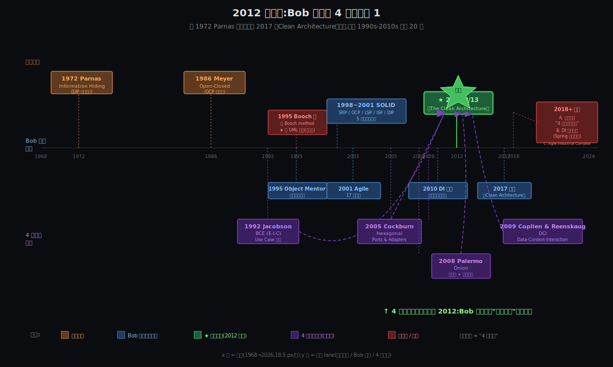

# 阶段 4:《架构整洁之道》是怎么来的

> 聚焦 1990s-2010s 关键 20 年。戏剧高潮在 **2012 年 8 月 13 日**那篇博客 ——
> 那一刻 Bob 大叔把 Hexagonal / Onion / BCE / DCI 4 套已存在的架构,**合成一张同心圆图,提炼出"依赖规则"**。
> 他自己说过:"这本书里没有一条想法是新的。"—— 真正的贡献是 **合成 + 命名 + 推广**。

---

## 约束清单速查(C1~C5)

#### C1 — OCP 失败陷阱
新需求持续到来,加新需求常被迫改老代码 → 引入回归。
**口诀**:必须留扩展点

#### C2 — 技术栈/供应商不可控
技术栈和供应商的演化不在你控制中(政策、市场、信创)。
**口诀**:业务核心不依赖 framework

#### C3 — 复杂度涌现
系统复杂度增长时,"超级方法/超级类"必然涌现(除非架构对抗)。
**口诀**:必须主动对抗熵增

#### C4 — 测试反馈速度
测试反馈速度决定生产力("无 UT → 上线即调试" 自我强化负螺旋)。
**口诀**:核心必须快速可测

#### C5 — 改动代价 ∝ 波及面 (元约束)
改一处的代价跟波及面成正比。
**口诀**:控制波及面 = 控制总成本

---

## §0 从 How 走到 Origin:三件事记住

How 阶段把 5 条约束精确化成"同心圆四层 + 依赖规则 + DIP 反转"3 个结构 —— 但**一个关键问题没回答**:这套结构是 Bob 大叔凭空发明的吗?他本人凭什么 2017 年还能把这套总结成经典?

Origin 阶段回答这个问题。三件事:

### §0.1 撞墙时刻(1995 前后):方法论会过时,原则更稳定

**因为 [C2](#c2--技术栈供应商不可控)**(技术栈不可控)
   ↓
**Bob 大叔遇到的具体痛点**:1995 年他写了一本书《Designing Object-Oriented C++ Applications using the Booch Method》—— 用 Grady Booch 的方法论。**3 年后 UML 把 Booch method 替代了**,这本书的方法论部分**直接被时代淘汰**。
   ↓
**他领悟到**:**方法论会过时(Booch → UML),但其背后的原则(信息隐藏 / 依赖反转)更稳定**。后来他把精力从"教某种方法论"转向"提炼跨方法论的原则"—— SOLID 5 原则(1998-2001)就是在这个反思下成型的。

### §0.2 顿悟时刻(2012 8/13):4 套架构合一,提炼"依赖规则"

**因为 [C5](#c5--改动代价--波及面-元约束) + [C2](#c2--技术栈供应商不可控)**(改动 ∝ 波及面 + 技术栈不可控)
   ↓
**Bob 大叔遇到的具体场景**:2010 年前后业内已经存在 **4 套很相似但各说各话**的架构 —— Cockburn 的 Hexagonal(2005)、Palermo 的 Onion(2008)、Jacobson 的 BCE(1992)、Coplien & Reenskaug 的 DCI(2009)。每套都在解决"分离关注点"的同一个问题,但**用不同的图、不同的命名、不同的术语**;读者很迷茫。
   ↓
**他做的关键事**:把这 4 套合成一个统一的同心圆图(2012 年 8 月 13 日博客《The Clean Architecture》),提炼出**一条统领规则**:"**依赖规则:同心圆的依赖只能向内而生 —— 外层可以依赖内层,但内层绝对不能依赖外层**(The Dependency Rule: source code dependencies can only point inwards)" —— 这是 Clean Architecture 真正的"原创贡献"。

> **注**:本文档凡提到"向内依赖 / 依赖向内"的地方,**都明确指『向内而生』** —— 即**外层可以依赖内层,但内层绝不依赖外层**;这是 Clean Architecture 的核心方向性,任何反向依赖都破坏整套架构。后文出现"依赖向内而生"短语时,语义同此。

### §0.3 反思时刻(2018 之后):工业界把"原则"误读成"模板"

**因为 [C1](#c1--ocp-失败陷阱) + [C2](#c2--技术栈供应商不可控)**(OCP 失败陷阱 + 技术栈不可控)
   ↓
**Bob 大叔事后看到的现实**:Clean Arch 在工业界**两个核心思想被偷走**:① 工程师把它理解成"4 个文件夹的模板"(违背"依赖规则" 这一本质);② DI framework(尤其 Spring)被滥用,业务代码大量 `import` 框架定义的接口(`JpaRepository<T>`),DIP 失真成"假反转"。**这两个误读今天还在大量发生** —— 你公司的屎山就是这两条的活样本。

**这一条远比表面看起来深** —— 工业界 9 年没好转的根因不是"信息没流通"(这本书全球销量超 50 万册),而是**人性短板**(趋利避害 / 短视 / 想当然 / 没真正理解就自以为是地做)让 Bob 大叔的方法论难以落地。**在 §6 把这条历史性反思深挖到第一性原理高度**;**在 §6.6 桥梁段连到 Synthesis 阶段的 AI 主轴**(AI 工具如何弥补这些人性短板,是软件工程史上的历史拐点)。

### §0.4 三件事横向对照表

| 时刻 | 是什么 | 为什么存在(对应 Cn) |
|-----|-------|------------------|
| **1995 撞墙** | Booch 方法论书被时代淘汰 → 转向"原则优先" | C2:方法论(技术栈)会过时,原则才稳定 |
| **2012 顿悟** | 4 套架构合一,提出"依赖规则" | C5 + C2:依赖规则把"控制波及面"变成可执行的工程纪律 |
| **2018 反思** | 工业界把"依赖规则"误读成"分层模板"+ DI 框架滥用,**根因是人性短板**(§6 深挖) | C1 + C2:OCP 失败 + 技术栈被错误地穿到内层;但人性才是落地失败的元凶(§6) |

---

## §1 一张极简概览图

把 1968-2026 这 58 年的关键事件压成一张时间线。**核心要看出 5 件事**:



1. **顶部橙色 = 思想源头**(Parnas 1972 / Meyer 1986)—— Bob 大叔的核心原则(DIP / OCP)不是他原创,是他从这两位前辈那儿接的接力棒
2. **底部紫色 = 4 套架构前身**(Jacobson 1992 BCE / Cockburn 2005 Hexagonal / Palermo 2008 Onion / Coplien-Reenskaug 2009 DCI)—— 全部用虚线箭头汇向 2012,代表"4 合 1"的合成动作
3. **中间蓝色 = Bob 大叔正向工作**(1995 Object Mentor / 1998-2001 SOLID / 2001 Agile / 2010 DI 反转博客 / 2017 成书)
4. **绿色大星标 = 2012 那一刻**(`https://blog.cleancoder.com/uncle-bob/2012/08/13/the-clean-architecture.html`)—— Origin 的戏剧高潮就在这里
5. **红色 = 死胡同 + 遗憾**:1995 Booch 书是死胡同;2018+ 是工业界滥用带来的两个核心遗憾(分层模板误读 + DI 框架滥用)

---

## §2 起:1995 一本被时代淘汰的书

### §2.1 那本书

1995 年 Bob 大叔出版《**Designing Object-Oriented C++ Applications using the Booch Method**》(Prentice Hall, ISBN 0-13-203837-4)—— **一本完全建立在 Grady Booch 方法论之上的书**(《Object-Oriented Analysis and Design with Applications》,1991)。Booch method 在 1990s 早期是 OO 设计的主流之一,跟 Rumbaugh 的 OMT、Jacobson 的 OOSE 三足鼎立。

### §2.2 撞墙

1996-1997 年,**UML 1.0 发布** —— Booch、Rumbaugh、Jacobson 三人合作,把 3 套方法论合并成 UML 标准。Booch method 作为独立方法论**被 UML 替代**;Bob 大叔这本 1995 年的书,**核心方法论部分直接过时**。

这是他第一本独立专著,出版 2 年就遭遇这种"被时代淘汰"的事件 —— 这个具体撞墙不像 Doug Lea 写 dlmalloc 时遇到的"碎片严重"那么具体,但**对 Bob 大叔的思想转向有决定性意义**:他后来 多次在博客和访谈里强调 **"原则比方法论更稳定"**,这本 1995 书的命运就是这个反思的源头。

### §2.3 转向:从教方法论 → 提炼原则

1995 年同年他创立 **Object Mentor**(咨询公司),早期主营业务是教 OO/OOAD。但客户的真实问题是 **"OO 写久了照样变屎山"** —— 这跟"用什么方法论画 UML"关系不大,跟"依赖怎么管"关系巨大。**他的核心问题从"工具"转向"原则":什么样的依赖关系下,代码不会变屎山?**

这是后来 SOLID(1998-2001)和 Clean Architecture(2012)的萌生土壤 —— 一切都从"方法论会过时"这个撞墙时刻起步。

> **takeaway**:**方法论是手段,原则是目的**。1995 那本被淘汰的书,逼 Bob 大叔从"教 Booch method"走向"提炼跨方法论的依赖原则"—— 这是 **C2(技术栈不可控)在他个人思想史上的具体撞墙**。

---

## §3 接力棒前辈:"4 合 1" 的 4 套架构源头

2012 年那张同心圆图,Bob 大叔自己在博客里**明确列出**它合并的前身架构。原话:

> "Though these architectures all vary somewhat in their details, they are very similar.
> They all have the same objective, which is the separation of concerns. They all achieve
> this separation by dividing the software into layers."
> —— Robert C. Martin, *The Clean Architecture*, 2012-08-13

(译:这些架构在细节上虽各有不同,但**非常相似**。它们目标完全一致 —— 分离关注点;它们都通过**把软件分层**来达成这一目的。)

这 4 套架构各自从某个特定角度回答了"分离关注点"。Bob 大叔的合成不是抹平差异,是**找到它们的共性"依赖规则",然后用一张图统一**。

### §3.1 Hexagonal Architecture(Cockburn,2005)

**创作者**:Alistair Cockburn —— Agile Manifesto 17 人中另一位(他和 Bob 大叔同框签 2001 年 Agile Manifesto)
**发表时间**:2005-09-04(此前在 Portland Pattern Repository wiki 上有讨论)
**原始 URL**:`https://alistair.cockburn.us/hexagonal-architecture/`

**Cockburn 当年的具体痛点**(他自己原话):

> "to avoid known structural pitfalls in object-oriented software design,
> such as **undesired dependencies between layers** and **contamination of user
> interface code with business logic**."

(译:为了避免 OO 软件设计的已知结构缺陷 —— **层间不当依赖** + **UI 代码污染业务逻辑**。)

**核心贡献**:**Ports & Adapters** 模型 —— 业务核心是中央六边形(六边形不是因为非要 6 个端口,只是给绘图留空间),外围都是端口(应用程序对外的协议)+ 适配器(端口的具体实现);**端口是业务定义的抽象,适配器是业务的具体实现** —— 这条 30 年后还在每本架构书里被复述。

### §3.2 Onion Architecture(Palermo,2008)

**创作者**:Jeffrey Palermo —— 当时是 .NET 社区资深架构师,Headspring Systems 联合创始人
**发表时间**:2008-07-29(《The Onion Architecture: part 1》;part 2/3 在同年 8 月)
**原始 URL**:`https://jeffreypalermo.com/2008/07/the-onion-architecture-part-1/`

**Palermo 当年的具体痛点**:他在博客中精确指出 —— 传统分层架构(UI → Business → Data Access)创造了"**过度耦合**":每一层都依赖它下面的层,**UI 和 业务逻辑通过传递依赖被绑死到数据访问层**。而**数据访问技术每 3 年左右就变一次**(SQL Server → ORM → NoSQL),这个耦合让应用每隔几年就要重写一次。

**核心贡献**:**同心圆 + 依赖规则** 的雏形(原话):

> "**All code can depend on layers more central, but code cannot depend on layers
> further out from the core.** In other words, all coupling is toward the center."

(译:所有代码可以依赖更靠中心的层,但**不能依赖更外层**;一切耦合都向中心。)

—— 这一句**几乎是 Bob 大叔 2012 "依赖规则" 的直接前身**。Palermo 已经画出了同心圆,Bob 大叔做的是把它和其他 3 套架构合并 + 命名得更响。

### §3.3 BCE / EBI(Jacobson,1992)

**创作者**:Ivar Jacobson —— OOSE 之父,UML 三巨头之一(另两位:Booch、Rumbaugh)
**发表时间**:1992 年,在书《**Object-Oriented Software Engineering: A Use Case Driven Approach**》(Addison-Wesley)
**原始名**:**Entity-Interface-Control(EIC)**;后改名为 **Boundary-Control-Entity(BCE)**,改名原因是"Interface"会跟 Java 等语言里的 `interface` 关键字、跟"User Interface"概念混淆

**核心贡献**:**Use Case 驱动 + 三类对象**:
- **Entity**:跨用例稳定的业务对象(领域模型) —— 这个名字直接被 Bob 大叔保留进了 2012 同心圆图最内层
- **Boundary**(原 Interface):用例与外界的接口(UI / API)
- **Control**:特定用例的协调器(Use Case 内部的工作流)

**给 Clean Arch 的接力棒**:Bob 大叔同心圆中**Use Case 层的概念**直接来自 Jacobson 的 Control + Entity 拆分 —— "**应用业务规则**(Use Case)"和"**企业业务规则**(Entity)"的区分,几乎就是 Jacobson 1992 年 Control / Entity 的现代命名。

### §3.4 DCI(Coplien & Reenskaug,2009)

**创作者**:**Trygve Reenskaug**(MVC 模式的发明人,1979)+ **James Coplien**(《Advanced C++ Programming Styles and Idioms》作者,Pattern 社区核心成员)
**发表时间**:2009 年 3 月,论文《**The DCI Architecture: A New Vision of Object-Oriented Programming**》(Artima)
**核心思想**:**Data**(稳定的数据结构)/ **Context**(用例运行的上下文)/ **Interaction**(用例中对象间的交互角色)

**给 Clean Arch 的接力棒**:DCI 强调**用例(Use Case)在运行时是临时的、由角色组合而成的"剧本"**,而 Data 是跨用例稳定的部分 —— 这跟 Clean Arch 的"Use Case 层薄、Entity 层稳"完全同构。Bob 大叔把 DCI 的"Data"折叠进了 Entity 层,把"Context + Interaction"折叠进了 Use Case 层。

### §3.5 接力棒回看:Parnas + Meyer 是更早的源头

接力棒不只是上面 4 套。Bob 大叔 SOLID 5 原则中最关键的两条 —— **DIP 和 OCP** —— 都有更早的源头(图中顶部橙色):

| 原则 | 接力棒源头 | 年份 |
|-----|-----------|------|
| **DIP**(依赖反转) | David Parnas《On the Criteria To Be Used in Decomposing Systems into Modules》(信息隐藏) | 1972 |
| **OCP**(开闭原则) | Bertrand Meyer《Object-Oriented Software Construction》(命名 OCP 这个名字) | 1986/1988 |

Bob 大叔 1990s 末把这些原则**重新命名 + 重新组合 + 工业化推广**,但思想本身可追溯到 1970s。

> **§3 takeaway**:Clean Architecture 的"分离关注点 + 依赖向内而生 + 4 层同心圆"思想,**没有一条是 Bob 大叔原创的**。Hexagonal 给了 Ports & Adapters,Onion 给了同心圆 + 依赖向内而生(外层依赖内层,内层不依赖外层)的雏形,BCE 给了 Use Case + Entity 拆分,DCI 给了"Data 稳 + Context 短"的思维框架。**Bob 大叔的关键贡献在 §4 那一刻 —— 合成动作本身**。

---

## §4 转:2012 8/13 那一刻 —— Bob 大叔的"合成动作"

### §4.1 戏剧场景

2012 年 8 月 13 日,Bob 大叔在他个人博客 `blog.cleancoder.com` 发布了一篇短文,标题就叫 **《The Clean Architecture》**(`https://blog.cleancoder.com/uncle-bob/2012/08/13/the-clean-architecture.html`)。

**这篇博客的开篇就在做"合并"动作**:

> "Over the last several years we've seen a whole range of ideas regarding the
> architecture of systems. These include:
> - **Hexagonal Architecture** (a.k.a. Ports and Adapters) by Alistair Cockburn
> - **Onion Architecture** by Jeffrey Palermo
> - **Screaming Architecture** from a blog of mine last year
> - **DCI** from James Coplien, and Trygve Reenskaug
> - **BCE** by Ivar Jacobson
>
> Though these architectures all vary somewhat in their details, they are very similar..."

—— **这就是 Bob 大叔自己宣告"我在做合成动作"的原话**。

### §4.2 关键洞察:依赖规则

合成不是简单"把 4 套画在一起"。Bob 大叔提出了一条**统领所有这些架构的规则** —— **依赖规则(The Dependency Rule)**(原话):

> "The overriding rule that makes this architecture work is **The Dependency Rule**.
> This rule says that **source code dependencies can only point inwards**.
> Nothing in an inner circle can know anything at all about something in an outer circle."

(译:让这个架构起作用的统领规则是**依赖规则**。它说:**同心圆的依赖只能向内而生 —— 外层可以依赖内层,但内层绝对不能依赖外层**。内圈里不能知道外圈的任何东西。)

——这一条 **3 句话**,把 Hexagonal / Onion / BCE / DCI 4 套架构的本质**抽象到极简**:它们都遵守"**依赖向内而生**"(外层依赖内层,内层绝不依赖外层)。这是 Bob 大叔在那一天**真正"创造"的东西**(虽然他自己说"也不是新东西,只是合成命名")。

### §4.3 这一刻为什么是 Origin 的戏剧高潮

3 个理由:

1. **同心圆图第一次被画出来**(此前 Hexagonal 是六边形;Onion 已经有同心圆但只到 4 层;DCI 没图;BCE 是三角形)。Bob 大叔 2012 年那篇博客**第一次**给出了今天我们熟悉的 4 层同心圆(Entities / Use Cases / Interface Adapters / Frameworks & Drivers)
2. **"依赖规则"这个名字第一次被提出**。"Dependency Rule"成为后续 Clean Architecture 教学的核心术语 —— 一个专属命名让概念有了传播抓手(从此读者只要记住一句"**依赖向内而生 —— 外层可依赖内层,内层绝不依赖外层**"就能讲清楚同心圆架构的本质)
3. **"合成 + 命名 + 推广"3 件事被一篇博客同时完成**。这 3 件事单独看每件都不算原创,但**合在一起做并被工业界接受**,是 Clean Architecture 这本书 5 年后能成经典的根本原因

### §4.4 从 2012 博客到 2017 成书

2012 博客发布后 5 年,Bob 大叔把这一思路**扩展成一本完整的书**(2017 出版,512 页)。书里:

- §I-§II 部分:回顾 OOP / 函数式 / 结构化编程的核心(铺垫)
- §III-§IV 部分:**SOLID 5 原则 + 组件 6 原则**(全本的密度最高的章节,大量引用 1995 后他自己 17 年的工作)
- §V-§VI 部分:Clean Architecture 完整论述(2012 博客的扩展版)+ 案例研究

**书 ≠ 博客**:博客只讲合成动作 + 依赖规则;书把 Bob 大叔毕生关于 SOLID + 组件 + 测试 + 边界 + 跨语言模式的思考**全部串到这条主线上** —— 这就是为什么一本"思想都不是新的"的书还能成 2017 年后软件架构界的经典。

---

## §5 合:2017 成书 + 2018+ 两个核心遗憾

### §5.1 成书:65 岁那年的总结

Bob 大叔生于 1952 年,2017 年出版这本书时 65 岁,**这本书是他 1995-2017 这 22 年思想的集大成**。书的封面像一份建筑图纸 —— Bob 大叔自己在序言里说,他想让读者**像看建筑师的工程图一样看软件架构**。

但这本书出版至今 9 年(2017→2026),**工业界的现实远比这本书复杂** —— Bob 大叔自己也多次反思。下面是两个最核心的遗憾,以及一句话提及的第三个:

### §5.2 遗憾 A:被工业界误读为"4 层文件夹模板"

**这是 Clean Architecture 这本书最大的工业界滥用**:

工程师看到 Bob 大叔的同心圆图,把它**直接翻译成 Maven/Gradle 项目里的 4 个文件夹**(`entity/`、`usecase/`、`adapter/`、`framework/`),然后**就觉得"自己在做 Clean Arch"**。但他们完全没遵守"依赖规则" —— Use Case 类大量 `import` Spring 的 `@Service`、`@Autowired`、`JpaRepository<T>`,**内圈代码物理上"知道"外圈的存在**,Clean Arch 的核心已经被违背。

**Bob 大叔本人的态度**(在多个演讲和博客中反复说):

> "Clean Architecture is **NOT** a folder structure. It's about **dependencies**."

(他在 2017 年后多个演讲中至少 5 次以上说类似的话 —— 这句被他和他的学生 Simon Brown 反复重申,后者甚至给这本书写了一章"missing chapter" 专门讨论这个误读。)

**为什么这是真实的遗憾**:

- **直接连你公司的屎山** —— 你之前提到的"环境监测系统(Spring Boot + Oracle + MyBatis + Vue + 微信小程序)A 区代码 copy 到 B 区"是这条遗憾的活样本。如果原作者按"4 个文件夹"的形式做,但 Service 层 `import org.springframework`,那这个项目的"Clean Arch"是**形似而神离** —— 信创迁移(Spring Boot → 东方通)时,**核心代码同样要重写**,因为它本来就没"独立于框架"
- **回到 [C2](#c2--技术栈供应商不可控)**:形似的分层不能挡住技术栈不可控带来的破坏;能挡住的是"依赖规则"被严格遵守

**这条遗憾对你的可操作启示**:**判断你公司的项目是不是真 Clean Arch,看 Use Case 类的 `import`,不看文件夹分了几个**。这是 [C2](#c2--技术栈供应商不可控) 的工程经济价值的分水岭。

### §5.3 遗憾 B:DI Framework 的滥用 —— 假反转

**这是 Bob 大叔在 2010 年就预警、但工业界几乎完全没听的问题**。

DIP(依赖反转原则)的本意是:**业务定义抽象,框架/底层实现抽象**。但 Spring Data JPA 等框架带来的现实是 **完全相反**:

```java
// ❌ 假 DIP —— 接口由 Spring 定义,业务被锁死到 Spring
public interface WorkOrderRepository extends JpaRepository<WorkOrder, Long> {
}

// 业务核心 import 了 Spring 的接口
// → "依赖向内而生"被破坏:本应外层依赖内层,这里却变成内层 Use Case 反向依赖了外层 Spring
```

```java
// ✓ 真 DIP —— 接口由业务定义,Spring 在 Adapter 层实现
public interface WorkOrderRepository {  // 业务模块自定义,只依赖 JDK
    Optional<WorkOrder> findById(Long id);
    void save(WorkOrder wo);
}

// Adapter 层 implements 这个接口,Spring 在外圈
```

**Bob 大叔 2010 年的原话**(在博客《Dependency Injection Inversion》中):

> "I don't want framework code smeared all through my application. I want to keep
> frameworks **nicely decoupled and at arms-length** from the main body of my code."
>
> "I don't want to have **@Inject attributes everywhere** and bind calls hidden under rocks."
>
> "Dependency Injection doesn't require a framework; it just requires that you
> invert your dependencies and then construct and pass your arguments to deeper layers."
> —— Robert C. Martin, *Dependency Injection Inversion*, 2010-01-17

(译:我不想框架代码到处涂抹我的应用。我想框架被 **干净解耦,跟我代码主体保持手臂长度**。我不想 @Inject 标签遍地都是。DI 不需要框架 —— 你只要反转依赖,然后构造并传递参数到更深层即可。)

**他在 2016 年《A Little Architecture》博客中的精度补强**:

> "At runtime this is true. But at compile time we want the dependencies inverted.
> The source code of the high level policies should not mention the source code of
> the lower level policies."
> —— Robert C. Martin, *A Little Architecture*, 2016-01-04

(译:运行时这[依赖]是成立的。但**编译时我们要依赖反转**。高层策略的源代码不应提到低层策略的源代码。)

**为什么这是真实的遗憾**:

- 工业界把"用了 Spring DI = 做了 DIP"当公理,但 **Bob 大叔的 DIP 是编译时关系**(业务源码不 import 框架),不是运行时(框架在运行时帮忙装配)
- Spring Data JPA 这种 `extends JpaRepository<T>` 的"省事"模式,**把业务接口直接绑死到 Spring 上**,DIP 完全失效;这恰恰是 Bob 大叔反对的"@Inject 遍地"的现代版本
- 你 How 阶段花了大量篇幅讨论的"教科书派 vs 务实派"、"@Bean 装配 vs @Service 注解",根源就是这条遗憾 —— **业内 80% 的"Clean Arch"实现是『假 DIP』**

**这条遗憾对你的可操作启示**:**判断 DIP 是真是假,看 `WorkOrderRepository` 接口在哪个 Maven 模块**。如果在业务模块(只依赖 JDK)→ 真 DIP;如果在 Spring 模块(extends `JpaRepository`)→ 假 DIP。

### §5.4 这本书的"留白":为什么 Bob 大叔没讲"如何从 α 救出"

这本书 2017 年出版后 9 年间,工业界落地的真实分布(经验估计):

| 状态 | 描述 | 工业界占比 | 信创代价 |
|-----|------|----------|---------|
| **α 完全神离** | 连 4 个文件夹都没分,业务全在大 `@Service` 类里 + `extends JpaRepository` | ~50-60% | 几乎重写 |
| **β 形似神离** | 文件夹分了 entity/usecase/adapter/framework,但 Use Case 类内仍 `import org.springframework` + 接口 `extends JpaRepository<T>` | ~30-40%(自称做了 Clean Arch 的几乎都是这层) | 大改 |
| **γ 神似形离** | 没刻意分文件夹,但业务核心确实独立可编译(纯 Java + 自定义 interface) | <5%(罕见) | 小改 |
| **δ 部分到位** | 不同模块状态参差不齐 | ~5-10% | 看模块 |

**这本书的"留白"是 α → β/γ 的迁移路径几乎没讲**。Clean Architecture 这本书写的是 "**绿地理想架构**"(从一开始就建对 = What 阶段用户偏好的 B 路径),**对已有 α 屎山的救援几乎是空白**。Bob 大叔本人在书的 §V-§VI 部分举的所有例子都是"假设你从零开始"的语境。

**为什么这是真实的"留白"?**

1. **Bob 大叔不写"如何救援"的理由**:他在多个演讲里说"救援已有 legacy 代码不是『架构问题』,是『重构问题』",所以**有意把这部分留给重构社区**
2. **真正补上这块留白的人是 Michael Feathers**:2004 年出版《**Working Effectively with Legacy Code**》(Prentice Hall, ISBN 0-13-117705-2)—— 这本书**专门讲怎么把一个 α 状态的屎山改造成有测试 + 有边界的代码**;Bob 大叔自己在 Clean Architecture 的 References 里推荐过这本书(称其为 "essential reading")
3. **结果**:今天读 Clean Arch 的工程师 80% 在面对 α 屎山,但 Clean Arch 这本书**只告诉他『目标态长什么样』、几乎不告诉他『从屎山怎么走过去』** —— 这是这本书工业界最大的 expectation gap

**对 α 项目的可操作启示**(承上 What 阶段的"屎山救援"主题):

- **Clean Architecture 这本书是『目标态』** —— 告诉你信创迁移成功后的代码长什么样
- **《Working Effectively with Legacy Code》是『路径』** —— 告诉你从你今天的 α 状态怎么一步步走到那里
- **两本书要配套读**;只读 Clean Arch 会觉得"理想很美但路径不通",只读 Feathers 会觉得"知道怎么改但不知道改成什么样"
- **现实路径**:**α → β**(先分文件夹,把 `WorkOrder.java` 从 Service 类里拆出来作为 Entity)→ **β → γ**(再倒接口,业务定义 `WorkOrderRepository` 自定义 interface,Adapter 层 `OracleWorkOrderRepository implements`,接口本身只 `import` JDK)—— 信创迁移之前**必须**走完 β → γ,否则 Oracle→达梦 + Spring Boot→东方通时核心仍要重写

—— 这条留白的认知本身比"会用 Clean Arch"更重要 —— **它告诉你这本书不是万能的,要配合 Feathers 才能落到 α 屎山**。

---

### §5.5 遗憾 C(一句话提及):Agile Industrial Complex

Bob 大叔是 **2001 年 Agile Manifesto 17 位签署人**之一,但他在 2018 年的博客《**The Tragedy of Craftsmanship**》(`https://blog.cleancoder.com/uncle-bob/2018/08/28/CraftsmanshipMovement.html`)中**坦承自己对 Agile 的失望**:

> "The Agile movement got so involved with promoting conferences and with certifying
> Scrum Masters and Project Managers that they **abandoned the programmers**, and the
> values and disciplines of Craftsmanship."
>
> "They pushed so many project managers in, **they pushed the programmers out**."
> —— Robert C. Martin, *The Tragedy of Craftsmanship*, 2018-08-28

—— Agile 被项目管理 / 认证 / 培训机构接管,**程序员被挤出主场**;Bob 大叔从 Agile 转向了 **Software Craftsmanship**(软件匠艺)运动作为他的"复归"。这条遗憾跟 Clean Architecture 这本书的关系较间接(它影响了 Bob 大叔晚年的发声重心,而非这本书的内容),所以本节只一句话提及。

---

## §6 为什么 9 年了工业界还是 α/β?—— 不是技术问题,是人性短板

§5 那 4 条遗憾(分层模板误读 / 假 DIP / 留白 / Agile)看起来是 4 个独立问题,但**它们指向同一个根因** —— Bob 大叔的方法论假设了人会自律,**但人不自律**。

如果只是"信息没流通到位"的问题,9 年早够了 —— 这本书全球销量超 50 万册,各大公司技术读书会必备,中英文讲解视频上千个。**但工业界落地仍然是 50-60% α / 30-40% β / <5% γ**。这意味着遗憾不是『书没说清楚』,而是**说清楚了人也不会去做**。

下面是 4 条人性短板 —— 它们让"按 Clean Arch 写代码"在历史中始终是少数。**这 4 条不是缺陷,是默认状态**;Bob 大叔的方法论给的是"理性程序员"的设计,而**理性程序员不存在**。

### §6.1 趋利避害 —— 当季的人不承担 5 年后的账

**因为**:`extends JpaRepository<WorkOrder, Long>` 比自定义 `WorkOrderRepository` interface + `OracleWorkOrderRepository implements` **少写 10 行代码 + 少花半小时思考**。
   ↓
**短期账面**:省事 = 收益(下午 6 点能下班 vs 晚上 9 点还在拆接口)。
   ↓
**长期代价**:5 年后信创迁移那一刻代码要重写,但**那时做决策的不是当年写代码的人** —— 当年的工程师可能已经跳槽 / 升职 / 退休 / 换项目。
   ↓
**人性必然**:当季 KPI 视角下,**省事是 dominant strategy**;趋利避害是默认状态,不是"程序员不专业"。

→ 对应 [C2](#c2--技术栈供应商不可控) 留下的代价被时间错位转嫁。

### §6.2 短视 —— 5 年后的代价生理性看不见

**因为**:技术债的代价不在当季显形,**在 5 年后某个特定时刻才结账**(信创迁移 / DB 切换 / 框架升级 / 大并发场景)。
   ↓
**当季视角**:`extends JpaRepository` 跑得通 + 测试过 + 线上没炸 = 没问题。
   ↓
**5 年后视角**:这个项目要换 Spring Boot 为东方通,**所有 Use Case 的 import 都要改**,核心代码要重写 —— 而你在 2026 年这一刻看到的就是这个"5 年后"。
   ↓
**人性必然**:Daniel Kahneman《Thinking, Fast and Slow》(2011)证明的 **discounting bias** —— 人**几乎没有把 5 年后的代价折现到当季决策的能力**。这不是"不想看",是**生理性看不见**。

→ 对应 [C5](#c5--改动代价--波及面-元约束) 在跨时间维度上失效:决策者和承担者错位。

### §6.3 想当然 —— 看图就懂,谁还读 3 句话原文?

**因为**:同心圆图视觉冲击力极强 —— 看一眼 → 4 个文件夹的"直觉翻译"凭直觉就走完了。
   ↓
**几乎没人去查 Bob 大叔 2012 博客原文**里那核心的 3 句话:
> "The overriding rule that makes this architecture work is **The Dependency Rule**.
> This rule says that **source code dependencies can only point inwards**.
> Nothing in an inner circle can know anything at all about something in an outer circle."

**(译:让这个架构起作用的统领规则是『依赖规则』。它说:同心圆的依赖只能向内而生 —— 外层可以依赖内层,但内层绝对不能依赖外层。内圈里不能知道外圈的任何东西。)**
   ↓
**结果**:Bob 大叔精心设计的"依赖规则"3 句话**被绕过**,**只保留了图**。同心圆图 → 4 个文件夹 → 项目结构,链条完成,工程师"觉得自己懂了"。**绕过的代价**:工程师只看图凭直觉,看不出"依赖必须向内而生"这个方向性约束 —— 内层 import 外层在他眼里仍然合理(直觉里图是无方向的,只是"分了 4 层")。
   ↓
**人性必然**:**直觉是 dominant strategy**(看图秒懂 vs 读 3 句话英文原文 + 思考"什么是 source code dependencies");**直觉胜过原文**是默认状态。

→ 这条最让人扎心:**Bob 大叔越是把图画得好,越是被偷换概念**。

### §6.4 没真正理解就自以为是地做 —— "懂了" ≠ "能做"

**因为**:工程师的"懂了"和"能做"之间有一道**鸿沟**。
   ↓
**懂了** = 知道 Clean Arch 长什么样(同心圆 / 依赖规则 / 4 层)
**能做** = 在赶进度 / 加班 / 别人催的现实压力下,**仍然花 30 分钟思考清楚**"这个接口该业务定义还是框架定义",并且**真的把那 10 行多写出来**。
   ↓
**多数工程师停在"懂了"** —— 自以为已经做对,实际写出来还是 α/β。
   ↓
**人性必然**:Daniel Kahneman 的 **System 2 慢思考**(深思考、规划、抽象)**费力**;**System 1 快思考**(直觉、复制、模仿)在工作场景中是省力的 default;人在赶进度时**自动滑向 System 1**,所以"知道该怎么做"不会自动转成"做出来"。

→ 这条是 [C4](#c4--测试反馈速度) 在认知层面的对应:慢思考的反馈也是慢的(代码 5 年后的债),所以人本能避开。

### §6.5 不求甚解 + 变现导向 —— 学了皮毛就鼓吹,快速变现

**这是 4 条短板里最隐蔽、但杀伤力最大的一条** —— 它不是工程师"做错了什么",是**经济激励本身就让人理性地选择不深究**。

**因为**:Clean Arch / SOLID 这些概念在 2017 年 Bob 大叔成书后,在中文互联网+培训市场**变成了简历加分项 + 培训讲师认证 + 公众号流量入口** —— 一个工程师不需要真的写过几行 Clean Arch 代码,**只要能讲出 SOLID 5 条 + 同心圆 4 层,就能赢得"懂架构"的标签**。
   ↓
**经济激励的真实结构**:

| | 投入 | 变现 |
|---|------|------|
| **皮毛** | 看 1-2 篇博客 + 记 5 个英文缩写 | 简历过筛 / 写公众号 / 当讲师 / 面试讲架构 / 获评"高级工程师" |
| **深究** | 读 Bob 大叔原文 + 实战 5 年 + 多次重构 + 撞过若干坑 | 代码写得好(没人付钱)+ 自己心安(不变现) |

   ↓
**结果**:**很多人不是为了把代码写好才去学 Bob 大叔的,是为了能把"我懂 Clean Arch"挂嘴边**。皮毛知识被工业化量产 —— 培训机构的"3 天精通 Clean Architecture" / 公众号的"一文搞懂同心圆" / 面试官的"你能讲讲 SOLID 吗?" —— 这些东西**快速扩散成自相矛盾、半懂不懂的"行业共识"**。

**Spring DI = DIP 的等同关系**(假 DIP 的源头),本质就是这种快餐化传播的产物 —— **没有人真去查 Bob 大叔 2010 年那篇《Dependency Injection Inversion》博客**(它只用了 1 千字就讲清楚 DI 框架不是 DIP),所以"用了 Spring DI 就以为做了 DIP" 这个误读才能在工业界横行 15 年没被纠正。
   ↓
**人性必然**:**理性选择就是不求甚解** —— 在"皮毛高变现 + 深究低变现"的激励结构下,理性的工程师**应该**选皮毛(经济学意义上的最优解)。

> **关键洞察**:这条不是"工程师品德问题",是**激励错位的必然结果**。Bob 大叔方法论假设了"工程师为了把事做好而学习",**但工业界的学习从来都是为了变现而做的** —— 这条假设和经济现实**直接矛盾**。要靠呼吁"求真精神 / 工匠精神"来解决,本质是要工程师**反经济理性**地行动 —— 这条诉求历史上从没成功过(Bob 大叔自己 2018 那篇《The Tragedy of Craftsmanship》就在抱怨这件事)。

→ 对应 [C0](#这条隐性元约束在哪儿) 在认知传播层的具体表现 —— **从"人不自律"延伸到"人按经济激励行动"**;前者是个体短板,后者是结构性短板,**结构性的更难破**。

---

### §6.6 总结表:Bob 大叔的方法论 vs 现实人性

| Bob 大叔写 Clean Arch 时假设 | 现实 | 后果 |
|---------|------|------|
| 工程师会**读原文** 3 句话再翻译成代码 | 工程师只看图,凭直觉 → §6.3 想当然 | 同心圆 → 4 个文件夹的偷换 |
| 工程师会**为 5 年后考虑** | 工程师只在乎当季 KPI → §6.2 短视 | `extends JpaRepository` 蔓延 |
| 工程师会**把『省事』和『做对』分开权衡** | 工程师赶进度时省事 = 做对 → §6.1 趋利避害 | 假 DIP 成默认 |
| 工程师**懂了之后会按懂的做** | 工程师懂了就以为做了 → §6.4 没真正理解 | β 形似神离 |
| 工程师**为了把事做好而学习** | 工程师**为了变现而学习**(皮毛高变现,深究低变现) → §6.5 不求甚解 + 变现导向 | 培训行业 + 公众号产业 + 面试题文化共同制造皮毛的工业化量产 |

**这本书是给一个『不存在的理性程序员』设计的**。问题不在书,**问题在人性短板让方法论难以落地** —— 这条历史性反思才是 9 年来工业界 α/β 居高不下的根因。

**而且 §6.5 这条更深** —— 即使工程师本人想自律(突破 §6.1-§6.4),工业界激励结构也会**惩罚他自律**(深究低变现)。所以问题不只是"个体不自律",是**整个行业的经济结构让自律无利可图**。

### §6.7 桥梁段 —— 从『人性短板』到『AI 弥补』

**到这里 Origin 阶段所有的遗憾(§5.2 / §5.3 / §5.4 / §6 整章)都指向同一个本质** —— Bob 大叔方法论假设了人会自律,**但人不自律**。

**这条历史性矛盾在 2024 年开始有了新答案** ——

LLM / Claude Code / Cursor 在过去 1 年发生了一件**软件工程史上从没发生过的事**:**它们让"做对"的边际成本第一次低于"省事"的边际成本**。AI 替工程师承担了"思考规划费时"+"重构胆量"这两个最关键的人性卡点 —— 这是软件工程经济学层面的**历史拐点**:

- §6.1 **趋利避害**:AI 让"自定义 interface + 实现类拆分"的额外 10 行从"半小时手写"变成"30 秒补全";**省事的诱因消失**
- §6.2 **短视**:AI 在重构时能**精确预测**"如果 5 年后切换 ORM,这段代码会改多少处" —— 5 年后的代价**从『生理性看不见』变成『当下可见』**
- §6.3 **想当然**:AI 不让你绕过 3 句话原文 —— 它会**主动追问**"你这个接口在哪一层?为什么 import 了 Spring?",直觉翻译被卡住
- §6.4 **没真正理解就自以为是**:AI 让"懂了 → 能做"的鸿沟变窄;System 2 慢思考的成本从"30 分钟" 降到 "30 秒",**人不再需要被迫滑向 System 1**
- §6.5 **不求甚解 + 变现导向**:AI 让**深究的边际成本接近零** —— 你不需要花 5 年读 Bob 大叔全部博客,AI 在你写每一行代码时**即时引用 Bob 大叔原话**;变现成本不变,但深究成本暴跌 → **激励错位被抹平**(深究第一次和皮毛一样便宜)

**Synthesis 阶段会以这个为主轴展开**(占 Synthesis 阶段 60%+ 篇幅),完整论证 **3 条约束 + AI 全部抹平** 的历史拐点:

1. **人性短板**(本节立的 5 条 + AI 弥补对照,以 Deep 阶段一段屎山代码的实际重构作为引子)
2. **组织约束 X1: 领导财务思维 ≠ 工程思维** —— 大多数 leader 受财务训练而不受软件工程训练,看 KPI / 季度营收,不肯为"5 年后才显形的技术债"付当下的成本;AI 让"卓越架构"的边际成本逼近零 → **财务无理由砍**
3. **经济约束 X2: 培养合格架构师成本太高 + 时间太长** —— 一个真正能做 Clean Arch 的架构师要 8-10 年实战 + 撞过坑;一个项目周期 1-2 年;**预算结构永远 cover 不了"等 8 年"**;AI 让"架构师能力"在编码现场**民主化** —— 工程师只需识别 + 接受好建议,门槛大降

**结论**:Bob 大叔的方法论在 1995-2024 这 30 年都不可能大规模实施,**不是因为方法论不好,是经济激励 + 人才稀缺性的双重夹击**。**2024 年起 AI 第一次同时抹平了 5 条人性短板 + 2 条组织/经济约束** —— 软件工程可能正在迎来 1968 年 Dijkstra《Goto Considered Harmful》以来最大的一次利好,**卓越的软件工程从"理想"变成"现实选择"**。

---

> **【Synthesis 阶段还会引出一个最优雅的结论 ——『社会性反转』】**
>
> 这本书 9 年来在**人的社会里**几乎不可能大规模落地 —— 因为它假设了不存在的"理性程序员",而行业激励还**惩罚**自律(§6.5)。这本书是给一群"应当如此但实际不会如此"的工程师写的。
>
> 但**在 AI 的社会里,情况彻底相反**:AI **天然没有**变现压力(它不写公众号 / 不需要简历加分)/ 没有 KPI 焦虑(它不被 leader 砍预算)/ 没有进度恐惧(它不被 deadline 逼到滑向 System 1)/ 没有团队从众心理(它不怕"PR 拖时间被骂")/ 没有不求甚解的经济诱因(它读 Bob 大叔原文跟读维基百科一样快)。
>
> **§6 立的 5 条人性短板 + §6.7 立的 2 条组织/经济约束,对 AI 全部为零**。
>
> **所以 Bob 大叔的方法论对人来说是悖论;对 AI 来说是默认行为。**
>
> 在 AI 主导代码生成的时代,**这本书的"依赖向内而生 / 单一职责 / 接口隔离"会从『难以落地的理想』升格为『软件工程的第一性原理』,被 AI 默认遵守** —— 而这在人的社会里是历史性不可能的。
>
> 这恰好**证明 Bob 大叔的思想本身从来都是正确的,问题始终在"载体是人还是 AI"** —— **同一套方法论,在两个社会里命运彻底相反**。这是 Synthesis 阶段的最终命题。

---

## §7 约束回扣:Origin 阶段的 5 条 Cn 都怎么对应到这本书?

**Origin 不是技术细节;Origin 是"为什么这本书 2017 年才会成型"的历史解释**。每条 Cn 在历史中如何具体浮现:

| 约束 | 历史中怎么具体浮现 | 对应 Origin §X |
|-----|------------------|--------------|
| [C1](#c1--ocp-失败陷阱) (OCP 失败陷阱) | Meyer 1986 命名 OCP;Bob 大叔 2001 年补成 SOLID 5 之一;2018+ 工业界用了 framework 但没用对(假 DIP)→ 加新需求照样改老代码 | §3.5(OCP 接力棒)+ §5.3(遗憾 B) |
| [C2](#c2--技术栈供应商不可控) (技术栈不可控) | 1995 Booch method 被 UML 替代(撞墙);2012 同心圆图作为对策(框架被推到外圈);2018+ 工业界把 Spring 拉进 Use Case 层(误用) | §2(撞墙)+ §4(顿悟)+ §5.2(遗憾 A) |
| [C3](#c3--复杂度涌现) (复杂度涌现) | Jacobson 1992 BCE 把 Use Case 拆出来 = "对抗复杂度的具体手法";Bob 大叔 2012 把它纳入 Use Case 层 | §3.3(BCE 接力棒) |
| [C4](#c4--测试反馈速度) (测试反馈速度) | Bob 大叔 1990s 末与 Kent Beck 合作推 TDD,2017 这本书把"独立可测"作为 Clean Arch 的核心目标之一 | (本阶段未深展开,见 How 阶段 §3 demo) |
| [C5](#c5--改动代价--波及面-元约束) (改动代价 ∝ 波及面) | Palermo 2008 Onion 已经有"耦合向中心"雏形;Bob 大叔 2012 把它升华成"依赖规则"(统领的元规则) | §3.2(Onion 接力棒)+ §4.2(依赖规则) |
| **C0(隐性约束)** **人性短板** —— 方法论假设了"理性程序员",但人不自律 | 4 条短板(§6.1-§6.4)让 9 年来工业界 α/β 居高不下 —— **这是真正的元约束**;Bob 大叔的全部 5 条 Cn 在历史中失效,根因都在这条隐性约束 | §6 整章 + §6.6 桥梁段(连到 Synthesis 阶段 AI 弥补) |

**关键发现 1**:**每条 Cn 都对应着至少一位前辈的接力棒**。Bob 大叔 2012 年的合成动作,本质是把"5 条约束在不同前辈那儿的部分答案"统一成一张图 + 一条规则。这就是为什么这本书既"没有原创思想"又"成为经典" —— 它**第一次让所有 Cn 在一个工程框架里被同时回答**。

**关键发现 2(2026-05-07 patch-2 加入)**:**C0 是 Why 阶段没立的隐性元约束** —— "人不自律"。这条比 C5(改动代价 ∝ 波及面)更底层,因为 C5 假设了"工程师会理性权衡代价",而这个假设本身就被人性证伪。Bob 大叔在 Clean Arch 这本书里**不可能解决 C0**(他的工具是"原则 + 图 + 命名");**C0 在 2024 年开始有新答案 —— AI 工具,详见 Synthesis 阶段**。

---

## §8 呼应灵魂问题

灵魂问题:"**完整理解《架构整洁之道》的设计哲学与可落地方法**"

**Origin 阶段把灵魂问题闭环到 ~85%(40% 历史脉络)**:
- ✓ **设计哲学的来历**:思想从 Parnas 1972 → Meyer 1986 → Jacobson 1992 → Cockburn 2005 → Palermo 2008 → DCI 2009 → Bob 大叔 2012 合一,这条接力棒清晰了
- ✓ **2012 那一刻的关键贡献**:不是发明,是**合成 + 命名 + 推广**(依赖规则) —— Bob 大叔的"原创"在合成的方式,不在思想本身
- ✓ **2018+ 工业界的两个核心误读**:被当 4 层文件夹模板 + 假 DIP —— **你公司屎山的根本病灶就在这两条**
- ✓ **可落地方法的根**:依赖规则(2012 提出)是"可落地"的最关键抓手 —— **判断 Clean Arch 是否真落地,看 Use Case 类 import 是否不依赖框架**
- ✓ **9 年没好转的根因(§6 深挖)**:不是技术问题,是**人性短板 5 条**(趋利避害 / 短视 / 想当然 / 没真正理解就自以为是 / 不求甚解 + 变现导向);**Bob 大叔的方法论是给"理性程序员"设计的,但理性程序员不存在 —— 而且行业激励结构惩罚自律**

**剩下主体留给 Deep + Synthesis 阶段**:

**Deep 阶段(实操化)**:用一段真实屎山代码 → 按 Bob 大叔的端口适配器模式重构的完整过程;每一步都暴露具体的"难度落点"(认知 / 时间 / 团队 / 进度压力)。这段重构本身将作为 Synthesis 第一部分的引子。

**Synthesis 阶段主轴(占 60%+ 篇幅 ——『3 条约束 + AI 全部抹平』完整论证)**:

| 阶段 | 内容 | 篇幅 |
|------|------|------|
| **§A 引子** | Deep 阶段那段重构的难度复盘 —— 为什么"做着做着就要向现实低头" | ~15% |
| **§B 5 条人性短板** | §6.1-§6.5 的延展 + 每条 AI 弥补的具体场景(LLM / Claude Code / Cursor 实测) | ~25% |
| **§C 2 条组织/经济约束** | **X1: 领导财务思维 ≠ 工程思维** —— 受财务训练的 leader 不肯为未来投资,KPI 视角下"加 30% 时间做 Clean Arch"是亏 / **X2: 培养架构师成本 + 时间** —— 8-10 年实战 vs 1-2 年项目周期,预算结构 cover 不了"等 8 年" | ~25% |
| **§D AI 抹平 X1+X2** | AI 让"卓越架构"边际成本逼近零 → 财务无理由砍 / AI 让"架构师能力"在编码现场民主化 → 8 年实战的门槛大降 | ~20% |
| **§E 历史性结论** | Bob 大叔方法论 + AI 工具的理想结合 = **卓越软件工程从『理想』变成『现实选择』**;1968 年《Goto Considered Harmful》以来软件工程最大的一次利好 | ~15% |

**辅助内容**(Comparison 视情况补):DDD / Hexagonal-only / Layered Arch 跟 Clean Arch 的对照(可选)。

---

**关键转折(Origin 阶段定下的三条主线)**:

1. **价值不在原创度,在合成度** —— Bob 大叔把分散在 Parnas / Meyer / Jacobson / Cockburn / Palermo / Coplien-Reenskaug 几代人手里的部分答案,**用『依赖规则』+『同心圆图』压缩成一个工业界能消化的产物**;这是工程书写经典的核心路径
2. **方法论 + 人性 = 历史性矛盾** —— 这本书 9 年遗憾不是它讲错了,是它假设了不存在的"理性程序员"+ **行业激励结构惩罚自律**(深究低变现);Bob 大叔的工具是"原则 + 图 + 命名",**根本无法解决经济激励层面的问题**
3. **AI 工具 = 历史性答案** —— 2024 年 AI 第一次同时抹平 5 条人性短板 + 2 条组织/经济约束;**软件工程从"卓越是少数人的奢侈品"走向"卓越是默认选项"** —— Synthesis 阶段把这件事讲透
4. **【最终命题】Bob 大叔方法论的『社会性反转』** —— 在人的社会里它是"**难以落地的理想**"(对抗人性 + 行业激励 + 组织经济三重力量);在 AI 的社会里它会成为"**软件工程的第一性原理**"(因为 AI 天然契合理性 + 无变现压力 + 无进度焦虑 + 无团队从众心理 + 无不求甚解的经济诱因)。**同一套方法论,在两个社会里命运彻底相反** —— 这恰好证明 **Bob 大叔的思想本身从来都是正确的,问题始终在"载体是人还是 AI"**。这是 Synthesis §E 的最终命题

---

## 一手资料引用列表

**Bob 大叔本人原始材料**:

- Robert C. Martin, *The Clean Architecture*, blog post, 2012-08-13
  → `https://blog.cleancoder.com/uncle-bob/2012/08/13/the-clean-architecture.html`
- Robert C. Martin, *Dependency Injection Inversion*, blog post, 2010-01-17
  → `https://sites.google.com/site/unclebobconsultingllc/blogs-by-robert-martin/dependency-injection-inversion`
- Robert C. Martin, *A Little Architecture*, blog post, 2016-01-04
  → `https://blog.cleancoder.com/uncle-bob/2016/01/04/ALittleArchitecture.html`
- Robert C. Martin, *The Tragedy of Craftsmanship*, blog post, 2018-08-28
  → `https://blog.cleancoder.com/uncle-bob/2018/08/28/CraftsmanshipMovement.html`
- Robert C. Martin, *Designing Object-Oriented C++ Applications using the Booch Method*, Prentice Hall, 1995. ISBN 0-13-203837-4
  → `https://archive.org/details/designingobjecto00mart`
- Robert C. Martin, *Clean Architecture: A Craftsman's Guide to Software Structure and Design*, Prentice Hall, 2017. ISBN 978-0-13-449416-6

**4 套架构源头**:

- Alistair Cockburn, *Hexagonal Architecture (Ports and Adapters)*, 2005-09-04
  → `https://alistair.cockburn.us/hexagonal-architecture/`
- Jeffrey Palermo, *The Onion Architecture: part 1*, 2008-07-29
  → `https://jeffreypalermo.com/2008/07/the-onion-architecture-part-1/`
- Ivar Jacobson, *Object-Oriented Software Engineering: A Use Case Driven Approach*, Addison-Wesley, 1992
- Trygve Reenskaug & James Coplien, *The DCI Architecture: A New Vision of Object-Oriented Programming*, Artima, 2009-03

**思想源头**:

- David L. Parnas, *On the Criteria To Be Used in Decomposing Systems into Modules*, Communications of the ACM, 15(12), 1972-12, pp. 1053-1058
- Bertrand Meyer, *Object-Oriented Software Construction*(第 1 版),Prentice Hall, 1988(OCP 命名出处)

**二手综述(可信度参考用)**:

- Wikipedia: *Hexagonal architecture (software)*
  → `https://en.wikipedia.org/wiki/Hexagonal_architecture_(software)`
- Wikipedia: *Entity-control-boundary*
  → `https://en.wikipedia.org/wiki/Entity-control-boundary`
- *DCI - Data Context Interaction* 官方文档
  → `https://dci.github.io/`

---

## 修订记录

| 时间 | 修订摘要 | 触发原因 |
|------|---------|---------|
| 2026-05-07 初稿 | Origin 阶段第 1 稿 + SVG 时间线(`pics/04-timeline.svg`) | 用户对齐:混合视角 / 1990s-2010s / 2012 高潮 / "4 合 1" 接力棒 / A+B 遗憾 |
| 2026-05-07 patch-1 | §5.4 新增「这本书的『留白』:为什么 Bob 大叔没讲『如何从 α 救出』」—— 4 状态分布(α 50-60% / β 30-40% / γ <5% / δ 5-10%)+ 信创代价对照 + Bob 大叔故意把 legacy 救援留给 Feathers《Working Effectively with Legacy Code》(2004)+ 现实路径建议(α→β→γ);原 §5.4 Agile Industrial Complex 改编号 §5.5 | 用户诊断公司项目状态为 α(完全神离),需要把这条"留白"补上去 —— 这是大多数读者读 Clean Arch 后的真实困惑,但本书几乎没回答 |
| 2026-05-07 patch-2 | 大重构:新增 §6 整章「为什么 9 年了工业界还是 α/β?—— 人性短板」(§6.1 趋利避害 / §6.2 短视 / §6.3 想当然 / §6.4 没真正理解就自以为是 / §6.5 总结表 / §6.6 桥梁段连到 Synthesis 阶段 AI 主轴);原 §6 约束回扣 → §7,原 §7 呼应灵魂问题 → §8;§7 约束回扣表新增 C0 行(隐性元约束 = 人不自律);§0.3 + §0.4 表第 3 行追加"§6 深挖"指引;§8 改写为"40% 历史 + 60% AI 利好" 拆分(60% Synthesis 阶段) | 用户提出关键新视角:"工业界混乱不是技术问题,是人性短板 —— 趋利避害 / 短视 / 想当然 / 没真正理解就自以为是";要求 Origin 40% 篇幅做心路历程 + 工业界 20 年得失,后 60% 篇幅(放在 Synthesis 阶段)写 AI 弥补人性短板 + 软件工程利好 —— 用户已确认拆分方案 α'(Origin 加 §6 + 桥梁段;AI 主轴放 Synthesis) |
| 2026-05-07 patch-3 | 全文术语升精度:**"依赖向内"统一改为"依赖向内而生"**,并在每个出现点明确加上"**外层可以依赖内层,但内层绝对不能依赖外层**" 的方向性说明;§0.2 顿悟时刻 + §4.2 关键洞察(译文)+ §3 takeaway + §4.3 第 2 点 + §5.3 code comment + §6.3(英文原文下加中文译文)6 处统一升精度;§0.2 末尾追加方向性 footnote;同步 03-how.md(§0.2 + §0.2.0 + §0.4)以保持跨 stage 术语一致 | 用户明确要求:"源代码依赖只能向内"改成"同心圆的依赖只能向内而生 —— 外层可以依赖内层,内层绝对不能依赖外层";凡提到"向内依赖"都要说清楚"向内而生" —— 这是 Clean Architecture 最容易被误读的方向性约束(§6.3 想当然里指出"工程师只看图凭直觉,看不出方向性") |
| 2026-05-07 patch-4 | §6 新增 §6.5「不求甚解 + 变现导向 —— 学了皮毛就鼓吹,快速变现」(经济激励错位的结构性短板,比 §6.1-§6.4 个体短板更深);章节重编号:原 §6.5 总结表 → §6.6,原 §6.6 桥梁段 → §6.7;§6.6 总结表加第 5 行 Bob 大叔假设(为做好事而学)vs 现实(为变现而学);§6.7 桥梁段大扩展 —— Synthesis 阶段从单主轴扩展为「3 条约束 + AI 全部抹平」完整骨架(5 条人性短板 + X1 财务思维 ≠ 工程思维 + X2 培养架构师成本太高);§8 呼应灵魂问题改写为 5 阶段 Synthesis 主轴表(§A 引子 / §B 人性短板 / §C 组织约束 / §D AI 抹平 / §E 历史性结论)+ 三条主线;原"两条主线"扩为"三条主线" | 用户提出 2 个新输入:(1) 第 5 条人性短板 —— "不求甚解,学了皮毛就鼓吹,快速变现,这是人性弱点,导致 Spring DI 滥用,很多人并不是为了软件工程而去学 Bob 的"; (2) Synthesis 阶段完整骨架 —— Deep 重构难度引子 + 2 个组织/经济约束(领导财务训练不肯为未来投资 / 培养架构师成本太高时间太长)+ AI 抹平这 2 条 —— 这 2 个新输入直接补全了原本 §6 只立"个体人性"主轴的不足,扩展为"个体人性 + 行业激励 + 组织经济"三层论证 |
| 2026-05-07 patch-5 | §6.7 桥梁段末尾追加「最优雅的结论 ——『社会性反转』」box —— Bob 大叔方法论对人是悖论(对抗 5 人性短板 + 2 组织约束),对 AI 是默认行为(AI 天然没有变现压力 / KPI 焦虑 / 进度恐惧 / 从众心理 / 不求甚解的经济诱因);**§6 立的 7 条约束对 AI 全部为零**;在 AI 主导代码生成的时代,Bob 方法论会从"难以落地的理想"升格为"软件工程的第一性原理",被 AI 默认遵守 —— 这恰好证明 Bob 思想本身从来都是正确的,问题始终在"载体是人还是 AI";同一套方法论在两个社会里命运彻底相反;§8 关键转折追加第 4 条主线「社会性反转」作为最终命题;Synthesis §E 历史性结论锁定为这条 | 用户提出最终洞察:"Synthesis 可以引出一个有趣的结论 —— 可能 Bob 的理论在人的社会里行不通,但是在 AI 的社会里会成为软件工程的第一性原理被 AI 遵守";这条把整个 Origin → Synthesis 的论证 arc 闭环到最优雅的位置 —— **不是 Bob 错了,是『人』错了**;AI 没有那些让人偏离 Bob 方法论的反向力量,所以 Bob 思想会在 AI 时代回到它本该的位置:默认行为 |
