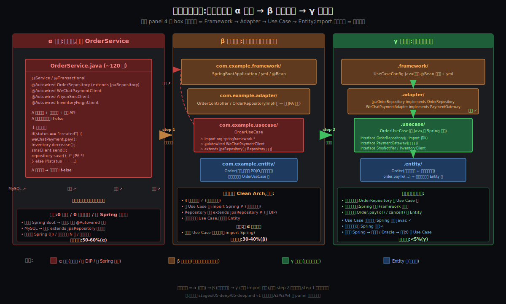

# 阶段 5:订单系统的实操重构 —— 从 α 屎山到 γ 真做对

> **三步增量** —— 一段真实工业界的 Spring Boot + CRUD + MySQL 订单系统屎山,按 Bob 大叔端口适配器(同心圆 4 层)走 **α → β → γ** 完整重构。
> 每步配代码片段 + **工程师内心独白**,把 Origin §6 的 5 条人性短板**用真实场景演绎**。
> 这段重构本身将作为 Synthesis §A 引子的现成素材 —— 不是讲"Clean Arch 是什么",而是讲"为什么 80% 工程师做不到 / 做着做着就放弃"。

---

## 约束清单速查(C1~C5 + C0)

#### C1 — OCP 失败陷阱
新需求持续到来,加新需求常被迫改老代码 → 引入回归。
**口诀**:必须留扩展点

#### C2 — 技术栈/供应商不可控
技术栈和供应商的演化不在你控制中(政策、市场、信创)。
**口诀**:业务核心不依赖 framework

#### C3 — 复杂度涌现
系统复杂度增长时,"超级方法/超级类"必然涌现(除非架构对抗)。
**口诀**:必须主动对抗熵增

#### C4 — 测试反馈速度
测试反馈速度决定生产力("无 UT → 上线即调试" 自我强化负螺旋)。
**口诀**:核心必须快速可测

#### C5 — 改动代价 ∝ 波及面 (元约束)
改一处的代价跟波及面成正比。
**口诀**:控制波及面 = 控制总成本

#### C0 — 人不自律(Origin §7 反向发现的隐性元元约束)
方法论假设了"理性程序员",但人不自律 + 行业激励惩罚自律。
**口诀**:工具不解决人的问题,但 AI 时代第一次可能让 C0 在工程实践中失效

---

## §0 从 Origin 走到 Deep:三件事记住

Origin §6 立了 **5 条人性短板**(战略级抽象);Deep 阶段把这 5 条**精炼成 3 个具体重构落点**(战术级可落地动作)—— 这 3 件事是从 α 走到 γ 必做的物理动作,**做对一件 = 推进一步,3 件全做对 = 真 Clean Arch**。

**三件事不是 4、5、7 件 —— 是 3 件**(战术级聚焦)。

### §0.1 接口位置反转(对应假 DIP → 真 DIP)

**因为 [C2](#c2--技术栈供应商不可控) + [C5](#c5--改动代价--波及面-元约束)**(技术栈不可控 + 改动 ∝ 波及面)
   ↓
**要解决**:Spring Data JPA 让业务接口 `extends JpaRepository<Order, Long>`,接口由框架定义 → DIP 失真成"假反转";信创时 Spring 换框架 → 接口签名也换 → 业务核心代码全要改
   ↓
**所以引入「接口位置反转」**:`OrderRepository / PaymentGateway / SmsNotifier / InventoryClient` 这 4 个接口**全部由业务定义,放在 Use Case 层**,只 import JDK;Adapter 层 `implements` 它们(Spring 实现 / 微信 SDK 实现 / 阿里云 SDK 实现)。**接口归属层从 Adapter 反转到 Use Case。**

### §0.2 框架边界外推(对应假分层 → 真分层)

**因为 [C2](#c2--技术栈供应商不可控) + [C4](#c4--测试反馈速度)**(技术栈不可控 + 测试反馈速度)
   ↓
**要解决**:`OrderUseCase` 类直接 `import org.springframework.beans.factory.annotation.Autowired`,业务核心**编译时就知道 Spring 存在**;信创时 Spring → 东方通,所有 Use Case 类都要改 import;单测必启 Spring 容器(慢,Cn 4)
   ↓
**所以引入「框架边界外推」**:**Spring 注解(@Service / @Autowired / @Transactional)只允许出现在 Framework 层和 Adapter 层**,Use Case 和 Entity 类**禁止 import 任何 `org.springframework.*`**;Spring 在 Framework 层用 `@Configuration` + `@Bean` 显式装配 Use Case 实例。**Spring 边界从"全家桶"外推到"框架层显式装配点"。**

### §0.3 状态机上提(对应业务规则归属错位 → 归属正确)

**因为 [C3](#c3--复杂度涌现) + [C5](#c5--改动代价--波及面-元约束)**(复杂度涌现 + 改动 ∝ 波及面)
   ↓
**要解决**:订单状态扭转规则散在 `OrderUseCase` 各方法的 `if-else` 里 —— "已关闭单不能再支付" 这种**跨用例稳定的业务规则**(企业业务规则,Entity 该管的)被错放在 Use Case 层(应用业务规则的位置)。新加状态要改 N 处 `if-else`,改一处可能漏一处
   ↓
**所以引入「状态机上提」**:**订单状态扭转规则从 OrderUseCase 上提到 `Order` 实体类**;`order.payTo(paymentGateway, ...)` / `order.ship(...)` / `order.cancel(...)` —— 状态变更**只能在 Entity 内**,Use Case 只编排顺序 + 调外部依赖。**业务规则归属从 Use Case 反向上提到 Entity。**

### §0.4 三件事横向对照表

| # | 战术动作 | 物理变化 | 对应 Origin §6 | 难度等级 |
|---|--------|---------|--------------|---------|
| 1 | **接口位置反转** | 4 个 interface 从 Spring → 业务模块 | §6.5 不求甚解(没读"DI 反转"原文) + §6.3 想当然(以为 `extends JpaRepository` 是 DIP) | ⭐⭐⭐⭐ |
| 2 | **框架边界外推** | Spring 注解只在外两层,内两层零 Spring | §6.4 没真正理解就自以为是 + §6.1 趋利避害(`@Autowired` 比手写 constructor 省事) | ⭐⭐⭐⭐⭐ |
| 3 | **状态机上提** | 状态扭转规则从 UseCase 移到 Entity | §6.3 想当然(以为 Entity 就是 POJO + getter/setter) | ⭐⭐⭐ |

**关键**:每件事**单独做**都不难,**3 件一起做并坚持下来**才难 —— 因为每件都需要克服一条人性短板。

---

## §1 一张极简概览图

把三步重构(α → β → γ)压成一张三联图,**核心要看出 4 件事**:



1. **α 屎山(左)**:`OrderService.java` 单类 ~120 行,4 个 `@Autowired` 全家桶 + `extends JpaRepository` + `if-else` 状态扭转;**0 边界 / 0 接口反转 / 全部 Spring 污染** —— 工业界 50-60% 的活样本
2. **β 形似神离(中)**:**分了 4 个文件夹**(`framework/adapter/usecase/entity/`),看上去合规;但 `OrderUseCase` 类**还 import org.springframework**,`OrderRepository extends JpaRepository<Order, Long>` —— **依赖箭头还反着**,信创代价跟 α 几乎一样;**80% 自称『做了 Clean Arch』的项目就停在这层**
3. **γ 真做对(右)**:4 个 interface 全在 Use Case 层(只 import JDK);`OrderUseCase` 类零 Spring;Spring 在 `.framework/UseCaseConfig.java` 用 `@Bean` 显式装配;`Order.payTo()` / `cancel()` 状态机自封 —— **依赖向内而生**,信创时 Use Case 0 修改
4. **三步中只有 step 2(β → γ)是真重构** —— step 1(α → β)只是**分了文件夹**,视觉合规但本质还是屎山;**这就是为什么很多人重构『一半』就放弃** —— 走了 step 1 觉得已经做完了,看不出 step 2 的必要性

---

## §2 α 屎山初稿 —— 周五下午 6 点的 OrderService.java

### §2.1 完整代码片段

这是工业界最常见的 α 状态 —— **单一 Service 类承担所有事**:

```java
// com/example/order/OrderService.java
@Service
@Transactional
public class OrderService {

    @Autowired private OrderRepository repo;        // extends JpaRepository<Order, Long>
    @Autowired private WeChatPaymentClient payment; // 微信 SDK 客户端
    @Autowired private AliyunSmsClient sms;          // 阿里云短信 SDK
    @Autowired private InventoryFeignClient inv;    // 内部 RPC

    public void changeStatus(Long orderId, String newStatus) {
        Order order = repo.findById(orderId).orElseThrow();

        if (newStatus.equals("paid")) {
            if (!order.getStatus().equals("created"))
                throw new IllegalStateException("非 created 不能支付");
            payment.pay(order.getAmount(), order.getUserId());
            inv.decrease(order.getProductId(), order.getQty());
            sms.send(order.getUserPhone(), "您的订单已支付成功");
            order.setStatus("paid");
            order.setPaidAt(LocalDateTime.now());
            repo.save(order);
        }
        else if (newStatus.equals("shipped")) {
            if (!order.getStatus().equals("paid"))
                throw new IllegalStateException("非 paid 不能发货");
            // ... 调物流接口、写运单号、发短信
            order.setStatus("shipped");
            repo.save(order);
        }
        else if (newStatus.equals("delivered")) {
            // ... 类似
        }
        else if (newStatus.equals("cancelled")) {
            // 复杂:可能要退款 + 还库存 + 通知用户
            if (order.getStatus().equals("paid")) {
                payment.refund(order.getPaidAmount(), order.getOrderId());
            }
            inv.increase(order.getProductId(), order.getQty());
            sms.send(order.getUserPhone(), "订单已取消");
            order.setStatus("cancelled");
            repo.save(order);
        }
    }
}
```

```java
// com/example/order/OrderRepository.java
public interface OrderRepository extends JpaRepository<Order, Long> {
}
```

```java
// com/example/order/Order.java —— 纯 POJO,0 业务规则
@Entity
@Table(name = "orders")
@Data  // Lombok: getter/setter 全自动
public class Order {
    @Id @GeneratedValue
    private Long id;
    private String status;
    private BigDecimal amount;
    private LocalDateTime paidAt;
    // ... 一堆字段
}
```

### §2.2 工程师内心独白

> *"周五下午 6 点,产品经理刚拍下来一个新需求 —— 订单要加状态扭转功能,带支付 / 发货 / 取消 / 退款。下周一上线。我打开 IDE,新建 `OrderService.java`,@Service 注解,@Autowired 一通,if-else 写起来 —— **这是最快的写法,1 小时能下班**。"*
>
> *"我也听过 Clean Architecture / SOLID 这些词,但那是『理论』,我现在是『实战』。把代码写出来跑通,周一不被骂,这才是当下唯一重要的事。"*
>
> *"@Autowired 多方便啊 —— 一行 `@Autowired private XxxClient`,Spring 帮我注入,我都不用写 constructor。状态扭转 if-else 一通,所有外部调用都串在一个方法里,事务用 `@Transactional` 裹整个方法,反正 Spring 兜底。"*

### §2.3 这段代码暴露了什么?

**5 个具体问题(每个对应一条人性短板)**:

| # | 问题 | 表现 | 对应人性短板 |
|---|------|-----|-----------|
| 1 | **0 接口反转(假 DIP)** | `OrderRepository extends JpaRepository<Order, Long>` | §6.5 不求甚解 + §6.3 想当然 |
| 2 | **0 框架边界(全家桶)** | 4 个 `@Autowired` + `@Service` + `@Transactional` 全在业务核心 | §6.1 趋利避害 + §6.4 没真正理解 |
| 3 | **0 状态机封装(贫血实体)** | `Order` 是纯 POJO + `@Data`,所有状态规则散在 Service 的 if-else | §6.3 想当然(以为 Entity 就是 POJO) |
| 4 | **超级方法**(`changeStatus` ~80 行,5 状态分支) | C3 复杂度涌现的具体表现 | §6.4 没真正理解 |
| 5 | **业务规则不可单测** | 测 Order 状态扭转必启 Spring 容器(因 OrderService 依赖 Spring) | §6.4(因测试慢自动放弃 TDD) |

---

## §3 第一次重构 → β 形似神离

### §3.1 重构动作:分文件夹(只动文件位置)

**周一周会上 leader 说:"我们项目要做 Clean Architecture"**。我打开网上一篇 "Spring Boot Clean Architecture 模板" 文章,照葫芦画瓢:

```
com/example/
├── entity/
│   └── Order.java                    ← @Data POJO 原封不动挪过来
├── usecase/
│   ├── OrderUseCase.java             ← OrderService 改名挪过来
│   └── OrderRepository.java          ← extends JpaRepository<Order, Long> 原封不动挪过来
├── adapter/
│   ├── OrderController.java          ← REST 入口
│   └── (空 — 因为 OrderRepositoryImpl 是 Spring 自动生成的)
└── framework/
    ├── BobApp.java                   ← @SpringBootApplication
    └── application.yml
```

### §3.2 关键代码片段

```java
// com/example/usecase/OrderUseCase.java —— 改了名挪了文件夹,代码内容没动
@Service                                                           // ⚠ 还在 Spring 上
@Transactional                                                     // ⚠
public class OrderUseCase {

    @Autowired private OrderRepository repo;                       // ⚠ 仍 import Spring 注解
    @Autowired private WeChatPaymentClient payment;
    @Autowired private AliyunSmsClient sms;
    @Autowired private InventoryFeignClient inv;

    public void changeStatus(Long orderId, String newStatus) {
        // ... 跟 α 完全一样的 80 行 if-else
    }
}
```

```java
// com/example/usecase/OrderRepository.java
public interface OrderRepository extends JpaRepository<Order, Long> {  // ⚠ 假 DIP 原封不动
}
```

```java
// com/example/entity/Order.java
@Entity                                                            // ⚠ JPA 注解
@Table(name = "orders")
@Data                                                              // ⚠ Lombok 全自动 getter/setter
public class Order {
    // ... 跟 α 完全一样,0 业务规则
}
```

### §3.3 工程师内心独白

> *"这就是 Bob 大叔说的吧?4 个文件夹齐了,看起来跟博客示例一模一样。我懂 Clean Arch 了!"*
>
> *"代码内容也没大改 —— 我就是把文件挪了挪位置。Use Case 类还是 @Service / @Autowired,反正 Spring 全家桶用着也很顺,改了反而麻烦,而且 lead 也只说要『做 Clean Arch』,没说『不能用 Spring 注解』。"*
>
> *"周三汇报的时候,leader 看着 4 文件夹结构图很满意:『好,你做完了,这就是 Clean Architecture 了。下个项目继续这样写。』我心里也松了口气 —— 这个『大重构』比我想的简单。"*

### §3.4 反事实小试 —— 为什么不能停在 β?

**β 看上去合规,但代价跟 α 几乎一样。两个 trap 让 β 必须走到 γ**:

#### Trap 1:信创迁移代价

| 场景 | α 代价 | β 代价 | γ 代价 |
|-----|------|------|------|
| Spring Boot → 东方通 | Use Case 全部 import 改 | **Use Case 全部 import 改**(因还在 import Spring) | 0 改 Use Case |
| MySQL → 达梦 | extends JpaRepository 重写 | **extends JpaRepository 重写**(因接口仍是 Spring 定义) | 改 Adapter 的 1 个 implements 类 |
| 微信支付 → 支付宝 | @Autowired WeChatPaymentClient 改 | **@Autowired WeChatPaymentClient 改**(因 Use Case 直接 import) | Use Case 看到的还是 PaymentGateway interface;Adapter 换实现 |

**β 跟 α 的真实差距 = 0 工程价值,只是分了 4 个文件夹的视觉魔法**。

#### Trap 2:测试速度

```java
// β 状态:测 Order 的状态扭转规则
@SpringBootTest                                                    // ⚠ 必启 Spring 容器
class OrderUseCaseTest {
    @Autowired OrderUseCase useCase;
    @MockBean OrderRepository repo;                                // ⚠ Mock Bean 复杂
    @MockBean WeChatPaymentClient payment;
    @MockBean AliyunSmsClient sms;
    @MockBean InventoryFeignClient inv;

    @Test
    void test_pay() {
        // 启动需 5-30 秒,运行测试 0.05 秒;
        // 测一遍要 30 秒,改一行代码再测 30 秒。
        // → 团队默认放弃 TDD(C4 测试反馈速度恶性循环)
    }
}
```

```java
// γ 状态(预告):测 Order.payTo() 状态规则
class OrderTest {                                                  // ✓ 纯 JUnit,0 Spring
    @Test
    void test_pay() {
        Order order = new Order(...);
        PaymentGateway pg = mock(PaymentGateway.class);             // ✓ 普通 Mockito
        InventoryClient ic = mock(InventoryClient.class);

        order.payTo(pg, ic);

        assertEquals(OrderStatus.PAID, order.getStatus());
        // 测试运行 < 1 ms,1 秒能跑 1000 个测试 → TDD 才有可能
    }
}
```

**β 失去 Bob 大叔方法论 90% 的工程价值**(信创代价 + 测试速度)。视觉合规 ≠ 工程合规。

#### 反事实候选:为什么不直接停在 α?

| 候选 | 立场 | 代价 |
|-----|------|------|
| **停 α**(完全不重构) | "我就是要快" | 信创代价 100%、测试 0、加新状态炸 N 处 |
| **停 β**(只分文件夹) | "我懂 Clean Arch 了" | 信创代价 95%、测试 0、加新状态仍炸 |
| **走 γ**(真做对) | "依赖向内而生" | 信创代价 5%、测试 1ms、加新状态在 Entity 改 1 处 |

**β 的本质 = 安慰剂** —— 让人觉得"我做了"但实际没做。**做着做着停在 β** 是工业界最常见的失败路径,因为 step 1(α → β)看起来已经"完成大部分工作了" —— 这是 §6.4「懂了 ≠ 能做」的最真实演绎:**懂了 4 文件夹布局**,但**不懂依赖方向**。

---

## §4 第二次重构 → γ 真做对

### §4.1 重构动作 —— 三件事一起做(§0.1 + §0.2 + §0.3)

#### 4 个 interface 反转(动作 1):接口位置反转

```java
// com/example/usecase/OrderRepository.java —— 业务定义,只 import JDK
package com.example.usecase;

import com.example.entity.Order;
import java.util.Optional;

public interface OrderRepository {                                 // ✓ 不 extends 任何框架接口
    Optional<Order> findById(Long id);
    void save(Order order);
    Optional<Order> findByOrderNo(String orderNo);
}
```

```java
// com/example/usecase/PaymentGateway.java —— 业务定义
package com.example.usecase;

import com.example.entity.Money;
import com.example.entity.PaymentResult;

public interface PaymentGateway {                                  // ✓ 业务领域语言
    PaymentResult pay(Money amount, String userId);
    void refund(Money amount, String orderNo);
}
```

```java
// com/example/usecase/SmsNotifier.java
package com.example.usecase;

public interface SmsNotifier {
    void notifyOrderPaid(String phone, String orderNo);
    void notifyOrderShipped(String phone, String orderNo, String trackingNo);
    void notifyOrderCancelled(String phone, String orderNo);
}
```

```java
// com/example/usecase/InventoryClient.java
package com.example.usecase;

public interface InventoryClient {
    void decrease(String productId, int qty);
    void increase(String productId, int qty);
}
```

#### Use Case 类零 Spring(动作 2):框架边界外推

```java
// com/example/usecase/OrderUseCase.java —— 纯 Java,零 Spring 依赖
package com.example.usecase;

import com.example.entity.Order;
import java.util.Objects;

public class OrderUseCase {                                        // ✓ 没 @Service / @Autowired

    private final OrderRepository repo;
    private final PaymentGateway paymentGateway;
    private final SmsNotifier smsNotifier;
    private final InventoryClient inventoryClient;

    public OrderUseCase(OrderRepository repo, PaymentGateway pg,    // ✓ Constructor injection
                        SmsNotifier sn, InventoryClient ic) {
        this.repo = Objects.requireNonNull(repo);
        this.paymentGateway = Objects.requireNonNull(pg);
        this.smsNotifier = Objects.requireNonNull(sn);
        this.inventoryClient = Objects.requireNonNull(ic);
    }

    public void payOrder(Long orderId) {
        Order order = repo.findById(orderId).orElseThrow();
        order.payTo(paymentGateway, inventoryClient);              // ✓ 状态机在 Entity 内
        smsNotifier.notifyOrderPaid(order.getUserPhone(), order.getOrderNo());
        repo.save(order);
    }

    public void shipOrder(Long orderId, String trackingNo) {
        Order order = repo.findById(orderId).orElseThrow();
        order.ship(trackingNo);
        smsNotifier.notifyOrderShipped(order.getUserPhone(), order.getOrderNo(), trackingNo);
        repo.save(order);
    }

    public void cancelOrder(Long orderId) {
        Order order = repo.findById(orderId).orElseThrow();
        order.cancel(paymentGateway, inventoryClient);
        smsNotifier.notifyOrderCancelled(order.getUserPhone(), order.getOrderNo());
        repo.save(order);
    }
}
```

#### 状态机上提到 Entity(动作 3):状态机上提

```java
// com/example/entity/Order.java —— 状态机自封,0 框架依赖
package com.example.entity;

import com.example.usecase.PaymentGateway;
import com.example.usecase.InventoryClient;
import java.time.LocalDateTime;

public class Order {                                               // ✓ 没 @Entity / @Data

    private final Long id;
    private final String orderNo;
    private final String userId;
    private final String userPhone;
    private final String productId;
    private final int qty;
    private final Money amount;
    private OrderStatus status;
    private LocalDateTime paidAt;

    // ... 私有构造 + 工厂方法 createNew(...)

    public void payTo(PaymentGateway pg, InventoryClient ic) {     // ✓ 业务规则上提
        ensureStatus(OrderStatus.CREATED, "已支付/已取消订单不能再支付");
        pg.pay(this.amount, this.userId);
        ic.decrease(this.productId, this.qty);
        this.status = OrderStatus.PAID;
        this.paidAt = LocalDateTime.now();
    }

    public void ship(String trackingNo) {
        ensureStatus(OrderStatus.PAID, "未支付订单不能发货");
        // ... 校验 trackingNo
        this.status = OrderStatus.SHIPPED;
    }

    public void cancel(PaymentGateway pg, InventoryClient ic) {
        if (this.status == OrderStatus.PAID) {
            pg.refund(this.amount, this.orderNo);
        }
        ic.increase(this.productId, this.qty);
        this.status = OrderStatus.CANCELLED;
    }

    private void ensureStatus(OrderStatus expected, String msg) {
        if (this.status != expected)
            throw new IllegalStateException(msg + ":当前 " + this.status);
    }

    // getter 必要的字段(没有 setter,封装强制)
}
```

#### Adapter 层 implements(连到外部世界)

```java
// com/example/adapter/JpaOrderRepository.java
package com.example.adapter;

import com.example.usecase.OrderRepository;
import com.example.entity.Order;
import org.springframework.stereotype.Repository;                  // ✓ Spring 在 Adapter 层是 OK 的

@Repository
public class JpaOrderRepository implements OrderRepository {
    private final SpringDataOrderJpaRepository jpaRepo;            // 实际的 Spring Data 接口

    public JpaOrderRepository(SpringDataOrderJpaRepository jpaRepo) {
        this.jpaRepo = jpaRepo;
    }

    @Override
    public Optional<Order> findById(Long id) {
        return jpaRepo.findById(id).map(this::toDomain);
    }

    @Override
    public void save(Order order) {
        jpaRepo.save(toJpaEntity(order));
    }

    private Order toDomain(OrderJpaEntity e) { ... }
    private OrderJpaEntity toJpaEntity(Order o) { ... }
}

// com/example/adapter/SpringDataOrderJpaRepository.java —— Spring Data 实际接口
interface SpringDataOrderJpaRepository
    extends org.springframework.data.jpa.repository.JpaRepository<OrderJpaEntity, Long> {
    // Spring 自动生成实现 — 这里 extends JpaRepository 是 OK 的,因为它在 Adapter 层
}
```

```java
// com/example/adapter/WeChatPaymentAdapter.java
package com.example.adapter;

import com.example.usecase.PaymentGateway;
import org.springframework.stereotype.Component;

@Component
public class WeChatPaymentAdapter implements PaymentGateway {
    private final WeChatPaySdkClient sdkClient;

    public WeChatPaymentAdapter(WeChatPaySdkClient sdkClient) {
        this.sdkClient = sdkClient;
    }

    @Override
    public PaymentResult pay(Money amount, String userId) {
        WxPayResponse resp = sdkClient.transact(amount.toFen(), userId);
        return resp.isSuccess() ? PaymentResult.success(...) : PaymentResult.fail(...);
    }
    // ...
}
```

#### Framework 层显式装配

```java
// com/example/framework/UseCaseConfig.java
package com.example.framework;

import com.example.usecase.*;
import org.springframework.context.annotation.Bean;
import org.springframework.context.annotation.Configuration;

@Configuration
public class UseCaseConfig {                                       // ✓ 显式装配纯 Java Use Case

    @Bean
    public OrderUseCase orderUseCase(OrderRepository repo,
                                     PaymentGateway pg,
                                     SmsNotifier sn,
                                     InventoryClient ic) {
        return new OrderUseCase(repo, pg, sn, ic);
    }
}
```

### §4.2 工程师内心独白

> *"做完 4 个 interface 反转 + Use Case 类去 Spring 化,我盯着代码看了 5 分钟。多了 50 行 interface,2 个新 Adapter 类,1 个 Configuration —— **总共多写了 ~100 行代码**。"*
>
> *"我心里其实在算账:多写 100 行 = 多花 1 小时;短期收益:0(线上没区别);长期收益:信创不重写 / 单测 1ms / 业务规则集中。"*
>
> *"如果今天是周五下午 6 点 deadline,我大概率会跳过这一步,继续 β。但今天是周二下午,leader 又说『5 年后我们大概率信创换框架』,我咬咬牙决定走完 γ。"*
>
> *"——『多写 50 行接口,值不值?』这个问题,只有当你真的在 5 年后做信创迁移那一刻,才知道值得。但当下你不知道。这就是为什么 80% 的人停在 β。"*

### §4.3 反事实小试 —— 除了 Bob 端口适配器,还有什么选项?

#### 候选 A:Hexagonal-only(Ports & Adapters,不画同心圆)

- **思路**:用 Cockburn 2005 的六边形(只两层:核心 + 适配器),不分 Use Case / Entity
- **代价**:业务规则没地方放(都堆在 Service);Origin §3.1 讲过 Bob 大叔的同心圆是 Hexagonal 的扩展(更细)
- **现实采用**:中型项目;但订单系统这种含明确 Use Case + Entity 区分的场景,Hexagonal-only 退化到 β 状态

#### 候选 B:DDD(Domain-Driven Design)

- **思路**:聚合根 + 仓储模式 + 领域事件;比 Bob 端口适配器更细化
- **代价**:学习成本高、过度设计风险大;**但概念上是 Bob 同心圆的同构超集**(DDD 聚合根 ≈ Entity 自封,DDD 仓储 ≈ OrderRepository)
- **现实采用**:复杂业务;订单系统中等复杂度,DDD 是 over-engineering

#### 候选 C:Layered Architecture(传统三层)

- **思路**:Controller → Service → Repository,Service 直接 import Repository(Spring Data 风格)
- **代价**:**这就是 α/β 状态的"正典化"** —— Spring Boot 教程 99% 教的是这个
- **现实采用**:工业界 80%+;但**信创代价 100%**

#### 候选 D:Anemic Domain Model(贫血模型)+ Service 厚重

- **思路**:Entity 是 POJO + 全 setter,业务规则全在 Service
- **代价**:违反 §0.3 状态机上提;新增状态炸 N 处
- **现实采用**:90%+ Spring Boot 项目(默认);Bob 大叔在 Clean Architecture §V 章节专门批判过这种做法

### §4.4 结论

| 候选 | 适用场景 | 跟 Bob 端口适配器的关系 |
|------|---------|---------------------|
| Bob 端口适配器(γ) | 中等复杂度 + 信创预期 + 长期项目 | 本节主选 |
| Hexagonal-only | 小型 + 短期 + 无 Use Case 复杂度 | Bob 的简化版 |
| DDD | 高复杂度 + 业务领域专家驻场 | Bob 的复杂超集 |
| Layered Arch (β) | 短期 + 不考虑信创 + 不考虑测试速度 | Bob 反对的反模式 |
| Anemic + Thick Service (α) | 速成 demo / POC | Bob 反对的反模式 |

**对你公司订单系统场景**:**Bob 端口适配器(γ)是局部最优** —— 复杂度匹配 + 信创预期 + 长期项目。

---

### §4.5 深入对照:Clean Arch vs DDD —— 移到 Comparison 阶段

→ **完整对照见 [`stages/06-comparison/06-comparison.md`](../06-comparison/06-comparison.md)**(横向对比是 Comparison 阶段的天然位置;Deep 阶段只做实操重构,不承担横向对照)。

Comparison 阶段的对照内容:① 同构关系(9 行映射 + 3 关键观察)② 区别 4 维度(粒度 / 关注点 / 学习曲线 / 适用场景)③ 同一个 `Order.payTo()` 两种风格代码对比(Sync vs Async 事件驱动)④ 选用建议(订单系统场景)+ 什么时候上 DDD 三信号 ⑤ 一句话总结(Clean Arch = 工程师友好版 DDD 战术级 / DDD = 业务专家协作版 Clean Arch + 战略设计)。

---

## §5 难度落点复盘表(直接连 Synthesis §A 引子)

整个 α → γ 重构走完,**5 个具体『难度落点』**让 80% 工程师中途放弃。每个落点都是某条人性短板 + 某条经济激励的具体演绎 —— **这张表就是 Synthesis §A 引子的现成素材**。

| # | 难度落点 | 具体表现 | 对应 §6 人性短板 | 对应 Synthesis §C 经济约束 | AI 怎么弥补 |
|---|--------|---------|--------------|--------------------|-----------|
| 1 | **从 α 看不出需要重构** | 代码跑得通,线上没炸,KPI 满足。重构 = 给当下加 5 小时工作量,换 5 年后才显形的收益 | §6.2 短视(5 年后代价生理性看不见) | X1 财务思维(leader 看 KPI 不看技术债) | AI 主动预警:"这段代码在信创时要重写 ~80% / 单测必启 Spring → 1 周累计 2 小时浪费" |
| 2 | **从 β 看不出还要继续** | 4 文件夹分了,看起来跟 Clean Arch 博客示例一样,leader 满意,自己也心安 | §6.3 想当然(看图就懂,没读 3 句话原文)+ §6.4 没真正理解就自以为是 | X2 培养架构师成本(没人指出 β 不够) | AI 当场指出:"OrderUseCase 还 import org.springframework,这违反『依赖向内而生』 → 信创代价跟 α 一样" |
| 3 | **写 4 个 interface 反转觉得『多此一举』** | 多写 50 行,短期收益 = 0;`extends JpaRepository` 一行就完;为什么要业务定义? | §6.5 不求甚解 + 变现导向(没读 Bob 2010 那篇 1 千字博客) | X1 财务思维(50 行 = 1 小时 = 财务砍) | AI 一行命令生成完整接口模板 + 实现类 + 装配 → 边际成本 ≈ 30 秒 |
| 4 | **去掉 @Autowired 改 constructor 觉得『费力』** | 一行注解 → 5 行 constructor + 4 个 final 字段;Spring 不会抱怨,但人会抱怨 | §6.1 趋利避害(@Autowired 比手写 constructor 省事) | X2 培养架构师成本(没人 enforce 这种纪律) | AI 默认生成 constructor injection,跟手写无差;Lombok / @RequiredArgsConstructor 也帮 |
| 5 | **状态机上提到 Entity 觉得『陌生』** | 工作 5 年都没在 Entity 里写过业务规则,直觉抗拒;getter/setter 是默认范式 | §6.3 想当然(以为 Entity = POJO + Lombok) + §6.4 | X2 培养架构师成本(贫血模型是 Spring 默认教学) | AI 主动建议:"这段 changeStatus if-else 应该上提到 Order.payTo() / cancel(),原因如下..." |

**关键发现**:**5 个落点中,落点 1、2、4 是认知层面的(短视 / 想当然 / 趋利避害),落点 3、5 是经济激励层面的(变现导向 / 培养成本)**。**AI 的角色 = 同时抹平这两层** —— 认知层面"主动追问"+ 经济激励层面"边际成本归零"。

**Synthesis §A 引子直接拿这张表 + §0.4 三件事对照表**,展开"为什么 80% 工程师停在 β"的具体演绎。

---

## §6 约束回扣:重构每一步对应的 Cn

| 重构动作 | 对应 Cn(主) | 对应 Cn(辅) | 实操中工程师阻力的根因 |
|--------|------------|-----------|--------------------|
| 接口位置反转(§0.1) | C2 + C5 | C0 | 业务接口由谁定义 = 业务/技术哪一端控制变化 |
| 框架边界外推(§0.2) | C2 + C4 | C0 | Spring 全家桶是默认入门方式,反向去除需要主动努力 |
| 状态机上提(§0.3) | C3 + C5 | C0 | 贫血模型是 JPA / Lombok 推广的默认范式 |
| 4 个 interface 反转(§4.1) | C2 + C5 | C0 | DI Framework 滥用是 §6.5 不求甚解的现实表现 |
| 显式装配(UseCaseConfig) | C2 + C4 | C0 | @Service 比 @Configuration + @Bean 省事(C0) |

**关键发现**:**5 个动作的主约束都是 C2 + C5**(技术栈不可控 + 改动 ∝ 波及面),**但所有动作的辅约束都是 C0**(人不自律) —— **C0 是这 5 个动作落地的真正瓶颈,不是技术问题** —— 这正是 Origin §6.7 桥梁段 + §8 第 4 条主线(社会性反转)的落地证明。

---

## §7 呼应灵魂问题

灵魂问题:"**完整理解《架构整洁之道》的设计哲学与可落地方法**"

**Deep 阶段把灵魂问题闭环到 ~95%**:

- ✓ **设计哲学**(Origin §3 - §4 已立):合成 4 套架构 + 提炼"依赖向内而生"
- ✓ **可落地方法**(Deep §0 - §4):**3 个具体战术动作 + 完整 α/β/γ 重构走查 + 5 个难度落点**
- ✓ **为什么 9 年没大规模落地**(Origin §6 + Deep §5):**人性短板 + 经济激励 + 培养成本**;Deep §5 难度落点表是这条的最具体演绎
- ✓ **每个动作对应的代码长什么样** —— Use Case 零 Spring / 业务定义 4 interface / Order 状态机自封 / Framework 显式装配

**剩下 ~5% 留给 Synthesis 阶段**:把这张 §5 难度落点表 + Origin §6.7 桥梁段一起,**讲清 AI 时代怎么同时抹平 5 条人性短板 + 2 条组织/经济约束**,完成最终命题(社会性反转)。

---

**关键洞察(Deep 阶段独立留下的)**:

> **三步重构里只有 step 2(β → γ)是真重构**;step 1(α → β)是表面工作,但**它给人『已经做完了』的安慰剂效应** —— 这是工业界 30-40% 项目停在 β 的核心心理机制。
>
> **Bob 大叔的方法论真正难做的不是技术,是『不被 step 1 安慰剂骗住』** —— 而这恰好是 §6.4「懂了 ≠ 能做」的活样本。

—— Synthesis 阶段会延展这个洞察。

---

## 修订记录

| 时间 | 修订摘要 | 触发原因 |
|------|---------|---------|
| 2026-05-07 初稿 | Deep 阶段第 1 稿 + 三联图 SVG(`pics/05-overview.svg`):α 屎山 / β 形似神离 / γ 真做对 | 用户对齐:Spring Boot + CRUD + MySQL 订单系统 / 5 状态 + 4 依赖 / B 三步增量 / 代码片段 / 工程师内心戏 |
| 2026-05-07 patch-1 | §4.5 新增「Clean Arch vs DDD —— 区别与联系」整段(放在 §4.4 反事实小试结论后,作为 §4.3 的深入展开)—— §4.5.1 同构关系对照表(9 行映射 + 3 个关键观察 包括"Clean Arch γ ≈ DDD 战术级子集" + "DDD 早 14 年 + Bob 主动 cite Evans") / §4.5.2 区别 4 维度(粒度 / 关注点 / 学习曲线 / 适用场景) / §4.5.3 同一个 Order.payTo() 两种风格代码对比(Clean Arch sync 调用 vs DDD async 事件 + 5 维度差异表) / §4.5.4 选用建议(订单系统场景:先 Clean Arch γ → 1-2 年再考虑 DDD;什么时候上 DDD 三信号 + Bob 大叔态度) / §4.5.5 一句话总结(Clean Arch 是 DDD 战术级工程化简化版 / DDD 是业务专家协作版 + 战略设计 / 正确路径是渐进升级跳级会摔死) | 用户在看完 Deep 初稿后追问"想再了解下 Bob 4 层 Clean Arch 跟 DDD 的区别与联系" —— 这是大多数读者读完两本书都仍困惑的常见点;原 §4.3 反事实小试候选 B(DDD)只用 1 行带过,需要展开成完整对照 |
| 2026-05-07 patch-2 | §4.5 整段内容**移到 Comparison 阶段** `stages/06-comparison/06-comparison.md`(横向对照是 Comparison 阶段的天然位置;Deep 阶段不承担横向对照,只做实操重构);Deep §4.5 缩成 1 段 pointer(指向 06-comparison.md)+ 摘要列出 Comparison 阶段会展开的 5 个子点 | 用户决定:"deep 里面的对比可以挪到 comparison 里面我觉得更合适" —— Comparison 阶段以 Clean Arch vs DDD 为主轴,Deep 文档保持聚焦实操重构 |
