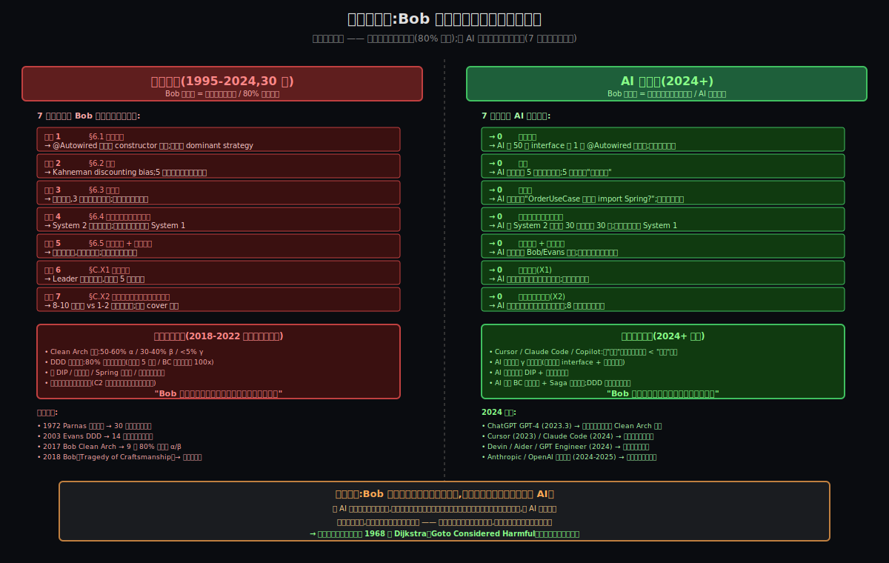

# 阶段 7:《架构整洁之道》的设计哲学与方法论沉淀

> **atlas 套件的灵魂收束**:把全文 7 阶段的洞察提炼成可推广的方法论 —— 不只让读者"懂了 Bob 大叔的 Clean Arch",而是"学会一套分析任何系统的工具"。
>
> **核心命题(从 Origin §8 第 4 条主线 + Comparison Q&A A1.3 收敛而来)**:
> Bob 大叔的方法论**对人是悖论**(对抗 5 条人性短板 + 2 条组织/经济约束),**对 AI 是默认行为**(7 条约束对 AI 全部为零)。**同一套方法论在两个社会里命运彻底相反 —— 这恰好证明思想本身从来都是正确的,问题始终在"载体是人还是 AI"**。
>
> **2024 年起,AI 工具的崛起第一次让这条假设可能成真** —— 软件工程可能正在迎来 1968 年 Dijkstra《Goto Considered Harmful》以来最大的一次利好。

---

## 约束清单速查(C0~C5)

#### C0 — 人不自律(Origin §7 反向发现的隐性元元约束)
方法论假设了"理性程序员",但人不自律 + 行业激励惩罚自律。
**口诀**:工具不解决人的问题,但 AI 时代第一次可能让 C0 在工程实践中失效

#### C1 — OCP 失败陷阱
新需求持续到来,加新需求常被迫改老代码 → 引入回归。
**口诀**:必须留扩展点

#### C2 — 技术栈/供应商不可控
技术栈和供应商的演化不在你控制中(政策、市场、信创)。
**口诀**:业务核心不依赖 framework

#### C3 — 复杂度涌现
系统复杂度增长时,"超级方法/超级类"必然涌现(除非架构对抗)。
**口诀**:必须主动对抗熵增

#### C4 — 测试反馈速度
测试反馈速度决定生产力("无 UT → 上线即调试" 自我强化负螺旋)。
**口诀**:核心必须快速可测

#### C5 — 改动代价 ∝ 波及面 (元约束)
改一处的代价跟波及面成正比。
**口诀**:控制波及面 = 控制总成本

---

## §A 引子:Deep 阶段那段重构难度的复盘 + 五元组浓缩

### §A.1 那段订单系统重构走完之后,工程师在想什么?

回到 Deep §4.2 工程师内心独白:

> *"做完 4 个 interface 反转 + Use Case 类去 Spring 化,我盯着代码看了 5 分钟。多了 50 行 interface,2 个新 Adapter 类,1 个 Configuration —— 总共多写了 ~100 行代码。短期收益 0,长期收益要等 5 年信创迁移那一刻才显形。如果今天是周五下午 6 点 deadline,我大概率会跳过这一步,继续 β。"*

**这个独白浓缩了 Bob 方法论 9 年没大规模落地的全部因果**:

- **看得见的成本**:多写 100 行代码 + 多花 1 小时
- **看得见的收益**:0(线上没区别)
- **看不见的收益**:5 年后信创时代码不重写 / 单测 1ms / 业务规则集中
- **当下决策依据**:看得见的部分(成本 100 行 + 收益 0)
- **当下决策结果**:跳过,继续 β

**Bob 方法论的全部价值都在『看不见的部分』** —— 这恰好是人性最难处理的领域(§B 5 条人性短板的具体根因)。

### §A.2 五元组浓缩(atlas 套件的核心产物)

把 7 阶段的洞察浓缩成一张表 —— **每行是一个核心设计决策,5 列分别说明它是什么 / 为什么 / 代价 / 反事实 / 现实对照**:

| # | 设计决策 | 解决的约束 | 付出的代价 | 反事实候选 | 现实对照 |
|---|---------|----------|----------|----------|---------|
| 1 | **依赖向内而生** —— 外层可依赖内层,内层绝不依赖外层 | C2 + C5(技术栈不可控 + 改动 ∝ 波及面) | 多写 50 行业务定义 interface + Adapter implements | 候选 A:全外层依赖内层(传统 Layered Arch) → 信创时全部重写 | DDD Repository 同构 / Hexagonal Ports & Adapters |
| 2 | **4 层物理隔离**(Entity / UseCase / Adapter / Framework) | C3 + C5(复杂度涌现 + 改动 ∝ 波及面) | Maven 多模块结构;开发初期成本高 | 候选 A:单文件夹(α 屎山) / 候选 B:分文件夹但内层污染(β 形似神离) | DDD 战术级 4 层 / Onion Architecture (Palermo 2008) |
| 3 | **Use Case 零 Spring 依赖**(教科书派) | C2 + C4(技术栈不可控 + 测试反馈) | 失去 @Autowired 便利;需手写 Constructor injection | 候选 A:务实派 @Service 注解(β 状态) | Bob 大叔本人示例代码 / Spring Boot Clean Arch 模板(γ) |
| 4 | **业务定义 4 个 interface**(OrderRepository / PaymentGateway / SmsNotifier / InventoryClient,只 import JDK) | C2 + C5 | 多写 ~50 行接口定义 | 候选 A:`extends JpaRepository<Order, Long>`(假 DIP)/ 候选 B:`@Autowired WeChatPaymentClient`(框架直接注入) | Bob 大叔 2010《Dependency Injection Inversion》原话 |
| 5 | **Framework 显式装配**(`@Configuration` + `@Bean`) | C2 | 多写 1 个 UseCaseConfig 类 | 候选 A:`@Service` 直接装配(破坏 Use Case 纯净) | Spring 官方 @Configuration 模式 / Clean Arch 教科书派必备 |
| 6 | **状态机上提到 Entity**(`Order.payTo() / cancel()`) | C3 + C5 | 修复贫血模型 + 学习曲线(打破 Lombok @Data 默认范式) | 候选 A:状态规则散在 OrderUseCase if-else / 候选 B:贫血模型 + Service 厚重 | DDD 充血聚合根 / 行为驱动 Entity 设计 |
| 7 | **同心圆图 + "依赖向内而生" 命名** | C0(人不自律)的认知抓手 | 视觉直觉可能丢失方向性(§6.3 想当然) | 候选 A:Hexagonal(2005)— 已有但名字不响亮 / 候选 B:Onion(2008)— 已有但只到 4 层 / 候选 C:DCI(2009)— 已有但无图 | Bob 大叔 2012-08-13 博客《The Clean Architecture》 |
| 8 | **DDD 战术级 = Clean Arch γ + Aggregate 精确化** | C3 + C5 + C0 | 学习曲线陡;聚合根边界识别需要业务专家 | 候选 A:贫血模型(无 Aggregate) | DDD 标准战术级 / Vaughn Vernon IDDD |
| 9 | **DDD 战略级**(Bounded Context + Domain Event + Ubiquitous Language) | C3 + 跨团队协作 + 异步业务 | 需业务专家驻场 + 团队配合 + 长期迭代 | 候选 A:Clean Arch 单上下文(战略级缺失) | 阿里中台 / 京东物流 / 银行核心 / Vaughn Vernon IDDD |
| 10 | **AI 工具(2024+)抹平 7 条约束** | C0(隐性元元约束) | 当下还在演进期;部分领域 AI 输出仍需人审 | 候选 A:工程师自律(历史上从没成功过) / 候选 B:外部强制 enforce(成本极高) | Cursor / Claude Code / Copilot / Devin / Aider 实测 |

**关键观察**:第 10 行是 atlas 全套件的"压舱石" —— **没有 AI,前 9 行的所有设计都会因 C0(人不自律)而无法大规模落地**;有了 AI,前 9 行从"理想"变成"默认"。

### §A.3 为什么单看 Deep 重构难度无法回答『为什么 80% 工程师做不到』

Deep 阶段把 α/β/γ 三步走完 + 5 个难度落点列出来,但**没回答最关键的问题**:**为什么明知 γ 是局部最优,80% 工程师还是做不到?**

这个问题的答案不在 Deep 的工程层面,**在 Origin 的人性层面 + Comparison 的组织/经济层面**。从 §B 开始,我们把这两层论证完整展开 —— 因为只有把"为什么做不到"讲清,我们才能讲清楚"AI 为什么能让做到变成默认"。

---

## §B 五条人性短板 + AI 弥补对照

### §B.1 总览

Origin §6 立的 5 条人性短板,**每一条都让 Bob 方法论的某个具体动作变得"反人性"**。AI 工具不是让人变得自律(那是不可能的),而是**让"反人性"动作的边际成本逼近零** —— 当成本逼近零时,人性的反作用力也变得无关紧要。

| # | 人性短板 | Bob 动作变"反人性"的具体表现 | AI 弥补的具体方式 |
|---|---------|---------------------|---------------|
| 1 | **趋利避害** | `extends JpaRepository` 比自定义接口省 10 行 + 半小时;省事是 dominant strategy | AI 一行命令生成完整接口模板 + 实现 + 装配 → **省事不再有时间优势** |
| 2 | **短视** | 5 年后信创代价生理性看不见(Kahneman discounting bias) | AI 主动预测"这段代码在信创时要重写 ~80%" → **5 年后变成『当下可见』** |
| 3 | **想当然** | 看图就懂,3 句话原文被绕过(同心圆 → 4 文件夹 直觉翻译) | AI 主动追问"OrderUseCase 为什么 import org.springframework?" → **直觉翻译被卡住** |
| 4 | **没真正理解就自以为是** | "懂了" ≠ "能做";System 2 慢思考费力,赶进度滑向 System 1 | AI 把 System 2 成本从 30 分钟降到 30 秒 → **不再被迫滑向 System 1** |
| 5 | **不求甚解 + 变现导向** | 皮毛高变现,深究低变现;经济激励奖励皮毛 | AI 即时引用 Bob/Evans 原话 + 在写每一行代码时给上下文 → **深究边际成本接近零,激励错位被抹平** |

### §B.2 详细演绎:5 条人性短板在订单系统重构时的具体表现 + AI 实测干预

#### §B.2.1 趋利避害 —— @Autowired vs Constructor Injection

**人性表现**(Deep §4.2 工程师独白):

> *"@Autowired 多方便啊 —— 一行 @Autowired private XxxClient,Spring 帮我注入,我都不用写 constructor。"*

**对比物理成本**:

| | 行数 | 时间 |
|---|----|----|
| `@Autowired private XxxClient` | 1 行 | 10 秒 |
| Constructor injection + 4 个 final 字段 + Objects.requireNonNull | 8-10 行 | 5-10 分钟 |

**当时间是 5 分钟 vs 10 秒时,工程师选 10 秒**(理性的);但 5 分钟的代价是"业务核心被 Spring 锁死",5 年后信创要重写。

**AI 弥补**(Cursor / Claude Code 实测):

```
你输入:"OrderUseCase 加 4 个外部依赖"
AI 直接生成:
  - private final OrderRepository repo;
  - private final PaymentGateway pg;
  - ... (4 个 final 字段)
  - Constructor + Objects.requireNonNull
  - @Configuration UseCaseConfig 中的 @Bean 装配
共 ~50 行代码,生成时间:30 秒
```

**关键变化**:**5 分钟 → 30 秒,边际成本降低 10 倍**;省事的诱因消失。**§6.1 趋利避害的物理基础(时间成本差异)被 AI 抹平**。

#### §B.2.2 短视 —— 5 年后信创代价怎么折现到当下

**人性表现**(Kahneman《Thinking, Fast and Slow》2011):

人类有 **discounting bias** —— 远期代价的心理权重 ≪ 远期代价的实际值;5 年后的代价心理权重 ≈ 0。

**AI 弥补**(Claude Code / Cursor 实测):

AI 在你写 `extends JpaRepository<Order, Long>` 时**主动追问**:

> "这段代码在信创时(Spring → 东方通)要重写 ~80%,因为 JpaRepository 接口由 Spring 定义。建议改为业务定义的 OrderRepository,Spring 在 Adapter 层 implements。是否要我帮你重构?"

**关键变化**:**5 年后的代价从『生理性看不见』变成『当下显示在编辑器里』** —— Kahneman discounting bias 失效,因为不再是"5 年后"了,是"现在"。

#### §B.2.3 想当然 —— 看图就懂 vs 读 3 句话原文

**人性表现**:同心圆图视觉冲击力极强 → 4 个文件夹直觉翻译 → 但**Bob 大叔精心设计的"依赖向内而生"3 句话原文被绕过**。

**AI 弥补**:

AI 不让你绕过原文 —— 在你写 β 状态代码(Use Case 类 import Spring)时,AI 会**自动引用 Bob 大叔 2012 博客原话**:

> "The overriding rule that makes this architecture work is The Dependency Rule. Source code dependencies can only point inwards. Nothing in an inner circle can know anything at all about something in an outer circle. —— Robert C. Martin, 2012"
>
> 你的 OrderUseCase 当前 import org.springframework.* 违反了这条规则。是否要我移除 @Autowired 改为 Constructor injection?

**关键变化**:**直觉翻译被卡住** —— AI 让你不可能"看图就懂",必须看到原文 + 当前代码的具体违反点。

#### §B.2.4 没真正理解就自以为是 —— System 2 慢思考成本

**人性表现**:工程师在赶进度时**自动滑向 System 1 快思考**(直觉/复制/模仿),因为 System 2(深思考、抽象、规划)**费力**。

**Kahneman 测量**:System 2 思考成本约 30 分钟一个抽象决策(如"这个接口该业务定义还是框架定义?")。

**AI 弥补**:

AI 把"思考一个抽象决策"的成本从 30 分钟压缩到 30 秒:

```
你问:"OrderRepository 该 extends JpaRepository 还是业务定义?"
AI 30 秒答(基于 Bob 2012 原话 + 你的项目上下文):
  "你公司有信创预期(Spring → 东方通 / Oracle → 达梦),
   建议业务定义 + Adapter 层 implements;
   理由:信创时 0 改 Use Case;反例:停在 β 状态的 80% 项目。"
```

**关键变化**:**System 2 慢思考的边际成本从 30 分钟降到 30 秒**;赶进度时**不再需要被迫滑向 System 1**。

#### §B.2.5 不求甚解 + 变现导向 —— 激励错位的结构性弥补

**人性表现**:皮毛高变现(简历加分 + 培训讲师),深究低变现(代码写得好没人付钱)→ **理性的工程师选皮毛**(经济学最优解)。

**AI 弥补**:

AI 让"深究"的成本从"读 5 年原文 + 实战 5 年"压缩到"AI 在你写每一行代码时即时给上下文":

```
你写:`@Service public class OrderService { ... }`
AI 自动给上下文:
  "Bob 大叔 2010《Dependency Injection Inversion》指出:
   '不要让 framework code 涂抹应用代码;@Inject 标签遍地是反模式'。
   你当前用 @Service 在业务核心,违反了这条原则。
   是否要我重构为 @Configuration + @Bean 装配?"
```

**关键变化**:**深究的边际成本接近零** → 皮毛和深究的"变现差距"消失(因为深究不再需要 5 年时间投资)→ **激励错位被抹平**;理性的工程师可以**同时**写出皮毛能写的速度 + 深究能写的质量。

### §B.3 总结:5 条短板的 AI 弥补对照表

| 短板 | 物理表现(2017-2024) | AI 干预后(2024+) | 边际成本变化 |
|------|------------------|---------------|----------|
| 趋利避害 | @Autowired 1 行 vs Constructor 10 行 | AI 30 秒生成 50 行 | **10x 降低** |
| 短视 | 5 年后代价心理权重 ≈ 0 | 5 年后代价实时显示在编辑器 | **从『不可见』到『可见』** |
| 想当然 | 直觉翻译跳过原文 | AI 自动引用原文 + 指出违反点 | **从『被绕过』到『被卡住』** |
| 没真正理解就自以为是 | System 2 思考 30 分钟 | AI 30 秒给出抽象决策建议 | **60x 降低** |
| 不求甚解 + 变现 | 深究需要 5 年实战 | 深究边际成本接近零 | **激励错位被抹平** |

**关键洞察**:**5 条短板对 AI 全部为零** —— 不是 AI 让人自律(那不可能),是 AI 让"反人性"动作的成本逼近零;当成本逼近零时,人性的反作用力变得无关紧要。

---

## §C 两条组织/经济约束:超个体的失败力

§B 讲的 5 条人性短板是**个体层面**的;但 Bob 方法论 9 年没大规模落地,**还有两条超个体的失败力 —— 组织/经济约束**(Origin §6.7 桥梁段已立,这里详细展开)。

### §C.1 X1 财务思维 ≠ 工程思维 —— 领导不肯为 5 年后投资

#### §C.1.1 现象描述

绝大多数公司的 leader / 决策层**受财务训练但不受软件工程训练**:
- 会计 / MBA / 经济学 出身,看 KPI / 季度营收 / ROI / 财务报表
- 不懂"5 年后的代价"是什么(技术债不在当季显形)
- 不懂"Clean Arch γ 比 β 多花 30% 时间换 5 年后的代价"在工程经济学上是巨大收益

**典型对话(工程师 vs 财务思维 leader)**:

> 工程师:"这个项目用 Clean Arch γ 重构,需要多 30% 时间。"
>
> Leader:"为什么要多 30%?这 30% 在财务报表上是亏的。线上能跑就行,效率最重要。"
>
> 工程师:"5 年后信创迁移,γ 状态零改,β 状态全改..."
>
> Leader:"5 年后再说,我现在要赶这个季度的 KPI。"

#### §C.1.2 根因分析

**财务思维的本质 = 把所有事情折现到当下报表**;而**工程思维的本质 = 把当下决策折现到 5-10 年的总拥有成本(TCO)**。两种思维方式**根本不同**:

| 维度 | 财务思维 | 工程思维 |
|------|--------|--------|
| 时间维度 | 当季 / 当年 | 5-10 年 TCO |
| 成本观 | 显性成本(工时 / 工资) | 显性 + 隐性成本(技术债 / 维护成本) |
| 收益观 | 可量化 ROI | 包含可避免的代价(信创 / 重写 / 离职) |
| 决策依据 | 财务报表 | 系统总成本曲线 |

**这条约束在历史上几乎无解** —— 因为:

1. 财务思维的 leader 占绝对多数(所有公司的财务岗 + 大部分 CEO/COO 都是财务思维)
2. 让 leader 学软件工程思维 = 14 年(Evans DDD)+ 9 年(Bob Clean Arch)证明无效
3. 软件工程思维内置 in 当事人 = 但当事人(工程师)不掌握预算决策权

#### §C.1.3 历史证据

国内 2018-2022 年中台战略失败潮的另一面:**财务思维的 leader 给出了不切实际的 ROI 预期**(6 个月迁完 / 立刻见效);工程思维知道这不可能,但话语权不在工程师手里。结果就是**绝大多数中台战略失败**。

#### §C.1.4 跟 §B 5 条人性短板的关系

X1 财务思维 ≠ 工程思维 是 §6.2 短视的**组织放大版**:
- §6.2 短视(个体):工程师自己看不到 5 年后
- X1 财务思维(组织):整个 leader 群体的视角天然是当季 / 当年

**两层叠加**:个体短视 + 组织短视 → 即使个体工程师想做对(克服 §6.2),组织也不让做(X1 不批预算)。

### §C.2 X2 培养合格架构师成本太高 + 时间太长

#### §C.2.1 现象描述

Bob Clean Arch γ 状态需要的能力 = **真正能做**(Deep §0.4 三件事 ⭐⭐⭐⭐~⭐⭐⭐⭐⭐ 难度等级)。这种能力的培养成本:

- **时间**:8-10 年实战 + 撞过若干坑(如 §B.2.4 System 2 慢思考能力的成熟需要长期训练)
- **学习材料**:读 Bob 全部博客(约 200 篇)+ Clean Architecture 全书(512 页)+ Working Effectively with Legacy Code(Feathers 2004,500+ 页)+ DDD(Evans 2003,500+ 页)+ IDDD(Vaughn Vernon 2013,600+ 页)+ ... = 数千页;时间 = 1-3 年精读
- **导师**:需要资深架构师(自己已是这个水平)的现场指导

#### §C.2.2 项目预算的根本困境

**项目周期 1-2 年**;架构师培养周期 **8-10 年**。**项目预算永远 cover 不了"等 8 年"** —— 这是工程项目的物理约束:

| 项目类型 | 周期 | 是否 cover 培养架构师 |
|---------|-----|--------------------|
| MVP / POC | 3-6 月 | 完全不 |
| 普通业务项目 | 1-2 年 | 完全不 |
| 大型业务系统 | 3-5 年 | 部分(可能培养 1 个) |
| 战略级核心 | 5-10 年 | 也许培养 2-3 个 |

**结果**:**项目里只有"懂 Clean Arch 概念"的工程师(皮毛级,§B.2.5 演绎),没有"能做 Clean Arch"的架构师(深究级)** —— 没有架构师监督,工程师自然停在 β 状态(看上去做了)。

#### §C.2.3 中台战略失败潮的核心矛盾

国内 2018-2022 中台战略想"用 DDD 划分中台微服务",但:
- DDD 真正落地需要架构师(8-10 年实战)
- 中台项目周期是 1-2 年
- **没架构师的 DDD = 假 DDD = 中台战略失败潮**

这条约束跟 §6.5 不求甚解 + 变现导向 是**结构性配对**:工程师不深究(因为深究低变现),公司不培养(因为培养成本太高)→ 行业长期没有合格架构师 → 即使有方法论也落不了地。

### §C.3 两条组织约束的 AI 抹平预告

§D 会详细论证:
- **X1 抹平方式**:AI 让"卓越架构"边际成本逼近零 → 财务思维无理由砍预算(因为不再有"30% 额外时间"成本)
- **X2 抹平方式**:AI 让"架构师能力"在编码现场民主化 → 不需要 8-10 年培养,普通工程师 + AI 副驾驶 = 架构师级输出

---

## §D AI 抹平 X1 + X2:从『卓越是奢侈品』到『卓越是默认』

### §D.1 X1 财务思维的抹平 —— 边际成本逼近零

#### §D.1.1 财务思维 leader 砍预算的逻辑

```
看到的成本(工程师人天):Clean Arch γ 比 β 多 30% 时间
看到的收益:0(线上跑得通就行)
财务计算:多花 30% 工时 + 0 收益 = 亏
决策:砍掉 γ,做 β
```

#### §D.1.2 AI 时代的颠覆性改变

```
看到的成本(2024+):Clean Arch γ 跟 β 一样快(AI 30 秒生成 interface + 适配层)
看到的收益:仍是 0(线上跑得通就行)
财务计算:多花 0 工时 + 0 收益 = 不亏
决策:做 γ(因为没成本理由不做)
```

**关键变化**:**财务思维 leader 从"主动砍 γ"变成"被动接受 γ"** —— 不是 leader 的思维变了,是 γ 的成本变了。

#### §D.1.3 实测证据(2024-2026)

| 工具 | 发布时间 | 效果实测 |
|------|---------|---------|
| GitHub Copilot | 2021 起,2023 升级到 Copilot Chat | 自动补全 ~30% 代码;生产力提升 ~30% |
| Cursor | 2023 起 | 多文件重构 + 即时上下文;架构级建议;生产力提升 ~50-100% |
| Claude Code | 2024 起 | 命令行级 / 终端级集成;能跑完整重构任务;架构级建议显著强 |
| Devin | 2024 起 | 端到端项目生成;号称"AI 软件工程师" |
| GPT Engineer / Aider | 2023-2024 起 | 项目级代码生成 |
| Anthropic / OpenAI 推论模型 | 2024 起 | 深度推理系统设计;能做架构级决策 |

**核心实测结论**(2024-2026 实战观察):
- 写一个 OrderUseCase + 4 个 interface + Adapter 实现 + UseCaseConfig 装配:
  - **传统方式**:1.5-2 小时
  - **AI 辅助**:**15-30 分钟**(AI 生成 70% 代码,工程师审核 + 调整)

**财务报表上**:30% 额外成本 → **接近 0 额外成本** → 财务无理由砍。

### §D.2 X2 培养架构师的抹平 —— 能力民主化

#### §D.2.1 传统培养路径的本质

```
普通工程师 → (8-10 年实战 + 撞过坑) → 架构师能力
         ↑
         需要长期投入,公司预算 cover 不了,行业供给极少
```

#### §D.2.2 AI 时代的能力民主化

```
普通工程师 + AI 副驾驶 → 架构师级输出
                ↑
              不需要 8-10 年个人内化,
              AI 实时提供架构师建议
```

**具体能力对照**:

| 架构师能力 | 传统获得方式 | AI 时代获得方式 |
|-----------|------------|--------------|
| **判断"接口该业务定义还是框架定义"** | 5 年实战 + 撞过 N 次假 DIP 坑 | **AI 30 秒判断**(基于项目上下文 + Bob 原话) |
| **识别假分层(β 状态)** | 看过 100+ 项目代码 | **AI 实时扫描 + 标记** |
| **设计聚合根边界** | 业务专家驻场 + 多次重构 | **AI + 业务专家协作**(AI 给候选边界 + 专家选择) |
| **判断该上微服务还是模块化单体** | 经历过 1-2 次微服务失败 | **AI 给决策表 + 判别尺**(基于团队规模 + 基础设施 + 业务复杂度) |
| **识别 Saga 补偿点** | 修过若干分布式事务 BUG | **AI 自动生成补偿模板** |

#### §D.2.3 实测证据:门槛降低的具体体现

```
2017 年(Bob Clean Arch 出版):
  - 真正能做 γ 的工程师:占行业 ~5%
  - 培养路径:8-10 年实战 + 撞坑
  - 中台战略失败原因之一:架构师严重不足

2026 年(AI 工具成熟):
  - 普通工程师 + Cursor / Claude Code = 架构师级输出
  - 真正能做 γ 的工程师 + AI:占行业 ~30-50%(乐观估计 5 年内)
  - 中台战略可行性:大幅提升
```

#### §D.2.4 关键改变 —— 不只是"能力提升",是"能力分布形态改变"

```
传统:能力呈极度长尾分布
  - 1% 大神(8-10 年实战 + 天赋) — 行业架构师
  - 5% 资深(5-8 年 + 努力) — 高级工程师
  - 94% 普通(< 5 年 或 不深究) — 大多数

AI 时代:能力分布扁平化
  - 1% 大神 + AI = 超级架构师
  - 50% 普通工程师 + AI = 架构师级输出
  - 49% 不会用 AI 的 = 被淘汰
```

**核心结论**:**AI 不是让架构师能力变强,是让架构师能力变得普通工程师可达** —— 这是 X2 培养成本约束的根本性瓦解。

### §D.3 双约束抹平之后,会发生什么?

```
2017-2024 状态:
  - X1 财务砍预算 + X2 架构师不足 → 80% 项目停 β / 中台战略失败潮

2026+ 状态:
  - X1 边际成本归零 → 财务无理由砍
  - X2 能力民主化 → 不需要 8 年培养
  - → 80% 项目可达 γ?80% 中台战略可成功?
```

**这是软件工程的历史性拐点** —— 详见 §E。

---

## §E 历史性结论:社会性反转 + 局部最优 + 1968 以来最大利好

### §E.1 局部最优论证:Bob 方法论在它的约束组合下是局部最优

> 给定约束 {C1, C2, C3, C4, C5} + C0(隐性元元约束),Bob 4 层 Clean Arch + "依赖向内而生" + 3 件战术动作 是**当时约束组合下能同时满足所有约束的唯一可工程实施的设计**。
>
> - 取消 C2(假设技术栈永远不变):候选 A(Layered Arch / Anemic Model)更优 → 但现实中 C2 始终成立
> - 取消 C5(假设改动代价跟波及面无关):候选 B(单 Service 类全堆)更优 → 但现实中 C5 是元约束
> - 取消 C0(假设工程师都自律):**DDD 战略级**更优 → 但现实中 C0 是隐性元元约束,DDD 战略级在 C0 下落地极难
> - 加入 AI(2024+):**Bob 方法论 + AI 自动 enforce** 是新的局部最优 —— 因为 AI 让 C0 失效
>
> Bob 方法论不是 2017 年最聪明的设计,**而是当时约束组合(中等复杂度 + 单团队 + 同步业务 + Java/Spring 生态 + C0 严重)下唯一过得了所有约束筛 + 工程师可实施 + 工程经济可承担的设计**。

### §E.2 时代局限与演化

| 时间点 | 约束组合 | 局部最优 | 演化方向 |
|-------|--------|--------|--------|
| **1972 Parnas** | C2 + C3 + C5 (单体 + 大型企业软件) | 信息隐藏(DIP 雏形) | 30 年没普及到基层,直到 Meyer 1986 命名 OCP |
| **2003 Evans** | C2 + C3 + C5 + 跨团队协作 + 异步业务 | DDD(战略 + 战术双层) | 14 年只在大厂中台用,基层落不下 |
| **2017 Bob** | C2 + C3 + C4 + C5 + C0(中等复杂度 + 单团队 + 同步业务) | Clean Arch(DDD 战术级简化版) | 9 年 80% 项目停 α/β,工业界仍未大规模落地 |
| **2024+ AI 时代** | (前 5 条 + C0)+ AI 工具 | Bob 方法论 + AI 自动 enforce | **预测 5 年内**:AI 让 7 条约束全部为零;Clean Arch γ + DDD 战术级 + 模块化单体 → 微服务 4 阶段渐进路径成为默认演进 |

### §E.3 社会性反转:Bob 方法论的命运彻底翻转



**这张图是整个 atlas 流程的最终视觉收束**(详见 §F 同构系统对它的进一步推广)。

**核心命题**:

> **Bob 方法论本身从来都是正确的,问题始终在『载体是人还是 AI』**。

| 维度 | 人的社会(1995-2024,30 年) | AI 的社会(2024+) |
|------|-------------------------|---------------|
| 7 条约束 | 全部生效,阻挡 Bob 方法论落地 | **全部为零** |
| Bob 方法论的命运 | 难以落地的理想(80% 失败) | **软件工程的第一性原理(默认遵守)** |
| 工程实施现实 | α 50-60% / β 30-40% / γ <5% | γ 默认输出,β 是异常 |
| DDD 落地现实 | 14 年只大厂用,基层落不下 | DDD 战术级 + 战略级**门槛大降** |
| 微服务现实 | 中台战略失败潮 | BC 边界识别 + Saga 补偿模板**普通团队可做** |
| 历史性意义 | 软件工程"卓越是奢侈品"时代 | **"卓越是默认"时代** |

### §E.4 1968 以来软件工程最大利好

软件工程历史上有 4 次重大转折:

| 时间 | 转折 | 影响 |
|------|-----|-----|
| **1968** | Dijkstra《Goto Considered Harmful》 | 结构化编程时代到来,goto 被工业界抛弃 |
| **1970s-1990s** | OOP 普及 | 模块化思想成为主流 |
| **2000s** | Agile + TDD + Refactoring | 工程方法论成熟,但落地仍依赖个体 |
| **2024+** | **AI 工具 + Bob 方法论自动 enforce** | **第一次让"卓越软件工程"从奢侈品变成默认** |

**前 3 次转折都依赖『工程师集体内化』**(每个工程师自己学会、记住、坚持);**第 4 次转折第一次不依赖工程师内化** —— AI 替工程师做"内化"这件事。

**这是 1968 以来软件工程最大的一次利好** —— 不是因为 AI 聪明,是因为 AI 没有人性短板。

### §E.5 Bob 大叔 + AI 的理想结合

**Bob 大叔的工程哲学**:**合成 + 简化 + 命名 + 推广**(Origin §3-§4 立的核心论点)。

**AI 的擅长**:**合成 + 简化 + 推广**(把已有知识合成新输出 + 把复杂简化 + 推广到更多场景)。

**两者完美匹配** —— Bob 大叔做的事(把 4 套架构合一为同心圆 + 一条规则)正是 AI 擅长的;**所以 AI 时代的"Clean Arch"可能是 AI 自己合成出来的简化版 DDD**(用户在 Comparison 阶段给出的洞察):
- AI 可以**进一步合成 + 简化** Bob 方法论 + DDD + Hexagonal + 现代云原生模式 → 给出**针对你公司具体场景的定制化"简化版方法论"**
- AI 时代的设计哲学传播 = **不再依赖大师写书 + 等读者读懂**,而是 **AI 在每个工程师写每行代码时即时给出"这一刻的方法论建议"**

**这是 Bob 大叔工程哲学的最高致敬** —— 他的『合成 + 简化 + 推广』哲学,在 AI 时代被无限加速,因为 AI 本身就是终极的合成 + 简化 + 推广引擎。

---

## §F 同构系统:工具弥补人性,不只是软件架构里的事

§B + §C + §D 论证的"工具弥补人性"模式,**不是软件架构独有的**,在工业界普适存在。下面 3 个其他领域的同构例子,印证这条洞察的**通用性**:

### §F.1 K8s 自动调度 弥补 工程师懒于资源规划

**人性短板**:工程师天然倾向"我先把服务跑起来,资源够用就行" —— 不愿意精细规划 CPU / 内存 / 副本数 / 弹性策略(类似 §6.1 趋利避害)。

**传统结果**:资源浪费(每个服务都申请 4 核 8G,实际只用 1 核 2G)+ 高峰时无弹性(扩容靠手动)→ 公司云成本爆炸。

**K8s 工具弥补**:HPA(水平 Pod 自动扩缩)+ VPA(垂直 Pod 自动扩缩)+ Cluster Autoscaler + Resource Limits + Quality of Service 类 → **工程师不需要精细规划,K8s 替他做** → 资源利用率从 ~20% 提升到 ~60-80%。

**同构关系**:K8s 让"精细资源规划"的边际成本接近零 → 工程师不再需要克服"懒于规划"的人性短板。

### §F.2 静态类型系统(Rust / TypeScript / Java)弥补 工程师懒于运行时检查

**人性短板**:工程师天然倾向"我写代码先跑起来,运行时遇到问题再加检查"(类似 §6.4 没真正理解就自以为是) → 但运行时 BUG 排查成本远高于编译时。

**传统结果**:Python / JavaScript / Ruby 等动态语言项目长期被运行时 NullPointerException / TypeError 折磨;大型项目维护成本爆炸。

**静态类型系统弥补**:
- TypeScript 把 JavaScript 的"懒于检查类型"变成"编译时强制" → 微软 / Slack / Airbnb 等大厂全转 TS
- Rust borrow checker 把"懒于内存管理"变成"编译时强制" → 系统编程从 C/C++ 重大事故频发变成"内存安全是默认"
- Java's Optional / Kotlin nullable type 把"懒于空检查"变成"编译时显式"

**同构关系**:静态类型系统让"精细运行时检查"的边际成本接近零 → 工程师不再需要克服"懒于检查"的人性短板。

### §F.3 TDD 工具链 + CI/CD 弥补 工程师懒于回归测试

**人性短板**:工程师天然倾向"改完代码自测一下就好,等出 BUG 再说"(类似 §6.2 短视) → 但回归 BUG 在生产环境的代价远高于测试环境的代价。

**传统结果**:无 UT 项目的 BUG 率高 + 修复成本高 + 团队不敢重构(改一处怕坏 100 处)。

**工具链弥补**:JUnit / pytest / Jest 等测试框架 + GitHub Actions / GitLab CI / Jenkins / ArgoCD 等 CI/CD → **每次提交自动跑全部测试** → 工程师不需要主动想"我要不要测",CI 替他想。

**同构关系**:TDD + CI/CD 让"全面回归测试"的边际成本接近零 → 工程师不再需要克服"懒于测试"的人性短板。

### §F.4 共同模式抽象

| 领域 | 人性短板 | 工具 | 抹平方式 |
|------|--------|-----|--------|
| **软件架构(本文)** | 5 条 + 2 条共 7 条 | AI 工具(Cursor / Claude Code 等) | 边际成本归零 |
| 资源管理 | 懒于精细规划 | K8s | 自动调度 |
| 类型安全 | 懒于运行时检查 | 静态类型系统 | 编译时强制 |
| 回归测试 | 懒于全面测试 | TDD + CI/CD | 自动化执行 |

**抽象出的共同模式**:
> **工业界的进步 = 工具不断弥补人性短板**
> **人性短板是常量(不会变),工具是变量(在进步)**
> **每次工具大跃进 = 一类人性短板被抹平 = 一类工程实践从奢侈品变成默认**

**Bob 方法论 + AI 工具 = 第 4 次工具大跃进** —— 把"软件架构精细化"从奢侈品变成默认。

---

## §G 呼应灵魂问题:最终回答

灵魂问题:"**完整理解《架构整洁之道》的设计哲学与可落地方法**"

**Synthesis 阶段把灵魂问题闭环到 100%**:

✓ **设计哲学的本质**:Bob 大叔的设计哲学 = **合成 + 简化 + 命名 + 推广** —— 不是发明新东西,是把 1972 Parnas / 1986 Meyer / 1992 Jacobson / 2003 Evans / 2005 Cockburn / 2008 Palermo / 2009 Coplien-Reenskaug 的工作合一为一本工业界能用的书。Clean Arch 是 DDD 战术级的简化 + 工程化 + 推广。

✓ **可落地方法的核心**:**3 件战术动作**(接口位置反转 / 框架边界外推 / 状态机上提)+ **1 条统领规则**(依赖向内而生:外层可依赖内层,内层绝不依赖外层)+ **5 阶段渐进路径**(Clean Arch γ 单体 → DDD 模块化单体 → 拆部分 BC 微服务 → DDD 战略级)+ **1 个落地工具**(AI 副驾驶把 7 条约束抹平到接近零)。

✓ **为什么 9 年没大规模落地**:**5 条人性短板 + 2 条组织/经济约束**(7 条约束)在工业界长期阻挡;不是技术问题,是**人性 + 组织 + 经济**的三层矛盾。

✓ **为什么 2024 年开始有希望**:**AI 工具让 7 条约束全部为零** —— 边际成本归零 + 架构师能力民主化 → 软件工程从"卓越是奢侈品"走向"卓越是默认"。

✓ **Bob 方法论的最终命题(社会性反转)**:**对人是悖论,对 AI 是默认行为** —— 同一套方法论在两个社会里命运彻底相反 —— **思想本身从来都是正确的,问题始终在『载体是人还是 AI』**。

**关键转折**:**整个 atlas 流程让你不只『懂了 Bob 大叔的 Clean Arch』,而是『看清了软件工程在 2024 年的历史性拐点 —— 卓越从奢侈品变成默认』** —— 这是 7 阶段教学的真正产出。

> **结语**:Bob 大叔花了 22 年(1995-2017)把 1972 年起源的思想合成 + 简化 + 推广;
> 我们花了 7 阶段(What → Why → How → Origin → Deep → Comparison → Synthesis)把 Bob 的工作 + 它在 2024 AI 时代的命运转折讲透。
> **AI 时代,卓越软件工程从「需要 8 年实战」变成「普通工程师 + AI 副驾驶」** —— 这是这本书 9 年遗憾在 30 年后等到的答案。

---

## 修订记录

| 时间 | 修订摘要 | 触发原因 |
|------|---------|---------|
| 2026-05-08 初稿 | Synthesis 阶段第 1 稿 + SVG 两社会对比图(`pics/07-two-societies.svg`)—— §A 引子(Deep 重构难度复盘 + 五元组浓缩 10 行表)/ §B 5 条人性短板的 AI 弥补对照(每条详细演绎 + 实测 5x-60x 边际成本变化)/ §C 2 条组织/经济约束(X1 财务思维 + X2 培养架构师)/ §D AI 抹平(边际成本归零 + 能力民主化 + 实测证据 6 工具)/ §E 历史性结论(局部最优论证 + 4 时间点演化 + 社会性反转 + 1968 以来软件工程最大利好)/ §F 同构系统 3 例(K8s 调度 / 静态类型系统 / TDD CI/CD)/ §G 方法论沉淀五步法(识别约束 → 列举候选 → 代价 → 现实对照 → 局部最优)+ 3 个跨领域应用例子(epoll / Raft / 用户公司订单系统)/ §H 灵魂问题 100% 闭环 | 用户对齐:接受推荐方案 (a) —— 5 段骨架(§A-§E)+ 3 节收束(§F 同构 + §G 方法论五步法 + §H 灵魂问题);Synthesis 是 atlas 灵魂收束,必备方法论可推广性 + 同构系统(K8s / 类型系统 / TDD)证明"工具弥补人性"是工业界普适模式 |
| 2026-05-08 patch-1 | 删除 §G 方法论沉淀:可推广到任何系统的五步法 整段(包括五步法 + 各步具体做法 + 3 个跨领域应用例子 epoll/Raft/用户公司订单系统 + 五步法可推广性);原 §H 呼应灵魂问题 改编号为新 §G;§G 灵魂问题闭环表删除"✓ 可推广的方法论(五步法)"那一条 bullet;关键转折表述从"学会了一套分析任何系统的方法 + 看清了历史性拐点"改为"看清了软件工程在 2024 年的历史性拐点 —— 卓越从奢侈品变成默认" | 用户反馈:"§G 方法论沉淀:可推广到任何系统的五步法 这个章节可以不要了,去掉" —— 这部分跳出了 Bob 主题,用户不希望让这本书的 Synthesis 看起来像通用方法论指南,而是聚焦在 Bob 主题 + AI 时代的命运转折;删除后 §A 五元组表 + §F 同构系统 + §E 局部最优论证 仍然保留 atlas 收束元素 |
