# 阶段 1:Docker / 容器是什么

> **灵魂问题(贯穿全程):** 容器到底是什么?它和虚拟机的根本区别在哪?当一个容器真正跑起来的那一刻,Linux 内核里到底发生了什么 —— namespace、cgroups、镜像分层各自扮演什么角色?
>
> **这一节的本分:** 把"指着说"的对象钉在桌上 —— 四个区**全部点名 + 摆上正确位置**,让你一眼拿到完整版图。每一样**具体怎么实现**(veth 内核里怎么转包、overlayfs 写时复制怎么发生、RPC 报文怎么封帧、cgroups 怎么计账)**留到后面专门钻**。先有地图,再下地洞。

---

## 一句话定义

> **容器是一个被内核圈起来、自以为独占机器的普通进程。**

这句话拆成三个零件,每个都对应灵魂问题的一块:

- **"普通进程"** —— 这是最反直觉、也最关键的一点。容器不是"小虚拟机",不是"沙箱盒子",它在宿主机上**就是 `ps` 能看到的一个普通进程**。你 `docker run nginx`,宿主机上就多了个 nginx 进程,仅此而已。
- **"被内核圈起来"** —— 这个"圈"就是三道墙:**namespace**(让它只看得见墙内)、**cgroups**(让它只用得了配额内的资源)、**overlayfs**(给它一个叠出来的、它以为是全部的根文件系统 `/`)。墙不是容器自己造的,是**内核**提供的能力。
- **"自以为独占机器"** —— 墙造出的是一种**错觉**:容器里 `ps` 只看到自己几个进程、`ip addr` 只看到自己一块网卡、`/` 下是一个干净的系统。它以为整台机器都是它的。掀开墙,它只是宿主上千百个进程里的一个。

> 一句话记不住就记半句:**容器 = 一个有围墙的进程。** 后面所有细节都挂在这半句上。

---

## §0 心法:Docker = 砌墙 + 凿洞

如果只让你带走一句话,带这句 ——

> **Docker = 用 namespace + cgroups 砌墙(隔离),再在 net 墙和 mnt 墙上各凿一个受控的洞(veth 通信 / volume 持久)。overlayfs 是墙内的地板。**

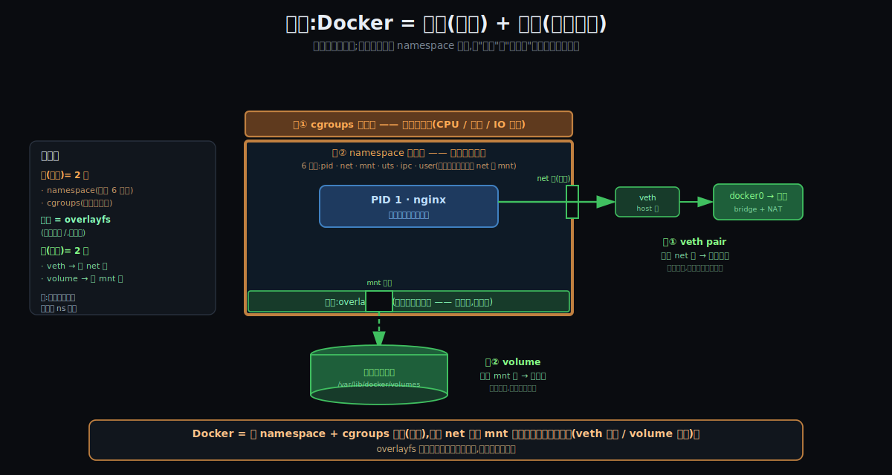

**把数字数精确:**

- **墙(隔离)= 2 类**,不是更多:
  - **namespace = 视图墙**(你能看见什么)。它不是一堵,是**一排 6 扇窗**,每扇隔离一类:`pid` / `net` / `mnt` / `uts` / `ipc` / `user`。
  - **cgroups = 配额天花板**(你能用多少:CPU / 内存 / IO)。
- **overlayfs 不是墙,是地板** —— 容器站着的那层镜像叠出来的根 `/`(在公寓类比里,它是"室内装修",是墙**内**的东西,不是墙本身)。
- **洞(受控连通)= 2 个**,而且妙在 —— **每个洞都是凿在某一扇 namespace 墙上的**:
  - **洞① veth pair**:凿穿 **net 墙** → 容器能对外通信(否则被网络墙焖死)。
  - **洞② volume**:凿穿 **mnt 墙** → 容器能把数据持久化到宿主(否则数据随容器死)。

**为什么这个心法值钱:** "墙"和"洞"是一对**对偶** —— 隔离是默认,连通是例外。容器的每一种"对外打交道"的能力(通网、存数据,以及后面会遇到的共享 IPC、挂宿主目录…),本质都是**在某一堵 namespace 墙上,开一个受控的口子**。抓住这条,后面再多的容器特性你都能归位:它要么是**新砌一堵墙**,要么是**在某堵墙上凿一个洞**。

> 注:容易把数字数成 3~4 堵墙 —— 多半是把 overlayfs(地板)、或把"网络"单独算成了墙。其实**网络就是 namespace 的 net 那扇窗**,而且它恰好是 veth 这个"洞"凿穿的地方。所以严格是 **2 类墙 + 1 块地板 + 2 个洞**。

### §0.1 旁注:Docker 确实从生活里借了很多词

"墙 / 表 / 胶片 / 管道"这些类比之所以都能套上,不是巧合。但要分清两种"借":

- **字面照搬生活的词**(设计者故意的):
  - **container(集装箱)** —— Docker 整个品牌就建在这隐喻上:标准箱子,哪条船 / 吊车 / 卡车都同样对待 → "一次打包,到处运行"。
  - **image(镜像)· registry(仓库 / 登记处)· volume(卷)· port(端口,借自物理接口)· bridge(网桥,借自现实的桥 / 交换机)· mount(挂载,借自当年物理"装上"磁带 / 磁盘)**。
- **从更早的工程传统借的**(不是日常生活):`namespace`(编程里的命名空间)、`cgroups`(控制论 / 工程)、写时复制 CoW(很老的计算机技巧)、联合挂载(文件系统研究)。

**更深一层(这才是关键):** 之所以"电表 / 隔墙 / 叠胶片 / 管道"都能套上,是因为**底层问题本来就是同一个物理问题** —— 公平分配稀缺资源 → 计量(电表);邻里隐私 → 砌墙;复用公共件 → 分层叠放;连通隔离的空间 → 管道 / 桥。计算机一次次撞上这些老问题,自然一次次长出和现实**同构**的形状。

> ⚠️ 但记住:**类比是脚手架,不是房子本身。** 它帮你爬上去理解,但会在某处断裂 —— 比如"overlayfs = 日历"就只接住了"累积写入"一面,漏了分层 / 复用 / 写时复制(见 §4.4 的"透明胶片"修正)。**先借类比拿直觉,再回到机制验证**,是这趟旅程最稳的学法。

---

## §1 一张全景图:四个区,先看摆位置

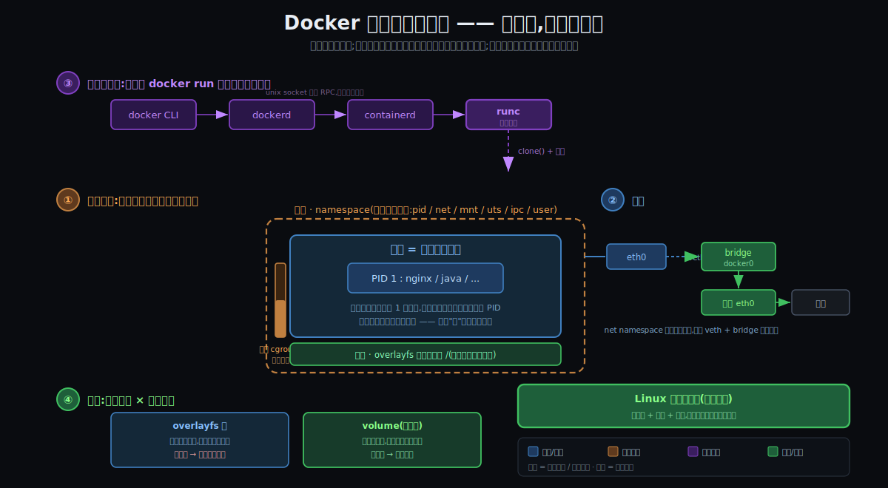

这张图是这一节的"总地图",你能从它读出五件事:

1. **中心是容器本体(区①)** —— 一个进程(PID 1),外面套着三道墙:namespace(看得见什么)、cgroups(用得了多少)、overlayfs(站在什么文件系统上)。
2. **顶上是出生流水线(区③)** —— 你敲的 `docker run` 经过 `docker CLI → dockerd → containerd → runc` 一路下传,最后由 **runc** 真正"砌墙生孩子"。
3. **右边是网络(区②)** —— 容器有自己隔离的网络栈(net namespace),再用 veth pair + bridge 接回宿主、接向外网。
4. **左下是存储(区④)** —— 易失的 overlayfs 根(随容器删掉)和持久的 volume 卷(独立于容器存活)是一对反义词。
5. **底下那条绿带是命门:共享内核** —— 四个区里所有的"墙"和"管子",**全是同一个 Linux 内核提供的能力**。容器没有自己的内核 —— 记住这条,下一节就靠它一刀切开"容器 vs 虚拟机"。

---

## §2 它**不是**什么:容器 vs 虚拟机(灵魂问题的第一刀)

你灵魂问题的前半句是"它和虚拟机的根本区别"。答案出奇地简单 —— **区别只在一层:谁拥有内核。**

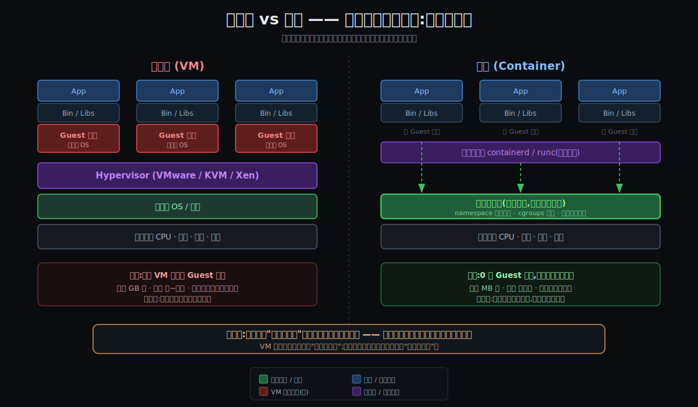

- **虚拟机**:在硬件(或宿主内核)之上架一层 **Hypervisor**,虚拟出"另一台完整的机器"。每台 VM 里**自带一整套 Guest 内核**。这就是它"重"的全部来源 —— 镜像 GB 级、启动要秒到分钟、内存先被 Guest 内核吃掉一截。
- **容器**:**没有 Guest 内核**。所有容器**共用宿主机那一个内核**,中间只隔着 containerd/runc 这薄薄一层。所以镜像 MB 级、启动毫秒级、几乎零额外开销。

| 维度 | 虚拟机 | 容器 |
|------|--------|------|
| **谁拥有内核** | 每台 VM 自带一套 | 全部共用宿主那一个 |
| 隔离边界 | Hypervisor(硬件级虚拟化) | 内核的 namespace + cgroups |
| 启动量级 | 秒 ~ 分钟 | 毫秒 |
| 镜像/体积 | GB 级 | MB 级 |
| 隔离强度 | 强(邻居崩了内核也不影响你) | 弱(共用内核 = 共同命门) |
| 一台机器能跑多少 | 几十台 | 成百上千 |

> **一句话:** VM 在硬件之上虚拟出"另一台机器";容器在同一个内核之上虚拟出"另一个视图"。容器不是"轻量级虚拟机" —— 它根本不在"虚拟机"这个物种里。这也解释了容器的代价:**隔离是弱的**,内核一旦被攻破或 panic,墙内墙外一起完。

### §2.1 一个一眼分辨"容器还是 VM"的小实验

把"容器 = 宿主上的普通进程"这句话变成可手验的事实:

- 在**宿主机**上 `ps aux | grep nginx` —— **看得到**容器里的 nginx(它就是宿主上一个普通进程,只是 PID 不是 1,而是某个大数字如 12345)。
- 在**容器里** `ps` —— **看不到**宿主的 sshd 等进程(pid namespace 只让它看见自己这棵子树,从它的 PID 1 起)。

这个**不对称**本身就是容器和 VM 的试金石:

- **容器**:墙是**单向玻璃** —— 宿主看得进容器,容器看不出宿主。因为是同一个内核,宿主的 pid namespace 是"根",俯瞰得到所有子 namespace 的进程(同一个进程在两边是两个 PID、两个视图)。
- **虚拟机**:宿主 `ps` **看不到** Guest 里的 nginx —— 它在另一个内核里,两边互相隐身,是对称的。

> 一招辨真身:**宿主能不能 `ps` 到里面的进程?能 = 容器(共享内核),不能 = 虚拟机(各有内核)。** 这把"不是虚拟机"从概念变成了可手验的事实。

---

## §3 用一个类比把它焊进直觉:合租公寓楼

光说"共享内核"还是抽象。换个生活场景,你在类比内部就能自己推导出容器的每条性质 ——

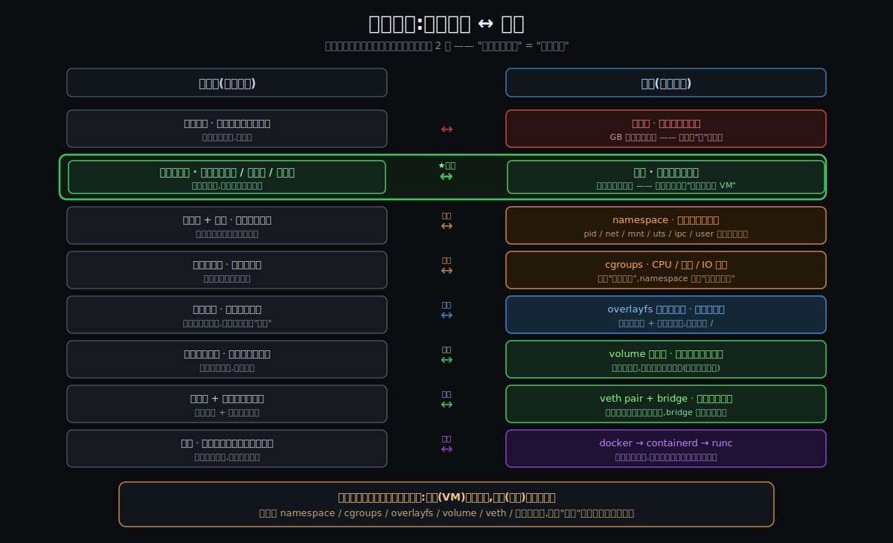

这个类比的杀手锏在**第 2 行**:

- **独栋别墅** = 虚拟机:自带地基、自带水电系统,什么都自己来 → 贵、重。
- **合租公寓楼里的一套** = 容器:**共用大楼的地基、承重墙、主管道**,你只租一套房 → 轻。"共用大楼地基"就是"共用内核"。

钉住这一行,其余全是"合住"这件事的配套:

| 公寓世界 | 容器世界 | 它是哪个区 |
|---------|---------|-----------|
| 防盗门 + 隔墙(看不见邻居家) | **namespace**(看不见别的进程) | 区① 墙一 |
| 独立水电表(用量有上限) | **cgroups**(CPU/内存配额) | 区① 墙二 |
| 室内装修(退租拆了就没) | **overlayfs 根**(容器删就没) | 区④ 易失 |
| 地下室储藏间(公寓拆了它还在) | **volume**(容器删了数据还在) | 区④ 持久 |
| 管道井 + 接市政的水管 | **veth pair + bridge** | 区② 网络 |
| 物业(分房、发钥匙) | **docker → containerd → runc** | 区③ 出生 |

> 一个类比,四个区全兜住,而且"共用大楼地基 = 共用内核"直接回答了"为什么不是虚拟机"。

### §3.1 第二个类比:集装箱 —— 解释"可移植"那一面

公寓楼讲清了**隔离 / 共享内核**;但容器还有另一面 ——**"一次打包,到处运行"**,这一面用**集装箱**(Docker 的本名)讲最顺。把容器想成一个**车间集装箱**:

| 集装箱世界 | 容器世界 |
|-----------|---------|
| 箱里的**工人 + 机器**(一起被吊走) | **应用 + 它自带的依赖 / 运行时**(一起封进镜像) |
| 箱子底部的**标准插头**(水/电/煤气接口统一规格) | **标准接口**:OCI 镜像格式 + Linux syscall ABI |
| 只要码头 / 大楼的**水电制式对得上**,搬过去就能开工 | 只要宿主提供**兼容的内核 ABI**,容器搬过去就能跑 |
| 箱里的工人**无感**(不知道换了码头) | 容器里的进程**无感**(不知道换了宿主) |

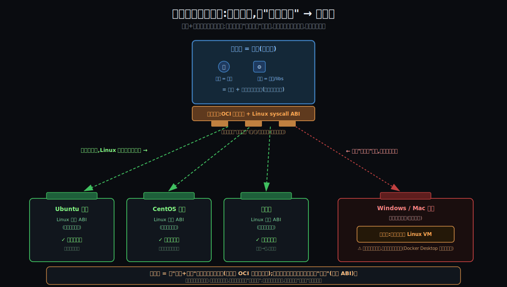

**集装箱真正的创新,从来不是"箱子",是"接口标准化"** —— 角件尺寸全球统一,于是任何吊车、货轮、卡车、港口都能同样对待它。Docker 干的是同一件事:把"应用怎么打包、怎么和宿主打交道"标准化(后来固化成 **OCI** 标准),于是容器在任何兼容宿主上都能跑。这就是为什么"**在我机器上明明能跑**"这句老话被 Docker 终结了 —— 工人和机器是**和箱子一起搬走的**,不再依赖目的地大楼里恰好装了什么。

**但有个关键边界(也是最常被误解的地方):** "到处运行"是**有前提**的 —— 目标大楼必须提供**兼容的水电制式**,也就是**兼容的内核**:

- Linux 容器在 Linux 宿主之间随便搬(Ubuntu → CentOS → 云),因为 Linux syscall ABI 高度稳定、各发行版通用。
- 但搬到**内核制式不同**的 Windows / Mac 上就插不上 —— 所以 **Docker Desktop 偷偷在底下塞了一台 Linux 虚拟机**当"转换器"。

> 这恰好又回扣灵魂问题:**正因为共用内核,容器才轻、才能"插上就跑";也正因为共用内核,它只能插到"同制式"的内核上。** 轻量和"绑定内核家族"是同一枚硬币的两面 —— 这是容器和"自带整套内核、能跨内核家族跑"的虚拟机最后的分界。

### §3.2 生活 ↔ 技术 对照图册

把前面那些类比统一做成"**左边生活画面 / 右边真实技术细节(带真参数、真路径)**"的对照 —— 一眼看清每个生活意象背后到底对应什么机制。

**① 总览:一栋容器大楼,就是一台主机**

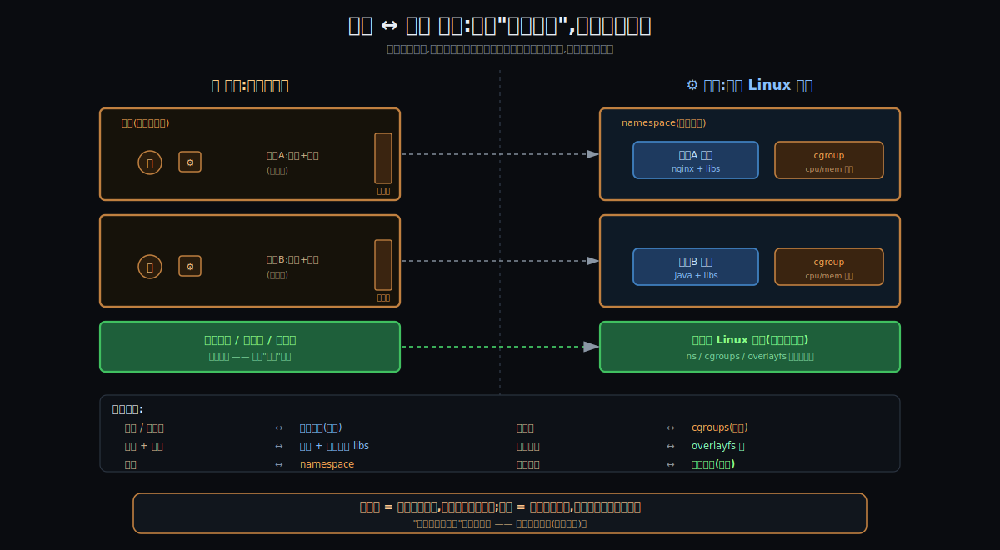

**② 单向玻璃房:namespace 的六扇窗**

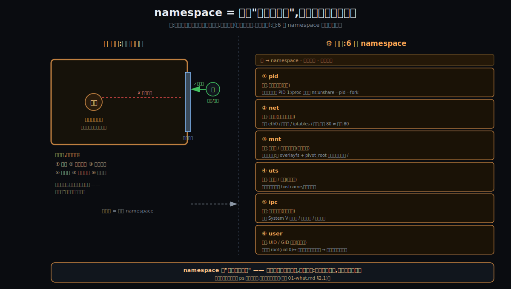

**③ 墙上三块表:cgroups(右半边是真实 cgroup v2 参数)**

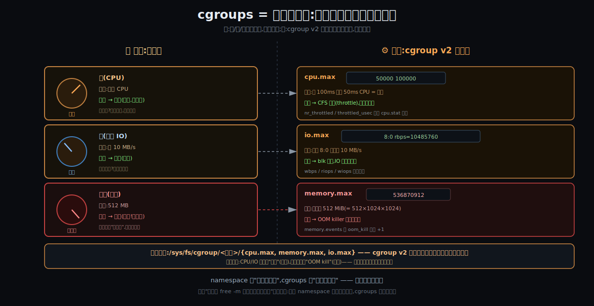

**④ 一摞透明胶片:overlayfs(右半边是真实 lowerdir/upperdir/CoW)**

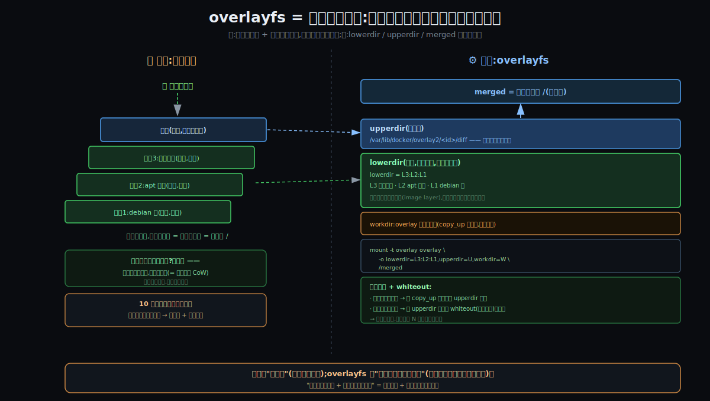

**⑤ 管道井 + 市政总阀门:网络(右半边是真实 veth/bridge/NAT 规则)**

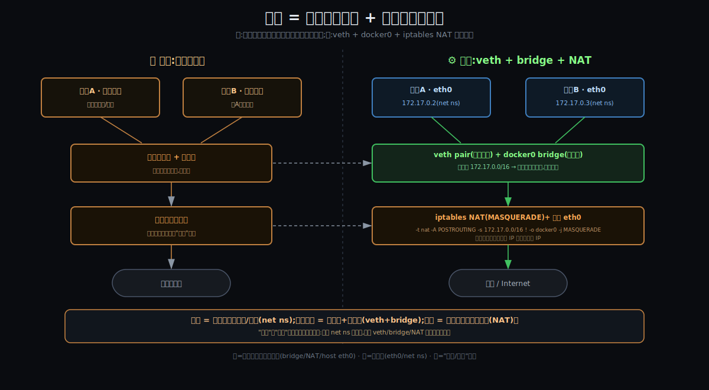

**⑥ 物业接力:出生流水线(右半边是真实 socket 路径 + runc 调用)**

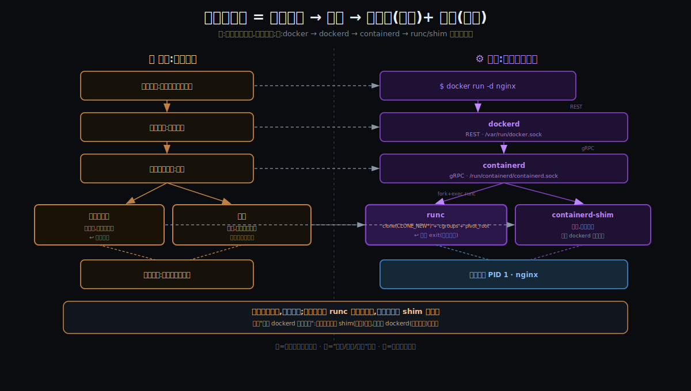

> 看图顺序:先看 ① 总览拿到"大楼 = 主机"的整体映射,再分别钻三道墙(②③④),最后看两个"洞 / 流程"(⑤ 网络、⑥ 出生)。每张图**右半边的参数**(`cpu.max`、`memory.max`、`lowerdir=L3:L2:L1`、6 类 ns、`iptables MASQUERADE`、`/var/run/docker.sock`、`clone(CLONE_NEW*)`)就是后面"怎么工作"会逐个展开的入口 —— 生活类比帮你记住"形状",技术细节供你之后对着真东西验证。

---

## §4 四个区逐个点名(摆位置,机制留后面钻)

下面把四个区一个个点到。**注意分寸:这里只回答"它是什么、在哪、负责啥",不回答"它内部怎么实现"** —— 那是后面专门钻机制时的事。

### §4.1 区① 带墙的进程:三道墙

容器这个进程,被三道**性质不同**的墙圈着:

- **namespace —— 隔离"看得见什么"。** 内核把"全局资源"按类型切片,每个容器拿到自己的一片视图。一共 6 类,各管一种:
  | namespace | 隔离的是 | 容器里的效果 |
  |-----------|---------|------------|
  | **pid** | 进程号空间 | 容器里自己是 PID 1,看不到宿主和别的容器的进程 |
  | **net** | 网络栈 | 自己的网卡 / IP / 路由表 / iptables(见区②) |
  | **mnt** | 挂载点 / 文件系统视图 | 自己的 `/`(配合 overlayfs,见区④) |
  | **uts** | 主机名 / 域名 | 容器能有自己的 hostname |
  | **ipc** | 进程间通信(信号量/共享内存) | 容器间 IPC 互不打扰 |
  | **user** | 用户 / 组 ID 映射 | 容器里的 root 可以映射成宿主的普通用户 |

- **cgroups —— 限制"用得了多少"。** namespace 管"可见性",cgroups 管"配额":这个容器最多用多少 CPU、多少内存、多少磁盘 IO。超了就限流 / OOM kill。**一句话区分:namespace 决定你能看见什么,cgroups 决定你能用多少。**

- **overlayfs —— 决定"站在什么文件系统上"。** 给容器一个叠出来的根 `/`(详见区④)。

> 这三道墙的**内核实现**(`clone()`/`unshare()`/`setns()` 怎么建 namespace、cgroups v1/v2 层级怎么计账)是后面"怎么工作"的主战场,这里先只摆位置。

### §4.2 区② 网络:隔离与互通是一体两面

容器默认有自己**隔离**的网络栈(net namespace:独立网卡、IP、路由表、iptables、端口空间 —— 容器里的 80 端口和宿主的 80 端口是两回事)。隔离之后还要能**互通**,靠的是 veth pair + bridge:

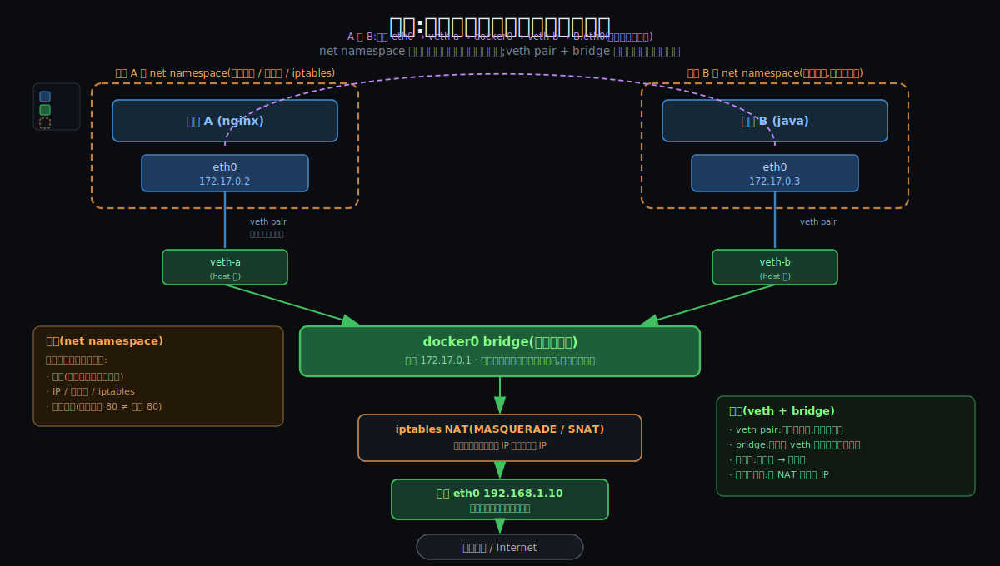

- **veth pair** —— 一对虚拟网卡,像一根网线的两头:一头(`eth0`)在容器的 net namespace 里,另一头(`veth-xxx`)在宿主上。
- **bridge(docker0)** —— 一台虚拟交换机,把所有容器的宿主端 veth 插在一起。**同一个网桥上的容器天然在同一网段(172.17.0.0/16),二层直接互通**(容器 A 找容器 B,包全程不出宿主机)。
- **出外网** —— 包经 docker0 → 宿主 eth0,中途被 **iptables NAT(MASQUERADE)** 把容器私网 IP 改写成宿主 IP。

> 这就是你关心的"容器间隔离 + 互通":**隔离来自 net namespace,互通来自 veth + bridge,出网来自 NAT**。每一跳内核里怎么转包,留到后面钻。

### §4.3 区③ 出生流水线:你敲的命令怎么变成容器

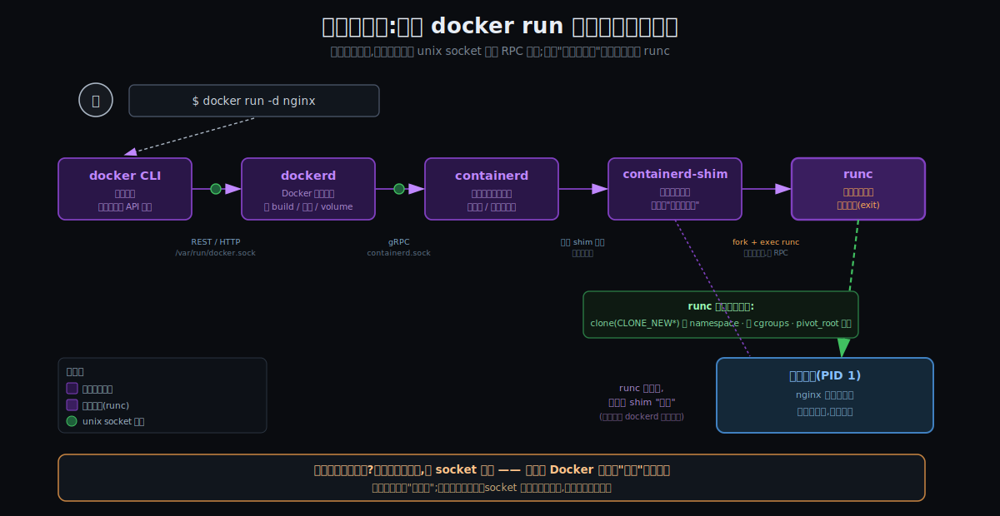

四个角色接力,层与层之间靠 **unix socket 上的 RPC** 说话:

| 角色 | 是什么 | 怎么通信 |
|------|--------|---------|
| **docker CLI** | 人机交互,把命令翻成 API 请求 | → 走 REST/HTTP,经 `/var/run/docker.sock` |
| **dockerd** | Docker 守护进程,管 build / 网络 / volume | → 走 gRPC,经 `/run/containerd/containerd.sock` |
| **containerd** | 容器生命周期管理(拉镜像、管状态) | → 创建 containerd-shim |
| **containerd-shim** | 每容器一个的"常驻监护人" | → fork+exec runc(跑一个程序,不是 RPC) |
| **runc** | 真正砌墙的人:调内核三件套 `clone(CLONE_NEW*)` 建 namespace + 写 cgroups + `pivot_root` 换根,**干完就 exit** | 退出后,容器被 shim "收养" |

> 两个值得记住的架构事实:① **真正动内核砌墙的只有 runc,而且用完即退**;② 容器被 shim 收养,所以**重启 dockerd 容器不会死**。"为什么要拆这么多层 + socket 上报文长什么样",留到后面 —— 这也是 Docker 后来被 containerd/runc"拆解"的伏笔。

### §4.4 区④ 存储:易失的根 ⨯ 持久的卷

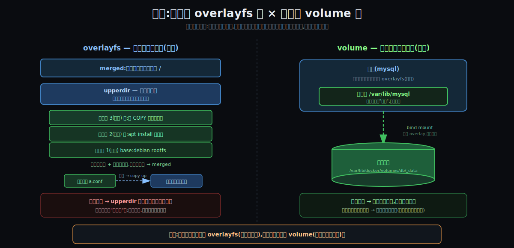

- **overlayfs(易失)** —— 容器的根 `/` 是**叠**出来的:底下若干**镜像只读层**(`lowerdir`,层间可复用、可缓存),最上面一个**容器可写层**(`upperdir`),合并成容器看到的 `merged`。改一个只读层里的文件会触发**写时复制(copy-up)**:先复制到可写层再改。**容器删除 → 可写层连同所有写入一起蒸发。**
- **volume(持久)** —— 在墙上"凿个洞":把容器里某个目录(如 `/var/lib/mysql`)**bind mount** 到宿主的持久存储(`/var/lib/docker/volumes/...`),绕过 overlay 直接落盘。**容器删除 → 卷还在,新容器挂上即恢复。**

> 口诀:**无状态的东西交给 overlayfs(随容器生死),有状态的数据挂 volume(独立于容器活着)。** 数据库为什么必须挂卷,这一对就解释清楚了。overlay 的 CoW 内核实现细节,留到后面钻。

**💡 overlayfs 的生活类比 —— 不是"日历",是"一摞透明胶片":** "日历"只接住了一面(可写层像一页页累积变化),漏了 overlayfs 最值钱的三个性质:**分层、只读复用、写时复制**。更准的类比是**一摞透明胶片(老式投影片,或想成 PS 图层)**:

- 底下几张是**预先印好、只读**的片(镜像层:debian 根 + apt 依赖 + 你的代码);
- 最上面扣一张**空白透明片**,你只在这张写(容器可写层);
- 从上往下看,叠起来就是完整画面(容器看到的 `/`);
- 想改下面印好的字?擦不掉,只能在顶片上**盖着写**(= **写时复制 / whiteout**);
- **十个容器共用同一摞底片**,各扣一张自己的顶片(= 镜像层复用 → **秒级启动 + 省空间**的根源);
- 扔掉顶片,底下那摞还干净,给下一个用(= 容器删除,可写层蒸发,镜像层不动)。

> 一句话:日历是"一本账"(单层、只累积);overlayfs 是"一叠可共享的透明片"(多层、可复用、改时才复制)。

### §4.5 墙是漏的:一个 512MB 容器,为什么自报 64GB?

做个实验,把"墙(namespace)"和"表(cgroups)"彻底分开看:

> 用 cgroups 限死容器最多用 **512 MB** 内存,宿主有 **64 GB**。在容器里敲 `free -m` —— 它报的"总内存"是 512 MB 还是 64 GB?

**答案:64 GB(宿主的),不是 512 MB。**

为什么?因为**两道墙是独立的,而且 namespace 这道墙有缝**:

- `free -m` 读的是 **`/proc/meminfo`**,而 `/proc/meminfo` **根本没被 namespace 隔离**(内核里没有"meminfo namespace")。容器透过这扇**没磨砂的窗**,看到的是**宿主的全局内存**。
- cgroups 的 512 MB 限制**真实存在**,但它只管"**用量**"(用超了 OOM kill),不改"**视图**"。于是容器**看见** 64 GB,却**只能用** 512 MB。

**这正是坑过无数人的"容器里 JVM / Node 自杀"事故:**

- 老 JVM 按 `/proc/meminfo` 估堆:看见 64 GB → 默认最大堆设到十几 GB → 一涨过 512 MB → 被 cgroups OOM kill。容器莫名其妙反复重启,日志还看不出原因。
- 同理 `/proc/cpuinfo` / `nproc` 也没 namespace 化:Node 线程池、JVM 的 GC 线程数会按**宿主全部核数**开,在小容器里直接打爆。

**怎么治:**

- 真正的限额在**另一个路径**:`/sys/fs/cgroup/memory.max`(v2)。应用得知道去**那儿**读,而不是信 `/proc/meminfo`。
- 现代 JVM(JDK 8u191+ / 10+)默认 `-XX:+UseContainerSupport`,会自动读 cgroup 限额;
- 或用 **LXCFS** 伪造一个反映 cgroup 的 `/proc/meminfo`,骗老程序看到正确的数。

**用我们的类比说:** 水表(cgroups)给你限了 512 升/天,但墙上那个**水位计(`free` / `/proc/meminfo`)显示的是全楼 64000 升的总水箱**。你信了水位计,开 party、把龙头开到底 —— 结果水表在 512 升处"咔"一声给你掐了(OOM)。**"仪表显示的"和"你真被允许的"对不上,就是这个 bug 的全部。**

> 这个实验最大的价值,是逼出下一个问题:**墙不是免费的,也不是完美的。** 它有缝(`/proc` 没全隔离)、有代价(隔离和限额都要内核记账)、有取舍(强隔离 vs 轻量)。"为什么非要砌这些墙、每道墙换来什么、又付出什么" —— 这正是下一段要钉死的事。

---

## §5 关键词速查表

后面所有阶段都会反复用到这些词,先混个脸熟(每个一句话,不展开):

| 术语 | 一句话说明 |
|------|-----------|
| **容器 container** | 镜像跑起来的实例 = 一个被内核圈起来的普通进程 |
| **镜像 image** | 打包好的只读 rootfs + 元数据,是容器的"模板" |
| **镜像层 layer** | 镜像由多层只读层叠成,层间可复用、可缓存(秒级启动的根) |
| **namespace** | 隔离"看得见什么";6 类(pid/net/mnt/uts/ipc/user) |
| **cgroups** | 限制"用得了多少";CPU / 内存 / IO 配额 |
| **overlayfs** | 把镜像只读层 + 容器可写层叠成一个 `/`(联合文件系统) |
| **volume** | 挂宿主持久存储的数据卷,独立于容器生死 |
| **veth pair** | 一对虚拟网卡,一头在容器、一头在宿主 |
| **bridge / docker0** | 虚拟交换机,把容器们连在同一网段 |
| **dockerd** | Docker 守护进程,管 build / 网络 / volume |
| **containerd** | 容器生命周期管理守护进程(事实标准运行时) |
| **runc** | 按 OCI 规范真正调内核砌墙的工具,用完即退 |
| **OCI** | 容器开放标准(镜像格式 + 运行时规范) |
| **registry** | 镜像仓库(Docker Hub 等),`push` / `pull` 镜像 |

---

## §6 它在技术栈里的位置(上下左右的邻居)

容器不是孤立的,它**夹在内核和编排之间**:

```
        ┌─────────────────────────────────────────────┐
 上面    │  编排 / 平台:Kubernetes(经 CRI 调 containerd)│   ← 谁在用容器
 (谁用它)│  CI/CD · PaaS · Serverless                   │
        └───────────────────┬─────────────────────────┘
                            │ CRI / Docker API
        ┌───────────────────┴─────────────────────────┐
 这一层   │  Docker 引擎 dockerd                          │
 (容器栈) │   └ 容器管理 containerd                       │   ← 本节的主角们
        │       └ OCI 运行时 runc                       │
        └───────────────────┬─────────────────────────┘
                            │ clone / setns / cgroups / pivot_root
        ┌───────────────────┴─────────────────────────┐
 下面    │  Linux 内核:namespace · cgroups · overlayfs   │   ← 能力的真正来源
 (它依赖谁)│           · netfilter/iptables · veth         │
        └─────────────────────────────────────────────┘

 平行(同物种,后面对比会用到):
  · 运行时:crun / gVisor / Kata Containers
  · 工具链:podman / buildah(无 daemon)
  · 标准:OCI(镜像+运行时)、CRI(K8s↔运行时接口)
```

三句话记住位置:

- **下面是内核** —— 容器的全部能力(墙、网络、文件系统)都是内核给的,容器自己不造能力。
- **它这一层是"管理 + 标准化"** —— dockerd/containerd/runc 把内核能力包装成"镜像、容器、`docker run`"这套好用的抽象。
- **上面是编排** —— 单机几个容器靠 Docker,成百上千台机器上调度容器靠 Kubernetes(它绕过 dockerd,直接经 CRI 调 containerd)。

---

## §7 呼应灵魂问题:这一节闭环了多少

你的灵魂问题有三问,这一节的战果:

| 灵魂问题的三问 | 这一节的交付 | 闭环度 |
|--------------|------------|-------|
| ① 容器到底是什么? | **答了**:一个被内核圈起来、自以为独占机器的普通进程 | ✅ 基本闭环 |
| ② 和虚拟机的根本区别? | **答了**:区别只在一层 —— 谁拥有内核(VM 自带 / 容器共用) | ✅ 基本闭环 |
| ③ 跑起来时内核里到底发生了什么? | **只摆了位置**:namespace/cgroups/overlayfs/veth 各在哪、各管啥;但"内核里逐步发生什么"的**机制**还没钻 | 🟡 约 30% |

**留白(留给后面的旅程):**

- 三道墙的内核实现:`clone()`/`unshare()`/`setns()` 怎么建 namespace、cgroups 怎么计账、overlay 的 copy-up 怎么发生 —— 先到"**为什么必须存在**"建一份约束清单,再到"**怎么工作**"逐个钉死。
- 网络逐跳转包、unix socket 上 RPC 的报文、镜像分层凭什么做到秒级启动 —— 同样留到后面用更密的图往死里抠。
- Docker 为什么后来被自己拆成 containerd/runc/OCI(你重心里的"演化派"尾声)—— 留到讲"它怎么来的"和收尾。

> 一句话收口:**这一节给了你一张完整的地图,标了每个地洞的坐标。接下来我们不再"摆位置",而是挑洞往下钻 —— 从"为什么非要有这些墙不可"开始。**

---

## 修订记录

| 时间 | 修订摘要 | 触发原因 |
|------|---------|---------|
| 2026-06-03 | 初稿:四区骨架(带墙的进程 / 网络 / 出生流水线 / 存储)+ 6 张 SVG + 公寓类比 | 对齐收敛后首次生成 |
