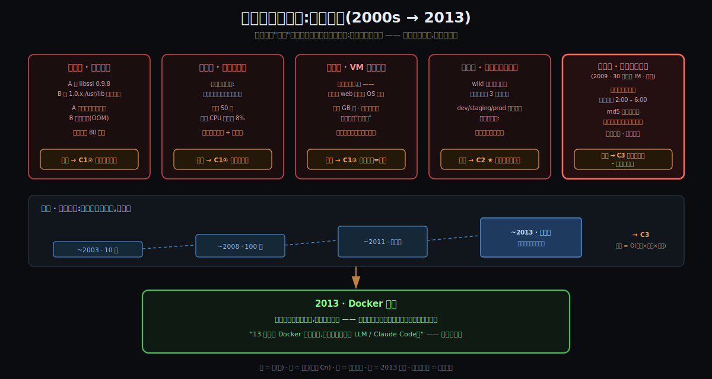
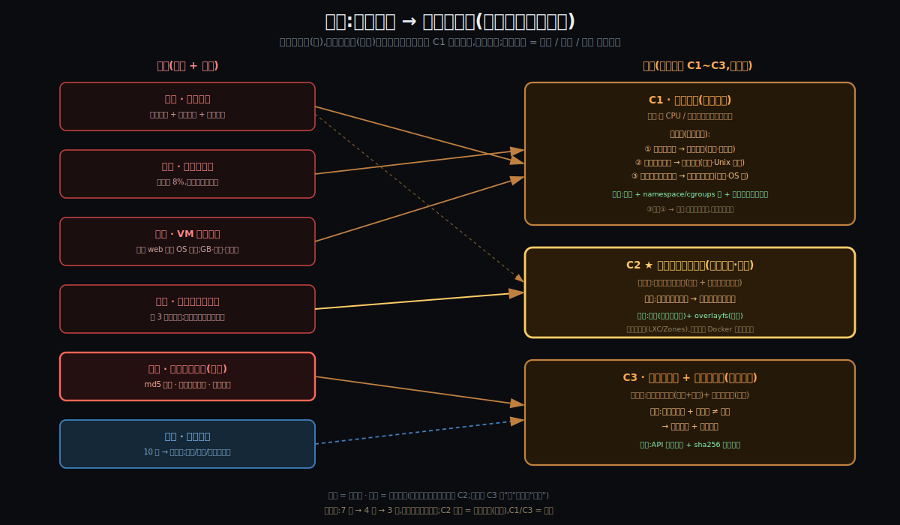
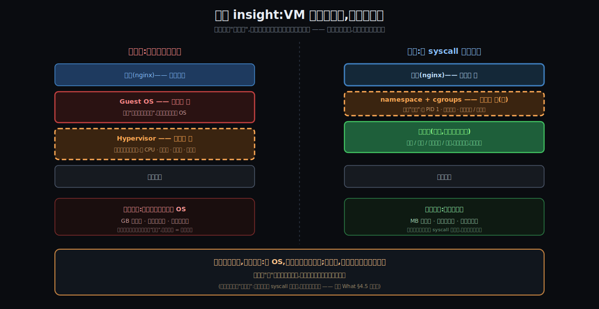

# 阶段 2:Docker / 容器为什么必须存在

> **灵魂问题(贯穿全程):** 容器到底是什么?它和虚拟机的根本区别在哪?当一个容器真正跑起来的那一刻,Linux 内核里到底发生了什么 —— namespace、cgroups、镜像分层各自扮演什么角色?
>
> **这一节的本分:** 上一节我们钉死了"容器是什么"(一个被圈起来的进程)和"它不是什么"(不是虚拟机)。但还差一个更根本的问题:**为什么非要有这个东西?** 本节先回到**没有容器的世界**,把痛一幕一幕演出来(痛点驱动,你选的路),再做尸检 —— 从五幕痛史里反推出一份**不可再分的硬约束清单(C1~C3)**。这份清单是后面所有讨论的脊梁:以后讲到任何机制,我们都会回头指着说"这是 C1 + C2 逼出来的",而不是"设计者喜欢这样"。

---

## §0 序幕:规模浪潮(贯穿五幕的暗线)

进五幕之前,先把舞台背景立起来,因为它是把所有痛从"难受"升级成"绝路"的那个变量:

**web 应用大规模集群的时代来了。** 2003 年一个网站背后可能是 10 台服务器;2008 年,百级;2011 年之后,几百几千台成为常态。而与此同时 —— **人没有变多,人也变不多**。

- 10 台机器:人肉运维,痛但能扛
- 100 台:勉强,靠堆人、堆值班、堆流程
- **几百几千台:彻底不可能** —— 手工运维的成本是 **O(机器数 × 环境数 × 发布频率)**,三个因子全在涨,而人的速度和正确率是常数

不只是部署:**监控、升级、审计**在这个尺度上连"对象"都找不到 —— 每台机器都长得不一样,你审计什么?这条暗线会在第五幕汇入主剧情,并直接喂出 [C3](#c3--发布必须去人化且机器可验真)。

---

## §1 没有它的世界:五幕痛史

> 五幕在历史上就是按这个顺序连环爆的:每一幕的"解法"制造出下一幕的"痛",直到约束全部暴露,只剩一个形状能活 —— 那个形状就是容器。

### §1.1 第一幕 · 裸机合租(2000s 前中期)

一台 8 核 16G 的服务器,跑两个应用,省钱省事。然后:

- **依赖打架。** 应用 A 是个老 PHP 站,要 `libssl 0.9.8`;应用 B 新上,要 `1.0.x`。可 `/usr/lib/libssl.so` **只有一个位置**。装 B 时升级了 libssl → A 当晚段错误。同样的戏码在 Python 2.4 vs 2.6、JDK 5 vs 6、glibc 之间反复上演;工程师开始往 `~/.bashrc` 里塞 `LD_LIBRARY_PATH` 黑魔法,每台机器的环境变量都长成了化石层。
- **资源践踏。** A 有个内存泄漏,一夜吃光 16G → 内核 OOM killer 出场随机杀人 → **B 无辜陪葬**。或者 A 凌晨跑批,磁盘 IO 拉满 → B 的在线接口延迟从 10ms 飙到 2s。这就是教科书上的 noisy neighbor —— 公地没有围栏。
- **全局命名冲突。** A 和 B 都想监听 80;crontab、`/tmp`、`/var/log` 全是公地,谁都能踩谁。

**病根:** 同一个内核上,进程**天生共享一切** —— 一个文件系统、一个端口空间、一个资源池。Unix 设计如此,没有"我的"和"你的"。(→ [C1](#c1--榨干硬件必须共享必须隔离隔离必须便宜) 子事实②"共享默认互害";依赖打架那一刀还同时喂 [C2 ★](#c2---环境必须跟应用走你点的核心))

### §1.2 第二幕 · 一机一应用

被合租坑怕了,运维定了铁律:**一个应用一台物理机**,物理隔离,天下太平。然后财务来了:

- 机房 50 台服务器,平均 CPU 利用率 **5~10%**。一台机器 90% 的生命在空转,但电费、机架费、折旧、维保照付。
- 上新应用要采购新机器:审批 → 采购 → 上架 → 装机,周期**以周计**。
- 业务一扩张,这套打法的账单按应用数线性涨 —— 而其中九成的钱买的是"空转"。

**病根:** 隔离的最小单位被钉死在"一台物理机",**粒度太粗、太贵**。CPU 和内存没有用于用户计算,用于了空转。经济账逼着你必须回去合租 —— 于是又掉回第一幕。死循环。(→ [C1](#c1--榨干硬件必须共享必须隔离隔离必须便宜) 子事实①"闲置是浪费" —— 正是它堵死了逃离合租的退路)

### §1.3 第三幕 · VM 救场,但太重(2008 前后,亲历)

虚拟化(VMware / Xen / KVM)登场,合租问题解了:每个应用一台 VM,隔离是真隔离,还能整机快照。**但是 ——**

> **亲历版:** "以前都是用虚拟机来搭环境(VMware)。最大的痛点:**镜像太大、启动太慢**。为了搭一个小小的开发环境、跑一个 web 服务器,**可能要从操作系统开始搭** —— 时间成本、空间成本太大了。"

把这段痛展开成数字:

- **从 OS 开始搭**:建 VM → 装 OS(几十分钟)→ 打补丁 → 配运行时 → 才轮到部署你真正关心的那个 web 服务。你要的是车间,但 VM 强迫你先盖厂房。
- **镜像 GB 级**:一个 CentOS 模板 2~10 GB。拷一份环境 = 拷一栋楼。
- **启动分钟级**:Guest OS 完整 boot 一遍,BIOS → bootloader → 内核 → init → 服务。
- **内核税**:每台 VM 几百 MB~GB 内存先交给 Guest OS 自己用,一台物理机塞十几二十台就到顶。
- **CI 场景雪上加霜**:每跑一轮测试起一台干净 VM?等到心死。于是大家复用"脏"环境 → 测试结果开始不可信。

**病根:** 隔离是有了,但隔离的**代价本身变成了新的浪费** —— 每户陪一套 Guest OS,把合租省下来的 CPU / 内存又吐了回去。(→ [C1](#c1--榨干硬件必须共享必须隔离隔离必须便宜) 子事实③"隔离太贵同样是浪费")

### §1.4 第四幕 · "在我机器上能跑"

与此同时,另一条战线上的痛在发酵 —— **环境是手工配出来的**:

- wiki 上三页《环境搭建文档》,新人照着配 **3 天**,还配不对 —— 因为文档永远落后于现实。
- dev 是 macOS + Python 2.7.10,staging 是 CentOS 6 + 2.6.6,prod 是 CentOS 5 + 2.4.3。代码在 dev 跑得好好的,上去就崩。"**在我机器上能跑**"成为整个行业的甩锅语。
- **雪花服务器**:每台机器被历任运维手工 patch 过,没有两台一样;重装一台老机器 = 考古工程,没人敢动。

**病根:** "环境"不是一个**工件**,而是一段**历史** —— 它长在机器上(`/usr/lib`、`/etc`、`$PATH`),是机器的属性而非应用的属性。所以不可复制、不可审计、不可回滚。(→ [C2 ★](#c2---环境必须跟应用走你点的核心))

### §1.5 第五幕 · 2009,凌晨两点的人肉对账(压轴 · 亲历)

> **场景:** 同时在线 30 万人的 IM 应用,分布式集群,**几十台机器对称部署**。发布窗口:**凌晨 2:00 – 6:00**(低峰期)。

那四个小时里发生的事:

1. 逐台机器分发新程序包;
2. **逐台手动核对 md5** —— 这是当年唯一能确认"这台机器上的包版本是对的"的手段;
3. 还不放心(md5 也可能对错表)?**拿反编译工具把二进制拆开,肉眼确认新功能的代码真的在里面**;
4. 逐台重启、反复校验、反复测试,确保版本是对的;
5. 盯监控到天亮 —— **上线失败靠人盯出来,回滚靠人手撤** —— 费时费力,效率低。

最怕的两种死法:**看错一个 md5** → 某台机器跑着旧版本 → 集群行为不一致 → 白天出现"只有部分用户复现"的诡异 bug;**机器环境有差异** → 同一个包在某台上就是起不来 → 上线失败。

这一幕的病,比前四幕都深,因为它暴露了两个"那个时代根本没有的东西":

- **部署工件没有身份。** "这台机器跑的是什么版本"**无法被机器证明,只能被人证明**。验证手段穷尽到反编译,说明系统层面完全不存在"工件身份"这个概念 —— 文件名和文件内容之间,没有任何可信绑定。(→ [C3](#c3--发布必须去人化且机器可验真) 的"字节无身份"子事实)
- **部署是过程,不是工件。** 一轮发布 = 一长串由人执行的步骤;步骤不可复制、不可测试、不可审计。几十台尚且要 4 小时 × 多名工程师,**而暗线正在涌来:几百台、几千台呢?** 人肉模式在数学上被判了死刑。(→ [C3](#c3--发布必须去人化且机器可验真) 的"人力"子事实;"过程 vs 工件"本身是 C2+C3 的合成症状,见 §2 末注)

五幕落幕。2013 年,Docker 出现 ——

> **"当我 13 年看到 Docker 的时候,非常兴奋,不亚于现在看到 LLM / Claude Code 等 AI 工具的出现。"** —— 本篇主人公

为什么一眼就兴奋?因为外面站着一整代**身上带着全部五幕伤疤**的工程师 —— 他们不需要被说服,Docker 的每一刀都砍在自己疼了十年的地方。(这句话背后的历史,留给"它怎么来的"那一节展开。)

---

## §2 尸检:不可再分约束清单(C1~C3)

**收编史(这份清单是你亲手磨出来的):** 初稿立七条 → 你第一刀收编为四条(七桩事实降级为子事实,一桩不丢)→ 你第二刀指出"合租互害"与"单位降级"同根(都源自资源效率),合并定格为 **3 条主压力**。每条主压力 = 一股不可再分的逼迫。判定标准不变:**写不出"不可再分性"的,不配进清单**(那些去了 §5 伪约束)。**自此 C1~C3 冻结** —— 下一站起,每个机制都挂在这三个编号上。

| # | 主约束(压力) | 来源 | 不可再分性 |
|---|--------------|------|-----------|
| C1 | 硬件必须高效用于用户计算(榨干硬件) | 经济现实 + Unix 语义 + OS 结构 | 三桩子事实各自不可再分:账单是物理的;全局命名是 40 年生态;完整 OS 的体积/时序是客观的 |
| C2 ★ | 环境必须跟应用走(**核心**) | FHS / 动态链接生态 | 应用 = 二进制+libs+配置,散落全局路径;不打包就永远是机器属性 |
| C3 | 发布必须去人化,且机器可验真 | 规模浪潮 + 存储语义 | 人不可并行复制;文件名≠内容,不引入内容寻址只能人肉对账 |

每条展开(后面所有讨论引用的"原文"):

#### C1 — 榨干硬件:必须共享,必须隔离,隔离必须便宜
**主张**(用你的原话):必须高效利用硬件资源,**让 CPU / 内存更多地用于用户计算** —— 而不是闲置(空转)、打架(互害)、或供养系统自身的开销(Guest OS 税)。
**这一股压力推出一条三连锁,每环背后一桩不可再分的子事实:**
1. **闲置是浪费 → 必须加大共享**(子事实·经济账,幕二:独占利用率 5~15%;折旧+电费是物理账单)
2. **共享默认互害 → 必须隔离**(子事实·Unix 语义,幕一:文件系统/端口/PID 全局命名 + 资源先到先得 —— 40 年生态,改不动应用,只能改"视图")
3. **隔离太贵同样是浪费 → 隔离必须便宜**(子事实·OS 结构,幕三:完整 OS 是重资产 —— GB 镜像/分钟启动/内存税,每户陪一套 Guest OS 等于把省下的又吐回去)
**链条自洽校验**:第 3 步咬回第 1 步 —— 用重隔离(VM)满足效率,违背逼出共享的那股原始压力。**这是一条压力的闭环,不是三条约束的拼凑。**
**口诀**:榨干硬件 → 必须共享 → 必须隔离 → 隔离必须便宜
**逼出**:合租(前提)+ namespace/cgroups(墙)+ 共享内核不带厂房(便宜的隔离)

##### C1③ 的隐藏前提:内核接口是"国标插座"(验收问答凝固)

C1③ 说"厂房不进行李"。一个尖锐的追问:目的地厂房的内核版本和你构建时**并不相同**(Ubuntu 22.04 / 内核 5.15 上构建,CentOS / 内核 4.18 上运行)—— 凭什么车间照样能跑?**不是因为"各家设施统一"(它们明明是不同版本),而是三个性质合起来:**

1. **窄** —— 容器的行李里装着自己的全套用户态(**连 glibc 都自带**,不用宿主的),它和宿主的**唯一接触面**只剩系统调用接口:几百个 syscall,整个技术栈里**最窄的那道腰**。接触面越窄,要保持兼容的东西越少。
2. **稳** —— Linux 内核开发的铁律,Linus 执行了三十多年的原话:**"We do not break userspace"** —— 旧 syscall 的语义永不更改、永不删除,只往后**追加**。**国标插座只加新孔,不改旧孔** —— 2009 年出厂的电器,插今天的插座照样亮。
3. **单向** —— 新内核跑旧用户态 ✓(向后兼容);**反过来不保证**:程序若用了 `io_uring`(内核 5.1 才有的新孔),搬到 4.18 的老厂房就是 `ENOSYS`(查无此插孔)。可移植的精确表述:**目的地内核版本 ≥ 你用到的最新插孔**。

**一分钟手验**:`docker run ubuntu:22.04 uname -r` —— 看到的是**宿主的内核版本**,不是 ubuntu 的。镜像里那个"ubuntu"只是 ubuntu 的用户态衣服(glibc / bash / apt),不是 ubuntu 的内核。

> 这份"国标"不是物理定律,是一份**坚持了三十多年的社会契约** —— C1③ 敢成立,全押在它身上。它也是下一站钻机制的第一个洞口:**namespace 的谎言,恰恰就撒在这个接口上。**

#### C2 ★ — 环境必须跟应用走(你点的核心)
**主张**:"环境"天然是机器属性(libs / 配置长在全局路径),不把它整体打包成应用的行李,一致性就永远靠人肉装修。
**子事实**(幕四 + 幕一的依赖打架):FHS / 动态链接生态几十年,应用无法独立于环境存在 —— 除非把环境跟着应用一起带走。
**口诀**:环境是机器属性 → 必须打包跟应用走
**逼出**:镜像(不可变行李)+ overlayfs(分层叠放)
**为什么它配"核心"二字**:墙(namespace/cgroups)在 Docker 之前**早已存在**(LXC、Zones)—— 这条约束指向的,才是 Docker 真正的发明;但注意,它单独存在只能逼出"AMI / 整机模板"(行李里连厂房一起装),必须叠加 C1 的第 3 环(隔离必须便宜 → 行李里不装 OS)才坍缩成"容器镜像"这个形状。**C2 是心脏,C1/C3 是骨架。**

#### C3 — 发布必须去人化,且机器可验真
**主张**:千台规模下,人必须退出发布链路;而机器接管的前提是 —— **工件的身份能被机器证明**。
**子事实**(各自不可再分):
- **人力不随规模扩展**(幕五 + 暗线):人的速度/正确率是常数,成本 O(台数 × 环境 × 频率) → 几十台 × 凌晨 4 小时已是极限;
- **字节没有自带身份**(幕五):文件可原地改、名字可复用 → 验证只能外部对账,穷尽到人肉 md5 与反编译。
**口诀**:人不能扩容 + 文件名 ≠ 内容 → 机器接管 + 哈希验真
**逼出**:API 化的运行时流水线 + 镜像内容寻址(sha256 digest)

> **注(过程 vs 工件):** 第五幕里"部署是一长串不可复制的步骤"这个痛,**不单列为约束** —— 它是 C2(环境长在机器上,所以只能用步骤去"凑"环境)+ C3(步骤由人执行、结果无法机器验证)的**合成症状**。把它拆开归位而不是单列,这正是"不可再分"这把刀的用法。

---

## §3 核心 insight(两枚)

三条压力摆在桌上,2013 年那个引爆世界的答案,浓缩成两句话:

### §3.1 Insight 一:VM 骗操作系统,容器骗进程

隔离的本质是**撒谎术** —— 让住户以为"整个世界就我一个"。问题只在:**对谁撒谎,在哪一层撒谎。**

- **VM 在硬件接口撒谎**:伪造一台完整机器(假 CPU、假网卡、假磁盘),被骗者是 **Guest OS**。为了圆这个谎,你必须陪进一整套真 OS —— 假机器必须像真机器一样完整。谎言成本 = 一台机器(GB · 分钟 · 内存税)。
- **容器在 syscall 接口撒谎**:进程本来就只透过系统调用看世界,那就只改"答案" —— 假 PID 1、假主机名、假独占的 `/` 和网卡。被骗者是**进程**。谎言成本 = 几张记账表(MB · 毫秒 · 近零税)。

> **被骗者越低级,骗局越贵:骗 OS 要造整台假机器;骗进程只要改它看到的答案。容器的"轻"不是压缩出来的,是换了一个更便宜的被骗者。**

一句话形式:**用"骗进程"换"骗 OS"** —— 同样的隔离体验,成本掉三个数量级。这枚 insight 整个就是对 [C1](#c1--榨干硬件必须共享必须隔离隔离必须便宜) 的回答:墙是第 2 环要的谎言,"便宜"是第 3 环逼的撒谎层次。它同时解释了弱隔离:谎言只盖住 syscall 的答案,盖不住内核本身 —— 上一节 §4.5 那条 `/proc/meminfo` 的缝,正是谎没撒全的地方。

### §3.2 Insight 二:环境是行李,不是地产

第四、五幕的病根,是"环境"被当成了**地产** —— 长在机器上,搬不走,只能在每台机器上重新"装修"一遍(手工配置),装出来的还都不一样。

容器的第二刀:**把环境从机器上整体剥下来,打进应用的行李箱。**

- 应用 + 它的全部依赖(libs / 运行时 / 配置)封进**一个不可变的镜像** —— 环境从"机器的属性"变成"应用的行李"(化解 [C2 ★](#c2---环境必须跟应用走你点的核心));
- 行李箱自带**内容寻址的身份**:`sha256:9f3a...` —— 拉到的要么是分毫不差的那份字节,要么直接失败。**2009 年用反编译器干的活,被一个哈希值替代了**(化解 [C3](#c3--发布必须去人化且机器可验真) 的"字节无身份");
- 行李是标准化工件,机器能搬、能验、能数 —— 部署从"人执行的过程"变成"机器搬运的工件",人力从 O(N) 里解放(化解 [C3](#c3--发布必须去人化且机器可验真) 的"人力")。

一句话形式:**用"把环境打包跟应用走"换"环境永远一致"** —— 部署单位从厂房降到车间,且每个车间自带身份证。

---

## §4 两枚 insight 怎么化解三条约束(回扣 + 通往机制)

| 约束 | 被哪枚 insight 化解 | 化解成什么形状(上一节已见) | 机制细节(后面钻) |
|------|--------------------|---------------------------|------------------|
| C1 榨干硬件 | Insight 一(骗进程) | namespace 六扇窗 + cgroups 配额表 + 共享内核不带厂房 | `clone(CLONE_NEW*)` 怎么建视图;cgroup v2 怎么计账;为什么 syscall ABI 稳定到敢共享内核 |
| C2 ★ 环境随行 | Insight 二(行李) | 镜像 + overlayfs 叠出来的根 | 分层 / copy-up / whiteout 细节 |
| C3 去人化+验真 | Insight 二(行李) | 出生流水线(API 化)+ sha256 digest | dockerd/containerd/runc 解耦;层哈希怎么算、digest 怎么校验 |

读这张表的方法:**每一行都是一次"约束 → 必然"的单向推导** —— 不是"Docker 选择了 namespace",而是"C1 之下,除了给进程造假视图,没有别的活路"。下一节(怎么工作)就按这张表逐行往机制里钻。

---

## §5 伪约束:别把这些错怪到本质上

尸检还要排除几个"看起来像病根,其实不是"的嫌疑人 —— 它们写不出"不可再分性":

| 伪约束 | 为什么不成立 |
|--------|-------------|
| "裸机性能不够" | 性能从来不是痛点 —— 裸机性能一直最好。痛的是隔离、复制、一致性,不是速度。 |
| "VM 的隔离不够强" | 恰恰相反,VM 隔离**更强**(容器反而更弱)。痛点是隔离的**代价太重**(违背 C1 第 3 环),不是不够强。 |
| "工程师不够细心 / 流程不够严" | 第五幕不是态度病,是结构病:没有机器可校验的事实,再细心的人在千台尺度也是 O(N) 错误率。**用流程对抗结构性缺陷,是用人肉填系统的坑。** |
| "缺一个更好的配置管理工具"(Puppet / Chef 路线) | 它们把"配机器"自动化了,但环境仍是**机器属性**、靠"收敛过程"逼近期望状态 —— 治标。容器把问题反过来:环境跟应用走,机器退化成"任何一台都行"。(这条岔路和容器的对比,值得在对比环节专门打一架。) |

---

## §6 呼应灵魂问题

你的灵魂问题三问,这一节补上了"为什么"这个维度:

| 三问 | 上一节(是什么) | 这一节(为什么) |
|------|---------------|----------------|
| ① 容器到底是什么? | 一个被圈起来的进程 | **为什么非圈不可**:C1 第 1+2 环 —— 必须共享(经济账),共享默认互害 → 墙是必然,不是偏好 |
| ② 和 VM 的根本区别? | 谁拥有内核 | **为什么不能用 VM 的砌法**:C1 第 3 环 —— 隔离太贵同样是浪费;骗 OS 太贵,骗进程才付得起(Insight 一) |
| ③ 内核里到底发生了什么? | 摆了位置(六窗/表/叠层) | **为什么是这三样**:C1→namespace+cgroups+共享内核,C2★→镜像/overlayfs,C3→digest+流水线 —— §4 那张表就是每个机制的"存在许可证" |

累计闭环度:**约 50%**。已答:是什么、为什么必须存在、为什么是这个形状。未答(下一站"怎么工作"):`clone/unshare/pivot_root` 怎么一步步把墙砌出来、cgroups 怎么计账、overlay 怎么叠、veth 怎么通 —— 也就是"那一刻内核里**到底**发生了什么"的逐步机制。

---

## 尾声:2013,你看到 Docker 的那一刻

一个 2009 年在凌晨两点的机房里、用反编译器逐台核对版本的工程师,2013 年看到 Docker 时——

> **"非常兴奋,不亚于现在看到 LLM / Claude Code 等 AI 工具的出现。"**

现在你可以精确说出这份兴奋的来源:**三条压力、七桩事实,每一桩都疼过你,而它每一桩都给出了回答。** C1 → 墙,以及不带厂房的便宜隔离;C2 → 环境装进行李;C3 → 人退出发布链路、哈希替你对账。一个工具同时砍中你身上每一道旧伤 —— 这种事一个工程师一生遇不到几次。

(为什么偏偏是 2013?为什么是 Docker 而不是更早就存在的 LXC / Zones / jail?—— 这是"它怎么来的"那一节的主菜,先留个钩子。)

---

## 修订记录

| 时间 | 修订摘要 | 触发原因 |
|------|---------|---------|
| 2026-06-04 | 初稿:序幕(规模暗线)+ 五幕痛史(三/五幕含用户亲历:VMware 搭环境、2009 IM 凌晨发布)+ 七条约束清单 + 两枚 insight + 伪约束 + 3 张 SVG | 痛点驱动路线对齐收敛后首次生成 |
| 2026-06-04 | 约束清单收编 7→4(旧C3+C1+C2→新C1;旧C4→C2;旧C5→C3★;旧C6+C7→C4),七桩事实降级为子事实一桩不丢;C3 标★并补"心脏与骨架"论证 | 用户答"C5 是核心" + 要求精简为 4 条 |
| 2026-06-04 | 约束清单二次收编 4→3:原 C1(合租互害)+ 原 C2(单位降级)同根合并为新 C1「榨干硬件」三连锁(必须共享→必须隔离→隔离必须便宜,幕一二三恰好一幕一环);原 C3★→C2★,原 C4→C3;全文与两张图同步改号;**C1~C3 自此真冻结** | 用户指出 C1/C2 同根可合并,并要求 C1 命名更通俗(资源利用率角度) |
| 2026-06-04 | + C1③ 之下「内核接口是国标插座」小节:窄(唯一接触面=syscall)/ 稳(We do not break userspace)/ 单向(新内核跑旧用户态,反之 ENOSYS)+ `uname -r` 手验 | 用户答对验收探针(镜像不装内核)+ 第二问"统一抽象"精确化为"接口契约" |
