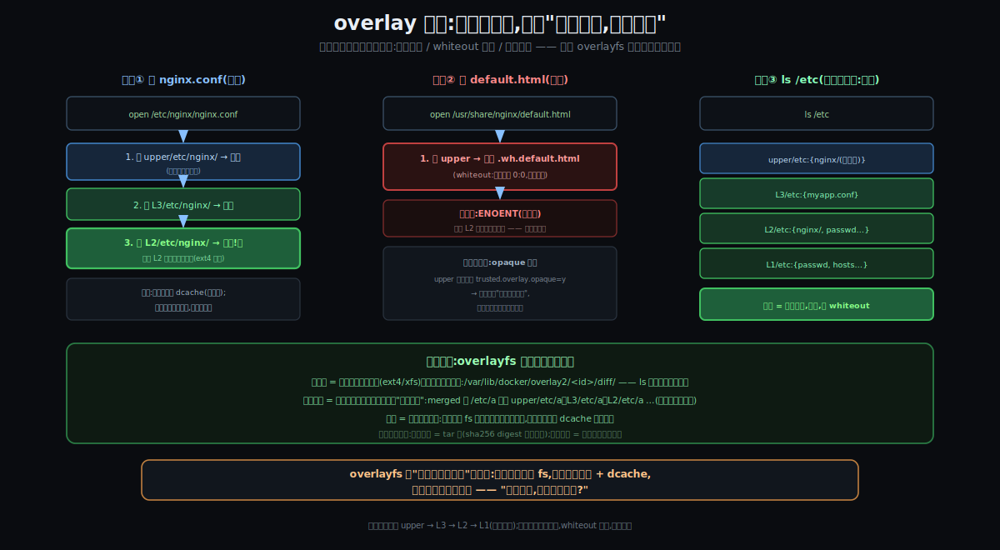
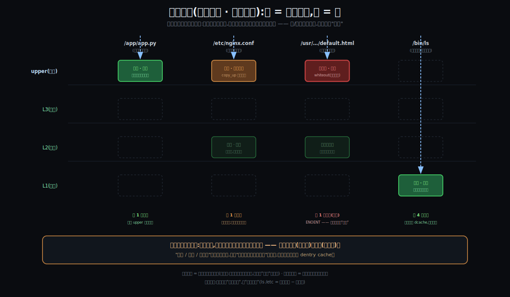
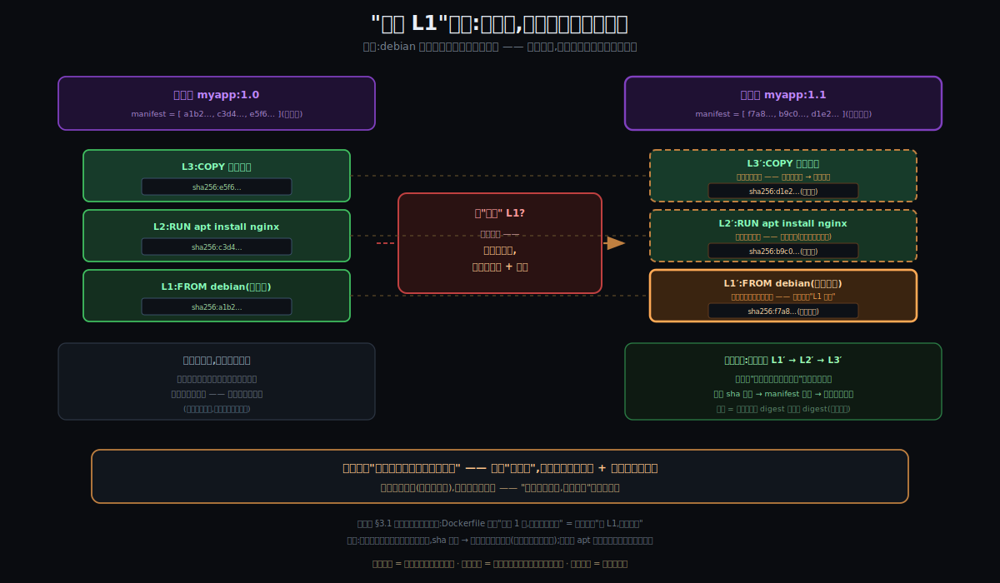
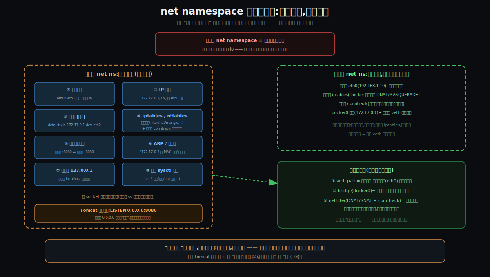
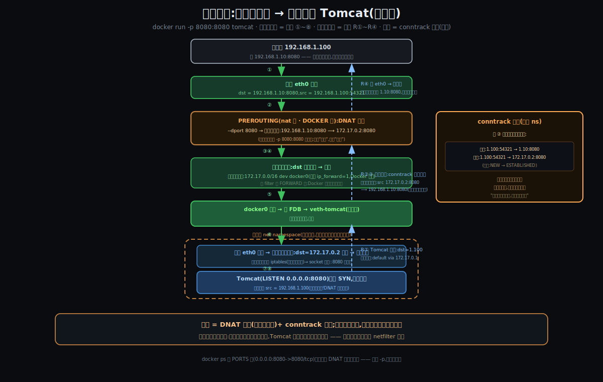
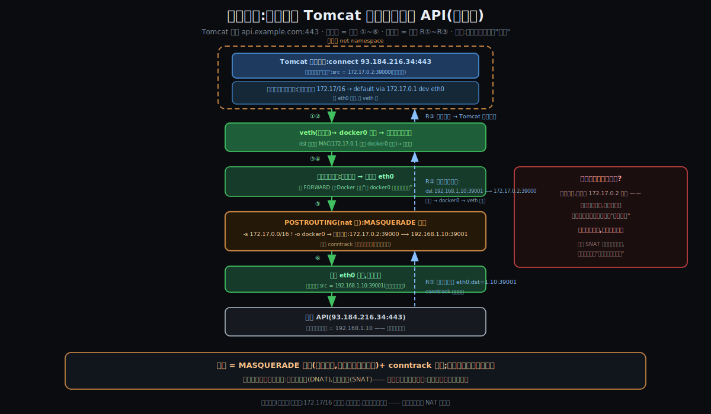

# 阶段 3:Docker 大致怎么工作

> **灵魂问题(贯穿全程):** 容器到底是什么?它和虚拟机的根本区别在哪?当一个容器真正跑起来的那一刻,Linux 内核里到底发生了什么 —— namespace、cgroups、镜像分层各自扮演什么角色?
>
> **这一节的本分:** 把上一节锻出来的三条压力(C1/C2★/C3),各自凝固成一件**看得见摸得着的机器**,然后看它们怎么协作。**全篇按"墙与洞"的主旨组织**(你在第一节锻的心法):§2 讲**墙**(六窗 + 三表),§3 讲**地板与洞一**(镜像/overlay 与存储),§4 讲**洞二**(网络),§5 讲**屋外的指挥部**(流水线),§6 用一次 `docker run` 把全部零件串成端到端。深度卡在机制级;数字级与源码级留给后面开膛的环节。

---

## 约束清单速查(C1~C3)

#### C1 — 榨干硬件:必须共享,必须隔离,隔离必须便宜
让 CPU / 内存更多用于**用户计算**。三连锁:①闲置是浪费 → 必须共享(经济账)②共享默认互害 → 必须隔离(Unix 语义)③隔离太贵也是浪费 → 隔离必须便宜(完整 OS 是重资产)。
**不可再分**:账单是物理的 / 全局命名是 40 年生态 / OS 体积时序是客观的。
**口诀**:榨干硬件 → 必须共享 → 必须隔离 → 隔离必须便宜

#### C2 ★ — 环境必须跟应用走(核心)
"环境"天然长在机器上(libs / 配置散落全局路径),不把它打包成应用的行李,一致性就永远靠人肉装修。
**不可再分**:FHS / 动态链接几十年生态,应用无法独立于环境存在。
**口诀**:环境是机器属性 → 必须打包跟应用走

#### C3 — 发布必须去人化,且机器可验真
千台规模下人必须退出发布链路;机器接管的前提是工件身份能被机器证明。
**不可再分**:人不可并行复制 / 文件名 ≠ 内容。
**口诀**:人不能扩容 + 文件名 ≠ 内容 → 机器接管 + 哈希验真

---

## §0 从"为什么"走到"怎么工作":三件事 + 全篇地图

上一节把"为什么必须存在"压成了三条压力。这一节的全部内容,就是三条压力各自凝固成的**三件机器**:

### §0.1 砌墙术 —— 从 C1 推出

因为 **C1②(共享默认互害)+ C1③(隔离必须便宜)** → 要解决"在同一个内核上,给每个进程一套'独占机器'的幻觉,且幻觉成本必须接近零" → 所以引入**砌墙术**:

- **namespace(改"看见什么")**:内核里每个进程的 `task_struct` 带一组 namespace 指针 —— 把指针指向不同的 namespace 对象,进程就"住进了不同的房间"。墙的物理实体就是**几个指针**,所以幻觉成本 ≈ 0。
- **cgroups(限"用多少")**:一棵树,每个节点(目录)是一个户头;进程上了户口,它的每一笔资源消费都记在户头上,触顶就处理。

这就是你那句"**把共享平面从 VM 级上抬到内核级**"的施工版:共享线以下(内核)一份,共享线以上(视图与配额)按指针分户。

### §0.2 叠行李术 —— 从 C2★ 推出

因为 **C2★(环境必须跟应用走)+ C1③(行李里不准装厂房)** → 要解决"环境整体带走、可共享、可秒启、还得轻" → 所以引入**叠行李术**:

- **不可变镜像层**:环境被切成一摞只读层(一条 Dockerfile 指令 = 一层),层一旦造好**永不修改** —— 像烧死的光盘 session(你的类比);
- **overlay 联合挂载**:运行时不解压,把只读层 + 一个空白可写层**挂**成容器的 `/` —— 毫秒完成,N 个容器共享同一摞底层。

### §0.3 流水线 + 验真术 —— 从 C3 推出

因为 **C3(发布去人化 + 机器可验真)** → 要解决"从命令到容器,全程机器执行;每个工件,机器能证明它是谁" → 所以引入**流水线 + 验真术**:

- **API 化运行时链**:`docker CLI → dockerd → containerd → shim → runc`,层层之间是 socket 上的 RPC —— 每一步都是 API 调用,**没有一步是人肉**;
- **内容寻址 digest**:每一层、每个镜像的身份 = 它内容的 sha256 —— 拉取时逐层验,**对不上直接拒收**。

### §0 结论:三件事对照 + 全篇地图(墙与洞)

| 三件事 | 是什么 | 为什么存在 |
|--------|--------|-----------|
| **砌墙术** | namespace(六窗,改视图)+ cgroups(三表,限用量) | C1:共享必互害 → 隔离;且隔离必须便宜 → 改指针而非造假机器 |
| **叠行李术** | 不可变镜像层 + overlay 联合挂载 | C2★:环境随应用走;且行李不装厂房 → 轻 |
| **流水线+验真** | API 化运行时链 + sha256 内容寻址 | C3:人退出发布链路;工件身份机器可证 |

**协作时序**(一次 `docker run` 里):**流水线指挥(③)→ 备行李(②)→ 砌墙(①)→ 住人。**

**全篇地图(按第一节心法"砌墙 + 凿洞"展开):**

| 章 | 在心法里是什么 | 内容 |
|----|---------------|------|
| **§2 墙** | namespace 六窗 + cgroups 表 | 六窗三刀、物理 vs 逻辑、三块表、OOM 行刑现场 |
| **§3 地板 + 洞一(存储)** | overlay 地板;volume 凿穿 mnt 墙 | 造 / 验 / 叠 / 写、光盘语义、方块模型、重铸、volume |
| **§4 洞二(网络)** | veth 凿穿 net 墙 | 孤岛八件家当、容器互访逐跳标层、进门 DNAT、出门 SNAT |
| **§5 指挥部** | 屋外的流水线 | 角色接力、runc 三连招、shim、验真闭环 |
| **§6 一次完整施工** | 全部零件串起来 | `docker run` 十步端到端 + 思想实验 |

---

## §1 一张极简概览图


从这张图能读出五件事:

1. **中央是成品**:一个 nginx 进程,在六窗之内、三表之下、overlay 地板之上 —— 它在容器里是 PID 1,在宿主眼里只是 PID 12345。
2. **左上的砌墙术**只干两件事:改"看见什么"(namespace)、限"用多少"(cgroups)—— 全部发生在 syscall 接口上。
3. **左下的叠行李术**是一条生产线:Dockerfile(源码)→ build(编译)→ 层(产物)→ overlay(铺地板)。
4. **右侧的流水线**自上而下接力,真正动手砌墙的只有 runc,干完就撤;shim 留守 —— 所以重启 dockerd 容器不死。
5. **底下那条绿带**还是那个共享内核:六窗、三表、overlay、veth,全是它一家提供的能力 —— 谎言统一撒在 syscall 这个"国标插座"上。

---

## §2 墙:namespace 六窗 + cgroups 三表

### §2.0 点名册:六窗 · 三表 · 两洞(先认人,再看戏)

钻机制之前,把全部角色排队点名 —— 每人三件事:**是什么、作用是什么、持哪条约束的出生证**(它解决了 C 几的什么问题)。

**六窗(namespace —— 管"看见什么";总出生证:C1② 共享默认互害 → 必须隔离视图):**

| 窗 | 隔离什么 | 作用(容器里的效果) | 出生证:解决 C 几的什么问题 |
|----|---------|---------------------|------------------------------|
| **pid** | 进程编号空间 | 自己是 PID 1,看不见别家进程 | C1②:裸合租时 `ps` 互见、还能 `kill` 别家(幕一互害)→ 进程世界分户 |
| **net** | 整个网络栈(八件家当,§4.1) | 自己的网卡 / IP / 路由 / 端口 | C1②:都想监听 :80(幕一端口打架)→ 各自一套栈。**洞二的凿点** |
| **mnt** | 挂载点视图 | 自己的 `/`(独立挂载树) | C1②:`/usr/lib` 只有一个位置(幕一依赖打架的视图侧)→ 文件世界分户。**地板挂这扇窗后(§3),洞一也凿在这(§3.7)** |
| **uts** | 主机名 / 域名 | 自己的 hostname | C1②:主机名是全局的,日志/服务自标识会串户 → 各挂各的门牌 |
| **ipc** | System V IPC / 消息队列 | 共享内存、信号量不串门 | C1②:IPC 的 key 是全局键空间,两家应用撞 key 互踩 → 对讲机分频道 |
| **user** | UID / GID 映射 | 容器内 root ↔ 宿主普通用户 | C1② 的安全面:容器里要 root 干活,但容器 root = 宿主 root 太危险 → 屋里是业主,楼里只是租客 |

**三表(cgroups —— 管"用多少";总出生证:C1①+② 必须合租,但资源默认不设防 → 必须装表):**

| 表 | 管什么 | 超额脾气 | 出生证:解决 C 几的什么问题 |
|----|--------|---------|------------------------------|
| **cpu 表**(电表) | CPU 时间片(`cpu.max`) | **限速** throttle(降级不杀) | C1②:跑批吃满 CPU,在线服务延迟 10ms→2s(幕一)→ 时间片配额 |
| **memory 表**(煤气表) | 物理内存 + page cache(`memory.max`) | **处决** OOM kill(`Exited 137`) | C1②:一家泄漏吃光 16G,OOM 随机杀人全楼陪葬(幕一)→ 硬顶 + 只死自己户头内(§2.4 行刑现场) |
| **io 表**(水表) | 磁盘带宽 / IOPS(`io.max`) | **限速** 排队 | C1②:批任务拉满磁盘,邻居 IO 饿死(幕一)→ 龙头拧小 |

> 三表的共同使命:**让"合租"从赌运气变成有合同** —— 没有表,没人敢高密度合租,C1①(榨干硬件)的经济账就落不了地。诚实备注:真实的 cgroup 控制器不止三个(还有 `pids` 防 fork 炸弹、`cpuset` 钉核等),三表是主力。

**两洞(凿穿墙的受控通道 —— 墙解决"合租互害",洞解决"隔离过头"):**

| 洞 | 凿穿哪扇窗 | 是什么 | 出生证:解决 C 几的什么问题 | 细讲 |
|----|-----------|--------|------------------------------|------|
| **洞一 volume** | mnt 窗 | bind mount:直通宿主目录的"竖井" | **C2★ 的边界**:行李管"环境随行",但**有状态数据**不属于环境、不能随屋生死 → 凿井持久化,顺带绕开 copy_up 税 | §3.7 |
| **洞二 veth**(+bridge+NAT) | net 窗 | 一根虚拟网线 + 小区交换机 + 海关化妆台 | **C1② 的反作用**:墙必须砌,但砌死 = 服务做不了生意 → 受控连通;且每个洞 conntrack 有账(C3 的可审计精神) | §4 |

> 心法回扣:**隔离是默认(墙),连通是例外(洞)** —— 六扇窗里只有两扇被凿了标准的洞(net、mnt)。其余四扇没有"洞",只有"**拆墙**"选项(`--pid=host`、`--ipc=container:x` 这类 = 整扇窗直接拆掉共享)—— **洞与拆墙的区别:洞保留墙、再开受控通道;拆墙是放弃隔离**。

### §2.1 namespace 的三个 syscall(六扇窗,三种开法)

窗有六扇(pid / net / mnt / uts / ipc / user,职责见 What §4.1),但**开窗的刀只有三把**:

| syscall | 干什么 | 一句话场景 |
|---------|--------|-----------|
| `clone(CLONE_NEW*)` | **出生即隔离**:生孩子时直接给一组新窗 | runc 造容器首进程用的就是它 |
| `unshare()` | **当场搬家**:自己活着活着搬进新窗 | `unshare --pid --fork bash` 一行体验隔离 |
| `setns()` | **串门**:把自己挂到别人已有的窗上 | **`docker exec` 的全部原理** —— 新进程 setns 到容器的六扇窗里,"进入"容器 |

> `docker exec` 值得单独咂摸:所谓"进入容器",**不是穿过什么边界**,只是新起一个进程、把它的六个 namespace 指针指向目标容器的那组对象 —— 串门,不是穿墙。

### §2.2 物理 vs 逻辑:墙到底"是"什么


- **物理真相(左)**:内核里,nginx 和 java 只是进程表上平起平坐的两行;所谓"各在各的容器里",物理实体是 —— `task_struct` 上**六个指针**指向不同的 namespace 对象,加上 cgroup 树里**一个目录**的户籍。**没有别的了。**
- **逻辑幻觉(右)**:两个进程各自以为"我是 PID 1,我独占一台机器"。同一个谎言,各撒一份,互不知情。
- 这就是"骗进程比骗 OS 便宜三个数量级"的物理根据:**幻觉的建造成本是改几个指针** —— 零复制、零虚拟硬件,所以毫秒级、近零税(C1③ 兑现)。
- 谎也有没撒全的地方:`/proc/meminfo`、`/proc/cpuinfo` 不归六窗管(What §4.5 那条缝)—— 双视图图里容器 A 的台词"free 仍看见 64G"就是这条缝。

### §2.3 cgroups:接口即文件,记账即配额

三块表(cpu / memory / io,生活对照见 What 的"三块表"图)在机制层只有三个动作:

1. **立户头**:`mkdir /sys/fs/cgroup/<名字>` —— 一个目录就是一个户头,**接口即文件**,没有任何专用 API;
2. **设表盘**:往目录里的文件写数 —— `echo 536870912 > memory.max`、`echo "50000 100000" > cpu.max`;
3. **上户口**:`echo <PID> > cgroup.procs` —— 从此这个进程(和它所有后代)的每一笔消费都记这个账上,**fork 也跑不掉**。

之后内核在资源分配路径上**实时记账**(charge):分配一页内存 → `memory.current += 4KB`;CPU 每个调度周期核销额度。触顶的处理两种脾气:**CPU/IO 限速(降级),内存 OOM kill(处决)** —— 因为内存超了无法"慢慢用"。

**窗和表的分工再钉一次**:窗管"看见什么"(视图),表管"用得了多少"(用量)—— 两套独立机器,互不通气。这正是"看见 64G 却死在 512M"的机制根源。

### §2.4 三表的行刑现场:一次内存超限的死刑全过程


- 出生上户口(PID 进 `cgroup.procs`)→ 每页分配实时记账(`memory.current`)→ 逼近红线先**回收**(容器变慢)→ 回收不动 → **cgroup OOM killer 只在本户口内选人**,SIGKILL → `memory.events` 的 `oom_kill` 计数 +1 → 容器 `Exited (137)`;
- **137 = 128 + 9**(被信号 9 杀)—— 以后见到 137,你就知道:它是被自己的煤气表掐死的;
- **邻居毫发无损** —— 这就是墙存在的意义(C1);
- 全程**没有一行 Docker 代码参与行刑** —— 表是内核的,刑也是内核行的,Docker 只是当初写表的人;
- 与 What §4.5 合龙:**看见 64G(namespace 没遮 /proc)却死在 512M(cgroup 铁面记账)** —— 视图与用量,两道墙,至此闭环。

### §2.5 墙的边界(诚实清单)

- 六窗 + 三表**不是全部的墙**:真实容器还有 capabilities(砍特权)、seccomp(限 syscall 白名单)、AppArmor/SELinux 这些**安全墙** —— 机制同样是"在 syscall 接口上做规则",本节不展开,留给后面拿源码抠的环节;
- `/proc` / `/sys` 的缝、共享内核的命门(内核漏洞穿墙)—— What §2/§4.5 已立此存照。

---

## §3 地板与洞一(存储):从 Dockerfile 到容器的 `/`,再到持久化

> 心法定位:overlay 铺出来的是**地板**(容器站的根);在地板上写字走 copy-up;真要把数据**带出这间屋**,得靠**洞一 volume**(凿穿 mnt 墙)。本章按"造 → 验 → 叠 → 写 → 存储真相 → 洞一"走完整条线。


### §3.1 造:Dockerfile 是环境的源代码

- **一条指令 = 一层**:`FROM debian` 给底片,`RUN apt install nginx` 的全部文件改动打成第二层,`COPY ./site` 第三层 —— 每层物理上就是"一个目录 diff 的打包"。
- **Dockerfile = 源码,`docker build` = 编译器,镜像 = 编译产物** —— 环境从此**进 git、可 diff、可 review、可回滚、可 CI**。这就是你说的"部署 code 化"(行话:基础设施即代码)的机制载体。
- **层缓存 = 增量编译**:层不可变 + 按内容寻址 → 没变的指令直接复用缓存层。只改了站点文件?L1/L2 秒过,只重建 L3。
- **代价是顺序敏感 —— 根源在"缓存键是条链"**(追问凝固):判断某层能否用缓存,看的是 **(父层 + 本条指令文本 + 所拷文件的内容哈希)** 三件套。关键在"父层":第 N 层的定义是"**在第 N-1 层的状态之上**执行指令的 diff" —— 父层一变,哪怕你这条指令一字未改,它也是在**另一个世界**里执行的,结果不可信,必须重跑。所以失效**只向下连坐**(改第 2 行,第 2 行及以下全重建;第 1 行无恙)。和你已有的两个模型同构:**git 链**(改早期 commit,后代 SHA 全变)、**多次刻录光盘**(重烧第 2 个 session,其后每个 session 都是基于旧画面的增量,全部作废)。

  实战对照(经典坏排法 vs 好排法):

  ```dockerfile
  # ❌ 坏排法:天天改的源码压在依赖安装上面
  FROM node:20
  COPY . /app              # 源码天天变 → 这层天天变
  RUN npm install          # 被连坐:每次 build 全量重装依赖,5 分钟

  # ✅ 好排法:把"变得勤的"挪到链条末端
  FROM node:20
  COPY package.json package-lock.json /app/   # 依赖清单,几周才变一次
  RUN npm install                             # 清单没变 → 永远 CACHED
  COPY . /app                                 # 天天变的源码放最后 → 只重建这一层,秒级
  ```

  "变得少的写上面,变得勤的写下面" = **把高频变更挪到依赖链末端,缩小连坐的爆炸半径**。

### §3.2 验:digest 是工件的身份证

- registry 里每个镜像有一张 **manifest**:本质是"带哈希的层清单"(`[sha256:a1b2…, sha256:c3d4…, …]`);
- `docker pull` 逐层下载,**每层落地现场算 sha256 对清单 —— 对不上直接拒收**。"要么分毫不差,要么干脆失败",不存在第三种状态;
- **你 2009 年的人肉 md5 + 反编译,就在这一步被机器整体替代**(C3 兑现);
- 镜像名和 tag(`nginx:1.25`)只是**可挪动的指针**,digest 才是身份 —— 生产环境钉版本钉的是 `nginx@sha256:…`。

### §3.3 叠:不解压,挂上就用

- containerd 的 snapshotter 把只读层原地组好,**新建一个空 upper** → `mount -t overlay` → merged 即容器的 `/`。**启动 ≠ 解压**,是挂载 —— 毫秒级,这是"秒启"的真相;
- 100 个容器 = 100 个空 upper + **同一摞只读层**(共享不复制)。

### §3.4 写:三次写操作,穿过 overlay 的三条路


- **写新文件**(access.log):直落 upper,最简单;
- **改旧文件**(nginx.conf,躺在只读层 L2):内核先把**整个文件** copy_up 到 upper,再在副本上改 —— L2 的原版一字未动;
- **删文件**(default.html):upper 放一个 **whiteout**(字符设备),merged 里它"消失"了 —— 旧字节还在 L2,**删除是遮挡,不是擦除**(光盘语义的机制现场);
- 共享同镜像的另一容器:原版世界完好无损(它有自己的 upper);`docker rm` 本容器:upper 蒸发,三个改动全部消失;
- **埋一个坑**:copy_up 是**整文件**复制 —— 改 1GB 文件的 1 个字节也得先抄 1GB。这个坑的解药就是本章末尾的**洞一(§3.7 volume)**。

### §3.5 光盘语义:"不能改" vs "不准改"(你的类比,焊在这)

镜像层的行为**就是多次刻录光盘**:旧 session 烧死改不了 → 改 = 在新 session 重刻一份盖住;删 = 新目录表不再指它(旧字节还在盘上)。对应:改 = copy-up,删 = whiteout,**删除是遮挡,不是擦除**。

但有一处必须拧:光盘的只读是**物理强制**,镜像层躺在完全可写的硬盘上 —— 它的只读是**软件自律,是故意选的**。为什么故意?

> **因为"永不改变",才敢被共享、才配有身份。**
> 层不可变 → N 个容器共用同一摞底层不怕互相污染 → **C2★ 的共享成立**;
> 层不可变 → sha256 一次算出永久有效 → **C3 的哈希身份成立**。
> **不可变性是同时撑起"共享"和"验真"的那根承重柱 —— C2★ 和 C3 在这里会师。**

谱系备注:这套"只追加 + 不可变历史 + 合并视图"是 CS 的大母题 —— 磁带/CD-R(物理逼的)、**git**(自选的:不可变对象+内容寻址,与镜像层同构)、LSM 树、event sourcing。Docker 早期的自我介绍就是:"**镜像 = 文件系统的 git**"。

### §3.6 追问凝固:overlayfs 把文件存在哪?路径怎么表示?怎么找到一个文件?

**第一句就是答案的核心:overlayfs 自己不存储任何一个字节。** 它不是 ext4 那样的"磁盘文件系统",而是一层**叠加视图**(union / stacking fs):

- **存储**:每一层(upper、各 lower)就是宿主真实文件系统(ext4 / xfs)上**一棵普通目录树** —— `ls /var/lib/docker/overlay2/<id>/diff/` 看到的全是普通文件。没有专用磁盘格式、没有自己的块管理、没有自己的磁盘 inode 表。**真正管字节的是下面的 ext4**;overlayfs 只在"查路径"这一刻做合成。(顺带分清两个形态:**传输形态**是 tar 包 —— sha256 digest 算的是它;**落盘形态**是解开后的普通目录树。)
- **路径表示**:merged 里的 `/etc/nginx/nginx.conf`,对应各层根下的**同位投影** —— `upper/etc/nginx/nginx.conf`、`L3/etc/...`、`L2/etc/...`。每层只是一棵**部分树**(只含本层碰过的文件),同一相对路径在层间"重影"。
- **查找(没有全局索引表)**:按层**有序探测**,自上而下(upper → L3 → L2 → L1):
  1. **普通文件:先见即得** —— 在哪层先找到,就用哪层的真实文件;上层同名遮住下层;
  2. **遇 whiteout 立即停**,返回"不存在"(下层有也当没有);目录有自己的遮挡版 —— **opaque 标记**(`trusted.overlay.opaque=y`,目录级"不再向下合并");
  3. **目录是例外:合并** —— `ls /etc` = 各层 `/etc` 目录项的**并集**(去重、减 whiteout);
  4. **首查之后走缓存**:解析结果进内核 VFS 的 **dentry cache**,后续访问纳秒级;**文件一旦打开,读写直达底层真实文件**(写经 copy_up 改道 upper 后同理)。所以 overlay 的"层数开销"主要付在**首次查找**与**目录合并**上,不在稳态读写。



> 一句话收口:**overlayfs 是"查找时合成视图"的薄壳 —— 存储交给底层 fs,索引交给目录结构 + dcache,自己只回答一个问题:"这个路径,哪一层说了算?"**

#### §3.6.1 追问再凝固:既然 overlay 不存数据,那"每一层"到底是什么?

"不存数据"的**主语是 overlayfs 这个机制**(投影仪),不是"层" —— 层里全是真数据:

1. **物理上**:每一层 = ext4 上一棵**普通目录树**(`/var/lib/docker/overlay2/<id>/diff/`),真文件、真字节、真 inode,`sudo ls` / `cat` 直接可看,不需要 Docker 在场;
2. **语义上**:每一层 = 一次状态变化的**文件级全量 diff**,装三种东西 —— 本层**新增**的文件(全量)、本层**改过**的文件(**完整新版**,不是 git 那种行级补丁)、**删除墓碑**(whiteout)。粒度是**文件级**:改 1GB 文件的 1 个字节,层里躺着完整的 1GB 新版 —— 这是 copy_up"整文件复制"的存储侧写;
3. **overlayfs 手里只有**:一张挂载参数表(谁 lower 谁 upper)+ 一套查找规则。它不出现在"存"的链条(层目录 → ext4 → 磁盘块)上,只出现在"读"的链条上当导购。

**类比焊死**(接胶片):胶片上真有墨 —— 画面存在胶片上;投影仪只负责叠起来打上幕布。**"投影仪不存画面" ≠ "胶片是空的"。**

**可手验的铁证**:`umount` 掉 overlay(搬走投影仪)→ upper 和各 lower 里的文件**一个字节不少,照样 cat**。挂载 = 开始合成视图,卸载 = 不再合成 —— 存储自始至终是 ext4 的事,与 overlay 的生死无关。

#### §3.6.2 方块模型(读者原创 · 修正定稿)

把整个 overlay 想成一张**网格**:**列 = 文件路径,行 = 层**(自上而下:upper → L3 → L2 → L1)。每层只在"自己碰过的文件"那一列放方块,**其余全是空格**(部分树 —— 层的"便宜"便宜在空格上)。方块三种:

- **新增**(绿):这一列只此一块 —— 但注意,新增可以发生在**任何一层**(`nginx` 对 L2 来说也是"新增"),不只最上层;
- **修改**(橙):**完整新版**,底下压着**完整旧版**(文件级全量,不是行级补丁 —— copy_up 的存储侧写);
- **删除**(红):墓碑方块 —— 它也参与命中,是"**否定命中**":探到即停,报"不存在",哪怕底下还压着旧文件。

**查找一条规则统一全部情况**:从最上行往下探,**这一列碰到的第一个方块说了算** —— 绿/橙给文件,红说"没有"。"新增 / 修改 / 老文件"不是三种查找,只是"第一个方块恰好在第几行"的差别;首查结果一律进 dentry cache。唯一例外:**目录**不走先见即得,走逐层**合并**(并集 − 红方块)。



#### §3.6.3 追问凝固:改了最底层的方块,上面各层要逐层补修改版吗?

**不用 —— 而且答案分两个世界,两个世界都不是"逐层补":**

**世界一(运行时,容器内改 L1 的文件):只放一块,直入 upper。**

- copy_up 的目的地**永远是 upper**:整张网格里可写的行只有这一行,L2/L3 与 L1 同样冻结;
- 改后这一列 = `upper(新版) → 空 → 空 → L1(旧版被遮)` —— **空格不挡探测**,一块顶层方块足以遮住任意深的底层方块;
- **必须**如此的原因:中间层是共享的(C2★),L2 可能被 100 个容器引用 —— 修改若需"补"进中间层,共享即死。一切修改被押送到你**私有**的那一行;
- 精细处:copy_up 的**源**是"当前探测命中的最上块"(若 L3 在构建时已覆盖过该文件,运行时抄的是 L3 版,不是 L1 版)。

**世界二(构建时,想真正改掉 L1 本身,如基础镜像换底):层不准改,只能重铸。**

1. 新内容 → 新 sha256 → **身份全新的 L1′**(不是"L1 的修改版");
2. **连坐**:L2 的定义是"在 L1 状态之上的 diff",父层换人 → L2′、L3′ 整列向上全部重铸 —— **这就是 §3.1 的缓存连坐链,在存储侧的同一条定律**;
3. 旧链 L1/L2/L3 不销毁(别的镜像可能还引用着),新镜像指向新链。

**统一律:层从不被修改,只被遮盖(运行时)或被替换(构建时)。** "不准改"是绝对的 —— 任何"修改"都被翻译成"在别处放一个新东西"。正因为没有方块会原地变化,共享才永远安全(C2★)、digest 才永远不烂(C3)—— 不可变性第四次撑场。

世界二的全景照(换底 → 重铸 → 连坐 → 新清单,旧链原样存活):



### §3.7 洞一:volume —— 凿穿 mnt 墙的持久化

地板(overlay)的天性是**随屋生死**:`docker rm` → upper 蒸发,写过的全没;高频写大文件还要交 copy_up 的整文件税(§3.4 那个 1GB 坑)。**有状态的数据需要一个洞** —— 这就是心法里的**洞一**:

- **volume 的机制本质 = bind mount**:把宿主的一个真实目录(`/var/lib/docker/volumes/<名>/_data`),直接挂进容器 mnt 视图的某个挂载点(如 `/var/lib/mysql`)—— **绕过 overlay,不走 copy_up,读写直达宿主 ext4**;
- 在方块网格里,volume 像在某一列上**凿穿了所有层的一口竖井**:这条路径不再参与"按层探测",直通宿主;
- **生死独立**:容器删除,竖井下的数据原地不动;新容器挂上同一个卷,数据立刻回来 —— What §4.4 那句口诀的机制版:**无状态交给地板(随屋生死),有状态走洞一(独立于屋存在)**;
- 数据库类负载(MySQL/ES 的数据目录)**必须**走洞一:既为持久,也为绕开 copy_up 税。

### §3.8 部署的三级跳(本章收口)

| 时代 | 部署是什么 | 管理语义 |
|------|-----------|---------|
| 人肉时代(2009) | 一串**人执行的步骤** | wiki + md5 + 反编译 + 凌晨 2:00 |
| Puppet/Chef 时代 | 一段**收敛脚本** | 半 code 化,环境仍长在机器上 |
| Docker 时代 | 一个**可版本化工件**(Dockerfile→镜像→digest) | 与代码同一套语义:commit / diff / review / rollback |

效率跃迁的机制本质:**部署从"运维活动"变成了"软件工程对象"** —— 能 review 才能协作,能 diff 才能审计,能回滚才敢快发。

---

## §4 洞二(网络):从孤岛到做生意

> 心法定位:net 墙把容器关成孤岛;**洞二 = veth + bridge + netfilter** 这套受控通道。本章四步走:先看孤岛多孤(§4.1),再看岛与岛怎么互访(§4.2,你的 ES + Spring Boot 例子,逐跳标层),最后看生意怎么做 —— 包怎么进(§4.3)、怎么出(§4.4)。

### §4.1 孤岛的八件家当

net ns 不是"几条规则被隔离了",是**整个网络协议栈从头到脚各来一套**:

①设备清单(eth0 + 自己的 lo) ②IP 地址 ③**整套路由表**(含策略路由) ④**全套 iptables/nftables 表链 + 自己的 conntrack 连接跟踪表** ⑤端口绑定空间(容器 `:8080` ≠ 宿主 `:8080`) ⑥ARP / 邻居表 ⑦自己的 `127.0.0.1`(容器内 localhost 只通自己) ⑧网络类 sysctl(`net.*` 一族)。连 socket 列表都是自己的(容器里 `ss` 看不见宿主的连接)。**新生的 net ns 里只有一个没上电的 lo —— 名副其实的孤岛。**



"几乎断开"是**出厂设置**,不是缺陷:断开默认,连通例外。接回大陆靠三件套 —— **veth(网线)+ bridge(交换机)+ netfilter(海关化妆台:DNAT / SNAT + conntrack 账本)**。

### §4.2 小区内互访:Spring Boot 调 Elasticsearch,逐跳标层

**先把 172 网段说清:** `172.17.0.0/16` 是 Docker 给"岛屿群"发的**内部私网** —— 每个容器领一个内部 IP(es 是 `172.17.0.3`,springboot 是 `172.17.0.2`),`docker0`(`172.17.0.1`)是这个小区的**虚拟交换机兼网关**。这些地址**只在宿主这个小区内有意义**,外面世界既看不见也路由不到(所以出门才要化妆,见 §4.4)。

场景:Spring Boot 调 `http://172.17.0.3:9200` 查 ES。逐跳走,**每跳标清"在哪一层、看什么地址"**:

| 跳 | 发生什么 | 哪一层 | 看什么 |
|----|---------|--------|--------|
| 1 | Spring Boot `connect 172.17.0.3:9200`,发 HTTP 请求 | L7 / L4 | 目标 IP + 端口 |
| 2 | **岛上自己的路由表**:`172.17.0.0/16 dev eth0` —— 同网段,**直连路由,不走网关** | L3 | 目的 IP 在不在本网段 |
| 3 | 查**岛上自己的 ARP 表**:`172.17.0.3` 的 MAC?没有 → ARP 广播(经网桥泛洪全小区),ES 应答,缓存 | L2/L3 之间 | IP → MAC |
| 4 | 封帧(dst MAC = ES 的 eth0),从 eth0 发出 → veth 管 → 宿主端 | L2 | MAC |
| 5 | **docker0 是二层网桥**:查 FDB 表(MAC → 端口),把帧从 ES 那根 veth 的口转出 —— **只看 MAC,不看 IP、不改包、不过 NAT** | **L2** | MAC |
| 6 | ES 的 veth → ES.eth0 收帧、解封 | L2 → L3 | dst IP 是我 |
| 7 | ES 岛上自己的协议栈:路由(本机投递)→ iptables(默认放行)→ socket 查找 | L3 / L4 | IP → 端口 |
| 8 | `:9200` 有人听 → ES 进程收到请求;回程同路反向 | L4 / L7 | 端口 |


**这一程的本质,一句话:**

> **同网段容器互访是纯二层故事 —— IP 只用来"认门牌"(选路由、做 ARP),真正赶路靠 MAC;docker0 就是一台虚拟交换机。** 三层的网关(172.17.0.1)和 NAT,全程坐在板凳上 —— 它们只在"出小区"时才上场。

两个实用注脚:① 默认 docker0 网络**没有名字解析**,只能用 IP;**自定义 bridge 网络**(`docker network create`)自带内置 DNS,Spring Boot 直接 `http://es:9200` 按容器名互访 —— 生产里都用后者;② 容器互访**不过 NAT** 也意味着:ES 看到的来访者就是 `172.17.0.2` 真身 —— 小区内不需要化妆。

### §4.3 进门:DNAT 引渡 + 账本回程

外部客户端连的是**宿主** `192.168.1.10:8080`,服务在岛上 —— 包怎么"被引渡"进岛:



- `-p 8080:8080` 的本质 = 在宿主 nat 表的 DOCKER 链写一条**引渡令**(DNAT):打到宿主 `:8080` 的包,目的地改写为 `172.17.0.2:8080` —— **只改目的,不动来源**,所以服务看到的 src 是真实客户端 IP;
- 改写发生在 PREROUTING → 宿主路由发现"目的地已不是我" → 走**转发**(`ip_forward=1`,Docker 设的)→ FORWARD 链放行 → docker0 → veth 进岛 → **岛上自己的**路由 / iptables / socket 查找 → 服务收到 SYN;
- **回程不靠规则,靠账本**:conntrack 在第一个包时记下这笔交易;回包途经宿主时**自动反向还原**(src `172.17.0.2:8080 → 192.168.1.10:8080`),不需要任何显式规则。客户端自始至终只认识宿主,容器隐身;
- 口诀:**第一个包走规则,后续包走账本。** `docker ps` 的 PORTS 列就是引渡令的台账。

### §4.4 出门:MASQUERADE 化妆 + 账本回程

岛上的服务主动访问外部 API:



- 岛上路由 `default via 172.17.0.1` → 钻管出岛 → 宿主路由定向外网 → POSTROUTING 的 **MASQUERADE 改源**(`172.17.0.2:39000 → 192.168.1.10:39001`)→ 出宿主 eth0;回包到宿主,conntrack 对账自动还原,送回岛上;
- **为什么出门必须化妆?不是为了隐藏** —— 是因为 `172.17.0.2` 是私网地址,公网世界没有任何路由器知道怎么回信给它:**去程也许能到,回程必然迷路**。SNAT 的本质是给回程一个"找得到的收件地址";
- 对照 §4.2:容器互访**不化妆** —— 同网段二层直达,天生找得到回路,NAT 全程缺席。

### §4.5 对称律 + 一行彩蛋

**对称律(洞二收口):进门改目的(DNAT),出门改源(SNAT);conntrack 把一来一回配成对、自动还原 —— 一切改写只为一件事:让包找得到回家的路。** 岛上的服务全程素颜,以为自己用真身在和世界通信;化妆术全部发生在宿主的 netfilter 里 —— 这正是"墙上凿洞,且每个洞有账可查"(C1 的洞 + C3 的账)的网络版。

一行彩蛋:`--network host` = 不开新 net ns,直接住进宿主的栈 —— 零转发开销、零化妆,但八件家当全没了,端口直接回到"裸机合租"时代(幕一)。隔离与便利的取舍,在这里看得最清楚。

---

## §5 屋外的指挥部:流水线与验真


### §5.1 角色与接口

接力链:`docker CLI →(REST · docker.sock)→ dockerd →(gRPC · containerd.sock)→ containerd → shim →(fork+exec)→ runc`。两个机制级细节:

- containerd 交给 runc 的是一个 **OCI bundle**:`config.json`(施工图:开哪些窗、表设多少、根在哪、跑什么命令)+ `rootfs`(行李铺好的地板)。**runc 就是 OCI 运行时规范的参考实现** —— "施工图的格式"是行业标准,谁都能照图施工(这句话是后面"它怎么来的"一站的大伏笔);
- 链上每个环节都是**无状态可替换**的零件 —— 这正是 C3"机器接管"的架构形态:机器零件才能被编排、被替换、被规模化。

### §5.2 runc:砌墙三连招,干完就走

1. **开窗**:`clone(CLONE_NEWPID|NEWNS|NEWNET|NEWUTS|NEWIPC)` —— 孩子出生即在六扇新窗内;
2. **装表**:写 cgroup 文件(`memory.max` 等),把孩子 PID 写进 `cgroup.procs`;
3. **换根**:在新 mnt 窗里 `pivot_root` 到 merged —— 行李正式成为孩子眼中的 `/`;
4. **住人**:`exec` 真正的应用 —— 进程自我替换,从此墙内跑的就是你的服务;runc **exit,撤场**。

> 三连招的顺序有讲究:**换根必须发生在新 mnt 窗内**(否则会把宿主的挂载表搞乱);**exec 必须最后**(它是不归路 —— 自我替换后 runc 就不存在了)。

### §5.3 shim:为什么需要一个"楼管"

runc 撤了,容器进程总得有人管。shim 常驻,干三件事:**收养**容器进程(所以升级/重启 dockerd,容器不死)、**收尸**(回收僵尸进程)、**持灯**(拿着容器的 stdio,`docker logs` 才有东西可读)。

### §5.4 验真闭环 + 一句泼冷水

- 验真不只在 pull:运行哪个镜像、容器是谁、退出码多少 —— 全链路是**机器可读的事实**(对照 2009:全链路是人的记忆和眼睛);
- 泼冷水:**"弹性伸缩"不在这条流水线里。** Docker 提供的是单机的确定性原语(API 起、API 停、可验真的工件);**弹性是上层编排系统(Kubernetes)拿这些原语编出来的果实** —— 树在这里,果子在别处结。

---

## §6 一次完整施工:`docker run -d -p 80:80 -m 512m nginx` 的十步

十步全图见 §5 开头的流水线图,正文只补三个"为什么是这个顺序"的观察:

1. **验真发生在最前**(第 2 步 pull 校验)—— 不合格的原料根本进不了工地;
2. **备行李(第 4 步)先于砌墙(第 7~8 步)** —— snapshot 只是"备料",真正把行李变成 `/`(pivot_root)必须等墙(新 mnt 窗)立起来之后,在墙内完成;
3. **住人永远是最后一步**(第 10 步 exec)—— 墙砌完、表装好、地板铺平,人才进场;进场即接管(成为 PID 1),施工队(runc)消失。

从敲回车到 nginx 可服务:**镜像已在本地时,毫秒~秒级**。对照 2009:几十台 × 4 小时 × 多人。这不是优化,是**换了物种**。

### §6.1 思想实验:拆掉哪一步,塌得最狠?(对话凝固)

> 十步里只许拿掉一步,拿掉后系统实质性塌回 2009 —— 拿哪步?

**拆法 A(读者选的):拆第 4 步(备行李 / overlay)= 摘心脏。** 级联塌陷:没有联合挂载 → 每容器整包解压(分钟级、磁盘 ×N、共享归零)→ "轻"死,塌回幕三;不可变工件退化为可变目录 → 环境重新长回机器,塌回幕四;工件可变 → digest 失去对象(可变的东西哈希会烂)→ 验真跟着死 → 部署重新变"过程" → 人回来了,幕五。**路径长,但每环必然 —— 摘心脏,全身停摆。**

**拆法 B(出题人藏的):拆第 2 步(pull 验真)= 挖眼睛。** 一切照常飞快,但没有任何机器能证明"这台机器跑的是什么"。这不是回到 2009 —— **比 2009 更糟**:2009 至少还有人肉 md5 当最后防线;拆掉验真的全自动流水线,是**以工业效率散播未验真的字节**。瞎了的快,比慢可怕。

**合龙**:A 杀 C2★(心脏 → 世界重新变重、变漂移),B 杀 C3(眼睛 → 世界依旧快,但变瞎),殊途同归于"人肉回归"。这是 C2★ 与 C3 第三次成对出现(§3.5 承重梁 / 验真会师 / 心与眼)—— **打包与验真,从来是一对。**

---

## §7 手搓迷你容器:30 行 shell 看清全部骨架

不依赖 Docker,只用内核的原生能力(每行都能指着说对应哪件事 / 哪条 C):

```bash
#!/bin/bash
# ===== 叠行李术(C2★):备地板 =====
mkdir -p /mc/{upper,work,merged}
mount -t overlay overlay \
  -o lowerdir=/mc/busybox-rootfs,upperdir=/mc/upper,workdir=/mc/work \
  /mc/merged                                  # 不解压,联合挂载 → 三件事②

# ===== 砌墙术之装表(C1):cgroups =====
mkdir /sys/fs/cgroup/mc                       # 立户头(一个目录 = 一个户头)
echo 536870912 > /sys/fs/cgroup/mc/memory.max # 煤气表:512M 硬顶
echo "50000 100000" > /sys/fs/cgroup/mc/cpu.max  # 电表:半颗 CPU

# ===== 砌墙术之开窗(C1):namespace =====
unshare --pid --net --mount --uts --ipc --fork bash -c '
  hostname mc-demo                            # uts 窗:自己的门牌
  echo "我眼里的自己:PID $$"                  # 新 pid 窗内:$$ = 1
  # ===== 砌墙术之换根(C2★ 行李落地)=====
  cd /mc/merged
  pivot_root . old_root                       # / 从此 = merged
  umount -l /old_root                         # 关掉看向旧世界的最后一扇门
  mount -t proc proc /proc                    # 让 ps 在新窗里正常工作
  # ===== 住人 =====
  exec /bin/sh                                # "容器"开张(替换自身,不归路)
'
# 收尾:把 unshare 的子进程 PID 写入 /sys/fs/cgroup/mc/cgroup.procs 即完成上户口
```

**没做的**(刻意,各有去处):veth 凿洞(§4.2 是它的完整旅程)、user 窗、seccomp/capabilities 安全墙(留给源码环节)、digest 验真(那是分发链的事,§3.2)。**但骨架全齐**:这 30 行,就是 runc 三连招 + 住人的素人版 —— Docker 没有魔法,只有编排好的内核能力。

---

## §8 朴素方案 vs Docker:差距全在"系统性"

把 2009 年的你能想到的最好土办法(tar 包 + scp + chroot)摆上手术台:

| 维度 | 朴素方案(tar + scp + chroot) | Docker 真实方案 | 差距的本质 |
|------|------------------------------|----------------|-----------|
| 隔离 | chroot 只挡文件系统视图;进程/网络/资源全裸 | 六窗 + 三表 | 一扇窗 vs 全套墙(C1) |
| 身份 | 文件名 + 人肉 md5 | sha256 内容寻址,机器拒收不符 | 人证 vs 物证(C3) |
| 增量 | 每次整包重传 | 层缓存:只建/只传变化层 | 全量 vs diff(C2★) |
| 启动 | 解压 GB 包,分钟级 | overlay 挂载,毫秒级 | 复制 vs 引用(C2★+C1③) |
| 共享 | 每实例一份拷贝 | N 容器共享只读层 | 不可变才敢共享(C2★) |
| 网络 | 共享宿主端口,继续打架 | netns + veth,各自的 80 | 没墙 vs 有墙(C1②) |
| 回滚 | 再 scp 一遍旧包(祈祷它还在) | 指回旧 digest,秒级 | 过程 vs 工件(C3) |

> 看出来了吗:**朴素方案不是"差一点",是每个维度各差一个机制** —— 而那些机制彼此咬合(不可变→可共享→可哈希→可验真→可机器化)才成了系统。这也是为什么 2013 年之前零件早就散落各处(chroot 1979 / namespace 2002+ / cgroups 2007),却没有 Docker —— 这个钩子留给下一站的历史。

---

## §9 误解戳破区

1. **"资源限制是镜像的一部分"** —— 不。表挂在墙上(运行时,C1),行李里只有文件(C2★)。镜像里**没有任何资源配置**;`-m 512m` 是 `docker run` 时才写进 cgroup 的。同一个镜像,这台跑 512M、那台跑 4G,完全正常。(这正是你对齐时把电表挂进行李箱的那个滑步 —— 现在钉死。)
2. **"跑一个 ubuntu 容器 = 跑了一个 ubuntu 系统"** —— 不。`docker run ubuntu uname -r` 显示的是**宿主的内核版本**;镜像里的"ubuntu"只是 ubuntu 的用户态衣服(glibc/bash/apt)。容器里**永远不存在第二个内核**(C1③ + 国标插座)。
3. **"启动容器 = 解压镜像"** —— 不。不解压,是 overlay **联合挂载**:100 个容器共享同一摞只读层,各自只新建一个空 upper。"秒启 + 省盘"都从这来(C2★)。
4. **"弹性伸缩是 Docker 的功能"** —— 不。Docker 提供单机确定性原语(API 化起停 + 可验真工件);弹性是 **Kubernetes 们**拿这些原语在集群尺度编排出来的**果实**。树和果要分清(C3 → 编排,留给后面的演化故事)。

---

## §10 约束回扣表

| 机制 / 组件 | 出生证(Cn) | 化解方式(机制级) |
|------------|------------|------------------|
| namespace 六窗 | C1②(共享默认互害) | `clone/unshare/setns` 操纵 `task_struct` 的六个指针 → 视图分户 |
| cgroups 三表 | C1①+②(共享但必须有账) | 目录=户头、文件=表盘、charge 实时记账,触顶限速/处决 |
| 共享内核(不带厂房) | C1③ + 国标插座契约 | 谎言只撒在 syscall 接口;窄/稳/单向三性质兜底 |
| 不可变镜像层 + overlay | C2★ | 一指令一层;不解压联合挂载;copy-up/whiteout 写时分离 |
| 洞一 volume | C2★ 的边界(有状态数据) | bind mount 凿穿 mnt 墙,绕过 overlay,生死独立 |
| sha256 digest / manifest | C3(字节要有身份) | 内容寻址;逐层校验,拒收不符 —— 人肉 md5 退役 |
| API 流水线 + shim | C3(人退出链路) | 全程 RPC 接力;runc 用完即退;shim 收养/收尸/持灯 |
| 洞二 veth + bridge + NAT | C1② 的墙上凿洞 | 隔离后的受控连通:二层直通/SNAT 出门/DNAT 进门,conntrack 记账 |

**单向校验**:表里每一行都能从右往左读 —— "没有这条约束,这个机制就没有存在理由"。反过来,没有一个机制是"设计者偏好"。

---

## §11 呼应灵魂问题

| 三问 | 走到这一站的答案 |
|------|----------------|
| ① 容器到底是什么? | ✅ 完整闭环:一个被六个指针 + 一个户头圈起来、站在联合挂载地板上的普通进程 |
| ② 和 VM 的根本区别? | ✅ 完整闭环:骗的层次不同(硬件接口 vs syscall 接口),所以成本差三个数量级 |
| ③ 那一刻内核里到底发生了什么? | 🟢 **机制级已通(~85%)**:墙(§2)/ 地板与洞一(§3)/ 洞二(§4)/ 指挥部(§5)/ 十步全流程(§6),你已能逐步说出 syscall 级动作链。**留白(15%)**:安全墙(seccomp/capabilities)细节、数字级推导(各种默认值与上限为什么是那个数)、源码级走读 —— 留给"拿源码开膛"的环节 |

**累计闭环度:约 85%。** 剩下的两块:**它怎么来的**(2013 引爆史 + 被拆解成 OCI/containerd 的演化 —— 你重心里的"历史尾巴"),和**钻到源码与数字**(深挖环节)。

---

## 修订记录

| 时间 | 修订摘要 | 触发原因 |
|------|---------|---------|
| 2026-06-04 | 初稿(机制档):三件事(砌墙/叠行李/流水线验真)+ 十步端到端 + 三支线(包旅程/copy-up/OOM)+ 30 行手搓 demo + 朴素对照 + 4 误解 + 7 张 SVG;融入用户的光盘类比、"共享平面上移"、Dockerfile=源码/部署三级跳 | How 开场对齐收敛(B 机制档)后首次生成 |
| 2026-06-04 | + 思想实验「拆掉哪一步塌得最狠」:拆4=摘心脏(C2★)vs 拆2=挖眼睛(C3,比 2009 更糟);C2★ 与 C3 第三次成对 | 用户答"塌回 2009"探针选第 4 步,与出题人答案合龙 |
| 2026-06-04 | 顺序敏感展开(缓存键=父层+指令+文件内容的链,连坐只向下,git/光盘同构,坏/好排法实例);+「overlayfs 存储/路径/查找」+ 图 03-overlay-lookup.svg | 用户追问①顺序敏感没懂 ②overlay 文件如何存储/索引/查找 |
| 2026-06-04 | +「那每一层到底是什么」:主语拆歧义;层=ext4 普通目录树=文件级全量 diff;投影仪≠胶片;umount 铁证 | 用户追问"overlay 不存数据,那每一层是什么?" |
| 2026-06-04 | +「方块模型」(读者原创):列=路径/行=层;三种方块;查找统一为一条规则;+ 图 03-cube-grid-model.svg | 用户自建方块心智模型求验证 → 95 分,拧"新增≠必在最上层"+补红方块命中+空格 |
| 2026-06-04 | +「改最底层方块要逐层补吗」:运行时只放一块直入 upper;构建时重铸新链(连坐同律);统一律"层从不被修改,只被遮盖或替换";+ 图 03-rebuild-chain.svg | 用户追问方块模型边界 + 要求画重组镜像图 |
| 2026-06-04 | + 网络洞详析:八件家当全清单;进门 DNAT 引渡+账本回程;出门 MASQUERADE 化妆+"回程迷路"的为什么;对称律;3 张图(netns-isolation/inbound/outbound) | 用户要求详析"容器几乎断开,Tomcat 怎么提供服务" |
| 2026-06-04 | **全文按主旨"墙与洞"重组**:§2 墙(并入 OOM 现场=旧§6.3→§2.4)/ §3 地板+洞一(并入写三条路=旧§6.2→§3.4;新增 §3.7 洞一 volume)/ §4 洞二网络(旧§6.1+§6.4 合并成章,§4.2 重写为 Spring Boot 调 ES 的逐跳标层版,172 网段=小区私网,bridge=二层只看 MAC)/ §5 指挥部(旧§4)/ §6 端到端(旧§5);§0 加全篇地图;包旅程图主角换为 SpringBoot→ES。章节号映射:旧§3.4光盘→§3.5,旧§3.5三级跳→§3.8,旧§4.x→§5.x,旧§5→§6,旧§5.1→§6.1 | 用户指出结构乱,要求按"6墙2洞"主旨分章重组;洞一归 overlay 章、洞二独立成章并用 ES+SpringBoot 例子讲清走哪一层 |
| 2026-06-04 | + §2.0「点名册:六窗·三表·两洞」:每位角色三件事(是什么/作用/出生证 —— 解决 C 几的什么问题);六窗逐扇挂 C1② 的具体痛(互见互杀/端口打架/路径打架/门牌串户/IPC 撞 key/特权外溢);三表逐块挂幕一的具体践踏 + "合同"使命 + pids/cpuset 诚实备注;两洞出生证(洞一=C2★ 边界:有状态数据;洞二=C1② 反作用:砌死做不了生意)+ "洞 vs 拆墙"辨析(--pid=host=拆墙非凿洞) | 用户要求第二章开头先介绍 6窗3表2洞 各是什么/作用,追加要求标明各解决 C1~C3 的什么问题 |
