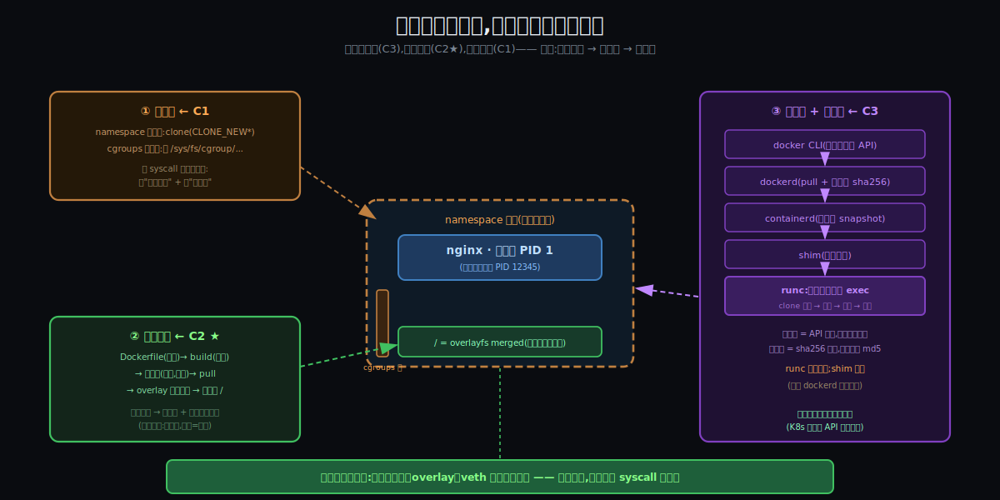
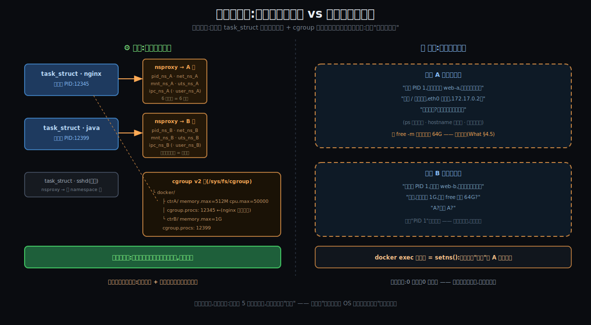
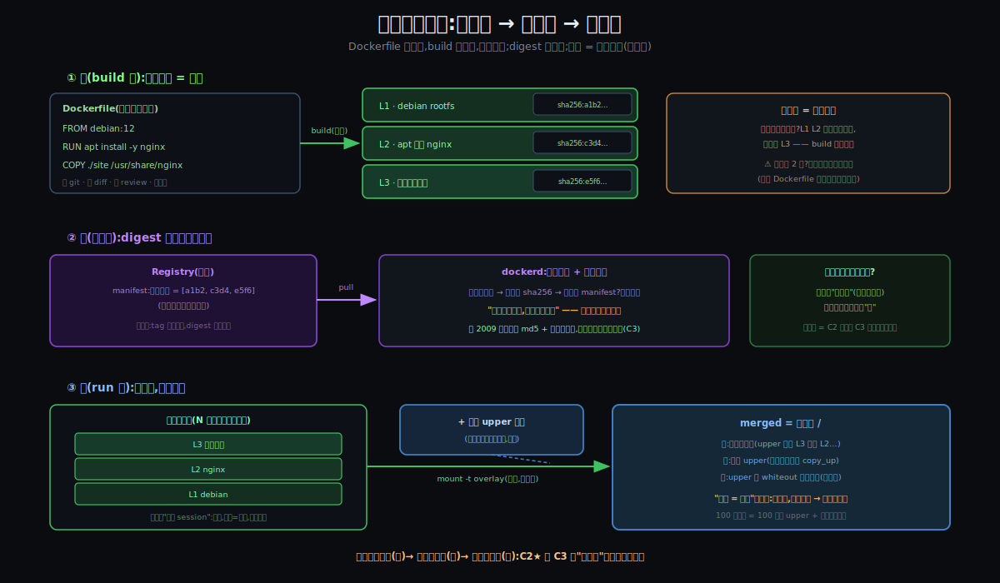
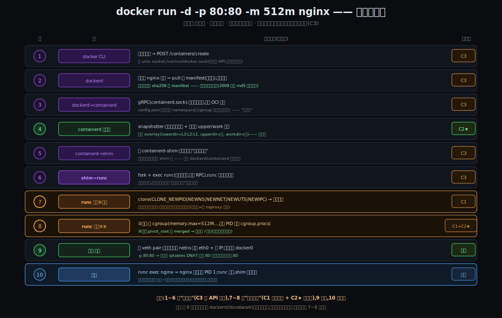
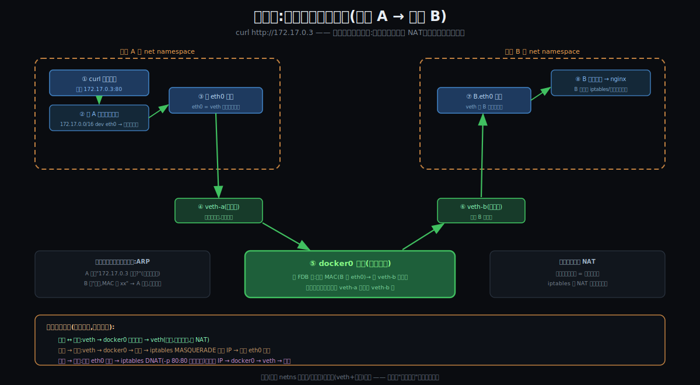
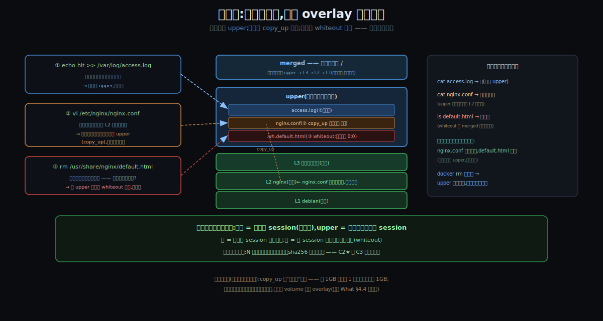
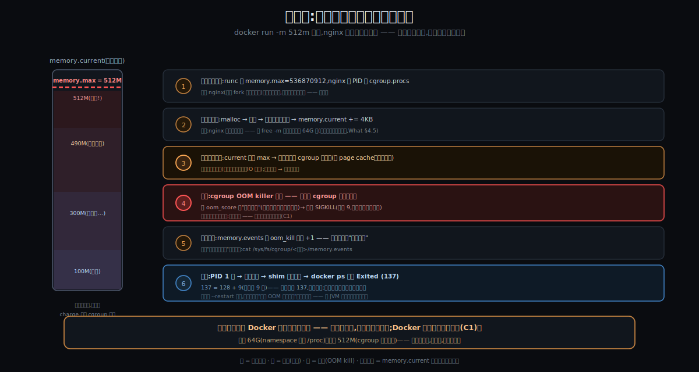

# 阶段 3:Docker 大致怎么工作

> **灵魂问题(贯穿全程):** 容器到底是什么?它和虚拟机的根本区别在哪?当一个容器真正跑起来的那一刻,Linux 内核里到底发生了什么 —— namespace、cgroups、镜像分层各自扮演什么角色?
>
> **这一节的本分:** 把上一节锻出来的三条压力(C1/C2★/C3),各自凝固成一件**看得见摸得着的机器**,然后看它们怎么协作 —— 用一次 `docker run -d nginx` 的端到端流程 + 三条支线现场(网络包旅程 / 写文件穿 overlay / 内存死刑),回答"那一刻内核里到底发生了什么"。**深度卡在机制级**:syscall 叫什么、数据怎么流、谁对谁说什么;数字级推导(为什么默认值是这个数)和源码级解剖,留给后面拿源码开膛的环节。

---

## 约束清单速查(C1~C3)

#### C1 — 榨干硬件:必须共享,必须隔离,隔离必须便宜
让 CPU / 内存更多用于**用户计算**。三连锁:①闲置是浪费 → 必须共享(经济账)②共享默认互害 → 必须隔离(Unix 语义)③隔离太贵也是浪费 → 隔离必须便宜(完整 OS 是重资产)。
**不可再分**:账单是物理的 / 全局命名是 40 年生态 / OS 体积时序是客观的。
**口诀**:榨干硬件 → 必须共享 → 必须隔离 → 隔离必须便宜

#### C2 ★ — 环境必须跟应用走(核心)
"环境"天然长在机器上(libs / 配置散落全局路径),不把它打包成应用的行李,一致性就永远靠人肉装修。
**不可再分**:FHS / 动态链接几十年生态,应用无法独立于环境存在。
**口诀**:环境是机器属性 → 必须打包跟应用走

#### C3 — 发布必须去人化,且机器可验真
千台规模下人必须退出发布链路;机器接管的前提是工件身份能被机器证明。
**不可再分**:人不可并行复制 / 文件名 ≠ 内容。
**口诀**:人不能扩容 + 文件名 ≠ 内容 → 机器接管 + 哈希验真

---

## §0 从"为什么"走到"怎么工作":三件事记住

上一节把"为什么必须存在"压成了三条压力。这一节的全部内容,就是三条压力各自凝固成的**三件机器** —— 你在开工对齐时已经自己摸到了它们的轮廓,现在钉死:

### §0.1 砌墙术 —— 从 C1 推出

因为 **C1②(共享默认互害)+ C1③(隔离必须便宜)** → 要解决"在同一个内核上,给每个进程一套'独占机器'的幻觉,且幻觉成本必须接近零" → 所以引入**砌墙术**:

- **namespace(改"看见什么")**:内核里每个进程的 `task_struct` 带一组 namespace 指针 —— 把指针指向不同的 namespace 对象,进程就"住进了不同的房间"。墙的物理实体就是**几个指针**,所以幻觉成本 ≈ 0。
- **cgroups(限"用多少")**:一棵树,每个节点(目录)是一个户头;进程上了户口,它的每一笔资源消费都记在户头上,触顶就处理。

这就是你那句"**把共享平面从 VM 级上抬到内核级**"的施工版:共享线以下(内核)一份,共享线以上(视图与配额)按指针分户。

### §0.2 叠行李术 —— 从 C2★ 推出

因为 **C2★(环境必须跟应用走)+ C1③(行李里不准装厂房)** → 要解决"环境整体带走、可共享、可秒启、还得轻" → 所以引入**叠行李术**:

- **不可变镜像层**:环境被切成一摞只读层(一条 Dockerfile 指令 = 一层),层一旦造好**永不修改** —— 像烧死的光盘 session(你的类比);
- **overlay 联合挂载**:运行时不解压,把只读层 + 一个空白可写层**挂**成容器的 `/` —— 毫秒完成,N 个容器共享同一摞底层。

### §0.3 流水线 + 验真术 —— 从 C3 推出

因为 **C3(发布去人化 + 机器可验真)** → 要解决"从命令到容器,全程机器执行;每个工件,机器能证明它是谁" → 所以引入**流水线 + 验真术**:

- **API 化运行时链**:`docker CLI → dockerd → containerd → shim → runc`,层层之间是 socket 上的 RPC —— 每一步都是 API 调用,**没有一步是人肉**;
- **内容寻址 digest**:每一层、每个镜像的身份 = 它内容的 sha256 —— 拉取时逐层验,**对不上直接拒收**。

### §0 结论:三件事对照 + 怎么协作

| 三件事 | 是什么 | 为什么存在 |
|--------|--------|-----------|
| **砌墙术** | namespace(六窗,改视图)+ cgroups(三表,限用量) | C1:共享必互害 → 隔离;且隔离必须便宜 → 改指针而非造假机器 |
| **叠行李术** | 不可变镜像层 + overlay 联合挂载 | C2★:环境随应用走;且行李不装厂房 → 轻 |
| **流水线+验真** | API 化运行时链 + sha256 内容寻址 | C3:人退出发布链路;工件身份机器可证 |

**协作时序**(一次 `docker run` 里):**流水线指挥(③)→ 备行李(②)→ 砌墙(①)→ 住人。**
**空间关系**:行李铺成地板(`/`),墙围成四壁(视图+配额),流水线站在屋外指挥 —— 屋里最终只剩你的进程。

---

## §1 一张极简概览图



从这张图能读出五件事:

1. **中央是成品**:一个 nginx 进程,在六窗之内、三表之下、overlay 地板之上 —— 它在容器里是 PID 1,在宿主眼里只是 PID 12345。
2. **左上的砌墙术**只干两件事:改"看见什么"(namespace)、限"用多少"(cgroups)—— 全部发生在 syscall 接口上。
3. **左下的叠行李术**是一条生产线:Dockerfile(源码)→ build(编译)→ 层(产物)→ overlay(铺地板)。
4. **右侧的流水线**自上而下接力,真正动手砌墙的只有 runc,干完就撤;shim 留守 —— 所以重启 dockerd 容器不死。
5. **底下那条绿带**还是那个共享内核:六窗、三表、overlay、veth,全是它一家提供的能力 —— 谎言统一撒在 syscall 这个"国标插座"上。

---

## §2 砌墙术:六把刀与三块表

### §2.1 namespace 的三个 syscall(六扇窗,三种开法)

窗有六扇(pid / net / mnt / uts / ipc / user,职责见 What §4.1),但**开窗的刀只有三把**:

| syscall | 干什么 | 一句话场景 |
|---------|--------|-----------|
| `clone(CLONE_NEW*)` | **出生即隔离**:生孩子时直接给一组新窗 | runc 造容器首进程用的就是它 |
| `unshare()` | **当场搬家**:自己活着活着搬进新窗 | `unshare --pid --fork bash` 一行体验隔离 |
| `setns()` | **串门**:把自己挂到别人已有的窗上 | **`docker exec` 的全部原理** —— 新进程 setns 到容器的六扇窗里,"进入"容器 |

> `docker exec` 值得单独咂摸:所谓"进入容器",**不是穿过什么边界**,只是新起一个进程、把它的六个 namespace 指针指向目标容器的那组对象 —— 串门,不是穿墙。

### §2.2 物理 vs 逻辑:墙到底"是"什么



- **物理真相(左)**:内核里,nginx 和 java 只是进程表上平起平坐的两行;所谓"各在各的容器里",物理实体是 —— `task_struct` 上**六个指针**指向不同的 namespace 对象,加上 cgroup 树里**一个目录**的户籍。**没有别的了。**
- **逻辑幻觉(右)**:两个进程各自以为"我是 PID 1,我独占一台机器"。同一个谎言,各撒一份,互不知情。
- 这就是"骗进程比骗 OS 便宜三个数量级"的物理根据:**幻觉的建造成本是改几个指针** —— 零复制、零虚拟硬件,所以毫秒级、近零税(C1③ 兑现)。
- 谎也有没撒全的地方:`/proc/meminfo`、`/proc/cpuinfo` 不归六窗管(What §4.5 那条缝)—— 双视图图里容器 A 的台词"free 仍看见 64G"就是这条缝。

### §2.3 cgroups:接口即文件,记账即配额

三块表(cpu / memory / io,生活对照见 What 的"三块表"图)在机制层只有三个动作:

1. **立户头**:`mkdir /sys/fs/cgroup/<名字>` —— 一个目录就是一个户头,**接口即文件**,没有任何专用 API;
2. **设表盘**:往目录里的文件写数 —— `echo 536870912 > memory.max`、`echo "50000 100000" > cpu.max`;
3. **上户口**:`echo <PID> > cgroup.procs` —— 从此这个进程(和它所有后代)的每一笔消费都记这个账上,**fork 也跑不掉**。

之后内核在资源分配路径上**实时记账**(charge):分配一页内存 → `memory.current += 4KB`;CPU 每个调度周期核销额度。触顶的处理两种脾气(回 What"三块表"图):**CPU/IO 限速(降级),内存 OOM kill(处决)** —— 因为内存超了无法"慢慢用"。

**窗和表的分工再钉一次**:窗管"看见什么"(视图),表管"用得了多少"(用量)—— 两套独立机器,互不通气。这正是"看见 64G 却死在 512M"的机制根源。

### §2.4 墙的边界(诚实清单)

- 六窗 + 三表**不是全部的墙**:真实容器还有 capabilities(砍特权)、seccomp(限 syscall 白名单)、AppArmor/SELinux 这些**安全墙** —— 机制同样是"在 syscall 接口上做规则",本节不展开,留给后面拿源码抠的环节;
- `/proc` / `/sys` 的缝、共享内核的命门(内核漏洞穿墙)—— What §2/§4.5 已立此存照。

---

## §3 叠行李术:从 Dockerfile 到容器的 `/`



### §3.1 造:Dockerfile 是环境的源代码

- **一条指令 = 一层**:`FROM debian` 给底片,`RUN apt install nginx` 的全部文件改动打成第二层,`COPY ./site` 第三层 —— 每层物理上就是"一个目录 diff 的打包"。
- **Dockerfile = 源码,`docker build` = 编译器,镜像 = 编译产物** —— 环境从此**进 git、可 diff、可 review、可回滚、可 CI**。这就是你说的"部署 code 化"(行话:基础设施即代码)的机制载体。
- **层缓存 = 增量编译**:层不可变 + 按内容寻址 → 没变的指令直接复用缓存层。只改了站点文件?L1/L2 秒过,只重建 L3。**代价是顺序敏感**:改了第 2 行,它和它以下全部重建 —— 所以"变得少的写上面,变得勤的写下面"是 Dockerfile 的第一门手艺。

### §3.2 验:digest 是工件的身份证

- registry 里每个镜像有一张 **manifest**:本质是"带哈希的层清单"(`[sha256:a1b2…, sha256:c3d4…, …]`);
- `docker pull` 逐层下载,**每层落地现场算 sha256 对清单 —— 对不上直接拒收**。"要么分毫不差,要么干脆失败",不存在第三种状态;
- **你 2009 年的人肉 md5 + 反编译,就在这一步被机器整体替代**(C3 兑现);
- 镜像名和 tag(`nginx:1.25`)只是**可挪动的指针**,digest 才是身份 —— 生产环境钉版本钉的是 `nginx@sha256:…`。

### §3.3 叠:不解压,挂上就用

- containerd 的 snapshotter 把只读层原地组好,**新建一个空 upper** → `mount -t overlay` → merged 即容器的 `/`。**启动 ≠ 解压**,是挂载 —— 毫秒级,这是"秒启"的真相;
- 100 个容器 = 100 个空 upper + **同一摞只读层**(共享不复制);
- 读 / 写 / 删三条路(copy-up / whiteout 的现场抓拍在 §6.2)。

### §3.4 光盘语义:"不能改" vs "不准改"(你的类比,焊在这)

镜像层的行为**就是多次刻录光盘**:旧 session 烧死改不了 → 改 = 在新 session 重刻一份盖住;删 = 新目录表不再指它(旧字节还在盘上)。对应:改 = copy-up,删 = whiteout,**删除是遮挡,不是擦除**。

但有一处必须拧:光盘的只读是**物理强制**,镜像层躺在完全可写的硬盘上 —— 它的只读是**软件自律,是故意选的**。为什么故意?

> **因为"永不改变",才敢被共享、才配有身份。**
> 层不可变 → N 个容器共用同一摞底层不怕互相污染 → **C2★ 的共享成立**;
> 层不可变 → sha256 一次算出永久有效 → **C3 的哈希身份成立**。
> **不可变性是同时撑起"共享"和"验真"的那根承重柱 —— C2★ 和 C3 在这里会师。**

谱系备注:这套"只追加 + 不可变历史 + 合并视图"是 CS 的大母题 —— 磁带/CD-R(物理逼的)、**git**(自选的:不可变对象+内容寻址,与镜像层同构)、LSM 树、event sourcing。Docker 早期的自我介绍就是:"**镜像 = 文件系统的 git**"。

### §3.5 部署的三级跳(收口)

| 时代 | 部署是什么 | 管理语义 |
|------|-----------|---------|
| 人肉时代(2009) | 一串**人执行的步骤** | wiki + md5 + 反编译 + 凌晨 2:00 |
| Puppet/Chef 时代 | 一段**收敛脚本** | 半 code 化,环境仍长在机器上 |
| Docker 时代 | 一个**可版本化工件**(Dockerfile→镜像→digest) | 与代码同一套语义:commit / diff / review / rollback |

效率跃迁的机制本质:**部署从"运维活动"变成了"软件工程对象"** —— 能 review 才能协作,能 diff 才能审计,能回滚才敢快发。

---

## §4 流水线与验真:谁在指挥这一切



### §4.1 角色与接口

接力链:`docker CLI →(REST · docker.sock)→ dockerd →(gRPC · containerd.sock)→ containerd → shim →(fork+exec)→ runc`。两个机制级细节:

- containerd 交给 runc 的是一个 **OCI bundle**:`config.json`(施工图:开哪些窗、表设多少、根在哪、跑什么命令)+ `rootfs`(行李铺好的地板)。**runc 就是 OCI 运行时规范的参考实现** —— "施工图的格式"是行业标准,谁都能照图施工(这句话是后面"它怎么来的"一站的大伏笔);
- 链上每个环节都是**无状态可替换**的零件 —— 这正是 C3"机器接管"的架构形态:机器零件才能被编排、被替换、被规模化。

### §4.2 runc:砌墙三连招,干完就走

1. **开窗**:`clone(CLONE_NEWPID|NEWNS|NEWNET|NEWUTS|NEWIPC)` —— 孩子出生即在六扇新窗内;
2. **装表**:写 cgroup 文件(`memory.max` 等),把孩子 PID 写进 `cgroup.procs`;
3. **换根**:在新 mnt 窗里 `pivot_root` 到 merged —— 行李正式成为孩子眼中的 `/`;
4. **住人**:`exec` 真正的 nginx —— 进程自我替换,从此墙内跑的就是你的应用;runc **exit,撤场**。

> 三连招的顺序有讲究:**换根必须发生在新 mnt 窗内**(否则会把宿主的挂载表搞乱);**exec 必须最后**(它是不归路 —— 自我替换后 runc 就不存在了)。

### §4.3 shim:为什么需要一个"楼管"

runc 撤了,容器进程总得有人管。shim 常驻,干三件事:**收养**容器进程(所以升级/重启 dockerd,容器不死)、**收尸**(回收僵尸进程)、**持灯**(拿着容器的 stdio,`docker logs` 才有东西可读)。

### §4.4 验真闭环 + 一句泼冷水

- 验真不只在 pull:运行哪个镜像、容器是谁、退出码多少 —— 全链路是**机器可读的事实**(对照 2009:全链路是人的记忆和眼睛);
- 泼冷水:**"弹性伸缩"不在这条流水线里。** Docker 提供的是单机的确定性原语(API 起、API 停、可验真的工件);**弹性是上层编排系统(Kubernetes)拿这些原语编出来的果实** —— 树在这里,果子在别处结。

---

## §5 端到端主线:`docker run -d -p 80:80 -m 512m nginx` 的十步

十步全图见上面的流水线图(§4 开头),正文只补三个"为什么是这个顺序"的观察:

1. **验真发生在最前**(第 2 步 pull 校验)—— 不合格的原料根本进不了工地;
2. **备行李(第 4 步)先于砌墙(第 7~8 步)** —— snapshot 只是"备料",真正把行李变成 `/`(pivot_root)必须等墙(新 mnt 窗)立起来之后,在墙内完成;
3. **住人永远是最后一步**(第 10 步 exec)—— 墙砌完、表装好、地板铺平,人才进场;进场即接管(成为 PID 1),施工队(runc)消失。

从敲回车到 nginx 可服务:**镜像已在本地时,毫秒~秒级**。对照 2009:几十台 × 4 小时 × 多人。这不是优化,是**换了物种**。

---

## §6 三条支线:机制现场抓拍

### §6.1 支线一:一个网络包的旅程(容器 A → 容器 B)



要点浓缩:

- **八跳全程二层**:A 查自己的路由表(同网段直发)→ A.eth0(veth 墙内头)→ veth-a(墙外头)→ docker0 查 FDB 转发 → veth-b → B.eth0 → B 自己的协议栈 → nginx。**不出宿主,不过 NAT,外面世界毫不知情**;
- 第一次通信前有一小步 **ARP**("172.17.0.3 是谁?"广播经网桥泛洪,B 应答,A 缓存);
- **三种流向对照**:容器↔容器(本图,纯二层)/ 容器→外网(MASQUERADE 改源 IP)/ 外网→容器(`-p 80:80` 写的那条 DNAT 改目的 IP)。**同一套洞,三种走法。**

### §6.2 支线二:三次写操作,穿过 overlay 的三条路



- **写新文件**(access.log):直落 upper,最简单;
- **改旧文件**(nginx.conf,躺在只读层 L2):内核先把**整个文件** copy_up 到 upper,再在副本上改 —— L2 的原版一字未动;
- **删文件**(default.html):upper 放一个 **whiteout**(字符设备),merged 里它"消失"了 —— 旧字节还在 L2,**删除是遮挡,不是擦除**(光盘语义的机制现场);
- 共享同镜像的另一容器:原版世界完好无损(它有自己的 upper);`docker rm` 本容器:upper 蒸发,三个改动全部消失;
- **埋一个坑给后面抠**:copy_up 是**整文件**复制 —— 改 1GB 文件的 1 个字节也得先抄 1GB。这就是"数据库必须挂 volume 绕过 overlay"的机制级原因(What §4.4 口诀的下半句)。

### §6.3 支线三:一次内存超限的死刑全过程



- 出生上户口(PID 进 `cgroup.procs`)→ 每页分配实时记账(`memory.current`)→ 逼近红线先**回收**(容器变慢)→ 回收不动 → **cgroup OOM killer 只在本户口内选人**,SIGKILL → `memory.events` 的 `oom_kill` 计数 +1 → 容器 `Exited (137)`;
- **137 = 128 + 9**(被信号 9 杀)—— 以后见到 137,你就知道:它是被自己的煤气表掐死的;
- **邻居毫发无损** —— 这就是墙存在的意义(C1);
- 全程**没有一行 Docker 代码参与行刑** —— 表是内核的,刑也是内核行的,Docker 只是当初写表的人;
- 与 What §4.5 合龙:**看见 64G(namespace 没遮 /proc)却死在 512M(cgroup 铁面记账)** —— 视图与用量,两道墙,至此闭环。

---

## §7 手搓迷你容器:30 行 shell 看清全部骨架

不依赖 Docker,只用内核的原生能力(每行都能指着说对应哪件事 / 哪条 C):

```bash
#!/bin/bash
# ===== 叠行李术(C2★):备地板 =====
mkdir -p /mc/{upper,work,merged}
mount -t overlay overlay \
  -o lowerdir=/mc/busybox-rootfs,upperdir=/mc/upper,workdir=/mc/work \
  /mc/merged                                  # 不解压,联合挂载 → 三件事②

# ===== 砌墙术之装表(C1):cgroups =====
mkdir /sys/fs/cgroup/mc                       # 立户头(一个目录 = 一个户头)
echo 536870912 > /sys/fs/cgroup/mc/memory.max # 煤气表:512M 硬顶
echo "50000 100000" > /sys/fs/cgroup/mc/cpu.max  # 电表:半颗 CPU

# ===== 砌墙术之开窗(C1):namespace =====
unshare --pid --net --mount --uts --ipc --fork bash -c '
  hostname mc-demo                            # uts 窗:自己的门牌
  echo "我眼里的自己:PID $$"                  # 新 pid 窗内:$$ = 1
  # ===== 砌墙术之换根(C2★ 行李落地)=====
  cd /mc/merged
  pivot_root . old_root                       # / 从此 = merged
  umount -l /old_root                         # 关掉看向旧世界的最后一扇门
  mount -t proc proc /proc                    # 让 ps 在新窗里正常工作
  # ===== 住人 =====
  exec /bin/sh                                # "容器"开张(替换自身,不归路)
'
# 收尾:把 unshare 的子进程 PID 写入 /sys/fs/cgroup/mc/cgroup.procs 即完成上户口
```

**没做的**(刻意,各有去处):veth 凿洞(§6.1 是它的完整旅程)、user 窗、seccomp/capabilities 安全墙(留给源码环节)、digest 验真(那是分发链的事,§3.2)。**但骨架全齐**:这 30 行,就是 runc 三连招 + 住人的素人版 —— Docker 没有魔法,只有编排好的内核能力。

---

## §8 朴素方案 vs Docker:差距全在"系统性"

把 2009 年的你能想到的最好土办法(tar 包 + scp + chroot)摆上手术台:

| 维度 | 朴素方案(tar + scp + chroot) | Docker 真实方案 | 差距的本质 |
|------|------------------------------|----------------|-----------|
| 隔离 | chroot 只挡文件系统视图;进程/网络/资源全裸 | 六窗 + 三表 | 一扇窗 vs 全套墙(C1) |
| 身份 | 文件名 + 人肉 md5 | sha256 内容寻址,机器拒收不符 | 人证 vs 物证(C3) |
| 增量 | 每次整包重传 | 层缓存:只建/只传变化层 | 全量 vs diff(C2★) |
| 启动 | 解压 GB 包,分钟级 | overlay 挂载,毫秒级 | 复制 vs 引用(C2★+C1③) |
| 共享 | 每实例一份拷贝 | N 容器共享只读层 | 不可变才敢共享(C2★) |
| 网络 | 共享宿主端口,继续打架 | netns + veth,各自的 80 | 没墙 vs 有墙(C1②) |
| 回滚 | 再 scp 一遍旧包(祈祷它还在) | 指回旧 digest,秒级 | 过程 vs 工件(C3) |

> 看出来了吗:**朴素方案不是"差一点",是每个维度各差一个机制** —— 而那些机制彼此咬合(不可变→可共享→可哈希→可验真→可机器化)才成了系统。这也是为什么 2013 年之前零件早就散落各处(chroot 1979 / namespace 2002+ / cgroups 2007),却没有 Docker —— 这个钩子留给下一站的历史。

---

## §9 误解戳破区

1. **"资源限制是镜像的一部分"** —— 不。表挂在墙上(运行时,C1),行李里只有文件(C2★)。镜像里**没有任何资源配置**;`-m 512m` 是 `docker run` 时才写进 cgroup 的。同一个镜像,这台跑 512M、那台跑 4G,完全正常。(这正是你对齐时把电表挂进行李箱的那个滑步 —— 现在钉死。)
2. **"跑一个 ubuntu 容器 = 跑了一个 ubuntu 系统"** —— 不。`docker run ubuntu uname -r` 显示的是**宿主的内核版本**;镜像里的"ubuntu"只是 ubuntu 的用户态衣服(glibc/bash/apt)。容器里**永远不存在第二个内核**(C1③ + 国标插座)。
3. **"启动容器 = 解压镜像"** —— 不。不解压,是 overlay **联合挂载**:100 个容器共享同一摞只读层,各自只新建一个空 upper。"秒启 + 省盘"都从这来(C2★)。
4. **"弹性伸缩是 Docker 的功能"** —— 不。Docker 提供单机确定性原语(API 化起停 + 可验真工件);弹性是 **Kubernetes 们**拿这些原语在集群尺度编排出来的**果实**。树和果要分清(C3 → 编排,留给后面的演化故事)。

---

## §10 约束回扣表

| 机制 / 组件 | 出生证(Cn) | 化解方式(机制级) |
|------------|------------|------------------|
| namespace 六窗 | C1②(共享默认互害) | `clone/unshare/setns` 操纵 `task_struct` 的六个指针 → 视图分户 |
| cgroups 三表 | C1①+②(共享但必须有账) | 目录=户头、文件=表盘、charge 实时记账,触顶限速/处决 |
| 共享内核(不带厂房) | C1③ + 国标插座契约 | 谎言只撒在 syscall 接口;窄/稳/单向三性质兜底 |
| 不可变镜像层 + overlay | C2★ | 一指令一层;不解压联合挂载;copy-up/whiteout 写时分离 |
| sha256 digest / manifest | C3(字节要有身份) | 内容寻址;逐层校验,拒收不符 —— 人肉 md5 退役 |
| API 流水线 + shim | C3(人退出链路) | 全程 RPC 接力;runc 用完即退;shim 收养/收尸/持灯 |
| veth + bridge + NAT | C1② 的墙上凿洞 | 隔离后的受控连通:二层直通/SNAT 出门/DNAT 进门 |

**单向校验**:表里每一行都能从右往左读 —— "没有这条约束,这个机制就没有存在理由"。反过来,没有一个机制是"设计者偏好"。

---

## §11 呼应灵魂问题

| 三问 | 走到这一站的答案 |
|------|----------------|
| ① 容器到底是什么? | ✅ 完整闭环:一个被六个指针 + 一个户头圈起来、站在联合挂载地板上的普通进程 |
| ② 和 VM 的根本区别? | ✅ 完整闭环:骗的层次不同(硬件接口 vs syscall 接口),所以成本差三个数量级 |
| ③ 那一刻内核里到底发生了什么? | 🟢 **机制级已通(~85%)**:十步流程 + 三连招 + 三条支线现场,你已能逐步说出 syscall 级动作链。**留白(15%)**:安全墙(seccomp/capabilities)细节、数字级推导(各种默认值与上限为什么是那个数)、源码级走读 —— 留给"拿源码开膛"的环节 |

**累计闭环度:约 85%。** 剩下的两块:**它怎么来的**(2013 引爆史 + 被拆解成 OCI/containerd 的演化 —— 你重心里的"历史尾巴"),和**钻到源码与数字**(深挖环节)。

---

## 修订记录

| 时间 | 修订摘要 | 触发原因 |
|------|---------|---------|
| 2026-06-04 | 初稿(机制档):三件事(砌墙/叠行李/流水线验真)+ 十步端到端 + 三支线(包旅程/copy-up/OOM)+ 30 行手搓 demo + 朴素对照 + 4 误解 + 7 张 SVG;融入用户的光盘类比(§3.4)、"共享平面上移"(§0.1/§2.2)、Dockerfile=源码/部署三级跳(§3.1/§3.5) | How 开场对齐收敛(B 机制档)后首次生成 |
