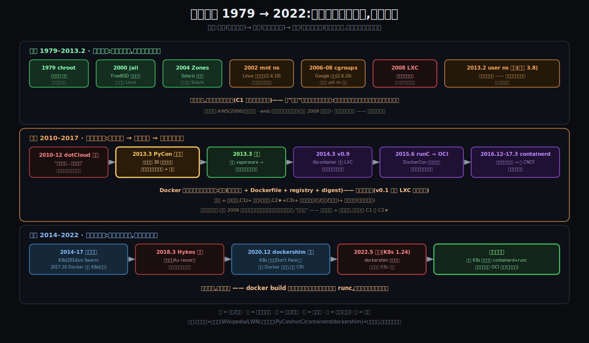
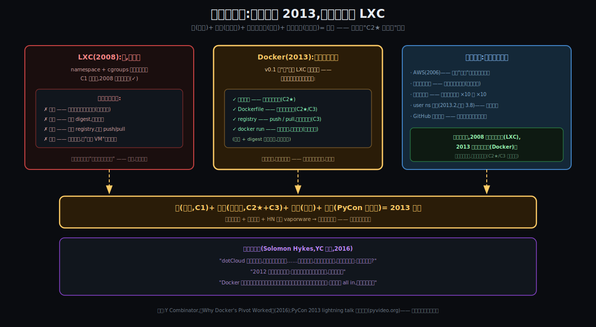
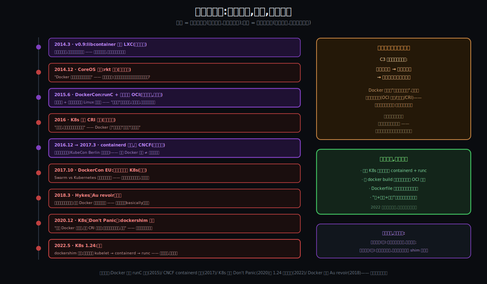

# 阶段 4:Docker 是怎么来的

> **灵魂问题(贯穿全程):** 容器到底是什么?它和虚拟机的根本区别在哪?当一个容器真正跑起来的那一刻,Linux 内核里到底发生了什么 —— namespace、cgroups、镜像分层各自扮演什么角色?
>
> **这一节的本分:** 解一桩悬案 —— **零件早就散落一地(chroot 1979 / namespace 2002 起 / cgroups 2008 / LXC 2008),为什么要等到 2013 年才有 Docker?** 以及它的下半场:引爆世界的东西,为什么几年内被拆解成 runc / containerd / OCI,连 Kubernetes 都把它"移除"了?**骨架是技术接力(B),血肉是人物剧情(A)**;资料混合档 —— 四大转折点(PyCon / runC 捐出 / containerd 剥离 / dockershim 之死)全部一手出处,背景节点用可靠综述,查不到的明说查不到(见文末两份清单)。

---

## 约束清单速查(C1~C3)

#### C1 — 榨干硬件:必须共享,必须隔离,隔离必须便宜
让 CPU / 内存更多用于**用户计算**。三连锁:①闲置是浪费 → 必须共享(经济账)②共享默认互害 → 必须隔离(Unix 语义)③隔离太贵也是浪费 → 隔离必须便宜(完整 OS 是重资产)。
**不可再分**:账单是物理的 / 全局命名是 40 年生态 / OS 体积时序是客观的。
**口诀**:榨干硬件 → 必须共享 → 必须隔离 → 隔离必须便宜

#### C2 ★ — 环境必须跟应用走(核心)
"环境"天然长在机器上(libs / 配置散落全局路径),不把它打包成应用的行李,一致性就永远靠人肉装修。
**不可再分**:FHS / 动态链接几十年生态,应用无法独立于环境存在。
**口诀**:环境是机器属性 → 必须打包跟应用走

#### C3 — 发布必须去人化,且机器可验真
千台规模下人必须退出发布链路;机器接管的前提是工件身份能被机器证明。
**不可再分**:人不可并行复制 / 文件名 ≠ 内容。
**口诀**:人不能扩容 + 文件名 ≠ 内容 → 机器接管 + 哈希验真

---

## §0 从"怎么工作"走到"怎么来的":三件事记住

机制都钉死了,历史只需要回答三个问题。这三个答案,就是本站的三件事:

### §0.1 零件先于产品十年 —— 墙从来不是瓶颈

因为 **C1 的化解(墙)是内核层的公共工程** → 它由操作系统社区按自己的节奏砌了三十年:chroot(1979)→ jail(2000)→ Zones(2004)→ Linux namespace 逐扇进窗(2002–2013)→ cgroups(2008 并入主线)→ LXC(2008,墙首次打包可用)。**到 2008 年,"造一个被圈起来的进程"在 Linux 上已经人人可为** —— 可它始终是少数人的玩具。结论:**2013 之谜的答案不在隔离技术里。**

### §0.2 引爆靠的是行李,不是墙 —— 历史为你的 C2★ 作证

因为 **C2★(环境随行)+ C3(可验真可分发)的痛在 2010 年代初到达社会性顶点**(云 + 千台集群 + 微服务)→ 要解决的早已不是"怎么隔离"而是"怎么打包、怎么流通" → 所以 Docker 的全部新发明是**行李**:镜像分层 + Dockerfile + registry + 一条命令的体验。**铁证:Docker v0.1 的"墙"就是 LXC 的包装纸**(直到 2014 年 0.9 版才换成自家的 libcontainer)—— 它借来了墙,只发明了行李,然后世界炸了。你在"为什么"那一站把 C2★ 钦点为核心 —— **历史在这里为你盖章。**

### §0.3 标准化即拆解 —— C3 的逻辑推到自己身上

因为 **C3 要求一切成为标准件**(接口化、可验真、可替换)→ Docker 把镜像格式、运行时规范、构建语义全部做成了标准 → **标准件的宿命:谁造的不重要**。runC 捐出(2015)、containerd 剥离(2017)、CRI 绕开(2016)、dockershim 之死(2020 宣判、2022 执行)—— 九刀下来,公司退位,标准永生。**它亲手锻造了那把最终替换掉自己的刀,而这恰恰是它对世界最大的贡献。**

### §0 结论:三件事对照

| 三件事 | 一句话 | 对应约束 |
|--------|--------|---------|
| 零件先于产品十年 | 墙 2008 年就齐了,隔离从来不是瓶颈 | C1(早已化解) |
| 引爆靠行李不靠墙 | Docker 只发明了打包,墙是借的 | C2★ + C3(痛到顶点) |
| 标准化即拆解 | 把一切做成标准件的人,自己也成了可替换件 | C3(推到自身) |

三件事连起来就是整站故事:**墙等了三十年(§2),行李一来就引爆(§3–4),标准立住后拆解开始(§5)。**

---

## §1 一张极简概览图

从图上能读出五件事:

1. **前传带(绿/橙)三十四年只干一件事:把墙的零件搬进仓库** —— 每个节点都"解决了一样,还缺一样",缺的就是下一棒的出生证;
2. **2013 年 2 月,user namespace 在内核 3.8 完工 —— 距离引爆只剩一个月**:最后一块零件和火柴几乎同月到位;
3. **主线带(金/紫)**:引爆点(PyCon 五分钟)之后,紫色节点全是"交公"(libcontainer → runC → containerd)—— 引爆和拆解是同一条线;
4. **尾声带(蓝/红)**:战争(K8s vs Swarm)→ 认负(2017.10)→ 离场(2018.3)→ 宣判与执行(2020/2022)→ 但最右边那格是绿的:**标准永生**;
5. 主线带下面那行小字,是 2013 年大洋另一端的你。

---

## §2 前传(1979–2013.2):零件入库

接力棒逐一过手 —— 每棒只问两个问题:**解决了什么?还缺什么?**

| 棒 | 年代 | 解决了什么 | 还缺什么(= 下一棒的出生证) |
|----|------|-----------|------------------------------|
| **chroot** | 1979(V7 Unix;1982 进 BSD) | 换根 —— 文件视图隔离的雏形(第一扇"窗") | 只挡文件视图;进程/网络/资源全裸 |
| **FreeBSD jail** | 2000 | 第一次"整套"隔离(进程+网络+弱化 root) | 不在 Linux 生态 —— 主战场的服务器在别处 |
| **Solaris Zones** | 2004 | 商用级容器,运维精良 | 绑死 Solaris;随 Sun 的衰落陪葬 |
| **Linux mnt ns** | 2002(内核 2.4.19,Al Viro) | Linux 的第一扇窗 | 单扇窗不成墙 |
| **UTS/IPC/pid/net ns** | 2006–2009(2.6.19 → 2.6.29) | 窗逐扇补齐 | 散件,没人打包 |
| **cgroups** | 2006 始,2008.1 并入 2.6.24(Google「process containers」,Paul Menage / Rohit Seth) | 表入库 —— 与 pid ns 同一个内核版本落地 | 同上:有零件,无产品 |
| **OpenVZ** | 2005 | 整机容器化(虚拟主机商在用) | 要打内核补丁,始终未入主线 → 受众受限 |
| **LXC** | 2008.8 | **墙首次打包可用** —— namespace+cgroups 的第一个易用组合 | **行李!** 没有镜像、没有 Dockerfile、没有 registry、没有一条命令的体验 |
| **user ns 完工** | 2013.2(内核 3.8) | 第六扇窗到位,墙至此全齐 | 只欠行李,和一根火柴 |

**为什么 LXC 没有引爆 —— 四样缺失(这是 2013 之谜的反面证词):**

1. **缺行李**:LXC 给你一间空房,进去还得手工装环境 —— 幕四("在我机器上能跑")在容器里原样重演;
2. **缺身份**:没有 digest,没法验真(C3 无解);
3. **缺分发**:没有 registry,环境没法 push/pull 流通;
4. **缺体验**:配置繁琐,用的人把它当**更便宜的虚拟机** —— 宠物,不是货柜。

> 同期暗线(柴堆在变干):AWS(2006)把"机器"变成可编程资源;web 集群从十台涨向千台(你的 2009 就在这条曲线上);微服务浪潮把部署单元数量翻了一个数量级再翻一个。**C2★ 和 C3 的痛,正在逼近社会性顶点。**

---

## §3 引子:创作者的烦躁(2010–2012)

dotCloud,2010 年从 Y Combinator 出来的 PaaS 创业公司,十几个人,内部用 Linux 容器(+aufs 分层)跑着成千上万客户应用 —— **容器和分层,他们当成商业机密用了好几年**。但公司本身在温水里:

> "dotCloud 绝不算失败 —— 我们有付费客户,但它**成功得不够快**。像一只温水煮的青蛙:每个月都有进展,但你忍不住想,'能不能更好?'"
> "2012 年底,我对自己说:**蛙已经煮熟了。我重复一遍,蛙煮熟了。**"
> —— Solomon Hykes,Y Combinator 专访(2016)[^yc]

更扎心的是,把容器技术做成产品这件事,**Docker 是第六次尝试**:

> "Docker 大概是我们解决这个问题的第六次尝试,前五次显然都失败了。失败的真正原因是:**我们没有 all in,想两头都要** —— 那是大集团的打法,对一个 15 人的创业公司行不通。"
> "你得告诉工程师:'过去几个月你们做的所有东西,我们全部砍掉。'……但你必须做出那个决定,然后全押。"
> —— 同上 [^yc]

于是在公司最黑暗的时刻,Hykes 对董事会提了一个激进方案:**把内部的容器技术开源** —— 商业模式?还不知道。

---

## §4 引爆:五分钟,与一根火柴的物理学(2013)

2013 年 3 月,加州圣克拉拉,PyCon US。Hykes 报了一个**闪电演讲**:《The future of Linux containers》,五分钟,演示一个还没发布的内部工具 —— Docker [^pycon]。

他以为会被安排在"能坐三十个人的小房间"。结果 PyCon 的闪电演讲在**主会场**,台下几百人;视频随后疯传 [^zenduty]。有人把他们还没开源的网站发上 Hacker News,讥讽这是 **vaporware**(雾件)—— 团队的回应是:**两周冲刺,把它推出门**。2013 年 3 月,Docker 开源 [^zenduty][^snyk]。

为什么这五分钟能点着,而 LXC 烧了五年没动静?把引爆拆成方程式:

> **墙(现成,C1)+ 行李(新发明,C2★+C3)+ 干透的柴堆(时代)+ 一根火柴(五分钟演讲)= 2013**

- **墙是借的**:v0.1 的隔离层就是 LXC —— Docker 没有发明任何隔离技术;
- **行李是新的**:镜像分层(环境装箱)、Dockerfile(环境的源代码)、registry(行李流通)、`docker run` 一条命令(十秒钟上手的体验)—— **每一样都打在 C2★/C3 的痛点上**;
- **柴是干的**:云已普及、集群已千台、微服务已起浪、user ns 刚完工、GitHub 文化已成型;
- **火柴**:一场本来给三十个人准备的演讲,误入主会场。

> 同样的种子,2008 年落在湿柴上(LXC),2013 年落在干柴上(Docker)。**时机不是运气,是约束的成熟度。**

而在大洋另一端,同一年 —— 一位 2009 年在凌晨两点的机房里用反编译器核对过版本的中国工程师,在网上看到了它:

> "**可以利用共享内核 + 打包依赖的方式启动进程 —— 我惊呆了。它解决了我当时对分布式系统所有的迷惑与恐惧。**" —— 本篇主人公,2013

注意他一眼读出的两样东西:**共享内核(C1③),打包依赖(C2★)** —— 一个被五幕痛史磨过的工程师,十秒钟内完成了这趟旅程前三站的全部推导。**引爆的真正机制,是全世界数百万个这样的瞬间。**

---

## §5 合:成型、战争与拆解(2014–2022)

暴红之后的故事,是一部**拆解编年史** —— 九刀,两种刀法(紫 = 自己下的刀,红 = 别人下的刀):

1. **2014.3,v0.9:libcontainer 替掉 LXC**(紫)—— 砌墙手艺收归自家,摆脱外部依赖 [^v09];
2. **2014.12:CoreOS 叛乱**(红)—— 推出竞品 rkt,公开指责 Docker 背离"简单积木"的初心;巨头们的不安浮出水面:**容器的事实标准,凭什么握在一家创业公司手里?**[^infoworld]
3. **2015.6,DockerCon:runC + 规范捐给 OCI**(紫,被逼的)—— Hykes 在主题演讲上宣布把 libcontainer 全部内容连同镜像/运行时规范捐给 Linux 基金会新设的开放容器计划;AWS、Google、微软、红帽等二十余家创始成员 [^runc][^oci]。叛乱平息,**但城门钥匙交了**;
4. **2016:Kubernetes 定义 CRI**(红)—— "运行时,谁实现这个接口我用谁。" Docker 从唯一选项降级为选项之一;
5. **2016.12 → 2017.3:containerd 剥离,捐给 CNCF**(紫)—— 引擎核心也交公(KubeCon Berlin,技术监督委员会全票通过)[^containerd];
6. **2016–2017:编排战争白热化** —— Docker 把 Swarm 直接捆进引擎(1.12),试图用入口优势对抗 Kubernetes;生态反感,战局反而加速倾斜 [^infoworld];
7. **2017.10,DockerCon EU:Docker 宣布原生支持 Kubernetes** —— 把对手请进自家产品,体面认负;
8. **2018.3:Hykes 发表《Au revoir》,退出日常运营** [^aurevoir];次年,Docker 企业业务出售给 Mirantis;
9. **2020.12:K8s 官博《Don't Panic: Kubernetes and Docker》宣判 dockershim 弃用;2022.5,K8s 1.24 执行移除** [^dontpanic][^124] —— 从此每个 K8s 节点上跑的是 `kubelet → containerd → runc`,**Docker 引擎退出了它定义的世界的中心**。

**九刀背后是同一条定律 —— C3 推到自己身上:** Docker 为了让"机器接管发布",把一切做成了标准件(OCI 镜像、OCI 运行时、CRI 接口);标准件的宿命就是**谁造的不重要**。dockershim 这个名字本身就是判决书:K8s 为了迁就 Docker 引擎专门垫的一块垫片 —— **垫片即技术债,2022 年清偿**。

但拆解的另一面:**公司输了,标准赢了。** 你今天 `docker build` 出的每一个镜像都是 OCI 格式;每个 K8s 节点里都跑着它孵化的 containerd + runc;Dockerfile 仍是全行业"环境的源代码"。**2022 年移除的是引擎,不是它定义的世界。**

---

## §6 遗憾与反思(有据的,不编)

1. **"前五次失败,因为没有 all in"** —— 创作者本人盖章的最大教训(YC 专访原话)[^yc]:同时抱着旧业务和新方向,是"大集团打法",杀死了前五次尝试;
2. **把编排捆进引擎** —— Swarm 内置进 Docker 1.12(2016)被广泛认为是战略失误:它把"中立的基础设施"变成了"有立场的竞争者",直接加速了 CRI 的诞生与生态的离心(综述判断,InfoWorld《How Docker broke in half》)[^infoworld];
3. **商业模式始终悬空** —— 核心全部捐出后"卖什么"一直无解:企业业务 2019 年售予 Mirantis;今天的 Docker 公司靠 Docker Desktop 订阅与开发者工具存活 —— **技术史上罕见的"赢了一切,除了生意"**;
4. **dockershim 之债** —— 引擎当年没有按"可被编排的标准件"设计自己与 K8s 的接缝,垫片由别人来垫,账由自己来还。

> 未能找到一手资料的部分(坦诚):Hykes 本人对"如果重来会怎么做"的系统性反思长文,未检索到 —— 不代写。他 2018 年的《Au revoir》[^aurevoir] 与后来创办 Dagger(回到开发者工具)的选择,可视为行动层面的回答,但这是**推断,不是引用**。

---

## §7 约束回扣(历史侧):同一份清单,三个年代三种读法

| 年代 | C1(榨干硬件) | C2★(环境随行) | C3(去人化+验真) | 结果 |
|------|--------------|----------------|------------------|------|
| **2008(LXC)** | ✅ 零件已齐(墙可用) | 🟡 痛存在但未到顶(云未普及、集群尚小) | 🟡 同上 | 有墙没行李,没人引爆 |
| **2013(Docker)** | ✅ 现成(借 LXC) | 🔴 痛顶(千台集群+微服务)→ 镜像/Dockerfile 正中 | 🔴 痛顶 → registry/digest 正中 | **引爆** |
| **2015–2022(拆解)** | —— | 标准化(OCI 镜像) | **标准化推到自身**(OCI 运行时/CRI) | 公司退位,标准永生 |

读法:**约束不变,成熟度在变** —— 同一份 C1~C3,在 2008 年读出"玩具",在 2013 年读出"革命",在 2017 年读出"拆解"。这正是约束清单比"大事年表"更锋利的地方:**年表记录发生了什么,约束解释为什么是那时发生。**

---

## §8 呼应灵魂问题

灵魂问题的三问在前三站已闭环 ~85%(定义/区别/机制)。本站补上的是**时间维度**:

- "namespace、cgroups、镜像分层各扮演什么角色" —— 现在有了**历史版答案**:namespace+cgroups(墙)是内核社区三十年的公共工程,Docker 是借用者;**镜像分层才是 Docker 自己的发明** —— 角色之别,在出生上就写好了;
- "和虚拟机的根本区别" —— 历史补充:VM(2008 救场)与容器(2013 引爆)的接力关系,本身就是 C1③("隔离太贵也是浪费")从忍受到不可忍受的过程;
- 你重心清单的最后两项 —— "为什么 2013 引爆"(干柴+行李+火柴)与"为什么被自己拆解"(C3 推到自身)—— 本站正面闭环。

**累计闭环度:约 92%。** 留白:数字级与源码级的深潜(若走 Deep),以及与邻居方案的正面对比(若走 Comparison)。

---

## 尾声:大洋两岸的同一个瞬间

2013 年 3 月,加州圣克拉拉的主会场,五分钟演讲结束,掌声与疯传开始。

同一年,太平洋另一端,一位四年前在凌晨两点的机房里逐台核对 md5、用反编译器验证版本的工程师,在网上看到了这个东西:

> **"共享内核 + 打包依赖的方式启动进程 —— 我惊呆了。它解决了我当时对分布式系统所有的迷惑与恐惧。"**

他不知道的是:他一眼读出的那两样 —— 共享内核、打包依赖 —— 十三年后会被他自己在一份笔记里,亲手锻成 C1 和 C2★;他当年的恐惧(幕五,2009)会成为第五幕的剧本;而那句"惊呆了",会成为这桩悬案的最后一份证词:

**引爆从来不在会场里。引爆是全世界数百万个带着旧伤的工程师,在屏幕前同时认出解药的那个瞬间。**

**证词的最后一页(读者终审):** 被问到"四样行李里哪一样最伟大",这位亲历者的回答是 —— **镜像**。这个判决至此三重验证:直觉(2013 年一眼读出"打包依赖")、推导(约束清单里钦点 C2★ 为核心)、史证(v0.1 = LXC 包装纸)。而历史自己的终审也站在这边:引擎死了(dockershim,2022),一条命令的垄断没了(podman/nerdctl),Dockerfile 有了竞争者(buildpacks/nix)——**唯独镜像成为 OCI 标准,统治了一切。** 公案另判一笔:镜像是**价值**,`docker run` 是**传播系数** —— 伟大的发明需要一个十秒钟的开关,但活到最后的,是发明本身。

(接下来的岔路口,见对话。)

---

## 一手资料引用列表

**一手(关键论断的出处):**

[^pycon]: Solomon Hykes, *"The future of Linux Containers"*(闪电演讲原始视频),PyCon US 2013,2013-03. https://pyvideo.org/pycon-us-2013/the-future-of-linux-containers.html
[^yc]: Y Combinator, *"Why Docker's Pivot Worked"*(Solomon Hykes 第一人称专访),2016-05. https://www.ycombinator.com/blog/solomon-hykes-docker-dotcloud-interview/
[^runc]: Docker 官方博客, *"Introducing runC: a lightweight universal container runtime"*,2015-06. https://www.docker.com/blog/runc/
[^v09]: Docker 官方博客, *"Docker 0.9: introducing execution drivers and libcontainer"*,2014-03. https://www.docker.com/blog/docker-0-9-introducing-execution-drivers-and-libcontainer/
[^containerd]: CNCF 官方公告, *"containerd joins the Cloud Native Computing Foundation"*,2017-03-29. https://www.cncf.io/announcements/2017/03/29/containerd-joins-cloud-native-computing-foundation/
[^dontpanic]: Kubernetes 官方博客, *"Don't Panic: Kubernetes and Docker"*,2020-12-02. https://kubernetes.io/blog/2020/12/02/dont-panic-kubernetes-and-docker/
[^124]: Kubernetes 官方博客, *"Kubernetes Removals and Deprecations In 1.24"*,2022-04-07. https://kubernetes.io/blog/2022/04/07/upcoming-changes-in-kubernetes-1-24/
[^aurevoir]: Solomon Hykes, *"Au revoir"*(离任告别信),Docker 官方博客,2018-03. https://www.docker.com/blog/au-revoir/

**综述(背景节点,可靠性良好):**

[^oci]: InfoQ, *"Docker, CoreOS and Industry Coalition Create Open Container Project"*,2015-06. https://www.infoq.com/news/2015/06/open-container-project/
[^infoworld]: InfoWorld, *"How Docker broke in half"*(拆解与战争的深度复盘),2021. https://www.infoworld.com/article/2269272/how-docker-broke-in-half.html
[^zenduty]: Zenduty 播客实录, *"The story of docker with Solomon Hykes"*(PyCon 现场与两周冲刺细节). https://zenduty.com/blog/solomon-hykes-docker-dagger/
[^snyk]: Snyk, *"The Docker project turns 10!"*,2023. https://snyk.io/blog/the-docker-project-turns-10/
- Wikipedia:cgroups(Google 2006「process containers」,Menage/Seth,2.6.24 并入)/ Linux namespaces(各窗时间线)/ LXC(2008.8 首发)/ Open Container Initiative. https://en.wikipedia.org/wiki/Cgroups 等
- LWN, *"Namespaces in operation, part 1"*,2013-01. https://lwn.net/Articles/531114/
- InfoQ, *"Docker drops LXC as default execution environment"*,2014-03. https://www.infoq.com/news/2014/03/docker_0_9/

## 无一手资料的部分(坦诚清单)

- dotCloud 内部**前五次尝试**的具体内容:仅存 Hykes 在 YC 专访中的概述,细节不可考;
- **"两周冲刺开源"**的过程细节:出自二手播客/回顾转述([^zenduty][^snyk]),可信度中等;
- CoreOS"背离初心"的指责:为当年公开信的通行转述(综述级),未核对原文;
- dotCloud 内部使用 aufs / 容器的工程细节:综述级;
- Hykes 对"如果重来"的系统性反思:**未找到一手长文,本文不代写**(已在 §6 标注)。

---

## 修订记录

| 时间 | 修订摘要 | 触发原因 |
|------|---------|---------|
| 2026-06-04 | 初稿(B 骨 A 肉 · 混合档):三件事(零件先于产品/引爆靠行李/标准化即拆解)+ 前传接力表 + dotCloud 困局(YC 原话)+ 引爆方程式 + 拆解编年史九刀 + 遗憾四则 + 历史侧约束回扣 + 大洋两岸尾声(用户 2013 亲历)+ 3 张 SVG + 一手/综述双清单 | Origin 对齐收敛(B骨A肉/全跨度/混合档/用户 2013 记忆)后首次生成;关键转折全部 web 检索一手出处 |
| 2026-06-04 | 尾声 +「证词的最后一页」:读者终审选"镜像"为最伟大发明 → 三重验证闭环(直觉2013/推导C2★/史证v0.1)+ 历史终审(四样行李唯镜像成 OCI 标准存活)+ 公案另判(镜像=价值,docker run=传播系数) | 用户答"四样里哪样击中你"探针:镜像 |
