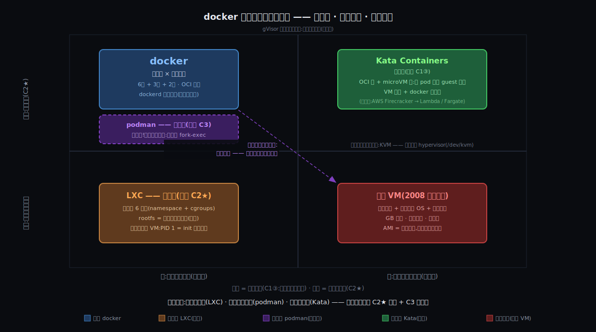

# 阶段 6:docker 与其他设计的对照 —— 三面镜子

> 灵魂问题:"容器到底是什么?它和虚拟机的根本区别在哪?当一个容器真正跑起来的那一刻,Linux 内核里到底发生了什么?"
>
> 前五站把 docker **自己**解剖到了内核源码层。但一份答卷读得再熟,也分不清哪些笔画是约束逼出来的必然、哪些只是历史顺手的偶然 —— 分辨的唯一办法,是看**别人怎么答同一道题**。本篇拉来三位答题人,每位恰好拷问一条约束。

## 约束清单速查(C1~C3)

#### C1 — 榨干硬件
硬件必须高效用于**用户计算**。三连锁:①闲置是浪费 → 必须共享;②共享默认互害 → 必须隔离;③**隔离太贵也是浪费 → 隔离必须便宜**(③咬回①成闭环)。
**不可再分**:经济账(利用率 5~15%)+ 40 年全局命名生态 + 完整 OS 重资产。
**口诀**:榨干硬件 → 必须共享 → 必须隔离 → 隔离必须便宜

#### C2 ★ — 环境随行(钦点核心)
应用 = 二进制 + libs + 配置,散落在全局路径里(FHS / 动态链接生态)—— **环境长在机器上,必须打包跟应用走**。
**不可再分**:40 年 FHS/动态链接生态现实;单独只逼出 AMI,叠加 C1③ 才坍缩成容器镜像。
**口诀**:环境是机器属性 → 必须打包随行

#### C3 — 去人化 + 验真
发布必须去人化,且机器可验真:人力不随规模扩展(O(台数×环境×频率),人是常数);字节无身份(文件名 ≠ 内容)。
**不可再分**:规模浪潮 + 存储语义(2009 年凌晨的 md5 人工核对,验证穷尽到反编译)。
**口诀**:人不能扩容 + 文件名≠内容 → 机器接管 + 哈希验真

逼出映射(How/Deep 已钉死):C1 → 6墙+3表 + 共享内核不带厂房 / C2★ → 镜像+overlayfs / C3 → API 流水线 + sha256 内容寻址。

## §0 从内核深剖走到对照:三件事记住

Deep 把 docker 的答卷读到了逐行源码;但"读熟一份答卷"回答不了一个问题:**这道题是不是只有这一种答案?** 圈内至少有三份与 docker 共享大量零件、却在关键处反着写的答卷。挑这三份不是随机 —— **每一份恰好把 C1~C3 中的一条约束按在桌上重新拷问**。

1. **镜子一:LXC,拷问 C2★。** 因为 C2★ 是被钦点的心脏(Origin 终审:"镜像是 docker 最伟大的发明"),而 LXC 跟 docker 用**完全相同的 6 堵墙**(namespace + cgroups,docker v0.1 干脆披着它当包装纸)→ 要解决"墙相同,为什么命运天差地别"这个疑问 → 所以拉来 LXC 照「**容器的单位**」:LXC 把容器当**轻量 VM** 住(PID 1 = init,墙内跑整套系统),docker 把容器当**应用进程**发(PID 1 = 应用,环境压进镜像)。
2. **镜子二:podman,拷问 C3。** 因为 C3 要的是"API 化的去人流水线",docker 把它实现成了 dockerd 中央常驻守护进程 —— 但"流水线"与"常驻指挥部"之间并没有逻辑必然 → 要解决"指挥部是必然还是偶然"→ 所以拉来 podman 照「**控制面**」:零件几乎全同(同样的 OCI 镜像、同样下接 runc 一族),只是把守护进程拆成 fork-exec,把 root 拆成 rootless。
3. **镜子三:Kata,拷问 C1③。** 因为 C1③"隔离必须便宜"里的"贵",是 2008~2013 年的价目表(完整 OS = GB 镜像 + 分钟启动 + 内存税)—— 而**事实会过期** → 要解决"前提塌了,推导链还站得住吗"→ 所以拉来 Kata 照「**隔离的墙**」:每个容器(pod)一台微型真 VM + 独立 guest 内核 —— 墙换成硬件的,行李(镜像)原样保留。

| 镜子 | 是什么(照的轴) | 为什么存在(拷问什么) |
|------|----------------|----------------------|
| LXC | 容器的单位:整套系统 vs 单个应用 | C2★ —— 墙一样、没镜像,它就活成了另一个物种;反证镜像才是 docker 的命 |
| podman | 控制面:常驻守护进程 vs fork-exec | C3 —— 流水线必须有常驻指挥部吗?拆了它,一切照转 |
| Kata | 隔离的墙:共享内核 vs 每实例独立内核 | C1③ —— "VM 贵"这张价目表过期之后,docker 的选择还剩多少必然 |

三面镜子刚好对上 How 立的三大支柱:**打包(LXC→C2★)/ 运维(podman→C3)/ 隔离(Kata→C1)** —— 把 docker 按进设计空间,每个维度各照一次。

## §1 一张极简概览图



从这张图上能直接读出六件事:

1. **docker 和传统 VM 是对角象限** —— 差的不是一条轴,是两条(墙 + 行李)。这就是"容器 vs 虚拟机"吵了十年吵不清的根源:拿一维语言描述二维差异。
2. **LXC 和 docker 同列**(同样的逻辑墙),差在纵轴 —— 镜像才是分水岭,墙不是。
3. **Kata 和 docker 同行**(同样的镜像行李),差在横轴 —— 墙可以整面换材质,行李纹丝不动。
4. **podman 和 docker 挤在同一格** —— 它动的是这张图画不下的**第三维:控制面**。象限内零件相同,指挥体系不同。
5. **四个象限全被占满** —— "容器还是 VM"是伪二分;设计空间是连续的,gVisor 干脆骑在竖线上(用户态假内核,半独立)。
6. **右半边(独立内核)的现代实现,全站在同一块地基上 —— KVM**:Linux 内核自带的 hypervisor。它和 namespace+cgroups 是同一个内核的两套隔离原语(详见 §6)。

## §2 三位对照者的出生证明

对照之前先验明正身 —— 每位四件事:**初衷 / 擅长 / 不擅长 / 现实里谁在用**。

### §2.1 LXC(Linux Containers,2008)

**初衷**:OpenVZ(2005)和 Linux-VServer(2001)早就证明"共享内核切分主机"可行,但都要给内核打私有补丁,永远进不了主线。2008 年 cgroups 进主线(2.6.24)后,IBM 的 Daniel Lezcano 等内核工程师把刚凑齐的 namespace + cgroups 组装成**第一个纯主线容器运行时** —— 目标一句话:不打补丁的 OpenVZ,在原版内核上跑出轻量 VM 的体验。

**擅长**:
- 把容器**当系统养**:墙内跑 init/systemd + sshd + 多个服务,长生命周期、有状态
- 整机切分卖密度(VPS 形态);无特权容器先行者(LXC 1.0 在 2014 年就支持 user ns 无特权容器,比 docker rootless GA 早约六年)

**不擅长**:
- **应用分发**:没有分层内容寻址镜像(它的"镜像"≈ rootfs 模板 tarball),没有 Dockerfile 这层构建语言;环境怎么进容器、怎么跨机器搬、怎么验真 —— 全是用户自己的事(C2★、C3 不在它的考卷上)
- 一次性、不可变、快速横向扩缩的用法(文化与工具链都不长这样)

**典型应用场景**:
- **Proxmox VE**(4.0 起用 LXC 全面替换 OpenVZ,与 KVM 并列两大虚拟化形态)
- **Chrome OS Crostini**(Chromebook 上开的那个 Linux,是 VM 里的 LXD 容器)
- **Heroku 早期 dyno**;以及 **docker 0.1~0.9 自己**(2013.3~2014.3,LXC 是 docker 的执行驱动)
- 管理面演化:LXD(Canonical,2015)→ 2023 年社区 fork 出 Incus

### §2.2 podman(Red Hat,2018)

**初衷**:Red Hat 容器团队(领头人 Dan Walsh,SELinux 一代宗师)对 dockerd 有两大不满:① 一个以 root 身份常驻的守护进程 = 单点 + 巨大攻击面,而且 `docker` 组成员 ≈ 免密 root;② 容器生命周期被一家公司的守护进程私有 API 垄断,跟 systemd / K8s 的进程管理打架。于是按"**容器只是普通 Linux 进程**"重做一遍:无守护进程、fork-exec、默认支持 rootless,CLI 与 docker 逐字兼容(`alias docker=podman` 是官方口号)。

**擅长**:
- 安全/合规环境:rootless + 无 root 守护进程 + SELinux 深度集成
- systemd 原生集成(Quadlet:容器直接写成 systemd unit);pod 概念与 K8s 同构,`podman kube generate` 一键导出 YAML
- CI 里嵌套跑容器(没有守护进程依赖)

**不擅长**:
- 需要中央常驻状态的功能:没有 swarm 类内置编排;依赖 `docker.sock` 长连接的工具链要走 `podman.socket` 兼容层
- 桌面生态起步晚(Podman Desktop 2022 年才成型)

**典型应用场景**:
- **RHEL 8+ 的默认容器工具**(Red Hat 直接把 docker 包从 RHEL 8 仓库移除)、**Fedora 默认**
- **OpenShift** 节点工具链(与 CRI-O 同源同团队)
- 监管行业(银行/政企)私有云的 rootless 容器方案

### §2.3 Kata Containers(2017,OpenStack 基金会 → OpenInfra)

**初衷**:多租户公有云的恐惧 —— 共享内核意味着**一次容器逃逸 = 宿主沦陷 = 同宿主所有租户沦陷**,而租户跑的是陌生人代码。Intel Clear Containers(2015,用 VT-x 给容器套轻量 VM)与 Hyper.sh 的 runV(2015,hypervisor-based runtime)在 2017 年 12 月合并成 Kata:**对上说 OCI 方言(K8s 无感),对下每个 pod 一台 microVM + 独立 guest 内核** —— 口号就是"VM 的隔离,容器的体验"。

**擅长**:
- 跑**不可信代码**的多租户场景(公有云 serverless / 在线 IDE / CI 跑用户提交的任意代码)
- 强合规隔离(金融/政企);内核级故障隔离(一个 pod 把内核玩 panic,邻居无感)

**不擅长**:
- 极致密度与冷启动:百毫秒级启动 + 每 pod 几十 MB 内核税,仍输 runc 一个量级
- 文件 IO 有 VM 边界税(rootfs 经 virtio-fs 投影,弱于宿主直挂);云上需要裸金属或嵌套虚拟化
- "容器 = 宿主上可见的普通进程"这套调试直觉全部作废(宿主 `ps` 看不到容器进程 —— 它在另一个内核里)

**典型应用场景**:
- **蚂蚁集团**(吸收了 Hyper 团队,大规模生产;Kata 3.0 内置的 Rust VMM Dragonball 即出自蚂蚁/阿里系)、百度云、华为云
- 同思想不同实现:**AWS Firecracker**(Rust microVM,Lambda / Fargate 的底座)、Azure ACI 的 Hyper-V 隔离
- K8s 里一行 `runtimeClassName: kata` 即可切换,镜像、YAML 全不用改

## §3 镜子一:docker vs LXC —— 墙相同,为什么命运不同

### §3.1 对比维度

**容器的单位**:一栋楼里圈出的房间,是当"家"长住(整套系统),还是当"标准车间"一次性进驻(单个应用)?

### §3.2 LXC 的核心做法

LXC 砌墙的手艺和 docker 完全同源 —— clone 那 6 扇窗、cgroup 那 3 块表,Deep 里读过的每一行内核代码对 LXC 同样生效。差异全在**墙内放什么、怎么放**:

```
# /var/lib/lxc/web/config        ← 每容器一份配置文件
lxc.rootfs.path = dir:/var/lib/lxc/web/rootfs   ← rootfs = 普通目录:长寿命、可写、原地演化
lxc.uts.name    = web
lxc.init.cmd    = /sbin/init                     ← PID 1 = init,墙内跑整套系统
```

对照 docker 表达同一件事:

```
FROM nginx:1.25                       ← rootfs = 不可变层链(内容寻址,How §3 的一摞胶片)
CMD ["nginx", "-g", "daemon off;"]    ← PID 1 = 应用本身,一容器一进程
```

关键差异在**生命周期语义**:LXC 容器建好后,改环境 = 进去 `apt upgrade`,状态留在 rootfs 目录里 —— 这正是 How §3.6.3 那条统一律(「层从不被修改,只被遮盖或被替换」)的**反面**:LXC 的 rootfs 是一块永远被原地修改的盘。要把这套环境搬到第二台机器?tar 起来 rsync 过去,或者上配置管理 —— **2009 年凌晨的发布之痛,在 LXC 的世界里原样保留**。

一个意味深长的细节:**LXCFS**。What §4.5 钉过"墙是漏的"(512MB 容器自报 64GB,因为 /proc 未 namespace 化)—— 正是 **LXC 阵营**专门造了 LXCFS(FUSE 伪 /proc)来糊这条缝。为什么是它造?因为它把容器当 VM 卖,**VM 的住户理应看到"自己家"的内存表**;而 docker 文化里这事长期靠应用自觉(JVM 的 `UseContainerSupport`)。补丁打在哪,暴露了各自把容器当什么。

### §3.3 在五元组上的差异

| | docker | LXC |
|---|---|---|
| 核心抽象 | 不可变镜像的一次性实例 | 长寿命的轻量虚拟机 |
| 单位 | 一个应用(PID 1 = 应用) | 一整套系统(PID 1 = init) |
| C2★ 怎么解 | 镜像分层 + 内容寻址:环境 = 可分发的**制品** | 不解:rootfs 模板起步,此后环境 = 机器上的**状态** |
| C3 怎么解 | push/pull + sha256,机器验真 | 不解:tar/rsync/配置管理,验真靠人 |
| 代价 | 进程模型受限:多服务要拆容器;日志、僵尸进程都要重新设计 | 保留全套 VM 心智成本;发布之痛原样保留 |

### §3.4 为什么 LXC 这么选

约束权重不同 —— LXC 的目标用户是 **VM 管理员**,它的题目是"把 VPS 做便宜"(C1 权重拉满:密度、开机快),而 C2★ / C3 **根本不在它的考卷上**:管理员本来就靠 ssh + 配置管理过日子。出身也注定了这一点:LXC 是**内核社区**造出来演示主线容器能力的运行时;docker 是 **PaaS 公司**(dotCloud)造出来解决"用户代码怎么进我的平台"的分发工具。工具长成什么样,取决于造它的人疼哪条约束。

由此引出一对运维行话:因为 C3 要求任何实例都能被机器无差别重建 → 个体不可特殊 → 于是把"不可重建的个体"叫**宠物**,把"可任意替换的群体"叫**牲口**(cattle)。LXC 的可变 rootfs 天然养宠物;docker 的不可变镜像天然养牲口。

### §3.5 这面镜子照出了什么

**6 堵墙是公共技术,镜像才是 docker。** 墙完全相同的两个项目,一个长成了 Proxmox 里的 VPS 替代品,一个长成了改变软件分发方式的物种 —— 变量只有 C2★ 解没解。这是 Origin 终审("镜像是最伟大的发明")的**对照法二次证明**:第一次靠史证(v0.1 = LXC 包装纸;0.9 用 libcontainer 换掉 LXC、1.10 彻底删除 —— 墙的供应商换了,docker 还是 docker);这一次靠反证(墙不换、只抽掉镜像,docker 就不再是 docker)。

## §4 镜子二:docker vs podman —— 拆掉指挥部,流水线还在

### §4.1 对比维度

**控制面**:去人化流水线(C3)需要一个 7×24 常驻的 root 指挥部吗?

### §4.2 podman 的核心做法

How §5 钉过 docker 的四级链:`dockerd → containerd → containerd-shim → runc`,前两级是常驻 root 守护进程。podman 的回答是把常驻环节全拆了:

```
docker:  systemd ── dockerd ── containerd ── shim ── 容器进程   ← 两个常驻 root 守护进程
podman:  systemd ─────────────── conmon ──── 容器进程           ← 零常驻守护
                  (podman run 布置完现场就退出)
```

因为拆掉常驻守护后,仍要解决"容器的退出码、日志、tty 谁来接住"(原来 shim 干的活)→ 所以引入 **conmon**:每容器一个百 KB 级的 C 小看护,双 fork 后过继给 systemd。状态不再住在守护进程内存 + 中央库里,而是落在本地文件数据库(BoltDB/SQLite)+ 文件锁 —— **谁在运行 podman 命令,谁就临时成为控制面**。

往下一层还有个 Deep 的直接回响:因为 Deep 钉死过 runc 的拧巴(Go 运行时天生多线程,撞上 setns 的单线程规矩,只好让 nsexec.c 的 C 段抢跑)→ 要解决"关键路径反正必须 C,何必拖着 Go 运行时"→ 所以 Red Hat 干脆用**纯 C 重写 OCI runtime = crun**:没有 Go 运行时之累,启动快约一倍、内存占用小一个量级。podman 在新发行版上默认搭 crun —— **flag 还是那 6 个 flag,墙还是那 6 堵墙**,换的只是搬砖的人。

rootless 则是 Deep 墙六的正篇上演:`podman run` 不需要 root —— 它先 unshare 出 user namespace,用 `/etc/subuid` 里分配给你的 uid 段写 `uid_map`,容器里的 root = 宿主上的你,内核从未发过真权力(`create_user_ns` 那套 `kuid_has_mapping` 检查在这里成了主角)。代价同样诚实:rootless 没权限在宿主造 veth 对(洞二需要 `CAP_NET_ADMIN`),只能退回用户态网络栈(slirp4netns/pasta)—— **墙六给的自由,洞二要收税**。

### §4.3 在五元组上的差异

| | docker | podman |
|---|---|---|
| 控制面 | dockerd:常驻 root 守护进程,API/状态/网络/构建集于一身 | 无守护:每容器一棵独立进程树,conmon 看护,systemd 当爹 |
| 谁有权力 | `docker` 组 ≈ 免密 root;rootless 后补(2020 GA)非默认 | 默认 rootless 可用:user ns + uid_map(Deep 墙六) |
| C3 流水线 | push/pull/build/run 全经一个守护进程的 API | 同样的 OCI 镜像 + registry + sha256:流水线在,指挥部没了 |
| 故障半径 | daemon 升级/崩溃 = 全节点风险点(live-restore 缓解) | 一容器一进程树,互不连坐;全局事件流/自动重启交给 systemd |
| 代价 | 单点 + 攻击面 | 没有内置编排(swarm);docker.sock 生态要兼容层 |

### §4.4 为什么 podman 这么选

Red Hat 的约束价目表里,有两项 docker(公司)不疼的:**企业安全合规**(审计要问:为什么有个 root 进程永远开着?为什么进 docker 组等于发 root?)和 **systemd 的正统地位**(进程的生老病死本来就归 init 管,凭什么再立一个山头?)。更深一层是时代:2013 年 docker 必须自带指挥部 —— 生态是空的,build/run/push/网络/日志没人干;2018 年 OCI 镜像/runtime 已标准化、K8s 已经接管编排 —— **dockerd 当年兼任的那堆角色,各自有了正主**。

### §4.5 这面镜子照出了什么

**dockerd 是历史偶然,不是约束必然。** C3 要的是"API 化、可验真的流水线",从没要求"常驻"。证据链:OCI 标准化后,流水线被拆成可替换零件(build → buildah,run → crun,registry 原样),docker 自己也一路把 runc、containerd 拆出去捐掉 —— 方向与 podman 殊途同归。四级链能缩成 `conmon → crun` 两级而一切照转,说明那两级常驻,是 2013 年"什么都得自己干"年代的化石。

## §5 镜子三:docker vs Kata —— 换掉墙,行李不动

### §5.1 对比维度

**隔离的墙**:同一份 OCI 镜像,墙用"同一内核里的命名空间视图"(逻辑墙),还是"CPU 硬件虚拟化"(物理墙)?

### §5.2 Kata 的核心做法

对上,Kata 是一个标准 OCI runtime(`containerd-shim-kata-v2`),K8s 一行 `runtimeClassName: kata` 切换;对下,它把 runc 的"在本内核里圈房间"换成"起一台微型真 VM":

```
containerd ── shim-kata-v2
                ├─ VMM(qemu-lite / cloud-hypervisor / firecracker / dragonball)
                │    └─ 裁剪版 guest 内核(MB 级,砍掉绝大多数驱动)
                │         └─ kata-agent(Rust,经 vsock 听 gRPC)
                │              └─ 容器进程(在 guest 自己的 namespace + cgroups 里)
                └─ 宿主侧:同一份 OCI 镜像照旧 pull、照旧 overlayfs 合成
```

三个新零件,各有来路:

- 因为 C1③ 的"贵"拆开看 = 固件慢 + 通用内核大 + 设备模拟重(QEMU 全家桶)→ 要解决"只为跑一个容器,VM 能裸到什么程度"→ 所以引入 **microVM**:跳过 BIOS 直接加载内核、guest 内核裁到 MB 级、设备只留 virtio 精简单(Firecracker 连 PCI 总线都不要)—— 启动压进百毫秒,每 pod 内存税压到几十 MB。
- 因为 guest 和宿主之间隔着 VM 边界,unix socket 这类东西过不去 → 要解决控制通道 → 所以引入 **vsock**(无需网络栈的宿主-客机套接字),agent 在里面听 gRPC 指令。
- 因为镜像 rootfs 是在宿主的 overlayfs 上合成的,guest 里的进程要看到它 → 要解决跨 VM 边界的文件投影 → 所以引入 **virtio-fs**(共享内存页缓存的跨边界文件系统)—— 这也是 IO 税的来源。

最妙的是墙的去向:**6 堵墙没有被拆除,而是整体搬进了 guest 内核** —— Kata 在 guest 里照样给容器进程套 namespace + cgroups(纵深防御,也保住 OCI 语义)。真正变的是楼宇结构:syscall 在 guest 内核**终止**,guest 与宿主只通过几十个 virtio 队列说话。对照 Why 的「国标插座」:docker 把宿主内核几百个 syscall 插孔直接暴露给陌生人;Kata 把插座搬进每个房间 —— 每户自带配电箱,楼宇主闸只留一根 virtio 线。攻击面从"几百个孔"缩到"几十个,且语义简单得多"。

两个旧伏笔在这里自动闭环:What §4.5 的"墙是漏的"(/proc/meminfo 谎报 64GB)在 Kata 里**天然不存在** —— guest 内核只管这台 VM,/proc 说的就是真话;Deep 的三块表也换了挂法:宿主 cgroup 圈住的是**整台 VM**(连 VMM 带 guest 一起算账),guest 内部再用自己的表细分。

### §5.3 在五元组上的差异

| | docker(runc) | Kata |
|---|---|---|
| 墙的材质 | 同一内核里的视图隔离(逻辑墙) | EPT 页表 + VT-x(物理墙)+ guest 内 6 堵墙(纵深) |
| 内核 | N 容器共享 1 个,syscall 直达宿主内核 | 每 pod 独立 guest 内核,syscall 到 guest 为止 |
| 攻击面 | 宿主内核全部 syscall(几百个孔,共享地基) | virtio 设备界面(几十个孔);内核漏洞不连坐 |
| C2★ 行李 | OCI 镜像 + overlayfs | **原样继承**(virtio-fs 投影进 guest) |
| 价格(C1③) | ≈10ms 级启动,额外内存 ≈ 0 | ≈100ms 级启动,每 pod 几十 MB 内核税 + IO 折扣 |

### §5.4 为什么 Kata 这么选

因为约束的**价目表变了,而且两头一起变**:一头是 C1② 互害的权重 —— 2008 年的"邻居"是自家的两个服务,2017 年公有云的"邻居"是陌生人提交的任意代码,逃逸的代价从"自家事故"涨成"全体租户沦陷";另一头是 C1③ 的"贵" —— VT-x 全面普及、KVM 成熟、内核可裁,VM 的单价被工程硬生生打下来一个量级。**一条约束权重上调 + 另一条时价下跌,局部最优点就挪了位置。** docker 不是被推翻,是它的前提所对应的年代过去了一半。

### §5.5 这面镜子照出了什么

两记重锤:

1. **"容器 vs VM"是伪命题,真分界是两条独立的轴。** 墙(共享内核与否)× 行李(镜像随行与否)张成 2×2:docker = 逻辑墙×镜像,传统 VM = 物理墙×整机快照,LXC = 逻辑墙×无镜像,**Kata = 物理墙×镜像** —— 第四个象限被占满,证明两条轴正交。灵魂问题里"它和虚拟机的根本区别"之所以十年吵不清,因为那是一条**对角线**:差两个维度的东西,用一个维度的语言永远说不清。
2. **VM 阵营的反击方式,是全盘接受 docker 的行李标准。** Kata 推翻的是墙的选材,继承的是 OCI 镜像 + registry + sha256 全套(C2★+C3 的解)—— 连对手都要踩着你的集装箱标准来打你,这才是"最伟大的发明"的终极证明。

## §6 KVM 与 docker —— 一对经常被错配的名字

三面镜子都照完了,但镜子三身后还站着一个没正面亮相的角色 —— Kata 物理墙的发动机,也是概览图整个右半边的地基:**KVM**。它不答 docker 的考卷(所以不算第四面镜子),但它和 docker 的纠缠比任何一面镜子都深,值得单开一章。

先把一个流传极广的问法纠正掉:"上虚拟化,选 KVM 还是 docker?" —— 这是**类目错误**,两个名字根本不在同一层。KVM 不是 docker 的竞品;它和 docker 脚下的 namespace + cgroups 才是同辈 —— **同一个 Linux 内核提供的两套隔离原语**,一套造逻辑墙,一套造物理墙。

### §6.1 问题一:能在一个跑着的 Linux 内核里,再启动一个全新的内核吗?

先掂量手里已有的家伙什 —— namespace 干得了吗?**干不了。** 6 扇窗切的全是**同一个内核的视图**:uts 窗能换掉 `uname` 里的主机名(nodename),但 release 那一栏(内核版本)永远是宿主的 —— 这次"墙是漏的"漏得理直气壮,因为地基本来就只有一块。容器的轻,源自"不带厂房"(What 的搬家故事);代价在 Why 的国标插座里写死了:**目的地内核 ≥ 所用最新插孔,而且你无权换厂房** —— 想用 io_uring 而宿主是老内核?`ENOSYS`,没商量。

所以"再启动一个内核"这个需求,namespace 在**原理上**就接不了 —— 它换视图,不换地基。要换地基,只能往 syscall 之下再挖一层,把**硬件本身**虚拟出来。CPU 厂商早就留了这道暗门 —— 硬件虚拟化扩展(Intel VT-x / AMD-V / ARM 的对应扩展):guest 运行模式 + EPT 两级页表,让一段代码以为自己独占一台裸机 → 要解决"谁把这对裸能力包装成人人可用的服务"→ 所以 2007 年 **KVM**(Kernel-based Virtual Machine)进主线(2.6.20;Qumranet 的 Avi Kivity 主写,次年红帽收购 —— 没错,又是红帽):一个内核模块,把各家硬件虚拟化统一封装成一个字符设备 `/dev/kvm`,任何用户态进程都能 `ioctl()` 它 —— 创建 VM、塞内存、造 vCPU、`KVM_RUN`。从此 **Linux 内核本身就是 hypervisor**,不再需要 ESXi/Xen 那样的专用底座。

于是问题一的答案是:**能 —— 而且只需要一个用户态进程**。它从引导开始,跑起一个版本完全随意的内核:更新的、更旧的,甚至不是 Linux(Windows/BSD 照单全收)。

(顺带一刀:不开 VM 还有个法子叫 kexec —— 热替换当前内核。但那是"换脑子"不是"多一个脑子":全机一起换,旧世界即刻终结。想在旧内核**旁边**多跑一个新内核,只有物理墙这条路。)

由此得出整章最反直觉、也最值钱的事实:

> **一台 KVM 虚拟机,在宿主上就是一个普通进程。**
> QEMU(或 firecracker / cloud-hypervisor)进程 = 这台 VM;它的每个 vCPU = 进程里的一条线程;guest 的"物理内存" = 这个进程 mmap 出来的一段内存。宿主 `ps` 看得到它,`kill` 杀得死它,cgroup 圈得住它。

所以"容器是进程、VM 不是"的流行说法并不准确 —— **在 Linux 上,VM 也是进程**。容器进程和客机进程在宿主 `ps` 里并排站着,分水岭只是 CPU 往下走的那一步:

| | docker 容器进程 | KVM 客机(QEMU 进程) |
|---|---|---|
| 执行模式 | CPU 普通模式,syscall **直达宿主内核** | CPU guest 模式,syscall 终止于**来宾内核**;敏感操作触发 VM-exit 弹回宿主 |
| 看到的内核 | 宿主内核(经 namespace 滤镜的视图) | 自带的完整来宾内核(自己的调度器/页表/驱动) |
| 隔离边界 | 几百个 syscall 插孔(逻辑墙) | VM-exit + virtio 设备界面(物理墙,硬件兜底) |
| 额外成本 | ≈ 0(就是个进程) | 来宾内核 + 设备模拟 + 两级页表开销 |

**层层对位表** —— 把两个世界逐层对齐,类目错误自动消解:

| 层 | docker 世界 | KVM 世界 |
|---|---|---|
| 内核隔离原语 | namespace + cgroups(逻辑墙) | **KVM**(物理墙的发动机) |
| 执行器 | runc / crun | QEMU / firecracker / cloud-hypervisor |
| 行李(C2★) | OCI 镜像:分层 + 内容寻址 + registry | qcow2 / AMI:整机快照,无分层、无内容寻址、无 registry 标准 |
| 控制面(C3) | dockerd / podman | libvirt / virsh / 各云 API |

这张表读出两件事:① 跟 docker 整体对位的不是 KVM,而是 **QEMU + libvirt 那一整套**;KVM 真正对位的是 namespace + cgroups。② 看行李那一行:KVM 世界答了快二十年,仍停留在"整机快照"(AMI —— Why 阶段说过,C2★ 单独只逼出 AMI)—— **墙的生意和行李的生意是两个生意**:KVM 把墙做到了极致,行李的标准却让 docker 定了。

### §6.2 三条联系,一条比一条深

1. **同根**:KVM(2.6.20,2007)和 cgroups(2.6.24,2008)前后脚进主线 —— 同一个内核在相邻两年里孵化了物理墙和逻辑墙两条路线。Linux 从来不是"容器派"或"VM 派",它两头下注。
2. **互为嵌套**:现实部署里两者几乎总是叠着用 —— 你在公有云上跑的 k8s 节点,本身就是一台 KVM 虚拟机(GCE 原生 KVM;EC2 Nitro 的 hypervisor 基于 KVM 核心技术,甩掉了 QEMU),容器的逻辑墙砌在 KVM 物理墙**里面**;反过来,Kata 把 KVM 物理墙塞进容器流水线**里面**(§5.2 那排 VMM,全是 `/dev/kvm` 的客户)。墙里有墙,各司一层。
3. **价目表的供货方**:C1③ 说"隔离必须便宜" —— Kata 之所以能把 VM 压到百毫秒,前提是 KVM 早就把 hypervisor 做成了**内核免费内置能力**(对照 2008 年:ESXi 要钱,Xen 要改内核)。镜子三那场"物理墙降价战",军火商是 KVM。

### §6.3 问题二(更深):macOS 上没有 Linux 内核,docker 怎么跑?

把问题一的答案拿在手里,这道题就自己解开了:**docker 的逻辑墙只会砌在 Linux 内核上 —— 脚下没有 Linux,就先用"KVM 类"的物理墙凭空造一个出来。**

macOS 的内核是 XNU,不说 namespace/cgroups 这门方言;但它有自己的 `/dev/kvm` 等价物 —— **Hypervisor.framework**:把 Intel Mac 的 VT-x / Apple Silicon 的 ARM 虚拟化扩展封装成用户态 API,普通进程不装内核扩展就能起 VM。Docker Desktop 整个就架在这上面:

```
macOS(XNU 内核,听不懂 namespace 这门方言)
 └─ Hypervisor.framework(macOS 版 /dev/kvm:用户态起 VM,免内核扩展)
      └─ 一台隐藏 VM(早年 HyperKit,如今 Virtualization.framework)
           └─ LinuxKit 攒出的迷你 Linux 内核      ← docker 随身自带的"厂房"
                └─ dockerd + containerd + runc     ← 到这儿才回到熟悉的流水线
                     └─ 你的容器(6 墙照砌、3 表照挂)

 mac 终端的 docker CLI ───(socket 穿进 VM)───→ 操纵以上整套
```

所以在 Mac 上 `docker run` 之后,容器里 `uname -r` 报的从来不是 macOS 的版本号,而是那台隐藏 VM 的 Linux 内核版本 —— What 阶段说过"Win/Mac 要靠 Docker Desktop 偷塞一台 Linux VM",**偷塞用的撬棍,现在有名字了**。Windows 是同一个故事的方言版:WSL2 = Hyper-V 工具 VM 里跑一个真 Linux 内核。

这台隐藏 VM 和联系②里的"云上 k8s 节点"是一对孪生 —— 同样是"物理墙里砌逻辑墙",**动机却相反**:云上嵌套买的是**隔离**(陌生租户之间要硬墙),Mac 上嵌套买的是**兼容**(脚下压根没有 Linux,先造一个)。物理墙在这里露出第二张脸:它不只是更硬的墙 —— **它是唯一能把"内核本身"当行李运的器皿。逻辑墙运应用,物理墙运内核。**

(彩蛋:2025 年 WWDC 上 Apple 自己下场,发布 Containerization 框架和 `container` 命令 —— 给**每个容器**单独配一台 microVM。看着眼熟吗?正是 Kata 的形状。四个象限的故事,在 Mac 上从头重演了一遍。)

### §6.4 问题三(最贴身):Mac 上 `-v ~/code:/app` 为什么出了名的慢?

先回 Linux 基线。How §3.7 把 volume 定性为"凿穿 mnt 墙的竖井",Deep 洞二读过它的内核实现(`do_loopback → clone_mnt → attach_recursive_mnt`):bind mount 只是**同一个内核里的 VFS 记账** —— 同一棵 inode 树多挂一个名字,同一份 page cache、同一套 dcache,容器里每次 `read()`/`stat()` 都是原生 syscall,代价 ≈ 0。**洞之所以免费,是因为它凿在逻辑墙上 —— 墙的两边本来就是同一个内核。**

Mac 上这个前提没了:你的源码住在 XNU 的 APFS 里,容器却在隐藏 VM 的 Linux 内核里 —— **文件和容器分属两个内核,中间隔着一道物理墙**。bind mount 只能嫁接 guest 内核自己看得见的东西,所以每一次文件操作都得过境:

```
容器里 stat("/app/index.js")
  → guest Linux VFS → virtiofs(前几代:gRPC-FUSE / osxfs)
    → virtio 队列过墙 ……(物理墙边界)
      → macOS 侧文件服务进程 → XNU / APFS
        ← 原路返回
```

单次过境是微秒级,而 Linux 本地 dcache 命中是纳秒级 —— **一次贵三个数量级**;再乘上前端工程的日常(node_modules 十万个小文件,起一次 dev server = 一场 stat 风暴),就是"出了名的慢"的全部秘密。Docker Desktop 换了三代撬棍(osxfs → gRPC-FUSE → virtiofs),每代都在减少拷贝和往返,但谁也抹不平根本账:**两个内核无法共享 page cache 和 dcache;缓存一致性(fsevents ↔ inotify 的事件翻译)还要另缴一笔**。

民间疗法全在反向印证这笔账:named volume 快 —— 数据搬进了 VM 里的 ext4,洞回到单内核;mutagen/同步方案快 —— 干脆不过境,两边各持一份;devcontainer 把源码整个放进 VM 侧 —— 同理。**治法只有一种:别让热路径穿物理墙。**

收口对偶:**洞凿在逻辑墙上,是一扇门;凿在物理墙上,是一座海关** —— 每个包裹过境都要换协议、验关、缴微秒。这正是 §5.3 给 Kata 记的那笔"IO 边界税"的同款税单,只不过 Mac 用户天天在缴。

一句话收口:**KVM 与 docker 不是对手 —— 它们是同一个内核伸出的两只手,一只造物理墙,一只造逻辑墙;docker 真正的独门生意(行李)两只手都不管。而当脚下连这个内核都没有时(macOS / Windows),永远是物理墙先把 Linux 内核当行李运进来,逻辑墙再进场砌房。**

## §7 约束回扣:三锤之后,什么没碎

| 镜子 | 替换的零件 | 拷问的约束 | 判词 |
|------|-----------|-----------|------|
| LXC | 单位:应用 → 整套系统(且无镜像) | C2★ | 墙是公共件,镜像才是差异化心脏 |
| podman | 控制面:常驻守护 → fork-exec | C3 | C3 要流水线,没要指挥部;dockerd 是 2013 年的化石 |
| Kata | 墙:namespace → 硬件虚拟化 | C1③ | "便宜"是会过期的价目表;但行李标准被对手原样继承 |

合起来一句话:**docker 的设计 = 2008~2013 年约束价目表下的局部最优。** 三面镜子各自改动一条约束的权重或时价,就各自得到一个不同的局部最优 —— 这正是 Why 阶段方法论的反向验证:**约束变,结构变;约束不变的部分,结构也不变。** 而三面镜子都没能砸碎的不变量只有一个:**C2★ 的镜像 + C3 的流水线**(LXC 缺了它而衰落,podman 留着它而繁荣,Kata 抄走它来反击)。墙的材质、指挥部的形态、单位的大小,全是偶然;**让环境随行、让机器验真,是必然。**

## §8 呼应灵魂问题

> "容器到底是什么?它和虚拟机的根本区别在哪?"

对照之后,这个问题可以给出最终形态的答案:

- **容器不是"轻量 VM"** —— 那是 LXC 走的路,走成了另一个物种。docker 意义上的容器 = **带着全部环境、可哈希验真、一次性进驻的应用进程**。
- **它和 VM 的根本区别不是一条,是两条正交的轴**:谁的内核(墙)× 环境怎么走(行李)。历史上的争论吵不清,是因为一直在用一维语言描述对角线。
- **而当 Kata 把 VM 的墙和 docker 的行李杂交之后**,答案反而纯粹了:墙,从来是内核(或硬件)的公共能力;docker 真正留给世界的,是行李的标准 —— **镜像与流水线**。

灵魂问题至此闭环 **~98%**:剩下的 2% 不是知识,是方法 —— "下一次遇到一个新技术,怎么用这套『约束 → 结构 → 对照』的路数自己把它拆开" —— 留给最后的收束篇。

## 修订记录

| 时间 | 修订摘要 | 触发原因 |
|------|---------|---------|
| 2026-06-05 | 初稿:三面镜子(LXC/podman/Kata)+ 2×2 设计空间概览图 + 出生证明 + 三组对照 + 约束回扣 | 开场对齐收敛:圈内比;用户点名 LXC + podman,隔离轴补 Kata |
| 2026-06-05 | 新增 §5.6「KVM 与 docker」:类目纠错 + "VM 也是进程" + 进程对照表 + 层层对位表 + 三条联系(同根/互为嵌套/降价军火商);§1 概览图加 KVM 地基注,读图清单 5→6 件事 | 用户追加需求:加上 KVM 跟 docker 的区别与联系 |
| 2026-06-05 | §5.6 重构为双问递进:§5.6.1「Linux 内核里能再启动一个新内核吗」领出 KVM(namespace 换视图不换地基 + kexec 旁注);§5.6.3「macOS 没有 Linux 内核怎么跑 docker」(Hypervisor.framework = macOS 版 /dev/kvm,Docker Desktop 六层栈,WSL2 方言版,嵌套孪生对偶:云买隔离 / Mac 买兼容;Apple Containerization 彩蛋);收口升级「逻辑墙运应用,物理墙运内核」 | 用户新视角:KVM 应以"能否再启动一个新内核"领出,并递进追问 macOS 无 Linux 内核如何跑 docker |
| 2026-06-05 | 新增 §5.6.4 问题三:Mac 上 volume 为什么出了名的慢 —— Linux 基线(洞 = 同内核 VFS 记账,免费)vs Mac(文件与容器分属两内核,每次操作过境物理墙);三代撬棍 osxfs→gRPC-FUSE→virtiofs 抹不平双内核不共享 page cache/dcache;民间疗法反推原理;对偶收口「逻辑墙上的洞是门,物理墙上的洞是海关」 | 用户:把 Mac volume 慢的探针写进文档,本篇即完毕 |
| 2026-06-05 | 结构调整:KVM 一节升格为独立章 ## §6「KVM 与 docker」(原 §5.6.1~4 → §6.1~§6.4,加独立章引言"不算第四面镜子,但纠缠最深");原 §6 约束回扣 → §7、§7 呼应灵魂问题 → §8;§1 读图清单引用同步 | 用户:KVM 与 docker 应单独成章 |
