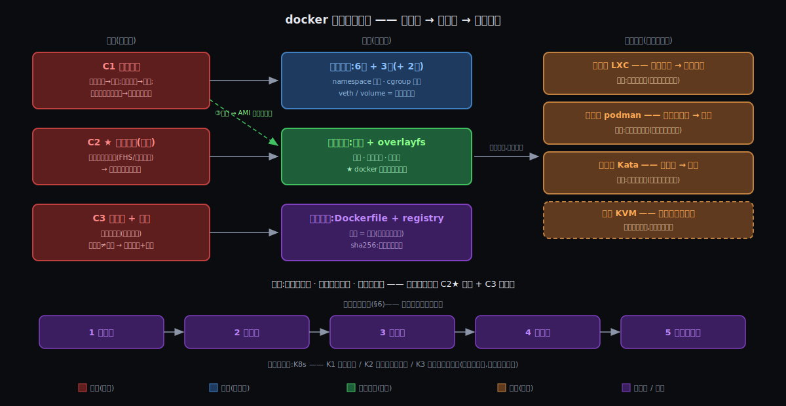

# 阶段 7:docker 的设计哲学与方法论沉淀(团队讲义版)

> 灵魂问题:"容器到底是什么?它和虚拟机的根本区别在哪?当一个容器真正跑起来的那一刻,Linux 内核里到底发生了什么?"
>
> 这是整趟旅程的最后一篇,也是唯一一篇**不教 docker 新知识**的:它把前面六站反复用到的思考路数蒸馏出来 —— 讲义的前半部分(§0~§5)把 docker 钉成一个"被约束逼出来的标本",后半部分(§6~§7)把钉标本的手法变成你们下次拆任何系统都能复用的方法。
>
> **读者口径**:默认你用过 docker(跑过 `docker run`、写过 Dockerfile)但没拆过内部;完全没碰过容器的同学,先读 §0 末尾的「五句话脚注」再回头。

## 约束清单速查(C1~C3)

> 给新同学:下面三条是这份讲义的"宪法"。它们不是 docker 的功能,而是 docker 诞生之前就压在整个行业头上的三股压力 —— 全文每个组件都会被追问"你是被哪条逼出来的"。

#### C1 — 榨干硬件
硬件必须高效用于**用户计算**。三连锁:①闲置是浪费 → 必须共享;②共享默认互害 → 必须隔离;③**隔离太贵也是浪费 → 隔离必须便宜**(③咬回①成闭环)。
**不可再分**:经济账(2008 年前后数据中心利用率 5~15%)+ 40 年全局命名生态 + 完整 OS 重资产。
**口诀**:榨干硬件 → 必须共享 → 必须隔离 → 隔离必须便宜

#### C2 ★ — 环境随行(钦点核心)
应用 = 二进制 + libs + 配置,散落在全局路径里(FHS / 动态链接生态)—— **环境长在机器上,必须打包跟应用走**。
**不可再分**:40 年 FHS/动态链接生态现实;单独只逼出 AMI(整机快照),叠加 C1③ 才坍缩成容器镜像。
**口诀**:环境是机器属性 → 必须打包随行

#### C3 — 去人化 + 验真
发布必须去人化,且机器可验真:人力不随规模扩展(O(台数×环境×频率),人是常数);字节无身份(文件名 ≠ 内容)。
**不可再分**:规模浪潮 + 存储语义(2009 年某 30 万在线 IM 的凌晨发布:2:00~6:00 窗口、几十台机器人工 md5 核对、验功能验到反编译)。
**口诀**:人不能扩容 + 文件名≠内容 → 机器接管 + 哈希验真

## §0 从对照走到收束:三件事记住

前六站各自回答了一个问题:它是什么(What)、为什么非有不可(Why)、怎么工作(How)、怎么来的(Origin)、内核里到底怎么写的(Deep)、别人怎么答同一道题(三面镜子)。收束篇把这六站压缩成**三根承重梁** —— 也是这份讲义希望每个读者带走的三句话:

1. **三条约束是 docker 的"为什么"。** 因为 C1(榨干硬件)+ C2★(环境随行)+ C3(去人化验真)三股压力在 2008~2013 年同时到位 → 要解决"谁能同时满足三条"→ docker 是**第一个全答对的**。没有约束视角,docker 的每个零件都像天才的任意发挥;有了约束视角,每个零件都是被逼出来的必然 —— 这是全篇的地基。
2. **6 墙 · 3 表 · 2 洞是 docker 的"是什么"。** 因为 C1② 共享默认互害 + C1③ 隔离必须便宜 → 要解决"一个内核上互不相害地住下 N 个应用"→ 所以 **6 扇 namespace 窗**(视图隔离:你看不见邻居)+ **3 块 cgroup 表**(用量隔离:你吃不掉邻居)+ **2 个洞**(veth 凿穿 net 墙、volume 凿穿 mnt 墙:隔离之后留下的必要通路)。"容器"在内核里**不是一个东西,而是这一组记账的合称** —— 普通进程戴上 11 件装备,就叫容器。
3. **镜像是 docker 的"凭什么"。** 因为 C2★(环境长在机器上)+ C3(字节无身份)→ 要解决"环境怎么变成可分发、可验真的制品"→ 所以**分层 + 内容寻址 + registry** 的镜像体系。这是三面镜子的终审结论:墙是借来的(内核公共件,LXC 同款),**镜像才是 docker 自己的发明** —— 把"程序和它的依赖环境一起打包"从配置管理的口号变成了一个有哈希身份的工程实体。

| 承重梁 | 是什么 | 为什么存在 |
|--------|--------|-----------|
| 三条约束 | docker 诞生前就存在的三股行业压力 | 没有它,每个组件都是"任意设计";有了它,每个组件都可被推导、可被审判 |
| 6墙3表2洞 | 容器在内核里的全部实体(隔离支柱) | C1 的解:互不相害且便宜地共享一个内核 |
| 镜像 | 环境的可分发、可验真制品(打包+运维支柱) | C2★+C3 的解,docker 唯一的原创发明,也是所有对手都继承的遗产 |

三者的关系就是讲义的叙事线:**约束(§2 每行的第二列)逼出架构(§2 每行的第一列),架构的每个选择都付了代价(第三列)、都有过备选(第四列)、都被现实里别人的选择验证过(第五列)。**

> 📌 **给新同学的五句话脚注**(老手跳过):
> ① **namespace**:内核发给进程的"视图滤镜",共 6 类,各管一类资源的**可见性**(进程列表、主机名、文件树、网络栈、IPC、用户身份)。
> ② **cgroup**:内核的用量电表 + 断路器,管 CPU/内存/IO **用多少**。
> ③ **overlayfs**:把多层只读目录"叠"成一个视图的文件系统 —— 容器的地板。
> ④ **镜像 / 层**:应用 + 全部依赖环境的只读快照,按层堆叠、按内容哈希(sha256)寻址;**registry** 是存放它的仓库,**digest** 是它的指纹身份(与名字 tag 无关)。
> ⑤ **OCI**:镜像格式与运行时的行业标准 —— 集装箱的"角件尺寸",谁都能照着造轮子。

## §1 一张极简概览图

从这张图能直接读出五件事:

1. **左→中是"逼出"关系**:C1 逼出隔离支柱(6墙3表),C2★ 逼出打包支柱(镜像+overlayfs),C3 逼出运维支柱(Dockerfile+registry+sha256)。一条虚线是关键剧情:C1③"便宜"叠加到 C2★ 上,整机快照(AMI)才坍缩成容器镜像。
2. **中→右是"验证"关系**:三面镜子各拆一根支柱 —— LXC 拆掉镜像(衰落)、podman 拆掉指挥部(照转)、Kata 换掉墙(照跑),KVM 是右半边一切物理墙的地基。
3. **绿色只给了镜像** —— 全图唯一的"原创发明"色;墙和表是蓝色的"公共件"。
4. **判词一行**:墙是公共件 · 指挥部是偶然 · 便宜会过期 —— 砸不碎的只有镜像 + 流水线。
5. **底部五步环**就是 §6 的方法论:识约束 → 列候选 → 算代价 → 看现实 → 证局部最优 —— 这张图本身就是用这五步画出来的。

## §2 五元组表:整趟旅程的浓缩(核心产物)

读表说明:每行一个设计决策;**第二列**回答"它被哪条约束逼出来"(编号见顶部速查);**第四列**是当年桌面上真实存在过的另一条路;**第五列**是现实世界里真走了那条路(或这条路)的人 —— 历史是天然的对照实验。

| # | 设计决策 | 解决的约束 | 付出的代价 | 当年的反事实候选 | 现实对照(谁真的选了) |
|---|---------|-----------|-----------|----------------|---------------------|
| 1 | **共享宿主内核**(不带厂房) | C1③ 隔离必须便宜 | 隔离弱于 VM:内核漏洞全楼连坐;内核版本钉死,换不了地基 | 每应用一台 VM(自带独立内核) | 传统 VM 一直在;Kata(2017)把 VM 改便宜后真把这条路救活了 |
| 2 | **namespace 视图隔离**(6 扇窗) | C1② 共享默认互害 | 墙是漏的(/proc 未 ns 化:512MB 容器自报 64GB);user 窗复杂难驯 | 改 Unix ABI:给一切内核对象加"租户 ID",一次性全局改造 | FreeBSD jail(2000)/ Solaris zones(2004)整体主义一次成型;Linux 选渐进拼装,2002→2013 十一年凑齐六扇窗 |
| 3 | **cgroups 用量记账**(3 块表) | C1② 资源互害 | 内存表是"杀手"不是"限速器"(超额 = OOM kill);统计≠隔离(loadavg 仍是全局的) | 调度器级硬分区(固定配额,空闲也不让) | 大型机 LPAR / 虚拟化硬切真这么干;cgroup v2 统一层级(2016)是 v1 乱象的修正案 |
| 4 | **镜像 = 分层 + 内容寻址** | C2★ + C3(字节验真) | 层不可变 → 改底层要整链重铸(缓存连坐);运行时首写整文件 copy-up | 整机快照(AMI);或配置管理(Puppet/Chef 到目的地重建环境) | AWS AMI = C2★ 单独的解(没有 C1③ 加成);LXC 的 rootfs 模板 = 干脆不解 |
| 5 | **overlayfs 联合挂载**(地板) | C2★ 层复用 + C1① 省存储 | 逐层探测查找;whiteout 墓碑;目录合并语义复杂 | 每容器全量拷贝 rootfs;或块级 CoW(devicemapper) | docker 历史上真换过一圈后端(AUFS→devicemapper→btrfs→overlay2),文件级最终胜出 |
| 6 | **Dockerfile**(环境 = 源码) | C3 可重放、可审计 | 顺序敏感,缓存连坐;无脑写法层数膨胀 | `docker commit`:手工捏好容器再快照 | commit 至今存在但被全行业视为反模式 —— "环境必须长在代码里"成了文化 |
| 7 | **registry + sha256 寻址** | C3 字节无身份 | tag(名字)与 digest(身份)双轨,`latest` 漂移坑新人 | 文件名 + 人工 md5 核对 + ftp/rsync 分发 | 2009 年那个凌晨(本篇 C3 的出处)就是这条路的代价实录;apt/yum 的 GPG 是"签名验源",仍不寻址内容 |
| 8 | **dockerd 中央守护进程** | C3 API 化流水线(2013 年生态空白,build/run/push 没人干,只能全自己干) | root 常驻单点;`docker` 组 = 免密 root;daemon 升级全节点风险 | fork-exec 无守护,进程生死交还 init | podman(2018)真这么做了且一切照转;docker 自己也把 runc/containerd 拆出去捐掉 —— 等于承认方向 |
| 9 | **一容器一进程**(应用容器) | C2★ 单位 = 应用(镜像跟应用走,不跟机器走) | 多服务要拆容器 + 编排;日志、僵尸进程、init 职责全要重新设计 | 容器当轻量 VM:墙内跑 init + 整套系统 | LXC 真走了这条路 → 活成 VPS 替代品;K8s 的 pod = 对"一进程太细"的工程修正 |
| 10 | **veth + bridge + NAT**(洞二) | C1② 网络要隔离,但服务要可达 | 八跳路径 + NAT 改写 + conntrack 账本;调试心智成本高 | `--network host` 不隔离;或 macvlan 给容器发真 MAC | host 模式在性能敏感场景真实在用;macvlan/SR-IOV 在 NFV 领域是正解 —— 洞的大小本来就是可调的 |
| 11 | **volume bind mount**(洞一) | C2★ 的边界:状态不该进镜像(镜像=制品,数据=状态) | 凿穿 mnt 墙 = 该路径放弃不可变性;Mac 上跨内核变"海关"(出名的慢) | 数据也打进镜像;或一律走网络存储 | 数据库容器化的最佳实践(named volume / 云盘 CSI)就是这行的工程展开 |
| 12 | **runc 让 C 段抢跑**(nsexec) | 内核 setns 的单线程规矩 vs Go 运行时天生多线程 | 一个项目两种语言;自指执行边界出过 CVE-2019-5736 | 整个 runtime 干脆用纯 C 写 | crun(Red Hat)真这么做了:快约一倍、内存小一个量级,podman 默认搭它 |
| 13 | **OCI 标准化**(镜像/运行时规范) | C3 在行业层面的延伸:生态去单点 | docker 公司亲手让渡垄断利益 | 私有格式继续垄断,靠先发优势收租 | 真实历史选了开放:2015 OCI 成立;Kata、podman、K8s 全靠它接入 —— 连对手都踩着你的标准打你 |

这张表怎么用:**竖着读第二列**,你会发现 13 行只挂在 3 条约束上 —— 架构的"多"是约束的"少"长出来的;**竖着读第五列**,你会发现每行都有人真走了另一条路 —— 所以 docker 的每个选择都不是"唯一可能",只是"当年价目表下的最优"。这正是 §4 要论证的事。

## §3 同构系统:这套设计哲学在哪里又出现过

> 同构 ≠ 表面相似。判据:**约束结构相同 → 解的结构相同**,而不是名词长得像。

### §3.1 git —— 镜像的同构兄弟

git 和 docker 镜像面对同一条约束(C3:字节无身份,人不能验真),给出了逐字相同的解:**内容寻址**(SHA 哈希 = 字节的身份证)+ **不可变对象**(commit/tree/blob 从不修改,只新增)+ **链式引用**(commit→tree→blob ≈ manifest→config→layers)。How 阶段那条统一律 ——「层从不被修改,只被遮盖或被替换」—— 在 git 里逐字成立:`git commit --amend` 不是修改,是重铸一个新对象、旧的留在 reflog。差异只有一处:git 寻址**源码**,docker 寻址**环境**。一句话:**docker 镜像 = 把 git 的存储哲学搬到 rootfs 上**。

### §3.2 JVM —— "国标插座"的另一次收口

JVM 的 "write once, run anywhere" 和容器的可移植性是同一道题的两个收口位置:都需要一条**窄而稳的腰**,腰以上随便搬,腰以下各管各。JVM 把腰定在**字节码**(几百条指令,向后兼容三十年);docker 把腰定在 **syscall 界面**(几百个调用,Linus 的"不破坏用户态"铁律)。代价也同构:腰以下绑死 —— JVM 应用绑 JVM 版本,容器绑 Linux 内核家族(所以 Mac 上要先造一个 Linux,见对照篇 §6.3)。差异在"厂房"谁出:JVM 自带运行时(行李里有厂房),docker 借目的地的内核(行李轻,但目的地必须有厂房)。

### §3.3 集装箱 —— 把"协调成本"打下来的标准化

(这是 What 阶段读者自创的类比,这里正式收编为同构。)ISO 集装箱的革命不在铁箱子,在**角件尺寸标准化**:箱内是什么,船、港、卡车一概不问 —— 于是承运链条的每一环可以独立竞争演化。OCI 的角色一模一样:镜像格式定死,build 工具(Dockerfile/buildah/bazel)、运行时(runc/crun/kata)、仓库(Hub/Harbor/ECR)、编排(K8s/Nomad)各自卷各自的。经济史的结论也同构(《The Box》,Levinson):集装箱降的不是搬运成本,是**协调成本** —— 对应 C3 的"去人化":码头工人(人肉运维)从流程的瓶颈位被移走了。

## §4 局部最优论证(关键段落)

> 给定约束组合 {C1, C2★, C3} 和 **2008~2013 年的价目表**,docker 形态是唯一能同时通过三道筛的设计。

逐条拆筛子 —— 每取消一条约束,最优解立刻变成别的,而且**现实里都有人真这么活着**:

- **取消 C1③(隔离不必便宜 / VM 降价了)** → 每应用一台 VM 更优,隔离更硬 → 2017 年后 microVM 真把价打下来,Kata/Firecracker 真出现,公有云 serverless 真在用。**便宜是会过期的价目表。**
- **取消 C2★(环境不必随行)** → 假如全世界都写静态链接单二进制(Go 文化),墙 + 一个调度器就够,镜像没必要存在 → Go 部署文化、unikernel 真这么活;但 40 年动态链接生态对大多数技术栈仍然成立,所以 C2★ 对行业整体仍然成立。
- **取消 C3(规模小,人肉可控)** → LXC + ssh + 配置管理完全够用 → 小团队至今真这么过,而且**是对的**(见 §7 第五步:价目表不同,最优解不同)。
- **加强 C1②(邻居从自家服务变成陌生人代码)** → runc 的逻辑墙不够厚 → gVisor/Kata 真出现,公有云跑不可信代码的场景真在用。

结论(给团队的版本):**docker 不是 2013 年最聪明的设计,而是当年约束组合下唯一全过筛的设计。** 约束变,最优点就漂移 —— 但注意漂移的方式:墙被换过(Kata)、指挥部被拆过(podman)、单位被改过(K8s pod),唯独**镜像 + 流水线(C2★+C3 的解)被每一个后继者原样继承**。必然的部分留下来,偶然的部分被替换掉 —— 这就是"局部最优"四个字的全部含义。

### §4.1 预演一个反驳:"namespace 才是核心,没有隔离一切免谈"

(分享会上大概率有人这么说 —— 这里给出接法;观点来自本讲义的第一位读者。)

- **先认一半**:"没有隔离一切免谈"是对的 —— 隔离是容器的**必要条件**。
- **再驳一半**:但到 2013 年,墙早就是人人有份的公共件 —— LXC(2008)用着同款 6 墙,OpenVZ(2005)、FreeBSD jail(2000)、Solaris zones(2004)更早;docker v0.1 的墙干脆就是借 LXC 的。**必要条件不参与决胜:人人都有的牌,决定不了谁赢。**
- **决胜在哪**:在还没人解决的约束上 —— C2★(环境随行)+ C3(去人化验真)。docker 补齐的"产品最后一公里"(镜像 + `docker run` 一条命令 + pull/push),用约束语言说就是:**抢答了最后一条未解约束**。Origin 站的判词原样搬来收口:镜像 = 价值,`docker run` = 传播系数。
- **顺手捞出一条方法论**:"容易使用、容易理解"不是市场包装,它本身是一条真约束 —— **采纳约束**(认知成本 / 迁移成本)。反例现成:zones 技术上比 Linux 六扇窗优雅(一次成型、语义自洽),但长在 Solaris 上,采纳约束直接判了死刑。识约束时别只盯技术 —— 五步法第一步因此补一句(见 §6)。

## §5 时代局限与演化:化石如何被逐步置换

| 2013 年的形状 | 为什么当年合理 | 后来怎么被置换 |
|--------------|--------------|--------------|
| dockerd 全家桶(build/run/push/网络/日志一个进程全干) | 生态空白,不自己干没人干 | 2015 OCI 立标准;runc、containerd 先后拆出捐掉;podman 证明零守护也能转 |
| 墙是漏的(/proc 不分户) | namespace 是渐进拼装,没人有权改 Unix 全局语义 | LXCFS 打补丁;JVM `UseContainerSupport` 应用自救;Kata 干脆换楼(guest 内核天然诚实) |
| 安全模型按"邻居是自家服务"设计 | 2013 年容器主要在自家机房互相挤 | 公有云时代邻居变陌生人 → seccomp/AppArmor 加固;gVisor 假内核;Kata 物理墙 |
| swarm 想连编排一起垄断 | 平台公司的自然冲动 | 输给 K8s(2017 年认输内置 K8s 支持)—— docker 守住了"单位"(镜像/容器),丢掉了"舰队" |
| Mac/Win 开发体验靠"偷塞 VM" | 逻辑墙只认 Linux 内核,别无他法 | 三代文件撬棍(osxfs→gRPC-FUSE→virtiofs);WSL2;2025 年 Apple 亲自下场给每容器一台 microVM |
| Docker 公司 ≠ docker 技术 | 创业公司要养活自己 | 2019 企业业务卖给 Mirantis,公司沉浮;但镜像格式、registry 协议、Dockerfile 语义全部永生 —— **引擎会死,标准不死** |

这张表的读法:左列没有一项是"错误",全是**当年价目表下的合理解**;右列也没有一项是"打脸",全是**价目表变化后的重新求解**。技术史不是对错史,是约束变迁史。

## §6 方法论沉淀:五步法(可推广)

把整趟旅程的手法收成五步 —— 下次任何新技术砸过来,按这五步拆:

1. **识约束** —— 找"不可再分"的事实:经济现实、生态惯性、语义铁律、规模物理。问两个问题:"哪些约束是它诞生前就存在的?哪一条是**钦点的心脏**(没有它这个东西就不必存在)?"
   *docker 实例:C1/C2★/C3;心脏是 C2★(LXC 反证:有墙没镜像 = 另一个物种)。*
   *口诀:先找压力,再看产品。*
   *增补(来自 §4.1,读者贡献):识约束别漏**采纳约束**(认知 / 迁移成本)—— 它决定"技术更优"与"真被用上"之间的生死。*
2. **列候选** —— 每条约束至少列两个解法,**包括"不解决"**(不解决也是一种解,LXC 对 C2★ 就选了不解决)。
   *口诀:没有候选的设计叫信仰,不叫工程。*
3. **算代价** —— 每个候选违反哪条约束、付出什么。**写不出代价 = 没看懂**(任何决策都有代价;"几乎没有缺点"是分析失败的标志)。
   *docker 实例:共享内核换便宜,代价是连坐 + 版本钉死 —— 五元组表第三列整列都是。*
4. **看现实** —— 历史和竞品是**天然对照实验**:谁真走了另一条路?活得怎样?活着的反例比推理值钱。
   *docker 实例:三面镜子 + KVM —— 每个"另一条路"都有人真走,且都活着,只是活在不同的约束权重里。*
5. **证局部最优** —— 收口问题:"在它出生年代的价目表下,它是不是唯一全过筛的?**哪条约束的时价一变,最优点就会漂?**"答得出后半句,你就拥有了预测它被谁颠覆的能力。
   *docker 实例:C1③ 的"贵"贬值 → Kata 出现;C1② 的"互害"升值 → gVisor 出现 —— 全部命中。*

拆新系统时的**提问模板**(直接抄去用):

> ① 它诞生前,世界疼在哪?(约束)
> ② 当年桌上还有哪几张牌?(候选)
> ③ 它选的这张,亏在哪?(代价)
> ④ 选别的牌的人,现在活得怎样?(现实对照)
> ⑤ 什么条件一变,它就该被换掉?(局部最优的边界)

## §7 现场泛化:用五步法拆 K8s(速写)

> 这一节的目的不是讲透 K8s(那是下一趟的事),而是**当场演示五步法换一个系统照样转**。

**第一步,识约束。** docker 解决了"一台机器上的一个容器",它的成功本身制造了三条新约束 —— 注意这个结构:**上一层的解,是下一层的题**:

- **K1 — 容器会死**:进程会崩、节点会宕,而 C3(去人化)说了"不能靠人盯着重启" → 必须有东西自动把"应该跑着的"和"实际跑着的"对齐。
- **K2 — 容器要互相找到**:容器 IP 随生死漂移(对照篇里那个 172 网段是临时门牌),跨机器的服务发现不能靠人改配置 → 必须有稳定的名字层。
- **K3 — 舰队规模超过人**:几百节点 × 几千容器,O(容器数 × 变更频率)的操作量,人是常数 —— 这就是 **C3 的舰队版**,docker 把单兵去人化了,舰队还没有。

**第二步,列候选。** K1:人肉值班 / cron 重启脚本 / 中央调度器**声明式调和**(你声明"要 3 个副本",控制器循环把现实掰成声明)。K2:静态配置文件 / DNS 轮询 / 注册中心 + 虚拟 IP。K3:命令式脚本批量执行("做这 10 步") vs 声明式("变成这个样子",剩下的系统自己想)。

**第三步,算代价。** K8s 在每一格都选了"声明式 + 调和环",代价是**复杂度怪兽**:etcd 共识存储、一打 controller、抽象层级(pod→deployment→service→ingress)陡峭得劝退;小集群里这套机器比业务本身还重。代价写不出来的同学,回去看 §6 第三步。

**第四步,看现实。** swarm 选了"简单优先"(docker 自家,命令式倾向、内置开箱即用)—— 输了,因为它的简单在 K3 的规模下不够用;Nomad 活在"够简单"档,活得不错;各云的托管服务(ECS 等)选"复杂度外包给云商"。**没有谁错,各自活在不同的价目表里。**

**第五步,证局部最优。** 在 Google 级规模的价目表下(K3 权重拉满),声明式调和是唯一全过筛的 —— 这正是 Borg 十年经验的结晶。但把价目表换成"三人团队五个服务":K8s 是**过度设计**,docker-compose 才是那张价目表下的局部最优。**同一个方法,两张价目表,两个最优 —— 方法论的意义不是告诉你"用 K8s",是告诉你"什么时候不用"。**

收口:K8s 里的 pod / 控制器 / Service,大概就是下一趟旅程的"6墙3表2洞"。**留给团队的三道练手题**(用 §6 的提问模板):① epoll → io_uring:什么约束的时价变了?② Kafka 的"日志即真相":被哪条不可再分的事实逼出来的?③ Redis 的 RDB vs AOF:两张价目表各是什么?

## §8 约束回扣:收束篇的产物对账

| 本篇产物 | 蒸馏自哪几站 | 回扣哪条约束 |
|---------|-------------|-------------|
| 三根承重梁(§0) | Why(约束)+ How/Deep(架构)+ Origin/对照(镜像终审) | C1~C3 全部 |
| 五元组表 13 行(§2) | 全部六站 | 第二列逐行标注,13 行只挂 3 条约束 |
| 同构系统(§3) | How 的 git 类比 + Why 的国标插座 + What 的集装箱 | C3 / 接口稳定性 / C3 |
| 局部最优论证(§4) | 对照篇三面镜子 + Origin 时间线 | 三条约束的"时价"各自变动的后果 |
| 演化表(§5) | Origin + 对照篇 | 约束变迁 → 结构置换 |
| 五步法 + K8s 速写(§6~§7) | 整趟旅程的手法本身 | 方法层:约束 → 决策 → 代价 → 对照 → 最优 |

验证方式和前几站一样:任何一行如果摘掉约束列还能成立,说明那行写的是"知识点"而不是"推导"—— 欢迎团队按这个标准挑刺。

## §9 呼应灵魂问题(100% 闭环)

> "容器到底是什么?它和虚拟机的根本区别在哪?当一个容器真正跑起来的那一刻,Linux 内核里到底发生了什么?"

给团队三个版本的最终答案,按场合取用:

**电梯版(30 秒)**:容器不是轻量虚拟机 —— 它是**带着全部环境、可哈希验真、一次性进驻的普通 Linux 进程**。它和 VM 的根本区别有两条轴:用谁的内核(墙),环境怎么走(行李)。docker = 共享内核 × 镜像随行;VM = 独立内核 × 整机快照 —— 差两条轴,所以一维语言吵了十年。

**工程版(2 分钟)**:`docker run` 落下的瞬间,内核里发生三组事:① `clone` 带六面 flag,新进程领到 6 扇视图窗(看不见邻居);② 进程被挂进 cgroup 三块表(吃不掉邻居);③ overlayfs 把镜像的只读层叠上一层可写层当 rootfs,veth 一头插进容器一头插上网桥(地板与门)。从头到尾**没有任何"虚拟机"被创建** —— 只有一个被精心记账的进程。镜像那头,sha256 保证你跑的字节就是 CI 产出的字节 —— 这一半(打包与验真)才是 docker 的原创。

**哲学版(给愿意多想的人)**:墙是内核的公共能力(LXC 同款、Kata 搬走照用、KVM 是另一套),指挥部是 2013 年的化石(podman 拆给你看),连"便宜"都是会过期的价目表(microVM 正在过期它)。docker 真正留给世界的,是**让环境随行、让机器验真**这两件事的工程标准 —— 镜像与流水线。一句话:**容器技术的本质,是 Linux 内核的隔离原语 + 一场关于"软件如何交付"的标准化革命;前者人人有份,后者才叫 docker。**

灵魂问题至此闭环 **100%**:Deep 站收到 95%(内核里发生了什么,逐行源码),对照篇收到 98%(和 VM 的根本区别,2×2 终审),最后 2% 是"怎么把这套思考带走"—— §6 的五步法和 §7 的演示,就是这 2%。**这趟旅程教的不是 docker,是"下次不需要这趟旅程"。**

## 修订记录

| 时间 | 修订摘要 | 触发原因 |
|------|---------|---------|
| 2026-06-05 | 初稿:团队讲义版收束 —— 三承重梁(用户钦点)+ 五元组表 13 行 + 同构×3(git/JVM/集装箱)+ 局部最优论证 + 演化表 + 五步法 + K8s 现场泛化 + 三版本灵魂答案 | 开场对齐收敛:教学口径 / 混搭团队 / 泛化套 K8s / 详尽讲义版 |
| 2026-06-05 | 新增 §4.1 预演反驳「namespace 才是核心」的接法(必要条件不参与决胜 / 决胜在最后一条未解约束 C2★+C3 / 镜像=价值、docker run=传播系数;署读者观点);§6 第一步增补"采纳约束" | 用户答收束探针:产品化补齐最后一公里(镜像)才是胜负手 —— 精确化后收编进讲义 |
