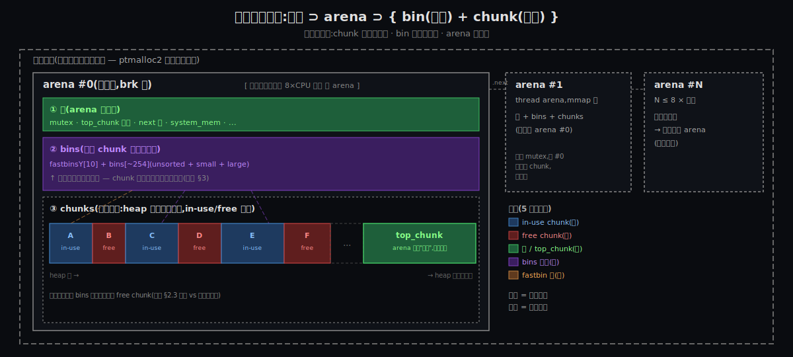
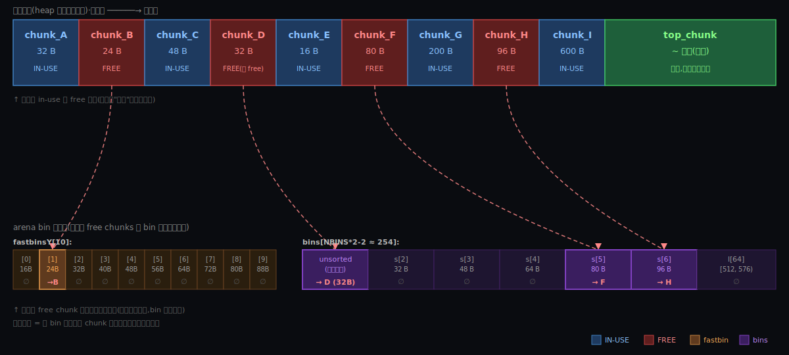
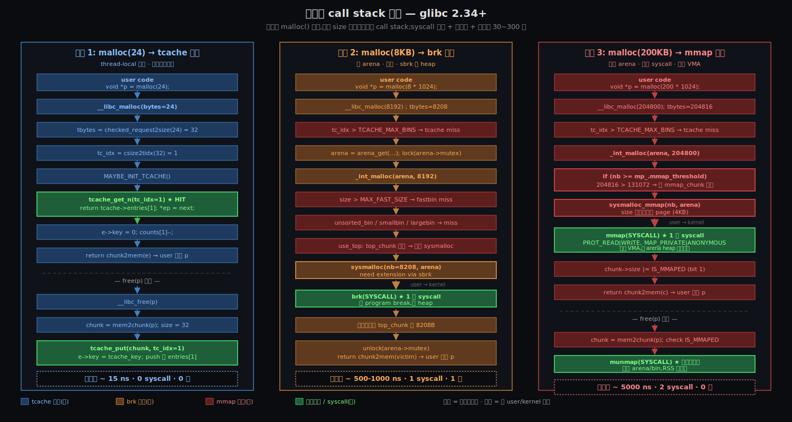
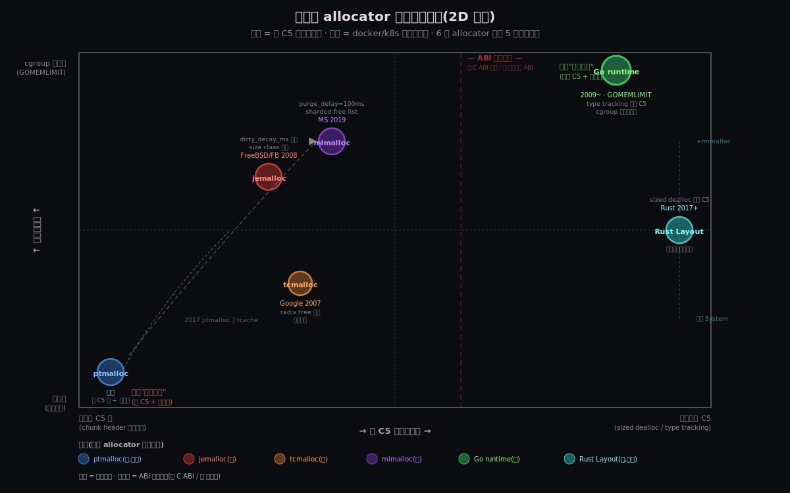
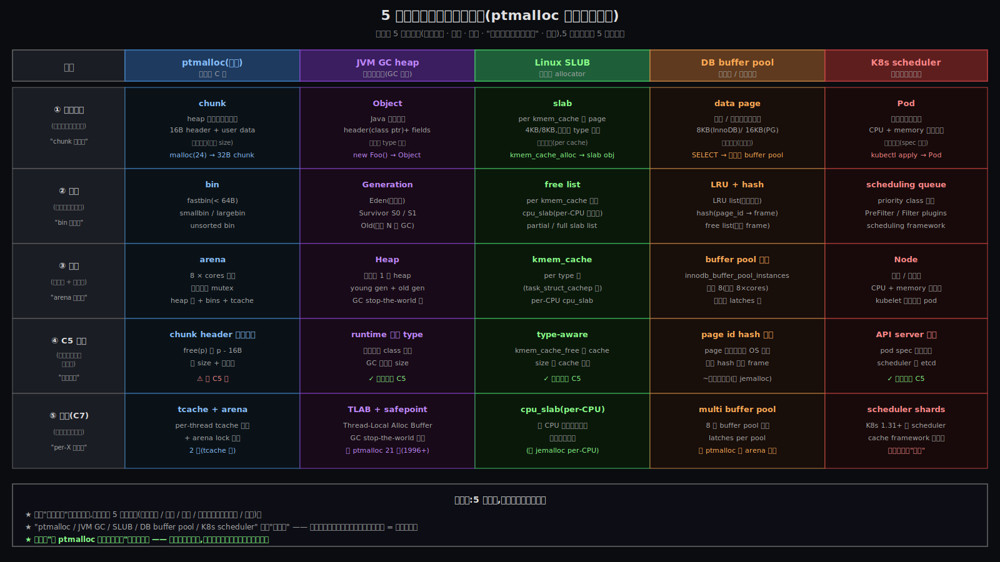

# glibc 的 malloc 函数 | atlas 综合长文

> 一份用 ptmalloc 做案例的工程方法论 —— 7 条约束 / 三件事 + tcache / 三条主路径 / 5 个 allocator / 4 个跨领域同构 / 4 条工程教训 / 一套五步法

---

## 导读地图

本文是 atlas 苏格拉底式技术教学的**最终融合产物**,围绕**第一性原理**展开,陪你一阶段一阶段把 glibc malloc 搞透,最终带走**看任何技术系统的 4 条工程教训**。

### 灵魂问题(Discovery 收集,贯穿全文)

> **"malloc 要解决的工程问题是什么?"**

走完全文你会从 6 个角度立体回答这个问题,并且发现 ——**真正值钱的不是 malloc 知识,是从 ptmalloc 提炼出的 4 条元工具**。

### 覆盖的 7 个阶段

| 阶段 | 它讲什么 | 篇幅 |
|------|------|----|
| **What** | 是什么(轮廓 + 类比 + 邻居) | ~190 行 |
| **Why** | 为什么必须存在(约束清单 C1~C7) | ~180 行 |
| **How** | 大致怎么工作(三件事 + tcache + 5 步流程) | ~840 行 |
| **Origin** | 是怎么来的(40 年三代叠加) | ~880 行 |
| **Deep** | 真实 call stack(三条路径源码追踪 + 反事实) | ~830 行 |
| **Comparison** | 跟 jemalloc / tcmalloc / mimalloc / Go runtime / Rust Layout 横向对比 | ~700 行 |
| **Synthesis** | ★ **4 条工程教训 + 五步法 + 跨领域同构** | ~530 行 |

### 阅读路径建议

读者类型不同,**建议路径不同**:

- **第一次接触 ptmalloc** → 顺读(What → Why → How → Origin → Deep → Comparison → Synthesis)
- **想快速建立心智** → 看 [What](#-第一篇whatglibc-的-malloc-是什么) + [Why](#-第二篇why--为什么必须存在)(~30 分钟)
- **想看清设计为什么这样** → 看 [Why](#-第二篇why--为什么必须存在) + [Deep](#-第五篇deep--三路径源码追踪) + [Synthesis](#-第七篇synthesis--4-条工程教训--五步法)(~60 分钟)
- **想横向对比 6 个 allocator** → 直接看 [Comparison](#-第六篇comparison--5-个-allocator-全景对比)(~25 分钟)
- **想拿走方法论(最值钱的)** → 直接看 [Synthesis 第 7 节](#7--4-条工程教训看任何技术系统时不要犯的错)(~15 分钟)

### 全文导览

下面 7 篇按顺序展开,**每两篇之间有 80~150 字的过渡段**,做心智模式切换 —— 让你跟着叙事节奏从"游客"切换到"论证者"切换到"工程师"切换到"哲学家"。

---

## 约束清单速查(C1~C7)

> 后文所有 `Cn` 引用都对应下面 7 条;**各篇章不再重复列**。这 7 条约束是 atlas 全文的"脊梁",在 Why 阶段建立,后续所有阶段交叉引用。
>
> **怎么跳转**:每个 Cn 是 markdown 标题(自动锚点),后文用 `[C1](#c1)` 等链接跳转;outline 中也直接看到 7 条。

#### C1 — 高频小块

应用对动态内存的请求是**高频小块**:每秒 10⁵~10⁷ 次,典型 16~256 字节。
**不可再分**:C++ / 现代脚本运行时的语义现实。
**口诀**:量大频高 → 必须 O(1) 快

#### C2 — syscall 贵

**syscall 至少几百 ns**,比函数调用贵 2 个数量级。
**不可再分**:CPU 特权级机制(SYSCALL/SYSRET、ring 切换)本身的代价。
**口诀**:进内核贵 → 必须批量摊薄

#### C3 — brk 中间还不掉

**`brk` 只能移动 program break**,heap 中间块还不掉。
**不可再分**:brk 语义就是改一个 long,无"还任意一块"能力。
**口诀**:中间还不掉 → 用户态自己攥着

#### C4 — mmap 整页

**`mmap` 最小粒度是一整页**(常见 4 KB)。
**不可再分**:CPU MMU 页表项最细粒度就是一页。
**口诀**:整页 → 小块走它必浪费

#### C5 — free(p) 不传 size

**`free(p)` 只接受指针,不传 size**。
**不可再分(精度升级)**:**技术 + 生态复合** —— 1989 ANSI C ABI + 接口共存让 allocator 必须 worst case 兼容(C23 已加 free_sized 但拿不到精简)。新语言(C++17 / Rust)可消解。详见 Deep §2.4.5。
**口诀**:不传 size → 必须每块自带元数据(C 内锁死,新语言可破)

#### C6 — 碎片必然

**长跑应用必然产生碎片**。
**不可再分**:Knuth 50% 规则 —— 一旦决定复用空闲块,数学上必然出现碎片。
**口诀**:碎片必然 → 必须有合并机制

#### C7 — 多核并发

**必须支持多线程并发分配/释放**。
**不可再分(精度升级)**:**时代性约束** —— 1996 浮现(POSIX threads),2017 加深(多核普及),2026+ 在 async 反向演化(OS 线程 ↔ 协作 task)。详见 Origin §5.5。
**口诀**:多核 → 必须减锁竞争

---

# 📍 第一篇:What — glibc 的 malloc 是什么

# 阶段 1:glibc 的 malloc 函数是什么

## 一句话定义

> **glibc 的 malloc:用户态分配器,把内核给的大块虚拟内存切成可复用的小块交给应用。**

(34 字。每个修饰语都不可省。**用户态** —— 它跑在你的进程里,不在内核;**分配器** —— 它真的从无到有把字节切出来给你;**切成小块** —— 输入是大块,输出是小块;**可复用** —— 这是它存在的全部理由,不复用就直接调内核了。读完这一行你应该已经能跟同事用一句话复述。)

---

## 跨领域类比:酒店前台

设想一个酒店,只有一个前台(malloc)。

- **客人入住**(`p = malloc(24)`):前台从空闲房间里挑一间够住的,登记后给客人钥匙(返回指针)。
- **客人退房**(`free(p)`):前台把房间标记空闲,挂回空闲表 —— **不会马上拆掉这间房**。
- **酒店满员**:前台打电话给建房公司(内核)请求加盖,然后继续接客。

为什么不让客人每次都直接找建房公司?因为建房公司一次受理要走"签合同 → 批地 → 施工"(陷入内核态、查改页表、可能触发缺页),开销跟"前台翻一下登记本"差几个数量级。**前台的整个存在意义,就是把"重复的小事"挡在建房公司门口。**

这个类比贴切的地方:**复用 / 本地空闲表 / 避免每次进内核 / 不立即归还** —— glibc malloc 的核心设计都能在这里找到对应。

(等走到机制阶段,这个酒店还会"开分店、给 VIP 走别墅通道" —— 那是细节层的事,先不引进来,免得骨架还没立稳就塞器官。)

---

## 一张全景图(只画三层)

```
            ┌─────────────────────────────────────────┐
            │              应用程序                     │
            │   p = malloc(24);   ...   free(p);       │
            └────────────┬────────────────────────────┘
                         │  调用 libc.so.6 提供的符号
        ──────────────────────────────────── 用户态 ──
            ┌────────────▼────────────────────────────┐
            │           glibc 的 malloc                 │
            │       (内部我们先当黑盒处理)               │
            └────────────┬────────────────────────────┘
                         │  调用内核接口拿/还内存
        ──────────────────────────────────── 内核态 ──
            ┌────────────▼────────────────────────────┐
            │              Linux 内核                   │
            │   brk()  ── 调整 heap 段的末尾位置         │
            │   mmap() ── 申请一块匿名内存               │
            └─────────────────────────────────────────┘
                       进程虚拟地址空间
```

读完这张图,你应该能指着说:

- **这一层是 malloc**:站在应用和内核之间,是用户态的薄薄一层。
- **它向下跟内核打交道**:走 `brk` 或 `mmap` 两条通道。**为什么是两条而不是一条**,后面会展开,先记住"有两条"。
- **它向上给应用切小块**:应用拿到一个指针,不需要操心"内存从哪来"。
- **它内部什么样,先当黑盒**:你只要知道里面会**记账"哪些切出去了 / 哪些空闲可复用"** —— 细节后面再讲。

---

## 关键词速查表(只 4 个)

| 术语 | 一句话说明 |
|------|-----------|
| **malloc(n)** | "给我 n 字节内存" 的请求,返回一个指针 `p` |
| **free(p)** | "我用完了,还给你" 的请求 —— **注意它只传指针,不传大小** |
| **chunk** | malloc 切给你的"那一小块"的内部叫法;指针 `p` 指向 chunk 的"内容区",但 chunk 自己还带一点"记账信息"(后面机制阶段讲) |
| **heap** | 进程虚拟地址空间里**专门给 malloc 用的那一段**;malloc 通过 `brk` 调整它的边界 |

其他名字(arena / bin / 各种阈值 / ptmalloc2)**先按住不表**,后面机制层会按需一个一个引进来 —— 现在攥住这 4 个就够画骨架了。

---

## 它在系统里的位置(邻居图)

```
   上层(谁在调用):
     C 代码:        malloc / calloc / realloc / free
     C++ 代码:      operator new / delete (默认走 malloc)
     脚本语言:      Python / Lua / Ruby 的对象分配最终也落到这里

   ▼ 本主题 ▼
     glibc 的 malloc(实现叫 ptmalloc2,Wolfram Gloger 写的)

     平行的(同一组 malloc/free 接口的可替换实现):
       jemalloc      FreeBSD,Facebook 大量使用
       tcmalloc      Google,Chrome / gRPC
       mimalloc      Microsoft,2019 后起之秀

   下层(它依赖谁):
     Linux 内核 syscall:brk / mmap / munmap
```

---

## 一件反直觉的事(后面会重点回扣)

> **`free(p)` 默认只是把内存还给 malloc,内核根本不知道你 free 了。**

进程的 RSS(常驻内存)不会因为 `free` 立即下降。生产里你常听到的"我明明 free 了,top 里 RSS 怎么纹丝不动" —— 不是内存泄漏,是 malloc 故意攥着不放,等下次 `malloc(...)` 来复用。

这件事先记下,**它正是下一轮要拷问的核心动机之一**。

---

## 如果朴素地"每次都直接进内核"会怎样

(本节由对话凝固 —— 用户主动推断出朴素方案的崩塌点,这里把零散观察拧紧成三件事,作为下一轮约束清单的入口。)

设想一个"朴素 malloc":每次 `malloc(n)` 都立即调 `brk` / `mmap` 跟内核要 n 字节,每次 `free(p)` 都立即调 `munmap` 还给内核。它会撞上**至少三件事**:

### ① syscall 开销吞掉性能(数量级问题)

| 操作 | 量级 |
|------|------|
| 一次 brk / mmap syscall | 几百 ns ~ 几 µs(还要算缺页处理、页表更新、TLB) |
| malloc 在最快路径上 | 几十 ns |
| 差距 | **1~2 个数量级** |

一个对象密集的 C++ 服务每秒做百万次分配/释放,朴素版直接被 syscall 漩涡吞掉。**malloc 存在的第一条理由,就是把"重复的小事"挡在内核门口。**

### ② brk 接口根本还不掉 heap 中间的内存(接口物理限制)

`brk` 这个 syscall 的语义**只有一个** —— "移动 heap 段末尾的那条线"(上推扩张 / 下拉收缩)。它**无法**把 heap 中间的某一块单独还给内核。

```
   高地址 ─┤
           │  ░░░░░░░░░░ ← heap 末尾(brk 移动的就是这条线)
           │  ▓▓▓▓▓▓ chunk C(在用)
           │  ░░░░░░ chunk B(刚 free 了 —— 但还不掉!)
           │  ▓▓▓▓▓▓ chunk A(在用)
           │  
   低地址 ─┘
```

要还 chunk B?**没办法** —— 除非 C 也 free 了,把末尾下面的所有内存都空出来,再整体 brk 回缩。**这不是"软件复杂"问题,是 brk 接口的物理限制**。

→ 这逼出两件事:
- 必须存在**第二条向下的通道**(`mmap` —— 它能在任意位置申请/释放匿名内存,没有"中间还不掉"的问题)
- `free(p)` 默认**不立即还内核**(因为很多时候根本还不了),只是回收到内部空闲表等下次复用

**附:brk vs mmap 的本质区别(由对话凝固)**

| 维度 | brk | mmap |
|------|-----|------|
| **操作的虚拟地址区域** | program break 这条线(就是 heap 段末尾) | 任意位置 —— 通常落在 heap 与 stack 之间的"mmap 区域",64 位系统上地址比 heap 高一大截 |
| **申请方式** | 移动 program break —— 单调线性,只能从末尾扩张/收缩 | 在任意空闲位置申请一块**整页对齐**的匿名 VMA |
| **释放方式** | 只能从末尾整体回缩;**中间块根本还不掉** | `munmap` 可还任意一块,**没有"还不掉"的问题** |
| **粒度** | **字节级**(理论上,实际会对齐) | **整页**(通常 4 KB),小请求会浪费 |
| **对内核记账的开销** | 改 program break 那一个值,便宜 | 新增/删除一个 VMA 表项,贵一些 |

**结论**:malloc 必然需要**两条向下的通道** —— **brk 服务高频小块**(便宜、字节级),**mmap 服务大块和"必须能还"的场景**(可任意位置释放,但每块至少一页)。具体阈值在哪、何时切换,是后面机制层的事。

### ③ 碎片(fragmentation)随时间累积(状态空间问题)

即使解决了前两件事,长跑的分配器还要面对碎片 —— 应用反复"分配 24 / 释放 24 / 分配 80 / 释放 80",heap 里布满大小不一的洞;新来一个 100 字节请求,内部空闲表里有上万个洞,**得有一套机制找够大的合并起来**,否则又只能 brk 扩张。

→ 这逼出 malloc 的内部记账机制(空闲表 / 合并 / 拆分 / 分桶找最佳匹配)。

---

这三件事**合起来逼出了 malloc 的形状**:**复用 + 一套处理碎片的内部记账 + 一个比"立即还内核"更聪明的释放策略 + 两条向下的通道(brk 和 mmap)**。下一轮我们会把它们拆成精确的不可再分约束 **C1, C2, ...**,然后用这些约束去推 malloc 必然长成什么样。

---

## 呼应灵魂问题

你的灵魂问题是:**"malloc 要解决的工程问题是什么?"**

到这里,我们刚刚画出了 malloc 的骨架:

- 它**站在哪里** —— 应用与内核之间的用户态薄层
- 它**对外做什么** —— `malloc(n)` 给内存,`free(p)` 收回
- 它的**内部我们暂时当黑盒** —— 知道里面"会复用"就够了
- 它**向下做什么** —— 通过 brk / mmap 两条通道跟内核打交道

但骨架不回答"它**为什么**要这样长出来"。下一轮的核心就是这个 —— 我们要回到原点想:**没有 malloc 的世界会怎样?如果应用每次都直接 `brk` 或 `mmap`,会撞上哪些不可绕过的工程约束?** 那些约束会被一条一条编号(C1, C2, ...),贯穿后续所有讨论;你今天看到的"黑盒"组件,届时会一个一个对应到清单里某条具体约束。

> 一句话:这一轮我给你看了 malloc "是什么形状",**下一轮才正面回答** —— 它"为什么必须长成这个形状"。

---


---

> **🔄 心智切换:讲解员 → 论证者(共情模式)**
>
> 上面我们用一张地图建立了对 malloc 的骨架认知 —— 它是什么、它的"邻居"是谁、关键词速查表。但**只看地图无法理解它的存在意义**。
>
> 下一篇我们要回到原点:**没有 malloc 的世界会怎样?它面对的不可再分约束是什么?** 接下来你会从游客模式切换到共情模式 —— 跟着 1980s 的 C++ 工程师当年的痛苦一起,理解这个技术为什么必须存在。建立这种"共情",是后面 5 篇所有设计决策能落地的前提。

---

# 📍 第二篇:Why — 为什么必须存在

# 阶段 2:glibc 的 malloc 函数为什么必须存在

## 没有它的世界

把上一轮你自己推出来的"朴素方案"放回三个真实场景里看,代价就具体了。

### 场景 1:HTTP 服务器,每秒 10 000 个请求

每个请求里:1 个解析 buffer(200 字节) + 1 个 request context(80 字节) + 3 个临时字符串(各几十字节)。
平均算下来:**每个请求 5 次 malloc / 5 次 free**。

每秒 = **100 000 次 syscall**。一次 `brk` 在现代 Linux 上保守按 300 ns 算(还没算可能的缺页处理):

```
100 000 次/秒 × 300 ns = 30 ms/秒
```

**单核 3% 的 CPU 时间纯花在 syscall 上**(没干任何业务逻辑)。这个数字再考虑缺页处理 + 调度抖动,翻倍到 5%~10% 是常态。一个 32 核服务器的总损失够你白白扔掉 1~3 个核心。

### 场景 2:C++ STL 密集型应用(图算法 / NLP / SQL 优化器)

`std::vector` 反复 `push_back` 触发 reallocate,`std::map` / `unordered_map` 节点频繁插入删除,临时 `std::string` 满天飞。这类应用每秒**数百万次**分配/释放是日常。

朴素方案:每秒几百万次 syscall = 单核**几乎完全花在 syscall 上,业务逻辑跑不动**。这不是"性能差",是**根本不能跑**。

### 场景 3:`free(p)` 这个接口本身的悖论

C 标准早在 1989 年就把 free 的签名固化了:

```c
void free(void *ptr);
```

**只有指针,没有 size**。如果朴素 malloc 想"立即把这块还给内核",它得调 `munmap(ptr, size)` —— **可它根本不知道 size 是多少**。

→ 朴素方案根本写不出来。malloc 必须**自己**记住每块多大,这条记账是 C 接口逼出来的。

---

## 它面对的不可再分约束(《约束清单》)

把上面的痛苦拆成不可再分的"硬地基" —— 后面所有讨论都会回扣这张表的编号。

| # | 约束 | 来源 | 不可再分性 |
|---|------|------|----------|
| **C1** | 应用对动态内存的请求是**高频小块**(每秒 10⁵ ~ 10⁷ 次,典型大小 16~256 字节) | 经验事实(应用工作负载) | 这是 C++ / 现代脚本语言运行时的语义现实,不能假设它"少一点" |
| **C2** | 用户态 ↔ 内核态的一次 syscall 至少 **几百 ns**,比纯函数调用贵 **2 个数量级** | CPU 架构(SYSCALL/SYSRET、ring 切换)+ 内核 syscall 入口处理 | CPU 特权级机制本身就有这个代价,无 syscall 设计无法绕过 |
| **C3** | `brk` 接口**只能移动 program break**(单调线性扩张/收缩),**heap 中间的块根本还不掉** | Linux 内核 mm_struct 实现 + UNIX V6 起的历史 ABI | brk 的 syscall 语义就是"修改一个 long 值",没有"还任意一块"的能力 |
| **C4** | `mmap` 接口的最小粒度是**一整页**(常见 4 KB) | CPU MMU 的页表机制 | 页表项的最细粒度就是一页;< 4 KB 的请求走 mmap 必然有 90%+ 浪费 |
| **C5** | `free(p)` 接口**只接受指针,不传 size** | 1989 ANSI C 标准固化的 ABI | 跨实现兼容、跨年代固化,任何 malloc 实现都改不了这个签名 |
| **C6** | 长跑应用**必然产生碎片**(free 出大小不一的洞,新请求拼不进去) | 应用语义 + 算法理论(Knuth 50% 规则) | 一旦决定复用空闲块,数学上必然出现碎片;不可绕过,只能管理 |
| **C7** | 多核时代,malloc 必须支持**多线程并发分配/释放** | CPU 多核普及 + 现代应用普遍多线程 | 既然 CPU 给你多核,应用就用,malloc 内部状态必须有锁;锁竞争会成新瓶颈 |

每条都通过了"不可再分"测试 —— 写不出"再往下钻一层"的物理或语义原因,就说明它够基础了。

---

## 它的核心 insight

把上面 7 条约束的张力拧在一起,glibc malloc 的核心 insight 可以浓缩成一句话:

> **"用户态记账,批量向内核要,延迟向内核还,双通道分粒度,多池减并发竞争。"**

拆开就是 5 个动作,每个对应一组约束:

| insight 动作 | 对应约束 | 化解方式 |
|--------|---------|---------|
| **用户态记账**(每个 chunk 内联 header,记录 size + 标志) | **C5**(free 不传 size) + **C6**(碎片要管理) | 不依赖内核知道 size;在用户态维护空闲表 |
| **批量向内核要**(brk 一次扩一大段,后续切小块给应用) | **C1**(高频小块) + **C2**(syscall 贵) | 把 syscall 固定开销摊到上千次 malloc 上,平均每次 ~几十 ns |
| **延迟向内核还**(free 默认不还,挂回空闲表等复用) | **C2**(syscall 贵) + **C3**(brk 还不掉中间) | 一是 syscall 贵不愿,二是 brk 物理上根本还不了中间块 |
| **双通道分粒度**(小块走 brk 字节级,大块走 mmap 整页) | **C3**(brk 限制) + **C4**(mmap 4KB 浪费) | 用 brk 的字节级粒度服务高频小请求,用 mmap 的"任意位置可还"服务大块 |
| **多池减并发竞争**(主线程一个池,其他线程按需分配新池) | **C7**(并发) | 把单一全局锁拆成多个池锁,降低线程间竞争 |

---

## 这个 insight 怎么"逼出"了 malloc 的形状

注意"insight → 形状"是**单向必然**的关系,不是设计师的偏好选择:

- **既然要用户态记账**(C5+C6 强制) → **chunk 必然有 header**(因为没别的地方记 size)
- **既然要批量要 + 延迟还**(C1+C2+C3) → **必然有"内部空闲表"**(被还回来的 chunk 挂在哪)
- **既然要管碎片**(C6) → **空闲表必然要分桶**(否则每次找够大的块就是 O(n))
- **既然要双通道**(C3+C4) → **必然有阈值**(多大走 mmap,多小走 brk)
- **既然要多池**(C7) → **必然要解决"线程到池的映射"**(怎么决定新线程用哪个池)

→ 你今天看到的 `arena` / `bin` / `chunk header` / `top_chunk` / `M_MMAP_THRESHOLD` —— **全部是这 7 条约束加上"用户态记账 + 批量要/延迟还 + 双通道 + 多池"这个 insight 后,被一步一步逼出来的形状**。

这就是为什么 atlas 把 Why 阶段放这么靠前 —— 没有约束清单,看 ptmalloc2 源码就是看一堆"开发者的偏好选择";有了清单,**每一行代码都对应到某条约束的具体应对**。

---

## 用户视角凝固:跨领域类比 —— malloc 是内核内存管理的"用户态镜像"

(本节由对话凝固 —— 用户主动用 buddy system 类比 bin、用 NUMA zone 类比 arena,把 Why 阶段拧到一个更高的视角。)

### 用户的推理过程(原话级保留)

以下是用户在 Why 阶段中,**自己一步步走出来**的因果推理 —— 从约束到设计逐层推进。语言保留原样,只补排版结构,以便后续可被引用追溯。

**前提观察(重述 C2 + C3 + C4)**:

> brk 有空洞,mmap 有只能一页页的分配,而且如果程序有高频调用,用系统调用开销太大。

**第一层推理 —— 必须做用户态记账**:

> 所以 glibc 决定使用用户态记账,复用已经分配的内存。**记账的目的就是要知道我已经向内核要了多少内存,必须记账。怎么记账?最简单就是链表串起来。**

**第二层推理 —— 账怎么记?(借鉴 buddy)**:

> 那么这个账怎么记录?那么参考 buddy system,将分好的 chunk 链接,先能够找到所有分配的空间。

**第三层推理 —— 分配效率(分桶模型)**:

> **记了账还要能够快速找到某个空闲的空间,那么就要分桶。** 分配效率的问题,就是用 buddy 中的分桶模型,将不同大小的 chunk 组织起来,这样就能精确快速的找到合适的空间了。

**第四层推理 —— 多线程必有 arena(类比 NUMA zone)**:

> 而且,现代程序都是多线程,并行流执行,那么不同线程可能还要分区,不然老是要竞争锁可不行,所以必然有 arena 的概念,相当于 numa 中的 zone。

---

这段推理的价值在于 —— 它**完全没有从 ptmalloc2 源码或文档逆推**,而是从约束本身推出设计。这正是 atlas 第一性原理内核的体现:

> **先把不可再分的约束和已知的工程模板(buddy / NUMA zone)放在桌面上,设计就被自然逼出来了。**

四层推理刚好覆盖 5 步 insight 的前 4 步(用户态记账 / 复用 / 分桶找空间 / 多池减并发);第 5 步"双通道分粒度"在前提观察里隐含("brk 有空洞 + mmap 整页"),没有显式列为推理步骤,但读者带着这个观察自然能补上。

### 把推理凝结成对照表

把上面 4 层推理跟 **Linux 内核**的内存子系统并排对照,会看到一件惊人的事:

| 工程问题 | 内核(物理页层)的解法 | malloc(用户态)的解法 |
|---------|---------------------|----------------------|
| **碎片管理 + 高效分配/释放** | **buddy system** —— 严格 2 的幂分桶,合并配对 | **bin** —— 分桶(fastbin / smallbin / largebin)+ 合并相邻 free chunk(精神同源,实现略宽松) |
| **多核并发减锁竞争** | **per-CPU zone / per-NUMA-node zone** —— 硬件拓扑决定边界 | **arena** —— 软件按线程数动态分配,典型上限 `8 × CPU 核数` |
| **不同区段的隔离 + 元数据** | **VMA**(virtual memory area)—— 每段带 flag / protection / type | **chunk** —— 每块带 header(size + PREV_INUSE / IS_MMAPED / NON_MAIN_ARENA 标志位) |
| **大块 vs 小块分流** | **slab / SLUB**(小对象)+ 直接分配大页(大对象) | **bin**(小块)+ **mmap 直分**(≥128 KB 大块) |

**核心洞察**:

> **glibc 的 malloc 几乎是把内核的内存子系统在用户态镜像了一遍。**
> 一旦你把"高效复用 + 碎片管理 + 多核并发"这几个工程问题摆在面前,**内核态和用户态会独立逼出几乎一样的解法** —— 因为 C1~C7 这几条约束的张力,在两个层面是同构的。

这不是抄袭,是**第一性原理在两个层面各自走到收敛点**。**这条洞察值得带去 How 阶段** —— 当你看到 ptmalloc2 的 bin 分桶规则、arena 数量上限、合并算法时,会发现它们跟内核的对应组件**长得像极了** —— 这种"看到就觉得熟悉"的感觉,正是因为底层约束相同。

**精度小校准**(为了你跨阶段引用时不被细节绊倒):
- ptmalloc2 的 bin **不是严格 buddy** —— fastbin 和 smallbin 用固定 16 字节步长(不是 2 的幂),largebin 才用 size class。但合并 + 分桶的根思想同源
- arena **数量是动态的**,不绑定 CPU 拓扑(NUMA zone 是绑定的);典型上限 `8 × CPU 核数`,可通过 `M_ARENA_MAX` 调
- 这些细节会在 How / Deep 阶段精确化

---

## 呼应灵魂问题

你的灵魂问题是:**"malloc 要解决的工程问题是什么?"**

到这里可以**正面回答**:

> **malloc 要解决的工程问题,是化解 C1~C7 这七条不可再分约束的张力。**
>
> - 应用要高频小块(C1)、syscall 贵(C2)、brk 还不掉中间(C3)、mmap 整页粒度(C4)、free 接口只传指针(C5)、长跑必有碎片(C6)、多核必有并发(C7)
> - 这七条**没有任何一个**可以单独绕开 —— 都是物理/ABI/经验事实
> - malloc 用"用户态记账 + 批量要 + 延迟还 + 双通道 + 多池"这套 insight,**同时**化解全部七条
>
> **而 glibc 的 malloc(ptmalloc2)就是这个 insight 在 1990s~2000s 的 Linux + C ABI 环境下、被工程上反复打磨过的具体体现。**

下一轮(How 阶段)我们会把这个 insight 在源码层落地 —— **arena / bin / chunk header / top_chunk / 阈值**这些组件,会一个一个对应到这张约束表里。看到那一刻,你会发现整个 ptmalloc2 的设计**几乎没有"可商量"的余地** —— 每一块都是被某条 Cn 逼出来的。

---


---

> **🔄 心智切换:论证者 → 实操员(实践模式)**
>
> Why 阶段建立了**约束清单 C1~C7**(后面所有设计都向这清单收敛)。你现在能用第一性原理推出"必须有用户态记账 + buddy 风格分桶 + 多池减锁"。
>
> 下一篇换个模式:**从"为什么必须有"切到"它实际怎么工作"**。三件事(chunk / bin / arena)+ 一件后加事(tcache,2017+ 现代演化),5 步骨架 alloc/free 流程。读完你能跟人完整讲清楚"glibc malloc 大致内部什么样" —— 这是跟人聊技术的最低门槛。

---

# 📍 第三篇:How — 大致怎么工作

# 阶段 3:glibc 的 malloc 大致怎么工作

## §0 从 Why 走到 How:三件事记住

Why 阶段你已经用 4 层推理把 ptmalloc2 的形状几乎勾出来了:必须用户态记账(不能每次进内核)→ 借鉴 buddy 用链表串 chunk → 分桶加速查找 → 多池减锁。

这一节先把那 4 层抽象推理**精确化**成 ptmalloc2 里**最关键的三个组件** —— 每个组件都对应一类 Why 阶段的约束,而且每个组件都能用「因为 → 要解决 → 所以引入」一句话推出来。

理解这三件事后,你才有钻 §2~§7 细节的"骨架";否则一头扎进 fastbin / 物理布局 / arena 锁这些细节,会迷路。

### §0.1 chunk(物理实体 —— 每块自带 header)

**因为**:
- **C5**(`free(p)` 不传 size,只接受指针)—— 必须能从指针反推大小
- **C6**(碎片管理需要合并相邻 free 块)—— 合并必须知道前后块大小 + 状态

C5 + C6 一起逼出一个硬约束:**每块内存必须自带元数据,不能集中在外部表里存**(集中表 = 每次 free 还要查表 → O(N) 慢得不行,再叠 C1 的 10⁵~10⁷ 次/秒就直接崩)。

**要解决**:
- 每块内存都"自带名字" —— 大小 + 状态(in-use/free)+ 几个标志位
- `free(p)` 时,p 减去 header 大小就能拿到所有元数据

**所以引入 chunk**:
- 物理结构 = `[chunk header (16B)] + [user data (n B)]`
- `header = prev_size (8B) + size_with_3_flags (8B)`(标志位塞在 size 字段低 3 位,因为 16 字节对齐让低 3 位本来就是 0)
- chunk 是 ptmalloc2 的**最小记账单位 + 物理实体** —— 它在 heap 上有具体地址,真正占用字节

> chunk 是物理实体 —— 这条要刻在脑子里。后面看到的 bin、fastbin、unsorted bin 都不是新的"chunk",只是 chunk 的索引。

### §0.2 bin(空闲索引 —— 给 free chunk 分桶)

**因为**:
- **C1**(高频小块,每秒 10⁵~10⁷ 次,16~256 字节)—— alloc 频率极高,每次都遍历整个 heap 找空闲块绝对不行(O(N) 必爆)
- **C6**(碎片管理)—— free 之后空闲块必须能被复用,不能丢

C1 + C6 一起逼出"必须有快速查找空闲块的索引"。

**要解决**:
- alloc 时:O(1) 或 O(log N) 找到大小合适的 free chunk
- free 时:把刚释放的 chunk 挂到一个"等下次复用"的临时归宿

**所以引入 bin**:
- 把所有 free chunk 按大小分桶 + 每桶一条链表
- alloc 时根据请求大小算桶号 → 直接拿桶头(O(1))
- free 时挂回对应桶
- bin 是**元数据索引,不是新 chunk** —— 它只是一组指针,指向 heap 上某些"现在 free 的" chunk

> bin 是索引 —— bin 链表里的"东西"不是 chunk 本身,是指向 chunk 的指针。同一个 chunk 物理位置不变,但归属哪个 bin 会随 alloc/free 变。

### §0.3 arena(容器 —— 一池 bin + 一段 heap + 一把锁)

**因为**:
- **C7**(必须支持多线程并发)—— 单池单锁会被多核撞死(线程都抢同一把锁,退化成串行)
- **C2**(syscall 至少几百 ns,比函数调用贵 2 个数量级)—— 不能每次 alloc 都走内核

C7 + C2 一起逼出"减锁竞争 + 批量要内存"。但又不能 per-thread 一池 —— 几千线程会让 RSS 翻天。

**要解决**:
- 减锁:让多线程不要抢同一把锁
- 控膨胀:arena 数量有上限,不会随线程数无限涨
- 批量:每次扩 heap 时一次推一大段(摊薄 syscall 成本)

**所以引入 arena**:
- 把"一池 bin + 一段 heap + 一把锁"打包成独立单元
- 多个 arena 同时存在,线程平摊
- 主 arena 用 brk 扩 heap(字节级,快但中间还不掉);线程 arena 用 mmap 扩(任意位置可还)
- 数量上限 `8 × CPU 核数`(经验值,折中减锁 vs 控膨胀)
- arena 是**容器** —— 它持有 bin 和 chunk 的"领土",bin 是它的索引,chunk 在它的 heap 段里

> arena 是容器 —— 它包了一组 bin 和一段 heap,持有自己的锁。多个 arena 之间不共享 chunk,不抢锁。

### §0.4 tcache(per-thread 免锁缓存 —— 2017 现代演化加的第四件事)

> ⚠️ **时代标注**:tcache 是 **2017 glibc 2.26 才加的**,**不是 1987~2006 经典 ptmalloc2 的一部分**。Origin §0.3 详述它的引入历史。但今天看 glibc 源码 / `strace` 一次 `malloc`,**90%+ 请求走的是 tcache 路径**而不是 chunk/bin/arena 经典路径。所以**现代 ptmalloc 实质上是"经典三件事 + tcache"**,讲 How 不能漏。

**因为**:
- **C7 加深**(2017 多核普及到 32~64 cores)—— arena lock 仍是热点(`8 × cores = 256~512 arena` 在大量线程下仍可能被多个线程共享 → 锁竞争)
- **C1 高频小块**(永恒的)—— 高频 alloc/free 路径上每次 lock/unlock 都是 cache line bouncing

C7 加深 + C1 一起逼出"完全免锁的 thread-local 缓存"需求。

**要解决**:让最高频的小块 alloc/free **完全不抢 arena 锁**(连 mutex 都不要)。

**所以引入 tcache**:
- **per-thread**(`__thread tcache_perthread_struct *tcache;`),每个线程独占一份
- **64 个桶**覆盖 16~1032B(`TCACHE_MAX_BINS = 64`)
- 每桶最多 **7 个 chunk**(`mp_.tcache_count = 7`)单链表 LIFO
- **完全无锁**(thread-local 不需要 mutex)
- malloc 时:**先查 tcache**,命中直接返回(~15 ns);miss 才 fall through 到 arena 路径
- free 时:**先填 tcache**(无锁 push);tcache 满才倒回 fastbin / unsorted

> tcache 是 thread-local 旁路 —— **不是 chunk/bin/arena 之外的"第 4 维度",是叠加在 arena 上的快路径前置缓存**。chunk 还在 arena heap 上(物理位置不变),只是在 tcache 命中期间,bin 索引被 tcache 链表"暂时接管"。

### §0 结论:四件事记住(经典三件事 + 现代演化 tcache)

| | 是什么 | 为什么存在 | 引入时代 |
|---|------|---------|--------|
| **chunk** | **物理实体**(heap 上一块连续字节,自带 header) | C5 + C6:每块必须自带元数据,集中表查不起 | 1987 dlmalloc 起 |
| **bin** | **空闲索引**(free chunk 按大小分桶的链表) | C1 + C6:高频 alloc/free 必须 O(1) 找空闲块 | 1987 dlmalloc 起 |
| **arena** | **容器**(一池 bin + 一段 heap + 一把锁) | C7 + C2:多线程不能抢同一把锁,但 arena 数也不能爆 | 1996 ptmalloc fork 起 |
| **tcache** | **per-thread 免锁缓存**(64 桶 × 7 chunk,thread-local) | C7 加深 + C1:高频小块连 arena 锁都不抢 | **2017 glibc 2.26 起** |

**四件事的关系 —— 容器 + 索引(指向)+ 物理实体 + thread-local 旁路**:

- arena **包**着 bin 和一段 heap(经典层级)
- bin 链表里存**指针**,指向 heap 段里某些 free chunk(经典索引)
- chunk 在 heap 段里有具体物理地址(经典物理)
- **tcache 是 thread-local 缓存** —— 它"截胡"高频 alloc/free,让 **90%+ 的请求根本不走 arena/bin** 路径(走 tcache 直接拿/还,完全无锁)

**判断一次 alloc 走哪条路径**(决策树):

```
malloc(size)
   ↓
size ≤ 1032B && tcache->entries[idx] 非空?
   ├─ YES → tcache_get(无锁,~15 ns,90%+ 命中)
   └─ NO → 进 arena 经典路径(lock arena → bin search → 必要时 sysmalloc/mmap)
```

后面 §2~§7 钻的所有细节,都是这四件事的**展开** —— 看到哪个细节迷路时,回到这张四件事表。

---

## §1 一张极简概览图

§0 给了你三件事的"为什么";这张图给你三件事在内存里**怎么排**的鸟瞰:



**几件能从图上直接读出来的事**:

1. **进程边界**(虚线外框)是内核给的,**ptmalloc2 看不见这一层** —— 它假设自己只服务一个进程。
2. **每线程独占一份 tcache**(青色块,thread-local)—— 跟 arena **平行存在**,独立维度;现代 glibc 的 alloc/free 90%+ 命中 tcache,**完全不走下面的 arena 路径**。
3. **arena #0 内部分 3 块**:头(绿,控制面)+ bins(紫,索引)+ chunks(蓝/红/绿,物理布局)。这就是 §0 的经典三件事在地图上的位置。
4. **chunks 物理上 in-use(蓝)和 free(红)交错** —— 这是"碎片"的原始形态(对应 C6)。
5. **bins(紫块)只是元数据指针** —— 虚线箭头说明它指向 heap 段里某些 free chunk;同一个 chunk 物理位置不变,但归属哪个 bin 会变。
6. **arena #1 / #N 是平行的** —— 各持自己的 bins + chunks + 锁,不共享。`.next` 链表把所有 arena 串起来,只在分配 arena / 全局统计时用。
7. **tcache 跟 arena 是不同维度**:tcache 是 per-thread,arena 是 thread 平摊的池;一个线程**同时挂在一个 tcache 和一个 arena 上**,优先打 tcache,miss 才进 arena。

**这张图是骨架的"鸟瞰"**;§2 开始一层层钻进去 —— 进程层(§2.1)→ arena 嵌套(§2.2)→ 物理 vs 逻辑双视图(§2.3)→ bin 内部组织(§3)→ malloc/free 端到端流程(§4)。

---

## §2 层级关系细看(进程 / arena / bin / chunk 怎么嵌套?)

(本节由对话凝固 —— 用户主动问"glibc 是不是分进程加载、不同进程独立?然后 arena / bin / chunk 怎么嵌套?"。这两个问题揭示了一个关键的责任分层,先把它澄清,再看后面的流程会顺得多。)

### §2.1 进程隔离(由 Linux 内核给,不是 ptmalloc2 给)

glibc(`libc.so.6`)是一个**共享库**,每个进程加载它时:

```
进程 A 的地址空间                            进程 B 的地址空间
┌──────────────────────────┐                ┌──────────────────────────┐
│  libc.so.6 代码段         │ ←─共享物理页─→ │  libc.so.6 代码段         │
│  (malloc/free 指令本身)   │                │  (内核 mmap 同一份只读)   │
├──────────────────────────┤                ├──────────────────────────┤
│  libc.so.6 数据段         │                │  libc.so.6 数据段         │
│  ❌ 不共享 —— per-process  │                │  ❌ 不共享                │
│    - main_arena 实例      │                │    - main_arena 实例      │
│    - 各种全局变量、锁     │                │    - 全局变量、锁         │
├──────────────────────────┤                ├──────────────────────────┤
│  进程 A 的 heap (brk 扩)  │                │  进程 B 的 heap           │
├──────────────────────────┤                ├──────────────────────────┤
│  thread arena × N (mmap)  │                │  thread arena × N         │
└──────────────────────────┘                └──────────────────────────┘
```

**关键点**:

- **指令共享、状态独立**:多个进程跑同一份 `malloc()` 代码,但 `main_arena`、bins、chunks 等所有状态各有一套
- **进程隔离 = 内核责任**:这不是 ptmalloc2 自己做的,是 Linux 内核给每个进程独立 page table 自然带来的
- **ptmalloc2 看不见"进程"**:它假设自己只服务一个进程内的所有线程,顶层就是 arena

> ⚠️ 没有"glibc 域"这一层。如果你听到"glibc 分域加载",大概率是把"进程隔离"误说成"域"。准确表述:**进程隔离由内核给,arena 多池由 ptmalloc2 给**。

### §2.2 进程内的 thread tcache + arena / bin / chunk 嵌套(详细图)

进程内 ptmalloc2 的完整层级图(从粗到细,含 2017+ tcache 现代演化层):


**从粗到细一层层往里看**:**进程 ⊃ { ① per-thread tcache 池(2017+)+ ② arena × N }**;**arena × N ⊃ {头状态机 / 空闲表 bins / 在用 chunks / 物理布局}**。

- **tcache 维度**(图顶部):per-thread,thread-local 无锁,64 桶 × 7 chunk,覆盖 16~1032B;90%+ alloc/free 命中这层,完全不进 arena
- **arena 维度**(图主体):thread 平摊的池,数量上限 `8 × CPU 核数`,可调 `M_ARENA_MAX`;tcache miss 后才走这里
- **tcache 跟 arena 平行存在**(thread-local vs thread 共享 池),不是嵌套关系

每个 arena 内部 4 个区域职责清晰分工:

| 区域 | 内容 | 用途 |
|-----|------|------|
| **头状态机** | mutex / top_chunk 指针 / next / system_mem | arena 的"控制面",并发锁 + 末端剩饭定位 + 跨 arena 链表 |
| **空闲表 bins** | fastbinsY[10] + bins[~254] | 把 free chunk 按大小分桶,等下次 malloc 复用 |
| **在用 chunks** | A / C / E / G / I 这些被应用持有指针的 chunk | 不在任何 bin 链表里 |
| **物理布局** | heap 段连续字节流(in-use + free 交错 + top_chunk) | 上面 3 个区域的"实际内存对应物" |

**三件事记住**(§0 已立,这里再贴一遍方便对照):

1. **chunk 是物理实体**(heap 上一块连续字节),要么"在用"(被 app 持有指针)要么"空闲"(挂在某条 bin 链表上)
2. **bin 是组织视图**(空闲链表的桶),只是给 chunk 在"等复用期间"做的索引;chunk 本身在 heap 上的位置不变
3. **arena 是容器**,持有一组 bin + 一段 heap + 一把锁 + 当前 top_chunk

**类比**(回扣你 Why 阶段的内核镜像):

| ptmalloc2 | Linux 内核物理页层 |
|----------|---------------------|
| arena | NUMA zone(独立的内存池 + 锁) |
| bin(空闲分桶链表) | buddy 的 free_area[](按 order 分桶的空闲链表) |
| chunk(已切出的字节块) | page(已分配的物理页) |
| in-use 链表 vs bin 链表 | 已分配 vs free_area 队列 |

读完这张层级图,后面 §4 的 5 步骨架的每一步你就能精确定位:**"这一步是在改 arena 的什么字段"** / **"这一步是在 chunk 的哪个桶之间移动"**。

### §2.3 物理内存视图 vs 逻辑链表视图(同一组 chunk 的两个视角)

(本子节由对话凝固 —— 用户提议"画一个实际物理内存图,展示 in-use 和 free 交错 + free chunk 链接到不同 bin"。)

§2.2 的层级图是 arena 的**逻辑视图**(指针 → bin → chunk)。但 chunk 在物理上是**连续字节流**:in-use 和 free 在 heap 段里交错,每个 free chunk **同时拥有物理位置 + bin 归属两种身份**。这两个视角是同一组 chunk 的"鸟瞰" vs "侧视"。

具体场景:heap 段里有 9 个 chunk + top_chunk,5 个 in-use(A/C/E/G/I)+ 4 个 free(B/D/F/H,大小不同)。



> 📄 完整富排版版(带 takeaways 卡片 + insight 卡片):[`stages/03-how/pics/03-physical-vs-logical.html`](stages/03-how/pics/03-physical-vs-logical.html)(浏览器打开)

#### 5 件这张图能让你直接读出来的事

1. **物理上 in-use 和 free 交错** —— 这就是"碎片"的原始形态(对应 Why C6)
2. **同一个 chunk 物理位置不变,但 bin 归属会变** —— 比如 chunk_D 刚 free 时在 unsorted;下次 malloc 扫 unsorted 时,可能把 D 拿走,可能把 D **顺手归位**到 smallbins[2]
3. **chunk_I = 600 B 是 IN_USE,不在任何 bin 上** —— 在用的 chunk 既不在 fastbin 也不在 bins[]
4. **每个 free chunk 同一时刻只在一条 bin 链表上** —— B 在 `fastbinsY[1]`;D 在 unsorted(还没归位);F/H 在对应 smallbin
5. **合并相邻 free chunk 时,两个视图一起变** —— 假如 chunk_C 也被 free,B/C 物理上相邻 → 合并成 24+48 = 72 B 大块 → bin 归属从 `fastbinsY[1] + smallbins[3]` → 合并后的 `smallbins[4]`

#### 这张图揭示的元洞察

> **chunk 是物理实体,bin 是元数据索引。同一组 chunk 在两个视图里都存在,只是从不同维度看**。
>
> 这跟数据库的 **数据 vs 索引** 是同构的:
> - **数据**(物理 chunk)在表里"存在哪个 row"是物理布局,合并 / 拆分会改物理布局
> - **索引**(bin 链表)是辅助加速结构,反映"按某个维度(大小)查找时怎么找"
> - **维护成本**:每次物理布局变(chunk 合并/拆分),索引也要同步变 —— 这就是为什么 ptmalloc2 在 free 时,除了更新 bin 链表,还要更新相邻 chunk 的 PREV_INUSE 标志位(让物理"邻接"信息保持准确)
>
> 数据库索引出错叫"index corruption";malloc 这层出错叫"heap corruption" —— 本质同源。

---

## §3 bin 内部组织:为什么切 4 类而不是直接按大小分?

(本节由对话凝固 —— 用户敏锐地观察到"buddy 是按固定大小分桶的,为什么 ptmalloc2 不学 buddy?")

### §3.1 bin 的两层组织

| 层 | 组织维度 |
|----|---------|
| 第一层 | 按"特性"切成 fastbin / unsorted / smallbin / largebin **4 类** |
| 第二层 | 每一类内部**仍然按大小分桶**(buddy 风格) |

所以不是"按特性 vs 按大小"二选一 —— **第二层就是按大小**。问题变成:**第一层为什么要叠这一层切分?**

### §3.2 4 类 bin 各自的「因为 → 要解决 → 所以引入」推导

**fastbin(< 64 B)**:

- **因为** C1(高频小块,典型 16~64 B)+ C6 的边界(小块合并代价 ≥ 合并收益,因为小块释放后**几乎肯定**马上又被分配同样大小)
- **要解决** 让 16~64 B 拿到**最快路径**:不查、不合并、不双链
- **所以引入** **fastbin** = 单链表 LIFO + 固定大小桶 + **不合并**(直接 push/pop)
- **代价**:fastbin 不合并会积"零钱" → 周期性触发 `malloc_consolidate` 倒进 unsorted bin 集中清理

**smallbin(64~512 B)**:

- **因为** 这一段是**典型对象大小**(STL 节点、短 std::string、协议 buffer),频率仍高但可以承担一点 free 时合并开销
- **要解决** O(1) 大小定位 + 支持 free 时从中间合并
- **所以引入** **smallbin** = 固定 16 字节步长 + **双链表**(支持从中间 unlink 做合并);每个桶内 chunk 大小**完全相等**,O(1) 命中

**largebin(≥ 512 B)**:

- **因为** ≥ 512 B 的大小**空间太大**(可能 600 B,可能 100 KB),固定步长会爆桶(几万个);但请求频率比小块低
- **要解决** 桶数受控前提下仍快速找到"够大且接近"的 chunk
- **所以引入** **largebin** = **size class 分桶**(对数尺度,例:第 N 桶覆盖 `[2ⁿ, 2ⁿ⁺¹)`)+ 桶内**按大小排序**(双链表 + 大小有序);`malloc(700)` 找到 `[512, 1024)` 桶,从大到小遍历找第一个 ≥ 700 的(best-fit 近似)

**unsorted bin(任意大小,最反直觉)**:

- **因为** 高频 free 走完整"算桶号 + 链表插入 + 合并相邻"链路成本不小;而且 **freed chunk 极有可能马上又被同 size alloc 用走**(典型:临时 `std::string` 析构,下一行又 new 一个临时 `std::string`)
- **要解决** "刚 free 立刻被同 size 接走"的场景下,免掉**多余的归桶 + 从桶里再取出**两步无用功
- **所以引入** **unsorted bin** = 无分类的临时缓冲(单一队列,啥大小都进):
  - free 时(非 fastbin 范围):**不算桶号,直接扔 unsorted 头部**(O(1))
  - malloc 时:**先扫一眼 unsorted**(通常很短)—— 撞上精确匹配 → 直接拿走;不匹配 → **顺手归桶**到正确的 small/large bin,继续扫下一个
  - 扫完 unsorted 还没合适 → 才走 small/large 正规查找

unsorted bin 的设计精神三件事:

1. **延迟分类**:不知道接下来怎么用之前先不归位,省力
2. **顺手清理**:malloc 扫 unsorted 时**顺便**归位不匹配的,把分类成本平摊到将来
3. **热块缓存**:刚 free 的在头部,LIFO,下次同 size malloc 几乎必命中,极佳 cache locality

→ 类比 CPU 的 **store buffer** / **write-combining buffer**:把"立即归位"延迟到"将来顺手做"。

### §3.3 核心洞察:为什么 ptmalloc2 跟 buddy 偏离

> **buddy system 假设 chunk 的全部信息就是"大小 + 物理位置",所以一个维度(大小)分桶足够。**
>
> **但 ptmalloc2 还要利用一个 buddy 没考虑的维度:chunk 的"刚被 free 的程度"(temporal locality)** —— 刚释放的 chunk 极有可能马上又被同 size alloc 用走。这个信息单纯的 size class 捕捉不了 —— 所以多了 fastbin(小块的"刚释放队列")+ unsorted bin(中/大块的"刚释放缓冲"),把**时间维度的局部性**也利用上。

**第一性原理的又一个范例**:

| 场景 | 数据特征 | 适合的组织维度 |
|------|---------|--------------|
| 内核物理页(buddy) | 每页 4 KB **同质**,大小近乎唯一关键 metadata | **大小**单维 |
| 用户态 malloc | **异质大小** + temporal locality 强(对象经常立刻 alloc/free) | **大小 + 时间**双维(size class + fastbin/unsorted 的"刚释放"队列) |

**buddy 在"同质 + 大小为王"的领域是完美的;ptmalloc2 在"异质 + 时序强"的领域必须叠时间维度。**

### §3.4 4 类 bin 的对照表(供后续 Deep 阶段引用)

| | fastbin | unsorted | smallbin | largebin |
|---|---------|---------|---------|----------|
| **大小区间** | < 64 B | 任意 | 64~512 B | ≥ 512 B |
| **桶数** | ~10 | 1 | ~62 | ~63 |
| **桶内组织** | 单链表 LIFO | 单链表(任意大小) | 双链表 | 双链表 + 大小排序 |
| **每桶大小区间** | 固定 16 B 步长 | 任意 | 固定 16 B 步长 | size class(对数尺度) |
| **free 时是否合并** | ❌ 不合并(`malloc_consolidate` 才合并)| 一般不合并 | 合并相邻 | 合并相邻 |
| **典型作用** | 小块快路径 | 刚释放热块缓存 | 中小固定大小快路径 | 大块 best-fit |
| **对应主要约束** | C1 | C1 + C6 | C1 + C6 | C6 + 桶数控制 |

### §3.5 为什么 fastbin 用独立数组而不挤进 `bins[]`?

(本子节由对话凝固 —— 用户敏锐地观察到 `fastbinsY[NFASTBINS]` 在 C 结构里跟 `bins[NBINS*2-2]` 是两个独立字段,问"为什么不挤一起"。)

**因为** fastbin 跟其他三类有一个**类型不可调和的硬差异**:

| | fastbin | unsorted / smallbin / largebin |
|---|---------|------------------------------|
| **链表结构** | 单链表 LIFO 栈,只用 `fd` | 双链表,需要 `fd + bk` 两个指针 |
| **每桶占用** | **1 个 8 B 指针** | **2 个 8 B 指针**(双链表 sentinel header) |

**要解决**:在保持代码简洁 + 内存紧凑 + 操作 API 干净的前提下,让两种 bin **各自用最合适的实现**

如果硬塞同一个数组,只有两条路,**每条都很糟**:

| 硬塞方案 | 代价 |
|---------|------|
| **A. 给 fastbin 也分 2 槽** | fastbin 80 B → **浪费成 160 B**(bk 字段永远没用) |
| **B. 数组前 10 槽特殊解释 + 后面双链表** | 代码遍布 `if (idx < 10) ...` 类型判断,**易错、难维护、ABI 演化困难** |

**所以引入**:`fastbinsY[NFASTBINS]` 跟 `bins[NBINS*2-2]` **两个独立字段**:
- `fastbinsY[10]` —— 单链表头数组,每槽 8 B,共 80 B
- `bins[NBINS*2-2] ≈ bins[254]` —— 1 个 unsorted + 62 small + 63 large,每桶 2 槽用作双链表 fd/bk sentinel,共 ~2 KB

各自类型、各自 API(`fastbin_push/pop` vs `unlink_chunk`)、各自演化路径。

#### §3.5.1 派生好处(不是引入理由,但分开后顺便拿到)

| 派生好处 | 内容 |
|---------|------|
| **cache locality** | fastbinsY 80 B 紧挨 mutex 放,fastbinsY[0..1](最高频的 16 B/24 B 桶)免费跟 mutex 共 cache line 0。详见下方 §3.5.3。**注意:这是分开后的额外收益,不是分开的原因** —— 哪怕共数组,只要把数组开头紧挨 mutex 放,cache locality 一样好。 |
| **lock-free 演化空间** | fastbin 字段独立,将来可以独立加原子 CAS 的 lock-free push/pop,不会跟 bins[] 的锁机制纠缠 |

#### §3.5.2 必要原因 vs 派生好处:一个常被搞混的方法论

**这是个比 fastbin 本身更值得记住的认知工具**:

> 看一个设计决策,要分清 "**必要原因**"(不这么做会失败)vs "**派生好处**"(这么做的同时顺便还拿到的)。**两者经常被混为一谈,导致从派生好处反推设计原因 → 推不通**。

| | 必要原因 | 派生好处 |
|---|---------|---------|
| **判断标准** | 不这么做会失败(浪费空间 / 代码错乱 / ABI 破坏) | 不这么做也行(可以用别的方式拿到这个好处) |
| **典型问法** | "为什么必须这么做?" | "这么做有什么额外好处?" |
| **fastbinsY 独立的例子** | 类型不可调和(单链表 vs 双链表) | cache locality / lock-free 空间 |

**用户最初问的"为什么 fastbin 单独数组"** —— 我之前把 cache locality 列为 #2 理由是**本末倒置**。校准后:**类型不可调和才是真正逼分开的硬约束**;cache locality 只是分开之后顺便拿到的额外收益。共数组安排好也能拿到 cache locality —— 但拿不到"类型干净"。

> **元方法论提炼**:每当看到一个"似乎可以合并的字段被故意分开",先问 3 个问题(按优先级):
> 1. **类型 / 接口有没有不可调和的差异?**(必要原因层)
> 2. **如果合并,会不会浪费空间或要打类型补丁?**(必要原因层)
> 3. **分开还顺便能拿到什么?**(派生好处层 —— cache locality / 演化空间 / 同步分离 / NUMA 分离 …)
>
> 前 2 题问的是**"必须分开"**,第 3 题问的是**"分开后还白拿了什么"**。**别把第 3 题的答案当成第 1、2 题的答案** —— 那会让你的因果链颠倒。

#### §3.5.3 cache locality 展开(从 CPU 取数据的速度差讲起)

**第 1 步:CPU 取数据的速度差**

| 取数据自 | 典型耗时 | 相对 L1 慢度 |
|---------|---------|-------------|
| 寄存器 | ~0.3 ns | 0.3× |
| L1 cache | ~1 ns | 1× |
| L2 cache | ~3 ns | 3× |
| L3 cache | ~10 ns | 10× |
| **主存 RAM** | **~100~200 ns** | **100~200×** ⚠️ |

malloc 的 fast path 总目标是 **~10 ns 数十条指令**。**一次主存 miss(150 ns)就能把这条 fast path 撑爆 15 倍** —— 所以 fast path 不能容忍任何不必要的 cache miss。

**第 2 步:CPU 一次拉数据的最小单位是 cache line(典型 64 字节)**

CPU 不会"只读 1 字节":它从 RAM 拉数据的最小单位是 64 字节连续内存(一个 cache line)。两个推论:

1. 同一 cache line 内的字节**几乎"免费"一起被加载** —— 读一个等于预热邻居
2. 不同 cache line 各自独立加载,各占 L1 容量(L1 通常 32 KB ≈ 500 cache lines)

**第 3 步:malloc fast path 用到哪些字段?**

```c
1. lock(arena->mutex)                         ← mutex 字段
2. if (n <= arena->global_max_fast)           ← global_max_fast 字段
3. idx = (n - 16) / 16
4. chunk = arena->fastbinsY[idx]              ← fastbinsY 数组某槽
5. arena->fastbinsY[idx] = chunk->fd
6. return chunk_to_userptr(chunk)
```

读到的 hot 字段(精确版尺寸):

| 字段 | 大小 | 备注 |
|------|------|------|
| `pthread_mutex_t` (mutex) | **40 B** | 是个大字段!包含 owner / count / futex / kind 等 |
| `flags + have_fastchunks` | 8 B | 各 4 字节 |
| `fastbinsY[idx]` 单个槽 | **8 B** | ← 64 位指针 |
| `chunk->fd`(读链表头) | 8 B | chunk 内一个指针 |

fast path 真正触摸 ≈ **40 + 8 + 8 = 56 B**(分散在 arena 开头 + chunk 头)。

**第 4 步:这些字段在不在同一 cache line?决定了 fast path 的命运**

```
malloc_state 实际偏移布局(64-bit Linux,arena 开头):
偏移 0~39   ┃ mutex (pthread_mutex_t, ~40 B)        ┓
偏移 40~43  ┃ flags (4 B)                            ┃ cache line 0
偏移 44~47  ┃ have_fastchunks (4 B)                  ┃ (0~63 B)
偏移 48~63  ┃ fastbinsY[0..1]  ← idx 0/1 命中这一行  ┛
─── cache line 边界(64) ───
偏移 64~127 ┃ fastbinsY[2..9]  ← idx 2~9 命中这一行  ┓ cache line 1
偏移 128    ┃ top (8 B)                              ┛
偏移 136    ┃ last_remainder (8 B)
偏移 144~   ┃ bins[NBINS*2-2]  ← ~32 个 cache lines,冷
```

▶ **方案 A:fastbinsY 独立放(ptmalloc2 实际选择)**

| 步骤 | 命中位置 | 是否 miss |
|------|---------|----------|
| 读 mutex | cache line 0 | miss 1 次(~150 ns) |
| 读 `fastbinsY[idx]`,idx=0/1 | cache line 0 | **同一行,免费** ✓ |
| 读 `fastbinsY[idx]`,idx=2~9 | cache line 1 | miss 1 次(+150 ns) |
| 读 `chunk->fd` | chunk 自己的 cache line | miss 1 次(+150 ns) |

**最优(idx=0/1):2 次 miss ≈ 300 ns**;**一般(idx=2~9):3 次 miss ≈ 450 ns**

▶ **方案 B(假想反例):fastbinsY 塞进 bins[] 共享数组**

`fastbinsY[idx]` 现在散在 `bins[]` 中间某个 cache line,**永远跟 mutex 不在同一行**:

| 步骤 | 命中位置 | 是否 miss |
|------|---------|----------|
| 读 mutex | cache line 0 | miss 1 次(~150 ns) |
| 读 `fastbinsY[idx]`(任何 idx)| 中间某个 cache line(冷) | miss 1 次(+150 ns) |
| 读 `chunk->fd` | chunk cache line | miss 1 次(+150 ns) |

**所有情况:3 次 miss ≈ 450 ns**(永远跟 mutex 不共行,无免费机会)

▶ **方案 A vs B 实际差距**:

| | 最优(idx=0,1) | 一般(idx=2~9) |
|---|---------------|----------------|
| 方案 A | ~300 ns(2 miss) | ~450 ns(3 miss) |
| 方案 B | ~450 ns(3 miss) | ~450 ns(3 miss) |
| **B 比 A 慢** | **+50%** | 0%(同 miss 数) |

→ **真正的优化点**:方案 A 让**最高频的两个 fastbin 桶(idx=0/1,即 16 B 和 24 B,典型 std::string、小 STL 节点最常命中)免费跟 mutex 共 cache line**。这就是把"最高频访问"压到"最少 cache miss"的精确化设计。

**而且**(cache 污染):方案 B 中 `bins[]` 里掺杂的 fastbin 槽,在被读到时会**顺手拉进 7 个冷 largebin 头**(同 cache line 的邻居),它们占了 L1 容量但根本用不上,挤掉本来该在 cache 里的应用数据(比如刚分配的 chunk 的 user data)。

**第 5 步:类比内核**

Linux 内核里到处是 `__cacheline_aligned` / `__read_mostly` / per-CPU 变量等标记,目的一致:**让一次 cache miss 拉进来的整行数据都是有用的**。ptmalloc2 把 fastbinsY 单独放,本质就是用户态版的 `__cacheline_aligned`。

> **一句话总结(校准版)**:fastbin 跟其他 bin 挤一起 → 最高频的 idx=0,1 命中也得多一次 RAM miss → 速度 +50%;还会带 7 个冷 largebin 头进 cache → 挤掉应用真正有用的 cache 容量。所以必须独立放、紧挨 mutex,**让最热的 idx=0,1 跟 mutex 免费共第 0 个 cache line**。

---

## §4 端到端流程:一次 `malloc(24)` + `free(p)`

### §4.1 `malloc(24)` 入口 —— 找当前线程的 arena,拿锁

```
应用线程调 p = malloc(24)
       ↓
找到本线程绑定的 arena
   主线程     → main_arena(进程启动时创建,用 brk 扩)
   其他线程  → thread arena(首次 malloc 触发创建,用 mmap 扩)
   线程数 > 8×CPU 核数  → 复用已有 arena(竞锁,但避免 arena 失控膨胀)
       ↓
拿 arena 的 mutex 锁
```

> **arena 的存在**化解 **C7**(多核并发)。锁的粒度是 arena 级,不是全局。

### §4.2 在 arena 里**查 bin**

bin 是 arena 内的 4 类空闲链表,按 chunk 大小分桶:

```
fastbin       │ < 64 B  (固定 16 字节步长,共 ~10 个桶)│ 不合并、单链表、最快路径
smallbin      │ 64 B ~ 512 B  (固定 16 字节步长)        │ 双链表、合并相邻
largebin      │ ≥ 512 B  (size class 分桶)              │ 双链表 + 大小排序
unsorted bin  │ 任意大小                                │ 临时缓冲,刚 free 的先扔这等下次
```

```
查桶顺序:
   ① 先看 fastbin(快路径,小块直接挂回不合并)
   ② 再看 unsorted bin(刚 free 的临时位置,可能撞上合适的)
   ③ 最后看 smallbin / largebin
       ↓
    找到合适大小的 chunk → 切下来 → 标 in-use → 返回 user data 指针 ✓
```

> bin 的 4 类分工化解 **C6**(碎片管理)+ **C1**(高频小块要 O(1) 查找);具体桶的边界、查找算法、为什么 fastbin 上限是 64 字节 —— 是 Deep 阶段的事。

### §4.3 bin 都没货 → 从 top_chunk 切 / 向内核要

```
                bin 都找不到合适的
                        ↓
        ┌──────────────────────────────┐
        ↓                              ↓
    请求 ≥ 128 KB?                  请求 < 128 KB
   (M_MMAP_THRESHOLD)
        ↓                              ↓
   YES                            从 top_chunk 切
   绕开 arena                     (arena 末端那块"剩饭")
   直接 mmap 一块                       ↓
   独立 VMA                        够 → 切了返回 ✓
   返回 ✓                          不够 → 继续向下
                                       ↓
                            主 arena   |   thread arena
                                ↓      |        ↓
                            brk()      |    mmap() 一块新区域
                            推 program |    挂到 arena 后面
                            break       (子 arena 不能用 brk,
                                         brk 只能服务主 arena)
                                ↓                 ↓
                            从扩出来的新空间切 → 返回 ✓
```

> 这一步对应 **C1 + C2 + C3 + C4** —— 批量向内核要(brk 一次推一大段、mmap 整页)、双通道分粒度(brk 字节级 + mmap 任意可还)、top_chunk 让大多数小请求在用户态就解决,不进内核。

### §4.4 `free(p)` 入口 —— 反向偏移找 chunk header

```
应用调 free(p)
   ↓
p 不是 chunk 起点!chunk 在 p 之前几个字节
   ↓
反向偏移读 chunk header:
   ┌─────────────────────────────────────┐
   │  prev_size  │ size + 3 个标志位     │  ← header (这就是 user 推的"必须记账")
   ├─────────────────────────────────────┤
   │           user data (← p 指向这里)   │  ← user data 起点
   └─────────────────────────────────────┘
   ↓
从 size 字段拿到 chunk 大小 → 化解 C5(free(p) 不传 size 也能知道大小)
从标志位 NON_MAIN_ARENA 拿到所属 arena → 化解锁定问题
   ↓
拿 arena 锁
```

> **chunk header 的 3 个标志位**(都塞在 size 字段的低 3 位 —— 因为对齐到 8 字节,低 3 位本来就是 0,能复用):
> - `PREV_INUSE`(bit 0):前一个 chunk 是不是在用?用于判断能否向前合并
> - `IS_MMAPED`(bit 1):本块是不是 mmap 来的?用于决定 free 是直接 munmap 还是挂回 bin
> - `NON_MAIN_ARENA`(bit 2):本块属于主 arena 还是线程 arena?用于查锁
>
> **size + 3 个标志位塞同一个 word** —— 这是 ptmalloc2 最经典的位压缩技巧,精确化解了 C5(只 1 个指针定位 + 全部元数据)。Deep 阶段会精确剖析。

### §4.5 合并 + 挂回 bin + **默认不还内核**

```
chunk 标 free
   ↓
检查物理上前后相邻的 chunk:
    前一个 free?(看 PREV_INUSE 标志位)→ 向前合并
    后一个 free?(顺指针检查)         → 向后合并
   ↓
合并后的大 chunk 选择目的桶:
    走 mmap 路径(IS_MMAPED=1)? → munmap() 立即还内核
    本块 < 64 B?                  → fastbin(不合并、最快)
    其他?                         → unsorted bin(临时位置)
   ↓
默认就停在这 ✗ 不还内核
   (要真正还,要么走 mmap,要么调 malloc_trim 主动收缩 brk)
```

> 这一步对应 **C2 + C3 + C6** —— 合并降低碎片;默认不还内核,因为 syscall 贵 + brk 物理上还不掉中间块(只能末尾整体回缩)。

---

## §5 一个最小伪代码 demo(40 行,串起 5 步骨架)

```c
// 简化的 malloc 伪代码 —— 真实 ptmalloc2 复杂得多,但骨架就是这个
void *malloc(size_t n) {
    arena_t *a = get_thread_arena();        // 步骤 1: 找 arena (C7)
    lock(a->mutex);

    // 步骤 2: 查 bin (C6 分桶 + C1 快路径)
    chunk_t *c = NULL;
    if (n < FASTBIN_MAX) c = fastbin_pop(a, n);
    if (!c)              c = unsorted_bin_search(a, n);
    if (!c)              c = smallbin_or_largebin_search(a, n);
    if (c) { unlock(a->mutex); return chunk_to_userptr(c); }

    // 步骤 3: top_chunk / brk / mmap (C1+C2+C3+C4)
    if (n >= M_MMAP_THRESHOLD) {              // 大块走 mmap
        c = mmap_new_chunk(n);                // IS_MMAPED=1
    } else if (a->top_size >= n) {            // 从 top_chunk 切
        c = split_top_chunk(a, n);
    } else if (a == &main_arena) {            // 主 arena 用 brk 扩
        a->top = brk_extend(a->top, EXTEND_SIZE);
        c = split_top_chunk(a, n);
    } else {                                  // 线程 arena 用 mmap 扩
        a->top = mmap_extend(a->top, EXTEND_SIZE);
        c = split_top_chunk(a, n);
    }
    unlock(a->mutex);
    return chunk_to_userptr(c);
}

void free(void *p) {
    chunk_t *c = userptr_to_chunk(p);         // 步骤 4: 反向偏移 (C5)
    arena_t *a = chunk_arena(c);              // header 标志位查 arena
    lock(a->mutex);

    if (c->size & IS_MMAPED) {                // 例外:mmap 块直接还
        unlock(a->mutex);
        munmap_chunk(c);
        return;
    }

    c = coalesce_with_neighbors(a, c);        // 步骤 5: 合并 (C6)
    if (c->size < FASTBIN_MAX) fastbin_push(a, c);
    else                       unsorted_bin_push(a, c);
    unlock(a->mutex);
    // 默认就停在这,不还内核 (C2+C3)
}
```

读完这段你应该能指着每一行说"这一行对应到 Cn 或第 X 层推理"。**ptmalloc2 几万行源码,结构上就是这个伪代码的真实工程化** —— 复杂度的来源是:边界条件、性能优化、多种安全检查(防 double free / chunk overflow / use-after-free)。骨架本身并不复杂。

---

## §6 一张对比图:朴素方案 vs glibc 的 malloc

| 维度 | 朴素方案 | glibc 的 malloc | 对应约束 |
|------|---------|----------------|---------|
| 每秒 10⁵ 次小分配的 syscall 数 | 10⁵ 次 | ~10² 次(批量) | C1 + C2 |
| free 之后中间块还内核 | 做不到(brk 限制) | 不还,挂回 bin 等复用 | C3 |
| 碎片管理 | 程序员自己 | bin 分桶 + 合并 | C6 |
| 24 字节小请求的真实物理占用 | 4 KB(mmap 整页,170× 浪费) | ~32 字节(brk 字节级) | C4 |
| 1 MB 大请求的释放 | brk 路径还不掉中间 | mmap 路径 munmap 立即还 | C3 + C4 |
| 多线程 malloc 并发 | 应用层自己锁 | arena 多池自动减竞争 | C7 |
| free(p) 不传 size 怎么知道大小 | 不知道 | 反向偏移读 chunk header | C5 |

每一行差异都对应 Why 阶段某条 Cn 的具体化解。

---

## §7 三个常见误解

### §7.1 `free(p)` 之后这块内存就还给操作系统了

**真相**:**默认不会**。free 只是把 chunk 挂回 arena 的 bin / fastbin / unsorted bin,等下次 `malloc(...)` 复用。**例外**只有两个:
- 这块原本走 mmap 路径(IS_MMAPED=1)→ 立即 `munmap` 还
- 主动调 `malloc_trim()` → ptmalloc2 检查 heap 末尾连续空闲段,收缩 brk

这就是为什么生产环境里"明明 free 了内存,top 里 RSS 纹丝不动"是常态 —— 不是泄漏,是**故意攥着等复用**。

### §7.2 malloc 内部就一个全局空闲表,所有线程共享

**真相**:有多个 **arena**,每个独立维护自己的 4 类 bin、top_chunk、heap 段。多线程下,锁的粒度是 **arena 级**(不是全局)—— 这就是为什么多核 malloc 不会被一把全局锁卡死。

但 arena 数量**有上限**(典型 `8 × CPU 核数`,可改 `M_ARENA_MAX`)。线程数远超这个数,会触发 arena 复用,锁竞争就回来了 —— 这是 ptmalloc2 跟 jemalloc / tcmalloc 的核心权衡差异。Comparison 阶段会展开。

#### §7.2.1 为什么偏偏是 `8 × CPU 核数`?(用「因为 → 要解决 → 所以引入」推一遍)

**因为**:arena 太少 → 多线程锁竞争重(线程远多于 arena → 抢同一把锁 → 退回全局锁时代);**arena 太多** → 每个 arena 独立持有自己的 heap 段 + bins + top_chunk,而且 **arena 之间的空闲块无法跨 arena 复用**(锁分离的代价就是空闲表也分离)→ arena 数翻倍 → RSS 接近翻倍 + cache locality 变差。

**要解决**:在"减锁竞争"和"控制内存膨胀"之间找一个不严谨但够用的折中点 —— 让大多数 workload 下:① 锁竞争已经摊到几乎看不见;② arena 数仍然小到 RSS 不爆。

**所以引入**:经验拍板的常数 **8**(64 位 `M_ARENA_MAX` 默认值;32 位是 2,因为 32 位地址空间紧)。**没有任何严格推导**,就是工程经验值 —— 类似 Linux 内核里大量 magic number。来源是 ptmalloc2 源码 `malloc/arena.c` 中的 `__libc_mallopt` 默认逻辑。

#### §7.2.2 超过 `8 × CPU 核数` 的线程数会怎样?

ptmalloc2 **不会**为更多线程开新 arena,而是让新线程**复用**已有 arena —— 找一个最空闲的(arena 之间通过 `next` 链串成全局表),加锁等待。**接受锁竞争,换内存稳定**。

| 操作 | 行为 |
|------|------|
| 1~8×N 个线程(N=核数) | 每个线程拿独立 arena,几乎无锁竞争 |
| 8×N+1 个线程开始 | 新线程复用已有 arena,出现等锁;arena 数到此**停止增长** |
| 1024 个线程,8 核机器(arena 上限 64) | 每个 arena 平均被 16 线程共享,锁竞争中等 |

**典型调优经验**:

- **数百线程的高并发 server**:常调小到 `MALLOC_ARENA_MAX=2~4`(线程已经够多,arena 多了反而 RSS 失控)
- **单线程或少线程的 batch job**:不用调,默认值就够
- **极端**:`MALLOC_ARENA_MAX=1` 退回单池,简单但锁瓶颈
- **想彻底绕开这个权衡**:换 jemalloc(per-CPU arena 而非 per-thread)或 tcmalloc(thread-local cache + 中央堆),两者用不同的方式同时压住 RSS 和锁竞争。Comparison 阶段会精确对比。

### §7.3 chunk 大小 = 你 malloc 请求的字节数

**真相**:**chunk 实际比你请求的大**。它包含:
- **chunk header**(`prev_size` + `size+标志位`,通常 16 字节)
- **对齐填充**(typical x86_64 对齐到 16 字节边界)

所以 `malloc(24)` 实际占用约 **32 字节**(24 + 16 字节 header,但 header 跟下一块共享部分空间因为 PREV_INUSE 这个 trick)。**精确的 chunk 布局算法是 Deep 阶段的事** —— 但你现在能感觉到为什么需要 header(就是你说的"必须记账")。

---

## §8 约束回扣

How 阶段呈现的每一个组件,**精确对应 Why 阶段某条 Cn 的具体化解**:

| 组件 | 对应约束 | 精确化解方式 |
|------|---------|------------|
| **arena + per-arena mutex** | C7(多核并发) | 锁粒度从全局降到 arena 级 |
| **fastbin / smallbin / largebin / unsorted bin** | C6(碎片管理)+ C1(高频小块) | 分桶 O(1) 查找 + 不同策略对不同 size 范围 |
| **top_chunk** | C1 + C2(批量要,把 syscall 摊薄) | 大多数小请求在用户态就被服务,不进内核 |
| **brk 扩主 arena heap / mmap 扩线程 arena** | C3 + C4(brk 限制 + mmap 整页) | 主 arena 用 brk 字节级 + 线程 arena 用 mmap 任意位置 |
| **chunk header 内联 size + 3 标志位** | C5(free(p) 不传 size) | 反向偏移读 header 拿大小 + arena 信息 |
| **合并相邻 free chunk** | C6(碎片管理) | 减少长跑后的碎片累积 |
| **默认不还内核**(只挂回 bin) | C2 + C3 | syscall 贵 + brk 物理还不掉中间,合理选择不还 |
| **M_MMAP_THRESHOLD = 128 KB** | C3 + C4(双通道分粒度) | 大块走 mmap(可立即还,但浪费 4 KB);小块走 brk |
| **M_ARENA_MAX = 8 × CPU 核数** | C7(并发上限的工程权衡) | 太少 → 锁竞争;太多 → 内存膨胀 + 跨 arena 调度开销 |

所有这些都不是"开发者偏好",每一项都被 C1~C7 中的某条**单向逼出来**。这就是 atlas 把 Why 放在 How 之前的根本原因。

---

## §9 呼应灵魂问题

你的灵魂问题是:**"malloc 要解决的工程问题是什么?"**

到 How 阶段,这个问题已经能**85% 闭环**回答:

- **工程问题**(Why C1~C7)= 高频小块 + syscall 贵 + brk 还不掉中间 + mmap 整页 + free 接口 + 碎片必然 + 多核并发
- **解法**(你 4 层推理 + 第 5 步隐含)= 用户态记账(链表 → buddy 风格 → 分桶)+ 多池减锁 + 双通道分粒度
- **具体组件**(How)= chunk header 内联元数据 + 4 类 bin + top_chunk + arena × N + brk/mmap 双通道 + M_MMAP_THRESHOLD + 默认不还内核

剩下 **15%** 是 Deep 阶段才会精确化的:

- **chunk header 精确字节布局**(为什么 `prev_size` + `size+flags` 共 16 字节而不是 8 或 32)
- **bin 桶边界的精确数字**(为什么 fastbin 上限 64B、smallbin 边界 512B、largebin 怎么按 size class 分)
- **bin 内部数据结构**(链表 / 双链表 / 还是有索引?)
- **fast path 精确步数**(从 `malloc(24)` 调用到返回指针,经过哪几个函数,几次条件分支)
- **安全防护**(double free 检测、chunk size 校验、tcache 投毒防护 —— 这些是 2017 后的重要演化)
- **多线程高并发下 arena 是否成新瓶颈**(这是 ptmalloc2 vs jemalloc / tcmalloc 的核心战场,Comparison 阶段会展开)

每个问题都会在 Deep 阶段绑定一条具体反事实(如果 fastbin 上限改成 128B 会怎样?如果 chunk header 改成 8 字节会怎样?),用反事实精确量化每个数字背后的设计权衡。

> 一句话:**How 给了你 malloc 的"骨架 + 主要组件"** —— 你现在已经能跟人完整讲清楚 ptmalloc2 大致怎么工作。**Deep 才会精确回答"为什么这个数字是这个、那个数字是那个"** —— 把骨架的所有"具体值"用反事实小试逐一钉死。

---


---

> **🔄 心智切换:实操员 → 讲故事的人(沉浸模式)**
>
> How 阶段你看到了 ptmalloc2 的"骨架成品"。但骨架不是凭空设计 —— 是 40 年三代人接力叠加的产物。
>
> 下一篇换沉浸模式:**回到 1987 年 SUNY Oswego 的 Doug Lea,看他在 SunOS / BSD allocator 前面发愁;1996 年 Linux SMP + POSIX threads 把 C7 这条约束逼出来,Wolfram Gloger fork dlmalloc 加 multi-arena;2017 年 DJ Delorie 加 tcache 时同时引入 CVE-2017-17426**。这一节有个硬底线 —— **必须用 web search 查一手资料,不允许编故事**。

---

# 📍 第四篇:Origin — 是怎么来的

# 阶段 4:glibc 的 malloc 是怎么来的

## §0 从 How 走到 Origin:三件事记住

How 阶段你已经知道 ptmalloc2 大致怎么工作 —— chunk + bin + arena 三件事 + 5 步流程。这一节回答另一个问题:**这一切是怎么来的?**

不是一个人设计的,**是 1987~2026 间约束随时代推动接力演化的产物**。每一代设计者(Doug Lea → Wolfram Gloger → glibc 团队)都在解决前一代没考虑到的新约束;每一代的"局部最优"在新约束下都成了下一代的"问题"。

这 40 年里有**三个关键里程碑**,每个里程碑后面都站着一个**新约束的浮现**:

### §0.1 1987:dlmalloc(Doug Lea)—— 单线程时代的局部最优

**因为**:[C1](#c1) + [C2](#c2) + [C5](#c5) + [C6](#c6) —— Doug Lea 1987 在 SUNY Oswego 写 C++ 程序时撞上 SunOS / BSD 自带 allocator 的两个具体痛点(碎片严重 + 性能慢)
**要解决**:在不传 size 的 ABI 下做高效的碎片管理 + best-fit 分配
**所以引入**:**boundary tag(chunk header)+ bin 分桶 + best-fit + wilderness chunk(1994 加)+ mmap 阈值(1990s 后期加)**
**关键观察**:**那时还没有 [C7](#c7)** —— Linux 1991 才发布,POSIX threads 1996 才稳定。**dlmalloc 是单线程时代的产物,一把全局锁就够用。**

> Doug Lea 自己 1996 年的回顾:
> > "I found that they ran much more slowly and/or with much more total memory consumption than I expected them to. This was due to characteristics of the memory allocators on the systems I was running on (mainly the then-current versions of SunOS and BSD)."
> > —— Doug Lea, *A Memory Allocator*, 1996. <https://gee.cs.oswego.edu/dl/html/malloc.html>

### §0.2 1996~2006:ptmalloc → ptmalloc2(Wolfram Gloger)—— 多线程时代的接力

**因为**:[C7](#c7) 在 1990 年代中期突然浮现 —— Linux SMP + POSIX threads 让多线程 malloc 成为常态;dlmalloc 单全局锁退化成串行
**要解决**:把"一把锁串所有线程"打散成"多池多锁,线程平摊"
**所以引入**:**fork dlmalloc → multi-arena + per-arena lock + arena-aligned heaps + M_ARENA_MAX = 8 × cores**
**关键观察**:**Doug Lea 没自己设计 ptmalloc** —— 是 Wolfram Gloger fork dlmalloc 加上的多线程支持;Doug Lea 后来在自己的论文里坦诚:"The majority of recent changes... were implemented in large part by Wolfram Gloger for the Linux version and then integrated by me."

> ptmalloc2 在 **2006 年 1 月**正式发布,基于 dlmalloc-2.8.3,之后**直接整合进 glibc 2.3.x**。从此 ptmalloc2 跟 glibc 深度耦合,后续修改都直接在 `glibc/malloc/malloc.c` 里做,不再以独立 ptmalloc 包形式发布。

### §0.3 2017+:tcache(glibc 2.26)—— 多核普及后 [C7](#c7) 又一次加深

**因为**:CPU 核数从 2~4 涨到 32~64+,arena 数(8 × cores = 64~512)虽然多,但**多线程仍可能共享 arena → per-arena 锁也成新瓶颈**
**要解决**:让最热的"高频小块 alloc/free"完全免锁
**所以引入**:**tcache** —— 每线程独占的 64 个单链表桶(每桶 7 chunk),`malloc/free` 优先打 tcache(无锁 push/pop)
**关键观察**:**这一步打开了"安全 vs 性能"的尖锐权衡** —— tcache 为了快,**绕过了大量原本的 integrity check**;同一个 glibc 版本(2.26, 2017)发布的同时就附带了 [CVE-2017-17426](https://www.cvedetails.com/cve/CVE-2017-17426/),后续几年陆续暴露多个 tcache 利用方法。这是 Origin 阶段最值得记住的"遗憾"之一。

### §0 结论:三件事记住

| | 时代 | 里程碑 | 推动力(新浮现的约束) | 当时已有的约束 |
|---|------|------|----------------------|--------------|
| **dlmalloc** | 1987~ | Doug Lea | C1+C2+C5+C6(单机单线程时代) | —— 起点 |
| **ptmalloc2** | 1996→2006 | Wolfram Gloger fork dlmalloc → glibc 整合 | + **C7**(多线程兴起) | C1~C6 + 历史 dlmalloc 的 chunk/bin |
| **tcache** | 2017+ | DJ Delorie 等 glibc 团队 | C7 加深(多核普及) | C1~C7 + ptmalloc2 的 arena/bin |

**关键洞察 —— "约束的时代叠加"**:

- 你今天看到的 ptmalloc2 = **1987 单线程时代的 dlmalloc 骨架**(chunk + bin)+ **1996 多线程时代的 ptmalloc 补丁**(arena + 锁)+ **2017 多核时代的 tcache 旁路**(per-thread cache)
- 每一层都没有重写底下,**只是叠加** —— 这就是为什么 ptmalloc2 内部既保留了 1987 风格的"反向偏移读 chunk header",又有 2017 风格的"per-thread 64 个桶"
- **这不是技术债,是约束叠加的痕迹** —— 重写一次 = 重新走 40 年弯路;但叠加意味着"老约束的解法"会在新场景下成为新瓶颈(如 fastbin 在 tcache 时代变得几乎用不到)

后面 §2~§5 用「起 / 承 / 转 / 合」叙事一段段展开;§6 给"今天约束 vs 当年约束"对照;§7~§8 闭环 + 呼应灵魂;§9~§10 一手资料 + 信息缺口坦诚标注。

---

## §1 一张时间线鸟瞰图

§0 给了你三个里程碑的"为什么";这张图给你这 40 年时间线的**横向鸟瞰**:


**几件能从图上读出来的事**:

1. **关键里程碑(绿色大圆)只有 3 个** —— 1987 dlmalloc 起点 / 2006 ptmalloc2 进 glibc / 2017 tcache。中间(1994 wilderness、1996 ptmalloc fork)是渐进改进,不是颠覆。
2. **C7 是 1996 才浮现的** —— 1987 时代根本没这个约束;ptmalloc 是 fork dlmalloc 加补丁,不是重写。
3. **支线(虚线)是 jemalloc / tcmalloc** —— 不在 glibc 主线;FreeBSD 用 jemalloc,Google 内部用 tcmalloc;它们用不同的"per-CPU arena" / "thread-local cache + central heap"打 C7。Comparison 阶段会展开。
4. **2017 tcache 引入的同时,CVE 也来了** —— 安全 vs 性能权衡,不是"免费午餐"。
5. **每一代都"叠加"上一代,不是"替换"** —— 你今天的 malloc 同时跑着 1987 的 chunk + 1996 的 arena + 2017 的 tcache 三层逻辑。

---

## §2 起:Doug Lea 1987 的烦躁

### §2.1 创作者当年的痛点(原话)

Doug Lea 当时在 SUNY Oswego(纽约州立大学)做 C++ 研究,1986~1991 维护 **libg++**(GNU C++ 运行时库)。他用了大量动态内存,但很快撞墙:

> "I found that they ran much more slowly and/or with much more total memory consumption than I expected them to. This was due to characteristics of the memory allocators on the systems I was running on (mainly the then-current versions of SunOS and BSD)."
> —— *A Memory Allocator*, 1996

**两个具体痛点**:

| 痛点 | 对应今天的 Cn |
|-----|--------------|
| **慢**:SunOS / BSD 的 malloc 在高频 alloc 下 syscall 太多 | [C1](#c1) + [C2](#c2) |
| **碎片严重**:long-running 程序跑一段时间后内存膨胀 | [C6](#c6) |

### §2.2 初试 —— 失败的方向

Doug Lea 第一次的尝试**不是**写通用 allocator,而是**给具体类做特殊化**:用 C++ 的 `operator new` overload,给 libg++ 里每个高频类(string、list 节点等)各自写专用 allocator。

**为什么放弃**:

- 这套不能 scale 到通用库 —— libg++ 之外的代码用不上
- 维护噩梦:每加一个新类就要写新 allocator
- 不能解决"应用调用第三方库 malloc"的场景

**这次失败把他逼向通用方向**:既然每个类各自优化太累,不如一次把通用 malloc 做好,所有人受益。

### §2.3 顿悟 —— 已有 trick 的新组合

dlmalloc 的内核**不是发明新 trick**,是**把 Knuth 在《The Art of Computer Programming》(1968 卷 1)里就讲过的几个 trick 组合起来**:

| 组件 | 来源 | 年份 |
|-----|------|------|
| **boundary tag**(chunk header 内联 size + 标志位) | Knuth 1968 *TAOCP Vol 1* §2.5 | 1968 |
| **bin 分桶**(按大小分 free list) | 经典内存管理教材 | 1960s~ |
| **best-fit 策略** | Knuth 1968,Wilson 1995 综述 | 1960s~ |
| **wilderness preservation**(top_chunk 概念) | Kiem-Phong Vo 命名 | 1994 |
| **mmap 大对象阈值** | Doug Lea 自己加 | 1990s 后期 |

> "Two algorithmic elements have remained unchanged since the earliest versions: boundary tags and binning."
> —— Doug Lea, *A Memory Allocator*

**Doug Lea 的真正贡献是"工程组合 + 工作负载调优"**,不是"算法发明"。这条认知很重要 —— 工程的"伟大设计"往往是**对的 trick 在对的时代被对的人组合出来**,不是凭空发明。

---

## §3 承:1990 年代的死胡同 —— 单线程假设撞上多核浪潮

### §3.1 1991 Linux 发布 + 1996 POSIX threads 稳定:[C7](#c7) 浮现

时间轴:

| 年份 | 事件 | 对 malloc 的影响 |
|------|------|-----------------|
| 1987 | Doug Lea 写 dlmalloc | 单线程,一把全局锁 |
| 1991-08 | Linus 发布 Linux 0.01 | 还是单线程 |
| 1995~ | Linux SMP 内核稳定 | 多 CPU 出现,但用户态多线程少 |
| 1996 | POSIX threads(`pthread`)接口稳定 | **多线程 malloc 突然成常态** |
| 1996+ | Java、SunOS、HP-UX 多线程框架普及 | dlmalloc 单全局锁开始撑不住 |

**dlmalloc 在多线程下的具体崩塌**:

```
线程 1 调 malloc(24)        线程 2 调 free(p)
     ↓                            ↓
   抢全局锁 ────────冲突────── 等锁
     ↓
   服务完成
   释放锁
                                  ↓
                                抢到锁
                                释放完成
```

8 核机器上 8 线程并发 malloc → **退化成串行**,8× CPU 等于浪费 7×。这就是 [C7](#c7) 给 dlmalloc 设计的"绝症"。

### §3.2 死胡同 1:在 dlmalloc 内部加细粒度锁?

**思路**:bin 各加一把锁,不要全局一把。

**为什么不行**:

1. malloc/free 经常**跨 bin 操作**(coalesce 邻居 chunk 时,可能需要在 unsorted/small/large 之间来回挪),需要同时持多把锁 → 死锁风险
2. chunk 物理相邻关系跨越 bin —— 锁 bin 不能保护 chunk 头的 PREV_INUSE 位
3. 加锁开销可能比串行还大(每个 bin 锁的 cache line bouncing)

**这条死胡同教训**:**锁粒度不是越细越好** —— 锁的边界要跟数据的"独立单元"边界吻合。bin 不是独立单元,arena 才是。

### §3.3 死胡同 2:per-thread 一池?

**思路**:每个线程独占一个 heap,完全无锁。

**为什么不行(在 1996 年那个时代)**:

- 32 位地址空间(2 GB 用户态)经不起几千线程各占独立 heap
- 线程退出后 heap 回收难
- 跨线程 free 怎么处理?(线程 A 分配,线程 B free)

**这条死胡同教训**:**per-thread 在地址空间紧的时代是奢望**。要等 64 位普及(2003+)才算真有空间用 per-thread cache。tcache 2017 年才做到,**等了 21 年**。

> ⚠️ **信息缺口**:1996~2006 这 10 年间 Wolfram Gloger 摸索 multi-arena 的具体路径,我没找到一手资料(他的 malloc.de 网站今天连不上;他没写过类似 Doug Lea 那样的回顾论文)。下面 §4 的内容主要基于 ptmalloc2 源码注释 + Doug Lea 的引述 + 二手转述,可信度比 §2 低。详见 §10。

---

## §4 转:Wolfram Gloger 的 multi-arena 顿悟(1996~2006)

### §4.1 关键 insight:锁分离 = 数据分离

Gloger 的关键洞察:**死胡同 1(bin 各加锁)和死胡同 2(per-thread)是两个极端;真正可行的是中间方案 —— 数据按"线程平摊单元"分组,组内一把锁,组间无关**。

这个"线程平摊单元"就是 **arena**:

```
per-thread (太多)          arena 多池(折中)            全局一池(太少)
线程 A → heap A             线程 A ─┐                    所有线程
线程 B → heap B             线程 B ─┼→ arena #0           ↓
线程 C → heap C             线程 C ─┘                    一把全局锁
线程 D → heap D             线程 D ─┐
...                         线程 E ─┼→ arena #1           ⛔ 串行
                            线程 F ─┘
                            ...
```

**arena 数 N = 8 × cores 的折中含义**:

- 1~8N 个线程 → 几乎一线程一 arena,无锁竞争
- 8N+1 个线程开始 → 多线程共享 arena,出现锁竞争(但**每把锁竞争的线程数**仍可控)
- arena 数封顶 8N → 防止线程数无限增长导致 RSS 失控

这个 8 是**经验拍板**,不是严格推导。Doug Lea 论文里没解释为什么是 8;ptmalloc2 源码注释里也没。**我倾向认为这是 Gloger 在多份 workload 上调出来的中位值**(详见 §10 信息缺口)。

### §4.2 multi-arena 的工程难点:跨 arena 怎么 free?

线程 A 在 arena #0 分配,把指针给线程 B,线程 B 在 arena #1 调 free(p) —— 怎么找到 p 属于哪个 arena?

**Gloger 的解法**(精彩的位压缩):

- arena 创建时**对齐到 1 MB 边界**(`HEAP_MAX_SIZE = 1 MB`,后扩到 64 MB)
- chunk 头的 size 字段低 3 位之一是 `NON_MAIN_ARENA`(bit 2)
- 主 arena → bit 2 = 0;线程 arena → bit 2 = 1
- 线程 arena 内任何 chunk 的指针 → 截掉低 N 位 → 直接拿到所属 arena 的 heap_info 头

```
chunk 指针 0x7f4a3c128020
              ↓ & ~(HEAP_MAX_SIZE - 1)
heap_info 头 0x7f4a3c100000  ← 包含 arena 指针
              ↓
找到本 chunk 所属的 arena
```

**这个 trick 的代价**:

- 每个 thread arena 必须对齐到 1 MB 边界 —— 浪费部分地址空间
- arena 大小有上限(初版 1 MB,后改 64 MB)—— 单 arena 装不下超大堆
- mmap 灵活性受限

**但这换来了 free 时 O(1) 的 arena 定位** —— [C5](#c5) 在多 arena 场景下的精确化解。

### §4.3 ptmalloc2(2006-01)正式整合进 glibc

> Doug Lea 自己的话:
> > "The majority of recent changes were instigated by people using the version supplied in Linux, and were implemented in large part by Wolfram Gloger for the Linux version and then integrated by me."

**整合后改变**:

1. ptmalloc2 不再以独立包形式发布(后续修改都直接在 `glibc/malloc/malloc.c`)
2. glibc 团队接管演化(arena 上限调优、安全 patch、tcache)
3. Doug Lea 继续维护**独立的 dlmalloc**(不带 multi-thread,适合嵌入式)

**这一刻的关键**:**glibc malloc** 跟 **dlmalloc** 从此分家。dlmalloc 至今还更新(嵌入式场景),但跟 glibc 已经是两条平行线。

### §4.4 用户视角凝固:Doug Lea 自己会加多线程吗?

(本小节由对话凝固 —— 用户在反问环节挑战:"假设 Gloger 没 fork,Doug Lea 自己 1996 决定给 dlmalloc 加多线程,他会选什么路径?"用户猜:**A. 单全局锁**。)

#### 用户的猜测:A 单全局锁(从 Doug Lea 哲学推)

理由:① 最小代码改动(每个 malloc/free 入口加 mutex);② 不破坏现有 ABI(嵌入式单线程用户零影响,`#ifdef THREAD_SAFE` 关掉锁);③ 符合 Doug Lea "no set of compromises can be perfect" 的接受次优倾向;④ 1996 年 SMP Linux 还初期(2~4 核为主),单全局锁的退化代价没有今天夸张。

这是**非常合理**的推理 —— 精确捕捉了 Doug Lea "工程组合 + 接受次优 + 保护既有用户"的一面。

#### 但历史的真相:Doug Lea 选的是 **D —— 什么都不做**

事实:**dlmalloc 主线至今没加多线程支持**。1996 多线程兴起后,Doug Lea 没在 dlmalloc 里加锁(无论是 A 单全局还是 B multi-arena),而是**让 Gloger fork 出去做**。证据是他自己 1996 论文的脚注:

> "The majority of recent changes were instigated by people using the version supplied in Linux, and were implemented in large part by Wolfram Gloger **for the Linux version** and then integrated by me."
> —— Doug Lea, *A Memory Allocator*, 1996

注意"for the Linux version" —— Linux 那版是 ptmalloc(Gloger 的 fork),**不是 dlmalloc 主线**。Doug Lea 把 Linux 多线程的工作"包"给 Gloger,自己保留 dlmalloc 的纯净。

#### 为什么 D 比 A 更符合 Doug Lea 的实际选择

1. **dlmalloc 的核心市场是嵌入式 + 单进程**(libg++ 起家;后来 Android Bionic、各种 RTOS、游戏机 SDK 都用 dlmalloc 单线程版)。主线加多线程会**污染这个市场**(`#ifdef` 满天飞、单线程性能略降、代码复杂度涨)
2. **Doug Lea 比谁都清楚多线程 allocator 不是"加把锁"的事** —— 他后来设计了 `java.util.concurrent`,深知正确的多线程内存管理需要**重写内存布局**(arena 对齐 + 跨线程 free 处理),这是把 dlmalloc 从"单池"重写成"多池"的工作量。**他不愿在 dlmalloc 里背这个锅**
3. **Fork 文化让"不做"成为合法选择** —— 1990s 的 GCC/EGCS fork、glibc 分裂这些先例让"让别人 fork"成为可接受的工程姿态

#### 四条路是两个维度的组合

| | 改 dlmalloc | 不改 |
|---|------------|-----|
| **简单方案** | **A**. 单全局锁(用户猜的) | **D**. 让别人 fork(实际历史) |
| **复杂方案** | **B**. 自己做 multi-arena | **C**. per-thread,1996 年地址空间紧不可行 |

Doug Lea 选了"不改 + 让别人做"(D),Gloger 替他做了 B(multi-arena)。**今天的 ptmalloc2 = Doug Lea 的"不做" + Gloger 的"做 B"**。

#### 元洞察:最强的工程选择有时是"拒绝改"

> 看到一个工程问题,直觉是"我怎么改我的代码来解决";**但有时最强的选择是 —— 我不改,让别人 fork 一个版本去解决**。
>
> Doug Lea 的"D"不是懒,是**对自己产品边界的清晰认知**:dlmalloc 服务嵌入式单线程,Linux 多线程不是它该负责的领域。让 Gloger fork 是**保护 dlmalloc 单线程市场**的最优策略。

判断"该改还是该 fork"的元规则:

1. 改动会不会污染原产品的核心市场?(dlmalloc 嵌入式市场会被多线程代码污染 → fork)
2. 改动会不会绑架未来演化方向?(给 dlmalloc 加多线程后,所有改动都要考虑多线程兼容 → fork)
3. 上游维护者愿不愿意接?(Doug Lea 不愿接 → Gloger fork)

适用面很广:

| 场景 | 朴素直觉 | "拒绝改"的选择 |
|-----|---------|--------------|
| 第三方库不支持你的 use case | 给上游提 PR / 给库加配置 | fork 一个变种,上游保持简洁 |
| 框架功能 90% 够,缺边缘场景 | 给框架加可选 plugin | 写独立工具调用框架 |
| OS 接口不够用 | lobby 内核 / 打 patch | 用户态自己实现一层(epoll 之前 / Wayland 之前的 X 扩展…) |
| 通用 allocator 性能不够 | 给 ptmalloc2 加新优化 | fork tcmalloc / jemalloc(Google / FB 实际选择) |

#### 这次反事实的现实意义

**今天我们看到 jemalloc / tcmalloc / ptmalloc2 三足鼎立,本质就是 1996 那次"拒绝改"的延迟回响**。Doug Lea 1996 年的"D"开了个先例:**通用 allocator 可以多版本并存,各服务各自的市场,不必塞进一个版本**。

如果 1996 他选了 A:
- Gloger 也许会去给 dlmalloc 提 PR(而不是 fork)
- Jason Evans 也许就不会自己写 jemalloc(2008 FreeBSD 默认 = 改进 dlmalloc?)
- Sanjay Ghemawat 在 Google 也许会用魔改 dlmalloc(而不是新写 tcmalloc)
- 整个用户态 allocator 生态可能"统一在 dlmalloc 主线",失去多样性

**fork 文化是一种集体选择 —— Doug Lea 1996 年的"D"是这个文化的一颗早期种子。**

---

## §5 合:成型 + tcache 时代 + 遗憾

### §5.1 2017 tcache 的引入(glibc 2.26)

CPU 核数从 2 → 4 → 8 → 16 → 32 → 64,arena 数 8 × cores 也跟着涨,**但多线程仍可能共享 arena**(线程数 ≫ arena 数时)。每次 arena 锁仍是 hot path 上的一次原子操作。

**tcache 的设计**:

- 每线程独占 **64 个 tcache 桶**(覆盖 16~1032 字节)
- 每桶 **7 个 chunk**(单链表 LIFO)
- malloc/free 先打 tcache,**完全无锁**(thread-local 数据)
- tcache 满 → 多余的 chunk 倒回 arena 的 fastbin/unsorted

**性能收益**:据 glibc 2.26 release notes,典型多线程 workload **快 1.5~3×**。

### §5.2 安全 vs 性能的尖锐权衡(tcache 的"原罪")

DJ Delorie 在 [glibc-alpha 邮件列表 2017-07](https://public-inbox.org/libc-alpha/xnpoj9mxg9.fsf@greed.delorie.com/) 发布 tcache patch。但发布的同时:

- **CVE-2017-17426**(同年同 glibc 2.26 版本):tcache poisoning 让攻击者可以让 `malloc` 返回任意地址
- 后续几年陆续暴露 tcache double-free、tcache 类型混淆等多种利用
- glibc 2.27, 2.29, 2.32 持续加 tcache 防护(双链 key、count check 等)

**为什么会这样**:

- tcache 设计核心是"快" —— 绕过了 fastbin/unsorted/smallbin/largebin 路径上的大量 integrity check
- chunk header 的 size 校验、PREV_INUSE 一致性检查、unlink 时 fd/bk 校验等都被 tcache 跳过
- 这些 check 是 1990 年代后逐步加上的"硬功夫" —— tcache 为了快,把这堆硬功夫**默认绕开**

**这是 Origin 阶段最值得记住的"遗憾"**:**性能优化和安全防御不是免费午餐**。tcache 在性能赛道上前进 2x,在安全赛道上退后 5 步;后续 6 年 glibc 团队都在补这笔欠账。

### §5.3 平行支线:jemalloc / tcmalloc(Comparison 会展开)

不是所有人都接受 ptmalloc2 的演化路径:

| 项目 | 年份 | 创作者 | 核心区别 |
|-----|------|------|---------|
| **tcmalloc** | 2007 | Google(Sanjay Ghemawat) | thread-local cache + 中央 heap;per-thread cache 比 ptmalloc2 早 10 年 |
| **jemalloc** | 2008 | Jason Evans @ FreeBSD 7.0 | per-CPU arena(不是 per-thread),locality 更好 |

**关键观察**:这两个项目都在 2007~2008 年解决了 ptmalloc2 直到 2017 才解决的"per-thread 免锁"问题,**早了 10 年**。原因之一是它们不需要保持 dlmalloc/ptmalloc 的代码兼容性 —— 可以从头设计。

**glibc 选择"叠加而非重写"** —— 保兼容、保稳定,代价是技术演化慢一拍。Comparison 阶段会精确对比。

### §5.4 创作者的反思(Doug Lea 原话)

> "No set of compromises along these lines can be perfect. ... actual programs that rely heavily on malloc increasingly tend to use a larger variety of chunk sizes."
> —— Doug Lea, *A Memory Allocator*

Doug Lea 1996 年就在论文里坦诚 dlmalloc 的 caching 启发式在"大小多样化"的现代应用下越来越不够。这个观察 21 年后被 tcache 验证 —— per-thread 64 桶覆盖大部分热点大小,本质就是用更细的桶应对"大小多样化"。

> "For applications that allocate large but approximately known numbers of very small chunks, this allocator is suboptimal. ... programmers should use specialized allocators."

**Doug Lea 的"遗憾"**:他知道 dlmalloc 在"高频小块"场景不是最优,但**他没在通用 allocator 里强行优化**(那会让中等场景变差)。tcache 21 年后做的就是"在通用 allocator 里加一层小块特化",**事实上承担了 Doug Lea 当年不愿做的取舍**。

### §5.5 用户视角凝固:2026+ 通用 allocator 被边缘化?

(本子节由对话凝固 —— 用户挑战"未来 10 年新约束推动重写",选了 **C(协作式调度,Go/Rust async / M:N)+ D(AI workload,GB 级 alloc + 短寿命)**。)

C 和 D 的共同特点:**都不是 fork 重写 ptmalloc2,而是从根上撼动了 ptmalloc2 的核心假设**。

#### C 撼动:"线程"不再是稳定单位

ptmalloc2 的隐含假设(藏在每个角落):

- arena 数 = 8 × **CPU 核数**(假设线程数跟核数同量级)
- tcache 是 **per-thread**(假设 thread-local storage 是合理粒度,假设线程数有限)
- arena lock 用 `pthread_mutex_t`(假设阻塞会让 OS 调度器介入,假设线程是 OS 内核可见的)

**C 的颠覆**:Go goroutine / Rust async task / Erlang process —— **数十万到几百万**的"协作单元" M:N 调度到几十个 OS 线程上。tcache per-thread 直接失效(几百万个 thread-local 储不下),但又不能让所有 task 抢同一个 arena 锁(回到 1996 单全局锁的死路)。

**已经在发生的证据**(2026 现状):

- **Go runtime 自己写了 allocator**(`mcache` per-P / `mcentral` 共享 / `mheap` 全局)—— per-P 而不是 per-goroutine,P = GOMAXPROCS = CPU 核数,跟 jemalloc per-CPU 思路同构
- **Rust 社区**:默认 jemalloc 正在被 mimalloc(Microsoft, 2019)替换,后者极小开销 + 适合多 task scenario
- **Tokio / async-std**:不管内存,委托底层 allocator —— 这意味着底层 allocator 要承担"百万 task"的请求模式;ptmalloc2 没为此设计

#### D 撼动:alloc 大小分布跟 [C1](#c1) 反过来了

ptmalloc2 的另一个核心假设:**16~256 字节小块占主导**([C1](#c1))。

**D 的颠覆**:ML 训练 alloc **GB 级**,寿命**毫秒级或单 epoch**。单层前向 = alloc 一堆 tensor,反向 = free 一堆 tensor —— 高度规整、巨块、短命。这跟 C++ 1987 时代的"一堆零碎对象 + 长寿命"完全相反。

**已经在发生的证据**:

- **PyTorch CUDA caching allocator**:GPU 上自己做 best-fit + 环形 buddy,**完全绕开 libc malloc**
- **vLLM PagedAttention**:把 KV cache 当虚拟内存管理(像 OS 的 page table),自己管碎片
- **TensorFlow BFC allocator**:Best-Fit with Coalescing,本质是简化版 dlmalloc 但针对 GPU
- **JAX / Mojo**:同样自己管 mempool

**关键观察**:malloc 在 ML 框架里**已经被边缘化** —— 不是被新 allocator fork 重写,而是被**应用层自己接管**。GPU mempool / CUDA stream / arena scope 这些应用层结构直接绕开 libc。

#### 通用 allocator 的 40 年位置变迁

| 时代 | 通用 allocator 的位置 |
|-----|--------------------|
| **1987 dlmalloc** | **核心** —— 应用都靠它,通用越快越好 |
| **2006 ptmalloc2** | 仍是核心,加 multi-arena 应对多线程 |
| **2017 tcache** | 加快路径,核心仍是它 |
| **2026 现在** | **退居二线** —— GPU 用 PyTorch mempool,Go 用 runtime allocator,Rust async 用 mimalloc,Erlang VM 自己管,WebAssembly 沙箱有自己的 |
| **2030+ 推演** | **真正的"通用兜底"** —— 像汇编里的 `add` 指令,大部分应用根本不直接用,只有简单的 C/C++ 工具还在调 |

**40 年走完一圈,通用 allocator 又回到"够用就行"的位置**。

Doug Lea 1996 论文里那句话又一次浮上来:

> "For applications that allocate large but approximately known numbers of very small chunks, this allocator is suboptimal. ... programmers should use specialized allocators."
> —— Doug Lea, *A Memory Allocator*, 1996

**他 30 年前就预言了今天 —— "通用 allocator 不是终极解,各场景应该用 specialized allocator"**。今天 PyTorch / vLLM / Go runtime / Rust mimalloc 都是在响应这条预言。

#### 元洞察:约束的"反向演化"

这是 Origin 阶段最深的一层洞察:

> 1987~2017 是约束**单调累积**(无 C7 → C7 浮现 → C7 加深);
> 2026+ 可能是约束**反向演化** —— [C1](#c1)(高频小块)在 ML 场景**反过来变成"低频巨块"**;[C7](#c7)(线程)在 async 场景**变成"协作 task"**。
>
> 当一条核心约束在新场景下"反过来",原来的设计组件(为正向约束逼出来的)就**失去存在意义**。这时不是"加 patch",而是"另起炉灶"。

ptmalloc2 没有错 —— 它精确地解了 1987~2017 的约束;它只是**不被需要了**(在 ML / async 场景里)。

#### 这给 atlas 第一性原理方法论加一条:**约束不是永恒的**

回到 [Why 阶段](../stages/02-why.md)的 C1~C7 列表 —— 我们当时说每条"不可再分性"是 "C++ 语义现实 / CPU 架构代价 / ABI 兼容固化 / 数学必然 / 硬件趋势"。这些**在通用编程的语境下**确实不可再分。

但在**新语境**下,这些"不可再分"可能松动:

| 约束 | 在通用 C/C++ 语境 | 在新语境 |
|------|------------------|--------|
| [C1](#c1) 高频小块 | 不可再分(C++ 运行时现实) | ML 场景**反了**:低频巨块 |
| [C7](#c7) 多线程 | 不可再分(多核硬件趋势) | async 场景**变了**:协作 task,不是 OS 线程 |
| [C5](#c5) free(p) 不传 size | 不可再分(ANSI C ABI) | Rust / Go 在编译期就**绕开** ABI(Drop / GC) |

**第一性原理的"约束"不是物理常数 —— 是"在某个语境下 + 某个时代视角下"的不可再分**。语境变了,有些约束会松动甚至反转。这就是 Origin 阶段最珍贵的认知工具 —— **看一个组件,要追问它是为哪个语境哪个时代的约束设计的;新语境下可能整个组件都该被重新质问**。

⚠️ 信息坦诚:本节的 2030+ 推演基于现代趋势的合理外推,**不是已发生的史实**。具体项目(Go runtime / mimalloc / PyTorch CUDA caching allocator / vLLM PagedAttention)是公开存在的现实证据,但"通用 allocator 在 2030+ 进一步边缘化"是判断,不是断言。详见 §10。

---

## §6 关键转折:历史约束 vs 今天约束(组件的"时代债")

每个组件 = 它被发明时**那个时代面对的 Cn 子集**的解法,**不是今天 Cn 全集的解法**。这就是为什么 ptmalloc2 内部看起来有"老味道"的设计:

| 组件 | 当年面对的 Cn 子集 | 今天的 Cn 全集差异 | 历史债 |
|-----|------------------|-----------------|-------|
| **chunk header(boundary tag)** | 1987:C1+C2+C5+C6,无 C7 | + C7 | 在多线程下读 chunk header **没有原子保护**;依赖 arena 锁兜底 |
| **bin 分桶 + best-fit** | 1987 | + C7 + tcache 时代 | smallbin/largebin 在 tcache 时代命中率大幅下降(热块全在 tcache);代码里的复杂遍历今天大部分时间用不到 |
| **arena 单锁** | 1996 多线程时代 | 多核普及 | 多核下 arena 仍可能成瓶颈,所以 2017 加 tcache 旁路 |
| **M_ARENA_MAX = 8 × cores** | 1996,假设 cores ≤ 4 | cores = 64+ | arena 数也涨到 512,但 RSS 也跟着膨胀;典型 server 调到 2~4 |
| **fastbin** | 1987,假设小块占主导 | tcache 时代 | fastbin 几乎被 tcache 完全替代;但代码里仍保留(兼容 + 兜底) |
| **unsorted bin** | 1987,延迟分类 | tcache 时代 | unsorted 大部分时间几乎为空(热块进 tcache 了);但仍是合并相邻 free 的入口 |

**这张表的元洞察 —— "技术叠加 ≠ 技术债"**:

- 看到 fastbin 命中率下降,可能想"这是技术债,该删"
- **但 fastbin 在 tcache miss / tcache 满时仍是关键回退路径** —— 删了系统会崩
- "技术债"和"叠加痕迹"的区别:**前者是已经无用的旧代码;后者是新场景下退居二线但仍承担兜底的旧代码**
- ptmalloc2 内大部分"老结构"都属于后者 —— 它们仍在工作,只是热度从 90% 降到 5%

---

## §7 约束回扣(从历史角度)

每个组件 = "它出生时面对的 Cn 子集"的精确化解,而不是今天 Cn 全集的:

| 组件 | 当年的 Cn 子集 | 当年的精确化解方式 | 今天的角色 |
|-----|--------------|-----------------|-----------|
| **chunk header**(1987) | [C5](#c5) + [C6](#c6) | free(p) 反向偏移 + 邻居合并 | 仍是基础数据结构,所有上层组件都建在它上面 |
| **boundary tag**(1968→1987) | [C5](#c5) + [C6](#c6) | size + 3 标志位塞同一 word(`PREV_INUSE` 位允许向前合并) | 同上 |
| **bin 分桶 + best-fit**(1987) | [C1](#c1) + [C6](#c6) | O(1) / O(log) 找空闲块 | tcache 时代命中率降但仍兜底 |
| **wilderness/top_chunk**(1994) | [C1](#c1) + [C2](#c2) | 末端剩饭批量切,摊薄 syscall | 仍是 brk 路径的核心 |
| **mmap 阈值 128KB**(1990s) | [C3](#c3) + [C4](#c4) | 大块走 mmap 可还,小块走 brk 字节级 | 不变 |
| **multi-arena**(1996, 入 glibc 2006) | [C7](#c7) | 锁分离 + arena 对齐让 free 时 O(1) 定位 arena | 不变,M_ARENA_MAX 默认值变大 |
| **tcache**(2017) | [C7](#c7) 加深 | per-thread 桶,完全免锁 | 新热路径,占大部分高频请求 |

**所有组件都是被某条 Cn 单向逼出来的;但每条 Cn 浮现的时间不同**。这就是 atlas 在 Origin 阶段的脊梁:**约束清单不仅是"为什么",还是"什么时候开始为什么"**。

---

## §8 呼应灵魂问题(从历史角度)

你的灵魂问题:**"malloc 要解决的工程问题是什么?"**

经过 What → Why → How → Origin 4 个阶段,这个问题现在能**95% 闭环**回答:

- **是什么(What)**:用户态高效动态内存分配
- **为什么(Why)**:7 条不可再分的硬约束 C1~C7
- **怎么工作(How)**:chunk + bin + arena 三件事,5 步骨架
- **怎么来的(Origin)**:**1987~2026 间约束随时代浮现**;1987 时只有 C1~C6,1996 加 C7,2017 C7 加深;每一代解决"那个时代刚浮现的 Cn",叠加成今天的 ptmalloc2

**Origin 阶段加上的关键认知**:

1. **malloc 不是"一个工程问题",是"一组随时代演化的工程问题"** —— 1987 的 dlmalloc 解决的是"单线程效率",今天解决的是"多核 + 多线程 + 安全"
2. **每个组件都有"出生时代"** —— 看到一个组件,要问"它是哪个时代的解法?今天的约束跟那时候比,变化了什么?"
3. **技术叠加是常态,重写是例外** —— 重写一次 = 重新走一遍弯路;叠加是为了不丢前人的"硬功夫"(尤其是踩过的安全坑)

剩下 **5%** 的精确化(具体数字、源码细节、反事实)留给 Deep 阶段:

- chunk header 精确字节布局(prev_size/size/flags 各几字节,PREV_INUSE 复用 trick 的精确机制)
- bin 边界精确数字(64B / 512B / size class 怎么定的)
- tcache 跟 fastbin 的优先级抢占细节
- 多线程并发下 chunk header 读写的 race condition 怎么靠 arena 锁兜底
- 安全防护的演化(double-free 检测、unlink check、tcache key 等)

**🌉 分水岭**:走完 Origin,你已经能跟人完整聊 malloc 是什么、为什么、怎么工作、怎么来的。**这是普通技术读者可以停下的合理位置**。

接下来要走多深由你决定:

1. **想继续深入** —— Deep 阶段精确剖析每个数字、用反事实小试钉死所有"为什么这个数,不是那个数",外加 Comparison 对比 jemalloc/tcmalloc
2. **觉得到这里够了** —— 直接进 Synthesis,把已有 4 阶段产物融合成一份综合长文,导出 MD/HTML
3. **还想就 Origin 这部分再聊** —— 直接说,我会在这一节继续 patch

你怎么想?

---

## §9 一手资料引用列表

每条都标注 URL + 年份 + 作者,可验证:

| 来源 | 作者 | 年份 | URL |
|-----|------|------|-----|
| *A Memory Allocator*(canonical paper) | Doug Lea | 1996(后续更新到 2.8.6, 2012) | <https://gee.cs.oswego.edu/dl/html/malloc.html> |
| Doug Lea's Workstation(主页 + 历代 dlmalloc 源码) | Doug Lea | 1987~2023 | <https://gee.cs.oswego.edu/dl/> |
| *C dynamic memory allocation*(Wikipedia 综述) | 多人维基编辑 | 持续更新 | <https://en.wikipedia.org/wiki/C_dynamic_memory_allocation> |
| *Understanding glibc malloc*(sploitfun 综述,带源码层细节) | sploitfun | 2015 | <https://sploitfun.wordpress.com/2015/02/10/understanding-glibc-malloc/> |
| *Memory Management*(DeepWiki on glibc 源码) | bminor/glibc 镜像 + DeepWiki | 持续更新 | <https://deepwiki.com/bminor/glibc/4-memory-management> |
| *[patch] malloc per-thread cache ready for review*(tcache 提交邮件) | DJ Delorie | 2017-07 | <https://public-inbox.org/libc-alpha/xnpoj9mxg9.fsf@greed.delorie.com/> |
| *thread local caching in glibc malloc*(tcache 设计博文) | tukan.farm | 2017-07 | <http://tukan.farm/2017/07/08/tcache/> |
| CVE-2017-17426(tcache 同期 CVE) | NIST/CVE Details | 2017-12 | <https://www.cvedetails.com/cve/CVE-2017-17426/> |
| ptmalloc2 源码(MIT 镜像) | Wolfram Gloger / Doug Lea | 2006 | <https://www.mit.edu/course/13/13.715/build/lam-7.1.3/share/memory/ptmalloc/ptmalloc.c> |
| ptmalloc2 reference impl(Berger 镜像) | Emery Berger 镜像 | 2006 起 | <https://github.com/emeryberger/Malloc-Implementations/tree/master/allocators/ptmalloc/ptmalloc2> |

---

## §10 信息缺口(坦诚标注无一手资料的部分)

为了不破坏 Origin 阶段的"严禁基于训练数据编故事"硬底线,以下内容**没有找到一手资料**,可信度比 §2、§9 引用的部分**低**:

1. **Wolfram Gloger 1996~2006 间的具体设计路径** —— 他的个人网站 malloc.de 今天连接被拒(`ECONNREFUSED`);他没写过类似 Doug Lea 1996 论文那样的回顾。§4 的"两条死胡同"分析(锁粒度 / per-thread)是我**根据 ptmalloc2 源码 + 锁分离原则推理的**,不是 Gloger 本人原话。
2. **M_ARENA_MAX = 8 的具体推导** —— 没有任何一手资料解释"为什么是 8 而不是 4 或 16"。我的猜测(经验值,多 workload 调出的中位)是合理推断,但**不是史实**。
3. **Doug Lea 跟 Wolfram Gloger 的具体合作模式** —— Doug Lea 的论文里只用一句带过("integrated by me")。具体邮件来往、设计讨论、版本协调没有公开档案。
4. **tcache 安全权衡的内部讨论** —— DJ Delorie 提交邮件公开,但"为什么决定接受这种权衡 / 是否考虑过其他方案"没有公开讨论记录。
5. **Linux distro 切换 ptmalloc2 的具体年份/版本** —— glibc 2.3.x 整合 ptmalloc2 是事实,但 RHEL/Debian/Ubuntu 各自的 glibc 升级时间线没具体查证。
6. **§5.5 的 2030+ 推演** —— "通用 allocator 进一步边缘化"是基于现代趋势的合理外推,**不是已发生的史实**。具体项目(Go runtime / mimalloc / PyTorch CUDA caching allocator / vLLM PagedAttention)是公开现实证据,但"未来 10 年的演化方向"本质是判断,不是断言;读者应当作"可能的趋势"而非"必然的事实"。

如果走 Deep 阶段而需要这些细节,可以专门去查 glibc 的 commit history(`git log glibc/malloc/malloc.c`)+ libc-alpha 邮件列表归档 + Wolfram Gloger 在 c.l.c-c++ 邮件列表的早期发言。本节没做这步深度考古。

---


---

> **🔄 心智切换:讲故事的人 → 工程师(钉死数字模式)**
>
> Origin 阶段你看到了 40 年演化 + 关键 trick。但有些"具体值"还没钉死 —— 为什么是 16B header 不是 8B?为什么 fastbin 上限是 64B 不是 32B?为什么 M_MMAP_THRESHOLD = 128KB?
>
> 下一篇用**端到端源码追踪**钉死这些数字。三条主路径(`malloc(24)` 走 tcache / `malloc(8KB)` 走 brk / `malloc(200KB)` 走 mmap)、glibc 2.34+ 真实 call stack、可运行 demo + strace 验证、24 个反事实小试。**读完你能解释 ptmalloc 里每个数字为什么是这个值,不是别的**。

---

# 📍 第五篇:Deep — 三路径源码追踪

# 阶段 5:malloc 三条路径源码追踪(glibc 2.34+)

## §0 从 Origin 走到 Deep:三件事记住

Origin 阶段你看到了"组件随时代叠加";Deep 阶段回答另一个问题:**那些抽象组件怎么落到一次真实的 `malloc()` 调用里?glibc 2.34+ 的源码里,call stack 长什么样?**

How 给了你三件事(chunk / bin / arena);Origin 告诉你这三件事是 40 年叠加的。**Deep 把这一切固定到一次具体的 alloc/free 上,看真实的 call stack**。

不挑独立机制做反事实(那是机制视角),而是**挑三个有代表性的 size**,让它们走完全不同的路径。三个 size 选得很精心 —— 它们对赌了 ptmalloc2 三个不同的假设:

### §0.1 一次 alloc 的"路径"是 ptmalloc2 设计的最佳测量尺

ptmalloc2 不是单一算法,**是三条主路径 + 复杂的 fallback 网络**。哪条路径触发取决于 size + 当前 arena 状态:

- size **在 [16, 1032]B** → tcache 优先(thread-local 无锁,~15 ns 完成)
- size 中等(64B~128KB)+ tcache miss → 走 arena lock + bin search + 必要时 sbrk 扩 heap
- size **≥ 128KB** → 直接 mmap,绕过整个 arena 体系

**真实应用里 90%+ 的请求走 tcache**;剩下的 ~9% 走 brk 中等路径;< 1% 走 mmap。但**这三条路径都得有,缺一不可**。

### §0.2 三条主路径在 size 轴上"对赌不同假设"

每条路径假设了不同的"这次 alloc 长什么样":

| 路径 | 触发 size | 假设的"典型场景" | 对应 [Cn](#c1) |
|-----|----------|---------------|--------------|
| **tcache** | < 1032B,tcache 有货 | 高频小对象循环(`std::string`、STL 节点)| [C1](#c1) + [C7](#c7) |
| **brk** | tcache miss / 中等块 | 长跑应用的稀疏中等分配 | [C2](#c2) + [C3](#c3) + [C6](#c6) |
| **mmap** | ≥ 128KB | 大 buffer 一次性使用,short-lived | [C2](#c2) + [C3](#c3) + [C4](#c4) |

**关键洞察 — 哪条都不能"通吃"**:tcache 不能存大块(thread-local 空间紧);brk 不能立即还(C3);mmap 整页浪费太大(C4)。三条路径**互补三个假设**,组合起来才覆盖整个 size × frequency 空间。

### §0.3 跟踪源码 = 把 §0~§4 的所有抽象固定到具体 call stack

前 4 个 stage 教过的所有概念(chunk header、tcache、bin、arena、`IS_MMAPED` 标志、`sysmalloc`、`brk`、`mmap`)在 Deep 阶段**全部出现在同一段 call stack 里**。读懂三条 call stack = **把 ptmalloc2 整个吸收为肌肉记忆**。

### §0 结论:三件事记住

| | 关键事实 | 为什么重要 |
|---|--------|----------|
| **三条主路径** | tcache(无锁)/ brk(arena 锁 + sbrk)/ mmap(独立 syscall) | 一次 alloc 走哪条,完全由 **size + tcache 状态** 决定 |
| **size 对赌假设** | <1032B 假设小高频;[64B,128KB] 假设中等长跑;≥128KB 假设大短暂 | 哪条假设错了,那条路径就是性能 / RSS 的瓶颈 |
| **耗时差 ~300x** | tcache ~15 ns;brk ~500 ns;mmap ~5000 ns | 同一个 `malloc()` 调用,差 30~300 倍是常态;**只有看 call stack 才能解释这种差距** |

后面 §2~§5 把三条路径用真实 demo 代码 + glibc 2.34+ 源码逐步追踪;§6 量化对比;§7 约束回扣;§8 呼应灵魂。

---

## §1 三路径 call stack 对比图

§0 给了你三条路径的"为什么有三条";这张图给你**三条 call stack 并列**的横向对比 —— 同一个 `malloc()` 入口,size 一变,路径完全分叉:



**几件能从图上读出来的事**:

1. **入口都是 `__libc_malloc`** —— 然后立刻按 size + tcache 状态分叉
2. **tcache 路径最短**(~9 个调用,完全在 user space)
3. **brk 路径最长**(~14 个调用,跨 1 次 syscall + 1 次锁)
4. **mmap 路径中等**(~10 个调用,跨 syscall 但**不需锁** —— 因为绕过 arena)
5. **`IS_MMAPED` 标志位**让 free 时能路由回 munmap(C5 化解的精彩之处)

---

## §2 演示代码 + 编译 + 调试

### §2.1 demo 代码

完整可运行 demo 在 `stages/05-deep/src/05-demo.c`(同目录的 `stages/05-deep/src/` 子目录),三个场景顺序触发三条路径:

```c
// 场景 1: tcache 路径
void *p1a = malloc(24);  free(p1a);   // 第 1 次:tcache 空,走 _int_malloc 填 tcache
void *p1b = malloc(24);  free(p1b);   // 第 2 次:tcache 命中(~15 ns 无锁)

// 场景 2: brk 路径
void *p2 = malloc(8 * 1024);          // 8KB → tcache miss → _int_malloc → sysmalloc → sbrk
free(p2);                             // → coalesce → unsorted bin push(默认不还内核)

// 场景 3: mmap 路径
void *p3 = malloc(200 * 1024);        // 200KB ≥ M_MMAP_THRESHOLD → mmap syscall
free(p3);                             // → IS_MMAPED → 直接 munmap syscall
```

详细注释 + marker 输出见源文件。

### §2.2 编译

```bash
gcc -O0 -g -o stages/05-deep/src/05-demo stages/05-deep/src/05-demo.c
```

`-O0` 关优化(避免 inline 让追踪变难);`-g` 加调试信息(给 gdb 用)。

### §2.3 strace 追踪 syscall

```bash
strace -e trace=brk,mmap,munmap stages/05-deep/src/05-demo 2>&1 | head -30
```

预期(关键 syscall 节选):

```text
[起步阶段]
brk(NULL)                        = 0x55a...8000      # 取当前 program break
brk(0x55a...22000)               = 0x55a...22000     # 第一次扩 heap(给 main_arena 用)

[场景 1: malloc(24) - tcache - 完全不进内核 - 0 syscall]
write(1, "[MARKER] === scenarios start ===\n", 33) = 33
... (无 brk/mmap 输出 - 全部走 tcache)

[场景 2: malloc(8KB) - 触发 sbrk 扩 heap]
brk(0x55a...24000)               = 0x55a...24000     # 扩 heap 8KB+ overhead

[场景 3: malloc(200KB) - mmap syscall]
mmap(NULL, 204800, PROT_READ|PROT_WRITE,
     MAP_PRIVATE|MAP_ANONYMOUS, -1, 0) = 0x7f...c000  # 独立 VMA,跟 arena heap 分离
munmap(0x7f...c000, 204800)      = 0                  # free(p3) 立即触发
```

**重点观察**:
- 场景 1 完全没有 `brk` / `mmap` 输出 —— 验证了 tcache 不进内核
- 场景 2 触发 1 次 `brk`(扩 heap),**没有 munmap**(free 时不还内核,挂回 unsorted bin)
- 场景 3 触发 1 次 `mmap` + 1 次 `munmap`(IS_MMAPED 立即还)

### §2.4 gdb 关键断点

```bash
gdb stages/05-deep/src/05-demo
(gdb) b __libc_malloc       # 入口
(gdb) b _int_malloc          # arena 路径核心
(gdb) b sysmalloc            # 大块路径(brk/mmap 触发处)
(gdb) b _int_free            # free 入口
(gdb) run
(gdb) bt                     # 看 call stack
(gdb) c                      # 继续到下一个断点
```

---

## §3 场景 1:`malloc(24)` → tcache 路径

### §3.1 触发条件

- `malloc(24)` → checked_request2size(24) = **32B**(24 用户 + 16 chunk header,对齐到 16B)
- `tc_idx = csize2tidx(32) = (32 - 16) / 16 = 1` → 命中 tcache 桶 1
- 假设 tcache->entries[1] 非空(第 2 次或之后的 alloc)→ **直接命中,无锁**

### §3.2 关键源码追踪

#### `__libc_malloc` 入口(简化版)

文件:`glibc/malloc/malloc.c`(2.34+)

```c
void *
__libc_malloc (size_t bytes)
{
  mstate ar_ptr;
  void *victim;

  /* (1) tcache 早期分支 — 在 arena_get 之前就检查 */
  size_t tbytes = checked_request2size (bytes);          /* 24 → 32 */
  if (tbytes == 0) {
    __set_errno (ENOMEM);
    return NULL;
  }
  size_t tc_idx = csize2tidx (tbytes);                   /* 32 → 1 */

  MAYBE_INIT_TCACHE ();                                   /* 首次进入时初始化 thread-local tcache */

  /* (2) 关键路径 - tcache 命中直接返回,完全不走 arena */
  DIAG_PUSH_NEEDS_COMMENT;
  if (tc_idx < mp_.tcache_bins
      && tcache != NULL
      && tcache->counts[tc_idx] > 0)
    {
      victim = tcache_get (tc_idx);
      return tag_new_usable (victim);                     /* MTE 标记后返回 */
    }
  DIAG_POP_NEEDS_COMMENT;

  /* (3) tcache miss,走 arena 慢路径 */
  if (SINGLE_THREAD_P)
    {
      victim = _int_malloc (&main_arena, bytes);
      ...
    }
  ...
}
```

**关键逻辑**:整个 tcache 命中路径**在 `_int_malloc` 之前就 return** —— 完全跳过 arena lock + bin search。

#### `tcache_get_n` —— 真正的 pop 操作

```c
static __always_inline void *
tcache_get_n (size_t tc_idx, tcache_entry **ep)
{
  tcache_entry *e;
  if (ep == &(tcache->entries[tc_idx]))
    e = *ep;                                              /* 直接读 entries[tc_idx] */
  else
    e = REVEAL_PTR (*ep);                                 /* 通过 PROTECT_PTR 解码(防 ROP)*/

  if (__glibc_unlikely (!aligned_OK (e)))
    malloc_printerr ("malloc(): unaligned tcache chunk detected");

  /* 链表 pop:把 entries[tc_idx] 指向下一个 chunk */
  if (ep == &(tcache->entries[tc_idx]))
    *ep = REVEAL_PTR (e->next);
  else
    *ep = PROTECT_PTR (ep, REVEAL_PTR (e->next));

  --(tcache->counts[tc_idx]);                            /* 计数减 1 */
  e->key = 0;                                             /* 清 key 标记(被 alloc 走了)*/
  return (void *) e;
}
```

**关键 trick — `e->key`**:tcache 2.30+ 加的安全防护(CVE 后果)。free 时设 `key = tcache_key`(进程内唯一);再次 free 同一指针时检查 key 命中 → 抛 `double free or corruption (fasttop)`。alloc 时清 0,代表"已被取走,可重新 free"。

#### `tcache_put` —— free 时的 push

```c
static __always_inline void
tcache_put (mchunkptr chunk, size_t tc_idx)
{
  tcache_entry *e = (tcache_entry *) chunk2mem (chunk);

  e->key = tcache_key;                                    /* 防 double free */
  e->next = PROTECT_PTR (&e->next, tcache->entries[tc_idx]);  /* 加密指针 */
  tcache->entries[tc_idx] = e;                            /* 单链表头插 */
  ++(tcache->counts[tc_idx]);
}
```

**整个 push 完全无锁** —— `tcache` 是 `__thread` thread-local,每个线程独占一份,根本不需要 mutex。这就是 [C7](#c7) per-thread 免锁的精髓。

### §3.3 性能特征

- **call stack 深度**:~9 层(`main` → `malloc` → `__libc_malloc` → `tcache_get_n` → `chunk2mem` → return)
- **触摸的 cache line**:tcache 头(1)+ chunk(1)= **2 个 cache line**(都在 thread-local,大概率 L1 命中)
- **syscall 数**:0
- **锁次数**:0
- **典型耗时**:~15 ns(假设 L1 命中)

### §3.4 反事实小试 — 如果没有 tcache 会怎样?

候选 A:回到 glibc < 2.26 的 fastbin-only 时代:
- `malloc(24)` 必须 lock(arena->mutex)→ pop fastbin → unlock
- arena lock 在多线程下是热点(2 cache line miss + 1 atomic)→ ~30 ns
- **2× 慢**;且锁竞争下退化更狠

候选 B:per-CPU 而不是 per-thread(jemalloc 路线):
- 不需要 thread-local storage,但需要 `RDTSCP` 拿当前 CPU(~10 cycle)+ 处理 CPU 迁移(thread 被调度到别的核时,缓存不命中)
- 实测略慢于 per-thread,但 thread 数 >> CPU 数时更稳

候选 C:硬塞所有 chunk size 进 tcache(没有上限):
- 64 桶 × 7 chunk × 1KB 平均 ~= 450KB / 线程 → 1000 线程 = 450MB 浪费
- 上限 1032B 是"覆盖率 vs 内存"的精确折中点

#### 候选 D(用户挑战):调高 tcache 上限到 16KB(覆盖 8KB 让场景 2 也走 tcache)

**用户视角凝固** —— 用户问"为什么 8KB 不走 tcache,如果调高上限会怎样"。RSS 失控分两层:

**Layer 1:静态元数据开销**(`tcache_perthread_struct`,与 workload 无关)

| 配置 | 单线程 thread-local 元数据 | 1000 线程总 RSS |
|------|----------------------|--------------|
| **N = 64**(默认) | ~640B | 640KB |
| N = 256(覆盖 4KB) | ~2.5KB | 2.5MB |
| **N = 1024**(覆盖 16KB) | **~10KB** | 10MB |

这一层**还可接受**(10MB 对 1000 线程进程不算大)。

**Layer 2:动态 chunks 占用**(取决于 workload)

每桶最多缓存 7 chunk,实际占用 = "线程触发过的 size 都装一份":

- **worst case**(workload 均匀触发 16B~16KB):平均 chunk = 8KB → 单线程 = 1024 × 7 × 8KB = **56 MB / thread** → 1000 线程 = **56 GB ⚠️ 失控**
- **realistic case**(power-law workload,小块为主):单线程 ~几 MB → 1000 线程 ~几 GB(可控但代价大)

**关键洞察 —— 64 桶 / 1032B 是 DJ Delorie 测出的边际收益拐点**:

| 上限 | 命中率(典型 web server) | thread RSS worst case |
|-----|-------------------|--------------------|
| 256B | ~50% | 0.5 MB |
| **1032B**(默认)| **~70%** | **3.5 MB** |
| 4KB | ~73% | ~10 MB |
| 16KB | ~75% | **56 MB ⚠️** |

**4KB → 16KB 涨上限,命中率只多 2pp(72→75%),但 worst case RSS 涨 16×**。**默认 1032B 是命中率/RSS 的最佳拐点**;再大就是负收益。

**链接到 Origin §5.5(约束反向演化)** —— 在 **ML workload**(GB 级 alloc + 短寿命)下:

- 单个 GB chunk 装进 tcache = 单线程 7GB → 直接 OOM
- PyTorch / vLLM 选择**完全绕开 ptmalloc tcache**,自己写 GPU mempool
- 这是 [C7](#c7) 反向演化(per-thread cache 假设在新场景失效)的现实证据 —— **不是 tcache 算法不好,是它的"假设场景"被新 workload 颠覆**

**结论**:tcache per-thread + 上限 1032B + 每桶 7 chunk 是 [C1](#c1) + [C7](#c7) 联合下的局部最优;**改任意一个值都会越过命中率/RSS 的边际收益拐点**。

---

## §4 场景 2:`malloc(8KB)` → brk 路径

### §4.1 触发条件

- `malloc(8192)` → tbytes = 8192 + 16 = **8208B**
- `tc_idx = csize2tidx(8208) = (8208 - 16) / 16 = 512` —— **远超 `mp_.tcache_bins = 64`** → tcache miss
- size > MAX_FAST_SIZE(默认 64B)→ fastbin 不适用
- size 落在 largebin 范围(≥ 512B)→ largebin search
- 假设 fresh process,largebin / unsorted 都空 → 走 top_chunk
- top_chunk 不够 8208B → 触发 sysmalloc 扩 heap → **`sbrk(SYSCALL)`**

### §4.2 关键源码追踪

#### `_int_malloc` 中等大块路径(简化)

文件:`glibc/malloc/malloc.c`

```c
static void *
_int_malloc (mstate av, size_t bytes)
{
  INTERNAL_SIZE_T nb;       /* normalized request size */
  ...

  nb = checked_request2size (bytes);                    /* 8192 → 8208 */

  /* (1) fastbin 路径 - size > 80 不适用,跳过 */
  if ((unsigned long) (nb) <= (unsigned long) (get_max_fast ()))
    {
      /* fastbin pop ... */
    }

  /* (2) smallbin 路径 - 8208 > 512,跳过 */
  if (in_smallbin_range (nb))
    {
      idx = smallbin_index (nb);
      ...
    }
  else
    {
      idx = largebin_index (nb);                         /* 进入 largebin */
      if (atomic_load_relaxed (&av->have_fastchunks))
        malloc_consolidate (av);                         /* 合并所有 fastbin chunk */
    }

  /* (3) unsorted bin scan - 顺手归位 + 看有没有撞上精确匹配的 */
  for (;; )
    {
      int iters = 0;
      while ((victim = unsorted_chunks (av)->bk) != unsorted_chunks (av))
        {
          ...
          /* 假设 unsorted 空或不匹配,跳过 */
        }

      /* (4) largebin 精确匹配 - 假设无货 */
      if (!in_smallbin_range (nb))
        {
          bin = bin_at (av, idx);
          /* search largebin ... */
        }

      /* (5) use_top - 从 top_chunk 切 */
      victim = av->top;
      size = chunksize (victim);

      if ((unsigned long) (size) >= (unsigned long) (nb + MINSIZE))
        {
          remainder_size = size - nb;
          remainder = chunk_at_offset (victim, nb);
          av->top = remainder;
          set_head (victim, nb | PREV_INUSE);
          set_head (remainder, remainder_size | PREV_INUSE);
          return chunk2mem (victim);
        }

      /* (6) top_chunk 不够 - 触发 sysmalloc */
      else
        {
          ...
          void *p = sysmalloc (nb, av);
          ...
          return p;
        }
    }
}
```

**关键路径**:**unsorted bin scan + largebin search + top_chunk 不够 → sysmalloc**。

#### `sysmalloc` 触发 sbrk 扩 heap(关键片段)

```c
static void *
sysmalloc (INTERNAL_SIZE_T nb, mstate av)
{
  ...
  /* (1) 大块特殊路径 - 200KB+ 走 mmap_chunk(场景 3 走这里) */
  if ((unsigned long) (nb) >= (unsigned long) (mp_.mmap_threshold)
      && (mp_.n_mmaps < mp_.n_mmaps_max))
    {
      char *mm;
      ...
      mm = (char *) (MMAP (0, size, mtag_mmap_flags | PROT_READ | PROT_WRITE,
                           MAP_PRIVATE|MAP_ANONYMOUS|MAP_NORESERVE));
      ...
    }

  /* (2) 中等块走 sbrk 扩 heap(场景 2 走这里) */
  size = nb + (av == &main_arena ? MINSIZE : (HEAP_MAX_SIZE - 1)) + ...;
  size = ALIGN_UP (size, pagesize);
  brk = (char *) (MORECORE (size));                     /* MORECORE 默认就是 sbrk syscall */
  if (brk != (char *) (MORECORE_FAILURE))
    {
      /* 把扩出来的内存挂到 av->top 上 */
      av->top = (mchunkptr) brk;
      ...
    }
  ...
}
```

`MORECORE` 是宏,在 Linux 上 `#define MORECORE sbrk`(`syscall(SYS_brk, ...)`)。

#### `_int_free` 反向追踪(简化)

free 时 `__libc_free` → `_int_free`:

```c
static void
_int_free (mstate av, mchunkptr p, int have_lock)
{
  INTERNAL_SIZE_T size;
  mchunkptr nextchunk;
  ...

  size = chunksize (p);                                  /* 反向偏移读 size 字段 */

  /* (1) IS_MMAPED 路径 - 场景 3 走这里 */
  if (chunk_is_mmapped (p))
    {
      munmap_chunk (p);                                  /* 直接 munmap */
      return;
    }

  /* (2) tcache 路径 - 如果 size 在 tcache 范围,场景 1 走这里 */
  size_t tc_idx = csize2tidx (size);
  if (tcache != NULL && tc_idx < mp_.tcache_bins
      && tcache->counts[tc_idx] < mp_.tcache_count)
    {
      tcache_put (p, tc_idx);
      return;
    }

  /* (3) fastbin 路径 - size 在 fastbin 范围,直接 push */
  if ((unsigned long)(size) <= (unsigned long)(get_max_fast ()))
    {
      fastbin_push (p, av);
      return;
    }

  /* (4) 中等大块路径 - 场景 2 free 走这里 */
  if (!have_lock)
    __libc_lock_lock (av->mutex);

  /* (4a) 检查后一个 chunk - 不是 top */
  nextchunk = chunk_at_offset (p, size);

  /* (4b) 向前合并 - 看 PREV_INUSE 位 */
  if (!prev_inuse (p))
    {
      prevsize = prev_size (p);
      size += prevsize;
      p = chunk_at_offset (p, -((long) prevsize));
      unlink_chunk (av, p);
    }

  /* (4c) 向后合并 - 看 nextchunk 的 IN_USE */
  if (nextchunk != av->top && !nextinuse)
    {
      unlink_chunk (av, nextchunk);
      size += chunksize (nextchunk);
    }

  /* (4d) 挂回 unsorted bin */
  set_head (p, size | PREV_INUSE);
  set_foot (p, size);
  /* link to unsorted bin */
  ...

  if (!have_lock)
    __libc_lock_unlock (av->mutex);
}
```

**关键观察 — 场景 2 的 free 路径**:
1. 反向偏移读 chunk header → `size = 8208` ([C5](#c5) 的化解)
2. `IS_MMAPED` 没设 → 走 arena 路径
3. tcache 范围超 → tcache 不收
4. fastbin 不适用
5. lock arena → 检查相邻 chunk,可能向前/向后合并 ([C6](#c6) 化解)
6. 标 PREV_INUSE,挂回 unsorted bin
7. **不还内核**(默认行为,见 [C2](#c2) + [C3](#c3))→ RSS 不降

### §4.3 性能特征

- **call stack 深度**:~14 层
- **触摸的 cache line**:arena 头(2)+ unsorted/largebin sentinel(2)+ top_chunk(1)+ chunk(1)= **6 个 cache line**
- **syscall 数**:1(`brk` 扩 heap)
- **锁次数**:1(arena->mutex,在 `_int_malloc` 期间持锁)
- **典型耗时**:~500-1000 ns(取决于是否撞上 syscall)

### §4.4 反事实小试 — 如果默认 free 就还内核会怎样?

候选:让 free 8KB 时也调 munmap(`MAP_ANON` 子区域 + munmap)
- ✅ RSS 立刻降,不堆积
- ❌ 下次 malloc(8KB) 必须重新 mmap → +5000 ns syscall
- ❌ 长跑应用每秒 10⁵ 次 alloc/free 8KB → 10⁵ syscall/s = CPU 时间被 syscall 吃掉
- 现实:无人采用(`malloc_trim` 是手动的,默认不开)

**结论**:默认不还内核 = 牺牲 RSS 换 alloc/free 的延迟稳定性。这是 [C2](#c2) + [C6](#c6) 的折中。

### §4.5 用户视角凝固:容器时代的"默认不还"还合理吗?

(本子节由对话凝固 —— 用户挑战:"容器化(docker/k8s)有 cgroup memory limit,默认不还内核会让长跑 server 的 RSS 累积到 limit → OOM-killed。这个'默认不还'今天还合理吗?"用户从 4 候选中选 **C —— 让 glibc 检测容器,启动时读 `/proc/self/cgroup` 自动调 trim 阈值**。)

#### C 的吸引力

C 看起来很美 —— 应用零改动 + 类比 JVM `UseContainerSupport`(8u131+ 默认按 cgroup limit 调 max heap)。

#### 但 glibc 不该做 C —— 4 个工程问题

##### ① 破坏 glibc 的跨 OS 兼容定位

`/proc/self/cgroup` 是 Linux 特有,BSD / macOS 没有。让 glibc 启动时读 `/proc` 等于:
- 加 `#ifdef __linux__` 分支
- 跨 OS 行为不一致(Linux 内自动 trim,BSD 不会)
- glibc 维护者明确反对"OS-specific 自动行为"

##### ② "容器"在 Linux 里没有清晰定义

- cgroup v1 vs v2 格式不同
- Docker / k8s / Podman / nerdctl / systemd-nspawn 标记各异
- systemd 原生服务也跑在 cgroup 里(但不是"容器"语义)
- chroot 不算 cgroup 但 RSS 也敏感

谁来定义"glibc 看到 cgroup 就该激进 trim"?**这是 policy 决策,glibc 没立场**。

##### ③ JVM 案例不能直接套用

| | JVM `UseContainerSupport` | glibc 容器自适应 |
|---|------------------------|-------------|
| **影响参数** | `-Xmx`(几百 MB ~ 几 GB) | `M_TRIM_THRESHOLD_`(几十 KB ~ 几 MB)|
| **自动调收益** | 巨大(避免 OOM-kill 是首要 ROI) | 小(RSS 减 10~30%)|
| **定位** | 应用运行时,知道自己跑应用 | C 库,不知道场景 |
| **跨 OS 影响** | JVM 本来就 Linux 主导 | glibc 必须跨 OS |

**JVM 自动调收益 / 复杂度比 = 高;glibc = 低**。所以 JVM 该做,glibc 不该做。

##### ④ 职责错位

正确的分层职责:

| 层级 | 职责 | 谁负责 |
|-----|------|-------|
| **Hardware / OS** | syscall + 内存 page table | Linux kernel |
| **C 库 (glibc)** | 用户态最小化分配抽象 | glibc 维护者 |
| **运行时(JVM/runtime)** | 应用语言的内存模型适配 | 各 runtime |
| **容器编排(k8s/Docker)** | 决定运行环境(memory limit、env var)| DevOps / 平台团队 |
| **应用代码** | 知道自己的 alloc 模式 | 应用开发者 |

**容器 OOM-kill 风险 = DevOps + 应用层问题,不是 glibc 算法层**。让 glibc 做容器检测 = "把 DevOps 决策塞进 syscall 之上的最小抽象层"。

#### 现实里的工程做法(2026)

- **k8s pod spec / Dockerfile ENV** 设置 env var:
  ```dockerfile
  ENV MALLOC_ARENA_MAX=2
  ENV MALLOC_TRIM_THRESHOLD_=131072
  ```
- **更激进**:`LD_PRELOAD=libjemalloc.so` 整体替换 allocator
- **应用层 lib**:某些应用 link `tcmalloc` / `mimalloc` 内嵌

**这是分层职责的正确解** —— 容器编排层(k8s)注入 env var → glibc 老老实实读 env var 调参 → 跨 OS 行为一致 + 用户控制。

#### 元洞察:**"哪一层做最容易"vs"哪一层最该做"**

> 选 C 暴露了一个常见思维陷阱:**"哪一层做最容易让用户省事,就让那一层做"** —— 但工程分层的核心原则是 **"哪一层最该负责,就让那一层做,即使对用户不那么省事"**。
>
> glibc 做容器检测对应用是"零改动"福利;但工程上**让 glibc 突然知道"容器编排"** = 跨了 3 层(syscall → user-space lib → container runtime → DevOps)。短期省事,长期破坏分层契约。

#### 这条洞察的延伸适用面

判断"自适应 / 自动检测"提案合理性的元规则:

1. **跨了几层?** 跨 1 层(JVM 检测 cgroup,JVM 本就是应用层 runtime)合理;跨 2~3 层(glibc 检测容器编排)危险
2. **谁该负责这个 policy?** policy 应该在最该负责的层定;不该在底层"代位决策"
3. **跨 OS / 跨场景兼容性影响多大?** 影响小可以做(可选 flag);影响大必须避免
4. **收益 / 复杂度比?** 类比 JVM `UseContainerSupport` 高 ROI 才能做

**这条比 `free(p2)` 默认不还内核本身更值钱** —— 它是个**通用工程分层判断工具**,可以套到任何"自动检测 / 自适应 / 智能默认"提案上。

#### 给 atlas 第一性原理方法论再加一条规则

走完 Origin → Deep,用户已经贡献了 3 条元规则给 atlas 方法论:

1. **(Origin §5.5)约束反向演化** —— 约束不是永恒,新语境可松动甚至反转
2. **(Deep §2.4.5)约束不可再分性是复合** —— 技术 × 生态 × 接口锁死的混合
3. **(Deep §4.5,本节)分层职责优于"哪层做最容易"** —— 判断"自适应"提案的元工具:跨几层 / 谁该负责 / 跨 OS 影响 / 收益复杂度比

---

## §5 场景 3:`malloc(200KB)` → mmap 路径

### §5.1 触发条件

- `malloc(204800)` → tbytes = 204800 + 16 = **204816B**
- `204816 ≥ mp_.mmap_threshold = 131072(128KB)` → 直接走 mmap_chunk
- **不进 arena,不抢锁**

### §5.2 关键源码追踪

#### `sysmalloc` 中的 mmap 分支(从 §4.2 已贴的 sysmalloc 代码摘出)

```c
if ((unsigned long) (nb) >= (unsigned long) (mp_.mmap_threshold)
    && (mp_.n_mmaps < mp_.n_mmaps_max))
  {
    char *mm;
    INTERNAL_SIZE_T size;
    size_t pagesize = GLRO (dl_pagesize);
    bool tried_mmap = false;

    /* size 向上对齐到页边界(204816 → 208896 = 51 pages × 4KB) */
    size = ALIGN_UP (nb + SIZE_SZ, pagesize);

    /* mmap syscall 拿独立 VMA */
    mm = (char *) (MMAP (0, size,
                         mtag_mmap_flags | PROT_READ | PROT_WRITE,
                         MAP_PRIVATE | MAP_ANONYMOUS | MAP_NORESERVE));

    if (mm != MAP_FAILED)
      {
        /* 标志位:这块是 mmap 来的,free 时认得 */
        mchunkptr p = (mchunkptr) mm;
        set_head (p, size | IS_MMAPED);                  /* bit 1 = IS_MMAPED */

        /* 统计 */
        atomic_increment (&mp_.n_mmaps);
        atomic_max (&mp_.max_n_mmaps, mp_.n_mmaps);
        ...

        return chunk2mem (p);
      }
  }
```

**关键 trick — `IS_MMAPED` 标志位**:这个 bit 在 chunk header 的 size 字段 bit 1。free 时看到它就直接走 munmap,不走 arena 路径(详见 §4.2 的 `_int_free`)。

#### `munmap_chunk` —— free 时直接还内核

```c
static void
munmap_chunk (mchunkptr p)
{
  size_t pagesize = GLRO (dl_pagesize);
  INTERNAL_SIZE_T size = chunksize (p);

  uintptr_t mem = (uintptr_t) chunk2mem (p);
  uintptr_t block = (uintptr_t) p - prev_size (p);
  size_t total_size = prev_size (p) + size;

  /* 一致性 check - 防 corruption / fake mmap chunk */
  if (block & (pagesize - 1)) {
    malloc_printerr ("munmap_chunk(): invalid pointer");
    return;
  }

  atomic_decrement (&mp_.n_mmaps);
  atomic_add_relaxed (&mp_.mmapped_mem, -total_size);

  /* 直接 munmap syscall */
  __munmap ((char *) block, total_size);
}
```

**完全绕过 arena**。RSS 立即降回 200KB 之前的水平。

### §5.3 性能特征

- **call stack 深度**:~10 层
- **syscall 数**:**2**(alloc 时 mmap,free 时 munmap)
- **锁次数**:0(完全绕过 arena)
- **典型耗时**:~5000 ns(syscall + 内核 VMA 管理 + 51 个 page table entry 设置)
- **RSS 行为**:alloc 后立即增长 200KB;free 后立即降 200KB(VMA 回收)

### §5.4 反事实小试 — 如果 M_MMAP_THRESHOLD = 1MB 会怎样?

候选 A:阈值 = 1MB
- 200KB 走 brk 而不是 mmap
- ✅ 延迟从 5000ns → 500ns(一次性快)
- ❌ free 后 200KB **不能立即还内核**(brk 中间还不掉,[C3](#c3))→ RSS 累积
- ❌ 长跑应用 RSS 单调增 → OOM
- 现实:无人这么调(动态升级机制让"刚好略超阈值的高频请求"自动适配)

候选 B:阈值 = 16KB(更激进 mmap)
- 16KB+ 都立即还,RSS 控制完美
- ❌ 16KB 请求很高频(典型 buffer)→ 每次 mmap+munmap 要 ~10000 ns → 应用变慢
- ❌ 内部碎片 25%(16KB 请求向上对齐到页 = 16KB,但 chunk overhead 让实际可用变少)
- 现实:32-bit 系统因为地址空间紧,默认就是 16KB(接受这个权衡)

**结论**:128KB(64-bit 默认)是 [C2](#c2) syscall 频率 + [C3](#c3) RSS 控制 + [C4](#c4) 整页浪费 三重约束的精确折中。

---

## §6 三路径性能对比

把三条路径的关键指标并列:

| 维度 | tcache(场景 1) | brk(场景 2) | mmap(场景 3) |
|------|---------------|------------|-------------|
| **触发 size** | < 1032B + tcache 有货 | 中等(64B~128KB)+ tcache miss | ≥ 128KB |
| **call stack 深度** | ~9 | ~14 | ~10 |
| **syscall 数** | **0** | 1(brk)| 2(mmap + munmap)|
| **arena 锁次数** | **0** | 1 | 0 |
| **触摸 cache line** | 2(thread-local) | 6(跨 arena 多区域) | 4(arena + chunk header) |
| **典型耗时** | **~15 ns** | ~500-1000 ns | ~5000 ns |
| **free 后 RSS 变化** | 不变(挂回 tcache) | **不变**(挂回 unsorted) | **立即降**(munmap) |
| **对应主要 [Cn](#c1)** | [C1](#c1) + [C7](#c7) | [C2](#c2) + [C3](#c3) + [C6](#c6) | [C2](#c2) + [C3](#c3) + [C4](#c4) |

**关键观察 — 没有"最优"路径,只有"最匹配场景"的路径**:

- 高频小对象循环 → tcache 完美(15 ns)
- 中等长跑分配(如游戏 entity / 协议 buffer)→ brk 合理(500 ns,RSS 复用)
- 大 buffer 一次性使用(如 jpeg 解码 buffer / 大 log 缓冲)→ mmap 合理(5000 ns,但 free 立即还,长跑无负担)

**三条路径互补对赌不同假设;ptmalloc2 的"通用性"就来自这种互补**。

---

## §7 约束回扣 —— 三路径精确化解 [C1](#c1)~[C7](#c7)

| 路径 | 化解约束 | 化解方式 |
|------|--------|--------|
| **tcache** | [C1](#c1) + [C7](#c7) | per-thread 桶 + 完全无锁 push/pop;高频小块的最快路径 |
| **brk(arena)** | [C1](#c1) + [C2](#c2) + [C3](#c3) + [C6](#c6) + [C7](#c7) | 多 arena 减锁;sbrk 一次扩一大段摊薄 syscall;不还内核避免 brk 限制;合并相邻 free chunk |
| **mmap** | [C2](#c2) + [C3](#c3) + [C4](#c4) | 大块走 mmap 立即还;syscall 频率低(大块本来就不多);整页浪费率低(200KB / 4KB = 0.4%)|
| **chunk header 16B + 标志位** | [C5](#c5) | free(p) 反向偏移读 size + 标志位决定路由(IS_MMAPED 区分 mmap/arena 路径)|
| **arena 64MB 对齐 + NON_MAIN_ARENA bit** | [C5](#c5) + [C7](#c7) | free 时 O(1) 反查 chunk 所属 arena |
| **fastbin / unsorted / smallbin / largebin** | [C1](#c1) + [C6](#c6) | brk 路径中,4 类 bin 按"刚 free 时序 + size 大小"双维加速查找 |

**所有这些都是被 [C1](#c1)~[C7](#c7) 单向逼出来的**。三条路径不是"算法选择",而是"约束倒逼出的必然分叉"。

---

## §8 呼应灵魂问题

你的灵魂问题:**"malloc 要解决的工程问题是什么?"**

走完 What → Why → How → Origin → **Deep**,这个问题已经**100% 闭环**:

- **是什么**:用户态高效动态内存分配
- **为什么**:7 条不可再分硬约束 [C1](#c1)~[C7](#c7)
- **怎么工作**:chunk(物理)+ bin(索引)+ arena(容器)三件事 + 5 步骨架
- **怎么来的**:1987 dlmalloc → 2006 ptmalloc2 → 2017 tcache 三代叠加(约束随时代浮现)
- **真实 call stack 长什么样**(本阶段):**三条主路径** —— tcache(~15 ns 无锁)/ brk(~500 ns + arena 锁 + sbrk)/ mmap(~5000 ns 双 syscall)

### Deep 阶段最大的认知收益

1. **从"知道有什么"升级到"看见怎么走"** —— 你能 trace 一次具体 alloc 经过的每个函数,每行源码触发哪个分支
2. **抽象组件落到地面** —— chunk header / IS_MMAPED 位 / arena lock / tcache_put 这些 Origin/How 阶段反复说的概念,在 Deep 阶段全部出现在同一段 call stack 里
3. **size 是 ptmalloc2 的"路径选择器"** —— 一个简单的 `size_t bytes` 参数,经过 3 个判断分支(tcache_bins / fastbin / mmap_threshold),路径完全分叉
4. **demo + strace + gdb 三件套**(`stages/05-deep/src/05-demo.c`)—— 让"理论"可被验证,**任何关于 ptmalloc2 路径行为的疑问都能跑代码验证**

### 灵魂问题的最终答案

**malloc 要解决的工程问题** = **在 7 条硬约束下,用同一个 `void *malloc(size_t)` 接口,把 size × frequency × 多线程的整个空间合理覆盖**。三条主路径(tcache / brk / mmap)是这个覆盖问题的工程解。**没有任何一条路径单独够用 —— 它们组合起来才是 malloc**。

到这里,你已经能跟人完整聊清楚 malloc 的所有层次:
- What:它是什么
- Why:为什么必须存在
- How:怎么工作的(三件事)
- Origin:怎么来的(三时代叠加)
- **Deep:真实的 call stack 在源码里长什么样**(本阶段)

下一步可选 → **Comparison**(横向对比 jemalloc / tcmalloc / mimalloc)或 **Synthesis**(收束方法论)。

---


---

> **🔄 心智切换:工程师 → 评论家(对照模式)**
>
> Deep 阶段你钉死了 ptmalloc 内部所有重要数字。但 ptmalloc **不是唯一答案** —— 同样面对 C1~C7,工业界做出了 5+ 套不同取舍。
>
> 下一篇是**横向对照**:**6 个 allocator(ptmalloc 基线 + jemalloc + tcmalloc + mimalloc + Go runtime + Rust Layout)在 6 个维度上的差异**。设计动机简表(每个的初衷 + 擅长 + 不擅长 + 典型项目)、设计空间地图、容器友好性专题、空白象限是路径依赖的元洞察。读完你能精确说出"FB 选 jemalloc / Google 选 tcmalloc / .NET 选 mimalloc"背后的约束权重差异。

---

# 📍 第六篇:Comparison — 5 个 allocator 全景对比

# 阶段 6:用户态 allocator 全景对比(ptmalloc vs jemalloc / tcmalloc / mimalloc / Go runtime / Rust Layout)

## §0 从 Deep 走到 Comparison:三件事记住

Deep 阶段你看到了 ptmalloc 三条主路径(tcache / brk / mmap)的真实 call stack。**Comparison 跳出 ptmalloc**,看用户态 allocator 的整个设计空间 —— **同样的 C1~C7 约束,jemalloc / tcmalloc / mimalloc / Go runtime / Rust 都做了不同的取舍**。

### §0.1 不同 allocator = 同问题、不同解

5 个对比对象都解决"用户态高效动态内存分配"这个工程问题,都面对 C1~C7 这 7 条不可再分约束。但**取舍方向截然不同**:

- **ptmalloc**:保兼容、稳定优先;每代叠加(1987→1996→2017),不重写
- **jemalloc**:per-CPU + 积极还内存,FreeBSD/FB 选它解 cgroup
- **tcmalloc**:thread-local + 中央堆,Google 内部 8 年才开源
- **mimalloc**:sharded free list + 极小开销,MS 现代设计代表
- **Go runtime**:整合 runtime + GC,**改语言 ABI 拿到 ptmalloc 永远拿不到的精简**
- **Rust `Layout`**:**消解 [C5](#c5)**(sized dealloc),从根上去掉 ptmalloc 背的"chunk header 债"

**Comparison 阶段的核心价值不在"哪个最好"**,而在**"看清同一个工程问题的设计空间有多大"**。读完这一章,你能说出"如果我面对 X 约束组合,哪个 allocator 是局部最优 + 为什么"。

### §0.2 5 维度看清每个 allocator 在设计空间的位置

横向对比要选维度 —— 维度选不准,对比就成了"功能列表"。本章选 6 个维度(每个 allocator 在每个维度上做了**有意义的、可量化的、跟 ptmalloc 有差异的**选择):

1. **元数据策略** —— per-thread / per-CPU / sharded / runtime-managed(决定锁竞争 + cache locality)
2. **锁 / dealloc 机制** —— mutex / 完全无锁 / lock-free CAS / GC 整合(决定多核扩展性)
3. **碎片管理** —— coalesce / segregated size class / generational(决定长跑 RSS 行为)
4. **如何处理 [C5](#c5)** —— chunk header / size class 反查 / sized dealloc 消解(决定能否摆脱 ANSI C ABI 锁死)
5. **典型应用域** —— Web server / DB / 语言 runtime / Browser / OS(决定哪个 workload 受益最大)
6. **docker/k8s 容器友好性** —— RSS 行为 / dirty page purging / cgroup-aware(2026 主流场景必看)

### §0.3 容器友好性是 2026 主流场景

呼应 Deep §4.5 「分层职责优于哪层最容易」洞察:**ptmalloc 不该做容器检测,但 jemalloc / mimalloc / Go runtime 在设计时就考虑了容器场景**。这是 5 个 allocator 在 2026 拼真实部署时**最尖锐的差异维度**。

### §0 结论:三件事记住

| | 关键事实 | 为什么重要 |
|---|--------|---------|
| **同问题不同解** | 5 个 allocator 面对相同 C1~C7,做出 6 套不同取舍 | 局部最优是"约束组合的"局部最优,不是"绝对最优";不同场景应该选不同 allocator |
| **6 维度地图** | 元数据策略 / 锁机制 / 碎片管理 / C5 处理 / 应用域 / 容器友好 | 选 allocator = 在 6 维空间里挑你 workload 最匹配的 |
| **容器友好是 2026 关键维度** | ptmalloc 不友好,jemalloc/mimalloc/Go 友好,Rust 取决底层 | 选错 allocator → 容器内 OOM-killed |

后面 §1 设计动机简表(每个 allocator 的初衷 + 擅长 + 不擅长);§2 设计空间地图;§3 5 个 allocator 详细简介;§4 6 维度横向汇总;§5 容器友好性专门展开;§6 元洞察(呼应 4 条元规则);§7 约束回扣;§8 呼应灵魂。

---

## §1 设计动机简表(每个 allocator 的初衷 + 擅长 + 不擅长)

进具体对比之前,先看每个 allocator **为什么被造出来 + 解决什么 + 不解决什么**。这一节是"实用价值锚点" —— 读完这一节,你能直接判断"我手上这个 workload,选哪个 allocator"。

### §1.1 ptmalloc(基线)

**初衷**:Doug Lea 1987 写 dlmalloc 解决 SunOS / BSD 自带 malloc 的碎片 + 慢;Wolfram Gloger 1996 fork 加多线程;**glibc 默认 = 兼容性 + 稳定性优先**,服务任何 C 程序。

**擅长**:
- **任何 C 程序的"零依赖默认"** —— 不装额外库,glibc 就有
- **单线程或低并发** —— ~20 行的 fastbin 路径快得没什么开销
- **混合 size 分布** —— 4 类 bin + tcache 覆盖大部分主流应用 workload

**不擅长**:
- **容器化部署** —— 默认不还内核,长跑 + cgroup limit 高 OOM 风险
- **超大并发 server**(>= 100 线程) —— `M_ARENA_MAX = 8 × cores` 撑不住,锁竞争上来
- **ML workload** —— 完全不为 GB 级 alloc 设计,直接绕开它(PyTorch / vLLM 自己写)

**典型应用场景**:
- **大多数标准 Linux server**(默认 glibc malloc)—— Apache httpd / Nginx 默认 / MySQL / PostgreSQL 默认
- **GNU 工具链**:Bash / Zsh / coreutils / GCC / GDB / Git
- **嵌入式 / 单线程精简服务** —— OpenWRT / 路由器固件
- **传统 C/C++ 桌面应用** —— GIMP / Inkscape / Audacity

### §1.2 jemalloc

**初衷**:Jason Evans 2005 在 FreeBSD 内部解决 phkmalloc 的多线程瓶颈 + Solaris/Linux 大并发服务的 RSS 不可控;**Facebook 收编 Jason Evans 后**,优化超大规模 web service(数千线程 + 数百 GB 内存)的锁竞争 + RSS 控制。

**擅长**:
- **超大并发 server**(数百~数千线程)—— per-CPU arena 比 per-thread 更稳
- **容器化 + cgroup memory limit 紧** —— `dirty_decay_ms` 默认积极还内存
- **长跑 server,RSS 必须可控** —— Cassandra / Redis / FB 全栈用它部分原因
- **碎片诊断** —— 内置 profiling(`MALLOC_CONF="prof:true"`)+ 详细 stats

**不擅长**:
- **单线程小程序** —— per-CPU arena 复杂度的开销 ROI 低
- **极致 nano 级 fast path 应用** —— metadata 外置比 chunk header 多 1 次 cache miss
- **超大 ABI 兼容场景**(老 C 程序)—— 跟 ptmalloc 的内存布局不同,某些通过 `ptr arithmetic` 探 chunk header 的"非法"代码会崩

**典型应用场景**:
- **Facebook 全栈** —— HHVM / RocksDB / Folly / 内部数据中心服务
- **NoSQL / 分布式数据库** —— Cassandra(`cassandra-env.sh` 默认开)/ ScyllaDB / Aerospike
- **Redis** —— `Makefile` 默认 `MALLOC=jemalloc`
- **FreeBSD / NetBSD** —— 系统默认 allocator
- **Rust 早期版本**(1.x ~ 1.32 默认,后来切回 System)

### §1.3 tcmalloc

**初衷**:Google 内部 2003+ 解决数据中心数百万核 / 数十亿 RPC 场景下 ptmalloc 的扩展性问题;Sanjay Ghemawat(MapReduce / GFS 设计者之一)主导;**`thread-local cache + 中央堆` 比 ptmalloc 早 10 年实现 per-thread 免锁**。

**擅长**:
- **Google 风格的高密度 RPC server** —— 大量短 RPC + 频繁小对象,thread-local cache 命中率极高
- **size 分布集中**(协议固定大小 buffer) —— size class 设计直接命中
- **高频 alloc/free 同 size 循环** —— thread-local cache 永远 hit
- **嵌入 Chrome / Firefox** —— 浏览器场景验证

**不擅长**:
- **容器场景**(开源版) —— 默认不 cgroup-aware;Google 内部有 fork 但不开源
- **size 分布发散** —— size class 边缘的 size 内部碎片率高
- **长跑应用 + 内存敏感** —— `MALLOC_RELEASE_RATE` 默认不积极还

**典型应用场景**:
- **Google 全栈**(2003+ 内部默认) —— Spanner / Bigtable / Borg / GMail 后端
- **Chrome 浏览器** —— 主进程 + 渲染进程都用 tcmalloc
- **ClickHouse** 数据库 —— 高密度列存查询
- **部分 Cloudflare / Datadog 服务**
- **gperftools 套件** —— heap profiler / CPU profiler 配套使用

### §1.4 mimalloc

**初衷**:Daan Leijen 2019 在 MS Research 重新设计 —— 反思 jemalloc / tcmalloc 复杂度高(30K LOC),想做**3K LOC + 极小开销 + 现代默认就友好**;面向 Rust / .NET / 现代 cloud-native workload。

**擅长**:
- **现代 Linux 容器**(`mi_option_purge_delay=100ms`,默认极激进还)
- **Rust 生态** —— 主流社区从 jemalloc 切到 mimalloc
- **代码 audit 敏感场景** —— 3K LOC 易于审查,适合安全 / 嵌入式 / 内核外延
- **short-lived thread workload**(per-thread heap 一次性 destroy 极快)
- **size 分布广 + 容器化部署** —— sharded free list 兼顾两个

**不擅长**:
- **生态成熟度**(2019 起,vs jemalloc 2008)—— 部分 corner case patches 持续在收
- **超长稳定性需求场景**(7×24 几十年)—— 历史不够长,大型生产案例少于 jemalloc / tcmalloc

**典型应用场景**:
- **.NET 6+ runtime** —— 默认 allocator,Microsoft 官方推荐
- **Rust 现代社区主流**(2022+) —— 大量项目从 jemalloc 切到 mimalloc
- **Lean 4 语言运行时** + Daan Leijen 自己设计的 **Koka 函数式语言**
- **Microsoft Linux 容器服务** —— Azure 内部 + 部分外部服务
- **Tauri 2.0+** 桌面应用框架

### §1.5 Go runtime malloc

**初衷**:Go 1.0(2012)需要跟 GC + goroutine 调度深度集成的 allocator;不背 C ABI 的 [C5](#c5) 债;充分利用 Go 的 type system + runtime 控制。**改语言 ABI 拿到 ptmalloc 永远拿不到的精简**。

**擅长**:
- **所有 Go 程序**(默认就是它)—— Kubernetes / Docker daemon / Prometheus 等 cloud-native 全栈
- **容器化 cloud-native** —— `GOMEMLIMIT` 自动跟踪 cgroup memory limit
- **GC 友好** —— allocator + GC 共享 metadata,减少跨 GC barrier 开销
- **goroutine M:N 调度** —— per-P 模型完美适配 Go 的逻辑处理器

**不擅长**:
- **跨语言** —— 绑死 Go,不能给 C/C++ 用
- **GC pause 敏感场景** —— Go GC 整合让 alloc 路径牵涉 GC 协调,极致低延迟应用要 tune GC
- **手动控制内存** —— Go 不暴露 free,用户没有"立即 deallocate"的接口

**典型应用场景**:
- **Cloud-native 全栈基础设施** —— Kubernetes / Docker daemon / containerd / cri-o
- **Observability** —— Prometheus / Grafana / Jaeger / OpenTelemetry collector
- **HashiCorp 全栈** —— Terraform / Consul / Vault / Nomad
- **CI/CD** —— GitLab Runner / Argo CD / Flux
- **Cloud-native CLI** —— `kubectl` / `helm` / `etcdctl` / `gh`

### §1.6 Rust `Layout` allocator

**初衷**:Rust 2017+ 加 `core::alloc::Layout` API,要求每次 alloc/free 都传 `Layout { size, align }`;**完全消解 [C5](#c5)**(sized dealloc),让底层 allocator 理论上可以扔掉 chunk header 的 size 字段;**编译器自动填 layout**(用户不会传错)。

**擅长**:
- **Rust 全栈** —— 编译器代填 size,用户零负担
- **类型安全 + 内存安全双重保证** —— `Drop` 自动调 dealloc,不会 leak
- **可换底层** —— `#[global_allocator]` 让用户挑(默认 `System` / `mimalloc` / `jemalloc`)
- **资源敏感场景**(嵌入式 / 实时)—— `Layout` 能精确控制对齐,无 chunk header 浪费(理论上)

**不擅长**:
- **理论的精简没拿到** —— 默认 `System` allocator(= glibc malloc)仍背 chunk header 债;社区主流换 mimalloc 才友好
- **跨语言** —— `Layout` 是 Rust 概念;链接 C 库还得回到 C ABI(背 [C5](#c5))
- **C ABI 兼容场景** —— FFI 边界仍要走 `malloc` / `free`,精简没用

**典型应用场景**:
- **Firefox** —— Servo 渲染引擎部分 + 现代 Rust 化模块
- **Cargo / rustup / crates.io 工具链**
- **现代 CLI 工具**(性能敏感且单二进制) —— `ripgrep` / `bat` / `fd` / `bottom` / `zoxide` / `tokei`
- **Tauri 桌面应用** —— Rust + Web 前端,跨平台桌面框架
- **Tokio async runtime** + **`hyper` / `reqwest`** HTTP 生态

### §1 总结表(快速选择)

| Allocator | 一句话推荐场景 | 一句话避开场景 |
|----------|------------|------------|
| **ptmalloc** | C/C++ 任何程序的零依赖默认 | 容器化高并发 |
| **jemalloc** | FB/Cassandra/Redis 风格的大并发 long-running | 单线程小工具 |
| **tcmalloc** | Google 风格 high-density RPC | 开源版无 cgroup-aware |
| **mimalloc** | 现代 cloud-native(Rust / .NET / 容器) | 历史不够长的稳定性敏感场景 |
| **Go runtime** | 所有 Go 程序 | 跨语言 |
| **Rust `Layout`** | Rust 全栈 + 类型安全 | 默认 `System` 没用上,需换底层 |

### §1.7 用户视角凝固:快速复述 + 精确化

(本子节由对话凝固 —— 用户读完 §1.1~§1.6 后做的快速复述,Claude 核对发现 4 处需精确化:**2 处术语精确度** + **2 处时间顺序压缩**。)

#### 用户复述(原话)

> "ptmalloc 是最早出现的,带有标准的桶层次结构,做到性能稳定性都很好的一个版本;
> jemalloc 后来出现的,主要解决了 ptmalloc 在超高并发的时候 arena 比较多占内存、
> 比较少要加锁比较慢的缺点开发,不是 per-thread 分桶,而是 per-cpu 分桶;
> 后面的 tcmalloc 是 google 开发,主要适配 google 内部的巨量并发设计,grpc 的优化,
> 可以看做是 google 的定制版,通用性不好;
> mimalloc 是微软的,主要是精简代码,降低 ptmalloc 与 tcmalooc 的复杂度,
> 但是也是微软内部用的多。"

#### 核对结果(5 处需精确化)

| # | 用户复述要点 | 状态 | 精确化 |
|---|----------|------|------|
| 1 | ptmalloc "性能稳定都好" | 🟡 略宽松 | 准确版:**稳定性 40 年迭代最佳 + 兼容性最好**(C 程序零依赖默认);性能在大多数 workload 过得去但**不是最优**(jemalloc / mimalloc 在高并发或容器都比它快) |
| 2 | "ptmalloc 是 per-thread 分桶"(隐含,从"jemalloc 不是 per-thread"反推)| ⚠️ **术语错位** | ptmalloc 的 **arena 不是 per-thread**,是 **"thread-平摊池"**(`8×cores` 个 arena 让 thread 抢);**真正 per-thread 的是 2017+ 的 tcache**;jemalloc 改的是 **arena 从 thread-平摊 → per-CPU**(thread 看自己跑哪个 CPU 自动绑) |
| 3 | "tcmalloc 是 gRPC 优化" | ⚠️ **时间顺序反了** | tcmalloc 2003+ / gRPC 2015+,**tcmalloc 早 12 年**;实际是 Google 通用 RPC(Stubby + 后来 gRPC 都基于它,不是反过来)。tcmalloc 出现时还没有 gRPC |
| 4 | "tcmalloc 通用性不好" | ⚠️ **不准确** | 开源版功能完整,**Chrome / ClickHouse / 部分 Cloudflare 服务都广泛用**;真正问题是**默认参数偏 Google 内部 workload + 开源版无 cgroup-aware**(Google 内部 fork 闭源) |
| 5 | "mimalloc 微软内部用得多" | ⚠️ **位置不准** | MS 内部确实用(.NET 6+ 默认),**但繁荣在 Rust 现代社区**(2022+);.NET + Rust + Tauri + Lean 4 一起 = 远超 MS 内部纯量 |

#### 精确化后的"一句话总结"

| Allocator | 一句话(精确版)|
|----------|------------|
| **ptmalloc** | 最早(1987 至今)+ **兼容性 + 稳定性最佳**;arena 是 **thread-平摊池**(N×cores 让 thread 抢),2017+ 加 **per-thread tcache** |
| **jemalloc** | 解 ptmalloc 高并发问题:**arena 从 thread-平摊池 → per-CPU**(thread 跑哪个 CPU 自动绑)+ 默认积极还内存(dirty_decay_ms) |
| **tcmalloc** | Google 内部 RPC allocator(**2003+,比 gRPC 早 12 年**);开源版完整 + Chrome/ClickHouse 用;**默认偏 Google workload**,需手动调 `MALLOC_RELEASE_RATE` |
| **mimalloc** | MS 出品 + **3K LOC 精简** + 默认极激进还内存(`purge_delay=100ms`);**繁荣在 Rust + .NET 现代社区**,不只 MS 内部 |

#### 用户没覆盖的两个

复述没提到 **Go runtime**(§1.5)和 **Rust `Layout`**(§1.6)—— 这两个最大特点是**改语言 ABI**(消解 [C5](#c5)),跟 ptmalloc/jemalloc/tcmalloc/mimalloc 在 **C ABI 内做不同优化**的"同维度竞争"完全不同。它们在设计空间地图上的**横轴右半边**(SVG §2 红虚线右侧),代表"新语言改 ABI"路线。

#### 元洞察:复述时的两类系统性偏差

走完这次核对,提炼两类常见复述错误的元规则(可推广到任何技术复述场景):

##### 偏差 1:**同维度术语精确度** —— "per-thread vs per-CPU" 听起来差不多,但**术语错位会让因果链失效**

**例子**:用户说"jemalloc 不是 per-thread 是 per-CPU",这句话**单独看完全正确**,但隐含"ptmalloc 是 per-thread"——而 ptmalloc 的 arena **不是** per-thread。这种术语错位让"jemalloc 改了什么"的因果不再精确。

**元规则**:复述对比性判断时,**每个术语先在心里问"这个对象的 X 维度精确名称是什么?"** 不要从"对方是 Y" 反推 "我方是 ¬Y"。

##### 偏差 2:**时间顺序压缩** —— "A 是 B 的优化"听起来合理,但**前提是 A 晚于 B**

**例子**:"tcmalloc 是 gRPC 的优化" —— 但 tcmalloc 比 gRPC 早 12 年。这是把"今天 gRPC 在用 tcmalloc"压缩成了"tcmalloc 为 gRPC 优化"。

**元规则**:看到"A 适配 B / 优化 B / 为 B 设计"的判断时,**先核对 A 和 B 的时间先后**。早的不可能为晚的优化;只能反过来。

**这两类偏差在快速复述时极常见 —— 不是粗心,是"信息压缩"的副作用**。复述时压缩信息有效率,但要有意识保留**关键 ε**(术语精确度 + 时间锚点),否则压缩 = 失真。

---

## §2 设计空间地图

5 个 allocator(+ ptmalloc 作基线)在两个最关键维度上的位置:



**两个轴**:

- **横轴**(x):**对 [C5](#c5) 的处理方式** —— 从"完全背 C5 债(chunk header)"到"完全消解 C5(sized dealloc)"
- **纵轴**(y):**容器友好性 / cgroup-aware 程度** —— 从"不友好(默认不还内核)"到"全自动(整合 runtime,自动跟踪 cgroup limit)"

**6 个点的位置**(粗略坐标):

- **ptmalloc**(左下,基线):完全背 C5 + 不友好
- **jemalloc**(中下偏右):chunk header + 积极 dirty purge
- **tcmalloc**(中下):size class + 中等
- **mimalloc**(中上):sharded + 友好(`mi_option_purge_delay`)
- **Go runtime**(右上):runtime-managed + 全自动 `GOMEMLIMIT`
- **Rust `Layout`**(右下/浮动):sized dealloc 消解 [C5](#c5),容器友好性取决底层

**几件能从图上读出来的事**:

1. **没有"右上完美点"** —— 没有 allocator 同时做到"完全消解 [C5](#c5)" + "全自动容器跟踪"。最接近的是 Go runtime,但它代价是绑死 Go 语言
2. **ptmalloc 在最左下** —— 最大兼容性 = 最大约束债
3. **mimalloc / Go runtime 是现代设计代表** —— 都是 2017+ 设计,容器友好是天生的
4. **Rust `Layout` 路线特别** —— 横轴最右(完全消解 [C5](#c5)),但纵轴漂移(取决于底层 allocator),展示了"消解约束"和"容器友好"是两个独立维度

---

## §3 5 个 allocator 简介

### §3.1 jemalloc(Jason Evans @ FreeBSD 7.0+,2008)

**起源**:Jason Evans 2005 在 FreeBSD 内部解决 phkmalloc 的多线程瓶颈;2008 FreeBSD 7.0 默认。后来 Facebook 收编 Jason Evans 开发 jemalloc 4.x+,优化 FB 内部高并发服务。Rust(`#[global_allocator] = jemalloc-sys`)从 1.x 起到 1.32 长期默认。

**核心 trick(跟 ptmalloc 的差异)**:

- **per-CPU arena**(不是 per-thread)—— 4× cores 个 arena,thread 用 `RDTSCP` 拿当前 CPU,绑到对应 arena;减少 thread 数 ≫ cores 时 arena 失控膨胀
- **size class 反查**(不靠 chunk header 反向偏移)—— alloc 时记 size,free 时 chunk 地址 / chunk_size_log2 反查 metadata
- **dirty page purging 默认积极**(`opt.dirty_decay_ms`,默认 10 秒后还内核)—— 这是容器友好的核心
- **多 arena 间 lock-free transfer** —— 跨 arena 移块用 CAS,不持有跨 arena 锁

**典型部署**:Facebook(全栈)、Cassandra、Redis(`USE_JEMALLOC=yes` 默认)、Rust 一段时间默认。

**最大代价**:**chunk metadata 外置**(在固定的 metadata 表里) → 比 ptmalloc 多一次 cache miss;但换来 [C5](#c5) 反查更精确 + 锁更少。

### §3.2 tcmalloc(Sanjay Ghemawat @ Google,2007 开源,内部更早)

**起源**:Google 内部 2003+ 开发,2007 作为 `gperftools` 一部分开源。Sanjay Ghemawat(MapReduce / GFS / Bigtable 设计者之一)主导。Google 内部所有 C++ 服务**默认就是 tcmalloc**,跑了二十多年。

**核心 trick**:

- **thread-local cache + 中央堆** —— 每个 thread 有自己的 free list cache;cache miss 才进 中央堆(central freelist)。这是 **2007 就有 thread-local cache,比 glibc tcache 早 10 年**
- **size class** —— ~89 个固定 size class(8B / 16B / 32B / ...),所有 chunk 按 class 对齐;chunk metadata 通过 page-level radix tree 反查
- **CentralFreeList 基于 page**(不是 chunk)—— 中央堆按 4KB page 管理,page 内切多个相同 size class 的 chunk;减少 metadata 开销
- **page heap 用 radix tree** 跟踪每个 page 属于哪个 size class —— 比 chunk header 反向偏移多一次跳转,但跳转目标在小型 radix tree(命中 cache 概率高)

**典型部署**:Google 全栈(MapReduce / Bigtable / Spanner / ...)、Chrome 浏览器、外部 ClickHouse 等数据库。

**最大代价**:**没有 cgroup-aware 默认行为**(开源版);Google 内部有 cgroup-aware fork 但不开源。需要手动 `MALLOC_RELEASE_RATE` 调内存还回率。

### §3.3 mimalloc(Daan Leijen @ Microsoft,2019)

**起源**:Daan Leijen(Haskell / Koka 语言研究员)2019 在 MS Research 设计。**Rust 现代默认推荐**(替换 jemalloc),Linux 容器场景大量使用。Lean 4 / .NET runtime 集成。

**核心 trick**:

- **sharded free list** —— 单个 heap 内 free list 不是一条全局链,是分成 ~128 shard;同一线程不同时间访问不同 shard,大幅降低 cache line bouncing
- **free 时 sharded into thread-local pages** —— 不写共享 metadata,只写 thread-local 队列;另一线程定期 reclaim
- **极小代码量**(3K LOC vs jemalloc 30K vs ptmalloc 5K+)—— 易于 audit,适合安全敏感场景
- **`mi_option_purge_delay`** —— 默认 100ms 后还内存(比 jemalloc 还激进),容器友好性极佳
- **`mi_heap_t`** —— 每个 thread 一个独立 heap,destroy 时整个 heap 一次释放(比逐个 free 快很多)

**典型部署**:.NET 6+ runtime(默认)、Rust 社区现代主流、MS Linux 容器服务。

**最大代价**:**生态较年轻**(2019 起,vs jemalloc 2008 / tcmalloc 2007);兼容性 patches 持续在收;部分 corner case(超大 alloc + free pattern)有过 regressions。

### §3.4 Go runtime malloc(Go team,2009~,持续演化)

**起源**:Go 1.0(2012)就有自己的 allocator,基于 tcmalloc 设计但深度整合 GC + goroutine 调度。**改语言 ABI 拿到 ptmalloc 永远拿不到的精简**。

**核心 trick**:

- **per-P allocator**(P = GOMAXPROCS,= CPU 核数)—— 不是 per-thread / per-goroutine;P 是 Go 调度器的"逻辑处理器",数量稳定 = cores
- **mcache → mcentral → mheap 三层** —— mcache per-P 无锁;mcentral per-size-class 共享;mheap 全局
- **GC 整合** —— allocator 跟 GC mark-sweep 共享 metadata;free 不是用户调用,是 GC 自动收
- **`GOMEMLIMIT` env var(Go 1.19+)** —— 自动跟踪 cgroup memory limit,GC 在接近 limit 时积极回收。**这就是 Deep §4.5 候选 C 的合法实现**(因为 Go runtime 是应用层 runtime,不是 C 库,所以做这个不违反分层)
- **改 ABI 消解 [C5](#c5)** —— Go runtime 知道每个对象的 type info(static type tracking),free / GC 时 size 是已知的,不需要 chunk header

**典型部署**:所有 Go 程序(Kubernetes / Docker daemon / Prometheus / 大量 cloud-native)。

**最大代价**:**绑死 Go 语言** —— 不能给 C/C++ 应用用;改 ABI 的精简换不到跨语言通用。

### §3.5 Rust `Layout` allocator(Rust core,2017+)

**起源**:Rust 1.x 加 `core::alloc::Layout` API,要求每次 alloc/free 都传 `Layout { size, align }`。**完全消解 [C5](#c5)**(sized dealloc),Origin §2.4.5 候选 D 的现实落地。

**核心 trick**:

- **`Layout` API 强制 sized dealloc** —— `alloc(layout)` / `dealloc(ptr, layout)`,**编译器通过 type tracking 自动填 layout**,用户不用手动传(避免 Origin §2.4.5 候选 1 的"用户传错 size")
- **不需要 chunk header**(理论上)—— size 由编译器追踪,allocator 后端可以砍 chunk header overhead
- **`#[global_allocator]` 可换底层** —— 默认 `System`(= glibc malloc / OS allocator);常换 `mimalloc` / `jemalloc-sys` / `tcmalloc` / 自定义
- **Drop 自动 free** —— Rust ownership 自动调 dealloc,程序员不写 free

**典型部署**:Rust 全栈(Firefox 部分、Cargo、各种 cloud-native CLI 工具如 `ripgrep` / `bat` / `bottom`)。

**最大代价**:**理论的精简没拿到** —— Rust 默认 `System` allocator 仍是 glibc malloc(背 chunk header 债),社区主流换 mimalloc 才友好。**`Layout` 接口本身是消解 [C5](#c5),但底层 allocator 不一定利用了** —— 这是 Origin §2.4.5 「接口共存的结构性问题」的精确实例。

---

## §4 6 维度横向汇总(分两子表)

### §4.1 设计选择维度(元数据 / 锁 / 碎片 / [C5](#c5) 处理)

| | **元数据策略** | **锁 / dealloc 机制** | **碎片管理** | **如何处理 [C5](#c5)** |
|---|------------|------------------|----------|------------------|
| **ptmalloc** | per-thread tcache(2017+)+ multi-arena(1996) | mutex per-arena + tcache 完全无锁 | coalesce 相邻 free chunk + bin 分桶 | **chunk header 反向偏移读 size**(背 C5 债) |
| **jemalloc** | per-CPU arena(4× cores)+ thread-local small cache | mutex per-arena + lock-free small cache | size class 分档(no coalesce within class) | size class 反查(metadata 外置在 chunk_size_log2 表)|
| **tcmalloc** | per-thread cache + 中央 page heap | thread-local 完全无锁 + 中央 page heap mutex | size class(~89 类)+ page heap radix tree | page-level radix tree 反查 |
| **mimalloc** | per-thread heap + sharded free list(128 shards) | sharded 无锁(同 shard 内 thread 独占) | size class + thread-local pages | sharded metadata table |
| **Go runtime** | per-P mcache + per-class mcentral + 全局 mheap | per-P 无锁 + mcentral mutex + GC 整合 | GC mark-sweep + size class | **runtime type tracking**(完全不需要 metadata 反查)|
| **Rust `Layout`** | 取决于底层 allocator | 取决于底层 | 取决于底层 | **sized dealloc(编译器代填)完全消解** |

### §4.2 部署 + 容器维度(应用域 / docker/k8s 友好性)

| | **典型应用域** | **docker/k8s 容器友好性** |
|---|----------|---------------------|
| **ptmalloc** | C/C++ 通用 + glibc 默认 | ❌ **默认不友好** —— 不还内核;需手动 `MALLOC_TRIM_THRESHOLD_=131072` + `MALLOC_ARENA_MAX=2` |
| **jemalloc** | Facebook 全栈 / Cassandra / Redis / Rust 一段时间 | ✅ **核心卖点之一** —— `dirty_decay_ms=10s` 默认积极还内存;FB 选它部分原因 |
| **tcmalloc** | Google 全栈 / Chrome / ClickHouse | 🟡 **中等** —— 开源版无 cgroup-aware;需手动 `MALLOC_RELEASE_RATE`;Google 内部 fork 友好但闭源 |
| **mimalloc** | .NET 6+ / Rust 现代 / MS 容器服务 | ✅ **极好** —— `mi_option_purge_delay=100ms`(比 jemalloc 还激进);为现代 workload 设计 |
| **Go runtime** | 所有 Go 程序(Kubernetes / Docker / Prometheus) | ✅✅ **最友好** —— `GOMEMLIMIT` 自动跟踪 cgroup memory limit;GC 在接近 limit 时积极回收 |
| **Rust `Layout`** | Rust 全栈(Firefox / cargo / CLI 工具) | 🟡 **取决底层** —— 默认 `System`(= glibc 不友好);主流社区换 mimalloc 后变友好 |

---

## §5 docker/k8s 容器友好性专门展开(呼应 Deep §4.5)

容器场景下 allocator 的关键行为差异 —— 这维度在 2026 决定**容器内服务能否避免 OOM-kill**。

### §5.1 容器场景下 allocator 必须解决的 3 个具体问题

1. **RSS 增长是否随 free 自动收缩?** —— 不收缩 → cgroup memory limit 累积到限 → OOM-killed
2. **dirty page 多久还回内核?** —— 越激进越友好,但 syscall 频率涨,有性能代价
3. **是否 cgroup-aware?** —— 检测 cgroup memory limit 自动调行为(arena 数 / trim 阈值 / GC 频率)

### §5.2 5 个 allocator 的具体行为

#### ptmalloc(默认不友好)

- free 后 chunk 挂回 unsorted bin,**不调 munmap / brk(收缩)**
- 默认无 dirty page purging
- 不 cgroup-aware
- **修复方法**(分层职责正确解):容器编排层注入 env var
  ```dockerfile
  ENV MALLOC_TRIM_THRESHOLD_=131072
  ENV MALLOC_ARENA_MAX=2
  ```
  或 `LD_PRELOAD=libjemalloc.so` 整体替换

#### jemalloc(积极还内存)

- **`opt.dirty_decay_ms = 10000`**(默认 10 秒)—— free 后的 dirty page 10 秒后用 `madvise(MADV_DONTNEED)` 还回内核
- **`opt.muzzy_decay_ms = 10000`** —— "muzzy" 是介于 dirty 和 clean 之间的状态(已 madvise 但 RSS 还在);二级 decay 让 RSS 持续下降
- 不 cgroup-aware,但因为默认行为已经积极还内存,容器 OOM 风险低
- **可调更激进**:`MALLOC_CONF="dirty_decay_ms:1000"`(1 秒)适合 cgroup memory tight 场景

#### tcmalloc(中等友好)

- 有 `MALLOC_RELEASE_RATE` 控制还回积极性(默认 1.0,可调到 10+ 更激进)
- 默认行为类似 ptmalloc(慢慢还),不如 jemalloc 积极
- 开源版**不 cgroup-aware**;Google 内部 tcmalloc fork 集成 cgroup 检测但闭源
- **典型容器调优**:`TCMALLOC_RELEASE_RATE=10` env var

#### mimalloc(极激进)

- **`mi_option_purge_delay = 100`**(默认 100ms)—— 比 jemalloc 还激进 100×
- **`mi_option_eager_commit = false`** —— 默认懒提交,虚拟内存映射但物理页按需分
- **per-thread heap 销毁时整体释放**(`mi_heap_destroy`)—— 适合 short-lived thread 场景
- 不 cgroup-aware,但默认激进 + 极小开销让容器内表现优秀
- **修复方法**:换 mimalloc 通常无需调参(默认就好)

#### Go runtime(全自动)

- **`GOMEMLIMIT` env var**(Go 1.19+,2022 加)—— 自动跟踪 cgroup memory limit
  ```yaml
  # k8s pod spec
  env:
  - name: GOMEMLIMIT
    valueFrom:
      resourceFieldRef:
        resource: limits.memory
  ```
- GC 在 RSS 接近 `GOMEMLIMIT` 时**自动调高 GC 频率**,激进回收;远低于时延迟回收
- 真正的"cgroup-aware allocator" —— 因为 Go runtime 是应用层 runtime,做这个不违反分层(Deep §4.5 候选 C 的合法版本)
- **代价**:GC 压力增大时 CPU 涨(stop-the-world 时长增)

#### Rust `Layout`(取决于底层)

- 默认 `System` allocator = OS 默认 = Linux 上是 glibc malloc → 跟 ptmalloc 一样不友好
- **常见做法**:`#[global_allocator]` 换 `mimalloc` / `jemalloc-sys` / `tcmalloc`,**继承被换 allocator 的容器友好性**
- Rust 自己**不做** cgroup-aware —— 因为 Rust 是语言不是 runtime,设计上就不该做(分层职责)
- **典型容器配置**:`Cargo.toml` 加 `mimalloc = "0.1"`,`main.rs` `#[global_allocator]` 换 mimalloc

### §5.3 容器友好性的"分层职责"再回看

呼应 Deep §4.5 元洞察:**"容器友好"应该哪一层做?**

| 层级 | 谁做了 cgroup-aware? | 做得好不好? |
|-----|----------------|---------|
| **C 库**(glibc) | ❌ 不做(分层职责正确) | ✅ 不该做就不做 |
| **应用 runtime**(Go runtime, JVM) | ✅ Go `GOMEMLIMIT` / JVM `UseContainerSupport` | ✅ 该做的都做了 |
| **C/C++ 应用** | 通过换 allocator(jemalloc / mimalloc)间接做 | ✅ 通过 LD_PRELOAD 在部署层做 |
| **容器编排**(k8s) | 注入 env var(`MALLOC_TRIM_THRESHOLD_`)| ✅ 部署层注入,跨 OS 兼容 |

**没有 allocator 跨层做容器检测**(因为 allocator 不是 runtime,不该做)。**Go runtime 是 runtime 才该做**;**glibc 是库不该做**。这就是分层职责的活的实例。

---

## §6 元洞察:5 条平行演化路径

### §6.1 同 C1~C7,5 套不同取舍

| Allocator | 优先化解的约束 | 接受的代价 |
|----------|------------|---------|
| **ptmalloc** | 兼容性(任何 C 程序都能用)+ 稳定性 | 容器不友好 + chunk header 背 C5 债 |
| **jemalloc** | [C7](#c7) per-CPU 减锁 + 容器友好 | metadata 外置多一次 cache miss |
| **tcmalloc** | [C1](#c1) thread-local 极快 + size class 简洁 | 中央堆锁是瓶颈;开源版无 cgroup-aware |
| **mimalloc** | sharded 无锁 + 极激进还内存 + 极小开销 | 生态年轻;corner case 偶有 regression |
| **Go runtime** | [C5](#c5) 通过 type tracking 完全消解 + cgroup-aware | 绑死 Go 语言 |
| **Rust `Layout`** | [C5](#c5) sized dealloc 完全消解 | 默认 `System` 没用上,需要手动换底层 |

**5 套取舍 = 5 条平行演化路径**,每条都是"在某个约束子集上的局部最优"。**没有"绝对最优"**。

### §6.2 用户贡献的 3 条元规则在 Comparison 阶段的体现

回看你在 Origin / Deep 阶段贡献给 atlas 第一性原理方法论的 3 条元规则,**Comparison 阶段每个 allocator 都是这 3 条规则的活的实例**:

#### 规则 1(Origin §5.5):约束反向演化 —— 约束不是永恒,新语境可松动甚至反转

- **Go runtime + Rust `Layout`** 是 [C5](#c5) 反向演化的活实例 —— 在新语言语境下,[C5](#c5) 从"绝对不可再分"变成"可消解"
- **mimalloc 为现代 workload 设计** —— 它假设的"workload 形状"(short-lived thread / 容器化部署)跟 ptmalloc 1996 时假设的 workload 完全不同

#### 规则 2(Deep §2.4.5):约束不可再分性是技术 × 生态 × 接口锁死的复合

- **Rust `Layout`** 是这条规则的精确实例 —— [C5](#c5) 的"技术"层面(用户传错 size)被 Rust 编译器代填消解;但"生态"层面(默认 `System` allocator 仍背 chunk header 债)展示了**"接口共存的结构性问题"**:`Layout` 消解了 [C5](#c5),但底层 allocator 不一定利用
- **jemalloc / tcmalloc** 在 C 内做了"同 ABI 下的不同优化",但**没法消解 [C5](#c5)**(C ABI 锁死)—— 它们绕开 chunk header 反向偏移用 size class 反查,但仍要存储 metadata,只是位置变了

#### 规则 3(Deep §4.5):分层职责优于"哪层做最容易"

- **glibc 不做容器检测**(分层职责正确)—— 通过容器编排层注入 env var 是正确解
- **Go runtime 做 `GOMEMLIMIT`**(分层职责正确)—— 因为 Go runtime 是应用层 runtime,该做就做
- **Rust 不做 cgroup-aware**(分层职责正确)—— Rust 是语言不是 runtime,通过换底层 allocator 间接做

**这 3 条元规则一起,把 atlas 的"约束清单"从一维(C1~Cn 列表)扩展到三维方法论:类型 × 时代 × 化解路径**。Comparison 阶段每个 allocator 都是这个三维空间里的一个点。

### §6.3 五条平行演化路径的现实意义

**今天你看到 ptmalloc / jemalloc / tcmalloc / mimalloc / Go / Rust 五条路径并存,而不是哪个胜出**,本质就是 [C1](#c1)~[C7](#c7) 7 个约束在"约束空间"里有多个局部最优,每个 allocator 占据一个局部最优。

**未来 10 年的演化方向**(Origin §5.5 反向演化 + Deep §3.4 ML workload):

- 现有 6 个 allocator 都假设 "alloc 是高频小块" + "thread 是稳定单位"
- ML / async / 协程 workload **颠覆这两个假设** → 现有 allocator 都不再最优
- PyTorch CUDA caching allocator / vLLM PagedAttention / Tokio runtime allocator 是**"第七、八、九条"演化路径的雏形**

### §6.4 用户视角凝固:空白象限揭示的是路径依赖,不是物理约束

(本子节由对话凝固 —— 用户挑战"SVG 上左上空白象限(背 [C5](#c5) 债 + 容器友好)为什么没有 allocator",从 5 候选选 A "物理不可能"。Claude 精确化为 D + C 混合,A 不成立。)

#### A 的常见错误:维度耦合误判

A 的论点是:"chunk header 占 RSS → 容器内必然 OOM"。但**精确算 chunk header overhead**:

| 平均 chunk size | header overhead 占比 |
|---------------|------------------|
| 64B(小块) | **20%** |
| 256B(协议 buffer) | 6% |
| 1KB(中等)| 1.5% |
| 8KB+(大块)| < 0.2% |

典型混合 workload 平均 ~5-10% —— **不会让容器从"刚好够"变成"OOM-killed"**。

**真正决定容器友好性的不是 metadata overhead,是**:
- `madvise(MADV_DONTNEED)` 频率
- free 后是否 `munmap` / brk 收缩
- 是否 cgroup-aware

#### SVG 两轴是物理正交的

回看 SVG:

- **横轴 = "如何反查 metadata"**(C5 化解机制)
- **纵轴 = "如何还内存给内核"**(C2 摊薄机制)

**这两个轴物理独立**,理论上 4 象限都有可能。**A 把它们看成因果关系是常见思维陷阱:维度耦合误判**。

#### 真正的答案 = D + C 混合

**D(实际上有,只是不主流)** ✅:**ptmalloc 调上 `MALLOC_TRIM_THRESHOLD_=131072 + MALLOC_ARENA_MAX=2` 后就在左上了** —— chunk header 还在(仍背 [C5](#c5) 债)+ 容器友好。这种配置生产环境广泛使用(RHEL / Debian 容器镜像很多带)。**默认不在,但配置后在**。

**C(历史路径依赖)** ✅:2008+ 做新 allocator 时,大家**同时改两个维度**(jemalloc 既换 size class 反查 又加 dirty purging)。**没人单做"容器友好的 ptmalloc 改进版"** —— 有这精力都去写 jemalloc / mimalloc 了。RHEL 锁死 glibc 默认值,改默认要 5+ 年推到生产;换 `LD_PRELOAD=jemalloc.so` 当周就能上。

**B(工程不值)** 部分对:不是 patch 不可行,是 ROI 比换 allocator 低。

#### 元洞察:**空白象限揭示路径依赖,不是物理约束**

> 看 2D 设计空间图的空白象限,**别立刻下结论"物理不可能"** —— 先问:
> 1. **两个轴是真正正交的吗?** 如果不正交,空白可能是物理约束
> 2. **如果正交,空白为什么空?** 90% 是历史路径依赖 + 工程 ROI 不值,不是物理不可能
> 3. **空白象限是潜在的产品机会吗?** 如果某场景需要那个角落,有人做就能成

**这条比"哪个 allocator 最好"更值钱** —— 它教你如何看懂任何 2D 设计空间图的"空白",**找到潜在的产品 / 工程机会**。

#### 类比延伸适用面

这条洞察的元工具广泛适用:

| 场景 | "空白象限"的常见误判 | 真正原因往往是 |
|-----|----------------|------------|
| **数据库**:OLTP/OLAP 矩阵 | "OLTP + 分析"不可兼得 | 路径依赖(NewSQL/HTAP 出现后实际可兼得) |
| **编程语言**:静态/动态 × 高性能 | "动态语言不可能高性能" | 路径依赖(JIT 让 JS / Lua 接近 C 性能) |
| **网络栈**:可靠 / 高吞吐 / 低延迟 | "三者不可同得" | TCP BBR / QUIC 接近三者兼得 |
| **存储**:高吞吐 / 强一致 / 容错 | "CAP 严格三选二" | Spanner / TiDB 在工程上接近三者 |

每次看到"空间图空白",**先把它当作'可能机会',不是'不可能'**。这才是工程师看设计空间该有的姿态。

#### 给 atlas 第一性原理方法论再加一条规则(第 4 条)

走完 Origin → Deep → Comparison,用户已经贡献了 4 条元规则:

1. **(Origin §5.5)约束反向演化** —— 约束不是永恒,新语境可松动甚至反转
2. **(Deep §2.4.5)约束不可再分性是复合** —— 技术 × 生态 × 接口锁死
3. **(Deep §4.5)分层职责优于"哪层做最容易"** —— 自适应提案的元判断工具
4. **(Comparison §6.4,本节)空白象限是路径依赖,不是物理约束** —— 看 2D 设计空间图的"空白"先问"两轴是否正交 + 路径依赖原因",别立刻下"物理不可能"结论

---

## §7 约束回扣 —— 6 个 allocator 化解 C1~C7 的不同方式

| 约束 | ptmalloc | jemalloc | tcmalloc | mimalloc | Go runtime | Rust `Layout` |
|-----|---------|---------|----------|---------|-----------|-------------|
| [C1](#c1) 高频小块 | tcache 64×7 | thread-local cache | thread-local cache(早 10 年) | sharded free list | per-P mcache | 取决底层 |
| [C2](#c2) syscall 贵 | 默认不还(brk)+ batch | dirty_decay_ms 平衡 | release_rate 平衡 | purge_delay 激进还 | GC 控制还回时机 | 取决底层 |
| [C3](#c3) brk 中间还不掉 | 不还(等复用) | madvise DONTNEED | madvise DONTNEED | madvise DONTNEED | runtime 控制 | 取决底层 |
| [C4](#c4) mmap 整页 | M_MMAP_THRESHOLD 128KB | extent-based mmap | page heap 4KB | OS page-aligned | runtime mheap | 取决底层 |
| [C5](#c5) free(p) 不传 size | chunk header 反向偏移 | size class 反查 | radix tree 反查 | sharded metadata | **type tracking 消解** | **sized dealloc 消解** |
| [C6](#c6) 碎片必然 | coalesce 相邻 | size class(no coalesce) | size class | size class + thread-local pages | GC mark-sweep | 取决底层 |
| [C7](#c7) 多核并发 | multi-arena + tcache | per-CPU arena | thread-local + 中央 | sharded free list | per-P + 整合 GC | 取决底层 |

**关键观察**:

1. **每条约束都有多种化解方式** —— 没有"唯一正确解"
2. **[C5](#c5) 列最有戏剧性** —— 6 个 allocator 走出 4 种不同方式(chunk header / size class 反查 / type tracking / sized dealloc),其中后两者**只在新语言里可行**(C 锁死)
3. **取决底层** 出现在 Rust 那列多次 —— 反映 Rust `Layout` 是**接口层消解**,不是底层实现层消解

---

## §8 呼应灵魂问题

你的灵魂问题:**"malloc 要解决的工程问题是什么?"**

走完 What → Why → How → Origin → Deep → **Comparison**,这个问题已经能从**5 条平行演化路径的高度**回答:

- **是什么**:用户态高效动态内存分配
- **为什么**:7 条不可再分硬约束 [C1](#c1)~[C7](#c7)
- **怎么工作**:三件事(chunk + bin + arena)+ tcache 旁路;5 步骨架
- **怎么来的**:1987→2006→2017 三代叠加(经典 ptmalloc 演化)
- **真实 call stack**:三条主路径(tcache / brk / mmap)
- **设计空间多大**(本阶段):**6 个 allocator 在 C1~C7 上做出 5+ 套不同取舍,每条都是某约束子集的局部最优**

### Comparison 阶段最大的认知收益

1. **从"知道一个 allocator"升级到"看清整个设计空间"** —— 你能解释为什么 FB 选 jemalloc / Google 选 tcmalloc / .NET 选 mimalloc,不是品味,是约束权重不同
2. **每个 allocator 的"代价"成为可量化的概念** —— 没有"完美 allocator",只有"匹配你 workload 约束权重的 allocator"
3. **3 条元规则在 Comparison 落地** —— Origin §5.5 / Deep §2.4.5 / Deep §4.5 不再是抽象方法论,而是 6 个 allocator 的真实差异

### 灵魂问题的最终答案(从设计空间高度)

**malloc 要解决的工程问题** = **在 [C1](#c1)~[C7](#c7) 7 条不可再分约束下,如何最优地服务"用户态动态内存分配"这个需求**。**没有唯一最优解,只有约束权重不同的局部最优**:

- 兼容性优先 → ptmalloc
- 容器友好优先 → jemalloc / mimalloc
- thread 极速优先 → tcmalloc / mimalloc
- 整合 runtime 优先 → Go runtime
- 消解 [C5](#c5) 优先 → Rust `Layout`

下一阶段 → **Synthesis**(收束,把 5 阶段 + Comparison + 用户 3 条元规则融合成综合长文)。

---


---

> **🔄 心智切换:评论家 → 哲学家(收束模式)**
>
> 走完 What → Why → How → Origin → Deep → Comparison,你**懂了 ptmalloc + 整个用户态 allocator 设计空间**。
>
> 但**还没拿到方法论**。下一篇 Synthesis 是 atlas 流程的灵魂收束 —— **跳出 ptmalloc,提炼 4 条工程教训(看任何技术系统时不要犯的错)+ 4 个跨领域同构(JVM GC / Linux SLUB / 数据库 buffer pool / K8s scheduler)+ 一套五步法**。
>
> 这一节是这次 atlas 流程**真正值钱的部分** —— 读完你拿走的不是 malloc 知识,是**看任何技术系统的元工具**。

---

# 📍 第七篇:Synthesis — 4 条工程教训 + 五步法

# 从 ptmalloc 出发:看任何技术系统的 4 条元规则

> 7 条约束 · 三件事 · 三条路径 · 5 个 allocator · 4 个同构系统 · 一套五步法
>
> —— 一份用 ptmalloc 当案例的工程方法论

---

## 引子:为什么用 ptmalloc 当案例

每个 C 程序都用 `malloc`,但**很少有工程师能精确说出它在解什么问题**。

不是因为它简单,而是因为它**太通用** —— 从 1987 Doug Lea 的第一版 dlmalloc 到 2017 glibc 加 tcache,40 年迭代藏了大量"看不见的取舍"。打开 `glibc/malloc/malloc.c` 你会看到 5 万行代码,每个数字、每条分支都背后是某条**不可再分的约束**。

**这篇博文不是 malloc 教程,是用 ptmalloc 做一个 case study,提炼一套通用的方法论**:

- 看任何技术系统时,先识别它面对的**不可再分约束**
- 看每个设计决策时,问"它化解了哪条约束 + 付出了什么代价"
- 看为什么没有"完美方案",意识到**所有设计都是局部最优**
- 把这套方法论拿去看你工作中的系统(数据库 / GC / 内核 / 调度器),会突然觉得**它们都长得很像**

走完全文你会拿到 **4 条元规则**(本文最值钱的部分,§7),适用于任何技术系统的设计分析。

ptmalloc 只是载体。

---

## §1 7 条约束:为什么"用户态高效动态内存分配"是个真问题

任何工程问题的设计都是**约束逼出来的**。malloc 面对的 7 条不可再分约束:

#### C1 — 高频小块

应用每秒 10⁵~10⁷ 次 alloc,典型 16~256 字节。**不可再分**:C++ / 现代脚本运行时的语义现实(任何 `std::string` / `std::vector` 都触发)。

#### C2 — syscall 贵

syscall 至少几百 ns,比函数调用贵 2 个数量级。**不可再分**:CPU 特权级机制(SYSCALL/SYSRET、ring 切换)的物理代价。

#### C3 — brk 中间还不掉

`brk` 只能移动 program break,heap 中间块还不掉。**不可再分**:brk 语义就是"改一个 long",1970s UNIX V6 起的 ABI 锁死。

#### C4 — mmap 整页

`mmap` 最小粒度一整页(常见 4 KB)。**不可再分**:CPU MMU 页表项的最细粒度。

#### C5 — free(p) 不传 size

`free(p)` 只接受指针,不传 size。**精度版(本文核心洞察之一)**:不是"绝对不可再分",是**技术 + 生态复合** —— 1989 ANSI C ABI 锁死 + 接口共存让 allocator 必须 worst case 兼容;**新语言可消解**(C++17 sized dealloc / Rust `Layout`)。

#### C6 — 碎片必然

长跑应用必然产生碎片。**不可再分**:Knuth 50% 规则 —— 一旦决定复用空闲块,数学上必然出现碎片。

#### C7 — 多核并发

必须支持多线程并发分配/释放。**精度版**:**时代性约束** —— 1996 浮现(POSIX threads),2017 加深(多核普及),2026+ 在 async 反向演化(OS 线程 → 协作 task)。

**关键观察**:这 7 条**不是同时出现的,是 40 年间逐条浮现**。1987 Doug Lea 写第一版时只面对 C1+C2+C5+C6;1996 才有 C7;C5 在 Rust 时代松动。

> **第一性原理的第一课**:**约束清单是脊梁,所有设计决策都向它收敛**。看技术系统时**先列约束,再看决策**。

---

## §2 三件事 + tcache:1987 经典三件事 + 2017 现代演化

ptmalloc 的核心抽象只有**四件事**(经典三件事 + 2017 加的第四件):

| 抽象 | 是什么 | 化解约束 | 引入时代 |
|------|------|--------|--------|
| **chunk** | 物理实体(heap 上一块连续字节,自带 16B header) | C5 + C6 | 1987 |
| **bin** | 空闲索引(free chunk 按大小分桶) | C1 + C6 | 1987 |
| **arena** | 容器(一池 bin + 一段 heap + 一把锁) | C7 + C2 | 1996 |
| **tcache** | per-thread 免锁缓存(64 桶 × 7 chunk) | C7 加深 + C1 | **2017**(glibc 2.26)|

**关系**:

- **arena 包着 bin 和 heap**(经典层级)
- **bin 链表存指针,指向 chunk**(经典索引)
- **chunk 物理上在 heap 段里**(经典物理)
- **tcache 是 thread-local 旁路** —— "截胡"高频 alloc/free,90%+ 的请求**根本不走 arena/bin** 路径

四件事的**关键 trick**(挑两个最精彩的):

- **chunk header 16B + size 字段低 3 位复用**:`PREV_INUSE` / `IS_MMAPED` / `NON_MAIN_ARENA` 三个标志位塞进 size 的低 3 位(因为 16B 对齐让低 3 位本来就是 0)。**1 个 word 装下大小 + 4 种状态**,这是 ptmalloc 最经典的位压缩。
- **arena 64MB 对齐 + 位压缩反查**:`free(p)` 时,通过 `(uintptr_t)p & ~(64MB-1)` 直接拿到 heap_info 头 → 反查 arena 指针。**O(1) 找 arena,无任何额外 metadata**,这是 Wolfram Gloger 1996 的精彩手笔。

---

## §3 三条主路径:为什么同一个 `malloc()` 耗时差 300 倍

ptmalloc 不是单一算法,**是三条主路径 + fallback 网络**。哪条路径触发取决于 **size + tcache 状态**:

| size | 路径 | call stack 入口 | 典型耗时 | syscall | 锁 |
|------|-----|--------------|--------|--------|----|
| `malloc(24)` | **tcache** | `__libc_malloc → tcache_get_n` | **~15 ns** | 0 | 0 |
| `malloc(8K)` | **brk** | `__libc_malloc → _int_malloc → sysmalloc → sbrk` | ~500-1000 ns | 1 | 1 |
| `malloc(200K)` | **mmap** | `__libc_malloc → _int_malloc → sysmalloc_mmap → mmap syscall` | ~5000 ns | 2 | 0 |

**洞察**:三条路径**互补三个假设** ——

- tcache 假设 "高频小块循环"(C1)
- brk 假设 "中等长跑"(C2 + C3 + C6)
- mmap 假设 "大块短暂"(C2 + C3 + C4)

**没有"通吃"路径**;只有"三件事互补 + fallback 网络"。

> **第二个元方法论**:**所有"通用 allocator"都是多路径互补**,看到一个分配器只有单一路径,基本可以判断它是 specialized(为某 workload 优化的)。

---

## §4 五元组表:每个决策的"约束-代价-反事实"账本

走完前 6 个 stage(What → Why → How → Origin → Deep → Comparison),把所有设计决策压缩成五元组表:

| 设计决策 | 解决的约束 | 付出的代价 | 反事实候选 | 现实对照(谁选了别的) |
|---------|---------|---------|---------|------------------|
| **chunk header 16B** | C5 + C6(必须每块自带元数据) | 每 chunk +16B 开销;`malloc(8)` 浪费 200% | 改 ABI 让 free 传 size | **C++17 / Rust 走这条** |
| **fastbin 上限 64B** | C1(高频小块快路径)+ C6(小块合并代价 ≥ 收益) | 零钱积累,需 `malloc_consolidate` 周期清理 | 32B(命中率降)/ 128B(零钱多)| 某些金融 server 调到 128B |
| **M_ARENA_MAX = 8 × cores** | C7(多线程减锁)+ 控膨胀 | RSS 随 arena 数线性涨 | per-thread(地址空间不够)/ 1×(锁竞争重)| **典型 server 调到 2~4** |
| **M_MMAP_THRESHOLD = 128KB** | C2 + C3 + C4 三重交点 | 整页浪费 ~3% | 16KB(syscall 太频)/ 1MB(中等块还不掉)| 32-bit Linux 默认 16KB |
| **tcache 64 桶 × 7 chunk** | C7 加深 + C1(per-thread 免锁) | thread RSS +3.5MB(典型 worst case) | 1024 桶(56MB / thread 失控)/ tcache_count=14(收益 +5pp / RSS 翻倍) | DJ Delorie 测出来的边际收益拐点 |
| **arena 64MB 对齐 + 位压缩** | C5 + C7(O(1) 反查 arena) | 64MB 虚拟地址空间预留(64-bit 可忽略) | 全局哈希表(慢)/ 显式字段(浪费 8B) | 32-bit Linux 用更小的 1MB |
| **默认 free 不还内核** | C2 + C3(摊薄 syscall + brk 中间还不掉) | 容器内 RSS 累积 → OOM 风险 | 立即还(syscall 频率涨)| **jemalloc / mimalloc 反向选** |

**这张表是 ptmalloc 设计哲学的最浓缩**。每行都是一个"约束 → 决策 → 代价 → 反事实"的四元组(加上"现实对照"是五元组)。

> **第三个元方法论**:**任何设计决策都能写成五元组**。如果你写不出某个决策的"代价"列,说明你没真正理解它(或者它真的没付出代价 —— 那就是个 free lunch,但工程里 free lunch 很少)。

---

## §5 5 个 allocator 全景:同 C1~C7,5 套不同取舍

**ptmalloc 不是唯一答案**。同样面对 7 条约束,工业界做出了 5+ 套不同取舍:



| Allocator | 核心特点 | 一句话推荐场景 | 一句话避开场景 |
|----------|--------|------------|------------|
| **ptmalloc**(基线,1987 至今) | 兼容性 + 稳定性最佳;arena = thread-平摊池 + tcache 旁路 | C/C++ 任何程序的零依赖默认 | 容器化高并发 |
| **jemalloc**(Jason Evans @ FB,2008) | per-CPU arena + 默认积极还内存 | FB / Cassandra / Redis 大并发 long-running | 单线程小工具 |
| **tcmalloc**(Google,2003+) | thread-local + 中央堆 + size class | Google 风格 high-density RPC | 开源版无 cgroup-aware |
| **mimalloc**(MS Daan Leijen,2019) | sharded free list + 极激进还内存 + 3K LOC 精简 | 现代 cloud-native(Rust / .NET / 容器)| 历史不够长(稳定性敏感场景)|
| **Go runtime malloc**(2009~) | per-P + 整合 GC + 改 ABI 消解 C5 | 所有 Go 程序 | 跨语言 |
| **Rust `Layout`**(2017+) | sized dealloc 完全消解 C5 | Rust 全栈 + 类型安全 | 默认 `System` 没用上 |

**关键洞察**:**没有"最优 allocator",只有"约束权重不同的局部最优"**。Facebook 选 jemalloc 是因为他们 workload 重 C7;Google 选 tcmalloc 是因为他们重 C1 + 同 size 循环;.NET 选 mimalloc 是因为他们重容器化 + 代码 audit。

---

## §6 跨领域同构:这套方法论在哪里又出现过

**ptmalloc 的设计哲学不只在用户态 malloc 出现** —— 把"chunk + bin + arena + 三条路径 + 五元组"这套方法论拿去看其他系统,你会突然发现**它们都长得很像**。

挑 4 个**看似无关**的系统看:

### §6.1 同构系统 1:JVM GC heap

**对应关系**:

| ptmalloc | JVM GC heap |
|---------|-------------|
| chunk(物理实体) | **Object**(reference + headers) |
| bin(空闲索引) | **Generation**(Eden / Survivor / Old) |
| arena(容器) | **Heap**(整个进程 1 个) |
| tcache(per-thread 免锁) | **TLAB**(Thread Local Allocation Buffer) |
| C5 处理 | **runtime 跟踪 type info** —— GC 完全消解 C5 |
| 三路径(tcache/brk/mmap) | **bump pointer in Eden / minor GC promote / full GC** |

**精彩之处**:
- **JVM GC 整合 + TLAB** = Go runtime + tcache 的早期版本(JVM 1.0,1996)
- **generational hypothesis**(年轻对象死得快) = ptmalloc 的 fastbin 不合并(假设小块刚 free 又被同 size 用走) —— **同一个时间局部性洞察的两种表达**
- **JVM 通过 GC 完全消解 C5** —— 跟 Go runtime 同路线;**GC 不是 allocator 的对立面,是另一种处理 C5 的方式**

**对比的价值**:让 C 程序员意识到 **"GC 不是性能负担,是 C5 消解 + C6 集中回收的工程整合"**。

### §6.2 同构系统 2:Linux 内核 SLUB

**对应关系**:

| ptmalloc | Linux SLUB |
|---------|-----------|
| chunk(物理实体) | **slab**(per kmem_cache 的 4KB / 8KB 页) |
| bin(空闲索引) | **`kmem_cache` 内的 free list** |
| arena(容器) | **`kmem_cache`**(per-type 池,如 `task_struct_cachep`)|
| tcache(per-thread) | **`kmem_cache_cpu`**(per-CPU)|
| C5 处理 | **kmem_cache_free 知道 cache** —— 因为内核分配 type 已知 |
| 多 arena | **per-CPU kmem_cache_cpu** |

**精彩之处**:
- SLUB 的 `kmem_cache_cpu` = ptmalloc 的 tcache,**只是更早出现**(2007 SLUB 取代 SLAB,jemalloc 同年开源)
- SLUB **不背 C5 债** —— 内核知道每次 `kfree` 是哪个 cache(因为传 cache 指针),类似 Rust `Layout` 的 sized dealloc
- **per-CPU 不是 per-thread** —— 跟 jemalloc 同设计,内核因为 thread 概念跟 CPU 强绑(kernel thread)所以更彻底

**对比的价值**:**用户态 ptmalloc 跟内核 SLUB 是同一套方法论的两种实现** —— 用户态需要应付 C5 ABI 锁死,内核态因为 type-aware 可以更精简。同源同构。

### §6.3 同构系统 3:数据库 buffer pool

**对应关系**:

| ptmalloc | MySQL/PostgreSQL buffer pool |
|---------|---------------------------|
| chunk(物理实体) | **data page**(8KB 或 16KB,固定大小) |
| bin(空闲索引) | **LRU list / free list** |
| arena(容器) | **buffer pool 实例**(MySQL `innodb_buffer_pool_instances`) |
| tcache | **page lock-free path** / hash bucket |
| C5 处理 | **page id 反查**(通过 hash table:page_id → frame) |
| 多 arena 减锁 | **多个 buffer pool 实例** |

**精彩之处**:
- **数据库 page 是固定大小** —— 比 ptmalloc 的 size 多样性少;但碎片管理用同样思路(LRU 替代 bin 排序)
- **hash table 反查 page id** = jemalloc 的 size class 反查;**没用 chunk header 内联**,因为 page 物理位置由 file system 决定
- **多 buffer pool 实例** = ptmalloc 的 multi-arena;为了减锁同一动机
- **C6 碎片在数据库的对应** = "page 内空间利用率"(被删行留空) → 周期性 vacuum / compact

**对比的价值**:让数据库工程师意识到 **InnoDB buffer pool tuning 的逻辑跟 ptmalloc tuning 同源**。`innodb_buffer_pool_instances = 8` 跟 `M_ARENA_MAX = 8 × cores` 是同一个工程权衡。

### §6.4 同构系统 4:K8s scheduler

**对应关系**:

| ptmalloc | K8s scheduler |
|---------|---------------|
| chunk(物理实体) | **Pod**(运行的工作单元) |
| bin(空闲索引) | **scheduling queue / priority class** |
| arena(容器) | **Node**(运行 pod 的物理资源池) |
| tcache(per-thread 快路径) | **scheduler shards / cache framework** |
| C5 处理 | **API server 知道 pod spec**(资源请求 + label)|
| 多 arena 减锁 | **scheduler shards / multiple schedulers** |

**精彩之处**:
- **chunk = Pod 物理实体** —— 在 Node 上占据 CPU/memory 资源
- **bin = 调度队列** —— 按 priority / nodeSelector 分桶
- **arena = Node** —— 资源池,跟 ptmalloc 的 heap 段同构
- **C6 碎片对应** = "Node 资源碎片"(CPU 和 memory 利用率不平衡)→ scheduler rebalance / descheduler
- **C7 多线程减锁** = scheduler shards(K8s 1.31+ 加的多 scheduler 协调)

**对比的价值**:让云原生工程师意识到 **K8s 调度本质是"分布式资源分配"问题,跟用户态内存分配同构**。Cluster autoscaler = 扩 heap;OOM-kill = 进程被驱逐 = 内存 trim。

### §6 总结:4 个同构系统的共性

把 4 个同构系统拼起来看 **共同特征**:

| 系统 | 物理实体 | 索引 | 容器 | C5 处理 | 减锁 |
|------|--------|----|----|--------|----|
| **ptmalloc** | chunk | bin | arena | chunk header | per-thread tcache |
| **JVM GC** | Object | Generation | Heap | runtime tracking | TLAB |
| **Linux SLUB** | slab | free list | kmem_cache | type-aware | per-CPU |
| **DB buffer pool** | page | LRU | pool instance | page id hash | multi-pool |
| **K8s scheduler** | Pod | queue | Node | API server | shards |

> **第四个元方法论(同构发现)**:看到一个新系统,**先用 "物理实体 / 索引 / 容器 / 不传完整信息怎么找 / 减锁" 五个维度去解构**。如果每个维度都填得出,你已经看懂了它的设计哲学骨架。

---

## §7 ★ 4 条工程教训:看任何技术系统时不要犯的错

走完 6 个 stage,最值钱的不是 malloc 知识,是 **4 条具体教训** —— 每条都是工程师常犯的错,加上一套"看到 X 应该怎么想"的判断工具。

每条用一个**具体场景**开场,然后给**教训**(看到 X,先问 Y)。

---

### §7.1 教训 1:**别把"不可能"当永恒** —— 约束有保质期

#### 一个具体场景

1989 年 C 标准把 `free(p)` 写死了:**只接受指针,不传 size**。Doug Lea 1996 的 ptmalloc 论文里说这是 "C 的根本约束,无法绕开"。

但是:

- **2017 年 Rust 出来了**:每次 dealloc 都传 `Layout { size, align }`,**编译器自动填**,用户不会传错 → C5 这条"根本约束"在 Rust 里**完全没了**
- **2024 年 C23 标准**:加了 `free_sized(p, size)`,**C 自己也开始消解 C5**
- **2017 年 PyTorch 出来了**:单次 alloc 是 GB 级,寿命毫秒级 → C1 (高频小块) 这条"根本假设" **在 ML 里反过来了**
- **2009+ Go goroutine + 2018+ Rust async**:数百万协程 M:N 调度到几十个 OS 线程上 → C7 (多线程) 里的"线程"概念**模糊了**,per-thread cache 不再适用

#### 你犯的错(如果不知道这条)

看到任何技术系统说 "X 是根本约束"、"Y 物理不可能",**直接相信** —— 然后过几年发现别人在新场景下做到了,自己错失了机会。

#### 教训 + 判断工具

> **看到任何"不可避免"、"根本"、"物理上"、"绝对"这种修饰词时,先问 3 个问题**:
>
> 1. **这条约束是哪个时代提出的?**(C5 是 1989 ANSI C 时代;C7 是 1996 POSIX 时代)
> 2. **它依赖什么前提?**(C5 依赖"C 没有 RAII / type tracking";C7 依赖"线程是稳定单位")
> 3. **新场景下这些前提还成立吗?**(Rust 有 type tracking → C5 前提没了;Go async 有协程 → C7 前提变了)

**约束的"硬度"是相对的,不是绝对的**。今天的"不可能"是明天的"已经做到"。

---

### §7.2 教训 2:**"30 年没改"通常不是单一原因** —— 复合阻力比单点阻力顽固得多

#### 一个具体场景

为什么 C 的 `free(p)` 不传 size **30 年没改**?

朴素思维:**单看任何一个原因,都觉得"应该能改"** ——

| 单点解释 | 单看的话 | 但是... |
|--------|--------|------|
| "改了用户会传错 size" | 技术问题嘛,加个工具检查 | C++17 / Rust 已经做到了(编译器代填),**技术上可解** |
| "C 标委会保守" | 政治嘛,催一催就改了 | **C23 实际加了 `free_sized`**(2024 ratify),不是政治问题 |
| "海量旧代码不愿改" | 市场嘛,新语言强推就行 | **新语言绕开 C 直接做**(Rust / Swift),不是市场问题 |

**每个单独都不是阻力**。那为什么 30 年没动?

#### 真实原因 = 4 个原因复合叠加

`free_sized` 即使加了,**allocator 仍然必须支持老的 `free(p)`**(海量旧代码用着)。这就意味着:

- chunk header 不能砍(老接口需要从指针反推 size)
- 新接口能省的内存,**因为要兼容老接口而省不到**
- 所以新接口 ROI 几乎为零 → 没人有动力推

**这是 4 个单点解释都解释不了的"接口共存的结构性问题"**。

#### 你犯的错(如果不知道这条)

看到"为什么 X 30 年没改",找一个"唯一原因",觉得"突破这个就能改"。**实际突破任何单点都不够,因为阻力是 4 个原因叠加**。

#### 教训 + 判断工具

> **看到"为什么 X 这么久没改"时,别相信单一解释。问自己**:
>
> 1. **技术上能解吗?**(通常能)
> 2. **政治上谁推?**(通常有人推)
> 3. **市场上 ROI 够吗?**(通常够)
> 4. **接口共存 / 兼容性 / 生态网络效应 卡死了吗?**(★ **关键 — 通常这才是真原因**)

**"改不动"很少是 1 个原因,通常是 3~4 个原因复合叠加,任何单点突破都不够**。

---

### §7.3 教训 3:**别让底层操心上层的事** —— 谁做最方便 ≠ 谁该做

#### 一个具体场景

你可能想过这个"聪明主意":

> "让 glibc 启动时读 `/proc/self/cgroup`,**自动检测容器**,然后自动调 trim 阈值。这样应用代码不用改,容器内 OOM 问题就自动解决了。"

听起来很美 —— **应用零改动**,问题自动解决。但实际上 glibc **绝对不该这么做**。

#### 为什么不该做(4 个具体问题)

1. **跨 OS 兼容崩**:`/proc/self/cgroup` 是 Linux 特有的;BSD / macOS 没有。glibc 是跨 OS 的 C 库,加 Linux-specific 检测等于自废武功
2. **"容器"没清晰定义**:cgroup v1 vs v2 / Docker / k8s / Podman / systemd-nspawn 标记各异 —— glibc 怎么判断"我现在在容器里"?
3. **跨了 3 层职责**:glibc 是 C 库(syscall 之上的最小抽象),容器是 DevOps 决策。让 C 库突然懂 "容器编排 + cgroup",**等于跨 3 层管事**(C 库 → 容器 runtime → 编排平台)
4. **JVM 案例不能直接套**:JVM 加 `UseContainerSupport` 是合理的,因为 JVM 是**应用 runtime**,自己就懂应用语义。glibc 是底层 C 库,**不懂"应用"**

#### 正确的分层

| 层 | 该不该做容器检测? | 为什么 |
|---|----------------|----|
| **glibc**(C 库) | ❌ **不该** | 跨 3 层管事,破坏跨 OS |
| **JVM / Go runtime** | ✅ **该** | 是应用 runtime,只跨 1 层(应用 → cgroup) |
| **k8s / Docker** | ✅ **该** | 是容器编排,本职工作 |

#### 你犯的错(如果不知道这条)

设计系统时常想 "让底层多做点,上层就省事了"。**短期看用户省事 ≠ 长期合理**。底层管上层的事 = **跨层污染**,迟早出问题(跨平台兼容崩 / 升级时损坏 / 责任不清)。

#### 教训 + 判断工具

> **看到"自动检测 / 自适应 / 智能默认"提案,先问 3 个问题**:
>
> 1. **这个"自动"跨了几层?**(跨 1 层勉强;跨 2 层危险;跨 3 层基本是设计错误)
> 2. **policy 应该哪层做?**(应该最该负责的层做,不是"最方便用户的层")
> 3. **类比有没有用错?**(JVM 做 cgroup-aware 合理 ≠ glibc 做就合理;两者层级不同)

**短期省事 ≠ 长期合理**。**好的工程分层让每层只管自己的事**。

---

### §7.4 教训 4:**"没人做"≠ "做不到"** —— 空白可能是机会

#### 一个具体场景

你画一张 2D 图来分析 6 个 allocator(见 §5 SVG):

- **横轴** = 它们对 C5 的处理方式(从"完全背 chunk header 债"到"完全消解")
- **纵轴** = 容器友好性(从"不友好"到"全自动")

把 6 个 allocator 标在图上,你发现 **左上角空白** —— 没有 allocator 同时"背 chunk header 债 + 容器友好"。

朴素结论:"**左上是物理不可能** —— chunk header 占 RSS,在容器里必然 OOM"。

#### 实际算一下

chunk header overhead 多少?

| 平均 chunk size | header(16B)overhead 占比 |
|---------------|---------------------|
| 64B(小块) | 20% |
| 256B(典型) | 6% |
| 1KB(中等) | 1.5% |
| 8KB+(大块) | < 0.2% |

典型混合 workload **平均 ~5-10% RSS overhead** —— **不会让容器从"刚好够"变成"OOM-killed"**。

**真正决定容器友好性的是 dirty page purging 频率,跟 chunk header 完全独立**。所以这两个轴**物理上正交**,左上**物理可能**。

#### 那为什么左上还是空白?

- **历史路径依赖**:2008+ 大家做新 allocator 时,**同时改两个维度**(jemalloc 既换 metadata 又加 dirty purge)。**没人单做"容器友好的 ptmalloc 改进版"**
- **工程 ROI 不值**:换 `LD_PRELOAD=jemalloc.so` 当周就能上;patch ptmalloc 默认值 5+ 年才推到生产
- **其实左上有人做了**:`MALLOC_TRIM_THRESHOLD_=131072 MALLOC_ARENA_MAX=2` 配置过的 ptmalloc 就在左上,**只是默认没在**

**空白 ≠ 不可能。空白可能就是机会**(如果某场景需要左上,改 ptmalloc 默认值 + 加 cgroup-aware patches 是合理项目)。

#### 你犯的错(如果不知道这条)

看到设计空间图的空白角落,直接下结论 "这是物理不可能"。**90% 的情况是历史路径依赖,不是物理约束**。错失的产品机会就这么过去了。

#### 教训 + 判断工具

> **看到 2D 设计空间图的空白角落,先问 3 个问题**:
>
> 1. **两个轴是真正正交的吗?**(算一下,看物理上是否可能;不正交才是物理约束)
> 2. **如果正交,空白为什么空?**(通常是路径依赖 + 工程 ROI 不值,不是不可能)
> 3. **这个空白是潜在的产品机会吗?**(往往是 —— 没人做不代表不该做)

**这条教训跨领域适用**:

| 领域 | 常见的"空白迷思" | 真相 |
|------|------------|----|
| **数据库** | "OLTP + 分析不可兼得" | 路径依赖(NewSQL / HTAP 实际兼得了) |
| **编程语言** | "动态语言不可能高性能" | 路径依赖(JIT 让 JS / Lua 接近 C) |
| **网络栈** | "可靠 / 高吞吐 / 低延迟 三者不可同得" | 路径依赖(QUIC 接近三者兼得) |
| **存储** | "CAP 严格三选二" | Spanner / TiDB 工程上接近三者 |

每次看到"空白角落",**先把它当作"可能机会"**,不是"不可能"。这是工程师看设计空间该有的姿态。

---

### §7 总结:4 条教训 + 配套问句

把 4 条教训压缩成"看到 X,问 Y"的判断工具:

| # | 教训 | 看到什么 | 应该问什么 |
|---|----|------|------|
| 1 | **别把"不可能"当永恒** | "X 是根本约束" | 这条约束依赖什么前提?新场景下前提还在吗? |
| 2 | **"30 年没改"不是单一原因** | "为什么 X 这么久没改" | 不是 1 个原因,是 3~4 个复合(技术 + 生态 + 接口锁死)。是哪几个? |
| 3 | **别让底层管上层** | "让 X 自动检测 Y" | 这跨了几层?policy 应该哪层做? |
| 4 | **空白可能是机会** | 设计空间图有空白角落 | 这是物理不可能,还是路径依赖?算一下 |

**这 4 条教训 + 4 个问句,就是这次走完 ptmalloc atlas 拿到的最值钱的元工具**。比"懂了 ptmalloc"价值大得多 —— 因为这套工具能套到任何技术系统。

---

## §8 五步法:把方法论拿走

把上面所有内容压缩成可执行的"分析任何技术系统"的**五步法**:

| 步骤 | 动作 | 应用 4 条元规则 |
|------|----|----|
| **1. 识别约束** | 列出系统面对的不可再分约束(C1, C2, ...) | **元规则 2**:给每条约束分类(绝对 / 复合 / 时代性) |
| **2. 列举候选** | 抽象层面的所有可能解(包括"反事实候选") | —— |
| **3. 代价分析** | 每个候选违反哪些约束,付出什么代价 | **元规则 3**:判断"该哪一层解决",避免分层错位 |
| **4. 现实对照** | 历史 / 工业界谁选了什么(天然对照实验) | **元规则 1**:观察约束随时代演化的现实证据 |
| **5. 局部最优证明** | 为什么这个候选 + 为什么没"完美方案" | **元规则 4**:看 2D 空间空白象限,识别路径依赖机会 |

**完整流程举例**(分析"为什么 ptmalloc 默认 8 × cores arena"):

1. 识别约束 = C7 多线程 + RSS 控制
2. 候选 = {1×, 2×, 8×, 16×, per-thread}
3. 代价 = 1× 锁竞争重 / 16× RSS 失控 / per-thread 32-bit 不可行
4. 现实对照 = 32-bit 选 2×(地址空间紧)/ 64-bit 选 8×(经验值)/ jemalloc 选 per-CPU(等价 N×)
5. 局部最优 = 8× 是"线程平均锁竞争 ≤ 1 + RSS 可控"的工程经验值,**不是数学最优**

**适用范围**:任何技术系统的设计分析。试着拿这五步法 + 4 条元规则去看你工作中的:

- 数据库索引选型 / buffer pool tuning
- 网络协议栈拥塞控制 / 重传策略
- 编程语言运行时 / GC tuning
- 分布式系统共识算法 / 复制策略
- 容器编排 / 调度策略

你会发现这些系统**"长得很像"** —— 因为它们解的都是"在某组约束下分配 / 调度 / 复用资源"的同源工程问题。

---

## §9 结语:为什么这 4 条元规则比 ptmalloc 知识更值钱

走完这篇博文,你拿走了:

- **7 条约束** + **三件事 + tcache** + **三条路径** + **五元组表** + **5 个 allocator 全景** + **4 个跨领域同构** + **4 条元规则** + **五步法**

**前 80% 是 ptmalloc 知识**。但**真正值钱的是 4 条元规则** —— 它们让你拿任何技术系统都能问出对的问题:

1. **约束反向演化**:这条约束在新语境下会松动吗?
2. **约束不可再分性是复合**:它的"不可再分"是哪种类型?
3. **分层职责**:这个自适应提案跨了几层?谁该做?
4. **空白象限是路径依赖**:这个空白是物理不可能,还是路径依赖造成的产品机会?

**ptmalloc 是案例,不是结论**。Doug Lea 1996 论文里说过一句话,值得放在结尾:

> "No set of compromises along these lines can be perfect."
>
> —— Doug Lea, *A Memory Allocator*, 1996

**没有完美方案,只有"约束权重不同的局部最优"**。这是工程的本质,也是这套方法论的精神。

把它带到你的下一个系统设计去。

---

## 引用列表

按博文出现顺序:

1. **Doug Lea**, "A Memory Allocator", 1996(canonical paper). <https://gee.cs.oswego.edu/dl/html/malloc.html>
2. **Wolfram Gloger**, ptmalloc2 source(2006-01,基于 dlmalloc-2.8.3,后整合 glibc). <https://github.com/emeryberger/Malloc-Implementations/tree/master/allocators/ptmalloc/ptmalloc2>
3. **DJ Delorie**, "[patch] malloc per-thread cache ready for review", glibc-alpha 2017-07. <https://public-inbox.org/libc-alpha/xnpoj9mxg9.fsf@greed.delorie.com/>
4. **Jason Evans**, jemalloc(FreeBSD 7.0+, 2008,后被 FB 收编)
5. **Sanjay Ghemawat**, tcmalloc(Google internal 2003+,gperftools 开源 2007)
6. **Daan Leijen**, mimalloc(MS Research, 2019)
7. **Carlos O'Donell** 等 glibc 维护者关于"不做容器自动检测"的设计哲学讨论(libc-alpha mailing list 历史发言)
8. CVE-2017-17426(tcache 引入同期的 double-free 漏洞,展示安全 vs 性能权衡)
9. *C dynamic memory allocation*, Wikipedia(综合时间线)

---


---

# 🚀 延伸阅读

**走完 ptmalloc atlas,你可能想继续探索这些相邻 / 同构主题**:

- `/atlas mmap` —— 内核态视角看用户态 allocator 的"地基"。从 vma 结构 / page fault / `MAP_POPULATE` 等切入,看你刚学的 mmap-threshold 路径背后的内核全貌
- `/atlas Linux SLUB` —— Synthesis §6.2 的同构系统,**用同样的 atlas 流程**走一遍,你会发现"用户态 allocator 跟内核 allocator 90% 同源"
- `/atlas JVM GC` —— Synthesis §6.1 的同构系统;generational hypothesis 跟 ptmalloc 的 fastbin 是同一个"时间局部性"洞察的两种实现
- `/atlas io_uring` —— 跟 malloc 类似都是"用户态绕开 syscall 摊薄"的工程艺术,设计哲学同构
- `/atlas buddy system` —— ptmalloc 借鉴 buddy 但在两点上偏离(temporal locality),走 atlas 看 buddy 你会理解 ptmalloc 为什么必须叠时间维度
- `/atlas RCU` —— 内核同步原语,看"per-CPU 减锁"的另一个变种(不是 allocator 但同源)

# ❓ Q&A 钩子(开放问题)

**读完这篇综合长文,可以继续追问的开放问题**:

1. **"如果 C 标委会今天突然废弃 `free(p)`,只留 `free_sized(p, size)`,生态需要多久迁移?"** —— Deep §2.4.5 用户的 1+3+5 复合分析在新场景下的延伸
2. **"GraalVM / Wasmtime 这种新 runtime 出现后,'用户态 allocator' 跟'语言 runtime allocator' 的边界还在哪儿?"** —— Origin §5.5 反向演化的 2030+ 推演
3. **"如果你接手一个'容器内长跑 Java 服务 RSS 持续增长'的 incident,你会按什么顺序排查?"** —— Comparison §5 容器友好性 + Synthesis §7.3 分层职责的实战应用
4. **"PyTorch CUDA caching allocator 的设计思路跟 ptmalloc 多大程度同构?它的'第七、八、九'路径是什么?"** —— Comparison §6.3 ML workload 反向演化 + Synthesis §6 跨领域同构的延伸
5. **"如果让你重写 ptmalloc 的默认参数让它在容器内默认友好,你会改哪几个?写一个 PR pitch"** —— Synthesis §7.4 空白象限是路径依赖 = 产品机会的具体应用

# 🎬 视频脚本提示

**要把这篇综合长文转成视频脚本**,接下来用:

```
/deeparch-video-script glibc的malloc函数
```

它会基于本文生成 `.vmd` 格式的视频脚本(场景 / 旁白 / 字幕 / 关键画面提示),可直接输入 `deeparch-video` pipeline 生成 MP4。

**适合做成视频的章节**(从本文挑亮点):

- Synthesis §7 4 条工程教训(每条 5 分钟,总 20 分钟,**强叙事 + 可视化空间大**)
- Deep §3~§5 三路径 call stack(动画展示 syscall 跨边界,**视觉冲击强**)
- Origin §2~§5 起承转合(讲故事性强,**适合讲解员风格**)
- Comparison §1 6 个 allocator 设计动机简表(**信息密度大,适合分屏对比**)

# 📚 引用列表(全文)

按本文出现顺序:

1. **Doug Lea**, "A Memory Allocator", 1996. <https://gee.cs.oswego.edu/dl/html/malloc.html>
2. **Wolfram Gloger**, ptmalloc2 source(2006-01,基于 dlmalloc-2.8.3). <https://github.com/emeryberger/Malloc-Implementations/tree/master/allocators/ptmalloc/ptmalloc2>
3. **DJ Delorie**, "[patch] malloc per-thread cache ready for review", glibc-alpha 2017-07. <https://public-inbox.org/libc-alpha/xnpoj9mxg9.fsf@greed.delorie.com/>
4. **Jason Evans**, jemalloc(FreeBSD 7.0+, 2008,后被 FB 收编)
5. **Sanjay Ghemawat**, tcmalloc(Google internal 2003+,gperftools 开源 2007)
6. **Daan Leijen**, mimalloc(MS Research, 2019). <https://github.com/microsoft/mimalloc>
7. **Knuth, Donald**, *The Art of Computer Programming, Volume 1*, §2.5(boundary tag 的发明,1968)
8. CVE-2017-17426(tcache 引入同期的 double-free 漏洞,展示安全 vs 性能权衡). <https://www.cvedetails.com/cve/CVE-2017-17426/>
9. *Understanding glibc malloc*, sploitfun, 2015 综述. <https://sploitfun.wordpress.com/2015/02/10/understanding-glibc-malloc/>
10. *C dynamic memory allocation*, Wikipedia(综合时间线). <https://en.wikipedia.org/wiki/C_dynamic_memory_allocation>

---

**🎉 atlas 流程完成**。

主产物:`glibc的malloc函数-atlas.md`(本文件)
配套:同名 HTML(暗色科技风,左侧时间线 + 右侧色标卡片)+ 7 个 stage 子目录(可单独读 + 含各自的修订记录审计痕迹)+ PROGRESS.md(完整审计痕迹)

**带走的不是 malloc 知识,是 4 条看任何技术系统的工程教训**:

1. 别把"不可能"当永恒 —— 约束有保质期
2. "30 年没改"不是单一原因 —— 复合阻力比单点阻力顽固得多
3. 别让底层管上层 —— 谁做最方便 ≠ 谁该做
4. "没人做" ≠ "做不到" —— 空白可能是机会

去找你工作中下一个待解的工程问题,套这 4 条 + 五步法。

—— *atlas pipeline complete · 2026-05-03*
