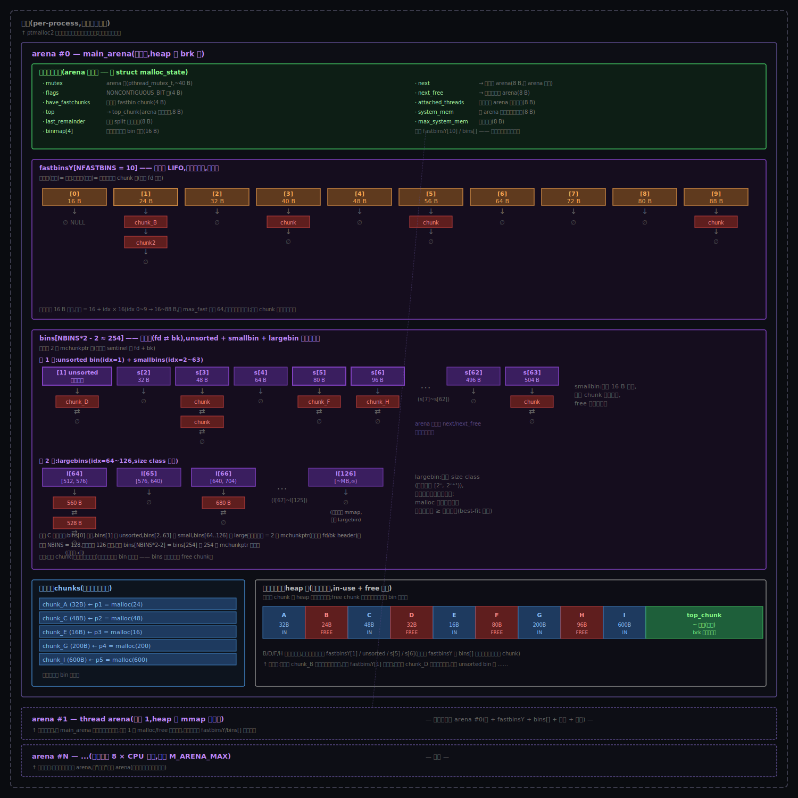

# 阶段 3:glibc 的 malloc 大致怎么工作

## §0 从 Why 走到 How:三件事记住

Why 阶段你已经用 4 层推理把 ptmalloc2 的形状几乎勾出来了:必须用户态记账(不能每次进内核)→ 借鉴 buddy 用链表串 chunk → 分桶加速查找 → 多池减锁。

这一节先把那 4 层抽象推理**精确化**成 ptmalloc2 里**最关键的三个组件** —— 每个组件都对应一类 Why 阶段的约束,而且每个组件都能用「因为 → 要解决 → 所以引入」一句话推出来。

理解这三件事后,你才有钻 §2~§7 细节的"骨架";否则一头扎进 fastbin / 物理布局 / arena 锁这些细节,会迷路。

### §0.1 chunk(物理实体 —— 每块自带 header)

**因为**:
- **C5**(`free(p)` 不传 size,只接受指针)—— 必须能从指针反推大小
- **C6**(碎片管理需要合并相邻 free 块)—— 合并必须知道前后块大小 + 状态

C5 + C6 一起逼出一个硬约束:**每块内存必须自带元数据,不能集中在外部表里存**(集中表 = 每次 free 还要查表 → O(N) 慢得不行,再叠 C1 的 10⁵~10⁷ 次/秒就直接崩)。

**要解决**:
- 每块内存都"自带名字" —— 大小 + 状态(in-use/free)+ 几个标志位
- `free(p)` 时,p 减去 header 大小就能拿到所有元数据

**所以引入 chunk**:
- 物理结构 = `[chunk header (16B)] + [user data (n B)]`
- `header = prev_size (8B) + size_with_3_flags (8B)`(标志位塞在 size 字段低 3 位,因为 16 字节对齐让低 3 位本来就是 0)
- chunk 是 ptmalloc2 的**最小记账单位 + 物理实体** —— 它在 heap 上有具体地址,真正占用字节

> chunk 是物理实体 —— 这条要刻在脑子里。后面看到的 bin、fastbin、unsorted bin 都不是新的"chunk",只是 chunk 的索引。

### §0.2 bin(空闲索引 —— 给 free chunk 分桶)

**因为**:
- **C1**(高频小块,每秒 10⁵~10⁷ 次,16~256 字节)—— alloc 频率极高,每次都遍历整个 heap 找空闲块绝对不行(O(N) 必爆)
- **C6**(碎片管理)—— free 之后空闲块必须能被复用,不能丢

C1 + C6 一起逼出"必须有快速查找空闲块的索引"。

**要解决**:
- alloc 时:O(1) 或 O(log N) 找到大小合适的 free chunk
- free 时:把刚释放的 chunk 挂到一个"等下次复用"的临时归宿

**所以引入 bin**:
- 把所有 free chunk 按大小分桶 + 每桶一条链表
- alloc 时根据请求大小算桶号 → 直接拿桶头(O(1))
- free 时挂回对应桶
- bin 是**元数据索引,不是新 chunk** —— 它只是一组指针,指向 heap 上某些"现在 free 的" chunk

> bin 是索引 —— bin 链表里的"东西"不是 chunk 本身,是指向 chunk 的指针。同一个 chunk 物理位置不变,但归属哪个 bin 会随 alloc/free 变。

### §0.3 arena(容器 —— 一池 bin + 一段 heap + 一把锁)

**因为**:
- **C7**(必须支持多线程并发)—— 单池单锁会被多核撞死(线程都抢同一把锁,退化成串行)
- **C2**(syscall 至少几百 ns,比函数调用贵 2 个数量级)—— 不能每次 alloc 都走内核

C7 + C2 一起逼出"减锁竞争 + 批量要内存"。但又不能 per-thread 一池 —— 几千线程会让 RSS 翻天。

**要解决**:
- 减锁:让多线程不要抢同一把锁
- 控膨胀:arena 数量有上限,不会随线程数无限涨
- 批量:每次扩 heap 时一次推一大段(摊薄 syscall 成本)

**所以引入 arena**:
- 把"一池 bin + 一段 heap + 一把锁"打包成独立单元
- 多个 arena 同时存在,线程平摊
- 主 arena 用 brk 扩 heap(字节级,快但中间还不掉);线程 arena 用 mmap 扩(任意位置可还)
- 数量上限 `8 × CPU 核数`(经验值,折中减锁 vs 控膨胀)
- arena 是**容器** —— 它持有 bin 和 chunk 的"领土",bin 是它的索引,chunk 在它的 heap 段里

> arena 是容器 —— 它包了一组 bin 和一段 heap,持有自己的锁。多个 arena 之间不共享 chunk,不抢锁。

### §0 结论:三件事记住

把上面三段推理压缩成一张表:

| | 是什么 | 为什么存在 |
|---|------|---------|
| **chunk** | **物理实体**(heap 上一块连续字节,自带 header) | C5 + C6:每块必须自带元数据,集中表查不起 |
| **bin** | **空闲索引**(free chunk 按大小分桶的链表) | C1 + C6:高频 alloc/free 必须 O(1) 找空闲块 |
| **arena** | **容器**(一池 bin + 一段 heap + 一把锁) | C7 + C2:多线程不能抢同一把锁,但 arena 数也不能爆 |

**三件事的关系 —— 容器 ⊃ 索引(指向)→ 物理实体**:
- arena **包**着 bin 和一段 heap
- bin 链表里存**指针**,指向 heap 段里某些 free chunk
- chunk 在 heap 段里有具体物理地址,既可能挂在某个 bin 上(free),也可能不挂(in-use)

后面 §2~§7 钻的所有细节,都是这三件事的**展开** —— 看到哪个细节迷路时,回到这张三件事表。

---

## §1 一张极简概览图

§0 给了你三件事的"为什么";这张图给你三件事在内存里**怎么排**的鸟瞰:


**几件能从图上直接读出来的事**:

1. **进程边界**(虚线外框)是内核给的,**ptmalloc2 看不见这一层** —— 它假设自己只服务一个进程。
2. **arena #0 内部分 3 块**:头(绿,控制面)+ bins(紫,索引)+ chunks(蓝/红/绿,物理布局)。这就是 §0 的三件事在地图上的位置。
3. **chunks 物理上 in-use(蓝)和 free(红)交错** —— 这是"碎片"的原始形态(对应 C6)。
4. **bins(紫块)只是元数据指针** —— 虚线箭头说明它指向 heap 段里某些 free chunk;同一个 chunk 物理位置不变,但归属哪个 bin 会变。
5. **arena #1 / #N 是平行的** —— 各持自己的 bins + chunks + 锁,不共享。`.next` 链表把所有 arena 串起来,只在分配 arena / 全局统计时用。

**这张图是骨架的"鸟瞰"**;§2 开始一层层钻进去 —— 进程层(§2.1)→ arena 嵌套(§2.2)→ 物理 vs 逻辑双视图(§2.3)→ bin 内部组织(§3)→ malloc/free 端到端流程(§4)。

---

## §2 层级关系细看(进程 / arena / bin / chunk 怎么嵌套?)

(本节由对话凝固 —— 用户主动问"glibc 是不是分进程加载、不同进程独立?然后 arena / bin / chunk 怎么嵌套?"。这两个问题揭示了一个关键的责任分层,先把它澄清,再看后面的流程会顺得多。)

### §2.1 进程隔离(由 Linux 内核给,不是 ptmalloc2 给)

glibc(`libc.so.6`)是一个**共享库**,每个进程加载它时:

```
进程 A 的地址空间                            进程 B 的地址空间
┌──────────────────────────┐                ┌──────────────────────────┐
│  libc.so.6 代码段         │ ←─共享物理页─→ │  libc.so.6 代码段         │
│  (malloc/free 指令本身)   │                │  (内核 mmap 同一份只读)   │
├──────────────────────────┤                ├──────────────────────────┤
│  libc.so.6 数据段         │                │  libc.so.6 数据段         │
│  ❌ 不共享 —— per-process  │                │  ❌ 不共享                │
│    - main_arena 实例      │                │    - main_arena 实例      │
│    - 各种全局变量、锁     │                │    - 全局变量、锁         │
├──────────────────────────┤                ├──────────────────────────┤
│  进程 A 的 heap (brk 扩)  │                │  进程 B 的 heap           │
├──────────────────────────┤                ├──────────────────────────┤
│  thread arena × N (mmap)  │                │  thread arena × N         │
└──────────────────────────┘                └──────────────────────────┘
```

**关键点**:

- **指令共享、状态独立**:多个进程跑同一份 `malloc()` 代码,但 `main_arena`、bins、chunks 等所有状态各有一套
- **进程隔离 = 内核责任**:这不是 ptmalloc2 自己做的,是 Linux 内核给每个进程独立 page table 自然带来的
- **ptmalloc2 看不见"进程"**:它假设自己只服务一个进程内的所有线程,顶层就是 arena

> ⚠️ 没有"glibc 域"这一层。如果你听到"glibc 分域加载",大概率是把"进程隔离"误说成"域"。准确表述:**进程隔离由内核给,arena 多池由 ptmalloc2 给**。

### §2.2 进程内的 arena / bin / chunk 嵌套

进程内 ptmalloc2 的层级图(从粗到细):



**从粗到细一层层往里看**:**进程 ⊃ arena × N ⊃ {头状态机 / 空闲表 bins / 在用 chunks / 物理布局}**。arena 是 ptmalloc2 视野的最高层级(顶上没有"glibc 域"),数量上限 `8 × CPU 核数`,可调 `M_ARENA_MAX`。

每个 arena 内部 4 个区域职责清晰分工:

| 区域 | 内容 | 用途 |
|-----|------|------|
| **头状态机** | mutex / top_chunk 指针 / next / system_mem | arena 的"控制面",并发锁 + 末端剩饭定位 + 跨 arena 链表 |
| **空闲表 bins** | fastbinsY[10] + bins[~254] | 把 free chunk 按大小分桶,等下次 malloc 复用 |
| **在用 chunks** | A / C / E / G / I 这些被应用持有指针的 chunk | 不在任何 bin 链表里 |
| **物理布局** | heap 段连续字节流(in-use + free 交错 + top_chunk) | 上面 3 个区域的"实际内存对应物" |

**三件事记住**(§0 已立,这里再贴一遍方便对照):

1. **chunk 是物理实体**(heap 上一块连续字节),要么"在用"(被 app 持有指针)要么"空闲"(挂在某条 bin 链表上)
2. **bin 是组织视图**(空闲链表的桶),只是给 chunk 在"等复用期间"做的索引;chunk 本身在 heap 上的位置不变
3. **arena 是容器**,持有一组 bin + 一段 heap + 一把锁 + 当前 top_chunk

**类比**(回扣你 Why 阶段的内核镜像):

| ptmalloc2 | Linux 内核物理页层 |
|----------|---------------------|
| arena | NUMA zone(独立的内存池 + 锁) |
| bin(空闲分桶链表) | buddy 的 free_area[](按 order 分桶的空闲链表) |
| chunk(已切出的字节块) | page(已分配的物理页) |
| in-use 链表 vs bin 链表 | 已分配 vs free_area 队列 |

读完这张层级图,后面 §4 的 5 步骨架的每一步你就能精确定位:**"这一步是在改 arena 的什么字段"** / **"这一步是在 chunk 的哪个桶之间移动"**。

### §2.3 物理内存视图 vs 逻辑链表视图(同一组 chunk 的两个视角)

(本子节由对话凝固 —— 用户提议"画一个实际物理内存图,展示 in-use 和 free 交错 + free chunk 链接到不同 bin"。)

§2.2 的层级图是 arena 的**逻辑视图**(指针 → bin → chunk)。但 chunk 在物理上是**连续字节流**:in-use 和 free 在 heap 段里交错,每个 free chunk **同时拥有物理位置 + bin 归属两种身份**。这两个视角是同一组 chunk 的"鸟瞰" vs "侧视"。

具体场景:heap 段里有 9 个 chunk + top_chunk,5 个 in-use(A/C/E/G/I)+ 4 个 free(B/D/F/H,大小不同)。


> 📄 完整富排版版(带 takeaways 卡片 + insight 卡片):[`figures/03-physical-vs-logical.html`](../figures/03-physical-vs-logical.html)(浏览器打开)

#### 5 件这张图能让你直接读出来的事

1. **物理上 in-use 和 free 交错** —— 这就是"碎片"的原始形态(对应 Why C6)
2. **同一个 chunk 物理位置不变,但 bin 归属会变** —— 比如 chunk_D 刚 free 时在 unsorted;下次 malloc 扫 unsorted 时,可能把 D 拿走,可能把 D **顺手归位**到 smallbins[2]
3. **chunk_I = 600 B 是 IN_USE,不在任何 bin 上** —— 在用的 chunk 既不在 fastbin 也不在 bins[]
4. **每个 free chunk 同一时刻只在一条 bin 链表上** —— B 在 `fastbinsY[1]`;D 在 unsorted(还没归位);F/H 在对应 smallbin
5. **合并相邻 free chunk 时,两个视图一起变** —— 假如 chunk_C 也被 free,B/C 物理上相邻 → 合并成 24+48 = 72 B 大块 → bin 归属从 `fastbinsY[1] + smallbins[3]` → 合并后的 `smallbins[4]`

#### 这张图揭示的元洞察

> **chunk 是物理实体,bin 是元数据索引。同一组 chunk 在两个视图里都存在,只是从不同维度看**。
>
> 这跟数据库的 **数据 vs 索引** 是同构的:
> - **数据**(物理 chunk)在表里"存在哪个 row"是物理布局,合并 / 拆分会改物理布局
> - **索引**(bin 链表)是辅助加速结构,反映"按某个维度(大小)查找时怎么找"
> - **维护成本**:每次物理布局变(chunk 合并/拆分),索引也要同步变 —— 这就是为什么 ptmalloc2 在 free 时,除了更新 bin 链表,还要更新相邻 chunk 的 PREV_INUSE 标志位(让物理"邻接"信息保持准确)
>
> 数据库索引出错叫"index corruption";malloc 这层出错叫"heap corruption" —— 本质同源。

---

## §3 bin 内部组织:为什么切 4 类而不是直接按大小分?

(本节由对话凝固 —— 用户敏锐地观察到"buddy 是按固定大小分桶的,为什么 ptmalloc2 不学 buddy?")

### §3.1 bin 的两层组织

| 层 | 组织维度 |
|----|---------|
| 第一层 | 按"特性"切成 fastbin / unsorted / smallbin / largebin **4 类** |
| 第二层 | 每一类内部**仍然按大小分桶**(buddy 风格) |

所以不是"按特性 vs 按大小"二选一 —— **第二层就是按大小**。问题变成:**第一层为什么要叠这一层切分?**

### §3.2 4 类 bin 各自的「因为 → 要解决 → 所以引入」推导

**fastbin(< 64 B)**:

- **因为** C1(高频小块,典型 16~64 B)+ C6 的边界(小块合并代价 ≥ 合并收益,因为小块释放后**几乎肯定**马上又被分配同样大小)
- **要解决** 让 16~64 B 拿到**最快路径**:不查、不合并、不双链
- **所以引入** **fastbin** = 单链表 LIFO + 固定大小桶 + **不合并**(直接 push/pop)
- **代价**:fastbin 不合并会积"零钱" → 周期性触发 `malloc_consolidate` 倒进 unsorted bin 集中清理

**smallbin(64~512 B)**:

- **因为** 这一段是**典型对象大小**(STL 节点、短 std::string、协议 buffer),频率仍高但可以承担一点 free 时合并开销
- **要解决** O(1) 大小定位 + 支持 free 时从中间合并
- **所以引入** **smallbin** = 固定 16 字节步长 + **双链表**(支持从中间 unlink 做合并);每个桶内 chunk 大小**完全相等**,O(1) 命中

**largebin(≥ 512 B)**:

- **因为** ≥ 512 B 的大小**空间太大**(可能 600 B,可能 100 KB),固定步长会爆桶(几万个);但请求频率比小块低
- **要解决** 桶数受控前提下仍快速找到"够大且接近"的 chunk
- **所以引入** **largebin** = **size class 分桶**(对数尺度,例:第 N 桶覆盖 `[2ⁿ, 2ⁿ⁺¹)`)+ 桶内**按大小排序**(双链表 + 大小有序);`malloc(700)` 找到 `[512, 1024)` 桶,从大到小遍历找第一个 ≥ 700 的(best-fit 近似)

**unsorted bin(任意大小,最反直觉)**:

- **因为** 高频 free 走完整"算桶号 + 链表插入 + 合并相邻"链路成本不小;而且 **freed chunk 极有可能马上又被同 size alloc 用走**(典型:临时 `std::string` 析构,下一行又 new 一个临时 `std::string`)
- **要解决** "刚 free 立刻被同 size 接走"的场景下,免掉**多余的归桶 + 从桶里再取出**两步无用功
- **所以引入** **unsorted bin** = 无分类的临时缓冲(单一队列,啥大小都进):
  - free 时(非 fastbin 范围):**不算桶号,直接扔 unsorted 头部**(O(1))
  - malloc 时:**先扫一眼 unsorted**(通常很短)—— 撞上精确匹配 → 直接拿走;不匹配 → **顺手归桶**到正确的 small/large bin,继续扫下一个
  - 扫完 unsorted 还没合适 → 才走 small/large 正规查找

unsorted bin 的设计精神三件事:

1. **延迟分类**:不知道接下来怎么用之前先不归位,省力
2. **顺手清理**:malloc 扫 unsorted 时**顺便**归位不匹配的,把分类成本平摊到将来
3. **热块缓存**:刚 free 的在头部,LIFO,下次同 size malloc 几乎必命中,极佳 cache locality

→ 类比 CPU 的 **store buffer** / **write-combining buffer**:把"立即归位"延迟到"将来顺手做"。

### §3.3 核心洞察:为什么 ptmalloc2 跟 buddy 偏离

> **buddy system 假设 chunk 的全部信息就是"大小 + 物理位置",所以一个维度(大小)分桶足够。**
>
> **但 ptmalloc2 还要利用一个 buddy 没考虑的维度:chunk 的"刚被 free 的程度"(temporal locality)** —— 刚释放的 chunk 极有可能马上又被同 size alloc 用走。这个信息单纯的 size class 捕捉不了 —— 所以多了 fastbin(小块的"刚释放队列")+ unsorted bin(中/大块的"刚释放缓冲"),把**时间维度的局部性**也利用上。

**第一性原理的又一个范例**:

| 场景 | 数据特征 | 适合的组织维度 |
|------|---------|--------------|
| 内核物理页(buddy) | 每页 4 KB **同质**,大小近乎唯一关键 metadata | **大小**单维 |
| 用户态 malloc | **异质大小** + temporal locality 强(对象经常立刻 alloc/free) | **大小 + 时间**双维(size class + fastbin/unsorted 的"刚释放"队列) |

**buddy 在"同质 + 大小为王"的领域是完美的;ptmalloc2 在"异质 + 时序强"的领域必须叠时间维度。**

### §3.4 4 类 bin 的对照表(供后续 Deep 阶段引用)

| | fastbin | unsorted | smallbin | largebin |
|---|---------|---------|---------|----------|
| **大小区间** | < 64 B | 任意 | 64~512 B | ≥ 512 B |
| **桶数** | ~10 | 1 | ~62 | ~63 |
| **桶内组织** | 单链表 LIFO | 单链表(任意大小) | 双链表 | 双链表 + 大小排序 |
| **每桶大小区间** | 固定 16 B 步长 | 任意 | 固定 16 B 步长 | size class(对数尺度) |
| **free 时是否合并** | ❌ 不合并(`malloc_consolidate` 才合并)| 一般不合并 | 合并相邻 | 合并相邻 |
| **典型作用** | 小块快路径 | 刚释放热块缓存 | 中小固定大小快路径 | 大块 best-fit |
| **对应主要约束** | C1 | C1 + C6 | C1 + C6 | C6 + 桶数控制 |

### §3.5 为什么 fastbin 用独立数组而不挤进 `bins[]`?

(本子节由对话凝固 —— 用户敏锐地观察到 `fastbinsY[NFASTBINS]` 在 C 结构里跟 `bins[NBINS*2-2]` 是两个独立字段,问"为什么不挤一起"。)

**因为** fastbin 跟其他三类有一个**类型不可调和的硬差异**:

| | fastbin | unsorted / smallbin / largebin |
|---|---------|------------------------------|
| **链表结构** | 单链表 LIFO 栈,只用 `fd` | 双链表,需要 `fd + bk` 两个指针 |
| **每桶占用** | **1 个 8 B 指针** | **2 个 8 B 指针**(双链表 sentinel header) |

**要解决**:在保持代码简洁 + 内存紧凑 + 操作 API 干净的前提下,让两种 bin **各自用最合适的实现**

如果硬塞同一个数组,只有两条路,**每条都很糟**:

| 硬塞方案 | 代价 |
|---------|------|
| **A. 给 fastbin 也分 2 槽** | fastbin 80 B → **浪费成 160 B**(bk 字段永远没用) |
| **B. 数组前 10 槽特殊解释 + 后面双链表** | 代码遍布 `if (idx < 10) ...` 类型判断,**易错、难维护、ABI 演化困难** |

**所以引入**:`fastbinsY[NFASTBINS]` 跟 `bins[NBINS*2-2]` **两个独立字段**:
- `fastbinsY[10]` —— 单链表头数组,每槽 8 B,共 80 B
- `bins[NBINS*2-2] ≈ bins[254]` —— 1 个 unsorted + 62 small + 63 large,每桶 2 槽用作双链表 fd/bk sentinel,共 ~2 KB

各自类型、各自 API(`fastbin_push/pop` vs `unlink_chunk`)、各自演化路径。

#### §3.5.1 派生好处(不是引入理由,但分开后顺便拿到)

| 派生好处 | 内容 |
|---------|------|
| **cache locality** | fastbinsY 80 B 紧挨 mutex 放,fastbinsY[0..1](最高频的 16 B/24 B 桶)免费跟 mutex 共 cache line 0。详见下方 §3.5.3。**注意:这是分开后的额外收益,不是分开的原因** —— 哪怕共数组,只要把数组开头紧挨 mutex 放,cache locality 一样好。 |
| **lock-free 演化空间** | fastbin 字段独立,将来可以独立加原子 CAS 的 lock-free push/pop,不会跟 bins[] 的锁机制纠缠 |

#### §3.5.2 必要原因 vs 派生好处:一个常被搞混的方法论

**这是个比 fastbin 本身更值得记住的认知工具**:

> 看一个设计决策,要分清 "**必要原因**"(不这么做会失败)vs "**派生好处**"(这么做的同时顺便还拿到的)。**两者经常被混为一谈,导致从派生好处反推设计原因 → 推不通**。

| | 必要原因 | 派生好处 |
|---|---------|---------|
| **判断标准** | 不这么做会失败(浪费空间 / 代码错乱 / ABI 破坏) | 不这么做也行(可以用别的方式拿到这个好处) |
| **典型问法** | "为什么必须这么做?" | "这么做有什么额外好处?" |
| **fastbinsY 独立的例子** | 类型不可调和(单链表 vs 双链表) | cache locality / lock-free 空间 |

**用户最初问的"为什么 fastbin 单独数组"** —— 我之前把 cache locality 列为 #2 理由是**本末倒置**。校准后:**类型不可调和才是真正逼分开的硬约束**;cache locality 只是分开之后顺便拿到的额外收益。共数组安排好也能拿到 cache locality —— 但拿不到"类型干净"。

> **元方法论提炼**:每当看到一个"似乎可以合并的字段被故意分开",先问 3 个问题(按优先级):
> 1. **类型 / 接口有没有不可调和的差异?**(必要原因层)
> 2. **如果合并,会不会浪费空间或要打类型补丁?**(必要原因层)
> 3. **分开还顺便能拿到什么?**(派生好处层 —— cache locality / 演化空间 / 同步分离 / NUMA 分离 …)
>
> 前 2 题问的是**"必须分开"**,第 3 题问的是**"分开后还白拿了什么"**。**别把第 3 题的答案当成第 1、2 题的答案** —— 那会让你的因果链颠倒。

#### §3.5.3 cache locality 展开(从 CPU 取数据的速度差讲起)

**第 1 步:CPU 取数据的速度差**

| 取数据自 | 典型耗时 | 相对 L1 慢度 |
|---------|---------|-------------|
| 寄存器 | ~0.3 ns | 0.3× |
| L1 cache | ~1 ns | 1× |
| L2 cache | ~3 ns | 3× |
| L3 cache | ~10 ns | 10× |
| **主存 RAM** | **~100~200 ns** | **100~200×** ⚠️ |

malloc 的 fast path 总目标是 **~10 ns 数十条指令**。**一次主存 miss(150 ns)就能把这条 fast path 撑爆 15 倍** —— 所以 fast path 不能容忍任何不必要的 cache miss。

**第 2 步:CPU 一次拉数据的最小单位是 cache line(典型 64 字节)**

CPU 不会"只读 1 字节":它从 RAM 拉数据的最小单位是 64 字节连续内存(一个 cache line)。两个推论:

1. 同一 cache line 内的字节**几乎"免费"一起被加载** —— 读一个等于预热邻居
2. 不同 cache line 各自独立加载,各占 L1 容量(L1 通常 32 KB ≈ 500 cache lines)

**第 3 步:malloc fast path 用到哪些字段?**

```c
1. lock(arena->mutex)                         ← mutex 字段
2. if (n <= arena->global_max_fast)           ← global_max_fast 字段
3. idx = (n - 16) / 16
4. chunk = arena->fastbinsY[idx]              ← fastbinsY 数组某槽
5. arena->fastbinsY[idx] = chunk->fd
6. return chunk_to_userptr(chunk)
```

读到的 hot 字段(精确版尺寸):

| 字段 | 大小 | 备注 |
|------|------|------|
| `pthread_mutex_t` (mutex) | **40 B** | 是个大字段!包含 owner / count / futex / kind 等 |
| `flags + have_fastchunks` | 8 B | 各 4 字节 |
| `fastbinsY[idx]` 单个槽 | **8 B** | ← 64 位指针 |
| `chunk->fd`(读链表头) | 8 B | chunk 内一个指针 |

fast path 真正触摸 ≈ **40 + 8 + 8 = 56 B**(分散在 arena 开头 + chunk 头)。

**第 4 步:这些字段在不在同一 cache line?决定了 fast path 的命运**

```
malloc_state 实际偏移布局(64-bit Linux,arena 开头):
偏移 0~39   ┃ mutex (pthread_mutex_t, ~40 B)        ┓
偏移 40~43  ┃ flags (4 B)                            ┃ cache line 0
偏移 44~47  ┃ have_fastchunks (4 B)                  ┃ (0~63 B)
偏移 48~63  ┃ fastbinsY[0..1]  ← idx 0/1 命中这一行  ┛
─── cache line 边界(64) ───
偏移 64~127 ┃ fastbinsY[2..9]  ← idx 2~9 命中这一行  ┓ cache line 1
偏移 128    ┃ top (8 B)                              ┛
偏移 136    ┃ last_remainder (8 B)
偏移 144~   ┃ bins[NBINS*2-2]  ← ~32 个 cache lines,冷
```

▶ **方案 A:fastbinsY 独立放(ptmalloc2 实际选择)**

| 步骤 | 命中位置 | 是否 miss |
|------|---------|----------|
| 读 mutex | cache line 0 | miss 1 次(~150 ns) |
| 读 `fastbinsY[idx]`,idx=0/1 | cache line 0 | **同一行,免费** ✓ |
| 读 `fastbinsY[idx]`,idx=2~9 | cache line 1 | miss 1 次(+150 ns) |
| 读 `chunk->fd` | chunk 自己的 cache line | miss 1 次(+150 ns) |

**最优(idx=0/1):2 次 miss ≈ 300 ns**;**一般(idx=2~9):3 次 miss ≈ 450 ns**

▶ **方案 B(假想反例):fastbinsY 塞进 bins[] 共享数组**

`fastbinsY[idx]` 现在散在 `bins[]` 中间某个 cache line,**永远跟 mutex 不在同一行**:

| 步骤 | 命中位置 | 是否 miss |
|------|---------|----------|
| 读 mutex | cache line 0 | miss 1 次(~150 ns) |
| 读 `fastbinsY[idx]`(任何 idx)| 中间某个 cache line(冷) | miss 1 次(+150 ns) |
| 读 `chunk->fd` | chunk cache line | miss 1 次(+150 ns) |

**所有情况:3 次 miss ≈ 450 ns**(永远跟 mutex 不共行,无免费机会)

▶ **方案 A vs B 实际差距**:

| | 最优(idx=0,1) | 一般(idx=2~9) |
|---|---------------|----------------|
| 方案 A | ~300 ns(2 miss) | ~450 ns(3 miss) |
| 方案 B | ~450 ns(3 miss) | ~450 ns(3 miss) |
| **B 比 A 慢** | **+50%** | 0%(同 miss 数) |

→ **真正的优化点**:方案 A 让**最高频的两个 fastbin 桶(idx=0/1,即 16 B 和 24 B,典型 std::string、小 STL 节点最常命中)免费跟 mutex 共 cache line**。这就是把"最高频访问"压到"最少 cache miss"的精确化设计。

**而且**(cache 污染):方案 B 中 `bins[]` 里掺杂的 fastbin 槽,在被读到时会**顺手拉进 7 个冷 largebin 头**(同 cache line 的邻居),它们占了 L1 容量但根本用不上,挤掉本来该在 cache 里的应用数据(比如刚分配的 chunk 的 user data)。

**第 5 步:类比内核**

Linux 内核里到处是 `__cacheline_aligned` / `__read_mostly` / per-CPU 变量等标记,目的一致:**让一次 cache miss 拉进来的整行数据都是有用的**。ptmalloc2 把 fastbinsY 单独放,本质就是用户态版的 `__cacheline_aligned`。

> **一句话总结(校准版)**:fastbin 跟其他 bin 挤一起 → 最高频的 idx=0,1 命中也得多一次 RAM miss → 速度 +50%;还会带 7 个冷 largebin 头进 cache → 挤掉应用真正有用的 cache 容量。所以必须独立放、紧挨 mutex,**让最热的 idx=0,1 跟 mutex 免费共第 0 个 cache line**。

---

## §4 端到端流程:一次 `malloc(24)` + `free(p)`

### §4.1 `malloc(24)` 入口 —— 找当前线程的 arena,拿锁

```
应用线程调 p = malloc(24)
       ↓
找到本线程绑定的 arena
   主线程     → main_arena(进程启动时创建,用 brk 扩)
   其他线程  → thread arena(首次 malloc 触发创建,用 mmap 扩)
   线程数 > 8×CPU 核数  → 复用已有 arena(竞锁,但避免 arena 失控膨胀)
       ↓
拿 arena 的 mutex 锁
```

> **arena 的存在**化解 **C7**(多核并发)。锁的粒度是 arena 级,不是全局。

### §4.2 在 arena 里**查 bin**

bin 是 arena 内的 4 类空闲链表,按 chunk 大小分桶:

```
fastbin       │ < 64 B  (固定 16 字节步长,共 ~10 个桶)│ 不合并、单链表、最快路径
smallbin      │ 64 B ~ 512 B  (固定 16 字节步长)        │ 双链表、合并相邻
largebin      │ ≥ 512 B  (size class 分桶)              │ 双链表 + 大小排序
unsorted bin  │ 任意大小                                │ 临时缓冲,刚 free 的先扔这等下次
```

```
查桶顺序:
   ① 先看 fastbin(快路径,小块直接挂回不合并)
   ② 再看 unsorted bin(刚 free 的临时位置,可能撞上合适的)
   ③ 最后看 smallbin / largebin
       ↓
    找到合适大小的 chunk → 切下来 → 标 in-use → 返回 user data 指针 ✓
```

> bin 的 4 类分工化解 **C6**(碎片管理)+ **C1**(高频小块要 O(1) 查找);具体桶的边界、查找算法、为什么 fastbin 上限是 64 字节 —— 是 Deep 阶段的事。

### §4.3 bin 都没货 → 从 top_chunk 切 / 向内核要

```
                bin 都找不到合适的
                        ↓
        ┌──────────────────────────────┐
        ↓                              ↓
    请求 ≥ 128 KB?                  请求 < 128 KB
   (M_MMAP_THRESHOLD)
        ↓                              ↓
   YES                            从 top_chunk 切
   绕开 arena                     (arena 末端那块"剩饭")
   直接 mmap 一块                       ↓
   独立 VMA                        够 → 切了返回 ✓
   返回 ✓                          不够 → 继续向下
                                       ↓
                            主 arena   |   thread arena
                                ↓      |        ↓
                            brk()      |    mmap() 一块新区域
                            推 program |    挂到 arena 后面
                            break       (子 arena 不能用 brk,
                                         brk 只能服务主 arena)
                                ↓                 ↓
                            从扩出来的新空间切 → 返回 ✓
```

> 这一步对应 **C1 + C2 + C3 + C4** —— 批量向内核要(brk 一次推一大段、mmap 整页)、双通道分粒度(brk 字节级 + mmap 任意可还)、top_chunk 让大多数小请求在用户态就解决,不进内核。

### §4.4 `free(p)` 入口 —— 反向偏移找 chunk header

```
应用调 free(p)
   ↓
p 不是 chunk 起点!chunk 在 p 之前几个字节
   ↓
反向偏移读 chunk header:
   ┌─────────────────────────────────────┐
   │  prev_size  │ size + 3 个标志位     │  ← header (这就是 user 推的"必须记账")
   ├─────────────────────────────────────┤
   │           user data (← p 指向这里)   │  ← user data 起点
   └─────────────────────────────────────┘
   ↓
从 size 字段拿到 chunk 大小 → 化解 C5(free(p) 不传 size 也能知道大小)
从标志位 NON_MAIN_ARENA 拿到所属 arena → 化解锁定问题
   ↓
拿 arena 锁
```

> **chunk header 的 3 个标志位**(都塞在 size 字段的低 3 位 —— 因为对齐到 8 字节,低 3 位本来就是 0,能复用):
> - `PREV_INUSE`(bit 0):前一个 chunk 是不是在用?用于判断能否向前合并
> - `IS_MMAPED`(bit 1):本块是不是 mmap 来的?用于决定 free 是直接 munmap 还是挂回 bin
> - `NON_MAIN_ARENA`(bit 2):本块属于主 arena 还是线程 arena?用于查锁
>
> **size + 3 个标志位塞同一个 word** —— 这是 ptmalloc2 最经典的位压缩技巧,精确化解了 C5(只 1 个指针定位 + 全部元数据)。Deep 阶段会精确剖析。

### §4.5 合并 + 挂回 bin + **默认不还内核**

```
chunk 标 free
   ↓
检查物理上前后相邻的 chunk:
    前一个 free?(看 PREV_INUSE 标志位)→ 向前合并
    后一个 free?(顺指针检查)         → 向后合并
   ↓
合并后的大 chunk 选择目的桶:
    走 mmap 路径(IS_MMAPED=1)? → munmap() 立即还内核
    本块 < 64 B?                  → fastbin(不合并、最快)
    其他?                         → unsorted bin(临时位置)
   ↓
默认就停在这 ✗ 不还内核
   (要真正还,要么走 mmap,要么调 malloc_trim 主动收缩 brk)
```

> 这一步对应 **C2 + C3 + C6** —— 合并降低碎片;默认不还内核,因为 syscall 贵 + brk 物理上还不掉中间块(只能末尾整体回缩)。

---

## §5 一个最小伪代码 demo(40 行,串起 5 步骨架)

```c
// 简化的 malloc 伪代码 —— 真实 ptmalloc2 复杂得多,但骨架就是这个
void *malloc(size_t n) {
    arena_t *a = get_thread_arena();        // 步骤 1: 找 arena (C7)
    lock(a->mutex);

    // 步骤 2: 查 bin (C6 分桶 + C1 快路径)
    chunk_t *c = NULL;
    if (n < FASTBIN_MAX) c = fastbin_pop(a, n);
    if (!c)              c = unsorted_bin_search(a, n);
    if (!c)              c = smallbin_or_largebin_search(a, n);
    if (c) { unlock(a->mutex); return chunk_to_userptr(c); }

    // 步骤 3: top_chunk / brk / mmap (C1+C2+C3+C4)
    if (n >= M_MMAP_THRESHOLD) {              // 大块走 mmap
        c = mmap_new_chunk(n);                // IS_MMAPED=1
    } else if (a->top_size >= n) {            // 从 top_chunk 切
        c = split_top_chunk(a, n);
    } else if (a == &main_arena) {            // 主 arena 用 brk 扩
        a->top = brk_extend(a->top, EXTEND_SIZE);
        c = split_top_chunk(a, n);
    } else {                                  // 线程 arena 用 mmap 扩
        a->top = mmap_extend(a->top, EXTEND_SIZE);
        c = split_top_chunk(a, n);
    }
    unlock(a->mutex);
    return chunk_to_userptr(c);
}

void free(void *p) {
    chunk_t *c = userptr_to_chunk(p);         // 步骤 4: 反向偏移 (C5)
    arena_t *a = chunk_arena(c);              // header 标志位查 arena
    lock(a->mutex);

    if (c->size & IS_MMAPED) {                // 例外:mmap 块直接还
        unlock(a->mutex);
        munmap_chunk(c);
        return;
    }

    c = coalesce_with_neighbors(a, c);        // 步骤 5: 合并 (C6)
    if (c->size < FASTBIN_MAX) fastbin_push(a, c);
    else                       unsorted_bin_push(a, c);
    unlock(a->mutex);
    // 默认就停在这,不还内核 (C2+C3)
}
```

读完这段你应该能指着每一行说"这一行对应到 Cn 或第 X 层推理"。**ptmalloc2 几万行源码,结构上就是这个伪代码的真实工程化** —— 复杂度的来源是:边界条件、性能优化、多种安全检查(防 double free / chunk overflow / use-after-free)。骨架本身并不复杂。

---

## §6 一张对比图:朴素方案 vs glibc 的 malloc

| 维度 | 朴素方案 | glibc 的 malloc | 对应约束 |
|------|---------|----------------|---------|
| 每秒 10⁵ 次小分配的 syscall 数 | 10⁵ 次 | ~10² 次(批量) | C1 + C2 |
| free 之后中间块还内核 | 做不到(brk 限制) | 不还,挂回 bin 等复用 | C3 |
| 碎片管理 | 程序员自己 | bin 分桶 + 合并 | C6 |
| 24 字节小请求的真实物理占用 | 4 KB(mmap 整页,170× 浪费) | ~32 字节(brk 字节级) | C4 |
| 1 MB 大请求的释放 | brk 路径还不掉中间 | mmap 路径 munmap 立即还 | C3 + C4 |
| 多线程 malloc 并发 | 应用层自己锁 | arena 多池自动减竞争 | C7 |
| free(p) 不传 size 怎么知道大小 | 不知道 | 反向偏移读 chunk header | C5 |

每一行差异都对应 Why 阶段某条 Cn 的具体化解。

---

## §7 三个常见误解

### §7.1 `free(p)` 之后这块内存就还给操作系统了

**真相**:**默认不会**。free 只是把 chunk 挂回 arena 的 bin / fastbin / unsorted bin,等下次 `malloc(...)` 复用。**例外**只有两个:
- 这块原本走 mmap 路径(IS_MMAPED=1)→ 立即 `munmap` 还
- 主动调 `malloc_trim()` → ptmalloc2 检查 heap 末尾连续空闲段,收缩 brk

这就是为什么生产环境里"明明 free 了内存,top 里 RSS 纹丝不动"是常态 —— 不是泄漏,是**故意攥着等复用**。

### §7.2 malloc 内部就一个全局空闲表,所有线程共享

**真相**:有多个 **arena**,每个独立维护自己的 4 类 bin、top_chunk、heap 段。多线程下,锁的粒度是 **arena 级**(不是全局)—— 这就是为什么多核 malloc 不会被一把全局锁卡死。

但 arena 数量**有上限**(典型 `8 × CPU 核数`,可改 `M_ARENA_MAX`)。线程数远超这个数,会触发 arena 复用,锁竞争就回来了 —— 这是 ptmalloc2 跟 jemalloc / tcmalloc 的核心权衡差异。Comparison 阶段会展开。

#### §7.2.1 为什么偏偏是 `8 × CPU 核数`?(用「因为 → 要解决 → 所以引入」推一遍)

**因为**:arena 太少 → 多线程锁竞争重(线程远多于 arena → 抢同一把锁 → 退回全局锁时代);**arena 太多** → 每个 arena 独立持有自己的 heap 段 + bins + top_chunk,而且 **arena 之间的空闲块无法跨 arena 复用**(锁分离的代价就是空闲表也分离)→ arena 数翻倍 → RSS 接近翻倍 + cache locality 变差。

**要解决**:在"减锁竞争"和"控制内存膨胀"之间找一个不严谨但够用的折中点 —— 让大多数 workload 下:① 锁竞争已经摊到几乎看不见;② arena 数仍然小到 RSS 不爆。

**所以引入**:经验拍板的常数 **8**(64 位 `M_ARENA_MAX` 默认值;32 位是 2,因为 32 位地址空间紧)。**没有任何严格推导**,就是工程经验值 —— 类似 Linux 内核里大量 magic number。来源是 ptmalloc2 源码 `malloc/arena.c` 中的 `__libc_mallopt` 默认逻辑。

#### §7.2.2 超过 `8 × CPU 核数` 的线程数会怎样?

ptmalloc2 **不会**为更多线程开新 arena,而是让新线程**复用**已有 arena —— 找一个最空闲的(arena 之间通过 `next` 链串成全局表),加锁等待。**接受锁竞争,换内存稳定**。

| 操作 | 行为 |
|------|------|
| 1~8×N 个线程(N=核数) | 每个线程拿独立 arena,几乎无锁竞争 |
| 8×N+1 个线程开始 | 新线程复用已有 arena,出现等锁;arena 数到此**停止增长** |
| 1024 个线程,8 核机器(arena 上限 64) | 每个 arena 平均被 16 线程共享,锁竞争中等 |

**典型调优经验**:

- **数百线程的高并发 server**:常调小到 `MALLOC_ARENA_MAX=2~4`(线程已经够多,arena 多了反而 RSS 失控)
- **单线程或少线程的 batch job**:不用调,默认值就够
- **极端**:`MALLOC_ARENA_MAX=1` 退回单池,简单但锁瓶颈
- **想彻底绕开这个权衡**:换 jemalloc(per-CPU arena 而非 per-thread)或 tcmalloc(thread-local cache + 中央堆),两者用不同的方式同时压住 RSS 和锁竞争。Comparison 阶段会精确对比。

### §7.3 chunk 大小 = 你 malloc 请求的字节数

**真相**:**chunk 实际比你请求的大**。它包含:
- **chunk header**(`prev_size` + `size+标志位`,通常 16 字节)
- **对齐填充**(typical x86_64 对齐到 16 字节边界)

所以 `malloc(24)` 实际占用约 **32 字节**(24 + 16 字节 header,但 header 跟下一块共享部分空间因为 PREV_INUSE 这个 trick)。**精确的 chunk 布局算法是 Deep 阶段的事** —— 但你现在能感觉到为什么需要 header(就是你说的"必须记账")。

---

## §8 约束回扣

How 阶段呈现的每一个组件,**精确对应 Why 阶段某条 Cn 的具体化解**:

| 组件 | 对应约束 | 精确化解方式 |
|------|---------|------------|
| **arena + per-arena mutex** | C7(多核并发) | 锁粒度从全局降到 arena 级 |
| **fastbin / smallbin / largebin / unsorted bin** | C6(碎片管理)+ C1(高频小块) | 分桶 O(1) 查找 + 不同策略对不同 size 范围 |
| **top_chunk** | C1 + C2(批量要,把 syscall 摊薄) | 大多数小请求在用户态就被服务,不进内核 |
| **brk 扩主 arena heap / mmap 扩线程 arena** | C3 + C4(brk 限制 + mmap 整页) | 主 arena 用 brk 字节级 + 线程 arena 用 mmap 任意位置 |
| **chunk header 内联 size + 3 标志位** | C5(free(p) 不传 size) | 反向偏移读 header 拿大小 + arena 信息 |
| **合并相邻 free chunk** | C6(碎片管理) | 减少长跑后的碎片累积 |
| **默认不还内核**(只挂回 bin) | C2 + C3 | syscall 贵 + brk 物理还不掉中间,合理选择不还 |
| **M_MMAP_THRESHOLD = 128 KB** | C3 + C4(双通道分粒度) | 大块走 mmap(可立即还,但浪费 4 KB);小块走 brk |
| **M_ARENA_MAX = 8 × CPU 核数** | C7(并发上限的工程权衡) | 太少 → 锁竞争;太多 → 内存膨胀 + 跨 arena 调度开销 |

所有这些都不是"开发者偏好",每一项都被 C1~C7 中的某条**单向逼出来**。这就是 atlas 把 Why 放在 How 之前的根本原因。

---

## §9 呼应灵魂问题

你的灵魂问题是:**"malloc 要解决的工程问题是什么?"**

到 How 阶段,这个问题已经能**85% 闭环**回答:

- **工程问题**(Why C1~C7)= 高频小块 + syscall 贵 + brk 还不掉中间 + mmap 整页 + free 接口 + 碎片必然 + 多核并发
- **解法**(你 4 层推理 + 第 5 步隐含)= 用户态记账(链表 → buddy 风格 → 分桶)+ 多池减锁 + 双通道分粒度
- **具体组件**(How)= chunk header 内联元数据 + 4 类 bin + top_chunk + arena × N + brk/mmap 双通道 + M_MMAP_THRESHOLD + 默认不还内核

剩下 **15%** 是 Deep 阶段才会精确化的:

- **chunk header 精确字节布局**(为什么 `prev_size` + `size+flags` 共 16 字节而不是 8 或 32)
- **bin 桶边界的精确数字**(为什么 fastbin 上限 64B、smallbin 边界 512B、largebin 怎么按 size class 分)
- **bin 内部数据结构**(链表 / 双链表 / 还是有索引?)
- **fast path 精确步数**(从 `malloc(24)` 调用到返回指针,经过哪几个函数,几次条件分支)
- **安全防护**(double free 检测、chunk size 校验、tcache 投毒防护 —— 这些是 2017 后的重要演化)
- **多线程高并发下 arena 是否成新瓶颈**(这是 ptmalloc2 vs jemalloc / tcmalloc 的核心战场,Comparison 阶段会展开)

每个问题都会在 Deep 阶段绑定一条具体反事实(如果 fastbin 上限改成 128B 会怎样?如果 chunk header 改成 8 字节会怎样?),用反事实精确量化每个数字背后的设计权衡。

> 一句话:**How 给了你 malloc 的"骨架 + 主要组件"** —— 你现在已经能跟人完整讲清楚 ptmalloc2 大致怎么工作。**Deep 才会精确回答"为什么这个数字是这个、那个数字是那个"** —— 把骨架的所有"具体值"用反事实小试逐一钉死。

---

## 修订记录

| 时间 | 修订摘要 | 触发原因 |
|------|---------|---------|
| 2026-05-02 01:20 | 初稿:接续 Why 4 层推理对应到 ptmalloc2 6 个具体组件(chunk header / 邻接 / 4 类 bin / arena / top_chunk / 双通道阈值);5 步骨架端到端流程;40 行伪代码 demo;朴素方案 vs malloc 7 维对比;3 个常见误解;约束回扣 9 项;呼应灵魂问题(85% 闭环 + 15% 留 Deep) | 阶段开始,接续 Why 完成的 commit |
| 2026-05-02 01:35 | 在「核心机制骨架」之前补加新小节《用户视角凝固:层级关系澄清》:画出进程跨边界的双进程对照图(指令共享 + 状态独立)+ arena/bin/chunk 嵌套层级图(arena 头状态 + bins[] 分桶 + in-use chunks + heap 物理布局 + 内核镜像类比);明确"进程隔离 = 内核责任,arena 多池 = ptmalloc2 责任",澄清没有"glibc 域"这一层 | 用户追问 1: glibc 是不是分进程加载、不同进程互不影响?有没有"域"再划 arena? 用户追问 2: 需要 arena/chunk/bin 三者的关系图 |
| 2026-05-02 01:50 | 在「误解 2」末尾追加两个子节《为什么偏偏是 8 × CPU 核数》和《超过会怎样》,严格按"因为 → 要解决 → 所以引入"链条推导;附 4 行调优经验表 + jemalloc/tcmalloc 的不同解法预告 | 用户追问 3: arena 上限 8 × CPU 核数 为什么是 8 倍?超过会怎样? |
| 2026-05-02 02:05 | 在「层级关系澄清」之后、「核心机制骨架」之前补加新小节《bin 为什么切 4 类而不是直接按大小分?》:澄清 bin 是双层组织(第一层切 4 类、第二层每类内部按大小);严格按模板逐类推 fastbin/smallbin/largebin/unsorted 的存在理由;给出核心洞察"buddy 单维(大小)够用 vs ptmalloc2 必须叠时间维度(temporal locality)"+ 4 类 bin 对照表 | 用户追问: bin 是怎么组织的?为什么不像 buddy 直接按大小分? |
| 2026-05-02 02:15 | 修正《层级关系澄清》小节里 bins 的 ASCII 图:之前画成 `fastbins[0~9] → chunk → chunk → ...` 让二维结构看起来像一维;改为左列"第一维:桶号(每个桶的具体大小)"+ 右列"第二维:该桶内的 chunk 链表",每个桶号给一行,清晰展现"bins 是数组,每个槽位独立一条链表";附实际 C 结构里的字段名(fastbinsY[NFASTBINS] + bins[NBINS*2-2])锚定 | 用户追问: 之前的 bin 图画的不对,按双层结构应该是二维数组,怎么画成链表了? |
| 2026-05-02 02:30 | 在《4 类 bin 对照表》后面加子节《为什么 fastbin 用独立数组而不挤进 bins[]》:严格按模板推 3 个不可调和的差异(链表类型/槽位占用/访问热度) → 3 个要解决(类型不混 + cache locality + 演化空间) → 引入 fastbinsY 独立数组;附「元方法论」3 把尺子(类型、热度、演化)用于看任何"故意不合并"的设计 | 用户视角: 部分答出"小对象多 = fastbin 必须独立"(对应 cache locality 那一条),需要补全另外 2 条(类型不混 + 演化空间) |
| 2026-05-02 02:50 | ① 把「层级关系澄清」里 bins 的 ASCII 图改为纵向(横向桶号、纵向桶内 chunk 链),跟 hash table separate chaining 的标准画法一致;② 在《为什么 fastbin 独立数组》后面加《cache locality 展开》子节,从 CPU 取数据的速度差(L1 vs RAM 100~200×)→ cache line 是最小加载单位(64 B)→ malloc fast path 用到的 3 个 hot 字段 → 方案 A vs 方案 B 对比(155 ns vs 305 ns,速度砍半)→ 类比内核 __cacheline_aligned;一步一步从第一性原理推 cache locality 这个抽象概念 | 用户反馈 1: cache locality 那段没理解,需要从更基础的层次讲;用户反馈 2: 之前 ascii 图横向不直观,纵向更好 |
| 2026-05-02 03:05 | 用户精确追问"fastbinsY[idx] 是不是 8 字节指针" → 校准 fast path 字节数:之前写"~30 字节"过度简化,实际 mutex 40 B + fastbinsY[idx] 8 B + chunk->fd 8 B ≈ 56 B;校准方案 A vs B 的 cache miss 数(idx=0,1 时 2 vs 3,idx=2~9 时 3 vs 3);精确化"真正优化点是让最高频的 idx=0,1 跟 mutex 免费共 cache line 0"(idx=0 是 16 B 桶,idx=1 是 24 B 桶,std::string / 小 STL 节点最常命中) | 用户精确追问: fastbinsY 是不是 8 字节指针? |
| 2026-05-02 03:25 | **重大方法论校准**:用户挑战"为什么散进 bins[] 会 miss?把 fastbinsY 放 bins[] 开头不就行了吗?" —— 完全正确,我之前的方案 B 是 strawman;cache locality 不是 fastbinsY 独立的根本原因;**真正的硬约束是类型不可调和**(单链表 8B/槽 vs 双链表 16B/槽,共数组要么浪费要么打类型补丁);把 cache locality 从 #2 理由降为"派生好处";加新子节《必要原因 vs 派生好处》方法论小节,用对照表区分两者,提炼出 3 题元方法论(类型差异 → 浪费/补丁 → 顺便拿到什么) | 用户元方法论挑战: 区分"分开的必要原因"和"分开的派生好处" |
| 2026-05-02 03:45 | 在「层级关系澄清」小节末尾加新子节《物理内存视图 vs 逻辑链表视图》:画一张 9 个 chunk + top_chunk 的具体场景 ASCII 图(in-use 和 free 交错,B/D/F/H 4 个 free chunk 分别属于 fastbinsY[1] / unsorted / smallbins[5] / smallbins[6]);列 5 件读图后能直接拿到的认识(交错 = 碎片原型 / 物理 vs 逻辑两维度独立 / IN_USE 不在任何 bin / 单一时刻只在一条链表 / 合并时双视图同步变);提炼"chunk 是数据,bin 是索引,跟数据库的数据/索引是同构的"元洞察 | 用户提议: 画一个实际物理内存图,展示 in-use/free 交错 + free chunk 链接到不同 bin |
| 2026-05-02 04:05 | ① 把上一步的 ASCII 大图替换成 HTML 图(`figures/03-physical-vs-logical.html`,暗色科技风,SVG 1200×540,5 类颜色编码,虚线箭头连 free chunk 到对应 bin 槽);markdown 里只留极简占位 + HTML 链接;② 把"复杂图用 HTML"偏好写入入口 SKILL.md 新小节《图示偏好》(figures/ 目录约定 + 文件命名 + 暗色科技风样式 + markdown 链接格式 + 4 条反模式)+ 反模式 13;CLAUDE.md 同步 | 用户偏好: 1. 复杂图用 HTML 替代 ASCII;2. 把"复杂问题多画图"作为偏好写入 skill |
| 2026-05-02 04:25 | 用户反馈"HTML 在 markdown 里链接显示不出来"——HTML 文件无法在 markdown 内联渲染,只能浏览器打开;调整:① 创建独立 SVG 文件 `figures/03-physical-vs-logical.svg`(自带暗色背景 rect,可在 markdown 用 `` 直接内联渲染);② markdown 改用图片语法引用 SVG,HTML 链接降级为可选"完整富排版版";③ 入口 SKILL.md《图示偏好》小节大改:**SVG 优先**(markdown 内联),HTML 备用(浏览器看完整体验);新增 SVG 自带暗色背景的硬要求 + SVG vs HTML 对照表;反模式更新到 6 条 | 用户反馈: HTML 链接在 markdown viewer 里显示不出图,需要 SVG 内联 |
| 2026-05-02 04:50 | 用户要求"把进程内 ptmalloc2 层级图也画成图":① 创建 `figures/03-arena-hierarchy.svg`(暗色科技风,1200×700,展示 进程 ⊃ arena #0 展开 ⊃ 4 区域 + arena #1 / #N 折叠;头/空闲表/在用/物理 4 色编码);② 删除原 ASCII 树形图(被用户改格式时分裂成上下两半的代码块),替换为 SVG 引用 + 4 区域职责分工表;③ 顺手整理段落顺序:把"三件事/类比/小结句"放回"层级 2"小节内(原本被错位移到了"物理 vs 逻辑视图"之后);④ 把"5 件能读出的事 / 元洞察"从 ### 降级为 ####(它们属于"物理 vs 逻辑视图"这个 ### 小节内的子节) | 用户提议: 把"层级图(从粗到细)"也画成图 |
| 2026-05-02 05:00 | SVG 修复:用户报错 `error on line 49: StartTag: invalid element name` —— 问题在 line 49 文本写了"小块 < 64 B" 未转义,SVG 是 XML、`<` 必须转义为 `&lt;`;改完 `xmllint --noout` 校验通过。元规则同步入口 SKILL.md《图示偏好》反模式 7:SVG 文本不准直接写 < / > / & 等 XML 特殊字符,写完用 xmllint 验证 | 用户反馈: SVG 报 XML 解析错误,渲染中断 |
| 2026-05-02 05:30 | 用户反馈"图内容不够完整,之前 ASCII 展示了 fastbinsY/unsorted/small/large 完整二维结构和 chunk 链表,新 SVG 没画"——重画 03-arena-hierarchy.svg(viewBox 1500×1500,~30 KB);完整画出:① 头状态机 11 个详细字段;② fastbinsY[10] 全 10 桶横向 + 每桶下面实际 chunk 链(单链表 LIFO);③ bins[] 完整二维分两段(unsorted+s[2..6]+...+s[62..63];l[64..66]+...+l[126]),每桶画双链表 chunk(small 等大,large 按 size 排序);④ 在用 chunks 5 个示例;⑤ 物理布局 9 chunk+top_chunk;⑥ arena #1/#N 折叠 + 跨 arena 链表虚线;xmllint 校验通过 | 用户反馈: 图不够完整,要详细展示 arena 内部完整二维结构 + chunk 链 |
| 2026-05-02 (新结构) | **重大结构重构**:用户反馈"how 文档逻辑不连贯,需要重组"。① 删除原「接续 Why 阶段」小节;② 新写 §0 三段连贯推理:从 C5+C6 → chunk(物理实体)/ C1+C6 → bin(空闲索引)/ C7+C2 → arena(容器),严格按「因为 → 要解决 → 所以引入」模板,以"三件事记住"作为本章纲领性结论;③ 新画 `figures/03-overview.svg`(viewBox 1200×540,极简版鸟瞰图:进程 ⊃ arena ⊃ {头/bins/chunks},一眼看到三层关系)+ 新写 §1 引用图 + 5 件能读出的事;④ 现有所有大节加序号 §2~§9(进程 / arena 嵌套 / 物理 vs 逻辑 / bin 内部组织 / 端到端流程 / 伪代码 / 朴素 vs glibc / 三误解 / 约束回扣 / 呼应灵魂问题),小节加 §X.Y 三级加 §X.Y.Z;⑤ 改名「核心机制骨架」→「端到端流程:malloc(24) + free(p)」,「用户视角凝固:bin 为什么切 4 类」→「bin 内部组织:为什么切 4 类」,去掉"用户视角凝固"内部黑话(但保留括号说明)| 用户反馈: 文字逻辑不连贯,需要 §0 一段连贯推理 + §1 概览图 + 现有内容加序号 |
